# Detailed Rigid Body Simulation with Extended Position Based Dynamics

Matthias Müller1 Miles Macklin1,2 Nuttapong Chentanez1 Stefan Jeschke1 Tae-Yong Kim1

1NVIDIA 2University of Copenhagen

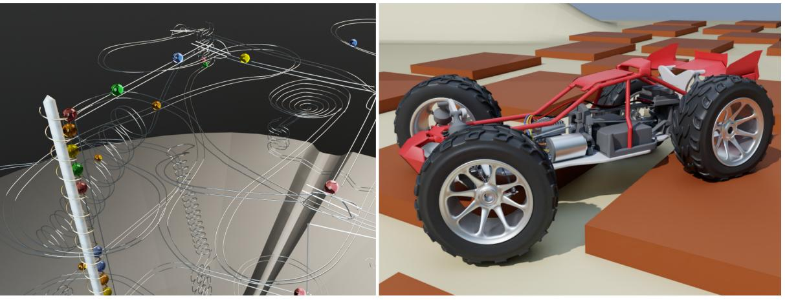

Figure 1: *Our method allows the stable simulation of a rolling ball sculpture with fast moving marbles and collisions against curved geometry as well as a remote controlled car racing over obstacles with deformable tires.*

# Abstract

*We present a rigid body simulation method that can resolve small temporal and spatial details by using a quasi explicit integration scheme that is unconditionally stable. Traditional rigid body simulators linearize constraints because they operate on the velocity level or solve the equations of motion implicitly thereby freezing the constraint directions for multiple iterations. Our method always works with the most recent constraint directions. This allows us to trace high speed motion of objects colliding against curved geometry, to reduce the number of constraints, to increase the robustness of the simulation, and to simplify the formulation of the solver. In this paper we provide all the details to implement a fully fledged rigid body solver that handles contacts, a variety of joint types and the interaction with soft objects.*

# CCS Concepts

• *Computing methodologies* → *Simulation by animation; Interactive simulation;*

Keywords: Rigid body simulation, soft body simulation, position based dynamics

# 1. Introduction

Rigid body simulation lays at the heart of every game engine and plays a major role in computer generated special effects in movies. The central aspects of a rigid body simulation are contact and joint handling. Two popular approaches exist for collision handling, namely penalty methods and impulse based methods. Penalty methods use forces caused by penetrating bodies for separation. These methods are rarely used in games and films because large forces and small time steps are needed to make colliding bodies look rigid. Recently, penalty methods have gained popularity in connection with differentiable simulations because they generate smooth trajectories.

The most popular approach is to use impulses, however. Mirtich and Canny [\[MC95\]](#page-10-0) laid the foundation for impulse based

c 2020 The Author(s)

Computer Graphics Forum c 2020 The Eurographics Association and John Wiley & Sons Ltd. Published by John Wiley & Sons Ltd.

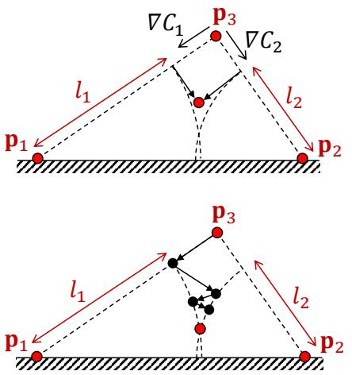

Figure 2: Non-linear Gauss-Seidel: Points  $p\_1$  and  $p\_2$  are fixed to
the ground. The distances from the top point  $p\_3$  to  $p\_1$  and  $p\_2$  are
constrained to be  $l\_1$  and  $l\_2$  respectively. Finding a position for  $p\_3$ 
which satisfies both constraints is a non-linear positional problem.
By working with velocities or by solving it globally the constraint
gradients get fixed. In these cases the red point above the true so-
lution is found no matter how many iterations are applied. To find
the true solution, multiple linear solves have to be performed. A
non-linear Gauss-Seidel solver works on the non-linear positional
problem directly. It updates the gradients after each individual con-
straint projection and converges to the true solution without the
danger of overshooting.rigid bodies simulation in graphics and games in the mid nineties. Hecker [\[Hec97\]](#page-10-1) introduced the concepts to game developers and Baraff [\[Bar97\]](#page-10-2) to the computer graphics community. Here, the velocities are changed immediately at impacts by applying impulses instead of applying accelerations caused by forces. Conceptually, these methods work on the velocities directly omitting the acceleration layer.

Simulating objects with dynamically changing positions **and** orientations is a non-linear problem. However, freezing a spatial configuration and solving for velocities results in a linear system of equations. Contacts yield inequality constraints so in general, a linear complementarity problem (LCP) has to be solved which is – as the name indicates – still linear. The space of velocities can be viewed as the tangent space to the non-linear space of spatial states at the current configuration. Working within the linear space of velocities is therefore more convenient than working with positions and orientations directly. However, one of the main drawbacks of this approach is the problem of drift because a velocity solver does not see positional errors. Existing engines solve this problems with a variety of methods such as introducing additional forces or constraints.Position based dynamics (PBD) [\[MHR06,](#page-11-0) [Sta09\]](#page-11-1) solves this problem by working with positions directly. Velocities are derived after the solve as the difference between the configuration at the end and the beginning of the time step.

PBD has mostly been used for the simulation of constrained particle systems to simulate cloth and soft bodies until Macklin et al. [\[MM13\]](#page-11-2) devised a way to handle fluids as well. This allowed the development of a particle based unified solver in the position based framework [\[MMCK14\]](#page-11-3) by the same group. They used the idea of shape matching [\[MHTG05\]](#page-11-4) to simulate rigid bodies as a collection of rigidly connected particles. However, the cost of shape matching grows with the number of particles, impulse propagation is slow and handling joints difficult. A more effective way is to extend PBD beyond particles and simulate rigid bodies as single entities by introducing rotational states. Deul et al. [\[DCB14\]](#page-10-3) formulated this type of rigid body dynamics in the positional framework of PBD.

Working with velocities or linearizing the positional problem for  
an iteration of a global solver both have one aspect in common:  
they freeze the constraint directions for the time of the linear solve,  
i.e. over several iterations [\[MEM\\*19](#MEM*19), ST96, KSJP08]. In this case,  
contacts have to be treated as local planes and coulomb friction  
cones as polyhedra. Also, constraints in three dimensions such as  
an attachment yield three constraint equations. In contrast, algo-  
rithms based on solving local contact problems with methods such  
as Gauss-Seidel allow contact geometry to change at each itera-  
tion. This approach has been used to model smooth isotropic fric-  
tion [\[Erl17](#Erl17), DBDB11]. We extend this approach to also allow con-  
tact normal geometry to change each iteration.The original PBD approach uses the non-linear projected Gauss-Seidel (NPGS) method to solve the non-linear positional equations. NPGS is fundamentally different from applying the regular or projected Gauss-Seidel (PGS) method to the linearized equations. Figure [2](#page-1-0) visualizes this difference. The key is that after each individual constraint solve, the positions are immediately updated. In this way, PBD works on the non-linear problem directly, increasing both robustness and accuracy. Round friction cones or collisions against curved objects are easy to handle. Instead of storing contacts as references to a pair of objects together with a static normal which results to a contact plane, we only store the references and recompute the normal before every individual solve of the specific contact. A less expensive way would be to store the local contact geometry as in the traditional approach but using a higher-order approximation.

Due to these advantages, our goal was to extend PBD in a way that allows the implementation of a fully fledged rigid body engine but without sacrificing its simplicity. We will provide all the algorithms on a level that allows an immediate implementation.

However, PBD has had the reputation of being non-physical and too much of a simplification based on the following concerns:

- It does not use physical quantities and units
- The stiffness is iteration and time step dependent
- The integration is not physically accurate
- It is dependent on the order of constraint handling
- It depends on mesh tessellation
- It converges slowly

Fortunately, all these concerns have been addressed recently with the result that our proposed solver is a serious competitor to other methods as we will show in the results section.

The first three concerns have been addressed in [\[MMC16\]](#page-11-7). Ex-

tended PBD (XPBD) adds a small extension to the original approach which makes stiffness independent of the iteration count and time step size with physical units and allows measuring forces and torques. The authors also show that XPBD is a close approximation of implicit Euler integration. An important feature of XPBD is that compliance is used which is the inverse of stiffness. This means we can easily handle infinitely stiff constraints in a robust way by setting the compliance to zero. In this case XPBD falls back to PBD.

The solution returned from Gauss-Seidel methods is in general dependent on the ordering of the constraint solve. There are situations in which this order dependence is valuable, for instance to control error propagation. However, the dependence can be removed by using Jacobi, or symmetric successive over relaxation (SSOR) iterations. PBD can also handle constraints that are based on continuum mechanics with common finite element (FEM) constitutive models [\[MMC16\]](#page-11-7). This alleviates the problem of mesh dependent stiffness present in more ad-hoc energy models.

Finally, the concern regarding slow convergence was addressed most recently in [\[MSL](#page-11-8)∗19]. By replacing solver iterations with substeps, Gauss-Seidel and Jacobi methods become competitors of global solvers in terms of convergence. Substepping in combination with one NPGS iteration per substep yields a method that looks computationally almost identical to an explicit integration step, but with the advantage of being unconditionally stable due to the usage of compliance. We call it a *quasi-explicit* method.

The findings described in [\[MSL](#page-11-8)∗19] about substepping are surprising and somewhat unintuitive. Substepping is not just the reduction of the time step size. The important concept is the *simulation time budget* per frame which is typically constant in real-time applications and given by the number of sub-steps times the number of solver iterations per substep. One extreme choice is to only use one substep and spend all the time budget with solving the equations to high accuracy. The other extreme is to use as many substeps as possible and only use a single iteration to solve the equations approximately. The surprising fact which we will demonstrate in this paper as well is that the best choice in terms of accuracy of the simulation is to choose the maximum number of substeps with one iteration each. Substepping is not only optimal for accuracy, it also reveals high frequency temporal detail that is missed when using large time steps. Substepping also improves energy conservation significantly and reduces the chances of missing collisions via tunneling.

Since using one iteration is the best choice in terms of accuracy, the number of substeps can be derived from the time budget and since we use XPBD which allows the use of true physical quantities, there is no need to tune any parameters. Due to the unconditional stability of XPBD, there is no need to tune the time step sizes for stability reasons either.

#### 2. Related Work

Rigid body simulation has a long history in computer graphics. For a comprehensive overview of the field we refer the reader to the recent survey by Bender et al. [\[BET14\]](#page-10-7). It covers most of the important work in this field published since the state of the art report

 c 2020 The Author(s) Computer Graphics Forum c 2020 The Eurographics Association and John Wiley & Sons Ltd. of Baraff [\[Bar93\]](#page-10-8). We have already mentioned most of the specific work that is closely related to our method in the introduction. Here we add a few more approaches to that list.

Our method focuses on the handling of varying contact normals. To handle time-varying contact areas, Xu et al. [\[XZB14\]](#page-11-9) proposed a simulation method based on semi-implicit integration. They use analytic contact gradients in connection with a penalty formulation. The stability is increased by using symbolic Gaussian elimination. To increase the fidelity of contact handling, Wang et al. [\[WSPJ17\]](#page-11-10) precompute spatially and directionally varying restitution coefficients by treating a body as a stiff deformable object and solve a proxy contact problem. Using this data results in more realistic bouncing behavior during simulation.

Implicit position-based time discretizations and constraints have been used in the computer-aided design (CAD) and multibody dynamics software, such as ADAMS and MBDyn [\[OCC77,](#page-11-11) [Rya90,](#page-11-12) [MMM14\]](#page-11-13). They most often use penalty models of contact that require carefully tuned parameters, and do not allow for perfectly hard contact response. Offline multibody dynamics software may also use higher-order integration schemes such as second order implicit Euler (BDF2) that increase the accuracy of the simulation of objects in free flight. However, for non-smooth trajectories, typical situation in rigid body simulations with contact, we found higher-order integration may yield spurious and unpredictable collision response. This motivates our use of small time-steps and complementarity-based contact models.

One of the advantages of our method is the natural handling of coupled simulations with rigid and soft bodies. Galvez et al. [\[GCC\\*\]](#page-2-1) simulate the non-smooth dynamics of systems with rigid and deformable bodies by linking them with kinematic joints. The resulting contact problem is formulated using a mixed augmented Lagrangian method. The equations of motion are integrated with a non-smooth generalized- $\alpha$  time integration scheme.To handle rigid bodies, we augment the particles with orienta-  
tion information. Müller et al. [\[MC11\]](#page-2-0) used this idea to stabilize  
the simulation of soft objects via shape matching. Later Umetani  
et al. [\[USS15\]](#page-2-0) leveraged the same idea to simulate position based  
elastic rods.The most closely related method to our approach is the work of
Deul et al. [\[DCB14\]](#DCB14). They developed a formulation of rigid body
dynamics in the positional framework of PBD. Their ideas are for-
mulated somewhat vaguely, however. An example is the short para-
graph about joints which only discusses one joint type and does not
address joint limits – a central feature of rigid body engines. In the
results section we will present various examples which rely on the
handling of hard and soft joint limits. We also describe collision
against rounded objects. A central difference is the use of XPBD
instead of PBD which not only allows the use of physical param-
eters but also allows the derivation of forces and torques at joints
and contacts.

#### 3. Position Based Rigid Body Simulation

We first recap the original position based simulation algorithm for constrained particle systems.

M. Müller et al. / Detailed Rigid Body Simulation with Extended Position Based Dynamics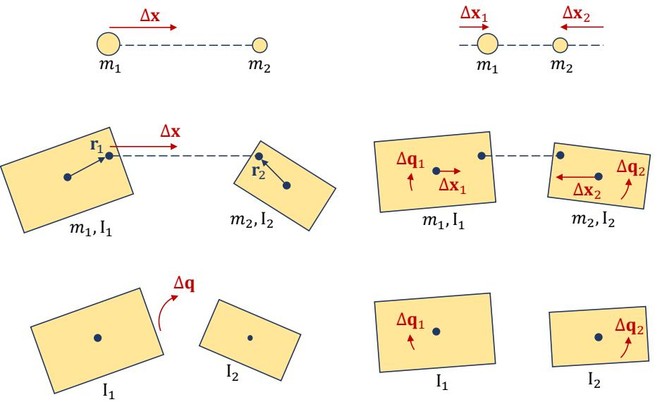

Figure 3: The basic correction operations. Top: traditional particle based PBD. A positional correction vector  $\Delta \mathbf{x}$  is applied to a pair of
particles. This correction is distributed among both particles proportional to their inverse mass to conserve linear and angular momentum.
Middle: applying a positional correction to points  $\mathbf{r}\_1$  and  $\mathbf{r}\_2$  on a pair of rigid bodies results in a pair of positional corrections  $\Delta \mathbf{x}\_1$  and  $\Delta \mathbf{x}\_2$ 
applied to the centers of mass as well as a pair of rotational corrections  $\Delta \mathbf{q}\_1$  and  $\Delta \mathbf{q}\_2$  proportional to a combination of their inverse masses
and inverse moments of inertia. Bottom: a rotational correction  $\Delta \mathbf{q}$  is applied to two bodies – in this case to align their orientations. The
rotational correction is distributed among the two bodies proportional to their inverse moments of inertia while the centers of mass are not
affected.

## 3.1. Particle Simulation Loop

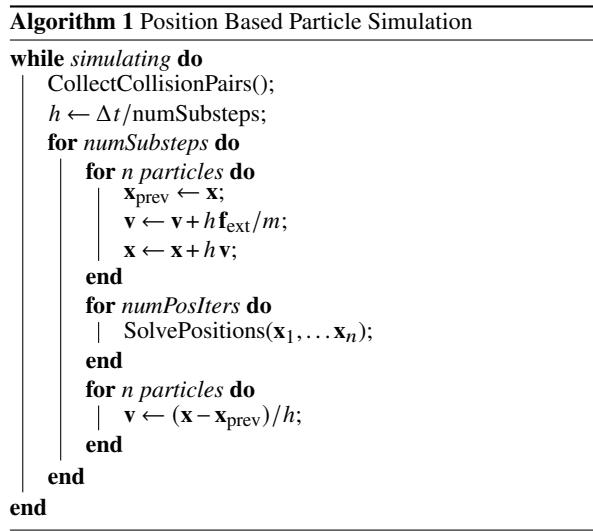

Algorithm 1 shows the simulation loop. Here we already in-
cluded the idea of substepping for which  $\Delta t$  is the time step size
and *h* the substep size. During the first loop of each substep, the
particle's positions  $x\_i$  and velocities  $v\_i$  are explicitly integrated
taking only the external forces  $f\_{\text{ext}}$  such as gravity into account.
The second loop implements the core implicit solver. The proce-
dure "SolvePositions" iterates through all constraints (either Gauss-Seidel or Jacobi style) and moves the positions of the particles us-  
ing constraint projection. Discussing this part will be our main fo-  
cus. In the third loop the new velocities are derived from the previ-  
ous and current positions. Macklin et al. [\[MSL\\*19\]](#page-3-1) showed that it  
is significantly more effective to take substeps than solver iterations  
so "numPosIters" is typically set to 1.# 3.2. Rigid Body Simulation Loop

In contrast to a particle which is described by its position  $x$ , its velocity  $v$  and its mass  $m$  alone, the state of a rigid body of finite size also contains the corresponding angular quantities. These are- • its orientation which can be described by a unit quaternion  $\mathbf{q} \in \mathbb{R}^4$ ,  $|\mathbf{q}| = 1$ ,
- - its angular velocity  $\omega \in \mathbb{R}$ 3 and
- - its inertia tensor **I**  $\in \mathbb{R}^{3x3}$ .

The angular velocity vector can be split into the unit axis of rotation and the scalar angular velocity as

$$
\omega = \omega \cdot \mathbf{n}\_{\text{rot}}.
$$

$$(1)$$

The inertia tensor I is the quantity that corresponds to the mass in
rotational terms. For basic shapes like boxes and spheres it is given
by simple formulas. Blow and Binstock [\[BB04\]](#page-3-0) devised an elegant
and short algorithm for the general case of a body that is described
by a closed triangle mesh, which simultaneously computes the cen-
ter of mass. Algorithm 2 shows the extended version of Algorithm 1
which take these additional quantities into account.*M. Müller et al. / Detailed Rigid Body Simulation with Extended Position Based Dynamics*

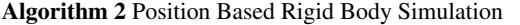

while simulating do  
 CollectCollisionPairs();  
  $h \leftarrow \Delta t / numSubsteps$ ;  
 **for** numSubsteps **do**  
 **for** n bodies and particles **do**  
  $x\_{prev} \leftarrow x$ ;  
  $v \leftarrow v + h f\_{ext} / m$ ;  
  $x \leftarrow x + h v$ ;  
   
  $q\_{prev} \leftarrow q$ ;  
  $\omega \leftarrow \omega + h I^{-1} (\tau\_{ext} - (\omega \times (I \omega)))$ ;  
  $q \leftarrow q + h \frac{1}{2} [\omega\_x, \omega\_y, \omega\_z, 0] q$ ;  
  $q \leftarrow q / |q|$ ;  
 **end**  
 **for** numPosIters **do**  
 | SolvePositions( $x\_1,... x\_n, q\_1,... q\_n$ );  
 **end**  
 **for** n bodies and particles **do**  
  $v \leftarrow (x - x\_{prev}) / h$ ;  
  $\Delta q \leftarrow q q\_{prev}^{-1}$ ;  
  $\omega \leftarrow 2 [\Delta q\_x, \Delta q\_y, \Delta q\_z] / h$ ;  
  $\omega \leftarrow \Delta q\_w \geq 0 ? \omega : -\omega$ ;  
 **end**  
 SolveVelocities( $v\_1,... v\_n, \omega\_1,... \omega\_n$ );  
 **end**  
**end**The additional lines for integrating the rotational quantities and deriving the velocities can easily be added to an existing PBD simulator. The term for integrating angular velocity including external torques and gyroscopic effects is derived from the Newton-Euler equations. We refer the reader to Brian Mirtich's excellent thesis [\[Mir96\]](#page-11-15) for a derivation. To update the quaternions based on the angular velocity and to derive the angular velocity from the change of the quaternions we use linearized formulas. They are fast and robust and well suited for the small time steps used in substepping. In contrast to simple particles, the implicit solver also manipulates the orientations of the bodies.

This position based solver allows the simultaneous and coupled simulation of both rigid and deformable objects. To achieve this we iterate through all bodies as well as all particles. For the particles we simply omit the updates of the rotational quantities.

# 3.3. Core Projection Operations

The modifications to the main loop are straightforward. The challenging part is the extension of the solver to handle constraints between finite sized bodies in a positional framework. Fortunately we only need two basic operations. The tasks of solving arbitrary joints, handling contacts or coupling rigid with soft bodies can all be built on top of these operations alone. They are visualized in Figure [3.](#page-3-1) The top row shows a distance constraint between two particles as a reference. Here a correction vector Δ**x** is applied to project the overstretched constraint to its rest length. To conserve

 c 2020 The Author(s) Computer Graphics Forum c 2020 The Eurographics Association and John Wiley & Sons Ltd. linear momentum, the correction vector is applied to both parti-  
cles proportional to their inverse masses  $w\_i = m\_i^{-1}$ . The middle  
row shows the first basic operation used for rigid bodies, namely  
applying a position correction  $\Delta x$  to solve a generalized distance  
constraint between points on two bodies. The points are defined by  
the vectors  $r\_1$  and  $r\_2$  relative to the center of mass. To conserve lin-  
ear and angular momentum, the operation changes the positions as  
well as the orientations of both bodies proportional to their general-  
ized inverse masses. The second operation is applying a rotational  
correction to two bodies as shown in the bottom row. In this partic-  
ular case, the correction is applied to align the orientations of the  
two bodies. To conserve angular momentum, it has to be distributed  
among the two bodies proportional to their inverse moments of in-  
ertia. We derive the formulas for the updates from impulse based  
dynamics in the Appendix. Here we show the final versions to be  
used in an implementation.# 3.3.1. Positional Constraints

To apply a positional correction  $\Delta x$  at positions  $r\_1$  and  $r\_2$ , we first split it into its direction  $\textbf{n}$  and its magnitude  $c$ . The latter corresponds to the evaluation of the constraint function in PBD. We then compute the two generalized inverse masses
$$w\_{1} \leftarrow \frac{1}{m\_{1}} + (\mathbf{r}\_{1} \times \mathbf{n})^{T} \mathbf{I}\_{1}^{-1} (\mathbf{r}\_{1} \times \mathbf{n}) $$
 (2)

$$w\_{2} \leftarrow \frac{1}{m\_{2}} + (\mathbf{r}\_{2} \times \mathbf{n})^{T} \mathbf{I}\_{2}^{-1} (\mathbf{r}\_{2} \times \mathbf{n}). \tag{3}$$

Following XPBD, we compute the Lagrange multiplier updates

$$
\Delta\lambda \leftarrow \frac{-c - \tilde{\alpha}\lambda}{w\_1 + w\_2 + \tilde{\alpha}} \tag{4}
$$

$$
\lambda \leftarrow \lambda + \Delta \lambda \qquad (5)
$$

where  $\tilde{\alpha} = \alpha/h^2$  and  $\alpha$  the compliance of the constraint. One mul-  
tiplier  $\lambda$  is stored for each compliant constraint. It is set to zero be-  
fore the iterative solver starts. The compliance corresponds to the  
inverse of the stiffness and has the unit meters / Newton. Working  
with the compliance allows the simulation of infinitely stiff con-  
straints by setting  $\alpha = 0$ . Setting the positional impulse  $\mathbf{p} = \Delta \lambda \mathbf{n}$  we  
update the states of the bodies immediately after each constraint  
solve via
$$\mathbf{x}\_1 \leftarrow \mathbf{x}\_1 + \mathbf{p}/m\_1\tag{6}$$

$$\mathbf{x}\_2 \leftarrow \mathbf{x}\_2 - \mathbf{p}/m\_2\tag{7}$$

$$\mathbf{q}\_1 \leftarrow \mathbf{q}\_1 + \frac{1}{2} \left[ \mathbf{I}\_1^{-1} (\mathbf{r}\_1 \times \mathbf{p}), 0 \right] \mathbf{q}\_1 \tag{8}$$

$$\mathbf{q}\_2 \leftarrow \mathbf{q}\_2 - \frac{1}{2} \left[ \mathbf{I}\_2^{-1} (\mathbf{r}\_2 \times \mathbf{p}), 0 \right] \mathbf{q}\_2. \tag{9}$$

Note the minus sign in the update of the second body. Immediately updating the bodies after handling each constraint prevents overshooting and is one of the causes of PBD's robustness. This results in a non-linear projected Gauss-Seidel solve. Alternatively a Jacobi solve can be used for parallel implementations or to remove the dependence on the order of constraint projection but at the cost of slower convergence. In this case, the updates are accumulated and applied after each iteration through all constraints. After the
solve, the forces acting along the constraint can be derived as
$$\mathbf{f} = \lambda \mathbf{n} / h^2. \tag{10}$$

Connecting a rigid body and a soft body defined as a constrained
particle system is straightforward because each body can be re-
placed with a single particle by setting  $w \leftarrow m^{-1}$  and omitting the
update of the orientation.## 3.3.2. Angular Constraints

For joints we need the ability to constrain the mutual orientation of  
two bodies. In this case the correction is a rotation vector  $\Delta \mathbf{q} \in \mathbb{R}^3$ .  
We split it into its direction  $\mathbf{n}$  which is the rotation axis and its  
magnitude  $\theta$  which is the rotation angle. The generalized inverse  
masses are
$$\mathbf{w}\_{\parallel} = \mathbf{n}^T \mathbf{I}\_{\parallel}^{-1} \mathbf{n} \tag{11}$$

$$\mathbf{w}\_2 = \mathbf{n}^T \mathbf{I}\_2^{-1} \mathbf{n} \tag{12}$$

The XPBD updates are the same as before with the angle replac-
ing the distance
$$
\Delta\lambda \leftarrow \frac{-\theta - \tilde{\alpha}\lambda}{w\_1 + w\_2 + \tilde{\alpha}} \tag{13}
$$

$$
\lambda \leftarrow \lambda + \Delta \lambda. \tag{14}
$$

This time, the correction only affects the orientations as

$$\mathbf{q}\_1 \leftarrow \mathbf{q}\_1 + \frac{1}{2} \left[ \mathbf{I}\_1^{-1} \mathbf{p}, 0 \right] \mathbf{q}\_1 \tag{15}$$

$$\mathbf{q}\_2 \leftarrow \mathbf{q}\_2 - \frac{1}{2} \left[ \mathbf{I}\_2^{-1} \mathbf{p}, 0 \right] \mathbf{q}\_2. \tag{16}$$

It is important to note that the inertia tensor **I** depends on the actual orientation of the body. Therefore, it would have to be updated after every constraint projection. Instead, we project the quantities **n**, **r** and **p** into the rest state of the bodies before evaluating the expressions above. For joints, the attachment points **r** are typically defined in the rest state already. In addition, we rotate the bodies in the rest state such that the inertia tensor becomes diagonal which simplifies the expressions above and allows storing the tensor as a vector. Analogous to Equation (10) we can derive the torque exerted as
$$\tau = \lambda \mathbf{n} / h^{2}.$$
 (17)

#### 3.4. Joints

We now describe how to handle joints of various types using the two correction operations defined in the previous section. Joints attach pairs of bodies and restrict relative positional and rotational degrees of the bodies.#### 3.4.1. Rotational Degrees of Freedom

For a joint that aligns the mutual orientations of two bodies we compute the angular correction as follows:

$$\mathbf{q} = \mathbf{q}\_1 \,\mathbf{q}\_2^{-1} \tag{18}$$

$$
\Delta \mathbf{q}\_{\mathrm{fixed}} = 2(q\_{x}, q\_{y}, q\_{z}). \tag{19}
$$

To setup more general joints, an attachment point  $\bar{\mathbf{r}}$  as well as a set of perpendicular unit axes [ $\bar{\mathbf{a}}$ ,  $\bar{\mathbf{b}}$ ,  $\bar{\mathbf{c}}$ ] have to be defined on both bodies in the shape. To handle the joint, these are first transformed into world space vectors  $\mathbf{r}$  and [ $\mathbf{a, b}$  and  $\mathbf{c}$ ].For a hinge joint, we want the axes  $a\_1$  and  $a\_2$  to be aligned. To achieve this we apply
$$
\Delta \mathbf{q}\_{\text{hinge}} = \mathbf{a}\_1 \times \mathbf{a}\_2. \tag{20}
$$

To drive a hinge joint towards a specified target angle  $\alpha$  we rotate
**b**1 about **a**1 by then angle  $\alpha$  to get **b**target and apply
$$
\Delta \mathbf{q}\_{\text{target}} = \mathbf{b}\_{\text{target}} \times \mathbf{b}\_2. \tag{21}
$$

The corresponding compliance  $\alpha$  controls the stiffness of the constraint. With a target angle constraint we can create a velocity driven motor by updating the target angle via  $\alpha \leftarrow \alpha + h v$  at every substep, where  $v$  is the target velocity of the motor and the corresponding compliance its strength.Handling joint limits is an essential part of a rigid body engine. For the rotational degrees of freedom this amounts to limiting joint angles. To do this we use the generic procedure defined in Algorithm 3. It limits the angle between the axes  $\mathbf{n}\_1$  and  $\mathbf{n}\_2$  of two bodies to be in the interval  $[\alpha,\beta]$  using the common rotation axis  $\mathbf{n}$ .

Algorithm 3 Handling joint angle limits.

| LimitAngle (n, n1, n2, α, β):  |
|--------------------------------|
| φ ← arcsin((n1 × n2) · n);     |
| if n1 · n2 < 0 then φ ← π - φ; |
| if φ > π then φ ← φ - 2π;      |
| if φ < -π then φ ← φ + 2π;     |
| if φ < α or φ > β then         |
| φ ← clamp(φ, α, β);            |
| n1 ← rot(n, φ) n1;             |
| Apply(Δqlimit = n1 × n2);      |
| end                            |
| return                         |

For hinge joints with common axis  $a\_1 = a\_2$  we use  $[\mathbf{n}, \mathbf{n}\_1, \mathbf{n}\_2] = [\mathbf{a}\_1, \mathbf{b}\_1, \mathbf{b}\_2]$ .For spherical joints (also called ball-in-socket joints) we have to distinguish between swing and twist limits for the motion of axis  $a\_2$  w.r.t. axis  $a\_1$ . To restrict swing we use  $[\mathbf{n}, \mathbf{n}\_1, \mathbf{n}\_2] = [\mathbf{a}\_1 \times \mathbf{a}\_2, \mathbf{a}\_1, \mathbf{a}\_2]$ . Twist must be decoupled from swing. We achieve this with the following axes:
$$\mathbf{n} \leftarrow (\mathbf{a}\_1 + \mathbf{a}\_2) / (|\mathbf{a}\_1 + \mathbf{a}\_2|) \tag{22}$$

$$\mathbf{n}\_{1} \leftarrow \mathbf{b}\_{1}- (\mathbf{n} \cdot \mathbf{b}\_{1}) \mathbf{n}; \; \mathbf{n}\_{1} \leftarrow |\mathbf{n}\_{1}| \qquad (23)$$

$$\mathbf{n}\_2 \leftarrow \mathbf{b}\_2 - (\mathbf{n} \cdot \mathbf{b}\_2)\,\mathbf{n};\quad\mathbf{n}\_2 \leftarrow |\mathbf{n}\_2|\tag{24}$$

Computer Graphics Forum © 2020 The Eurographics Association and John Wiley & Sons Ltd. © 2020 The Author(s)All limits can be made soft by using  $\alpha > 0$ .

#### 3.4.2. Positional Degrees of Freedom

Handling the positional degrees of freedom is simpler. We first
compute the positional offset as  $\Delta \mathbf{r} = \mathbf{r}\_2 - \mathbf{r}\_1$ . Setting  $\Delta \mathbf{x} = \Delta \mathbf{r}$  at-
taches the bodies without separation which is the typical case for
joints. Using  $\alpha > 0$  allows the simulation of a spring with zero rest
length. We can make this more flexible by defining an upper limit
 $d\_{\text{max}}$  for the separation distance. In this case we only apply a cor-
rection if  $|\Delta \mathbf{r}| > d\_{\text{max}}$  and use the correction
$$
\Delta \mathbf{x} = \frac{\Delta \mathbf{r}}{|\Delta \mathbf{r}|} \left( |\Delta \mathbf{r}| - d\_{\text{max}} \right). \tag{25}
$$

We can also relax the fixed attachment by allowing the bodies
to move within boundaries along a subset of the axes. For this we
start with  $\Delta \mathbf{x} = 0$ . For the first axis  $\mathbf{a}\_1$  we compute the projected
displacement  $a = \Delta \mathbf{r} \cdot \mathbf{a}\_1$ . If  $a < a\_{min}$  we add  $\mathbf{a}\_1 (a - a\_{min})$  to the
correction vector, if  $a > a\_{max}$  we add  $\mathbf{a}\_1 (a - a\_{max})$ . We do this for
all axes and all limits before we apply the final correction vector.
This way, all limits are treated with a single constraint projection.Setting all limits except the ones for the first axis to zero simu-lates a prismatic joint. For a robot we might want to drive the joint to a particular offset. Replacing  $d\_{\text{max}}$  by  $d\_{\text{target}}$  in Eqn.(25) and applying the correction unconditionally achieves this. Choosing a compliance of  $\alpha = 1/f(|\Delta \mathbf{r}| - d\_{\text{target}})$  applies a force  $f$ .Joint handling shows the advantage of working on the positional  
layer with the non-linear Gauss-Seidel approach. Unilateral con-  
straints are simply handled by applying corrections only when cer-  
tain conditions hold. Also, the corrections are always aligned with  
the current offsets and errors. In addition, attachments are handled  
with a single constraint instead of three in linearized solvers.#### 3.5. Handling Contacts and Friction

To save computational cost we collect potential collision pairs  
once per time step instead of once per sub-step using a tree of  
axis aligned bounding boxes. We expand the boxes by a distance  
 $k \Delta t v\_{body}$ , where  $k \ge 1$  is a safety multiplier accounting for poten-  
tial accelerations during the time step. We use  $k = 2$  in our exam-  
ples.At each substep we iterate through the pairs checking for actual
collisions. If a collision occurs we compute the current contact nor-
mal and the local contact positions  $\mathbf{r}\_1$  and  $\mathbf{r}\_2$  with respect to body
1 and 2. We also initialize two Lagrange multipliers for the normal
and tangential forces  $\lambda\_n$  and  $\lambda\_t$  with zero. To handle a contact dur-
ing the position solve we compute the contact positions on the two
bodies at the current state and before the substep integration as
$$\mathbf{p}\_{1} = \mathbf{x}\_{1} + \mathbf{q}\_{1} \mathbf{r}\_{1}$$

$$\mathbf{p}\_{2} = \mathbf{x}\_{2} + \mathbf{q}\_{2} \mathbf{r}\_{2}$$

$$\bar{\mathbf{p}}\_{1} = \mathbf{x}\_{1,\text{prev}} + \mathbf{q}\_{1,\text{prev}} \mathbf{r}\_{1} \text{ and}$$

$$\bar{\mathbf{p}}\_{2} = \mathbf{x}\_{2,\text{prev}} + \mathbf{q}\_{2,\text{prev}} \mathbf{r}\_{2},$$

$$(26)$$

where the product of a quaternion and a vector refers to rotating
the vector using the quaternion. The current penetration can be
computed as  $d = (\mathbf{p}\_1 - \mathbf{p}\_2) \cdot \mathbf{n}$ . If  $d \leq 0$  we skip the contact. The
© 2020 The Author(s)  

Computer Graphics Forum © 2020 The Eurographics Association and John Wiley & Sons Ltd.
non-linear Gauss-Seidel solver lets us handle the complementarity
condition by simply checking it on a per constraint basis. If the
bodies are penetrating we apply  $\Delta x = d \mathbf{n}$  using  $\alpha = 0$  and  $\lambdan$ .To handle static friction we compute the relative motion of the contact points and its tangential component

$$
\Delta \mathbf{p} = (\mathbf{p}\_1 - \bar{\mathbf{p}}\_1) - (\mathbf{p}\_2 - \bar{\mathbf{p}}\_2) \tag{27}
$$

$$
\Delta \mathbf{p}\_l = \Delta \mathbf{p} - (\Delta \mathbf{p} \cdot \mathbf{n})\mathbf{n}.\tag{28}
$$

Static friction prevents tangential motion at the contact points
which is the case if  $\Delta \mathbf{p}\_t = 0$ . Therefore, to enforce static friction
we apply  $\Delta \mathbf{x} = \Delta \mathbf{p}\_t$  at the contact points with  $\alpha = 0$  but only if
 $\lambda\_t < \mu\_s \lambda\_n$ , where  $\mu\_s$  is the static friction coefficient. If the two
bodies have different coefficients, we use  $\mu = (\mu\_1 + \mu\_2)/2$ . Another
option would be to take the maximum or minimum value.#### 3.6. Velocity Level

PBD updates the velocities after the position solve and then im-  
mediately goes to the next substep. However, to handle dynamic  
friction and restitution we append a velocity solve as shown in Al-  
gorithm 2. Here we iterate once through all the contacts and update  
the new velocities.For each contact pair we compute the relative normal and tangential velocities at the contact point as

$$
\mathbf{v} \leftarrow (\mathbf{v}\_1 + \omega\_1 \times \mathbf{r}\_1) - (\mathbf{v}\_2 + \omega\_2 \times \mathbf{r}\_2)
$$

$$
v\_n \leftarrow \mathbf{n} \cdot \mathbf{v}
$$

$$
\mathbf{v}\_t \leftarrow \mathbf{v} - \mathbf{n} v\_n.
$$

$$(29)$$

The friction force is integrated explicitly by computing the velocity update

$$\Delta \mathbf{v} \leftarrow -\frac{\mathbf{v}\_{t}}{|\mathbf{v}\_{t}|} \min(h \mu\_d |f\_n|, |\mathbf{v}\_{t}|), \tag{30}$$

where \(\mu\_d\) is the dynamic friction coefficient and \(f\_n = \lambda\_n / h^2\) the

where  $\mu\_d$  is the dynamic friction coefficient and  $f\_n = \lambda\_n/h^2$  the normal force. This update corresponds to the explicit application of the dynamic Coulomb friction force. The explicit form in connection with a Gauss-Seidel update allows us to make this step unconditionally stable! The minimum guarantees that the magnitude of the velocity correction never exceeds the magnitude of the velocity itself.We also use the velocity pass to apply joint damping via

$$
\Delta \mathbf{v} \leftarrow (\mathbf{v}\_2 - \mathbf{v}\_1) \min(\mu\_{\text{lin}} h, 1) \tag{31}
$$

$$
\Delta\omega \gets (\omega\_2 - \omega\_1) \min(\mu\_{\text{ang}} h, 1). \tag{32}
$$

According to the derivation in the Appendix applying a velocity update  $\Delta v$  at positions  $r\_1$  and  $r\_2$  is achieved by the following steps:

$$\mathbf{p} = \frac{\Delta \mathbf{v}}{w\_1 + w\_2}$$

$$\mathbf{v}\_1 \leftarrow \mathbf{v}\_1 + \mathbf{p}/m\_1$$

$$\mathbf{v}\_2 \leftarrow \mathbf{v}\_2 - \mathbf{p}/m\_2$$

$$\boldsymbol{\omega}\_1 \leftarrow \boldsymbol{\omega}\_1 + \mathbf{I}\_1^{-1}(\mathbf{r}\_1 \times \mathbf{p})$$

$$\boldsymbol{\omega}\_2 \leftarrow \boldsymbol{\omega}\_2 - \mathbf{I}\_2^{-1}(\mathbf{r}\_2 \times \mathbf{p}).$$

$$(33)$$

| M. Müller et al. / Detailed Rigid Body Simulation with Extended Position Based Dynamics |  |  |  |  |  |
|-----------------------------------------------------------------------------------------|--|--|--|--|--|
|-----------------------------------------------------------------------------------------|--|--|--|--|--|

| Example       | substeps | iters/substep | time (ms/frame) |
|---------------|----------|---------------|-----------------|
| 3 Boxes       | 20       | 1             | 0.34            |
| 7 Boxes       | 20       | 1             | 0.44            |
| Pendula       | 40       | 1             | 0.07, 0.09, 0.2 |
| Bunnies       | 20       | 1             | 2.3             |
| Rolling balls | 10       | 1             | 15              |
| Coin          | 20       | 1             | 0.3             |
| Car           | 20       | 1             | 18              |
| Robot         | 20       | 1             | 0.4             |
| Rope          | 20       | 1             | 3.5             |

**Table 1:** Computation times. We used a simulation time step of  $1/60$ s per frame in all cases.

To handle restitution we also need  $\bar{v}\_n$ , the normal velocity before the PBD velocity update. We compute this quantity by applying Eqn 29 to the pre-update velocities. Given the restitution coefficient  $e$  we want the normal velocity at the contact to be  $-e\bar{v}\_n$ . By applying

$$
\Delta \mathbf{v} \leftarrow \mathbf{n} (-\nu\_n + \min(-e \,\tilde{\nu}\_n, 0)),
\tag{34}
$$

we subtract the current velocity  $v\_n$  and replace it with the reflected
velocity  $-e\overline{v}\_n$  making sure that the resulting velocity points in the
direction of the collision normal. To avoid jittering we set  $e = 0$  if
 $|v\_n|$  is small. We use a threshold of  $|v\_n| \le 2|\mathbf{g}|h$ , where  $\mathbf{g}$  is gravity.
This value corresponds to two times the velocity the prediction step
adds due to gravitational acceleration.This step also alleviates an important problem of PBD. The ve-  
locities created by the regular velocity update step of PBD are only  
meaningful if no collisions have occured during the last time step.  
Otherwise they simply reflect the penetration depth which is de-  
pendent on the time discretization of the trajectory. Also, if objects  
are created in an overlapped state, PBD yields large separating ve-  
locities. Eqn (34) eliminates the derived velocity at an impact and  
replaces it with the one from the previous time step considering the  
restitution coefficient. In the case of initially overlapping objects,  
this velocity is zero.# 4. Results

For our demos we used a system with a Core-i7 CPU at 3.6 GHz and 32 GB of RAM. Table 1 shows the simulation times per frame for the various examples.

The capabilities and performance of our method are best seen in
the accompanying video. We will first discuss a few basic technical
scenarios that we performed with our test application. The appli-
cation allows the visualization of forces, torques and elongations
at the joints. Figure 4 shows a set of boxes which are attached to
the static ceiling via distance joints. All springs have compliance
0.01 $m/N$ . The larger and smaller boxes have masses 1 and 1/8 $kg$ ,
respectively and we set gravity to 10 $m/s2$ . The simulation yields
the correct elongations and forces independent of the number of
iterations and sub-steps.The same holds for joint torques. Figure 5 shows a bar that is attached via a hinge joint which has a target angle of zero degrees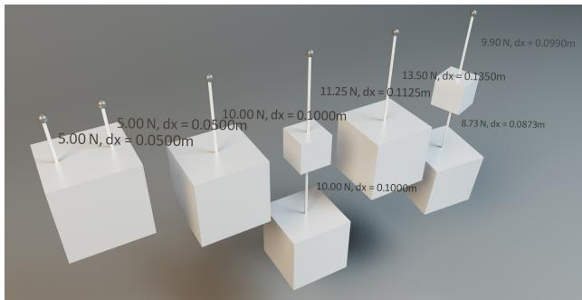

Figure 4: Our test application allows the visualization of forces, torques and elongations dynamically. Compliance, forces and elongation are in the correct relation independent of the substep and iteration counts.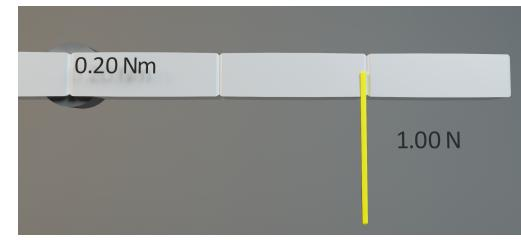

**Figure 5:** The yellow line shows a spring with a fixed compliance that is attached to the mouse. This bar is attached on the left via a hinge joint that has a target angle of zero with zero compliance. The joint applies the correct torque to hold the bar straight.

with zero compliance. It exerts the correct torque to counteract the force that is applied by the user a distance of  $20cm$  away from the rotation center. With XPBD it is straightforward to specify an infinitely stiff joint by setting the compliance to zero which is not the case for force or impulse based systems.Figure 6 shows an experiment with large mass ratios. A small
box of one gram is attached to the static ceiling via a distance
joint. Below it hangs a heavy box of one kilogram attached via an-
other distance joint. The experiment is duplicated with compliances
0.01, 0.001 and  $0 \text{ m}/N$ . Our method handles this situation stably. In
the case of non-zero compliance, the distances are proportional to
the forces. In the case of zero compliance the distance remains zero
independent of the force. With 20 substeps a small error at the top
joint remains.In Figure 7 we show prismatic, hinge and ball-in-socket joint with various joint limits and target angles and target offsets. With simple hinge joints it is possible to reproduce the behavior of a double, a triple and a closed loop pendulum as shown in Figure 8. The typical chaotic motion only emerges with small time steps and a small amount of damping. With 40 substeps and one iteration the pendula keep on swinging for a long time. Using 1 substep but an arbitrary number of solver iterations - 100 in our example - the pendula come to rest very quickly. Figure 9 shows the evolution of the*M. Müller et al. / Detailed Rigid Body Simulation with Extended Position Based Dynamics*

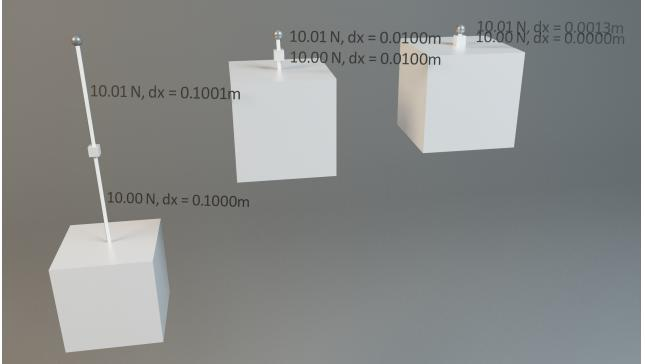

Figure 6: Handling large mass ratios: A small box of 1 gram is
attached to the ceiling via a distance constraint and holds a box
of 1 kilogram via a second joint. The compliances of the joints are
from left to right 0.01, 0.001 and 0 mN.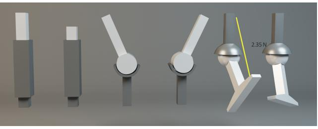

**Figure 7:** With our method we can create a variety of joint types with target angles and soft and hard joint limits.

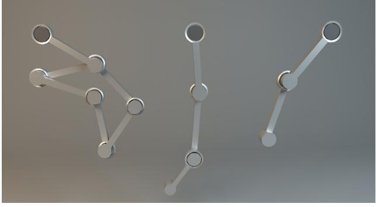

Figure 8: *Substepping yields the correct behavior of the double and triple pendula. We can easily simulate a closed loop pendulum as well.*

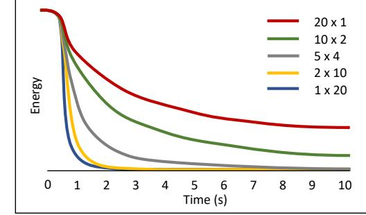

Figure 9: *Energy conservation during the simulation of the triple pendulum dependent on the number of substeps and solver iterations.*

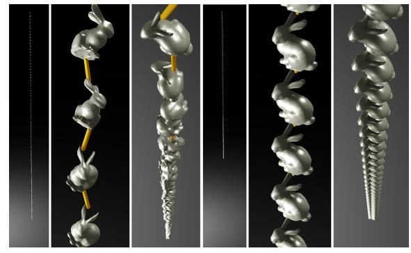

Figure 10: *The simulation of a chain of 100 bunnies hanging from the ceiling demonstrates the effectiveness of substepping. Left: 1 substep, 20 iterations, right: 20 substeps, 1 iteration.*

energy during the simulation of the triple pendulum dependent on the number of substeps and solver iterations. As discussed before, the best choice is to replace all solver iterations by substeps.

To verify that this is the case for constraint errors as well, we created a chain of 100 bunnies hanging from the ceiling as shown in Figure [10.](#page-8-4) We tested a variety of substep and iteration count combinations for a fixed time budget. Figure [11](#page-8-5) shows the relative

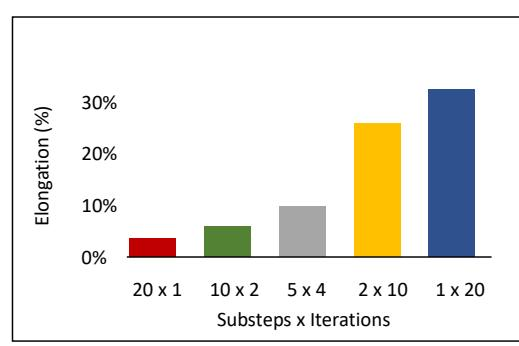

Figure 11: *Elongation of the bunny chains dependent on the number of substeps and solver iterations*

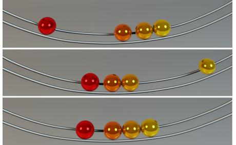

Figure 12: *From top to bottom: Initial condition, after the hit of the red marble using our velocity pass and a restitution of 1 and the state resulting from the regular PBD velocity derivation.*

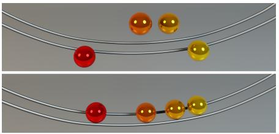

Figure 13: *The marbles are created penetrating the wires. Top: Regular PBD creates large velocities causing the marbles to jump off the track. Bottom: The marbles are pushed up gently and remain on the track.*

elongation of the chain for each case. Again, replacing all solver iterations by substeps is by far the best choice. The accompanying video shows the impressive difference in behavior.

The velocity pass we described in Section [3.6](#page-6-2) yields proper impulse propagation as shown in Figure [12.](#page-9-0) Here a single marble hits a group of three marbles from the right. The impulse is correctly transferred to the right most marble as shown in the middle. The bottom image shows the situation after the hit when using the velocity derivation of PBD.

In the scene shown in Figure [13](#page-9-1) the marbles penetrate the wires in the initial state. The velocity derivation of PBD yields large velocities causing the marbles jumping off the track (top image) while they stay on the track with our method (bottom image).

We created two larger scenes tailored to demonstrate the advantages of our method: a rolling ball sculpture and a remote controlled car travelling over bumpy terrain and obstacles shown in Figure [1.](#page-0-0)

The rolling ball demo is an attempt to reproduce the fascinating sculptures of David Morell [\[Mor\]](#page-11-16) including the clever mechanisms in a simulation. In certain elements such as the spring shown in Figure [14](#page-9-2) the marbles perform a quarter turn in a single time step. Simulating such fast curved motions requires substepping and the use of current constraint normals for each projection. Here, the most expensive part is collision handling, in particular finding the closest point on a Hermite spline segment. Our method also allows us to reproduce the high frequency motion of a coin before it comes to rest as shown in Figure [15.](#page-9-3)

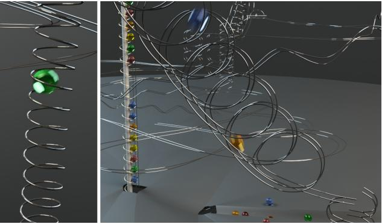

Figure 14: *In certain elements of the sculpture the marbles perform large turns in a single time step which requires the use of current constraint directions for each projection.*

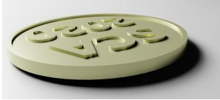

Figure 15: *With the ability of handling curved geometry and substepping we are able to reproduce the high frequency motion of a coin shortly before it comes to rest.*

The simulation of the remote controlled car demonstrates how our method handles the coupling of the soft body tires with the rigid rims. It also shows how well sub-stepping handles large mass ratios. We simulate the entire steering mechanism from servo to wheels as shown in Figure [16.](#page-9-4) The mass ration between the servo arm and the wheels is 1:760. The servo arm is 3cm long while the wheels have a diameter of 15cm. Nevertheless, the servo motor is strong enough to turn the big wheels at high speed against the obstacles and the terrain. Using actual constraint directions is important because a remote controlled car experiences much higher accelerations and changes in direction than a regular car. Our method also resolves the high frequency vibrations giving the feel for the high stiffness of the springs. The most expensive part is the simulation of the wheels. We have found that using FEM on tetrahedra did not yield the stiffness needed within the time budget. Instead, we perform

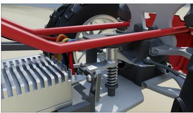

Figure 16: *We simulate the steering mechanism from the small arm at the servo to the big wheels with a mass ratio of 1:760.*

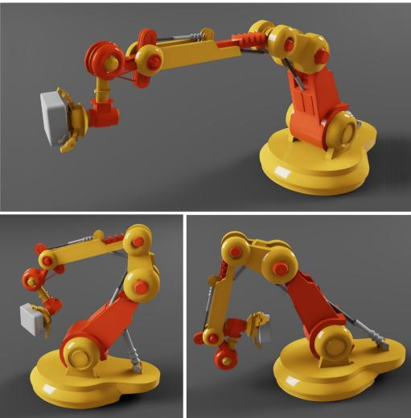

Figure 17: *Our method can be used to solve inverse kinematics problems for overconstrained systems with possibly redundant degrees of freedom such as this robot arm.*

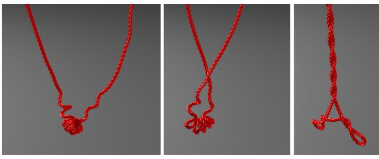

Figure 18: *The separate handling of swing and twist limits allows the simulation of a twisted rope.*

per element shape matching [\[MHTG05\]](#page-11-4) on the 1100 hexahedral elements of the tires.

Finally we created two scenarios to show the importance and usefulness of joint limit handling. Figure [17](#page-10-12) shows that our method can be used to solve the inverse kinematic problem to make the robot gripper following the gray box while respecting all joint limits. Unreachable positions yield overconstrained problems which our method handles gracefully by moving the gripper as close as possible to the target pose. Our method allows the user to specify independent limits on swing and twist degrees of freedom with different compliances. This allows us to simulate the twisted rope shown in Figure [18](#page-10-13) with the correct behavior as a simple chain of 100 capsules connected by spherical joints.

# 5. Conclusion

We have presented a rigid body simulation method than can accurately resolve small temporal and spatial detail. Because it is based on XPBD, it inherits XPBD's simplicity and ability to handle infinitely stiff joints. Substepping increases accuracy and energy

 c 2020 The Author(s) Computer Graphics Forum c 2020 The Eurographics Association and John Wiley & Sons Ltd. conservation. It also allows the handling of large mass ratios and fast directional changes within a single time step. We have shown that two basic projection operations are sufficient to build a fully fledged rigid body engine in a straightforward way. For snippets of source code we refer the reader to our challenges page [\[Mue20\]](#page-11-17).

A drawback of substepping is that it does not damp out high frequency vibrations due to reduced numerical damping. This can yield visual jittering. However, numerical damping can easily be reintroduced by adding true physical damping. Also, for small time steps, double precision floating point numbers are required. While doubles are as fast as floats on CPUs, they currently still reduce the performance on GPUs. Updating constraint directions after each projection might cause instabilities when simulating tall stacks or piles of objects. Investigating this problem is one of our directions of future work.

# References

- [Bar93] BARAFF D.: Non-penetrating rigid body simulation. *State of the art reports* (1993). [3](#page-2-0)
- [Bar97] BARAFF D.: An introduction to physically based modeling: Rigid body simulation. In *SIGGRAPH '97 Course Notes* (1997). [2](#page-1-1)
- [BB04] BLOW J., BINSTOCK A.: How to find the inertia tensor (or other mass properties) of a 3d solid body represented by a triangle mesh. [4](#page-3-2)
- [BET14] BENDER J., ERLEBEN K., TRINKLE J.: Interactive simulation of rigid body dynamics in computer graphics. *Computer Graphics Forum 33*, 1 (2014), 246–270. URL: [https://onlinelibrary.wiley.com/doi/abs/10.1111/](https://onlinelibrary.wiley.com/doi/abs/10.1111/cgf.12272) [cgf.12272](https://onlinelibrary.wiley.com/doi/abs/10.1111/cgf.12272), [arXiv:https://onlinelibrary.wiley.com/](http://arxiv.org/abs/https://onlinelibrary.wiley.com/doi/pdf/10.1111/cgf.12272) [doi/pdf/10.1111/cgf.12272](http://arxiv.org/abs/https://onlinelibrary.wiley.com/doi/pdf/10.1111/cgf.12272), [doi:10.1111/cgf.12272](https://doi.org/10.1111/cgf.12272). [3](#page-2-0)
- [DBDB11] DAVIET G., BERTAILS-DESCOUBES F., BOISSIEUX L.: A hybrid iterative solver for robustly capturing coulomb friction in hair dynamics. In *ACM Transactions on Graphics (TOG)* (2011), vol. 30, ACM, p. 139. [2](#page-1-1)
- [DCB14] DEUL C., CHARRIER P., BENDER J.: Position-based rigid body dynamics. *Computer Animation and Virtual Worlds 27*, 2 (2014), 103–112. URL: <http://dx.doi.org/10.1002/cav.1614>, [doi:10.1002/cav.1614](https://doi.org/10.1002/cav.1614). [2,](#page-1-1) [3](#page-2-0)
- [Erl17] ERLEBEN K.: Rigid body contact problems using proximal operators. In *Proceedings of the ACM Symposium on Computer Animation* (2017), p. 13. [2](#page-1-1)
- [GCC\*] GALVEZ J., CAVALIERI F. J., COSIMO A., BRÜLS  
O., CARDONA A.: A nonsmooth frictional contact formu-  
lation for multibody system dynamics. International Jour-  
nal for Numerical Methods in Engineering n/a, n/a. URL:  
[https://onlinelibrary.wiley.com/doi/abs/10.1002/](https://onlinelibrary.wiley.com/doi/abs/10.1002/nme.6371)  
nme.6371, arXiv:[https://onlinelibrary.wiley.com/](https://onlinelibrary.wiley.com/doi/pdf/10.1002/nme.6371)  
[doi/pdf/10.1002/nme.6371](https://onlinelibrary.wiley.com/doi/pdf/10.1002/nme.6371), doi:10.1002/nme.6371.3
- [Hec97] HECKER C.: The third dimension. *Game Developer Magazine* (June 1997). URL: [chrishecker.com/Rigid\\_Body\\_](chrishecker.com/Rigid_Body_Dynamics) [Dynamics](chrishecker.com/Rigid_Body_Dynamics). [2](#page-1-1)
- [KSJP08] KAUFMAN D. M., SUEDA S., JAMES D. L., PAI D. K.: Staggered projections for frictional contact in multibody systems. In *ACM Transactions on Graphics (TOG)* (2008), vol. 27, ACM, p. 164. [2](#page-1-1)
- [MC95] MIRTICH B., CANNY J.: Impulse-based simulation of rigid bodies. In *Proceedings of the 1995 Symposium on Interactive 3D Graphics* (New York, NY, USA, 1995), I3D '95, Association for Computing Machinery, p. 181–ff. URL: [https://doi.org/10.1145/199404.](https://doi.org/10.1145/199404.199436) [199436](https://doi.org/10.1145/199404.199436), [doi:10.1145/199404.199436](https://doi.org/10.1145/199404.199436). [1](#page-0-1)
- [MC11] MÜLLER M., CHENTANEZ N.: Solid simulation with oriented

particles. *ACM Trans. Graph. 30*, 4 (July 2011). URL: [https://doi.](https://doi.org/10.1145/2010324.1964987) [org/10.1145/2010324.1964987](https://doi.org/10.1145/2010324.1964987), [doi:10.1145/2010324.](https://doi.org/10.1145/2010324.1964987) [1964987](https://doi.org/10.1145/2010324.1964987). [3](#page-2-0)

- [MEM∗19] MACKLIN M., ERLEBEN K., MÜLLER M., CHENTANEZ N., JESCHKE S., MAKOVIYCHUK V.: Non-smooth newton methods for deformable multi-body dynamics. *ACM Trans. Graph. 38*, 5 (Oct. 2019). URL: <https://doi.org/10.1145/3338695>, [doi:10.](https://doi.org/10.1145/3338695) [1145/3338695](https://doi.org/10.1145/3338695). [2](#page-1-1)
- [MHR06] MÜLLER M., HENNIX B. H. M., RATCLIFF J.: Position based dynamics. *Proceedings of Virtual Reality Interactions and Physical Simulations* (2006), 71–80. [2](#page-1-1)
- [MHTG05] MÜLLER M., HEIDELBERGER B., TESCHNER M., GROSS M.: Meshless deformations based on shape matching. *ACM Trans. Graph. 24*, 3 (July 2005), 471–478. URL: [https://doi.](https://doi.org/10.1145/1073204.1073216) [org/10.1145/1073204.1073216](https://doi.org/10.1145/1073204.1073216), [doi:10.1145/1073204.](https://doi.org/10.1145/1073204.1073216) [1073216](https://doi.org/10.1145/1073204.1073216). [2,](#page-1-1) [11](#page-10-14)
- [Mir96] MIRTICH B. V.: *Impulse-based Dynamic Simulation of Rigid Body Systems*. PhD thesis, 1996. AAI9723116. [5](#page-4-1)
- [MM13] MACKLIN M., MÜLLER M.: Position based fluids. *ACM Trans. Graph. 32*, 4 (July 2013). URL: [https://doi.org/10.1145/](https://doi.org/10.1145/2461912.2461984) [2461912.2461984](https://doi.org/10.1145/2461912.2461984), [doi:10.1145/2461912.2461984](https://doi.org/10.1145/2461912.2461984). [2](#page-1-1)
- [MMC16] MACKLIN M., MÜLLER M., CHENTANEZ N.: Xpbd: Position-based simulation of compliant constrained dynamics. In *Proceedings of the 9th International Conference on Motion in Games* (New York, NY, USA, 2016), MIG '16, Association for Computing Machinery, p. 49–54. URL: [https://doi.org/10.1145/2994258.](https://doi.org/10.1145/2994258.2994272) [2994272](https://doi.org/10.1145/2994258.2994272), [doi:10.1145/2994258.2994272](https://doi.org/10.1145/2994258.2994272). [2,](#page-1-1) [3](#page-2-0)
- [MMCK14] MACKLIN M., MÜLLER M., CHENTANEZ N., KIM T.-Y.: Unified particle physics for real-time applications. *ACM Trans. Graph. 33*, 4 (July 2014). URL: [https://doi.org/10.1145/2601097.](https://doi.org/10.1145/2601097.2601152) [2601152](https://doi.org/10.1145/2601097.2601152), [doi:10.1145/2601097.2601152](https://doi.org/10.1145/2601097.2601152). [2](#page-1-1)
- [MMM14] MASARATI P., MORANDINI M., MANTEGAZZA P.: An Efficient Formulation for General-Purpose Multibody/Multiphysics Analysis. *Journal of Computational and Nonlinear Dynamics 9*, 4 (07 2014). 041001. URL: <https://doi.org/10.1115/1.4025628>, [doi:10.1115/1.4025628](https://doi.org/10.1115/1.4025628). [3](#page-2-0)
- [Mor] MORRELL D.: Rolling ball sculptures. URL: [https://www.](https://www.rollingballsculpture.com.au) [rollingballsculpture.com.au](https://www.rollingballsculpture.com.au). [10](#page-9-5)
- [MSL∗19] MACKLIN M., STOREY K., LU M., TERDIMAN P., CHEN-TANEZ N., JESCHKE S., MÜLLER M.: Small steps in physics simulation. In *Proceedings of the 18th Annual ACM SIGGRAPH/Eurographics Symposium on Computer Animation* (New York, NY, USA, 2019), SCA '19, Association for Computing Machinery. URL: [https://doi.](https://doi.org/10.1145/3309486.3340247) [org/10.1145/3309486.3340247](https://doi.org/10.1145/3309486.3340247), [doi:10.1145/3309486.](https://doi.org/10.1145/3309486.3340247) [3340247](https://doi.org/10.1145/3309486.3340247). [3,](#page-2-0) [4](#page-3-2)
- [Mue20] MUELLER M.: *Web page*, 2020. URL: [matthiasmueller.](matthiasmueller.info/challenges/challenges.html) [info/challenges/challenges.html](matthiasmueller.info/challenges/challenges.html). [11](#page-10-14)
- [OCC77] ORLANDEA N., CHACE M. A., CALAHAN D. A.: A sparsityoriented approach to the dynamic analysis and design of mechanical systems—part 1. [3](#page-2-0)
- [Rya90] RYAN R.: Adams—multibody system analysis software. In *Multibody systems handbook*. Springer, 1990, pp. 361–402. [3](#page-2-0)
- [ST96] STEWART D. E., TRINKLE J. C.: An implicit time-stepping scheme for rigid body dynamics with inelastic collisions and coulomb friction. *International Journal for Numerical Methods in Engineering 39*, 15 (1996), 2673–2691. [2](#page-1-1)
- [Sta09] STAM J.: Nucleus: Towards a unified dynamics solver for computer graphics. In *Computer-Aided Design and Computer Graphics, 2009. CAD/Graphics' 09. 11th IEEE International Conference on* (2009), IEEE, pp. 1–11. [2](#page-1-1)
- [USS15] UMETANI N., SCHMIDT R., STAM J.: Position-based elastic rods. In *Proceedings of the ACM SIGGRAPH/Eurographics Symposium on Computer Animation* (Goslar, DEU, 2015), SCA '14, Eurographics Association, p. 21–30. [3](#page-2-0)
- [WSPJ17] WANG J.-H., SETALURI R., PAI D. K., JAMES D. L.: Bounce maps: An improved restitution model for real-time rigid-body impact. *ACM Transactions on Graphics (Proceedings of SIGGRAPH 2017) 36*, 4 (July 2017). [doi:https://doi.org/10.1145/](https://doi.org/https://doi.org/10.1145/3072959.3073634) [3072959.3073634](https://doi.org/https://doi.org/10.1145/3072959.3073634). [3](#page-2-0)
- [XZB14] XU H., ZHAO Y., BARBICˇ J.: Implicit multibody penaltybaseddistributed contact. *IEEE Transactions on Visualization and Computer Graphics 20*, 9 (2014), 1266–1279. [3](#page-2-0)

# Appendix A: Appendix

#### Derivation of the Position Based Updates

In impulse based rigid body solvers, impulses are applied to bodies to change velocities at contact points. Let **r** be the vector from the center of mass to the contact point. Applying an impulse **p** at the contact point has two effects. It changes the velocity **v**cm of the center of mass and the angular velocity 𝜔 of the body via

$$\mathbf{p} = m \,\Delta\mathbf{v}\_{\text{cm}} \tag{35}$$

$$
\mathbf{r} \times \mathbf{p} = \mathbf{I} \Delta \omega,\tag{36}
$$

where 𝑚 and **I** are the mass and the moment of inertia of the body, respectively. The velocity at the contact point is

$$\mathbf{v} = \mathbf{v}\_{\text{cm}} + \boldsymbol{\omega} \times \mathbf{r}.\tag{37}$$

Given the contact normal **n** we can express both the impulse and the velocity change along the normal as scalars and derive a relationship between the two as follows:

$$
\Delta \boldsymbol{\nu} = \left[ \Delta \mathbf{v}\_{\rm cm} + \Delta \boldsymbol{\omega} \times \mathbf{r} \right] \cdot \mathbf{n} \tag{38}
$$

$$= \left[ \mathbf{p} \, m^{-1} + \left( \mathbf{I}^{-1} (\mathbf{r} \times \mathbf{p}) \right) \times \mathbf{r} \right] \cdot \mathbf{n} \tag{39}$$

$$=p\left[\mathbf{n}\,m^{-1}+\left(\mathbf{I}^{-1}(\mathbf{r}\times\mathbf{n})\right)\times\mathbf{r}\right]\cdot\mathbf{n}\tag{40}$$

$$= p \left[ \mathbf{n} \cdot \mathbf{n} m^{-1} + \left( \mathbf{I}^{-1} (\mathbf{r} \times \mathbf{n}) \right) \times \mathbf{r} \cdot \mathbf{n} \right] \tag{41}$$

$$= p \left[ m^{-1} + (\mathbf{r} \times \mathbf{n})^T \mathbf{I}^{-1} (\mathbf{r} \times \mathbf{n}) \right] \tag{42}$$

No corrections needed.

where  $w$  can be interpreted as a generalized inverse mass. Apply-
ing an impulse  $p$  at the contact point between two bodies yields
a total velocity change of  $\Delta v = \Delta v\_1 + \Delta v\_2 = p(w\_1 + w\_2)$ . In other
words, we can change the velocity at the contact point by applying
an impulse  $p = \Delta v/(w\_1 + w\_2)$ . Once the impulse is known, we can
compute the change of  $\mathbf{v}\_{cm}$  and  $\omega$  as via
$$
\Delta \mathbf{v}\_{\rm cm} = \mathbf{p} \, m^{-1} \tag{44}
$$

$$
\Delta\omega = \mathbf{I}^{-1}(\mathbf{r} \times \mathbf{p}).\tag{45}
$$

To go from the velocity to the positional level, we conceptually multiply these equations by time. This turns the velocity correction Δ**v** into a positional correction Δ**x** and the impulse into a quantity of the unit mass times distance. The definition of the generalized mass is unchanged. The update of the velocity of the center of mass turns into an update of the position of the center of mass. The update of the angular velocity turns into a rotation. To apply the rotation to the orientations we use the linearized quaternion updates from Algorithm [2.](#page-4-0)

 c 2020 The Author(s) Computer Graphics Forum c 2020 The Eurographics Association and John Wiley & Sons Ltd.