# **An approach for predicting the calibration accuracy in planar cable-driven parallel robots and experiment validation**

Bozhao Wang, Philippe Cardou, Stéphane Caro

## **To cite this version:**

Bozhao Wang, Philippe Cardou, Stéphane Caro. An approach for predicting the calibration accuracy in planar cable-driven parallel robots and experiment validation. Meccanica, 2023, 58 (11), pp.2177- 2196. ff10.1007/s11012-023-01720-yff. ffhal-04302920ff

# **HAL Id: hal-04302920 <https://hal.science/hal-04302920v1>**

Submitted on 23 Nov 2023

**HAL** is a multi-disciplinary open access archive for the deposit and dissemination of scientific research documents, whether they are published or not. The documents may come from teaching and research institutions in France or abroad, or from public or private research centers.

L'archive ouverte pluridisciplinaire **HAL**, est destinée au dépôt et à la diffusion de documents scientifiques de niveau recherche, publiés ou non, émanant des établissements d'enseignement et de recherche français ou étrangers, des laboratoires publics ou privés.

# An Approach for Predicting the Calibration Accuracy in Planar Cable-Driven Parallel Robots and Experiment Validation

Bozhao Wang?

Bozhao.Wang@ls2n.fr

Philippe Cardou† St´ephane Caro?

philippe.cardou@gmc.ulaval.ca stephane.caro@ls2n.fr

? Laboratoire des Sciences du Numerique de Nantes

UMR CNRS n◦ 6004

1 rue de la No¨e, 44321 Nantes, France

† Laboratoire de robotique, Departement de g´enie m´ecanique

Universit´e Laval

Qu´ebec, QC G1V 0A6, Canada

### Abstract

This work presents a method of predicting the calibration accuracy of a 3-DoF, 2-cable, planar
cable-driven parallel robot (CDPR). The calibration is realized with the combination of a laser
displacement sensor and an inclinometer attached to the moving-platform (MP), as well as the
cable encoders. The actual accuracies of the sensors are first experimentally determined for
higher calibration quality. Simulation of the calibration are performed from 6 to 50 measure-
ment poses, with 500 repetitions for each pose number to avoid outliers. The simulation results
show that the error on the CDPR parameters decreases with the number of calibration poses
considered, reaching a plateau of ±9 mm of error after approximately 40 poses. The effect
of each sensor on the calibration accuracy is studied. Calibration experiments are carried out
for a 5.2 m-span CDPR. After verification by an accurate laser tracker, the calibration results
match the previous simulation.# 1 Introduction

Cable-driven parallel robots (CDPRs) are a group of parallel robots that are actuated through flexible cables instead of rigid links. Compared with serial robots, this particular type of robots benefits from its high flexibility [17], high payload to weight ratio [29], reconfigurability [28], and potentially large translational workspace [27]. On most CDPRs, the moving-platform (MP) is usually connected to several cables, then through pulleys, winches and then linked to the base structure. There are two configurations according to the number and spatial position of cables used: suspended and fully-constrained CDPRs [2].

Parallel mechanisms, because of their large numbers of links and passive joints [\[6\]](#page-2-0), may not necessarily have a high accuracy. Therefore, kinematic calibration is important for such robot architectures. Previous works have implemented plenty of robot calibration methods, with non-linear least square method (NLLS) being the most common one. However few works focused on the calibration with the combination of several sensors. Besides, few existing studies aimed at identifying the Cartesian coordinates of the exit points, the initial cable lengths and the moving-platform poses. For CDPRs with incremental encoders, the initial cable length, therefore the initial platform pose is unknown, and is typically different each time for applications. Identifying both the initial cable lengths and the Cartesian coordinates of the cable exit points helps have a better knowledge of the initial platform pose. Daney et al. [\[8\]](#page-2-0) used a method based on interval arithmetics for the kinematic calibration of parallel robots. In [\[11\]](#page-2-0), a high precision and robustness iterative calibration method is proposed to significantly improve the end-effector position errors. Klimchik et al. [\[20\]](#page-2-0) used a calibration technique to compensate the elastic deflections of the manipulator components. The method proposed in [\[15\]](#page-2-0) takes into account of geometric errors and exploits the least error sensitive regions to perform optimal calibration. Wu et al. [\[16\]](#page-2-0) developed an irreducible geometric model to reduce measurement noises during calibration and proposed an approach to find the optimal robot calibration configurations. For CDPRs, most of previous works relied on non-linear least square (NLLS) methods for parameter identification, as it applies conveniently to the minimization of the cable length residuals. In [\[3\]](#page-2-0), the NLLS method is used on a 6-cable, 3-degree of freedom (DoF) CDPR, with a parallelogram, which is able to reach a larger workspace. The application is proven to be effective by simulations and experiments. The authors also proposed an algorithm to select optimal measurement poses. The authors of [\[1\]](#page-2-0) used NLLS method for a CDPR called TBot and also considered pulley kinematics. They proposed a measurement pose optimization method, which consists in minimizing the identification matrix condition number. In [\[4\]](#page-2-0), several identification methods derived from NLLS are proposed and tested. The other similar approach is orthogonal distance regression (ODR) [\[14\]](#page-2-0).

Sensors used for robot calibration can be divided into two categories: exteroceptive and

proprioceptive, which can be used in combination or not. Proprioceptive motor position sensors
are used in [\[12\]](#page-3-1) for auto-calibration. Borgstrom et al. [\[19\]](#page-3-1) used proprioceptive tension sensors
and cable encoders to achieve two novel jitter-based and tension-based self-calibration methods.
Zhang et al. [\[11\]](#page-3-1) relied exclusively on external sensors to perform their iterative calibration
method. A single theodolite is used in [\[21\]](#page-3-1) for kinematic calibration of a parallel mechanism.
Martin et al. [\[13\]](#page-3-1) used laser-based cable length measurement sensor to improve calibration
quality. In [\[1\]](#page-3-1), an external laser tracker is used to obtain accurate robot poses as the input of
the calibration problem. A efficient calibration method concerning partial pose measurements,
without end-effector orientation is proposed in [\[23\]](#page-3-1). Because of the high accuracy of laser
tracker devices, they are also often used to provide ground truths of unidentified parameters.
Little research has been done on the combination of different types of sensors in CDPRs.Calibration with exteroceptive sensors has drawbacks such as poor measurement accuracies
over volumes, and the difficulty to identify the end-effector pose in certain cases [\[5\]](#page-3-1). The use
of sensors embedded on the MP can mitigate those disadvantages. The calibration in this
study integrates a laser displacement sensor, an inclinometer that are installed on the MP, and
the motor encoders. To the best of the authors' knowledge, all those proprioceptive sensors
have not been used altogether before for CDPR calibration. This work is expected to refine
the sensor selection process for a prescribed CDPR calibration accuracy. Redundant internal
joint encoders are used for the self-calibration of a parallel mechanism [\[22\]](#page-3-1). Renaud et al. [\[5\]](#page-3-1)
proposed to perform the kinematic calibration of a parallel mechanism by observing its legs
with a camera. The method combines the advantages of both exteroceptive and proprioceptive
sensors. Andreff et al. [\[7\]](#page-3-1) proposed a kinematic calibration method with computer vision for H4
mechanism, a four-chain parallel mechanism that offers three translational and one rotational
DoFs [\[18\]](#page-3-1). In ref. [\[8\]](#page-3-1), Daney et al. used internal sensors to provide the leg length differences
of a parallel mechanism.

This paper presents a method of simulating and predicting the calibration accuracy of CD-PRs. From the 2-cable, 3-DoF planar CDPR under study, a calibration method is proposed in this work, which concerns the combination of a laser displacement sensor, an inclinometer attached to the moving-platform, as well as the motor encoders. The proposed method aims to identify the Cartesian coordinates of the cable exit points, the initial cable lengths and the moving-platform poses. The calibration task is formulated as an optimization problem, the calibration method uses an NLLS algorithm to minimize the cable length residuals. The calibration process is first simulated for acquiring the expected system parameter error ranges, and then verified by experiments. Other than the specific CDPR under study, this method of simulation and calibration accuracy prediction model can be used on other CDPR configurations. The CDPR calibration accuracy is directly affected by the sensor measurement errors and polymer cable elongations. During the simulation of the calibration process, the sensor measurement errors are modelled and compensated, and the effect of each sensor on the calibration quality is studied. Based on the authors' previous work [26], this study implements the experimental validation process, where a laser tracker is used to obtain the system variable ground truths to eliminate the effects of cable elongations and moving-platform (MP) manufacturing errors. In addition, the CDPR geometric model considers the pulley geometry, random MP poses and the floor elevation. Thus, the calibration quality is improved. As a result, the calibrated system parameter errors fall within the simulated ranges.

The rest of the paper is organized as follows: Section 2 focuses on the CDPR geometric modelling and on the accuracy tests that contribute to calibration quality. The robot position control scheme is also mentioned. Section 3 describes the identification methodology of the current study. The simulation results are discussed in Section. 4. Section 5 presents the calibration experiment methodology in detail. Then section 6 presents an analysis of the results in this experiment. Finally, some conclusions are drawn.

# 2 CDPR modelling and control

The CDPR under study operates on the CRAFT CDPR prototype located in LS2N, Nantes, France, measuring 3.8 m  $\times$  4.3 m  $\times$  2.8 m. Figure 1 shows the real 3-DoF moving-platform and the detailed MP structure. The MP uses a Bosch Rexroth 40 $\times$ 40 strut with a effective length of 500 mm. It is suspended by the two cables, which are fixed on the MP with angle brackets and then go through two pulleys in the diagonal direction of the prototype. In such a way, the planar CDPR workspace is formed. The related cable exit points next to the pulleys are noted as  $A\_1$  and  $A\_2$ , respectively. Pins and supports are designed to hold the MP steadily on the stand. The CDPR base frame  $\mathcal{F}\_1$  and workspace frame  $\mathcal{F}\_2$  are accurately defined with a laser tracker, with a 5.2 m by 2.8 m workspace frame size. The origin  $O\_2$  of  $\mathcal{F}\_2$  is the projection of exit point  $A\_1$  on  $\pi\_1$ , the horizontal plane of  $\mathcal{F}\_1$ . The  $x\_2$  axis is horizontal and the  $z\_1$  axis is vertical. Finally the two cables are led to the actuated winches fixed on the corresponding bottom corners in the base frame. The horizontal movement of the winch exit point because of cable winding is neglected, and the cables are assumed to be massless and straight.

The CDPR schematic is shown in Fig. 2. The MP has one rotational and two translational DoF in the planar workspace. However it is held by only two cables, which makes the robot under-constrained. With given cable lengths, the MP still has one degree of freedom to move, but remains at the pose where its gravitational potential energy is the smallest. For calibration, the MP is equipped with an inclinometer and a laser displacement sensor connected to the the MP bar through a revolute joint, as shown in Fig. 2. Thanks to this revolute joint, the

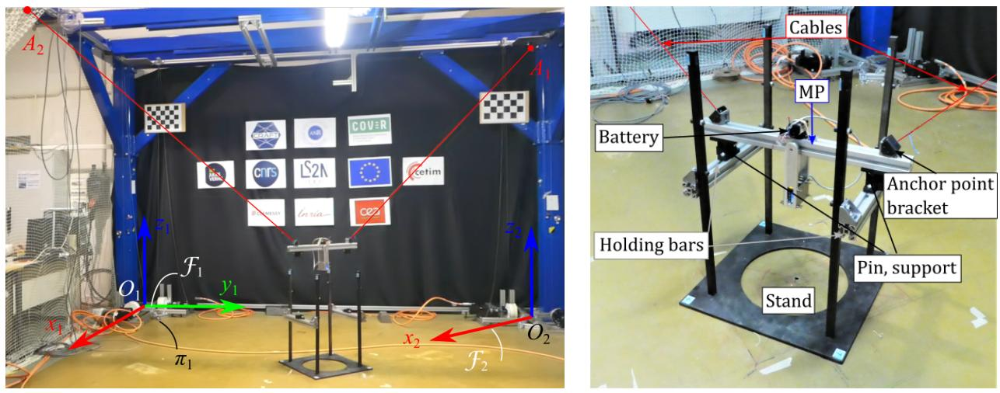

(a) MP in F1 and F2 (b) Detail of the real MP

Figure 1: CDPR under study equipped with a laser displacement sensor and an inclinometer

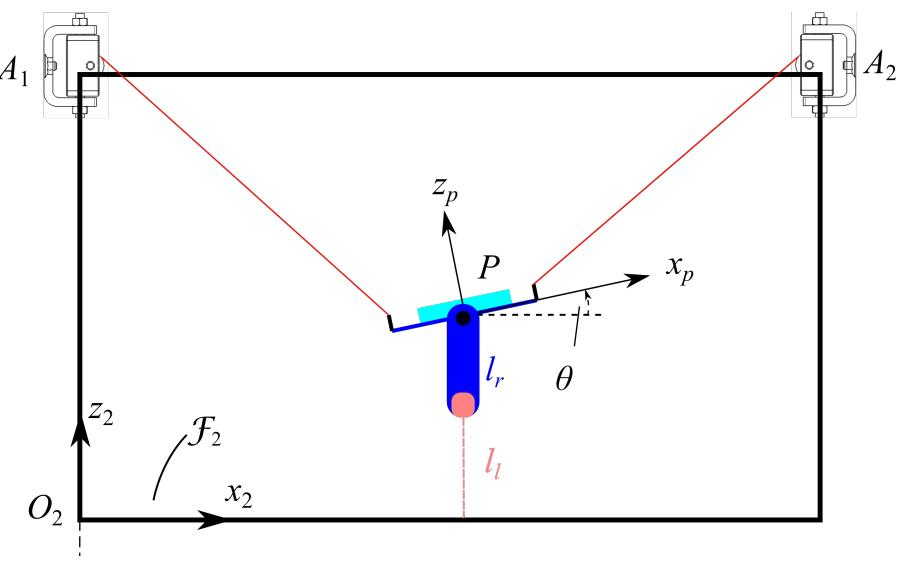

Figure 2: CDPR geometry inside  $\mathcal{F}\_2$ 

laser sensor always points vertically to the floor, to directly measure the MP height. The
concrete floor reflects enough laser light to perform proper measurements. It is not perfectly
flat, however, so a laser tracker is used to identify its unevenness. Motors control the cable
lengths, and are equipped with encoders that measure their angular positions, and thus the
cable length variations. The total MP mass is 2.5 Kg.The geometric model of the current CDPR, including detailed pulley modelling is presented  
in Sec. 2.1. The detailed random pose generation process is discussed in Sec. 2.2. The  
sensor accuracy tests are carried out and the results are summarized in Sec. 2.3. The floor  
elevation along the workspace direction is accurately measured with the laser tracker and the  
corresponding results are detailed in Sec. 2.4. Finally the position control scheme of the CDPR  
is presented in Sec. 2.5.#### 2.1 Geometric model

Figure 3 shows the *i*th loop of the current CDPR. The vectors pointing from the workspace origin O2 to the *i*th pulley exit point and to the MP center are  $\mathbf{a}\_i$  and  $\mathbf{p}\_j$ , respectively; with  $i = 1, ..., m$  and  $j = 1,...,n$ . *m* is the number of cables (2 in our case), and *n* is the total number of measurement poses. The vector pointing from *P* to the *i*th anchor point is  $\mathbf{b}\_i$ . Therefore, the loop closure equation corresponding to each cable is expressed as:
$$
 l\_{i} = l\_{i}\mathbf{u}\_{i} = \overrightarrow{A\_{i}B\_{i}} = \mathbf{p} + \mathbf{b}\_{i} - \mathbf{a}\_{i} \qquad (1)
$$

where  $\mathbf{l}\_i$  is the *i*-th cable vector and  $l\_i$  is the *i*-th cable length. Then the *i*-th unit cable vector is written as:

$$\mathbf{u}\_{i} = \frac{\mathbf{l}\_{i}}{l\_{i}} \tag{2}$$

Detailed pulley modelling is considered in the geometric model, which results in the shift
of cable exit point from  $A\_i$  to  $A'\_i$  [\[9, 2\]](#page-9-2), shown in Fig. 4. The frame attached to the pulley
is denoted as  $\mathcal{F}\_{pu} = (A\_i, \mathbf{x}\_{pu}, \mathbf{y}\_{pu}, \mathbf{z}\_{pu})$ . The axis  $\mathbf{x}\_{pu}$  is horizontal and goes through the pulley
center  $O\_{pi}$ , the axis  $\mathbf{z}\_{pu}$  is vertical and the axis  $\mathbf{y}\_{pu}$  is parallel to the pulley rotating axis. The
vector from the pulley exit point  $A'\_i$  to the cable anchor point  $B\_i$  is  $\mathbf{l}\_{ci}$ . The  $j$ th MP rotational
angle compared with the horizontal plane is  $\theta\_j$ . As a result, the cable length from the cable
exit point  $A\_i$  to cable anchor point  $B\_i$  is:No corrections needed.

where  $l\_{ci}$  denotes the cable length from exit point  $A'\_i$  to  $B\_i$ ,  $l\_{pi}$  is the cable length wrapped on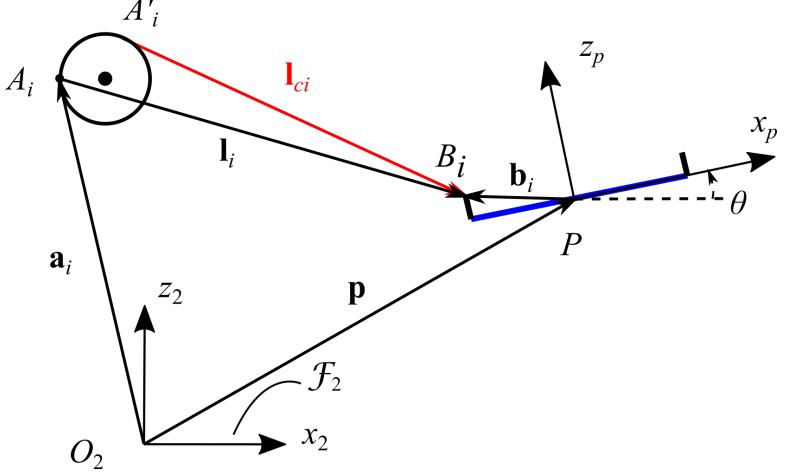

Figure 3: The ith loop of the CDPR under study

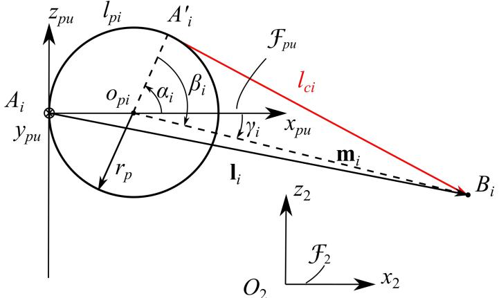

Figure 4: Parameterization of the *ith* pulleythe pulley sheave, and is calculated as:

$$l\_{pi} = r\_p \left[ \pi - \beta\_i - \gamma\_i \right] \tag{4}$$

where  $r\_p$  is the pulley radius, with  $\tan(\beta\_i) = \frac{\sqrt{\mathbf{m}\_i \mathbf{m}\_i^T - r\_p^2}}{r\_p}$  and  $\sin(\gamma\_i) = \frac{a\_{iz} - b\_{iz}}{\Vert \mathbf{m}\_i \Vert\_2}$ .  $\mathbf{m}\_i$  is denoted as the vector pointing from the pulley center  $O\_{pi}$  to the anchor point  $B\_i$ , and is expressed as:
$$\mathbf{m}\_i = \mathbf{p} + \mathbf{b}\_i - \mathbf{a}\_i + r\_p \, ^b \mathbf{R}\_i \mathbf{x}\_{pu} \tag{5}$$

where  ${}^b\mathbf{R}\_i$  is the rotation matrix from the base frame to the pulley frame. Following the *i*th loop of the CDPR geometry, the unwind cable length  $l\_{ti}$  can be expressed as:
$$l\_{ci} = \sqrt{\mathbf{m}\_{i} \cdot \mathbf{m}\_{i}^{T} - r\_{p}^{2}} \qquad (6)$$

Then through eq. (3), the total length  $l\_{ti}$  can be obtained. The desired motor joint position is calculated given  $l\_{ti}$  and winch radius  $r\_w$ :
$$\mathbf{q}\_d = \frac{\mathbf{l}\_t}{r\_w} \tag{7}$$

#### 2.2 Generation of nominal poses

Because the CDPR is under-actuated, equilibrium pose of its MP depends on both the cable lengths and gravity [26, 30]. Each such pose corresponds to a minimum in the gravitational potential energy possible with a certain set of cable lengths.

In order to generate different MP poses, random cable lengths are first generated. According to the workspace size, the cable lengths vary between 1 m and 5 m. The MP pose is obtained by CDPR forward kinetostatics. More specifically, the MP  $y\_p$  axis coordinate  $p\_{jy}$  is minimized by Matlab fmincon function, while the MP static equilibrium is taken into account as an optimization constraint. Figure 5 shows the forces acting on the MP. The angle between cable *i* and axis  $x\_p$  of the platform frame is noted as  $\varphi\_i$ , and the  $z\_2$  axis coordinate of the corresponding anchor point is  $h\_a$ . Upon assuming that the MP center of mass is  $P$ , the sum of moments at  $P$  should remain zero because of static equilibrium, therefore:

$$\sum m\_{P} = {}^{p}\mathbf{b}\_{1}^{T} \mathbf{E}^{T} \tau\_{1} \begin{bmatrix} \cos(\varphi\_{1} - \theta) \\ \sin(\varphi\_{1} - \theta) \end{bmatrix} + {}^{p}\mathbf{b}\_{2}^{T} \mathbf{E}^{T} \tau\_{2} \begin{bmatrix} \cos(\varphi\_{2} - \theta) \\ \sin(\varphi\_{2} - \theta) \end{bmatrix} = 0, \text{ with } \mathbf{E} = \begin{bmatrix} 0 & -1 \\ 1 & 0 \end{bmatrix}. \quad (8)$$

with the force static equilibrium:

$$\sum \mathbf{f} = \tau\_1 + \tau\_2 + \mathbf{G} = \tau\_1 \begin{bmatrix} \cos(\varphi\_1 - \theta) \\ \sin(\varphi\_1 - \theta) \end{bmatrix} + \tau\_2 \begin{bmatrix} \cos(\varphi\_2 - \theta) \\ \sin(\varphi\_2 - \theta) \end{bmatrix} + G \begin{bmatrix} \cos(-\theta) \\ \sin(-\theta) \end{bmatrix} = \mathbf{0}\_2 \tag{9}$$

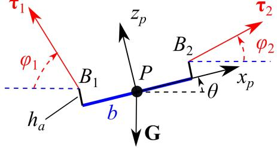

Figure 5: Forces acting on the MP

50 poses were randomly generated and verified to be members of the CDPR workspace.

Figure 6 illustrates these 50 poses generated, which are used in both simulations and experiments.

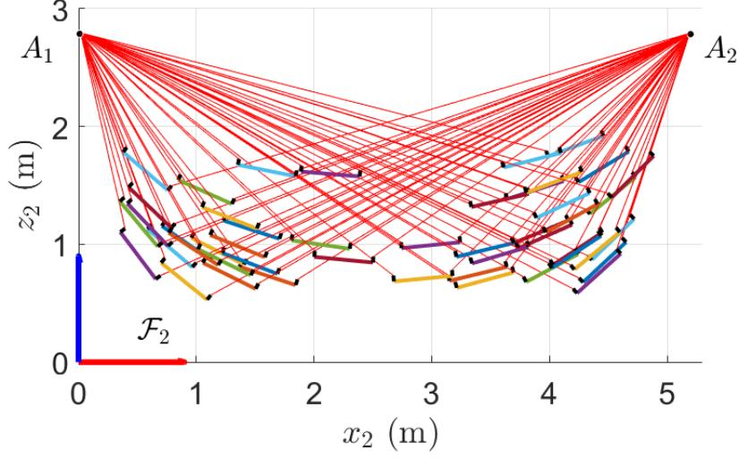

Figure 6: Randomly generated calibration poses

#### 2.3 Sensors used and the accuracy tests

Two sensors are used to realise robot calibration: the WitMotion BWT61CL inclinometer and the SICK DT50-2 laser displacement sensor. The inclinometer measures the rotational angles along three axes in a Cartesian coordinate system, with a resolution of 0.001 $^{\circ}$  and a  $\pm$ 90 $^{\circ}$  measurement range. The laser displacement sensor measures the distance to a surface within the range from 200 mm to 5000 mm with a resolution of 1 mm. The calibration method highly relies on the sensor measurement quality. Better knowledge on the measurements will certainly contribute to an improved calibration accuracy. However, the measurement accuracy given by the sensor datasheet does not necessarily correspond to what can be observed in the lab. Therefore, in order to characterise our sensors, their measurements are recorded and compared to the predetermined angles and distances.#### 2.3.1 WitMotion BWT61CL inclinometer

The inclinometer is tested with a indexing head which is placed on a level surface plate, as shown in Fig. 7(a). The sensor is secured to a thick aluminum bar and is kept at the same

#### B. Wang, P. Cardou and S. Caro 10

position for each of the 10 repetitions at every single spindle angle. The indexing head used
has a 40:1 ratio between the crank and the spindle, so that one turn of the crank results in a
9° rotation of the spindle. Before testing, the inclinometer measurement is reset to 0°. Then
the inclinometer is tilted successively at 0°, 9°, 18°, ..., 81° and 90° angles. The sensor
measurements are recorded through software provided by WitMotion. The measurement errors
 $e\_\theta$  of the inclinometer are computed as:No corrections needed.

(a) Inclinometer test setup (b) Laser displacement sensor test setup

Figure 7: WitMotion BWT61CL inclinometer and SICK DT50-2 laser displacement sensor accuracy test setupwhere  $\theta\_s$  is the inclinometer measurement, and  $\theta\_r$  is the nominal spindle angle set by the
indexing head.Figure 9(a) shows that the obtained errors  $e\_{\theta}$  absolute values keep increasing and form a fairly smooth curve. According to the inclinometer measurement principle (Fig. 8), instead of measuring the tilt angle directly, the inclinometer measures the lateral component of the gravitational acceleration  $a$ , namely,No corrections needed.

where  $g$  and  $a$  are the Euclidean norms of  $\mathbf{g}$  and  $\mathbf{a}$ , respectively. The total differentiation of  
Eq. 11 yieldsNo corrections needed.

therefore,

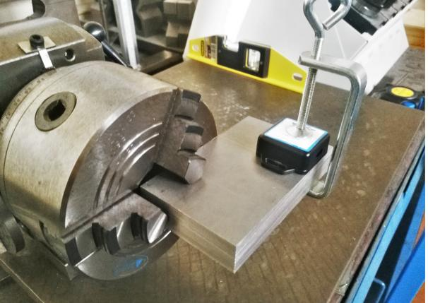

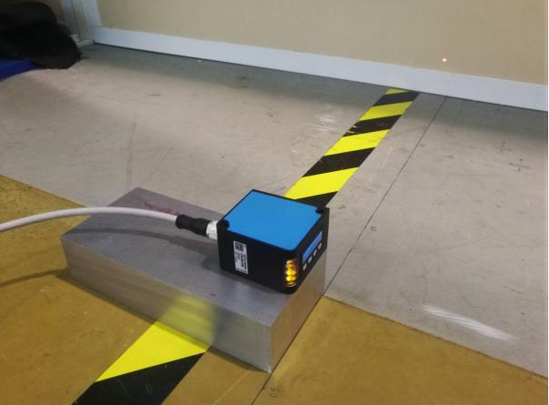

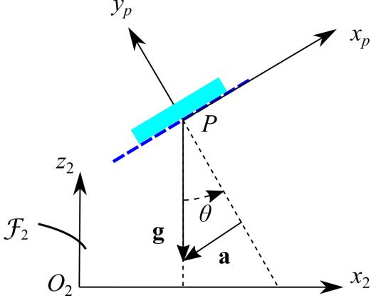

Figure 8: Inclinometer working principle

$$d\theta = e\_{\theta} = \frac{da}{g \cos \theta} = -\frac{da}{g} \sec \theta \tag{13}$$

According to Eq. (13),  $e\_{\theta}$  has a relation proportional to  $\sec\theta$ . The curve fitting for the inclinometer measurements is conducted by choosing empirically the constant  $\frac{da}{g}$ . As a result,  $\frac{da}{g} = -0.24$  fits  $e\_{\theta}$  the best, especially for the range lower than 60°. Then in order to obtain more accurate sensor measurements, only the generated poses with  $\theta$  values below 60° are chosen for later simulations and experiments. From data fitting, the inclinometer accuracy is determined to be ±0.1° with a 0.05° repeatability.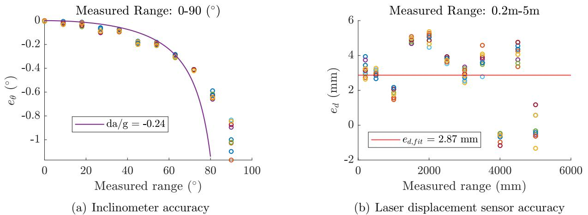

Figure 9: WitMotion BWT61CL inclinometer and SICK DT50-2 laser displacement sensor accuracy curve fitting

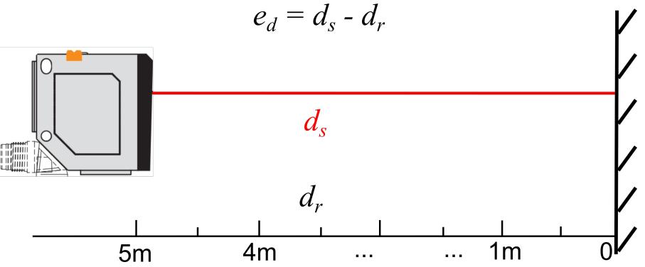

Figure 10: Laser displacement sensor accuracy test schematic

#### 2.3.2 DT50 laser displacement sensor

To test the laser displacement sensor, a straight line perpendicular to a wall is drawn on the floor, with distance markers drawn along the line with a tape measure. The laser displacement sensor is placed horizontally on a fixed aluminium plate at every 500 mm along the line, repeating the measurement 10 times at each position. The texture and color of the wall allow the sensor to obtain appropriate measurements. The sensor outputs analog voltage signal from 0-10 V, the voltage being proportional to the measured distance. At each test position, the measurements  $d\_s$  are recorded and compared with the corresponding distances  $d\_r$ , indicated by the ground marker. In such a way, the laser displacement sensor measurement errors  $e\_d$  are obtained asNo corrections needed.

Figures 7(b) and 10 show the DT50 accuracy test setup photo and schematic, respectively. In Fig. 9(b), it can be seen that the  $e\_\theta$  values are above 0 in most of measurement range, meaning that the measured distances are larger than the real ones. The curve does not show a clear trend of the error distribution throughout the sensor range. If we assume the error to be roughly uniformly distributed, then the average of all the measurement errors,  $e\_{d,fit} = 2.87$  mm can be used over the whole range. If we take the mean  $e\_d$  value at each test position, the standard deviation of each measurement with respect to  $e\_{d,fit}$  is 1.83 mm. Upon assuming that the maximum measurement error is equal to 3 times the standard deviation, a 6 mm error tolerance value is obtained. According to the maximum differences among the 10 measurements at each fixed position, the repeatability of the DT50 is determined as 1.5 mm.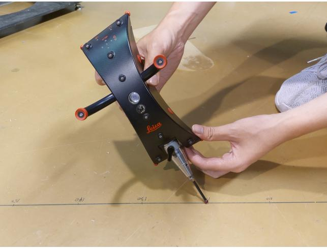

Figure 11: Floor elevation measurement with laser tracker T-probe

#### 2.4 Floor elevation measurements

The floor surface of the CRAFT prototype is neither perfectly flat nor parallel with the  $x\_2$  axis of  $\mathcal{F}\_2$ . Therefore the DT50 sensor measurements will be affected as they depend on the floor flatness. In order to improve the DT50 measurement accuracy inside  $\mathcal{F}\_2$ , the floor elevation along the direction of  $x\_2$  is measured with a laser tracker. The laser tracker is placed next to the workspace plane and it emits laser to the laser tracker T-probe (Fig. 11), which measures 3D Cartesian coordinates with an accuracy of ±0.1 mm.The projection of point  $P$  on the floor is  $G\_0$ . Starting from  $G\_0$ , a line along the direction of  $x\_2$  is drawn on the floor with distance markers every 100 mm. The floor elevation is measured at each of the distance markers with 5 times of repetition. All measurements present high repeatability of values within  $\pm 0.05$  mm. The mean measurement values are calculated for each measured position and a spline representing the floor elevation is created from those mean values. The measured and calculated floor elevations are summarized in Fig. 12.#### 2.5 Robot position control

Figure 13 shows the position control scheme of the CDPR. During the robot movement, a sampling time of 0.001 s is used. Knowing the predefined MP poses  $\mathbf{x}\_d$ , through the CDPR inverse kinematics, the desired motor joint position  $\mathbf{q}\_d$  is calculated. In order to prevent thrusts of the MP movement between two poses, fifth-order polynomial interpolation is used to obtain the desired joint velocity  $\dot{\mathbf{q}}\_d$  and acceleration  $\ddot{\mathbf{q}}\_d$ .  $I\_m$  is the motor and gearbox inertia, and  $\Gamma$  is the output torque.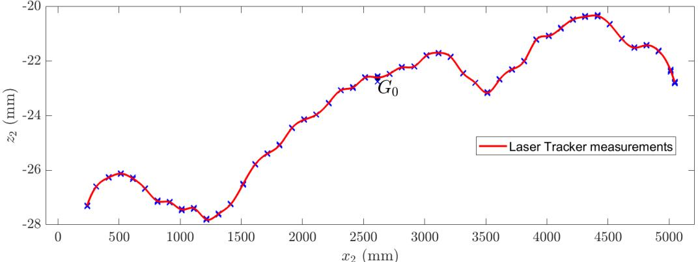

Figure 12: Floor elevation along the  $x\_2$  direction measured with the laser tracker

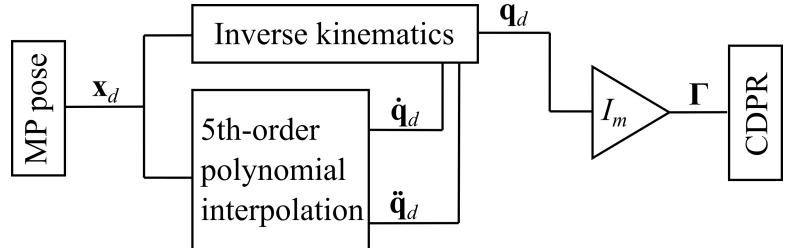

Figure 13: CDPR position control scheme

# 3 Calibration methodology

The robot calibration is achieved while recording the signals from all the sensors throughout all the MP measurement poses. At the initial position, the cable lengths are denoted as  $l\_{i0}$ . When the MP is moved to all the *n* different poses within the workspace, the cable length variations  $\Delta l\_{ij}$  are recorded by the encoders. Thus, the actual cable lengths  $l\_{ij}$  are calculated by:No corrections needed.

The CDPR system variables are the outputs of the problem, including the Cartesian coor-  
dinates of cable exit points  $a\_{ix}$ ,  $a\_{iz}$ , the initial cable lengths  $l\_{i0}$ , the Cartesian coordinates of the  
MP center  $p\_{jx}$ ,  $p\_{jz}$  and the MP rotation angle  $\theta\_j$ . Among these variables, the laser displacement  
sensor measures  $p\_{jz}$ , and the inclinometer measures  $\theta\_j$ . All the sensor measurements are the  
inputs of the identification problem. The rest of the output variables are considered to be the  
unknowns, included in a  $3m + n$  dimensional vector **x**.
$$\mathbf{x} = [a\_{1x}a\_{1z}, a\_{2x}a\_{2z}, l\_{10}l\_{20}, p\_{1x}, \dots, p\_{nx}] \tag{16}$$

Non-linear least square method, based on solving non-linear equations to reduce the cableNon-linear least square method, based on solving non-linear equations to reduce the cable

length residuals, is commonly used for robot calibration [\[1, 3, 4\]](#page-15-0). With NLLS method, in this
work, the identification problem is formulated while integrating the measurements from laser
displacement sensor, inclinometer and motor encoders. Upon comparing the real cable length
 $l\_{ij}$  from Eq.(15) with the estimated cable length  $l\_{ti}$  from Eq.(3), a system of  $mn$  equations can
be obtained [\[10, 2\]](#page-15-0):
$$f\_{ij}(\mathbf{x}) = (l\_{pi} + l\_{ci})^2 - (\Delta l\_{ij} + l\_{i0})^2 = 0, \quad i = 1, 2 \quad j = 1, \ldots, n \tag{17}$$

To solve the nonlinear system of equations defined by Eq.(17), the number of inputs must be larger than or equal to the number of unknowns:
$$mn + 2n \ge 2m + m + 3n \tag{18}$$

As the CDPR has  $m = 2$  cables, the least number of measurement poses is  $n = 6$ . A similar simulation process is used in [\[9, 10\]](#page-9-1). Arbitrary errors are added on  $\mathbf{x}$  to simulate the approximately known system variables. The identification problem is then formulated as the nonlinear least square problem:
$$
\min\_{\mathbf{x}} \left( \sum\_{i=1}^{m} \sum\_{j=1}^{n} f\_{ij}^{2} \right) \tag{19}
$$

The pre-defined real variable values  $\mathbf{x}$ , are compared with the identified ones  $\mathbf{x}^\*$ , to evaluate the identification accuracy:
$$
\delta \mathbf{x}\_k = \mathbf{x}\_k^\* - \mathbf{x}\_{r,k}, \qquad k = 1, 2, \dots, 3m + n \tag{20}
$$

where  $\delta \mathbf{x}\_k$  is the difference between the real and identified variable values.

# 4 Simulation of 3-Dof, 2-cable planar CDPR

### 4.1 Results of the simulated identification problem

Simulations with 6 to 50 measurement poses are performed. For each pose, the simulation is repeated 500 times with different sensor measurement errors. Based on the accuracy test results given in Sec.2, the applied accuracy and repeatability are generated as independent normally distributed random values, while assuming the sensor accuracy and repeatability ranges to be three times the standard deviation, and their mean to be zero.The dispersion or standard deviations of the obtained results  $\delta x\_k$  is defined as: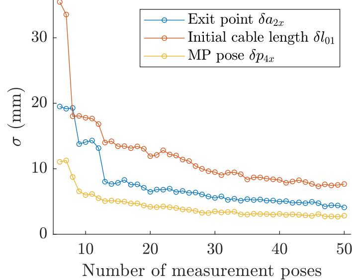

Figure 14: The *standard deviation* results of 3 examples of the system variables

$$\sigma = \text{std}(\delta \mathbf{x}\_k), \qquad k = 1, 2, \ldots, 3m + n$$

$$(21)$$

Figure 14 shows the standard deviation of the *x*-coordinate of the 2nd cable exit point, the initial cable length of the 1st cable and the *x*-coordinate of the 4th MP pose. It is apparent that the larger the number of poses, the lower the standard deviation  $\sigma$ , the better the calibration accuracy. It should be noted that  $\sigma$  does not decrease after 50 measurement poses.Figures 15 to 17 summarize three examples of the identification errors of the system variables with different numbers of measurement poses used, and standard deviation  $\sigma$ . The results are

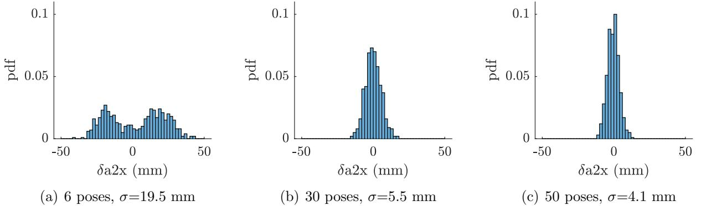

Figure 15: Identification error results in the x-coordinates of the 2nd cable exit point, with different numbers of measurement poses and  $\sigma$  values

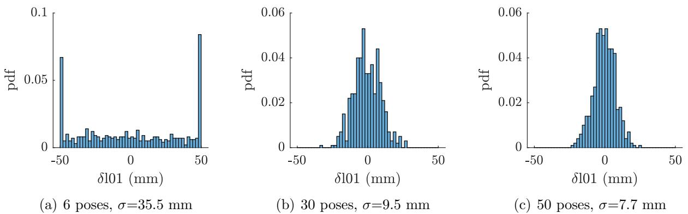

Figure 16: Identification error results of the initial length in the 1st cable, with different numbers
of measurement poses and  $\sigma$  values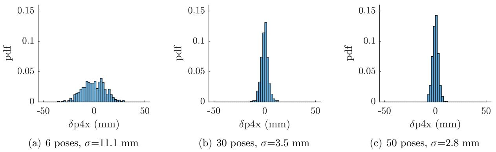

Figure 17: Identification error results of the *x*-coordinates of the 4th MP position vector, with different numbers of measurement poses and  $\sigma$  values

plotted as probability density function (PDF). It can be seen that the larger the number of poses (from 6 to 50), the lower the system variable identification errors. When only six poses are used, the probability density function plots are relatively flat, the errors are bounded between -50 and 50 mm. Afterwards, the PDF plots resemble normal distributions, the main part of the identification errors is distributed in the lower value area. Besides, the  $\sigma$  values keep decreasing as the number of measurement poses increases, which means that the identification error dispersion becomes lower and the identification accuracy is higher.In general, from the identification error results, the variables of MP coordinates have the
lowest errors, with nearly all the values below 10 mm and the minimum  $\sigma$  being 2.8 mm. The
errors in the coordinates of exit point come next, the maximum identification errors slightly
exceeding 15 mm, and the minimum  $\sigma$  value being 4.1 mm. The initial cable lengths have the
largest errors, with the maximum values around 25 mm and minimum  $\sigma$  value being 7.7 mm.
The simulated identification errors of some parameters are shown in Fig. 18.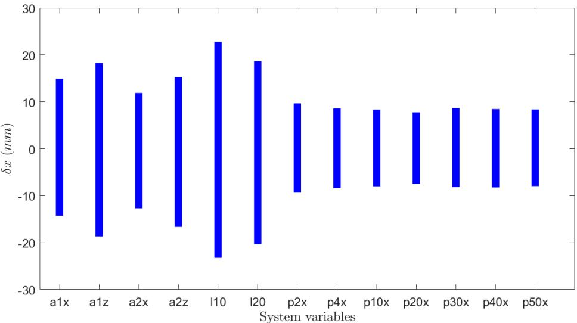

Figure 18: Simulated identification errors for some parameters

## 4.2 Simulation of sensor effects on identification errors

The two sensors provide different types of quantities (lengths and angles), which makes the
effect of each sensor on the overall calibration quality difficult to discern. To resolve this
problem, the simulations are carried out where the sensor measurement errors are eliminated
one at a time. If one sensor is eliminated, its measurement error will be set to zero, and the
simulation will be processed by considering the errors in the other sensor only.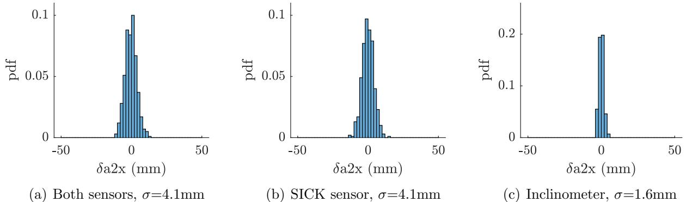

Figure 19: Identification error results in the x-coordinates of the 2nd exit point when 50 poses
are used, comparison of sensor effects

An example of this set of results for the 2nd exit point x-coordinate  $a\_{2x}$  is shown in Fig. 19.
When the SICK sensor measurement errors are eliminated, the identification errors are much
reduced, the dispersion of the 500 results are significantly reduced, as shown in Fig. 19(c). The
identification errors are much more concentrated around 0 mm, and within  $\pm$  6 mm. Fig. 20
shows that the errors for the initial cable lengths are even more affected, with identification
errors inside  $\pm$  1 mm range, and the  $\sigma$  values decreased from 7.5 mm to 0.2 mm. It should be
noted that the errors in the x-coordinates of the MP positions are less affected, reduced from
 $\pm$ 10 mm to  $\pm$ 5 mm, as seen in Fig. 21.On the other hand, when the WitMotion inclinometer is not considered, the identification
errors do not change significantly, as shown in Fig. 19(b). It means that the identification
quality of the geometric parameters of the planar CDPR, the initial cable lengths and the
moving-platform poses are not very sensitive to measurement errors in WitMotion inclinometer.
We conclude that one could need a more accurate distance sensor to improve the calibration
accuracy. Conversely, one could probably afford to use a less accurate tilt sensor without
affecting the calibration.#### 4.3 Overall simulation

The previous sections focused on the effects of the number of poses and the sensors over the overall identification accuracy. In this section, we replicate in simulation the experiment that was performed in the laboratory, for the purpose of validating our calibration model. The sensor measurement error models are the same as those used in previous simulations and defined in sections 2.3.1 and 2.3.2. One single calibration using all the 50 measurement poses is performed. The identification errors  $\delta x$  are calculated, being defined as the differences between the identified and the true system variables. These system variables are listed in Eq. (16). The MP movement

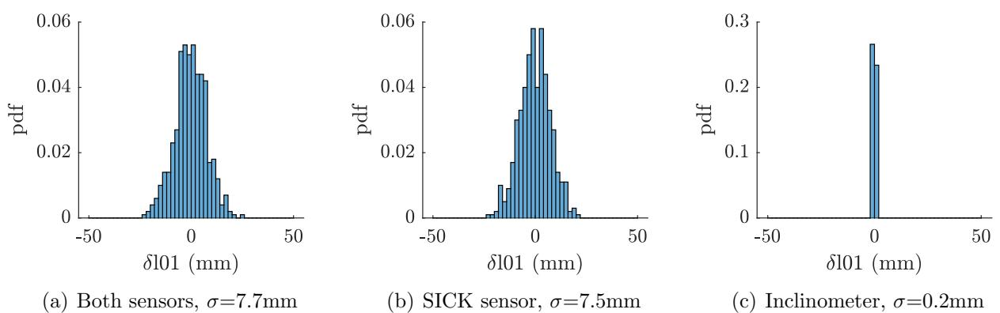

Figure 20: Identification error results in the initial cable length of the 1st cable when 50 poses
are used, comparison of sensor effects

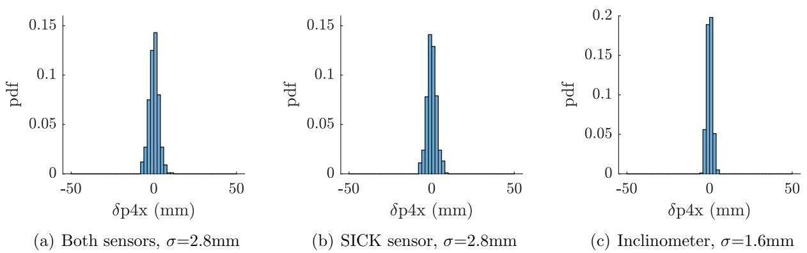

Figure 21: Identification error results in the *x*-coordinates of the 4th MP position vector when 50 poses are used, comparison of sensor effects

#### B. Wang, P. Cardou and S. Caro 21

is also simulated, the control scheme code that will be able to move the real robot is used in the
simulation. The overall simulation results showing the probability density of each individual
system variable identification error are summarized in Fig. 22. All identification errors fall
within the range of  $\pm$ 9 mm, which is consistent with the previous detailed simulation. The
results give a standard deviation  $\sigma$  of 3.9 mm, and the 3 $\sigma$  interval value being  $\pm$ 11.6 mm.
Among the identification errors, 89.8% are less than  $\pm$ 5 mm.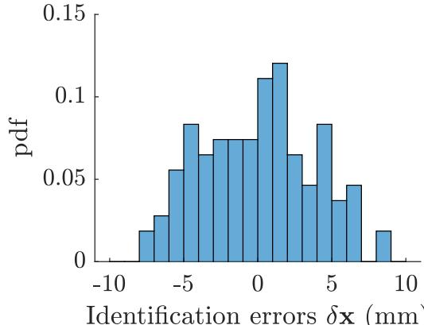

Figure 22: Identification errors in all system variables

# 5 CDPR experiments and methodology

The calibration results may be affected by plenty of uncertainties. Among them, the sensor
measurement errors and the floor altitude are taken into account and examined. Another
uncertainty is the cable elongation during the experiment, which can be hard to predict [\[24\]](#page-21-0).
Because of the structure of CDPRs, the changes in cable lengths directly affect the MP poses
[\[25\]](#page-21-0). In order to eliminate the effect of cable elongation in these experiments, a Leica AT-901
laser tracker system (LTS, seen in Fig. 23(a)) is used to measure the actual MP poses accurately.
The laser tracker can work with either Spherically Mounted RetroReflector (SMRs, shown in
Fig. 23(b)) or T-probe to measure 3D Cartesian coordinates. All the measurements have the
accuracy of at least ±0.1 mm. Apart from point measurements, the Metrolog software allows
line, plane and cylindrical surface measurements, all of which consist of sets of points. The
software is also able to construct a Cartesian coordinate system with the former and express
the subsequent measurements directly in it.Figure 24 represents the general experimental setup. The MP workspace plane is noted as  $\pi\_2$ . The laser tracker is placed on a line passing through the center of the rectangular workspace and perpendicular to  $\pi\_2$ . This minimizes the incidence angle of the laser with the workspace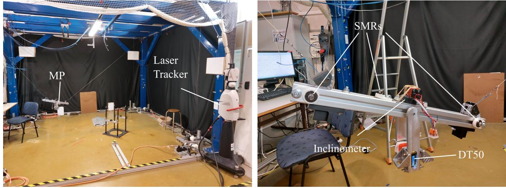

(a) MP and laser tracker (b) MP equipped with SMRs

Figure 23: MP pose measurement with laser tracker system setup

plane, allowing the SMRs to provide higher measurement accuracy.

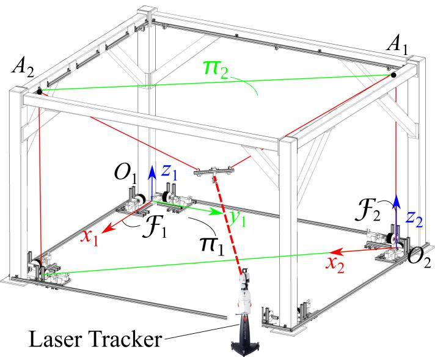

Figure 24: Schematic of a MP pose measurement with laser tracker system

The position of the laser tracker next to the robot needs to be calibrated every time before  
an experiment session, to ensure the measurement accuracy. The base frame  $\mathcal{F}\_1$  is defined  
by the laser tracker, with respect to datum marks arbitrarily fixed on the CRAFT prototype  
frame. Six SMR brackets are fixed on the CRAFT frame, their coordinates  $\mathbf{p}\_r$  in  $\mathcal{F}\_1$  are  
measured. The position of the laser tracker are known at the same time. Every time the  
laser tracker is moved again, the vectors  $\mathbf{p}\_r$  are measured again. By comparing the old andnew coordinates  $\mathbf{p}\_r$ , the actual laser tracker position is known. Therefore the laser tracker is
able to give measurements in  $\mathcal{F}\_1$  accurately. After calibrating the laser tracker, the rest of the
measurement procedures can be carried out. Section 5.1 introduces the construction of the MP
frame  $\mathcal{F}\_p$  by measuring necessary MP features. Afterwards, section 5.2 details the method to
obtain MP pose measurements through the transformation between  $\mathcal{F}\_p$  and  $\mathcal{F}\_1$ .## 5.1 Construction of the MP frame Fp

The MP pose measurements are based on the three SMRs attached on the platform, whose
accurate Cartesian coordinates in  $\mathcal{F}\_p$  are needed. The methodology to construct the MP frame
 $\mathcal{F}\_p$  in Metrolog software is introduced in this section. The SMR coordinates can then be
measured directly. Moreover, the Cartesian coordinates of the anchor points  $B\_1$  and  $B\_2$  are
also measured.In order to carry out the measurements, the platform is steadily placed on the stand, and
the measurements are done using the laser tracker T-probe, as shown in Fig. 25(a). First, 10
points on the revolute joint shaft cylinder surface  $\pi\_{s}$  are measured, to obtain the parameters
of axis  $y\_p$ . Then, 10 more points on the face of the MP strut that is perpendicular to  $y\_p$ . This
plane is named  $\pi'\_{y}$ .  $\pi\_y$  is obtained by offsetting  $\pi'\_{y}$  by 20 mm along the  $-y\_p$  direction, which
represents the vertical symmetry plane of the MP. The plane  $\pi\_y$  is perpendicular to  $y\_p$  and its
intersection with  $y\_p$  is  $P$ , the origin of  $\mathcal{F}\_p$ . 10 more points are measured on the MP top plane
 $\pi'\_{z}$ , and the projection of  $P$  on  $\pi'\_{z}$  is noted as  $O\_{pz}$ . The vector from  $P$  to  $O\_{pz}$  is the  $z\_p$  axis of
 $\mathcal{F}\_p$ . Then the  $x\_p$  axis can be constructed as the line through  $P$  and perpendicular to  $y\_p$  and  $z\_p$ .
This fully defines frame  $\mathcal{F}\_p$ . The coordinates of the three SMRs on the MP,  $S\_1$ ,  $S\_2$  and  $S\_3$ , can
be directly measured.Figure 26 shows the datums defined to measure the MP anchor points. First, the probe is placed on  $B\_i$  to obtain the probe center coordinate  $P\_{bi}$ . This represents the center of the probe, not yet the exact anchor point. Then 10 points are recorded on the flat bracket surface to obtain plane  $\pi\_{bi}$ . Then, the projection of  $P\_{bi}$  on  $\pi\_{bi}$  is assumed to be the actual anchor point  $B\_i$ . With the help of the laser tracker, the anchor points coordinates are measured accurately, which provides an accurate geometric model of the robot.## 5.2 Transformation between  $\mathcal{F}\_p$  and  $\mathcal{F}\_1$

During the measurements, the MP is successively moved to the 50 different poses. For each
pose, all the three SMRs are measured and their coordinates are expressed in  $\mathcal{F}\_1$ . The Kabsch
algorithm takes the three SMR coordinates in both  $\mathcal{F}\_p$  and  $\mathcal{F}\_1$  frame to obtain the homogeneous
transformation matrix between the two frames,  ${}^{1}\mathbf{T}\_{p}$ . As the frames  $\mathcal{F}\_1$  and  $\mathcal{F}\_2$  are both known,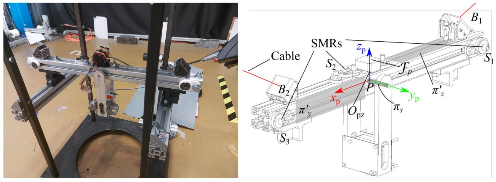

(a) MP on stand (b) CAD model of the measured entities

Figure 25: MP geometry entity measurements

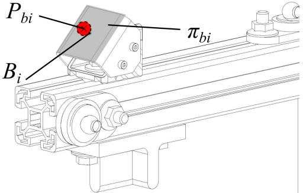

Figure 26: MP anchor point measurement

the transformation matrix between them,  ${}^{2}\mathbf{T}\_{1}$  is also known. Therefore, the point coordinates in  $\mathcal{F}\_{p}$  can be transferred into  $\mathcal{F}\_{2}$  by:
$$\mathbf{^1p}\_h = \mathbf{^1T\_p}\mathbf{^0p}\_h\tag{22}$$

$$\mathbf{^2p\_h} = \mathbf{^2T\_1}\mathbf{^1p\_h} \tag{23}$$

where  ${}^{p}\mathbf{p}\_{h}$ ,  ${}^{1}\mathbf{p}\_{h}$  and  ${}^{2}\mathbf{p}\_{h}$  are the homogeneous coordinates of  $P$  in different frames.The MP orientations  $\theta$  in  $\mathcal{F}\_2$  are calculated from the two end points of the straight MP strut. These points are noted as  $C\_1$  and  $C\_2$  with coordinates  $[-b,0,0]^T$  and  $[b,0,0]^T$  in  $\mathcal{F}\_p$ , respectively. Based on the previous transformation, their coordinates are also expressed in  $\mathcal{F}\_2$ . Let the vector pointing from  $C\_1$  to  $C\_2$  be  ${}^{2}\mathbf{v}$ , then the MP rotational angle  $\theta$  can be simply

calculated as:

$$\theta = \operatorname{atan2}(^2v\_{z2}, ^2v\_{x2}) \tag{24}$$

where  ${}^{2}v\_{z2}$  and  ${}^{2}v\_{x2}$  are the projection of  ${}^{2}\mathbf{v}$  on axes  $z\_2$  and  $x\_2$ , respectively. The MP poses are thus obtained in the form of the MP center  $P$  and tilt angle  $\theta$ .# 6 Experimental results and analysis

6.1 Comparison between sensor and laser tracker measurements

Once the laser tracker measurements are obtained, they are compared with those from the
inclinometer and laser displacement sensor. Figures 27 and 28 show the differences on MP
height  $\delta p\_{jz}$  and on MP inclination  $\delta \theta\_j$  between the measured and desired values, which are
calculated as follows:No corrections needed.

$$
\delta\theta\_j = \theta\_{zm} - \theta\_{zt},\tag{26}
$$

where  $p\_{zm}$  is the sensor measured MP heights, from both the laser tracker and DT50 laser displacement sensor, and  $p\_{zt}$  is the desired values generated with the method described in Sec. 2.2. Similarly,  $\theta\_{zm}$  and  $\theta\_{zt}$  are the measured and desired MP inclination, respectively.The results reported in Fig. 27 show that both the laser tracker and the DT50 displacement sensor measure higher values of  $p\_z$  than the nominal ones, with error ranges from 0–35mm. On the other hand, the measured MP inclination shown in Fig. 28 are quite close to the nominal values, and are roughly evenly distributed on the positive and negative sides of the origin. The DT50 and inclinometer measurements are then compared in details with those from the laser tracker, as it gives very accurate measurements. the differences  $\delta p'\_{jz}$  and  $\delta \theta'\_{j}$  are calculated as:
$$
\delta p'\_{jz} = p\_{DT50} - p\_{LTS} \tag{27}
$$

$$
\delta\theta\_j' = \theta\_{Inc} - \theta\_{LTS} \tag{28}
$$

where  $p\_{DT50}$  and  $p\_{LTS}$  are the MP height measurements from the DT50 and the laser tracker,   
respectively. The results are summarized in Figs. 29 and 30. For almost all the poses, except
for poses 24 and 31, the DT50 gives errors lower than 6 mm, which is the magnitude of the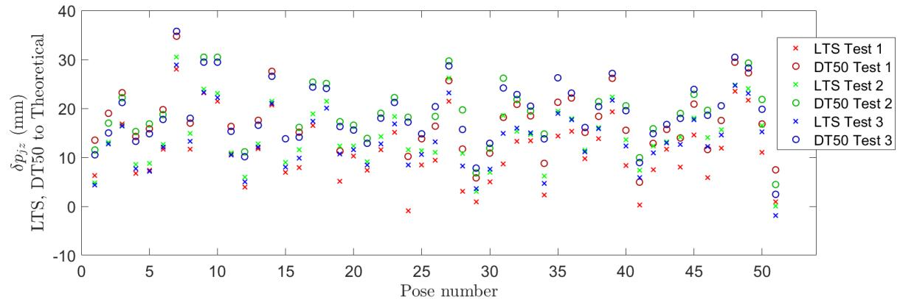

Figure 27: Differences between measured and desired MP height

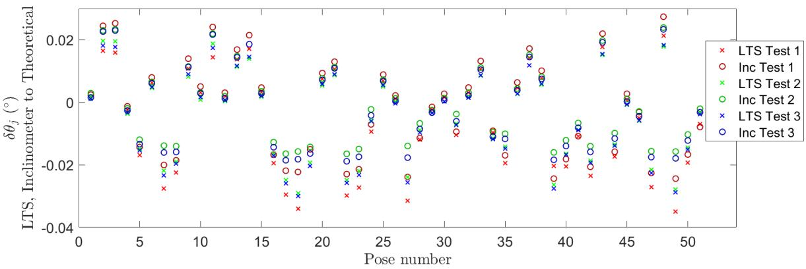

Figure 28: Differences between measured and desired MP inclination

maximum sensor measurement error. And the errors of the inclinometer are all close to zero. This means that the two sensors provide reliable measurements throughout the experiments.

Although the DT50 measurements are within the expected measurement error range, the measured MP heights show relatively larger differences to the theoretical values. The possible reason for that is the cable elongations during experiments. As the cable winds on the winch, the winch exit point moves along the rotational axis direction of the winch, the real cable length therefore changes. And as for the exceptions of poses 24 and 31 on  $\delta p'\_{jz}$  values, the positions of these two poses are high in the workspace (2 m and 1.6 m), because of the suspended configuration of the CDPR, the cable lengths are short and the cable tensions are relatively high at these two poses. In this situation, the displacement of the winch exit points, as well as the cable elongations under high cable tension may combine to affect the real MP poses.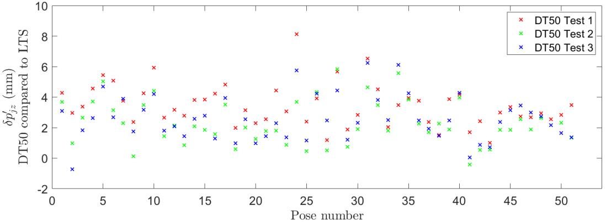

Figure 29: DT50 MP height measurements compared with laser tracker

Figure 30: Inclinometer MP inclination measurements compared with laser tracker

#### 6.2 Real cable lengths

The real cable lengths are calculated through the inverse kinematics from the MP pose mea-  
surements of the laser tracker, and compared with the theoretical cable lengths. The results  
are shown in Fig. 31. The errors on real cable lengths  $\delta l\_t$  do vary among a relatively large  
range, from -38 mm to 12 mm. The cable with a shorter real length tends to have a negative  
elongation. On the contrary, a longer cable tends to have a positive elongation.### 6.3 Calibration results and prediction of calibration accuracy

A calibration process based on NLLS method, using experimental measurements is carried out.  
Among all the inputs of the problem,  $p\_{jz}$  and  $\theta\_j$  take the measurements from the laser displacement sensors and the inclinometer, respectively. Because of the uncertainties on the actual cable lengths, the measurements from the laser tracker are used to estimate these quantities, instead of those from the cable encoders. The system variables are then identified in three separate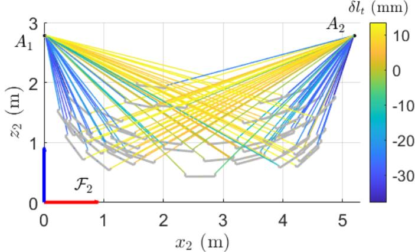

Figure 31: Errors on real cable lengths

calibrations and some examples of the errors obtained on these variables of three repetitions of  
the experiment are summarized in Fig. 32. The blue bars in the figures show the simulations  
results from Sec. 4, where the characterized measurement error models of both the laser  
displacement sensor and the inclinometer are applied. Compared with the simulation results, the  
errors on all the system variables fall within the estimated ranges. The experimental results  
validate the current model of CDPR calibration therefore validating the method of predicting  
the calibration accuracy. From the figure, among all the system variables, the simulation yields  
reasonable ranges for the exit point coordinates and for the pose  $x$ -coordinates. But for the ini-  
tial cable lengths, the identification errors are much less than estimated, the simulation results  
seem overly pessimistic.# 7 Conclusions and future work

In summary, this paper presents the simulation and experimental validation of the calibration method of a 3-DoF, 2-cable, planar CDPR. This method of simulation and its underlying model can be reused by others to predict the calibration accuracy of different CDPRs and measurement techniques. It is hoped that it can help refine the sensor selection process for prescribed accuracies of the robot geometry. The calibration method proposed here relies on the combination of a laser displacement sensor and an inclinometer embedded on the movingplatform, as well as the motor encoders. Detailed pulley geometric modelling is considered. The actual accuracies of the sensors are examined beforehand in order to predict the calibration

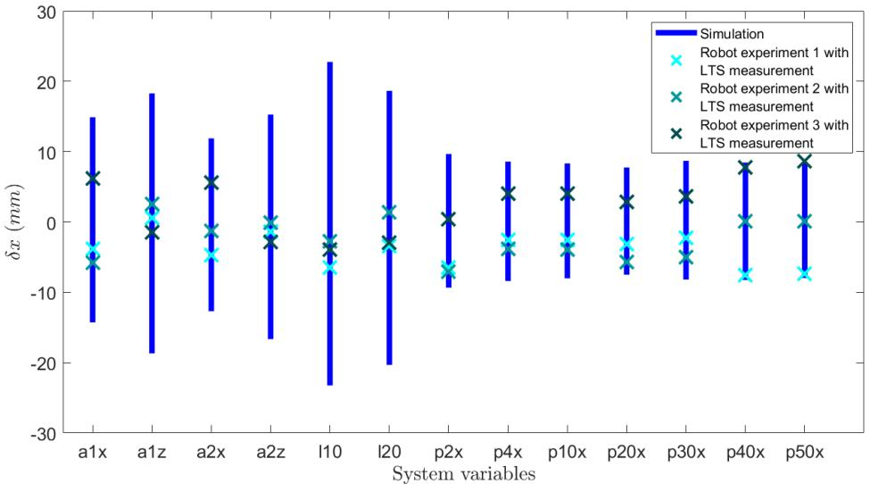

Figure 32: Calibrated system variable identification errors

results. The simulations show that with more measurement poses used, the identification errors of the exit point, pose Cartesian coordinates and the initial cable lengths are reduced, and are less dispersed. It turns out that the laser displacement sensor has a much larger influence than the inclinometer on the identification errors. Furthermore, amongst all system variables, the errors in initial cable lengths are the most sensitive to the laser displacement sensor measurement errors whereas the errors in the MP position coordinates are the least sensitive ones. Based on the sensor considered in this work, the system variable errors are all below ±9 mm, and most are below ±5 mm.

Experiments are carried out following the calibration method proposed. Sensor measurements from laser displacement sensor and inclinometer are recorded for calibration. Because of the complex cable elongations during experiments, the accurate cable length variations are obtained with the measurements from a laser tracker system, instead of cable encoders. The differences between the real and theoretical cable lengths are also calculated. The laser tracker also provides the ground truth of the actual MP poses to validate the calibrated system variable values. As a result, all of the calibrated robot system variable errors fall within the simulated ranges.

The cable elongations have significant effects on the MP poses, and consequently on the CDPR calibration accuracy as well [31, 32]. In future work, the cable elongations will be compensated with elastic modelling, creep modelling, and the modelling of the winch cable exit point movement. In addition to elongations, considering cable mass will all improve the calibration quality. Future work will also deal with the determination of optimal measurement poses for CDPR calibration and other calibration methods with different sensor combinations.

Acknowledgements This work was supported by the ANR CRAFT project, grant ANR-18-CE10-0004, https://anr.fr/Project-ANR-18-CE10-0004. The first author of the paper is grateful for the support of China Scholarship Council (CSC Grant No.202008070051).

# Conflict of Interest Statement

Compliance with Ethical Standards:

Funding: This study was funded by the ANR CRAFT project, grant ANR- 18-CE10-0004, https://anr.fr/Project-ANR-18-CE10-0004 and by the support of China Scholarship Council (CSC Grant No.202008070051).

Conflict of Interest: The authors declare that they have no conflict of interest.

# References

- [1] Zhang, Z., Xie, G., Shao, Z. & Gosselin, C. Kinematic Calibration of Cable-Driven Parallel Robots Considering the Pulley Kinematics. Mechanism And Machine Theory. 169 (2022)
- [2] Picard, E., Caro, S., Claveau, F. & Plestan, F. Pulleys and Force Sensors Influence on Payload Estimation of Cable-Driven Parallel Robots. 2018 IEEE/RSJ International Conference On Intelligent Robots And Systems (IROS 2018). (2018,10), https://hal.archivesouvertes.fr/hal-01862015
- [3] Qian, S., Bao, K., Zi, B. & Wang, N. Kinematic calibration of a cable-driven parallel robot for 3D printing. Sensors (Switzerland). 18 (2018)
- [4] Sandretto, J., Daney, D. & Gouttefarde, M. Calibration of a Fully-Constrained Parallel Cable-Driven Robot. CISM International Centre For Mechanical Sciences, Courses And Lectures. 544, 77-84 (2013)
- [5] Renaud, P., Andreff, N., Martinet, P. & Gogu, G. Kinematic calibration of parallel mechanisms: A novel approach using legs observation. IEEE Transactions On Robotics. 21, 529-538 (2005)
- [6] Wang, J. & Masory, O. On the accuracy of a Stewart platform. I. The effect of manufacturing tolerances. [1993] Proceedings IEEE International Conference On Robotics And Automation. pp. 114-120 vol.1 (1993)

#### B. Wang, P. Cardou and S. Caro 31

- [7] Andreff, N., Renaud, P., Martinet, P. & Pierrot, F. Vision-based kinematic calibration of an H4 parallel mechanism: Practical accuracies. Industrial Robot. 31, 273-283 (2004)
- [8] Daney, D., Papegay, Y. & Neumaier, A. Interval methods for certification of the kinematic calibration of parallel robots. Proceedings - IEEE International Conference On Robotics And Automation. 2004, 1913-1918 (2004)
- [9] Wang, B. & Caro, S. Exit Point, Initial Length and Pose Self-calibration Method for Cable-Driven Parallel Robots. Mechanisms And Machine Science. 103, 90-101 (2021)
- [10] Fortin-Cˆot´e, A., Cardou, P. & Gosselin, C. An admittance control scheme for haptic interfaces based on cable-driven parallel mechanisms. Proceedings - IEEE International Conference On Robotics And Automation. pp. 819-825 (2014)
- [11] Zhang, F., Shang, W., Li, G. & Cong, S. Calibration of geometric parameters and error compensation of non-geometric parameters for cable-driven parallel robots. Mechatronics. 77, 102595 (2021), https://doi.org/10.1016/j.mechatronics.2021.102595
- [12] Miermeister, P., Pott, A. & Verl, A. Auto-calibration method for overconstrained cabledriven parallel robots. 7th German Conference On Robotics, ROBOTIK 2012., 301-306 (2012)
- [13] Martin, C., Fabritius, M., Stoll, J. & Pott, A. A laser-based direct cable length measurement sensor for CDPRS. Robotics. 10, 1-11 (2021)
- [14] Boggs, P., Byrd, R. & Schnabel, R. A Stable and Efficient Algorithm for Nonlinear Orthogonal Distance Regression. SIAM J. Sci. Stat. Comput.. 8, 1052-1078 (1987,11), https://doi.org/10.1137/0908085
- [15] Verner, M., Xi, F. & Mechefske, C. Optimal calibration of parallel kinematic machines. Journal Of Mechanical Design, Transactions Of The ASME. 127, 62-69 (2005)
- [16] Wu, Y., Klimchik, A., Caro, S., Furet, B. & Pashkevich, A. Geometric calibration of industrial robots using enhanced partial pose measurements and design of experiments. Robotics And Computer-Integrated Manufacturing. 35 pp. 151-168 (2015)
- [17] An, H., Liu, H., Liu, X. & Yuan, H. An All-in-one Cable-driven Parallel Robot with Flexible Workspace and Its Auto-calibration Method. 2022 IEEE/RSJ International Conference On Intelligent Robots And Systems (IROS). pp. 7345-7351 (2022)
- [18] Pierrot, F., Marquet, F., Company, O. & Gil, T. H4 parallel robot: modeling, design and preliminary experiments. Proceedings 2001 ICRA. IEEE International Conference On Robotics And Automation (Cat. No.01CH37164). 4 pp. 3256-3261 vol.4 (2001)
- [19] Borgstrom, P., Jordan, B., Borgstrom, B., Stealey, M., Sukhatme, G., Member, S., Batalin, M., Kaiser, W. & Member, S. NIMS-PL : A Cable-Driven Robot With Self-Calibration Capabilities. (2009)
- [20] Klimchik, A., Pashkevich, A., Wu, Y., Caro, S. & Furet, B. Design of Calibration Experiments for Identification of Manipulator Elastostatic Parameters. (2012), http://arxiv.org/abs/1211.6101
- [21] Zhuang, H., Masory, O. & Yan, J. Kinematic calibration of a Stewart platform using pose measurements obtained by a single theodolite. IEEE International Conference On Intelligent Robots And Systems. 2 pp. 329-334 (1995)
- [22] Zhuang, H., Liu, L. & Masory, O. Autonomous calibration of hexapod machine tools. Journal Of Manufacturing Science And Engineering, Transactions Of The ASME. 122, 140-148 (2000)
- [23] Klimchik, A., Wu, Y., Caro, S., Furet, B. & Pashkevich, A. Geometric and elastostatic calibration of robotic manipulator using partial pose measurements. Advanced Robotics. 28, 1419-1429 (2014)
- [24] Choi, S. & Park, K. Integrated and nonlinear dynamic model of a polymer cable for low-speed cable-driven parallel robots. Microsystem Technologies. 24, 4677-4687 (2018), https://doi.org/10.1007/s00542-018-3820-7
- [25] Piao, J., Jin, X., Jung, J., Choi, E., Park, J. & Kim, C. Open-loop position control of a polymer cabledriven parallel robot via a viscoelastic cable model for high payload workspaces. Advances In Mechanical Engineering. 9, 1-12 (2017)
- [26] Wang, B., Cardou, P. & Caro, S. An Approach for Predicting the Calibration Accuracy in Planar Cable-Driven Parallel Robots. Advances In Robot Kinematics 2022. pp. 110-121 (2022)
- [27] Li, H., Zhang, X., Yao, R., Sun, J., Pan, G. & Zhu, W. Optimal Force Distribution Based on Slack Rope Model in the Incompletely Constrained Cable-Driven Parallel Mechanism of FAST Telescope. Cable-Driven Parallel Robots. pp. 87-102 (2013), https://doi.org/10.1007/978-3-642-31988-4 6
- [28] Gagliardini, L., Caro, S., Gouttefarde, M. & Girin, A. Discrete reconfiguration planning for Cable-Driven Parallel Robots. Mechanism And Machine Theory. 100 pp. 313-337 (2016), http://dx.doi.org/10.1016/j.mechmachtheory.2016.02.014
- [29] Picard, E., Plestan, F., Tahoumi, E., Claveau, F. & Caro, S. Control Strategies for a Cable-Driven Parallel Robot with Varying Payload Information. Mechatronics. 79 pp. 102648 (2021), https://www.sciencedirect.com/science/article/pii/S0957415821001197
- [30] Abbasnejad, G. & Carricato, M. Direct Geometrico-static Problem of Underconstrained Cable-Driven Parallel Robots With n Cables. IEEE Transactions On Robotics. 31, 468-478 (2015)
- [31] Nanthacoumarane, S., Wang, B., Kouadri-Henni, A., Cardou, P. & Caro, S. Polymer Cable Characterization in Cable-Driven Parallel Robots. 25me Congrs Franais De Mcanique Nantes. (2022,8), https://hal.science/hal-03758221
- [32] Baklouti, S., Courteille, E., Caro, S. & Dkhil, M. Dynamic and oscillatory motions of cabledriven parallel robots based on a nonlinear cable tension model. Journal Of Mechanisms And Robotics. 9, 1-14 (2017)