# Cable Joints

Matthias Müller Nuttapong Chentanez Stefan Jeschke Miles Macklin

NVIDIA Research

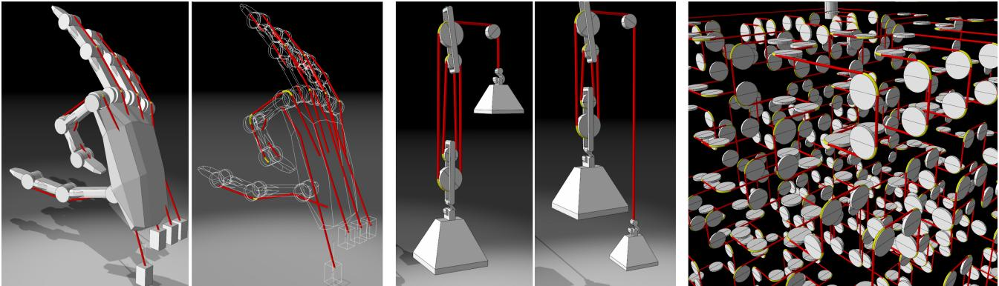

Figure 1: *Cable joints allow the fast and robust simulation of complicated arrangements of cables by defining a single constraint for each cable segment between two contacts.*

#### Abstract

*Robustly and efficiently simulating cables and ropes that are part of a larger system such as cable driven machines, cable cars or tendons in a human or robot is a challenging task. To be able to adapt to the environment, cables are typically modeled as a large number of small segments that are connected via joints. The two main difficulties with this approach are to satisfy the inextensibility constraint and to handle the typically large mass ratio between the small segments and the larger objects they connect.*

*In this paper we present a new approach which solves these problems in a simple and effective way. Our method is based on the idea to simulate the effect of the cables instead of the cables themselves. To this end we propose a new special type of distance constraint we call* cable joint *that changes both its attachment points and its rest length dynamically. A cable connecting a series of objects is then modeled as a sequence of cable joints which reduces the complexity of the simulation from the order of the number of segments to just the number of connected objects. This makes simulations both faster and more robust as we will demonstrate on a variety of examples.*

## CCS Concepts

•Computing methodologies → Physical simulation;

#### 1. Introduction

There is a large variety of dynamic systems that are driven by cables or ropes. Examples are cranes, pullies, cable cars, workout cable machines, bows or six DOF seats in VR applications. Humans and animals are cable driven via a net of tendons. This idea has been

c 2018 The Author(s)

Computer Graphics Forum c 2018 The Eurographics Association and John Wiley & Sons Ltd. Published by John Wiley & Sons Ltd.

adopted in robotics to make robots and robot hands more humanlike and more flexible.

Simulating cables in such systems is a challenging task. For a simulation, a cable has to be discretized, most commonly into a sequence of small segments. For cables to wrap correctly around objects and to resolve collisions accurately, these segments must be small. Cables are typically modeled as one dimensional structures. In such structures, the connectivity is much smaller than in cloth or soft bodies. As a consequence, enforcing inextensibility - a crucial constraint for cables - can get expensive if the number of segments is high. Iterative Gauss-Seidel or Jacobi type solvers are popular due to their simplicity and the fact that they match well to GPUs. However, in these solvers, errors propagate only one segment per iteration which prevents the simulation of long inextensible cables in real time. A second challenge for solvers is to handle constraints between objects with large mass ratios, in this case between the small cable segments and the large objects they drive. The approach we propose in this paper addresses both of these problems.

While devising our method, our main goal was to find a small number of carefully selected assumptions that allow the formulation of a novel, extremely simple, and robust algorithm which is still able to simulate virtually all real-world cable driven systems. We achieved this goal with the following set of assumptions:

- 1. It is sufficient to simulate the effect of cables on objects they connect rather than the cables themselves.
- 2. Cables do not slide on rotating objects.
- 3. Cables move in a plane which is perpendicular to the axis of rotation.

More specifically we assume that the effect cables have on adjacent bodies is not influenced by the dynamics of the cable apart from its resistance to stretching along the line between the contact points on the two adjacent objects. As we show in the results, this assumption holds to a high degree in most cable driven systems because the cables are typically much lighter than the objects they connect. In this paper we only discuss stretching resistance. However, our method allows the application of additional forces due to compression, the mass, twist or bending of the cable segments as well.

The second assumption can be justified by the observation that cable driven systems are typically designed to prevent sliding because slipping cables wear out quickly. Also, slipping is only possible if there is significant friction against the rotation of the wheel causing forces on the circumference that surpass the static friction limit. However, it would still be possible to model dynamic friction in our framework by maintaining a non-slip condition but adjusting the rotational friction of the wheels accordingly. For example, a cable slipping over a static wheel could be modeled by a cable sticking to a dynamic wheel with rotational friction.

The third assumption is natural because cables that run at an angle over a rotating wheel or cylinder fall off immediately even without any slipping (pure rolling). We have not encountered a system in which this assumption does not hold. In two dimensions, the assumption holds trivially.

Holding to these assumptions allowed us to formulate a novel extremely simple and robust simulation method with a significant speedup over existing methods. Our basic idea is to introduce a new type of joint between a pair of bodies we call *Cable Joint*. Because cables are represented simply by a set of joints, our model can be added easily to any existing rigid body engine. In addition, our method applies equally to cables, chains and ropes, and we use the term cables to refer to all primitives above in what follows.

Figure 2 shows the behavior of a cable joint. The joint simulates  
the effect a cable has on the two wheels. A cable joint is a uni-  
lateral upper distance constraint between two attachment points on  
two different bodies, i.e. it enforces  $d \leq \overline{d}\_n$ , where  $d$  is the current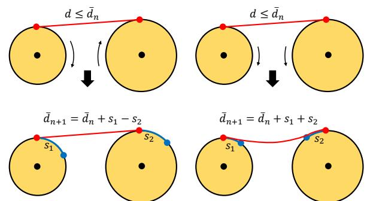

**Figure 2:** Top: A cable joint is a unilateral distance constraint (red line) between two attachment points (red points) with an upper distance limit  $\bar{d\_n}$ , i.e. it enforces  $d \leq \bar{d\_n}$ , where  $d$  is the current distance between the attachment points. Bottom: After both wheels have rotated, the attachment points have rotated to the positions shown in blue. A cable joint adjusts the attachment points in order to remain tangent to the two wheels. In addition, the upper distance limit  $\bar{d\_n}$  is updated to absorb the distances  $s\_1$  and  $s\_2$  the attachment points have moved along the surface of the wheels. The signs of the updates are dependent on the direction of the rotations.

distance between the attachment points and  $\bar{d}\_n$  the upper distance  
limit at time n. With fixed attachment points and after one time  
step, the attachment points would be at the locations shown in blue  
at the bottom of Figure 2. In contrast, a cable joint adjusts its attach-  
ment points to remain tangent to the two bodies. After updating the  
attachment points, the distance limit or rest length of the joint is  
adjusted to compensate for the distance the attachment points have  
travelled along the surface of the wheels. This has the effect that  
rest length, as a state of the constraint, can move from joints onto  
wheels and to other joints. This idea is crucial and – to the best of  
our knowledge - unique to our model. It allows us to simulate a  
single cable that is stretched in certain regions and loose in others.  
It also allows us to simulate spools by simply storing the amount of  
cable on a wheel using a single scalar value.Cable joints allow us to discretize cables into a low number of constraints equal to the number of objects touched by the cable rather than a potentially large number of small segments. In traditional methods, cable constraints get more complicated as the number of adjacent objects increases. In our case, all joints always connect exactly two objects. Without "knowing" of each other, they create the effect of a single cable connecting multiple bodies automatically. Our main contributions are:

- The introduction of cable joints as unilateral distance constraints with dynamic attachment points and rest lengths.
- The idea of representing a cable by a set of scalar rest lengths which can be passed over wheels from one segment to another.
- Methods to split and merge cable joints.
- Extensions such as spools and pinholes.

## 2. Related Work

While our method works with force and impulse based solvers as well, we use a position based rigid body engine similar to the one described in [\[DCB14\]](#page-9-0) and in a broader context in [\[BMM17\]](#page-9-1). Our engine also incorporates the handling of compliant constraints as detailed in [\[MMC16\]](#page-9-2). This allows us to correctly handle elastic cables, an effect that has not been treated in previous computer graphics work – to the best of our knowledge.

Early work on cable and wire simulation includes the method proposed by Brown et al. [\[BLM04\]](#page-9-3) to model knot-tying. They represent a wire by a sequence of segments. To guarantee inextensibility they solve the distance constraints quasi statically from front to back using the *follow the leader* method. The method produces significant artifacts in dynamic environments which were addressed by Müller et al. [\[MKC12\]](#page-9-4). Both methods are designed to handle free strands that are attached at one end such as in hair and fur. The same is true for the method proposed by Kim et al. [\[KCMF12\]](#page-9-5) in which additional constraints from each segment to the attachment point are introduced to make strands inextensible.

These methods simulate the entirety of cables or strands by mod-  
eling them as a sequence of small segments. The same is true  
for the method proposed by Servin et. al [\[SL08\]](#page-2-0) in which ca-  
bles are modeled by a sequence of jointed rigid bodies. To sta-  
bilize such a setup Ham et al. [\[Ham15\]](#page-2-1) formulate the problem  
as a Discrete Euler-Lagrange (DEL) equation and utilize regular-  
ization and stabilization to improve the numerical stability. There  
are other options to handle the problem of large mass ratios be-  
tween small cable segments and larger objects on the solver level.  
Tournier et al. [\[TNGF15\]](#page-2-2) proposed a global constraint solver that  
simultaneously handles stiff and compliant constraints and An-  
drews et al. [\[AMK17\]](#page-2-3) introduce damping based on the geometric  
stiffness component. Instead of using rigid bodies, another popular  
approach to simulate the segments of a cable is to use the rod model  
as in [\[ST08, Pai03, BAC\\*06, BWR\\*08\]](#page-2-4).More related to our approach are methods that use more flexible or simplified models for the cables instead of a sequence of uniform segments to increase robustness and fidelity of the simulation. Garcia et al. developed a method to robustly simulate cable driven systems such as cranes in [\[GFPCMD07\]](#page-9-13), [\[GFPCMD08\]](#page-9-14) and [\[GPM08\]](#page-9-15). The method is very similar to the one proposed by Servin and Lacoursiere [\[SL07\]](#page-9-16). As in our case, the cable connecting two bodies is represented by a single constraint. However, in contrast to our method, only pinholes are supported and the tension in the entire cable is assumed to be uniform.

More recently, Servin et al. proposed a multi-resolution method for the simulation of wires in [\[SLNB11\]](#page-9-17). It is more flexible and models the cable itself between contacts as well. The discretization changes dynamically to optimally represent the shape of the cable. The flexibility comes at the price of a more complicated algorithm however.

Sueda et al. [\[SJLP11\]](#page-9-18) propose a sophisticated way to represent wires using a combination of Lagrangian and Eulerian nodes. Our moving attachment points are related to their Eulerian nodes because they slide along the cable. However, our model is significantly simpler because we do not handle those nodes explicitly but

 c 2018 The Author(s) Computer Graphics Forum c 2018 The Eurographics Association and John Wiley & Sons Ltd. define them implicitly to be the tangent points on the objects. Also,
our moving attachment points are the only nodes simulated while
we replace Lagrangian nodes by storing rest lengths. Sachdeva et
al. [\[SSB\\*15\]](#SSB*15) similarly use a combined Eulerian and Lagrangian
Method to discretize tendon strands for hand simulation. In con-
trast to these methods, we do not change the discretization which
prevents the possibility of popping artifacts.There is related work outside graphics research as well. The idea of simulating the effect of a cable rather than the cable itself is related to the idea in biomechanics to represent an entire muscle by a single moment arm as described in [\[MdTFW04\]](#page-9-20). The *Vortex Engine* [\[Vor17\]](#page-9-21) supports cable simulation and uses the concept of non-flexible cable segments in which the cable between pulleys is modelled as one specialized constraint similar to our case. The constraint ensures that the rotation speed of the pulleys multiplied by their respective radii matches which is quite different from the effect of a cable joint. It is not clear whether a gear as shown in Figure [16](#page-7-0) can be simulated correctly without the notion of an attachment point. Furthermore, only bi-lateral and non-compliant behavior can be modelled without storing the amount of cable between the pulleys and connecting a pinhole or attachment with a pulley is not possible because the rotation speed is not defined there. Cable driven systems have become important in robotics as well. We refer the reader to the survey of [\[Naz12\]](#page-9-22).

## 3. The Basic Algorithm

After we have explained the basic idea behind cable joints, we will now discuss the overall method as detailed in Algorithm [1.](#page-2-0)

| Algorithm 1 Basic Algorithm                                                                                  |
|--------------------------------------------------------------------------------------------------------------|
| 1: procedure TIMESTEP                                                                                        |
| 2: for all cable joints do                                                                                   |
| 3: compute new attachments points $a'_l$ and $a'_r$                                                          |
| ▷ see Alg. 3 or 4                                                                                            |
| 4: $\bar{d} \leftarrow \bar{d} + surfaceDist(a_l, a'_l)$                                                     |
| 5: $\bar{d} \leftarrow \bar{d} - surfaceDist(a_r, a'_r)$                                                     |
| 6: $a_l \leftarrow a'_l, a_r \leftarrow a'_r$                                                                |
| 7: end for                                                                                                   |
| 8: for all cable joints do $\hat{d} \leftarrow \bar{d}$                                                      |
| 9: for all pinhole links do                                                                                  |
| 10: if $d_l > \hat{d_l}$ then                                                                                |
| 11: $\bar{d_l} \leftarrow \bar{d_l} + (d_l - \hat{d_l}), \bar{d_r} \leftarrow \bar{d_r} - (d_l - \hat{d_l})$ |
| 12: end if                                                                                                   |
| 13: if $d_r > \hat{d_r}$ then                                                                                |
| 14: $\bar{d_l} \leftarrow \bar{d_l} - (d_r - \hat{d_r}), \bar{d_r} \leftarrow \bar{d_r} + (d_r - \hat{d_r})$ |
| 15: end if                                                                                                   |
| 16: end for                                                                                                  |
| 17: runSolver()                                                                                              |
| ▷ treat all cable joints as unilateral distance joints                                                       |
| 18: end procedure                                                                                            |

#### 3.1. Cable Joints Connecting Wheels

Consider the scenario shown in Figure [2.](#page-1-0) The top row shows a cable joint at the current time step. It simply acts as a unilateral upper distance constraint between the red attachment points. Unilateral because we assume that the cable does not support endpoint to endpoint compression or at least that the system the cable is part of does not rely on compression support. This is the case for most cable driven systems. We could easily drop this assumption by using a bilateral constraint with a controllable stiffness in the compressed state.

The first key observation here is that the cable can only exert forces on the wheels in the stretched state. This is the reason why cable joints adjust their attachment points dynamically to remain tangent.

Apart from the adjustment of the attachment point's locations, we model the cable as a regular distance constraint between the bodies. This is correct if we assume that the cable does not slip on the wheels. This assumption holds if the wheels turn without resistance. It still holds with rotational friction if the force the cable exerts on the wheel exceeds the static friction limit.

The second key observation is that we have to compensate for
the change of the attachment locations by adjusting the joint's rest
length in order to get the correct behavior of the cable. Let us
go back to the bottom images of Figure 2. After the wheels have
turned, the attachment points of a regular distance constraint with
fixed attachments would be at the blue locations. To keep the cable
joint tangent to the wheels we have to move the attachment points
by the distances  $s\_1$  and  $s\_2$  along the surface of the wheels. In the ex-
ample on the left, these lengths correspond to the amount of cable
that was unwound from the left wheel and wound up by the right
wheel, respectively. Therefore  $s\_1$  has to be added and  $s\_2$  subtracted
from the rest length. On the right, the cable was unwound from both
wheels so both,  $s\_1$  and  $s\_2$  have to be added to the rest length.Note that our approach models both the stretched and the loose  
case of the cable. In the stretched case where  $d = \overline{d}$ , the cable joint  
is tangent to the wheels and it exerts forces. In the loose state,  $d$  is  
smaller than the rest length  $\overline{d}$ . In fact, the rest length  $\overline{d}$  can be signif-  
icantly larger than  $d$ . In the loose case, the points at which the cable  
leaves the wheels are not the tangent points. It would be quite dif-  
ficult to compute the true locations. Fortunately, because no forces  
are exerted in the loose state, the error introduced by keeping the  
constraint tangent has no effect on the simulation. We visualize the  
loose case by drawing a curved cable procedurally but for the sim-  
ulation we can still think of it as a straight line. Imagine that the  
wheels at the bottom right of Figure 2 make a full turn in the di-  
rection shown. In this case the circumference of both wheels would  
be added to the rest length  $\overline{d}$ . When the wheels switch the rotation  
direction, no force acts up until they do a full turn back at which  
point the cable joint correctly kicks in again.

So far we have not considered the fact that two circles have the four possible common tangents shown in Figure [3.](#page-3-0) To make the choice unique we specify an *orientation* for each wheel (black round arrows in Figure [3\)](#page-3-0) which needs to be specified by the user before the simulation starts. The orientation does not restrict the actual direction of rotation during the simulation. Based on these orientations and the order in which the bodies appear in the cable (red arrows) we pick the tangent as shown in the Figure [3.](#page-3-0) Defining the orientations and an ordered sequence of bodies completely defines a cable path in a system as shown in Figure [4](#page-3-1) up to the choice

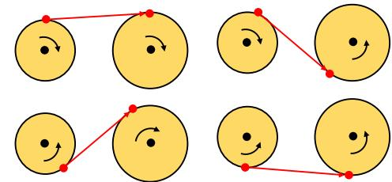

Figure 3: *Two circles have four possible common tangents. The correct tangent is chosen based on the orientation of the two wheels and their order.*

Figure 4: *The winding of the cable is defined by the orientations of the wheels. Flipping the orientations results in a new cable configuration.*

of making the cable open or closed. Choosing the tangents in this
way guarantees that the cable joints create a consistent cable. To
ensure joints behave correctly with respect to the chosen tangents,
the distances  $s\_1$  and  $s\_2$  have to be measured in the direction defined
by the orientation. Specifically, the distance is positive iff the ori-
entation of the segment on the wheel from the new to the previous
attachment point corresponds to the orientation of the wheel (as on
both sides of Figure 2). For convenience we provide code for the
computation of the attachment points for wheels in the Appendix.
Even though the cable joints do not "know" of each other and the
part of the cable on the wheels is not explicitly modeled, we get the
correct physical behavior of a chain and how it affects the bodies it
connects.#### 3.2. General Polygonal Shapes

It is straightforward to generalize the described approach to polygonal shapes (see Figure 5). On a mesh-based shape, the attachment point always coincides with a vertex of the convex hull because the cable on the body takes the shape of the convex hull. The distance on the surface - or the amount of cable that is added or removed has to be measured along the convex hull as well. Since the bodies both rotate opposite to their orientation in this particular case, the signs of  $s\_1$  and  $s\_2$  in the update formula are opposite to the signs in Figure 2. Figure 6 shows how the tangent between a wheel and a shape can be computed iteratively. We start with a random point on the wheel. Depending on the orientation of the shape we determine#### *M. Müller et al. / Cable Joints*

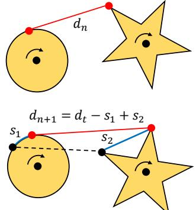

Figure 5: *Cable joint connecting a wheel and a general shape. On the shape, s*2 *is measured along the convex hull.*

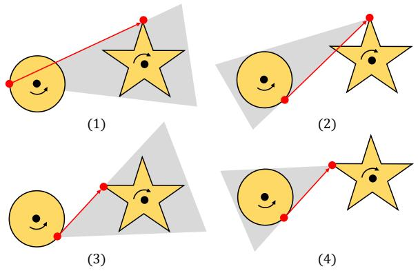

Figure 6: *Iterative construction of the common tangent. From a random point on the wheel, find the left-most visible point on the convex hull of the shape (1). From this point, find the leftmost point on the wheel. Continue until the points are not updated.*

the left- or rightmost point on the shape. From this point we find the left- or rightmost point on the wheel depending on its orientation. We repeat this process until the two points are not updated anymore. This iteration converges quickly in practice. The method works for the wheel–shape, shape–wheel and shape–shape cases and terminates in a finite number of steps. For the simpler wheel– wheel case, however, we use the explicit formula given above.

#### 3.3. Attachments and Pinholes

We can define different relationships between a cable and the object it connects to. In what follows we call this relationship a *link*. So far we have considered *rolling* links shown as red dots in all figures. We support three more types of link to allow the setup of general configurations like the one shown in Figure [7.](#page-4-2) The first is an attachment link shown in green. For such a link we simply neither modify the attachment point nor the rest length. The second type is a pinhole link depicted in blue in the same figure. We want the cable to slip through the hole and the hole to be fixed relative to a body. Therefore, we do not move the attachment point but adjust the rest

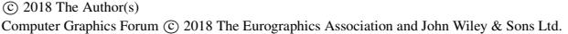

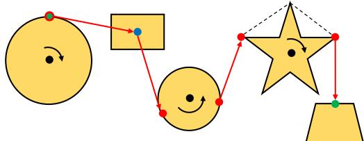

Figure 7: *A general setup with a pinhole link (blue), an attachment link (green) and a hybrid link (red-green). The dashed part of the cable is not simulated.*

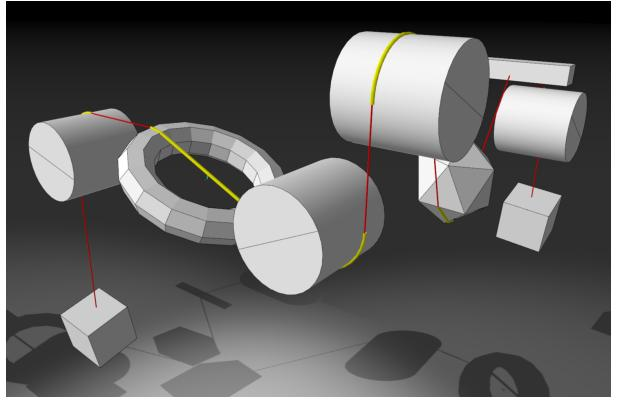

Figure 8: *Cable joints in 3D. For each 3D shape, a plane is defined in which the cable is restricted to move. For cylinders, the plane has to be perpendicular to the axis to create a circular cross section. The part of the cable simulated by cable joints is shown in red. The yellow parts are not simulated explicitly.*

lengths of the two adjacent cable joints such that their tensions (the current length divided by the rest length) are the same. This procedure is detailed in the second part of Algorithm [1.](#page-2-0) To compute the tangents between rolling and non-rolling links Algorithm [3](#page-9-23) is used. If both links adjacent to a cable joint are non-rolling, the tangent is simply the line connecting them.

#### 3.4. Cable Joints in 3D

In 3D cable driven systems, the cables often run within planes such as the tendons of a finger in the robot hand shown in Figure [1.](#page-0-0) For such a case, the entire cable can be simulated within a plane using the 2D algorithm. In order to be applicable to general systems, our method must be able to handle arbitrarily positioned bodies. Fortunately, the generalization to 3D is quite straightforward.

Figure 8 shows a more general case. In a situation like this we de-  
fine one local cross section plane per 3D object in which the cable  
is restricted to move. We have discussed why this is a reasonable  
restriction in the introduction. For cylinders we require this cable  
plane to be perpendicular to the cylinder's axis so that the cross sec-  
tion is a disc. Note that this requirement does not restrict adjacent  
wheels to be perpendicular to each other for the cable to be  $C^1$  con-  
tinuous as Figure 9 shows. For mesh-based shapes, the cable plane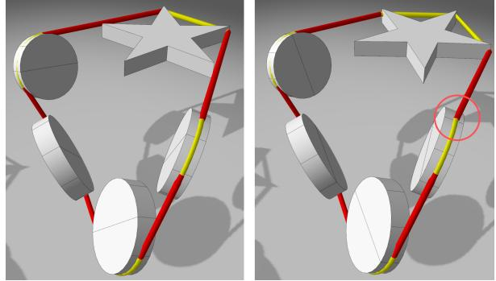

Figure 9: Left: for the cable to be C1 continuous at the attachment
points (transition from yellow to red), the wheels do not need to be
oriented perpendicular to each other. Right: the transition marked
with a circle kinks temporarily. For such a machine to work, the
wheel would have to be indented corresponding to our constrained
simulation.

can be chosen arbitrarily. As a pre-processing step we compute the convex hull of the cross section. In this way, we reduce the 3D to the 2D case.The main remaining question is how to compute tangents since
the cable planes of the two objects adjacent to a cable joint may not
coincide. Fortunately, the algorithm shown in Figure 6 works in
3D as well. The only modification is that the point from which the
ray is cast has to be projected into the local frame of the adjacent
body at each iteration. For the frequent case of two cylinders with
coinciding cable planes we use the disc - disc algorithm.## 4. Extensions

In the basic algorithm, the amount of cable between two links is
represented by the scalar  $\bar{d}$ . If the amount of cable *s* on the bodies is
tracked as well, a set of additional effects can be simulated as sum-
marized in Algorithm 2. The value *s* of each link is pre-computed
as the distance along the surface between the attachment points or
provided by the user to simulate a spool for instance. Then at every
time step the lengths are updated analogous to the update of the rest
lengths.## 4.1. Hybrid Links

A hybrid link (shown in red-green) in Figure 7 is a link that auto-  

matically switches between rolling and attachment. This link sim-  

ulates the fact that there is only a finite amount of cable on the  

adjacent body. If  $s$  becomes negative, the link becomes an attach-  

ment point simulating that the cable is used up. This situation is  

shown in Figure 10(2). We allow the hybrid link to become a rolling  

link again. This happens when the fixed attachment passes one of  

the two possible tangents as in Figure 10(5). Therefore, we always  

compute the rolling attachment points  $\mathbf{a}^{+}$  and  $\mathbf{a}^{-}$  for hybrid at-  

tachments. If the attachment point moves beyond one of the rolling  

attachments, we change the type of the link back to rolling. The  

orientation might have to be adjusted such that the correct tangent  

is chosen.

| Algorithm 2 Extended Features |                                                              |
|-------------------------------|--------------------------------------------------------------|
| 1:                            | <b>for all links do</b>                                      |
| 2:                            | s ← surfaceDist( $a_l$ , $a_r$ ) or user specified           |
| 3:                            | <b>end for</b>                                               |
| 4:                            | ...                                                          |
| 5:                            | <b>procedure TIMESTEP</b>                                    |
| 6:                            | ...                                                          |
| 7:                            | <b>for all cable joints do</b>                               |
| 8:                            | $s_l$ ← $s_l$ − surfaceDist( $a_l$ , $a'_l$ )                |
| 9:                            | $s_r$ ← $s_r$ + surfaceDist( $a_r$ , $a'_r$ )                |
| 10:                           | <b>end for</b>                                               |
| 11:                           | <b>for all links do</b>                                      |
| 12:                           | <b>if</b> s < 0 <b>and</b> type = hybrid rolling <b>then</b> |
| 13:                           | type ← hybrid attachment                                     |
| 14:                           | else if type = hybrid attachment then                        |
| 15:                           | compute rolling attachments a+ and a-                        |
| 16:                           | if surfaceDist(a+, a) < 0 then                               |
| 17:                           | type ← hybrid rolling positive                               |
| 18:                           | else if surfaceDist(a+, a) > 0 then                          |
| 19:                           | type ← hybrid rolling negative                               |
| 20:                           | end if                                                       |
| 21:                           | end if                                                       |
| 22:                           | end for                                                      |
| 23:                           | for all rolling links with s < 0 do                          |
| 24:                           | merge adjacent joints; set inactive                          |
| 25:                           | end for                                                      |
| 26:                           | for all cable joints intersecting inactive link l do         |
| 27:                           | split joint using l; set l active                            |
| 28:                           | end for                                                      |
| 29:                           | runSolver()                                                  |
| 30:                           | end procedure                                                |

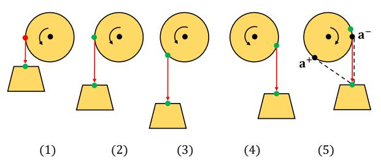

Figure 10: A hybrid link. As long as there is enough cable on the
wheel the link acts like a rolling link (red) (1). When the cable is
used up it switches to an attachment (green) (2) - (4). It remains
an attachment until the attachment point passes one of the rolling
attachments  $a^-$  or  $a^+$  (5). In this case the orientation of the body
might have to be adjusted to match the actual tangent.

#### *M. Müller et al. / Cable Joints*

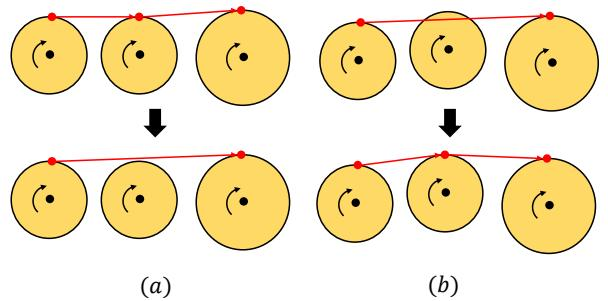

Figure 11: *Merge and split events: (a) If the amount of cable stored on a body becomes negative, the left joint is removed and its rest length added to the rest length of the right joint. (b) If the tangent of a joint intersects a body, a new cable joint is created. The rest length is split such that the tension remains constant.*

# 4.2. Merges and Splits

Cable joints allow the simulation of dynamically changing environments too. For this, joints have to be removed and added dynamically. We do this by performing merge and split events as shown in Figure [11.](#page-6-0) A cable joint is deleted in a merge event shown in Figure [11\(](#page-6-0)a). A merge event is triggered when two cable joints are adjacent to a body via rolling links and the amount of cable contained on the body becomes negative. In this case we remove the second joint, add its rest length to the rest length of the first joint and link the first joint to the third body.

Cable joints are created during a split event as shown in Figure [11\(](#page-6-0)b). A split event is triggered when the tangent of a cable joint intersects a non-adjacent body. The first joint is redirected to the new body and a new joint is created that connects the intersecting body with the second body of the original joint. The rest length of the original joint is distributed among the new joints such that the tension on both sides are equal.

In a split event, a cable plane for the new link needs to be determined. Such a plane could be chosen based on the location of the cable and the adjacent objects. In our implementation we use a simpler but more restricted variant though. In merge events we do not remove a link but only mark it as inactive. In a split event we only check collisions against existing links and re-activate them.

## 5. Results

| Scene    | Cable Joints | Iterations | Time per frame |
|----------|--------------|------------|----------------|
| Simple   | 4            | 1          | 0.012 ms       |
| Servin   | 16           | 10         | 0.25 ms        |
| Pulley   | 6            | 15         | 0.3 ms         |
| Hand     | 28           | 20         | 1.7 ms         |
| Gym      | 16           | 20         | 2.5 ms         |
| Hilbert2 | 62           | 10         | 1.8 ms         |
| Hilbert3 | 498          | 10         | 60 ms          |

Table 1: *Timings*

 c 2018 The Author(s) Computer Graphics Forum c 2018 The Eurographics Association and John Wiley & Sons Ltd.

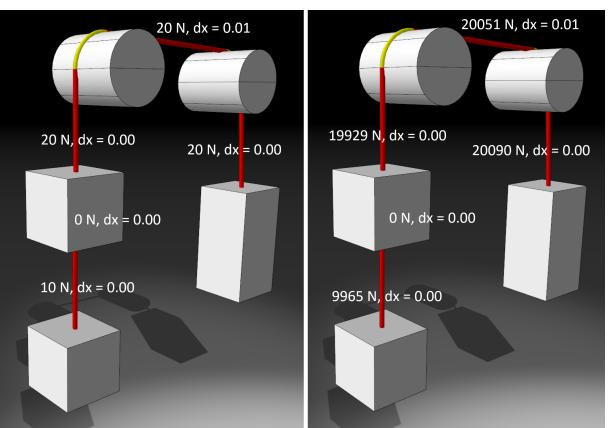

Figure 12: A simple setup to show that our approach computes accurate forces. The objects have a density one 1kg/m3 and of 1000kg/m3 on the left and right, respectively. The accuracy, stability and convergence are identical.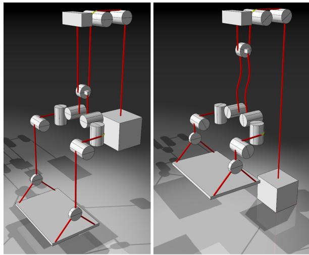

Figure 13: *A replication of an example used in [SLNB11].*

For our performance measurements we used a system with a Core-i7 CPU at 3.5 Ghz and 32 GB of RAM. Figure 12 shows a simple setup we used to perform a first set of tests. A cable with 3 attached bodies runs over two cylinders. The bodies on the left both have a volume of 1m3 and the volume of the body on the right is 2m3 while we set gravity  $g = 10m/s^2$ . The density of the bodies are 1kg/m3 on the left and 1000kg/m3 on the right experiment. 

The first observation is that our method computes the correct forces on all the cable joints shown in red. The accuracy, stability and convergence are identical and independent of the densities because we do not have to deal with the mass-ratio of the objects and the cable. With 10 solver iterations per frame, this example runs at 0.036 ms per frame. As the accompanying video shows, going down to a single iteration still yields reasonable results. The accuracy of the forces remains about the same while the error in distance in-

#### *M. Müller et al. / Cable Joints*

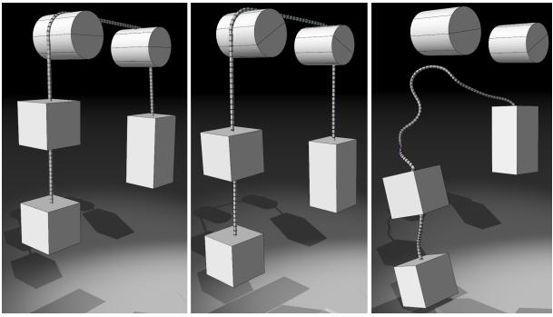

Figure 14: *Simulating the cable with 100 jointed rigid body segments. Even with 100 iterations, the cable is elastic. When it bounces back it loses contact and falls of.*

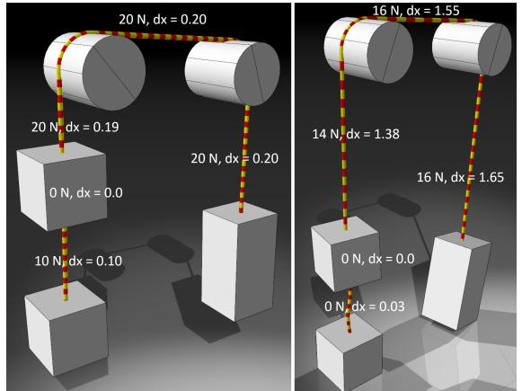

Figure 15: *The compliance formulation yields correct forces and elongations in the elastic case.*

creases to about 5 percent. With a single iteration, the performance increases to 0.012 ms per frame.

Servin et al. [\[SLNB11\]](#page-9-17) report 0.4 to 0.8 ms per frame for their multi-resolution approach and a single cylinder with two attached bodies. If we assume that the difference in complexity of the model compensates for the increase of processor speed since their publication we are 30 to 60 times faster. In another comparison we reproduced one of their more complex examples in Figure [13.](#page-6-2) Unfortunately they do not provide timings for this scene. With 10 iterations, we get a faithful reproduction of the behavior with 0.25 ms per frame which is still faster then their simple scene with a single cylinder.

We also compared our method to a naïve approach of represent-
ing the cable with a sequence of jointed rigid bodies - 100 in the
example (see Figure 14). Even with 100 Gauss-Seidel iterations
the cable remains elastic and falls off the cylinders when it bounces
back.Because our solver supports compliant constraints, we can also simulate elastic cables as shown in Figure [15.](#page-7-2) The compliance (in-

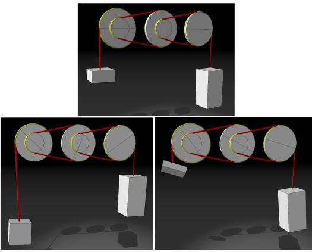

Figure 16: *A one-to-four gear. With a one to four mass ratio (top), the system is in equilibrium.*

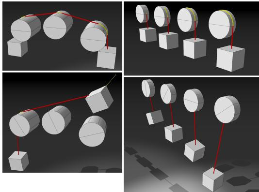

Figure 17: *Left: Merging and splitting of the cable. Right: Hybrid links with different inital rest lengths on the wheels.*

verse stiffness) is set to  $0.01m/N$  on the left with the expected elongations on the cables. On the right we set the compliance to  $0.1m/N$ . Now the bodies hit the ground reducing the forces and elongations.Figure [16](#page-7-0) shows a scene with a one-to-four gear. As expected, only for a one to four mass ratio of the attached bodies the system is in equilibrium (top). Similarly, the pulley in the center of Figure [1](#page-0-0) shows the expected behavior.

The setup on the left of Figure [17](#page-7-3) demonstrates splitting and merging of a cable as it touches or leaves a body. The experiment on the right shows the behavior of hybrid links. With an increasing initial amount of cable on each wheel (stored as a scalar value), the bodies fall further down until the link turns from rolling to fixed.

To test pinhole constraints we created the robot hand model shown on the left of Figure [1.](#page-0-0) The stretching tendons on the back of the fingers are elastic and interact via rolling contacts. The contracting tendons on the inside run through pinholes. With 20 iterations, a time step takes 1.7 ms.

To demonstrate the efficiency of our approach and the ability to

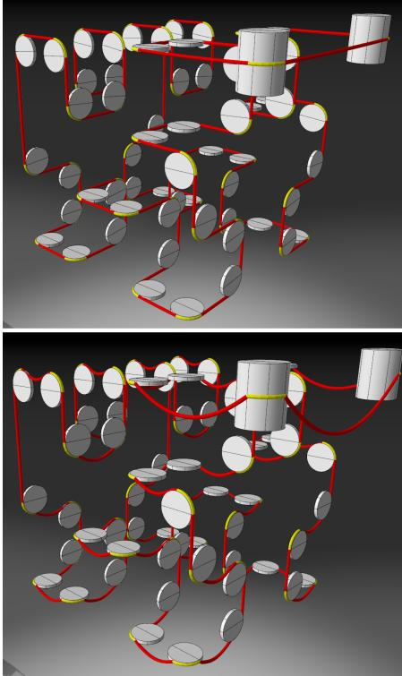

Figure 18: *A second degree 3d Hilbert curve connected by a cable. Top: The cable is stretched and the wheels start to turn immediately after the motor is turned on. Bottom: With a loose cable, the wheels start to turn one by one after each segment becomes stretched. In this case, the wheels would have to be indented to prevent the cable from falling off.*

simulate loose and tight parts within the same cable we connected
a level two 3d Hilbert curve [\[Hil91\]](#page-8-1) as shown in Figure 18. On
the top the cables are stretched. After the motor is turned on, all
the wheels immediately start to turn. On the bottom the cables are
loose. Now, the wheels start to turn one after the other because each
segment hast to be stretched before the force propagates to the next
wheel. The scene runs at 1.8 ms per frame with 10 iterations. For
fun we also created a level three Hilbert curve with  $8 \times 8 \times 8$  wheels
as shown on the right of Figure 1. With 100 iterations it runs at 60
ms per frame.Cable joints allow the simulation of systems under high tension as the example in Figure [19](#page-8-2) shows. To capture the fast vibrations of the bow's string we used 10 sub-steps, i.e. time steps per visual frame with 10 iterations each, resulting in 25 ms per frame.

Finally, in Figure [20](#page-8-3) we simulate a cable machine and show how a single stack of weights is enough to create the desired forces on the different handles.

## 6. Conclusion and Future Work

We have presented a new method to simulated cable-driven systems. The introduction of cable joints as generalizations of regular

 c 2018 The Author(s) Computer Graphics Forum c 2018 The Eurographics Association and John Wiley & Sons Ltd.

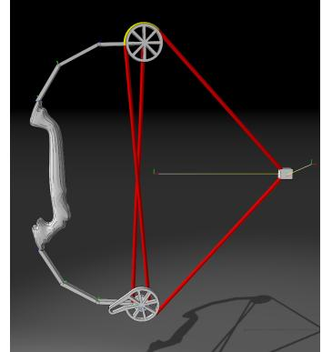

Figure 19: *Our approach allows the simulation of systems under high tension. For a fine time resolution we use 10 sub-steps i.e. time steps per visual frame.*

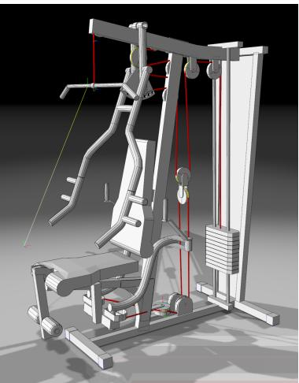

Figure 20: *The simulation of a cable machine showing how a single stack of weights is enough to create the desired forces on the different handles.*

distance joints allows the simulation of cables in a simple, effective and robust way and the integration into existing solvers. We showed that the concept of cable joints alone can model complicated scenarios for which elaborate simulation techniques have been used before.

As we showed, omitting the simulation of the cable itself is a reasonable simplification but it is also a limitation of the method. A possible extension would be to combine cable joints with existing methods to model the cable between contact points. This would improve the visualization and increase the accuracy of the split event which is mostly affected by the assumption of straight cables.

# References

[AMK17] ANDREWS S., M. T., KRY P.: Geometric stiffness for realtime constrained multibody dynamics. *Computer Graphics Forum 36*, 2 (2017), 235–246. [3](#page-2-1)

- [BAC∗06] BERTAILS F., AUDOLY B., CANI M.-P., QUERLEUX B., LEROY F., LÉVÊQUE J.-L.: Super-helices for predicting the dynamics of natural hair, August 2006. [3](#page-2-1)
- [BLM04] BROWN J., LATOMBE J.-C., MONTGOMERY K.: Real-time knot-tying simulation. *Vis. Comput. 20*, 2 (May 2004), 165–179. [3](#page-2-1)
- [BMM17] BENDER J., MÜLLER M., MACKLIN M.: Position-based simulation methods in computer graphics. In *EUROGRAPHICS 2017 Tutorials* (2017), Eurographics Association. [3](#page-2-1)
- [BWR∗08] BERGOU M., WARDETZKY M., ROBINSON S., AUDOLY B., GRINSPUN E.: Discrete Elastic Rods. *ACM Transactions on Graphics (SIGGRAPH) 27*, 3 (aug 2008), 63:1–63:12. [3](#page-2-1)
- [DCB14] DEUL C., CHARRIER P., BENDER J.: Position-based rigid body dynamics. *Computer Animation and Virtual Worlds* (2014). [3](#page-2-1)
- [GFPCMD07] GARCIA-FERNANDEZ I., PLA-CASTELLS M., MARTINEZ-DURA R. J.: A mixed model for real-time, interactive simulation of a cable passing through several pulleys. *AIP Conference Proceedings 936*, 1 (Sep 2007). [3](#page-2-1)
- [GFPCMD08] GARCÍA-FERNÁNDEZ I., PLA-CASTELLS M., MARTÍNEZ-DURÁ R. J.: Elevation cable modeling for interactive simulation of cranes. In *Proceedings of the 2008 ACM SIG-GRAPH/Eurographics Symposium on Computer Animation* (2008), SCA '08, pp. 173–181. [3](#page-2-1)
- [GPM08] GARCÍA-FERNÁNDEZ I., PLA-CASTELLS M., MARTÍNEZ-DURÁ R. J.: Analysis of a Cable Model, Considering Mass and Wave Oscillations. In *American Institute of Physics Conference Series* (Nov. 2008), Simos T. E., Psgihoyios G., (Eds.), vol. 1060 of *American Institute of Physics Conference Series*, pp. 170–173. [3](#page-2-1)
- [Ham15] Multibody dynamic analysis of a heavy load suspended by a floating crane with constraint-based wire rope. *Ocean Engineering 109*, Supplement C (2015), 145 – 160. [3](#page-2-1)
- [Hil91] HILBERT D.: Über die stetige abbildung einer linie auf ein flächenstück. *Mathematische Annalen 38* (1891), 459–460. [9](#page-8-4)
- [KCMF12] KIM T.-Y., CHENTANEZ N., MÜLLER-FISCHER M.: Long range attachments - a method to simulate inextensible clothing in computer games. In *Proceedings of the ACM SIGGRAPH/Eurographics Symposium on Computer Animation* (2012), pp. 305–310. [3](#page-2-1)
- [MdTFW04] MENEGALDO L., DE TOLEDO FLEURY A., WEBER H.: Moment arms and musculotendon lengths estimation for a threedimensional lower-limb model. *Journal of Biomechanics 37*, 9 (2004), 1447–1453. [3](#page-2-1)
- [MKC12] MÜLLER M., KIM T.-Y., CHENTANEZ N.: Fast Simulation of Inextensible Hair and Fur. In *Workshop on Virtual Reality Interaction and Physical Simulation* (2012), Bender J., Kuijper A., Fellner D. W., Guerin E., (Eds.), The Eurographics Association. [3](#page-2-1)
- [MMC16] MACKLIN M., MÜLLER M., CHENTANEZ N.: Xpbd: Position-based simulation of compliant constrained dynamics. In *Proceedings of the 9th International Conference on Motion in Games* (2016), MIG '16, pp. 49–54. [3](#page-2-1)
- [Naz12] NAZMA E.: Tendon driven robotic hands: A review. *IJMERR 1*, 3 (2012). [3](#page-2-1)
- [Pai03] PAI D.: Strands: Interactive simulation of thin solids using cosserat models. *CGF 21*, 3 (2003). [3](#page-2-1)
- [SJLP11] SUEDA S., JONES G. L., LEVIN D. I. W., PAI D. K.: Largescale dynamic simulation of highly constrained strands. *ACM Trans. Graph. 30*, 4 (July 2011), 39:1–39:10. [3](#page-2-1)
- [SL07] SERVIN M., LACOURSIERE C.: Massless Cable for Real-time Simulation. *Computer Graphics Forum* (2007). [3](#page-2-1)
- [SL08] SERVIN M., LACOURSIERE C.: Rigid body cable for virtual environments. *IEEE Transactions on Visualization and Computer Graphics 14*, 4 (2008), 783–796. [3](#page-2-1)
- [SLNB11] SERVIN M., LACOURSIERE C., NORDFELTH F., BODIN K.: Hybrid, multiresolution wires with massless frictional contacts. *IEEE*

*Transactions on Visualization and Computer Graphics 17*, 7 (July 2011), 970–982. [3,](#page-2-1) [7,](#page-6-3) [8](#page-7-4)

- [SSB∗15] SACHDEVA P., SUEDA S., BRADLEY S., FAIN M., PAI D. K.: Biomechanical simulation and control of hands and tendinous systems. *ACM Trans. Graph. 34*, 4 (July 2015), 42:1–42:10. [3](#page-2-1)
- [ST08] SPILLMANN J., TESCHNER M.: An adaptive contact model for the robust simulation of knots. *Computer Graphics forum 27*, 2 (2008), 497–506. [3](#page-2-1)
- [TNGF15] TOURNIER M., NESME M., GILLES B., FAURE F.: Stable constrained dynamics. *ACM Trans. Graph. 34*, 4 (July 2015), 132:1– 132:10. [3](#page-2-1)
- [Vor17] Theory guide: The vortex multibody dynamics engine. [3](#page-2-1)

## Appendix A: Wheel Tangents

For convenience we provide pseudo code to compute the tangent points on wheels based on the wheel's orientations.

| Algorithm 3 Tangent Point Circle |                                                                                                                                                                                                           |
|----------------------------------|-----------------------------------------------------------------------------------------------------------------------------------------------------------------------------------------------------------|
| 1:                               | procedure TANGENTPOINTCIRCLE( $p_1$ , $p_2$ , $r$ )                                                                                                                                                       |
| 2:                               | $\mathbf{d} \leftarrow \mathbf{p_2} - \mathbf{p_1}$                                                                                                                                                       |
| 3:                               | if $ \mathbf{d}  > r$ then                                                                                                                                                                                |
| 4:                               | $         \alpha \leftarrow         \begin{cases}           \arcsin(d_y/ \mathbf{d} ) & \text{if } d_x \geq 0 \\           \pi - \arcsin(d_y/ \mathbf{d} ) & \text{otherwise}         \end{cases}       $ |
| 5:                               | $\phi \leftarrow \arcsin(r/ \mathbf{d} )$                                                                                                                                                                 |
| 6:                               | $         \alpha \leftarrow         \begin{cases}           \alpha - \pi/2 - \phi & \text{orientation positive} \\           \alpha + \pi/2 + \phi & \text{otherwise}         \end{cases}       $         |
| 7:                               | return $\mathbf{p_2} + r \begin{bmatrix} \cos(\alpha) \\ \sin(\alpha) \end{bmatrix}$                                                                                                                      |
| 8:                               | end if                                                                                                                                                                                                    |
| 9:                               | end procedure                                                                                                                                                                                             |

Algorithm 4 Tangent Circle Circle

| 1:  | <b>procedure</b> TANGENTCIRCLECIRCLE( <b>p</b> 1, r1, <b>p</b> 2, r2)                                                                                  |
|-----|--------------------------------------------------------------------------------------------------------------------------------------------------------|
| 2:  | <b>d</b> ← <b>p</b> 2 - <b>p</b> 1                                                                                                                     |
| 3:  | r ← $\begin{cases} r_2 - r_1 & \text{orientations equal} \\ r_1 + r_2 & \text{otherwise} \end{cases}$                                                  |
| 4:  | <b>if</b>   <b>d</b>   > r <b>then</b>                                                                                                                 |
| 5:  | α ← $\begin{cases} \arcsin(d_y/ \mathbf{d} ) & \text{if } d_x \geq 0 \\ \pi - \arcsin(d_y/ \mathbf{d} ) & \text{otherwise} \end{cases}$                |
| 6:  | φ ← arcsin(r/  <b>d</b>  )                                                                                                                             |
| 7:  | <b>if</b> orientations equal <b>then</b>                                                                                                               |
| 8:  | α1 ← $\begin{cases} α - \pi/2 - φ & \text{orientation 1 positive} \\ α + \pi/2 + φ & \text{otherwise} \end{cases}$                                     |
| 9:  | α2 ← $\begin{cases} α - \pi/2 - φ & \text{orientation 2 positive} \\ α + \pi/2 + φ & \text{otherwise} \end{cases}$                                     |
| 10: | <b>else</b>                                                                                                                                            |
| 11: | α1 ← $\begin{cases} α - \pi/2 + φ & \text{orientation 1 positive} \\ α + \pi/2 - φ & \text{otherwise} \end{cases}$                                     |
| 12: | α2 ← $\begin{cases} α - \pi/2 + φ & \text{orientation 2 positive} \\ α + \pi/2 - φ & \text{otherwise} \end{cases}$                                     |
| 13: | <b>end if</b>                                                                                                                                          |
| 14: | <b>return p</b> 1 + r1 $\begin{bmatrix} \cos(α_1) \\ \sin(α_1) \end{bmatrix}$ , <b>p</b> 2 + r2 $\begin{bmatrix} \cos(α_2) \\ \sin(α_2) \end{bmatrix}$ |
| 15: | <b>end if</b>                                                                                                                                          |
| 16: | <b>end procedure</b>                                                                                                                                   |

 c 2018 The Author(s) Computer Graphics Forum c 2018 The Eurographics Association and John Wiley & Sons Ltd.