

Received 8 December 2024, accepted 24 January 2025, date of publication 7 February 2025, date of current version 28 February 2025.

*Digital Object Identifier 10.1109/ACCESS.2025.3539702*

# Controlling Cable Driven Parallel Robots Operations—Deep Reinforcement Learning Approach

MUHAMMAD KAMRAN JOYO[ID](#orcid-0000-0002-9451-7461)1,2, ABDULMAJEED M. ALENEZI[ID](#orcid-0000-0002-3454-1441)3, (Member, IEEE),  
WENFU XU1, (Senior Member, IEEE), MOHAMAD A. ALAWAD[ID](#orcid-0000-0002-3275-6433)4, (Senior Member, IEEE),  
MUHMMAD TAYYAB YAQOOB[ID](#orcid-0000-0002-1464-7191)5, NOOR MARICAR[ID](#orcid-0000-0002-4829-6497)6, (Senior Member, IEEE),  
AND SHEROZ KHAN[ID](#orcid-0000-0002-3226-8941)6, (Life Senior Member, IEEE)1School of Mechanical Engineering and Automation, Harbin Institute of Technology (Shenzhen), Shenzhen 518055, China

2Electrical Department, College of Engineering, PAF KIET, Karachi 75190, Pakistan

3Department of Electrical Engineering, Islamic University of Madinah, Madinah 42351, Saudi Arabia

4Department of Electrical Engineering, College of Engineering, Imam Mohammad ibn Saud Islamic University (IMSIU), Riyadh 11623, Saudi Arabia

5Avionics Department, College of Engineering, PAF KIET, Karachi 75190, Pakistan

6Department of Electrical Engineering, College of Engineering and Information Technology, Onaizah Colleges, Unaizah, Al Qassim 56447, Saudi Arabia

Corresponding author: Sheroz Khan (cnar32.sheroz@gmail.com)

**ABSTRACT** Deep Reinforcement Learning (DRL) is a powerful approach for generating control strategies for a variety of complex systems, representing an emerging paradigm in control applications. An important feature of Deep RL is that it does not explicitly model the process, but instead it relies on optimization-driven techniques to devise effective control policies. Despite its remarkable success in simulated environments, RL holds great potential in real-world applications. This article explores the complex challenges involved in implementing Deep Reinforcement Learning (DRL) algorithms on a cable-driven parallel robot. A key contribution of this work as specific advancement is the integration of a Proportional-Integral-Derivative (PID) controller within the RL framework, establishing a unique approach to CDPR control that leverages adaptive learning capabilities. A Reinforcement Learning (RL) agent for reference tracking is trained using the novel application of the adaptive-featured Twin Delayed Deep Deterministic (TD3) policy gradient algorithm, tailored to enhance CDPR adaptability and precision in dynamic environments. The first step is to test the performance of the trained agent on point-to-point robotic application tasks. As a result of such tasks, it is possible to evaluate the level of adaptability and performance of the RL agent. Multiple experiments are conducted to assess the versatility of the RL agent involving linear and circular scenarios. This research significantly advances the field by demonstrating the applicability of RL for complex robotic structures like CDPRs, showcasing promising results that underline the robustness and adaptability of the proposed approach. As a result of the TD3 adaptive learning process, the trained agent is able to perform the designated action in order to determine which policy stands out as the most rewarding.

**INDEX TERMS** Reinforcement learning, TD3 algorithm, proportional-integral-derivative (PID), cable driven parallel robots.

# **I. INTRODUCTION**

Cable-driven parallel robots (CDPRs) make very captivating and innovative branch of parallel mechanisms in contrast to

The associate editor coordinating the review of this manuscript and approving it for publication was Bin Xu.

rigid-actuated links. In CDPRs, the motion of the end-effector is synchronized by cables, motors, and pulleys instead of rigid links. In addition to its unique configuration, CDPR also offers a variety of convincing advantages that make CDPRs extremely useful tools in a wide range of commercial and industrial applications [\[1\]. Th](#page-9-0)e mechanical structure of CDPRs is significantly simpler and lighter than that of conventional parallel robots. Its simple design reduces manufacturing costs and enhances ease of maintenance. There has been significant research interests in Cable-Driven Parallel Robots (CDPRs) which are covering a wide range of domains, including kinematics and dynamics [\[2\],](#page-9-1) [\[3\],](#page-9-2) [\[4\],](#page-9-3) [\[5\], sta](#page-10-0)bility analysis [\[6\], vi](#page-10-1)bration characterisation [\[7\], an](#page-10-2)d out-of-plane vibration motion [\[8\]. Th](#page-10-3)e systematic approach to control has been one of the most important topics in literature on CDPRs, leading to the exploration of numerous control methods and techniques. CDPR positions and orientations have evolved to meet the complex challenges of defining, planning, and maintaining CDPR tasks. For a variety of applications, researchers have explored innovative control approaches to enhance their efficiency, reliability, and adaptability. A robust PID controller has been used in [\[9\],](#page-10-4) [\[10\]](#page-10-5) to experimentally control the planar CDPR, while impedance and proportional derivative (PD) controllers have been employed to regulate the cables in the rehabilitation robots. A sliding mode control technique, known for its ability to withstand external disturbances and uncertainties influencing the performance, has been used to maintain robust control of the CDPR [\[11\],](#page-10-6) [\[12\],](#page-10-7) [\[13\].](#page-10-8)

Cable-driven parallel robots (CDPRs) have recently been improved in terms of accurate tracking positions through the development of novel strategies. In recent developments, new strategies have emerged to enhance the accuracy of Cable-Driven Parallel Robots (CDPRs) in position tracking. Among these developments are synchronization control techniques applied in the cable space, and dynamic coordinated control methodologies in the task space [\[14\]. T](#page-10-9)he primary goal of these advanced approaches is to improve the accuracy of CDPRs when tracking desired positions and trajectories. It is challenging to employ classical control methods to control Cable-Driven Parallel Robots (CDPRs). When relying on trial-and-error approaches, it is difficult to adjust controller parameters while adhering to control input constraints. Achieving the desired control behaviour usually requires offline optimization, making the selection process time-consuming. A dynamic parameter adaptation process is also required when the reference input characteristics change, requiring a revised set of control parameters. To ensure that cable tensions remain consistently positive throughout the CDPR process, classical control methods that are model-based, rely on tension distribution algorithms. This is essential for CDPR cables not to sag since they can only withstand pulling forces. Consequently, optimization techniques are employed to ensure the most appropriate tension distribution [\[15\],](#page-10-10) [\[16\].](#page-10-11) However, determining optimal positive tension distribution requires the use of pre-designed controllers. As actuation redundancy increases, solving tension distribution problems becomes progressively difficult and time-consuming. This can cause system instability besides causing delays in control process.

Model-based state-space approaches, including the widely used Proportional-Integral-Derivative (PID) approach, have faced significant challenges in the context of CDPRs. These conventional methods are constrained by limitations and trade-offs primarily due to the inherent complexity of the CDPR systems. The dynamic intricacy of CDPRs, characterized by nonlinear behaviour and variable parameters, have posed considerable challenges to classical control designs. As a result, these systems demand innovative and specialized control strategies to maximise their capabilities and address the unique challenges learning-based control methods [\[17\].](#page-10-12) The recent application of Reinforcement Learning (RL) algorithms to robot control across a wide range of applications is particularly noteworthy. RL has emerged as a powerful tool for orchestrating robotic systems, particularly regarding complex tasks such as path planning, dynamic obstacle avoidance, and complicated assembly tasks. The integration of RL greatly contributes to improving the machine learning (ML), emphasizes on decision-making techniques to maximize rewards. Based on the specified policy, a learning and decision-making agent performs a series of actions. When an agent performs an action, the environment sends a reward signal in the form of numerical values. The RL process relies on this continuous interaction between the agent and the environment [\[20\]. B](#page-10-13)y adapting to complex tasks, RL is able to handle a wide spectrum of CDPR applications across a wide ranging dominions. RL also leads to the creation of an artificial neural network controllers after the learning process. A distinct advantage of this controller is its reasonable computational cost, making it practical and efficient to use in real-life applications. RL has focused on enabling agents to refine their policies over time to make better-informed decisions, and ultimately optimize the rewards they receive iteratively from the environment. During this iterative process, the agent observes the effects of various actions in order to determine which strategies are most suitable. This framework forms the basis for intelligent systems to learn and adapt to their environments. Therefore, refining policies is valuable in a range of domains, such as robotics, gaming, and autonomous systems. Using Reinforcement Learning (RL) to control Cable-Driven Parallel Robots (CDPR) eliminates reliance on conventional tension distribution algorithms. Instead, the RL approach facilitates the generation of the necessary control inputs through a learning process. The reward system continuously adjusts rewards based on various actions, guiding thus agents toward desired control behaviours. Its autonomous trial-and-error learning ability sets the RL outstandingly different from other algorithms. Over time, after experimenting with various actions and their outcomes, it gradually acquires the knowledge necessary to perform the appropriate control actions. Using RL methods to control Cable-Driven Parallel Robots (CDPRs) overcomes many of the limitations commonly encountered with traditional model-based controllers. RL has a distinct advantage over traditional control methods in terms of adaptability to diverse reference signals. In this way, controller parameters can be moderated without using resource-intensive offline optimization methods and without having to fine-tune them for each distinct reference signal. A key element of RL learning process is managing control input constraints. The RL agents seamlessly accommodate control input constraints during training. This differs from traditional control methods, where enforcing such constraints can be complex. By simply using these inherent features, control inputs can be kept to within acceptable limits, contributing to the safety and stability of CDPR operations. Nowadays, using RL to exercise controlling CDPRs is relatively uncommon [\[21\],](#page-10-14) [\[22\],](#page-10-15) [\[23\].](#page-10-16) This study investigates Reinforcement Learning (RL) in the context of a planar Cable-Driven Parallel Robot (CDPR) to determine how effectively it can perform a specific tracking task. The CDPR configuration, in this case, features eight cables and three [\(8\)-](#page-4-0)[\(3\)](#page-3-0) degrees of freedom. Evaluating the performance of an RL agent in tracking a given reference path is the main objective of this study. Unlike conventional control techniques, this study leverages the Twin Delayed Deep Deterministic Policy Gradient (TD3) algorithm for real-time PID parameter tuning in CDPRs, a novel application that extends the use of RL in complex robotic systems. The proposed approach addresses critical challenges in trajectory tracking accuracy, stability, and smooth control, contributing both theoretically and practically to the fields of RL and robotic control. The study highlights the potential of RL agents in achieving accuracy and point-to-point control within the framework of CDPRs through their adaptability and learning ability.

The paper is organised by detailing the configuration of the CDPR system in Section [II.](#page-2-0) Section [III](#page-3-1) provides a detailed explanation of the Reinforcement Learning (RL) and describes the underlying principles and algorithms of RL. The section [IV](#page-5-0) describes the underlying principles and algorithms of RL, highlighting the complex aspects of applying RL to CDPR. Furthermore, the critical design parameters of the RL methodology are meticulously explained, providing valuable insights into how the learning process is structured. A detailed analysis of the RL methodology is followed by analysis of the simulation results in Section [V.](#page-6-0) The results of CDPR applying RL are discussed in this section. Each result is precisely examined and explained in details in the context of the specific tracking task. In conclusion, the paper summarizes the main findings and insights obtained from this study as a concise summary in Section [VI](#page-9-4) which suggests potential avenues for further work.

#### **II. CABLE DRIVEN PARALLEL ROBOT**

Cable-Driven Parallel Robots (CDPRs) are distinguished by their parallel cable-driven system, which is one of the most distinctive types of manipulators. The operation of a CDPR is governed by four fundamental components. In CDPRs, a stable and immovable base platform stands at its core. Providing essential support and stability for the robot's movement and tasks, this anchor serves as the robot's foundation. It is the actuators that generate the dynamic force in a CDPR. Cables that drive the system are controlled by these mechanisms. As the actuators rotate, the CDPR can perform precise movements and tasks, giving it a high degree of flexible control. It is the end-effectors that interact with the environment and perform specific tasks. As a result of the actuators' adjustment in cable length, the end-effector's movement and position are facilitated. An actuator is connected to an end-effector by cables in the CDPR. The end-effector is controlled and moved through the manipulation of cable lengths, which is accomplished by rotating actuators. CDPR's range of motion and precision depend heavily on cables.

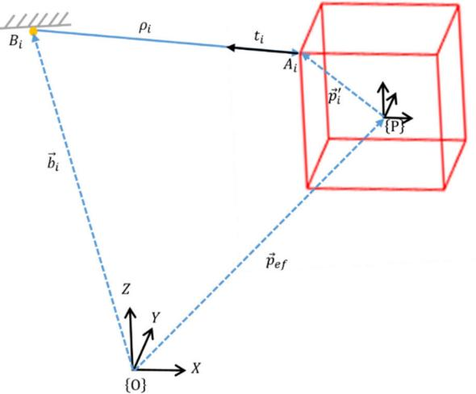

**FIGURE 1.** Schematic representation of CDPR.

A schematic representation of the CDPR used in this study is as shown in Figure 1. This is a configuration featuring eight cables and spatial arrangements. This construct forms the basis of the research investigation and analysis that provides a solid foundation for understanding the attributes of this CDPR. The CDPR under consideration is equipped with four fixed poles arranged vertically as presented in Figure 2. The end-effector, consisting of a square-shaped structure, is equipped with eight corresponding attachment points. These eight cables facilitate operation by establishing mechanical connections between these attachment points. End-effectors are connected to fixed poles by these cables. The operation of the end-effector movement is made possible by the harmonised adjustment of these drive cables. Table 1 illustrates the connection points for mobile platform. By adjusting the length and applying appropriate forces to each cable, the mobile platform can be made to follow a predefined trajectory. This cable drive mechanism precisely controls the position and orientation of the end-effector, allowing it to perform a wide range of movements and tasks with accuracy and dexterousness. In this configuration  $A\_i$  symbolizes the attachment points located on the mobile platform, the mobile part of the robot responsible for interacting with the environment, whereas  $B\_i$  represents the attachment point (X, Y, Z) situated on the fixed base of the robot, and

*ρi* denotes the length of the *nth* cable while *O* refers to the global reference frame. Objects in the CDPR's environment are represented using this coordinate system. This provides a fixed reference for spatial measurements while *P* signifies the local reference frame. The local frame, in contrast to global, is connected to the end effector of the CDPR. Within a CDPR system, it refers to the relative position and orientation of the end-effector. The generalized coordinates  $\vec{q}$  of a mechanism include various parameters associated with its configuration, position and orientation as represented by Equation (1).

$$\vec{q} = \begin{cases} \vec{q}\_{ef} = [x\_{ef}, y\_{ef}, z\_{ef}, \alpha\_{ef}, \beta\_{ef}, \gamma\_{ef}]^{T} \\ \vec{q}\_{b} = [x\_{i}, y\_{i}, z\_{i}]^{T} \end{cases}, i = 1 \text{ to } n$$

$$(1)$$

where  $\vec{q}\_{ef}$  and  $\vec{q}\_b$  represent the generalized coordinates of the
anchor points on the mobile platform and the fixed base of the
CDPR. The coordinates of attachment points  $A\_i$  of the mov-
ing platform can be represented as expressed in Equation (2).
$$A\_{i} = \vec{p}\_{ef} + R \vec{p}\_{i}', \text{ } i = 1 \text{ to } n \text{ } (2)$$

where  $\vec{p}\_{ef}$  represents a constant position vector in the frame *O*, *R* is the rotation matrix, whereas  $\vec{p}'\_i$  is the constant position vector in the frame *P*.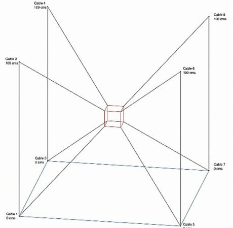

**FIGURE 2.** Structure of CDPR.

**TABLE 1.** Anchor points at mobile platform in local frame (m).

|   | A1    | A2    | A3    | A4    | A5    | A6    | A7    | A8   |
|---|-------|-------|-------|-------|-------|-------|-------|------|
| x | -0.05 | -0.05 | -0.05 | -0.05 | 0.05  | 0.05  | 0.05  | 0.05 |
| y | -0.05 | -0.05 | 0.05  | 0.05  | -0.05 | -0.05 | 0.05  | 0.05 |
| z | -0.05 | 0.05  | -0.05 | 0.05  | -0.05 | 0.05  | -0.05 | 0.05 |

For CDPR, solving the Inverse Kinematics (IK) is generally straightforward. However, Forward Kinematics (FK) requires a more complex procedure. FK is employed todetermine the position and orientation of a moving plat-
form based on the length of actuator cables. This particular
aspect of kinematics is of significant importance, especially
when implementing closed-loop position control in parallel
mechanisms. Unlike the forward kinematics of serial manip-
ulators, the forward kinematics of CDPRs does not offer a
closed-form solution, especially for the most common CDPR
configurations. This complexity requires specialized method-
ologies and numerical approaches to effectively address the
FK problem in CDPRs. The Cable-Driven Parallel Robot
(CDPR) under study is characterized by a set of equations
that are both nonlinear and over-determined. In this context,
the number of unknowns involved is less than the number
of equations in the system. This configuration poses unique
challenges for the mathematical representation of robot kine-
matics. The widely recognized Levenberg-Marquardt least
squares method has been adopted as a nonlinear model solver
to address the FK problem [\[24\]](#page-9-1). Furthermore, FK is specified
by input parameters encompassing the cable length,  $\rho\_i$ , and
the output corresponds to the moving platform pose  $\vec{q}\_{ef}$ .
In the context of inverse kinematic problems, the pose of the
moving platform, including both its position and orientation,
is already known. In this scenario, the unknowns in the prob-
lem are the lengths of the eight cables. Referring to Figure 1,
an overview of the closed loop kinematic chain for each cable
can be provided as given in Equation (3).

$$\rho\_l = \left\| \vec{p}\_{ef} + R\vec{p}\_l' - \vec{b}\_l \right\|, \quad i = 1 \text{ to } n \tag{3}$$

Solving Equation (3) for each pose of the moving platform yields cable lengths of the individual cables. This is done using Linear programming optimization tool in MATLAB as described in the study [\[25\]](#page-3-1).### **III. REINFORCEMENT LEARNING**

Reinforcement Learning (RL) frameworks involve instruct-ing decision-making agents on how to maximize numeri-cal reward signals while simultaneously mapping states to
actions. The RL agent operates to interact with the environ-ment in the real-world domain of robots. It is governed by the
concepts of a Markov Decision Process (MDP), an environ-ment containing all pertinent historical data that can influence
the process's future behaviour. The current state incorpo-rates all relevant information for decision-making. The future
course of the system depends solely on the current state and
action, rather than the past sequence of states. As shown in
Figure 3, the RL agent constantly interacts with this MDP
environment. The agent chooses an action based on its current
state. This represents the decisions or choices at that time.
In response to the selected action, the environment responds
by updating to the next state. The agent's actions within
the current state leads to a new state. At the same time,
the environment provides the agent with reward signals as
feedback. Reward signals serve as quantitative measures of
the success or desirability of the chosen action. The contin-uous interaction between the RL agent and the environment is driven by this continuous cycle of action selection, state transition, and reward reception. Over time, the agent's goal is to maximize the cumulative reward signal by learning and adapting its decision-making policy.

The fundamental components of MDP can be defined as:

- - $S\_t$  → The state of an agent at any instant in time, *t*.
- - *A*t → The action chosen of the state at time , *t*.
- - *R*t+1 → The reward from action , *A*t. $R\_{t+1}$  → The reward from action,  $A\_t$ .
- •  $p$ → Describes the system dynamics and specifies the  
probability of transitioning from one state to another  
when a particular action is taken. For a given state,  $s$ ,  
action  $a$  and resulting state,  $s'$ , as well as the associated  
reward  $r$ , the transition probability function is denoted  
by Equation (4) as  $p(s', r | s, a)$ .
- $\gamma \in \{0, 1\}$  → Describes a parameter which determines  $\gamma \in \{0, 1\}$  → Describes a parameter which determines
the agent's time preference for future rewards relative to
immediate rewards. It typically ranges between 0 and 1.
Larger values indicate that the agent values distant future
rewards, while smaller values place more emphasis on
immediate rewards.

$$p (s', r | s, a)$$

$$= Pr \{S\_{t} = s', R\_{t} = r, | S\_{t-1} = s, A\_{t-1} = a\},$$

$$(s', s) \in S, r \in R, a \in A(s)$$

(4)

where  $\{S, A, P, R, \gamma\}$  are the components of MDP any time,  $t$ .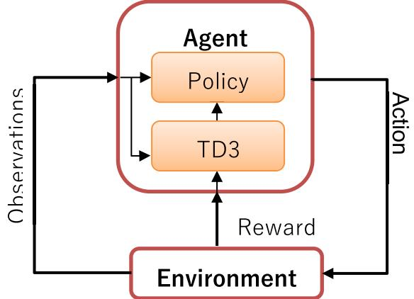

**FIGURE 3.** A RL system interacting with its environment.

Therefore, the RL Agent aims to achieve the highest cumu-lative reward over time by choosing actions that maximize it. To achieve this, agents follow certain probabilistic or deterministic policies that determine their choices. There are several policy options that the agent can follow in its present state, but only one of them is optimal, denoted by  $\pi\*$ . Based on interactions with the environment, the most optimal pol-icy is the one that produces the highest cumulative reward. To find this optimal policy, RL employs various approaches such as Q-learning and DQN, which are algorithms built on value-based RL. The value-based function estimates the cumulative reward expected by following a particular pol-icy in a particular state. Once the optimal value function isidentified, the corresponding policy can be derived. Another approach includes policy-based methods such as DDPG, A3C, and TD3, which seek to determine the optimum pol-icy itself. These methods focus on learning optimal policies for selecting actions without explicitly computing the value function. Whether a value-based or policy-based approach is appropriate depends on the specific characteristics of the RL approach being addressed. Finding the optimal policy or strategy that maximizes the agent's long-term rewards is the ultimate goal. These methods are advantageous when dealing with continuous state and action spaces, which often arise in robotics and control applications.For training purposes, a Twin Delayed Deep Deterministic
(TD3) Policy Gradient agent has been effectively employed,
as outlined in reference [\[20\]](#page-4-1). TD3 is specifically designed for
continuous action spaces and is an improvement over DDPG,
addressing some of the challenges associated with determin-
istic policy gradients. TD3 introduces key features such as
target policy smoothing, delayed updates, and the use of two
critic networks to mitigate issues like overestimation bias
and policy instability, which can occur in high-dimensional
continuous environments. These enhancements make TD3
particularly effective for off-policy learning in scenarios
requiring precise control, as in the case of CDPR.In TD3, two critic networks are used to estimate the Q-values, denoted by  $Q\_{\theta\_1}(s, a)$  and  $Q\_{\theta\_2}(s, a)$ , where  $s$  represents the current state,  $a$  the chosen action, and  $\theta\_1$  and  $\theta\_2$  are the parameters of the two critic networks. By taking the minimum of these Q-values during updates, TD3 reduces the risk of overestimation bias, which can otherwise lead to suboptimal policies. The target Q-value for the critic update is calculated as:
$$y = r + \gamma Q\_{\theta'\_{i}}(s', a'); \quad i = 1, 2 \qquad (5)$$

where  $r$  is the reward received after action  $a$  is taken in state s,  $\gamma$  is the discount factor that prioritizes long-term rewards, and  $Q\_{\theta'\_i}$  represents the target critic networks with parameters  $Q\_{\theta'\_1}$  and  $Q\_{\theta'\_2}$ . The next action  $a'$  is derived using a smoothed version of the target actor policy, calculated as:
$$a' = \pi\_{\theta'} \left( \mathbf{s'} \right) + N \tag{6}$$

Here,  $\pi\_{\theta'}(s')$  denotes the target actor policy at the next  
state s', with noise *N* sampled from a normal distribution  
to prevent overfitting. The critic networks are trained by  
minimizing the loss between the predicted Q-values and the  
target Q-value y.
$$L(\theta\_{i}) = \mathbb{E}\left[ \left( \mathcal{Q}\_{\theta\_{i}} \left( s, a \right) - y \right)^{2} \right] \qquad (7)$$

To enhance stability, TD3 performs policy (actor) updates
less frequently than critic updates. This delayed policy update
maximizes the Q-value output of the first critic network,
updating the policy according to:
$$\nabla\_{\theta} J(\theta) = \mathbb{E}\left[\nabla\_{a} (Q\_{\theta\_{1}}(\mathbf{s}, a) \, | \, a = \pi \theta(\mathbf{s}) \nabla\_{\theta} \pi\_{\theta}(\mathbf{S})\right] \quad (8)$$

The TD3 agent encompasses a total of six neural networks, each of which plays a distinct role in the learning process.Within these networks, one plays a key role of ''target actor.'' This network of target actors is primarily responsible for defining the control policy process once the training procedure reaches its conclusion. The policy is instrumental in determining the optimal action to be taken in response to an observed state, thereby guiding the agent in decision-making process.

In our approach, we harnessed Reinforcement Learning (RL) to train a Deep Neural Network (DNN) as the controller for the motion of a Cable-Driven Parallel Robot (CDPR). At each time step, the controller receives information about the current kinematic state of the CDPR. This state is characterized by key parameters, including the length and angular velocity of the cable and the target cable length. Together, these inputs represent the relevant information needed to make control decisions. In this context, the action space is an 8-dimensional vector. Each element of this vector corresponds to the updated PID parameters that command the motor activations of the eight actuators present in the CDPR model. In other words, it specifies how much each motor should be activated or adjusted in response to the current state.

# **IV. CONTROL OF THE CDPR USING TD3**

# A. SETUP OF THE REINFORCEMENT LEARNING

Figure 4 shows the implemented controller training
paradigm. The actor-critic Reinforcement Learning (RL)
algorithm employed in this study leverages a two-network
architecture, where the actor-network is implemented as a
Deep Neural Network (DNN). This actor-network is designed
to monitor kinematic state variables and perform paramet-
ric optimization for the controller. It is worth noting that
the controller, in turn, governs the manipulation of cable
lengths within the system. Consequently, the position of the
end-effector changes in response to the cable movements, and
the disparity between this position and the reference signal
is computed to obtain the observation matrix. In contrast, the
critic network is also implemented as a Deep Neural Network
(DNN). Its primary function is to map state-action pairs to the
anticipated or expected rewards of a particular action taken
in a specific state. These expected rewards serve as important
feedback in the RL training process. They are instrumental in
enabling the parameter update function to adapt and improve
the actor network parameters. The overarching goal of this
adaptation process is to maximize the rewards received during
the training of the controller. There are no specific guidelines
for network design and hyper-parameters selection; instead,
these choices depend on the specific problem at hand, and
are therefore, determined through trial and error. Simulations
continue until a satisfactory control result for the CDPR
is achieved. In this study, the RL agents are trained using
identical network structures and hyper-parameters, as listed
in Table 2. The scaling layer enforces bounds on actuator
torques, limiting them to a minimum of 0.06 Nm and a
maximum of 1.4 Nm, effectively preventing the generation
of excessively large or negative cable tensions.

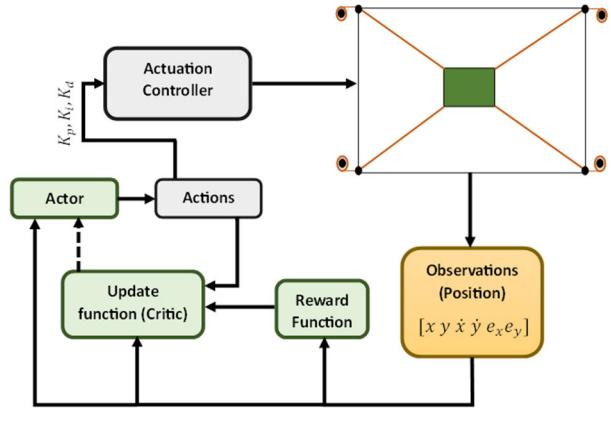

**FIGURE 4.** RL actor and critic structure.

The input to the simulation environment is actions vector *At* given by Equation [\(9\).](#page-5-2)

$$A\_I = \begin{bmatrix} k\_{pn} & k\_{in} & k\_{dn} \end{bmatrix} \tag{9}$$

The output from the simulation is measured as the state vector,  $S\_t$ , given by Equation (10).
$$\mathbf{S}\_{\mathbf{l}} = \begin{bmatrix} \mathbf{x} & \mathbf{y} & \dot{\mathbf{x}} & \dot{\mathbf{y}} & e & \dot{e} \end{bmatrix} \tag{10}$$

where  $x$  and  $y$  are the position coordinates,  $\dot{x}$  and  $\dot{y}$  are velocity components, and  $e$  and  $\dot{e}$  represent the tracking error and error rate. This observation setup enables the agent to assess the kinematic state and tracking error for effective control.#### B. NEURAL NETWORK

The neural network architecture for the Twin Delayed Deep Deterministic Policy Gradient (TD3) algorithm in this study consists of two critic networks and one actor network, each with a corresponding target network. Each critic network has an input layer that takes a 24-dimensional state-action vector, two hidden layers with 200 nodes each using the ReLU activation function, and an output layer with a linear activation to estimate the Q-value. The actor network, designed to generate optimal actions, also has a 24-dimensional input layer, followed by two hidden layers with 64 and 32 nodes using ReLU, and an output layer that produces a 24-dimensional action vector. The actor's output layer uses the tanh activation function to constrain actions within a stable range, while ReLU is used in the hidden layers to prevent vanishing gradients and support effective learning.#### C. REWARD FUNCTION

The RL agent is motivated by receiving reward at each time step, guided by a predefined reward function described in equations [\(11\),](#page-6-2) [\(12\),](#page-6-3) and [\(13\).](#page-6-4)

This reward function measures the agent's performance and is designed to encourage actions that lead to the desired results, such as precise tracking of the target position. The reward function is employed to control the Cable-Driven Parallel Robot (CDPR) designed with three distinct components, each serving a specific purpose in shaping the behaviour

TABLE 2. Hyperparameters for algorithm.

| Parameters                      | Values    |
|---------------------------------|-----------|
| Learning rate α (Actor network) | 1 × 10-3  |
| Experience replay buffer        | 1 × 106   |
| Discount factor γ               | 0.99      |
| Mini-batch size                 | 128       |
| Sample time                     | 0.1       |
| Target smooth factor λ          | 0.31622   |
| Noise variance                  | 0.3       |
| Max episodes                    | 5000      |
| Critic Neural Network structure | (200,200) |
| Actor Neural Network structure  | (64,32)   |

of the Reinforcement Learning (RL) agent [\[26\]](#page-6-1). The first reward component,  $R\_1$ , given by equation (11), penalizes the RL agent for tracking errors. Penalties grow exponentially if tracking errors are large, meaning that large error will result in large penalties. The penalty decreases proportionately to the amount of error reduction. The agent is encouraged to reduce tracking errors during its control procedures with the help of this component. The second reward component,  $R\_2$  represented by equation (12), penalizes the agent input actions. The RL agent is incentivised to avoid producing excessive action values and to actuate the minimum amount necessary in a given task. Thus, efficient action selection is encouraged, and excessive aggressive behaviour is prevented. As part of  $R\_3$  given by equation (13), the absolute errors derivatives are calculated. The agent is penalized when errors increase, motivating it to reduce them. A reward is given to the agent if the error decreases. The reward for convergence is also limited in order to prevent excessive aggressive actions being taken to maximize the rewards. The penalty for deviation from intended position is unlimited, emphasizing the undesirable effects of rapid error changes.
$$R\_{1} = exp^{-3(\left \| e\_{x} \right \| + \left \| e\_{y} \right \|)} \tag{11}$$

$$R\_{2} = -0.05 \sum\_{i=1}^{4} \mu\_{i}$$

(12)

$$R\_3 = -\left(\left\|\dot{e}\_{\mathbf{x}}\right\| + \left\|\dot{e}\_{\mathbf{y}}\right\|\right); \left\{ \begin{array}{l} \left\|\dot{e}\_{\mathbf{x}}\right\| \leq -10; \text{ then } \left\|\dot{e}\_{\mathbf{x}}\right\| = -10\\ \left\|\dot{e}\_{\mathbf{y}}\right\| \leq -10; \text{ then } \left\|\dot{e}\_{\mathbf{y}}\right\| = -10 \end{array} \right. \tag{13}$$

The Reinforcement Learning agent's behaviour is guided by the final reward function, which is the combination of *R*1, *R*2, and *R*3. In shaping the learning process, the parameters assigned to each of these rewards are crucial. Initially, *R*3 gets more weight in the total reward. By emphasizing *R*3 the agent is encouraged to make states converge to its target. It enables the agent to prioritize achieving the desired CDPR position. As the learning progresses, *R*3 becomes more important within the overall reward. *R*3 plays a crucial role as the agent is stimulated by this shift in focus to maintain the CDPR's position as close to the target as much as possible to minimize tracking errors. *R*2 facilitates task efficiency by reducing motor activations, allowing the agent to optimize control actions. The term  $\mu\_i$  denotes the control input or action taken by the  $i^{th}$  actuator in the CDPR. The reward function dynamically balances  $R\_1$ ,  $R\_2$ , and  $R\_3$  based on their respective formulations and the agent's evolving policy. During the early training phase,  $R\_3$  dominated the reward (~69%), promoting rapid error stabilization. As the system approached steady-state behaviour, defined as the phase where policy updates led to minimal fluctuations, the influence of  $R\_1$  became the primary focus (~63%), emphasizing tracking accuracy. Simultaneously,  $R\_2$  increased its contribution (~36%), ensuring control efficiency. This dynamic adjustment allows the reward function to naturally adapt to the different phases of training.

### **V. RESULTS AND DISCUSSION**

The training of the Reinforcement Learning (RL) agent was conducted in a simulated environment carefully designed to replicate the dynamics of a CDPR. This simulation, developed in MATLAB, incorporates a comprehensive physical model of the CDPR, including key characteristics essential for realistic control and interaction. To enhance the fidelity of the simulation, the environment was calibrated against theoretical models and available data on CDPR dynamics. This calibration ensures that the simulated responses align closely with expected real-world behaviours across various control scenarios. By using a simulated setup, we aimed to avoid the resource-intensive demands and practical challenges associated with real-world data collection for CDPR systems while maintaining the robustness of the training environment.## A. RL FINDINGS

The Reinforcement Learning (RL) agent in this study has been rigorously trained to perform a precision step control task involving point-to-point movement. The primary objective here is to determine an acceptable control setup that guides the Cable-Driven Parallel Robot (CDPR) from an initial location to a designated target point within the workspace, ensuring not only an acceptable transient response but also the ability to remain at an acceptable level of steady-state error while remaining at the desired position. The control architecture of RL-based control algorithm is illustrated in Figure 5. To promote the development of diverse control capabilities, the training process involved the randomizing both the initial positions and target positions of each episode, both of which have been uniformly distributed within a range of -15cm to 15cm along the x-axis and y-axis respectively. The rationale behind these random placements has been to challenge the RL agent to adapt to varying starting conditions and target goals, thus enhancing its capacity to manage the CDPR under diverse scenarios. Moreover, an essential aspect of the training process has been the incorporation of termination criteria that facilitated the conclusion of an episode in cases where the CDPR's end-effector ventured beyond the boundaries of the predefined workspace. The boundaries of this workspace limits were thoughtfully set at -10cm and 10cm for both x-axis and y-axis. This termination criterion, which protects the agent from inappropriate learning in the initial episodes, ensures that the CDPR behaviour remains within a well-defined operational space.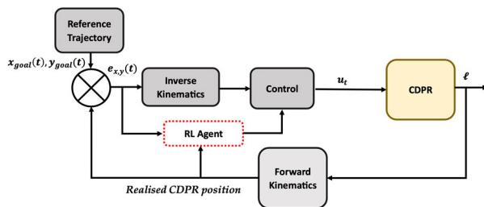

**FIGURE 5.** Control paradigm for CDPR.

A graphical representation of the RL agent's training progress can be seen in Figure [6,](#page-7-1) which shows the average rewards obtained in each episode. It is worth noting that the reward pool shows a distinctive trend, with rewards per episode showing exponential growth until approximately the 500th episode. Subsequently, the accumulated reward tends to stabilize in subsequent episodes, which indicates that the RL agent's learning has reached a certain level of proficiency. Within this range, spanning from 500 to 1000 episodes, agents are suitable for the task of point-to-point control. Interestingly, examination of the reward values reveals minor differences between the agents evaluated.

Despite the existence of agents who achieve higher cumulative rewards, these high-achieving agents tend to exhibit overly aggressive changes in control signals, an undesirable trait when pursuing rewards.

Furthermore, selecting an agent close to the point where reward collection stabilizes serves is a prudent decision, ensuring that the chosen agent has undergone sufficient training to provide a reliable and robust performance in point-to-point control scenarios.

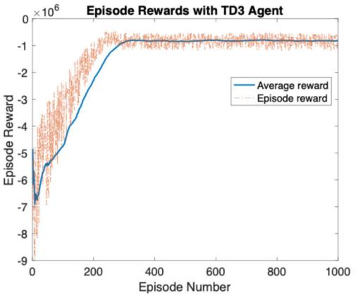

**FIGURE 6.** Average rewards of TD3 agent in the step reference tracking training.

Figure [7](#page-7-2) shows the control response of agent trained for the step reference tracking task. It has an acceptable transient

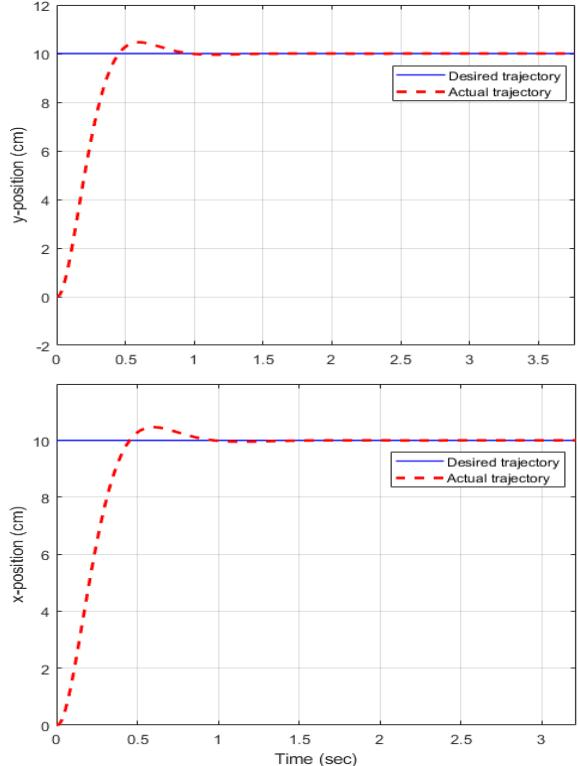

response and a tolerable steady-state error as it moves from a

baseline to a desired state.

**FIGURE 7.** Control response of agent for the step task.

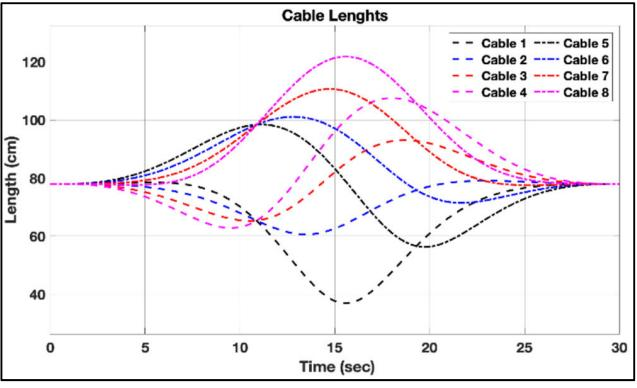

**FIGURE 8.** Variation in the cables lengths during circular trajectory tracking task.

A circular trajectory of the end-effector is generated as a task that must be performed by the trained RL-agent. The circular trajectory with a diameter of 25 cm is chosen as the reference trajectory to follow and is described by Equation [\(14\)](#page-7-3) [\[26\].](#page-10-19)

$$
\delta = 12\pi \left( \frac{t}{10} \right)^{5} - 30\pi \left( \frac{t}{10} \right)^{4} + 20\pi \left( \frac{t}{10} \right)^{3};
$$

$$
\{t\_{rjx,y} = r \cos (\delta) , r \sin (\delta) \} \qquad (14)
$$

where  $t = 0 \sim 30$  s is the time parameter. Given a predefined trajectory for the end-effector, it is feasible to computethe lengths of the eight driving cables through the inverse kinematics discussed in Section II. This process allows the cable lengths required to traverse the specified trajectory precisely determined. The results of this calculation are visu-ally represented in Figure 8, which show the theoretically driven cable lengths during while executing a circular tra-jectory. The smoothness in the cable dynamics indicates a well-controlled and coherent movement. A notable charac-teristic that contributes to the overall stability of this motion is the observation that the initial and final velocities of each cable are zero. The zero initial and final velocities ensure that the end-effector's movement, as well as the dynamics of the drive cables, remains stable and well-regulated throughout the circular trajectory. This stability is a critical factor in achieving precision and reliability in system control.

The tracking comparison diagram in Figure 9(a) provides
a valuable visual representation of the controller's performance
in the context of a circular trajectory. Figure 9(b)
and Figure 9(c) represent the individual trajectories along
x-axis and y-axis during tracking of circular trajectory. This
trajectory serves as an illustrative example of the controller's
capabilities, and the results are indeed noteworthy. Upon
closer inspection of the diagram, it becomes evident that the
Reinforcement Learning (RL)-based controller excels in its
ability to accurately track the anticipated trajectory - please
give some numbers or quantities by some professional kind of
description to show how much they are accurate and authentic.The effectiveness of the controller's performance is clearly
apparent from Figure 9(a). It consistently guides the sys-
tem along the desired path, closely following the circular
trajectory without deviating significantly.# B. TENSION DISTRIBUTION

To withstand any external wrench (represented by force,  $F\_{ex}$ ,
and moment,  $M\_{ex}$  applied to the moving platform, it is critical
that all cables have the capability to generate tension forces,
ensuring that the moving platform is balanced. The force and
torque conditions at the moving platform can be expressed as
follows:
$$\sum\_{l=1}^{n} t\_l + F\_{\text{ex}} = 0 \tag{15}$$

$$\sum\_{i=1}^{n} r\_i \times t\_i + M\_{\text{ex}} = 0 \tag{16}$$

where  $t\_i = \vec{u}\_i . F\_i$  represents the tension force that acts in  
the opposite direction of cable and  $F\_{ex}$  represents the exter-  
nal force vector  $M\_{ex}$  is the external moment. Substituting  
 $t\_i$  and organising Equation (15) and Equation (16) yields  
Equation (17).No corrections needed.

where  $H = \begin{bmatrix} -\vec{u}\_1 & \dots & -\vec{u}\_8 \\ \vec{r}\_1 \times -\vec{u}\_1 & \dots & \vec{r}\_1 \times -\vec{u}\_8 \end{bmatrix}$  is the structure matrix and can be obtained by  $H = -J^T$ .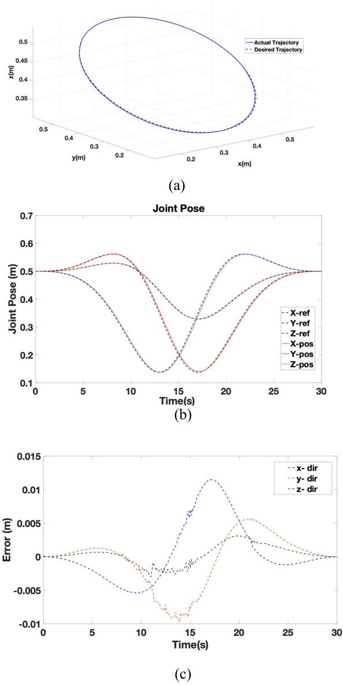

FIGURE 9. (a) Tracking comparison diagrams in circular trajectory,  
(b) Trajectory along x, y and z-direction, (c) Error in trajectory along x, y and z-direction.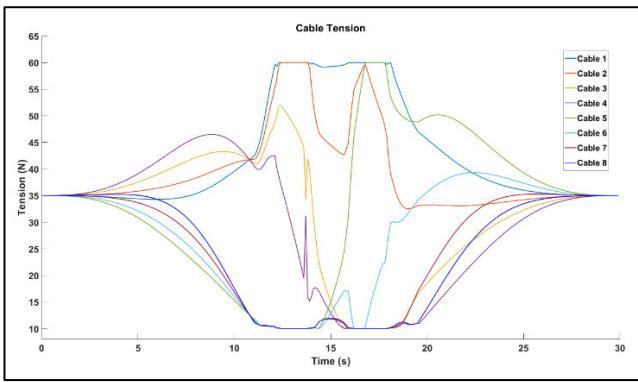

**FIGURE 10.** Tension in cables during circular motion.

Here,  $J$  is the Jacobian matrix,  $T = [t\_1 t\_2 ... t\_8]^T$  as the cable tension vector.  $W\_{ex} = [F\_{ex}M\_{ex}]^T$  is the external wrench acting on the system and its components  $F\_{ex} = [f\_x f\_y f\_z]$  and  $M\_{ex} = [m\_x m\_y m\_z]$  are the external forces and moments acting in the x-axis, y-axis and z-axis directions. The two vectors in the structure matrix ( $\vec{r\_i}$  and  $\vec{u\_i}$ ) are explicit functions dependent on the position and orientation of the mobile platform as well as the positions of the attachment points and can be obtained by the vector loop closure equation for  $i^{th}$  cable, as in Equation (18).
$$
\vec{u}\_l = \frac{\vec{p}\_{ef} + R\vec{p}'\_l - \vec{b}\_l}{\left\| \vec{p}\_{ef} + R\vec{p}'\_l - \vec{b}\_l \right\|}; \vec{r}\_l = R\vec{p}'\_l \tag{18}
$$

In this study, the feasible state of the wrench is consid-  
ered and is treated as constant static force applied to the  
moving platform, such as the gravitational force acting on  
the platform. Additionally, the cable tension is practically  
constrained within the range of  $t\_{min}$  to  $t\_{max}$ . The minimum  
tension ( $t\_{min}$ ) is necessary to ensure the cables remain taut,  
while the maximum tension ( $t\_{max}$ ) is limited by the torque  
capabilities of the actuators or the maximum tension thresh-  
old that the cables can withstand without breaking.
$$t\_{\min} < \vec{t}\_i < t\_{\max}$$

The purpose of this condition is to determine whether a suitable set of tensions can sustain a given external wrench. The statically and dynamically of the moving platform can be evaluated by using inertia terms as constants when the inertia terms are considered constants. Therefore, this condition allows determining the range of movement of the external wrench at a particular platform position from a specific direction. The maximum and minimum allowable tension values for all cables are 10 and 60  $N$ , respectively.Based on linear programming optimization [\[25\], t](#page-10-18)he cable tension distribution values are calculated under equality constraints and upper and lower bounds. The presented outcomes, illustrated in Figure [10,](#page-8-4) serve the purpose of ensuring the feasibility of a wrench workspace conducive to the execution of a circular trajectory.

#### **VI. CONCLUSION**

This paper presents an approach to control a planar Cable-Driven Parallel Robot (CDPR) using a Reinforcement Learning (RL) controller based on the Twin Delayed Deep Deterministic (TD3) Policy Gradient algorithm. This study's unique contribution lies in applying adaptive RL techniques to CDPR control, a relatively underexplored area, thus bridging a gap in the existing literature on CDPR dynamics. The research begins by training the RL agent to excel at this task. The trained agent is subsequently subjected to a rigorous testing that involves tracking the designated circular trajectory for performance evaluation. The results obtained from this analysis highlight the intricacies and challenges encountered while training an off-policy Deep Reinforcement Learning (DRL) agent, especially when learning a reward function that is characterized by multiple constraints. By advancing a TD3-based approach adapted for CDPR control, this work showcases an innovative path forward in robotic control that combines the adaptability of RL with the structural complexity of CDPRs. It is important to note that implementing RL on CDPRs is still a relatively emerging area of exploration, and numerous unexplored possibilities await investigation. This includes addressing issues related to vibrations and kinematics of CDPRs, evaluating the practical performance of RL in real-world scenarios, and adapting RL to diverse CDPR structures. While the results confirm the effectiveness and advantages of the proposed TD3-based RL controller, it is acknowledged that there is still room for further enhancement. The controller shows a promising response, but there exists a potential for further enhancement in trajectory tracking performance, especially through fine-grained reward shaping techniques in future research endeavours. While this study demonstrates the feasibility and potential of the proposed approach, we acknowledge that incorporating comparisons with existing control methods such as PID or MPC, as well as analysing the effects of measurement and process noise, are essential to comprehensively validate its performance. Future work will focus on addressing these aspects, as well as implementing this approach on a physical CDPR and assessing its performance under real-world conditions. Overall, this research demonstrates the feasibility and potential of RL-driven CDPR control, offering a foundation for future advancements that could significantly broaden the application of RL in complex robotic environments.

#### **ACKNOWLEDGMENT**

The authors would like to thank Harbin Institute of Technology Shenzhen (HITSZ), China, and College of Engineering, Karachi Institute of Economics and Technology (KIET), Pakistan, for providing the workspace and facilities necessary to complete this research. They also would like to thank Onaizah College, Saudi Arabia, for funding this work and contributing to its supervision. These contributions were instrumental in ensuring the successful completion of the project.

#### **REFERENCES**

- [\[1\] M](#page-0-0). Zarebidoki, J. S. Dhupia, and W. Xu, ''A review of cable-driven parallel robots: Typical configurations, analysis techniques, and control methods,'' *IEEE Robot. Autom. Mag.*, vol. 29, no. 3, pp. 89–106, Sep. 2022, doi: [10.1109/MRA.2021.3138387.](http://dx.doi.org/10.1109/MRA.2021.3138387)
- [\[2\] H](#page-1-0). H. Cheng and D. Lau, ''Cable attachment optimization for reconfigurable cable-driven parallel robots based on various workspace conditions,'' *IEEE Trans. Robot.*, vol. 39, no. 5, pp. 3759–3775, Oct. 2023, doi: [10.1109/TRO.2023.3288838.](http://dx.doi.org/10.1109/TRO.2023.3288838)
- [\[3\] A](#page-1-1). González-Rodríguez, A. Martín-Parra, S. Juárez-Pérez, D. Rodríguez-Rosa, F. Moya-Fernández, F. J. Castillo-García, and J. Rosado-Linares, ''Dynamic model of a novel planar cable driven parallel robot with a single cable loop,'' *Actuators*, vol. 12, no. 5, p. 200, May 2023, doi: [10.3390/act12050200.](http://dx.doi.org/10.3390/act12050200)
- [\[4\] S](#page-1-2). Patel, V. L. Nguyen, and R. J. Caverly, ''Forward kinematics of a cabledriven parallel robot with pose estimation error covariance bounds,'' *Mechanism Mach. Theory*, vol. 183, May 2023, Art. no. 105231. Accessed: Dec. 20, 2023. [Online]. Available: https://www.sciencedirect. com/science/ar ticle /pii/S0094114X23000058
- [\[5\] Z](#page-1-3). Zhang, G. Xie, Z. Shao, and C. Gosselin, ''Kinematic calibration of cable-driven parallel robots considering the pulley kinematics,'' *Mechanism Mach. Theory*, vol. 169, Mar. 2022, Art. no. 104648, doi: [10.1016/j.mechmachtheory.2021.104648.](http://dx.doi.org/10.1016/j.mechmachtheory.2021.104648)
- [\[6\] A](#page-1-4). Arena, E. Ottaviano, and V. Gattulli, ''Dynamics of cable-driven parallel manipulators with variable length vibrating cables,'' *Int. J. Non-Linear Mech.*, vol. 151, May 2023, Art. no. 104382, doi: [10.1016/j.ijnonlinmec.2023.104382.](http://dx.doi.org/10.1016/j.ijnonlinmec.2023.104382)
- [\[7\] C](#page-1-5). Sancak and M. Itik, ''Out-of-Plane vibration suppression and position control of a planar cable-driven robot,'' *IEEE/ASME Trans. Mechatronics*, vol. 27, no. 3, pp. 1311–1320, Jun. 2022, doi: [10.1109/TMECH.2021.3089588.](http://dx.doi.org/10.1109/TMECH.2021.3089588)
- [\[8\] B](#page-1-6). Ning, Q.-L. Han, J. Sanjayan, W. Shang, and W. Y. Lam, ''Robust trajectory tracking control for cable-driven parallel robots with model uncertainty,'' *Control Eng. Pract.*, vol. 140, Nov. 2023, Art. no. 105662, doi: [10.1016/j.conengprac.2023.105662.](http://dx.doi.org/10.1016/j.conengprac.2023.105662)
- [\[9\] M](#page-1-7). A. Khosravi and H. D. Taghirad, ''Robust PID control of fullyconstrained cable driven parallel robots,'' *Mechatronics*, vol. 24, no. 2, pp. 87–97, Mar. 2014, doi: [10.1016/j.mechatronics.2013.12.001.](http://dx.doi.org/10.1016/j.mechatronics.2013.12.001)
- [\[10\]](#page-1-8) J. E. Lavín-Delgado, S. Chávez-Vázquez, J. F. Gómez-Aguilar, M. O. Alassafi, F. E. Alsaadi, and A. M. Ahmad, ''Intelligent neural integral sliding-mode controller for a space robotic manipulator mounted on a free-floating satellite,'' *Adv. Space Res.*, vol. 71, no. 9, pp. 3734–3747, May 2023, doi: [10.1016/j.asr.2022.08.053.](http://dx.doi.org/10.1016/j.asr.2022.08.053)
- [\[11\]](#page-1-9) W. E. Abdul-Lateef, Y. N. I. Alothman, and S. A.-H. Gitaffa, ''An optimal motion path planning control of a robotic manipulator based on the hybrid PI-sliding mode controller,'' *Bull. Electr. Eng. Informat.*, vol. 12, no. 2, pp. 727–737, Apr. 2023, doi: [10.11591/eei.v12i2.3968.](http://dx.doi.org/10.11591/eei.v12i2.3968)
- [\[12\]](#page-1-10) B. Alizadeh, A. Hajipour, H. Tavakoli, and A. Nasrabadi, ''Robust trajectory tracking of delta parallel robot using fractional-order sliding mode control,'' *IEEE Access*, vol. 11, pp. 86397–86412, 2023. [Online]. Available: https://ieeexplore.ieee.org/abstract/document/10210038/
- [\[13\]](#page-1-11) Y. Lu, W. Yao, X. Li, and G. Sun, ''Non-singular terminal sliding mode tracking control with synchronization in the cable space for cable-driven parallel robots,'' in *Proc. IEEE 21st Int. Conf. Ind. Informat. (INDIN)*, Jul. 2023, pp. 1–6, doi: [10.1109/INDIN51400.2023.](http://dx.doi.org/10.1109/INDIN51400.2023.10217869) [10217869.](http://dx.doi.org/10.1109/INDIN51400.2023.10217869)
- [\[14\]](#page-1-12) Y.-L. Wang, K.-Y. Wang, Y.-J. Chai, Z.-J. Mo, and K.-C. Wang, ''Research on mechanical optimization methods of cable-driven lower limb rehabilitation robot,'' *Robotica*, vol. 40, no. 1, pp. 154–169, Jan. 2022, doi: [10.1017/s0263574721000448.](http://dx.doi.org/10.1017/s0263574721000448)
- [\[15\]](#page-1-13) J. Peng, H. Wu, T. Liu, and Y. Han, ''Workspace, stiffness analysis and design optimization of coupled active-passive multilink cable-driven space robots for on-orbit services,'' *Chin. J. Aeronaut.*, vol. 36, no. 2, pp. 402–416, Feb. 2023, doi: [10.1016/j.cja.2022.03.001.](http://dx.doi.org/10.1016/j.cja.2022.03.001)
- [\[16\]](#page-1-14) D. Bhattacharya, Y. P. Chan, S. Shang, Y. S. Chan, Y. Tan, and D. Lau, ''Trispace operational control of redundant multilink and hybrid cable-driven parallel robots using an iterative-learning-based reactive approach,'' *IEEE Trans. Control Syst. Technol.*, vol. 31, no. 6, pp. 2465–2483, Nov. 2023. [Online]. Available: https://ieeexplore.ieee.org/abstract/document/ 10102340/
- [\[17\]](#page-1-15) A. Ballou, X. Alameda-Pineda, and C. Reinke, ''Variational meta reinforcement learning for social robotics,'' *Int. J. Speech Technol.*, vol. 53, no. 22, pp. 27249–27268, Nov. 2023, doi: [10.1007/s10489-023-04691-5.](http://dx.doi.org/10.1007/s10489-023-04691-5)
- [\[18\]](#page-0-1) S. Munikoti, D. Agarwal, L. Das, M. Halappanavar, and B. Natarajan, ''Challenges and opportunities in deep reinforcement learning with graph neural networks: A comprehensive review of algorithms and applications,'' *IEEE Trans. Neural Netw. Learn. Syst.*, vol. 35, no. 11, pp. 15051–15071, Nov. 2023, doi: [10.1109/TNNLS.2023.3283523.](http://dx.doi.org/10.1109/TNNLS.2023.3283523)
- [\[19\]](#page-0-1) T. M. Moerland, J. Broekens, A. Plaat, and C. M. Jonker, ''Model-based reinforcement learning: A survey,'' *Found. Trends Mach. Learn.*, vol. 16, no. 1, pp. 1–118, 2023, doi: [10.1561/2200000086.](http://dx.doi.org/10.1561/2200000086)
- [\[20\]](#page-1-16) Y. Liu, Z. Cao, H. Xiong, J. Du, H. Cao, and L. Zhang, ''Dynamic obstacle avoidance for cable-driven parallel robots with mobile bases via sim-toreal reinforcement learning,'' *IEEE Robot. Autom. Lett.*, vol. 8, no. 3, pp. 1683–1690, Mar. 2023, doi: [10.1109/LRA.2023.3241801.](http://dx.doi.org/10.1109/LRA.2023.3241801)
- [\[21\]](#page-2-2) Y. Lu, C. Wu, W. Yao, G. Sun, J. Liu, and L. Wu, ''Deep reinforcement learning control of fully-constrained cable-driven parallel robots,'' *IEEE Trans. Ind. Electron.*, vol. 70, no. 7, pp. 7194–7204, Jul. 2023, doi: [10.1109/TIE.2022.3203763.](http://dx.doi.org/10.1109/TIE.2022.3203763)
- [\[22\]](#page-2-3) H. Xiong, T. Ma, L. Zhang, and X. Diao, ''Comparison of end-to-end and hybrid deep reinforcement learning strategies for controlling cabledriven parallel robots,'' *Neurocomputing*, vol. 377, pp. 73–84, Feb. 2020, doi: [10.1016/j.neucom.2019.10.020.](http://dx.doi.org/10.1016/j.neucom.2019.10.020)
- [\[23\]](#page-2-4) S. Fujimoto, H. V. Hoof, and D. Meger, ''Addressing function approximation error in actor-critic methods,'' in *Proc. PMLR*, Jul. 2018, pp. 1587–1596. Accessed: Dec. 20, 2023. [Online]. Available: https:// proceedings.mlr.press/v80/fujimoto18a.html
- [\[24\]](#page-3-6) J. J. Moré, ''The Levenberg–Marquardt algorithm: Implementation and theory,'' in *Numerical Analysis*. Berlin, Germany: Springer, Jul. 1977, pp. 105–116, doi: [10.1007/BFB0067700.](http://dx.doi.org/10.1007/BFB0067700)
- [\[25\]](#page-3-7) K. Youssef and M. J.-D. Otis, ''Reconfigurable fully constrained cable driven parallel mechanism for avoiding interference between cables,'' *Mechanism Mach. Theory*, vol. 148, Jun. 2020, Art. no. 103781, doi: [10.1016/j.mechmachtheory.2020.103781.](http://dx.doi.org/10.1016/j.mechmachtheory.2020.103781)
- [\[26\]](#page-6-5) L. Zhou, W. Xu, H. Chen, H. Huang, and H. Yuan, ''Design and kinematic analysis of a modular re-configurable cable-driven parallel robot,'' in *Proc. IEEE Int. Conf. Real-time Comput. Robot. (RCAR)*, Aug. 2018, pp. 620–625, doi: [10.1109/RCAR.2018.8621794.](http://dx.doi.org/10.1109/RCAR.2018.8621794)

MUHAMMAD KAMRAN JOYO received the B.E. degree in electronic engineering from Hamdard University, Pakistan, in 2012, the M.Sc. degree in mechatronic engineering from the University of Malaysia Perlis, and the Ph.D. degree in electrical and electronic engineering from the University of Kuala Lumpur, Malaysia, where his research focused on AI-integrated robotics for rehabilitation. During his graduate studies, he gained valuable experience in data sciences,

machine learning, and artificial intelligence. He has been a Postdoctoral Fellow with the Department of Mechanical and Automation Engineering, Harbin Institute of Technology (Shenzhen), a position he has held, since July 2022. His work primarily focuses on the integration of learning algorithms in robotics, with a particular emphasis on cable driven parallel robots.

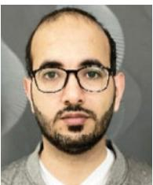

ABDULMAJEED M. ALENEZI (Member, IEEE) received the B.Sc. degree in electrical engineering from Taibah University, Madinah, Saudi Arabia, in 2012, the M.Sc. degree from The University of Virginia, Charlottesville, VA, USA, in 2018, and the Ph.D. degree in wireless communication from The University of Manchester, in 2022. He is currently the Chair of the EE Department and the Manager of the AI Centre, Islamic University of Madinah, Madinah, Saudi Arabia. His research

interests include visible light communication, heterogeneous networks, and artificial intelligence.

WENFU XU (Senior Member, IEEE) received the Ph.D. degree in control science and engineering from Harbin Institute of Technology, Harbin, China, in 2007. He was a Research Associate with the Department of Mechanical Engineering and Automation, The Chinese University of Hong Kong, Hong Kong, China. He is currently a Professor with Harbin Institute of Technology (Shenzhen), China. His research interests include bionic robots, space robots, flexible robots, and intelligent control.

MOHAMAD A. ALAWAD (Senior Member, IEEE) received the B.Sc. degree in electrical engineering from Qassim University, Qassim, Saudi Arabia, the M.Sc. degree in electrical engineering from Rochester Institute of Technology, Rochester, NY, USA, and the Ph.D. degree in electrical and electronic engineering from The University of Manchester, Manchester, U.K. He is currently an Assistant Professor with Imam Mohammad Ibn Saud Islamic University, Riyadh,

Saudi Arabia. His research interests include 5G wireless communication and machine learning for 5G and beyond 5G network technology.

MUHMMAD TAYYAB YAQOOB received the B.E. degree in electrical engineering from Bahria University Karachi, Pakistan, in 2010, the M.E. degree in electronic engineering from the NED University of Engineering & Technology, and the Ph.D. degree in electrical and electronic engineering from Universiti Kuala Lumpur, Malaysia, in 2022. He is currently an Assistant Professor with Karachi Institute of Economics and Technology, Pakistan. His research interest includes power

electronics devices like multilevel inverters using bio-inspired intelligent algorithms.

NOOR MARICAR (Senior Member, IEEE) received the bachelor's degree in electrical power engineering from ITB Bandung, Indonesia, in 1993, the master's degree in computer integrated manufacturing from NTU, Singapore, in 1997, the master's degree from IIT Chicago, USA, in 1998, and the Doctorate degree from Virginia Tech, in 2004, are related to the power engineering fields, specializing in power system simulation and visualization, power system planning, and

renewable energy technology. He has IT experiences, since 1985 (36 years) and energy efficiency and renewable experiences, since 1995 (26 years). His industrial and academic in both domains cover the areas of facilities and EH&S, programming techniques, computer architecture, petri nets algorithm, databases, data acquisition techniques, building management systems, building retrofits, energy efficiency, renewable energy, power system analysis, control systems, power generation, principle of electrical and electronic technology, electromagnetic, electric circuits, electromechanical devices, electrical circuits and illuminations in buildings, instrumentations, and other engineering subjects. All those years are in aircraft industry, IT companies, manufacturing sectors, engineering consultancy, and educational sectors. He has industrial and academic exposures, from 1985 to 1997 and since 1997, respectively. Currently, he is an Associate Professor with the Department of Electrical Engineering, Onaizah College of Engineering and Information Technology, Al Qassim, Saudi Arabia.

SHEROZ KHAN (Life Senior Member, IEEE) was born in Nawai-Wadana, Charsadda, Khyber Pakhtunkhwa, Pakistan. He received the B.Sc. degree in electrical engineering from the NWFP University of Engineering and Technology (UET), Peshawar, Pakistan, in 1981, the M.Sc. degree in microelectronics and computer engineering from Surrey University, U.K., in 1990, and the Ph.D. degree from Strathclyde University, Glasgow, U.K., in 1994. He was a Principal Lecturer with

UNITEN (2000–2001) and an Associate Professor and a Professor with the Department of ECE, International Islamic University Malaysia (IIUM) (2002–2019). He has produced 22 M.Sc. and ten Ph.D.'s, two post-doctorate under his direct supervision while producing eight Ph.D.'s under cosupervision. He has been the PG Coordinator of the ECE Department, IIUM, and a Founding Coordinator of the Wireless Communication and Signal Processing Research Group (2006–2019). He has been among the top 30 contributors to IIUM Research Performance for 2019 and 2020. He has been the Co-Founder of ICSIMA, ICISE, ICIRD, and ICETAS. He is also the Founder of the IIUM-Limoges (France), and IIUM-Schmalkalden UAS (Germany) Programs. Since December 2019, he has been a Professor with the Department of Electrical Engineering, Onaizah College of Engineering and Information Technology, Saudi Arabia. He is charged with the task of organizing webinars and international conferences. He is in QU-IIUM-UniKL Research Team of the Saudi Arabia MoE RDO grant worth of 1.277M SAR. He leads the Best Graduate Honor Board, Department of Electrical and Electronics Engineering, NWFP UET. He is also a MIET and a C.Eng.

•••