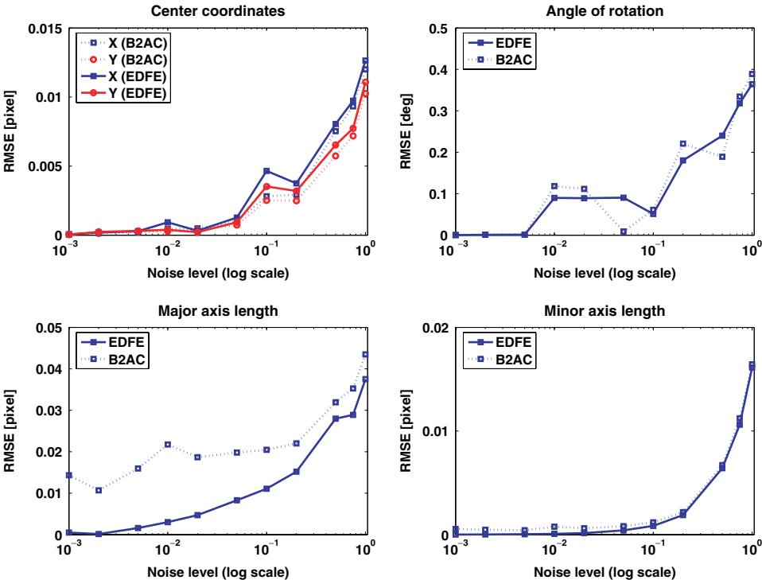
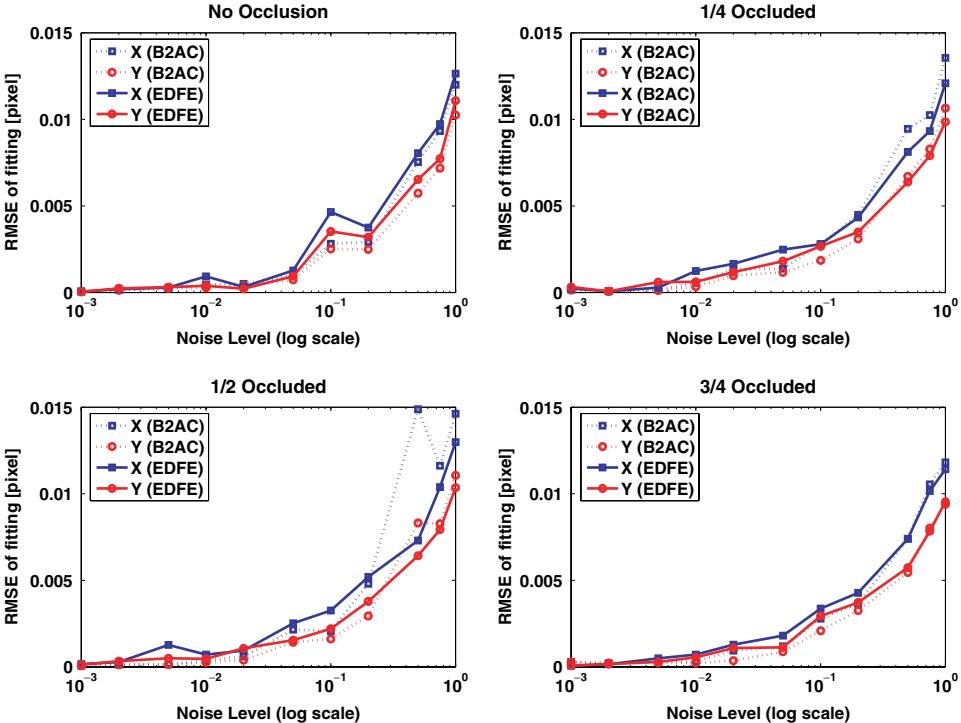
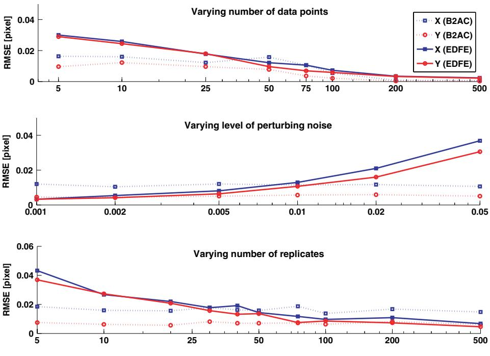
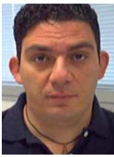

# **ENHANCED DIRECT LEAST SQUARE FITTING OF ELLIPSES**

ELISEO STEFANO MAINI

*ARTS Lab — Scuola Superiore Sant' Anna, Polo Sant' Anna Valdera Viale R. Piaggio, 34 — 56025 Pontedera, Italy es.maini@ieee.org*

This paper presents a robust and direct algorithm for the least-square fitting of ellipses to scattered data. The proposed algorithm makes use of well-known techniques that improve the robustness of the direct least-square fitting with a modest increase of the computational burden. Furthermore, by trivial modifications of the constrained minimization problem the algorithm may be converted to perform the specific fitting of other types of conics such as hyperbola. The method is simple and accurate and can be implemented with fixed time of computation. These characteristics coupled to its robustness and specificity makes the algorithm well-suited for applications requiring real-time machine vision.

*Keywords*: Conic fitting; least squares fitting; constrained minimization.

# **1. Introduction**

One of the basic tasks in pattern recognition and computer vision is the fitting
of geometric primitives to a set of data points that are supposed to pertain to
the same token. This process usually occurs at an early stage of machine vision
and it is often referred to as segmentation by fitting a model.6 Beside the straight-
line model, which is conveniently adopted in many different settings (e.g. camera
calibration, pose estimation, stereopsys), the ellipse is another relevant geometric
model that is widely adopted in computer vision.1,3,5,8,17-21 For its relevance in
computer vision, the fitting of geometric models has been intensively studied over
years and many different methods were proposed. Broadly speaking, these methods
follow two major approaches: the clustering/voting (CV) techniques and the least
square (LS) techniques.The CV techniques make use of different algorithms2,14,15 (e.g. RANSAC, Hough Transform, fuzzy clustering, Kalman filtering) whose major advantage is the robustness against outliers especially when the usual hypothesis of Gaussian noise does not hold.9 Unfortunately, the visiting characteristics of these techniques are timedemanding and memory-consuming; notably when the geometric primitive is a conic. In addition to this, iterative algorithms (e.g. CV) do not have fixed time of computation therefore they are not suited for real-time applications.6

940 *E. S. Maini*

September 7, 2006 1:9 WSPC/115-IJPRAI SPI-J068 00506

The LS techniques are based on optimization criteria where various pos-  
sible objective functions are minimized with respect to a specific set of data  
points. [3,5,7,8,20](#page-1-0) In general, the LS techniques are less resource-demanding but they  
suffer the major limitation of having low breakdown points. This means that they  
may perform poorly in the presence of non-Gaussian outliers although some vari-  
ants, (e.g. the Theil-Sen approach, the least median of squares, the Hilbert curve,  
the minimum volume estimator) are reported to improve the robustness on specific  
conics. [15](#page-1-0) As one of the major themes of pattern recognition, the use of LS techniques  
for fitting ellipses has been frequently investigated and many different algorithms  
were proposed. These algorithms may be reported into two broad categories of  
LS problems: the *algebraic* and the *geometric* fitting which are differentiated by  
the different definition of the error distance to be minimized. [20](#page-1-0) In algebraic fit-  
ting the error distance is defined as the deviation of the implicit equation from  
the expected value at each given point. Most publications about the least squares  
fitting of conics have been concerned with the squares sum of algebraic distances  
or their modifications. [3,5,8](#page-1-0)In geometric fitting the error function is defined as the orthogonal distance of the given points from the geometric primitive to be fitted. The use of geometric distance offers some relevant advantages with respect to algebraic fitting which is usually not invariant under Euclidean transformation.20 In addition to this, some authors argue that the algebraic fitting may lead to biased estimates because it performs better when fitting points having a low curvature.11 This problem is usually termed as *high curvature bias*. On the other hand Rosin and West argued that the geometric fitting of conics is an intrinsical nonlinear problem that *must* be solved by iteration.16 Indeed, as opposite to the algebraic fitting that may insure a direct one-step convergence, the geometric techniques (as well as the CV) rely on iterative methods in order to push the estimation toward ellipticity.5

For the case of ellipse-specific fitting Fitzgibbon *et al.* presented a direct computational method (i.e. B2AC) that is based on the algebraic distance with a quadratic constraint.5 In B2AC, the retrieval of a unique elliptical solution is achieved by incorporating the ellipticity constraint into the normalization factor thus overcoming some of the major limitations of previously reported methods.

This paper extends the results of a previous study12 where we already described some circumstances in which B2AC produces nonoptimal results. In this paper, similarly to that study, we discuss the original approach and we propose an improved method for solving the numerical instabilities. The proposed method revolves around the introduction of some simple techniques that greatly improve the numerical stability and that also allow the accuracy of the fitting to be tuned by operating on specific parameters of the resampling procedure. In contrast to our previous work12 where some factors (such as occlusion conditions) were not considered, in this paper we undertake a detailed analysis of all the factors that are likely to influence both the accuracy and the numerical stability of our method. The paper is concluded by presenting an extended set of experimental results giving evidence of the superior robustness of our method.

#### **2. Direct Least-Squares Fitting of Ellipses**

September 7, 2006 1:9 WSPC/115-IJPRAI SPI-J068 00506

#### **2.1.** *Definition of the problem*

A central conic can be expressed by an implicit second order polynomial such as:

$$F(x,y) = ax^{2} + bxy + cy^{2} + dx + ey + f = 0$$

(1)

or, in vectorial form as:

$$F\_\mathbf{a}(\mathbf{x}) = \mathbf{x} \cdot \mathbf{a} = \mathbf{0} \tag{2}$$

where  $\mathbf{a} = [a, b, c, d, e, f]^T$  and  $\mathbf{x} = [x^2, xy, y^2, x, y, 1]$  are the vectors of the coefficients and the coordinates of the points on the conic section.Given a set of data points  $T = \{(x\_i, y\_i) : i = 1 \cdots N\}$  and assuming that  $F(\mathbf{a}; \mathbf{p}\_i)$  is the *algebraic distance* of the point  $\mathbf{p}\_i = (x\_i, y\_i)$  from (2), the problem of fitting a conic section to  $T$  may be tackled by minimizing the sum of the squared distances of the curve to the given points.3,7,8 The solution of the resulting non-linear minimization problem:
$$\min\_{\mathbf{a}} \left( \sum\_{i=1}^{N} F(\mathbf{a}; \mathbf{p}\_i) \right) = \min\_{\mathbf{a}} \left( \sum\_{i=1}^{N} (\mathbf{p}\_i \cdot \mathbf{a})^2 \right) \tag{3}$$

is usually found making use of the classical iterative least squares approach after having introduced an appropriate constraint to discard the trivial solution  $\mathbf{a} = \mathbf{0}\_6$ . Several authors suggested different equations to express the constraint and the reader may refer to Refs. 1 and 20 for a detailed description of the different solutions. At this stage, it is worth noticing that the solution of (3) will be a general conic and not necessarily an ellipse. To fit ellipses directly whilst retaining the efficiency of a linear least squares approach, the appropriate discriminant-constraint (i.e.  $b^2 - 4ac < 0$ ) has to be considered when solving the problem (3). Unfortunately, the resulting constrained minimization problem is hard to solve for the presence of the nonconvex inequality hence different iterative methods were proposed for tackling the nonlinear characteristics of the ellipse-specific fitting.16In Ref. 5, the authors introduced the first direct method allowing the use of the
linear least squares error minimization whilst also constraining the fitted conic to
be an ellipse. In that paper, the nonlinear minimization problem was circumvented
by an appropriate scaling of the ellipse coefficients that transforms the nonconvex
inequality into the equality constraint  $b^2 - 4ac = 1$ . Defining the *constraint matrix*
 $\mathbf{C} \in \mathbb{R}\_{6,6}$  as:
$$\mathbf{C} = \{c\_{i,j}\} = \begin{cases} c\_{i,j} = c\_{j,i} = 2 & \text{if } i = 1 \text{ and } j = 3\\ c\_{i,j} = -1 & \text{if } i = j = 2\\ c\_{i,j} = 0 & \text{otherwise} \end{cases} \tag{4}$$

and coming back to (3), the ellipse-specific fitting is reduced to the calculus of the
solution of the following minimization problem3:
$$\begin{cases} \min \|\mathbf{D} \cdot \mathbf{a}\|^2\\ \mathbf{a}^T \cdot \mathbf{C} \cdot \mathbf{a} = 1 \end{cases} \tag{5}$$

where  $\mathbf{D} \in \mathbb{R}\_{N,6}$  is the *design matrix* representing the least square minimization
(3) and  $\mathbf{a}^T \cdot \mathbf{C} \cdot \mathbf{a} = 1$  is the vectorial expression of the equality constraint. The
optimal solution of (5) is readily found introducing the Lagrange multiplier  $\lambda$  and
differentiating. In this case, the system reduces to the form:
$$\begin{cases} \mathbf{Sa} = \lambda \mathbf{Ca} \\ \mathbf{a}^T \cdot \mathbf{C} \cdot \mathbf{a} = 1 \\ \mathbf{S} = \mathbf{D}^T \mathbf{D} \end{cases} \tag{6}$$

where  $\mathbf{S} \in \mathcal{R}\_{6,6}$  is usually called *scatter matrix*. Based on this derivation Fitzgibbon and colleagues demonstrated that the solution of the conic-fitting problem (3) subject to the constraint  $\mathbf{a}^T \cdot \mathbf{C} \cdot \mathbf{a} = 1$  admits exactly one elliptical solution corresponding to the single positive generalized eigenvalue of (6).5#### **2.2.** *Critical analysis of the method*

The method proposed in Ref. 5 offers several relevant advantages that are clearly stated in the original paper. Unfortunately, in spite of these remarkable proper- ties, B2AC also suffers from relevant drawbacks and limitations that were criticized and improved in recent years. In Ref. 10 Halíř proposed an improved method that makes use of M-estimators for increasing the breakdown point and that exploits a renormalization procedure for correcting the high curvature bias of the B2AC. The latter algorithm revolves around an implicit partitioning of the scatter matrix and, contrary to B2AC, it is iterative even though it is reported to be an order faster than a true orthogonal fitting based on Euclidean distances.10 A similar decomposition method was also proposed for fitting coupled geometric objects.13 Specifically, Ref. 13 introduced an algorithm and the use of the Schur complement for extending the results of B2AC to the case of concentric ellipses. Moreover, in Ref. 12, we addressed some critical aspects of B2AC concerning (1) the numerical stability of the method and (2) the localization of the fitting optimal solution. As already remarked, the eigenvector problem (6) turns out to be ill-posed because the matrix  $S$  is bad-conditioned and the matrix  $C$  is singular.10,12 This problem is confirmed by the high values reported for the 2-norm condition number.12 In this case, the numerical instability propagates such that it is sometimes impossi- ble to find a positive eigenvalue or, in other cases, the reported eigenvector may become misleading because the optimal solution is associated to a small negative eigenvalue.Furthermore, we remark that B2AC has an *intrinsic source of errors* that was not addressed in Ref. 5. Specifically, if the data points lie *exactly* on the ellipse the eigenvalue corresponding to the optimal solution is *zero* thus B2AC does not lead to any solution. This may be easily verified observing that, in such conditions, **S** is identically singular. Again, because of the round-off errors, this circumstance occurs even if the data points are "close" to the ideal ellipse therefore B2AC performs poorly both when the noise is absent and low.

In order to overcome these limitations while preserving the advantages of B2AC we propose an enhanced algorithm for direct least square fitting of ellipses.

## **3. Enhanced Direct Least-Squares Fitting of Ellipses — EDFE**

September 7, 2006 1:9 WSPC/115-IJPRAI SPI-J068 00506

As already remarked in the previous section, the major limitations of the original algorithm are (1) the inherent bad-conditioning of the *scatter matrix* **S** and (2) the critical or impossible localization of the solutions due to the inability of managing zero (and low) noise levels. Although in recent years some corrective actions were already proposed for improving the numerical stability of the B2AC,10,13 it has to be remarked that the problem of fitting data-points having zero (or low) noise levels (i.e. points lying exactly on the ellipse or "close" to it) still remains a major concern for the B2AC. In this section we propose the use of simple techniques that greatly enhance the effectiveness of the method both in terms of numerical stability *and* optimal solution localization. For the sake of clarity, we will analyze separately the above limitations even if the errors of the B2AC are obviously arising from the combined effects of both sources.

#### **3.1.** *Re-centering and scaling*

In this section we make the assumption that the data points do not lie exactly on the ellipse or close to the ideal curve (i.e. noisy data points). In this case, it may be noticed that the bad-conditioning of the scatter matrix arise solely from the construction of the matrix itself. Indeed the scatter matrix **S** may be written in the following compact form:

$$\mathbf{S} = \begin{pmatrix} \Theta\_{x^4} & \Theta\_{x^3y} & \Theta\_{x^2y^2} & \Theta\_{x^3} & \Theta\_{x^2y} & \Theta\_{x^2} \\ \Theta\_{x^3y} & \Theta\_{x^2y^2} & \Theta\_{xy^3} & \Theta\_{x^2y} & \Theta\_{xy^2} & \Theta\_{xy} \\ \Theta\_{x^2y^2} & \Theta\_{xy^3} & \Theta\_{y^4} & \Theta\_{xy^2} & \Theta\_{y^3} & \Theta\_{y^2} \\ \Theta\_{x^3} & \Theta\_{x^2y} & \Theta\_{y^2} & \Theta\_{x^2} & \Theta\_{xy} & \Theta\_{x} \\ \Theta\_{x^2y} & \Theta\_{xy^2} & \Theta\_{y^3} & \Theta\_{xy} & \Theta\_{y^2} & \Theta\_{y} \\ \Theta\_{x^2} & \Theta\_{xy} & \Theta\_{y^2} & \Theta\_{x} & \Theta\_{y} & N \end{pmatrix} \tag{7}$$
 having introduced the operator  $\Theta\_{x\_i y\_j} = \sum\_{k=1}^N x\_k^i y\_k^j$ . In this expression the coordinates of each point  $\mathbf{p}\_{i} = (x\_i, y\_i)$  are such that  $x\_i \in [0, h\_{res}]$  and  $y\_i \in [0, v\_{res}]$ .

having introduced the operator  $\Theta\_{x\_iy\_j} = \sum\_{k=1}^N x\_k^i y\_k^j$ . In this expression the coor-
dinates of each point  $\mathbf{p}\_i = (x\_i, y\_i)$  are such that  $x\_i \in [0, h\_{res}]$  and  $y\_i \in [0, v\_{res}]$ 
where  $h\_{res}$  and  $v\_{res}$  are the maximal horizontal and vertical resolution of the frame944 *E. S. Maini*

September 7, 2006 1:9 WSPC/115-IJPRAI SPI-J068 00506

grabber. In modern devices, these resolutions can easily reach values of 103, hence the maximum values appearing in **S** may reach values in the order of  $N(103)4$  while **S**6,6 =  $N$ . In these circumstances, **S** turns out to be *intrinsically* bad-conditioned therefore the eigenvector problem yields erratic results. Note that the result of Theorem 1 in Ref. 5 is valid under the hypothesis that the matrix **S** is positivesemidefinite. This definition is computationally meaningful only provided that the conditioning number of the matrix is not larger than the inverse of the machine accuracy, or relative rounding-off error (typically  $\approx 10^{16}$ ). In Sec. 4, we will show that the latter condition is rarely met for the B2AC.

The reduction of the conditioning number below the machine accuracy could be simply achieved by performing the following re-centering and scaling procedure. This affine transformation of the data-points is to be executed before constructing the scatter matrix. To this aim we introduce the centering factors:

$$x\_{m} = \min\_{i=1}^{N} \{x\_{i}\}\$$
 
$$y\_{m} = \min\_{i=1}^{N} \{y\_{i}\}\$$
 
$$(8)$$

and the scale factors:

$$s\_{x} = \frac{\max\_{i=1}^{N} \{x\_{i}\} - \min\_{i=1}^{N} \{x\_{i}\}}{2}$$
 
$$s\_{y} = \frac{\max\_{i=1}^{N} \{y\_{i}\} - \min\_{i=1}^{N} \{y\_{i}\}}{2}.$$
 
$$(9)$$

With these positions the normalized ellipse (i.e.  $F\_{\hat{a}} = \hat{x} \cdot \hat{a} = 0$ ) is obtained by
applying the following affine transformation:
$$
\hat{x} = \frac{x - x\_m}{s\_x} - 1
$$

$$
\hat{y} = \frac{y - y\_m}{s\_y} - 1.
$$

$$(10)$$

After this affine transformation the equation  $F\_{\hat{a}} = 0$  represents an ellipse similar to
the original (i.e.  $F\_a(\mathbf{x}) = 0$ ) but normalized to be enclosed in a square centered in
the origin having side length equal to 2. It is worth noticing that the latter transfor-
mation does not alter the eigenvector problem because the algorithm is invariant
to affine transformation of the data.5 Clearly, on account of the transformation
introduced by (10), the ellipse's parameters have to be denormalized after hav-
ing solved the eigenvector problem. As reported in Ref. 12, the calculation of the
de-normalizing coefficients is straightforward and may be performed by imposing
the equality  $F\_{\hat{a}} = \hat{\mathbf{x}} \cdot \hat{\mathbf{a}} = \mathbf{x} \cdot \mathbf{a} = F\_a$ .## **3.2.** *Resampling with perturbations*

In this section we make the assumption that the data points lie exactly on the ellipse or close to the ideal curve (i.e. low levels of noise) and that the re-centering and scaling procedure was already performed on the original data points. Recalling that if the data points lie exactly on the ellipse (or "close" to it) the B2AC algorithm does not provide a solution we propose a “perturb-and-resample" strategy to be
performed whenever the localization of the eigenvalue turns out to be impossible
or critical.September 7, 2006 1:9 WSPC/115-IJPRAI SPI-J068 00506

The basic idea of the strategy is quite simple but it removes the limitation
existing because of the theoretical singularity discussed in previous sections. In fact,
given that the B2AC algorithm does not converge in the absence of noise and that
it is, instead, robust when the noise tends to increase we suggest to slightly perturb
the original data by adding a known Gaussian noise and, after that, perform the
fitting.12 In this case, after *M* repetitions, there will be created a family of *M* ellipses
each one fitting the original data-points previously perturbed by a controlled level
of noise. The searched ellipse is then found by averaging the parameters obtained
over replications.It is worth noticing that, this approach is justified because the perturbation of the eigenvector is linear in the perturbation of the scatter matrix. Moreover, the robustness of this method is insured by applying this procedure an adequate number of times. As a matter of fact, if the noise has a standard deviation of  $\xi$  the ensemble averaging of  $M$  vectors of coefficients reduces the standard deviation of the noise to  $\xi/\sqrt{M}$  while the true values of the coefficients remains unchanged. That is, the signal-to-noise ratio is increased by a factor of  $M$ . Furthermore, given that the distribution of the perturbing noise is known, it is straightforward to compute the confidence level for each estimate.We remark that the number of replicates (i.e.  $M$ ) should be given in advance in order to avoid an iterative implementation of our method. To this aim, in Sec. 4.3, we report the results obtained during extensive simulations performed by varying the number of replicates. This result may be used to give a proper indication for selecting an adequate value of  $M$ . Finally, in Sec. 4, we also show that, using this approach, it is possible to control both the level of noise and the number of replications in order to achieve the desired level of accuracy. On the other hand, we remark that the computational burden of our algorithm is increased, therefore we suggest to apply the “perturb-and-resample” strategy only when the localization of the solution turns out to be critical or impossible.

In order to have a precise estimation of the computational load we recall that the simple B2AC requires  $26N$  FLOPS to form the scatter matrix plus  $5182$  FLOPS to perform the matrix inversion and solve the eigensystem. [4](#page-6-0) Using these figures, the maximum computational load introduced by the perturb and resample strategy may be estimated in  $M \cdot (26N + 5182)$  FLOPS.**4. Experimental Procedures**

## **4.1.** *Methodology*

In order to have properly controlled conditions the algorithm was tested on synthetic data obtained during simulations. The parameters controlled by the 946 *E. S. Maini*

simulator were:

(1) the number of points on the curve (N);

September 7, 2006 1:9 WSPC/115-IJPRAI SPI-J068 00506

- (2) the standard deviation of noise in original data ( $\sigma$ );
- (3) the portion of elliptic arc from which data points were extracted (*g*);
- (4) the horizontal  $(h\_{res})$  and the vertical  $(v\_{res})$  resolution of the frame grabber;
- (5) the number of replicates in the resampling procedure  $(M)$ ;
- - (6) the standard deviation of the perturbing noise ( $\zeta$ ).

Synthetic data points were generated by randomly extracting uniformly distributed values for the five ellipse's parameters [i.e. coordinates of the center  $(X, Y)$ , length of the major  $(a\_M)$  and minor axes  $(a\_m)$  and angle of rotation  $(\phi)$ ]. The data points were then fitted using both B2AC and EDFE; for comparative purposes both algorithms were coded in MATLAB and B2AC was implemented as reported in Ref. 5. Each simulation was composed of ten different runs each one generating 1000 ellipses.The comparative evaluation investigated the following topics:

- (1) numerical stability of the solution when varying noise and occlusion levels;
- (2) accuracy of fitting under various condition of noise and occlusion;
- (3) accuracy of fitting when varying replicates and perturbing noise;
- (4) device independence at increasing levels of resolution.

The accuracy of fitting was assessed by the root mean square error *(RMSE)* of the parameters obtained from fitting with respect to the actual parameters generated from the simulator.The numerical stability was assessed by computing the 2-norm condition number
(CN) of the scatter matrix **S**. All those cases in which the B2AC was not capa-
ble to provide a solution were marked as FAIL either if the error was originated
by numerical instability or by impossible localization of the eigenvalue. The same
criterion was applied to the EDFE. The trials marked as FAIL were counted and
excluded from further examinations.

### **4.2.** *Testing numerical stability*

The numerical stability of both algorithms was tested against two factors:

- - (1) level of noise in the original data (i.e. by varying  $\sigma$ );
- (2) level of occlusion of the elliptic pattern (i.e. by varying g).

In Table 1, we report the average values of the CN obtained when running the
B2AC algorithm and in Table 2, we report the same results obtained when running
the EDFE algorithm. Comparing Tables 1 and 2, it may be noticed the CN of
both algorithms increases when the noise level tends to zero. This was an expected
evidence because, as we remarked in Sec. 2, there is a theoretical reason for having
ill-conditioned problems when the noise is absent (i.e. the scatter matrix tendsTable 1. CN values of **S** for the B2AC algorithm at various levels of noise and occlusion conditions.

| $\sigma$             | 0        | 0.001    | 0.002    | 0.005    | 0.01     | 0.02     | 0.05     | 0.1      | 0.2      | 0.5      | 0.75     | 1        |
|----------------------|----------|----------|----------|----------|----------|----------|----------|----------|----------|----------|----------|----------|
| $g = 2\pi$           | 3 · 1026 | 3 · 1025 | 2 · 1025 | 1 · 1025 | 2 · 1024 | 9 · 1026 | 1 · 1024 | 5 · 1022 | 1 · 1022 | 2 · 1021 | 7 · 1020 | 1 · 1020 |
| $g = \frac{3}{2}\pi$ | 2 · 1026 | 4 · 1025 | 2 · 1025 | 7 · 1024 | 5 · 1024 | 1 · 1024 | 5 · 1023 | 5 · 1023 | 8 · 1021 | 8 · 1020 | 5 · 1020 | 1 · 1020 |
| $g = \pi$            | 3 · 1026 | 4 · 1025 | 1 · 1025 | 4 · 1024 | 3 · 1024 | 2 · 1024 | 7 · 1022 | 2 · 1022 | 2 · 1022 | 1 · 1021 | 4 · 1020 | 2 · 1020 |
| $g = \frac{1}{2}\pi$ | 2 · 1026 | 8 · 1025 | 3 · 1025 | 3 · 1024 | 4 · 1024 | 2 · 1024 | 9 · 1023 | 3 · 1023 | 7 · 1021 | 9 · 1020 | 2 · 1020 | 1 · 1020 |

Table 2. CN values of **S** for the EDFE algorithm at various levels of noise and occlusion conditions.

| $\sigma$              | 0        | 0.001    | 0.002    | 0.005    | 0.01     | 0.02    | 0.05    | 0.1     | 0.2     | 0.5     | 0.75    | 1       |
|-----------------------|----------|----------|----------|----------|----------|---------|---------|---------|---------|---------|---------|---------|
| $g = 2\pi$            | 9 · 1012 | 6 · 1011 | 3 · 1010 | 2 · 1010 | 4 · 1010 | 2 · 109 | 5 · 107 | 1 · 107 | 9 · 105 | 1 · 105 | 5 · 104 | 2 · 104 |
| $g = \frac{3}{2} \pi$ | 8 · 1012 | 2 · 1011 | 1 · 1011 | 1 · 1010 | 2 · 109  | 2 · 109 | 1 · 108 | 9 · 106 | 2 · 106 | 2 · 105 | 3 · 104 | 3 · 104 |
| $g = \pi$             | 5 · 1012 | 4 · 1011 | 7 · 1010 | 2 · 1010 | 2 · 109  | 2 · 108 | 9 · 107 | 1 · 107 | 1 · 106 | 7 · 104 | 4 · 104 | 2 · 104 |
| $g = \frac{1}{2} \pi$ | 5 · 1012 | 6 · 1011 | 3 · 1010 | 1 · 1010 | 8 · 109  | 6 · 108 | 4 · 107 | 3 · 107 | 1 · 106 | 2 · 105 | 5 · 104 | 2 · 104 |

Table 3. B2AC average percentage of FAIL when varying noise and occlusion conditions.

| σ                   | 0    | 0.001 | 0.002 | 0.005 | 0.01 | 0.02 | 0.05 | 0.1  | 0.2  | 0.5  | 0.75 | 1    |
|---------------------|------|-------|-------|-------|------|------|------|------|------|------|------|------|
| g = 2π              | 50.7 | 41.5  | 40.4  | 33.0  | 27.9 | 20.4 | 15.6 | 12.7 | 11.4 | 10.9 | 9.9  | 9.7  |
| g = $\frac{3}{2}$ π | 50.8 | 40.1  | 33.1  | 26.3  | 24.2 | 20.2 | 17.7 | 17.4 | 13.0 | 11.1 | 10.1 | 10.4 |
| g = π               | 46.9 | 40.8  | 39.2  | 32.6  | 25.8 | 23.5 | 16.4 | 14.2 | 13.8 | 13.9 | 12.1 | 10.9 |
| g = $\frac{1}{2}$ π | 45.7 | 34.4  | 25.1  | 20.0  | 18.3 | 16.8 | 14.5 | 13.2 | 12.2 | 10.0 | 9.7  | 8.9  |

to be singular). On the other hand, Table 2 also confirms that the EDFE shows
CN values which are of several orders lower than those reported for B2AC. It is
worth noticing that the CN values reported for the EDFE are always under the
inverse of the machine accuracy which is typically in the order of 1016. The same
consideration does not apply to B2AC. Furthermore, even in the “worst” case of
 $\sigma = 0$  (i.e. of data points lying *exactly* on the elliptic curve) the EDFE shows
CN values which are roughly eight orders below the one reported for B2AC in the
“best” case (i.e.  $\sigma = 1$ ).The picture is even more clear if considering the FAIL marks. To this aim Table 3 reports the average percentage of FAIL marks obtained by the B2AC while varying the standard deviation of noise and the level of occlusion of the elliptic pattern. It is worth noticing that the EDFE algorithm always found the optimal solution therefore we do not report the EDFE FAIL-table.

From Table 3 the nasty effects of the numerical instability are clearly visible. Indeed, when the noise is absent nearly 50% of the fittings does not yield to a solution even at different levels of occlusion. As already mentioned, because of the round-off errors, the numerical instability propagates even at higher levels of noise

where the theoretical limit is not present and the scatter matrix should be not-singular.

Roughly speaking it happens that, the FAIL marks reported at low levels of
noise are mainly due to the impossible localization of the fitting's optimal solution
whereas the FAIL marks reported when the noise level increases are related to the
inherent bad-conditioning of the scatter matrix  $S$ . In both cases the suggested coun-
termeasures were effective indeed, the CN of the EDFE is drammaticaly reduced
and the recovery of the optimal solution was always possible as demonstrated by
the absence of FAIL marks.#### **4.3.** *Testing accuracy*

The accuracy in estimating the ellipse's five parameters was tested against the following factors:

- (1) level of noise in the original data (i.e. by varying  $\sigma$ );
- (2) level of occlusion of the elliptic pattern (i.e. by varying g);
- (3) number of data points on the curve (i.e. by varying N);
- (4) level of perturbing noise in the resampling procedure (i.e. by varying  $\zeta$ ).
- (5) number of replicates of the resampling procedure (i.e. by varying M);

In Fig. 1, we report the RMSE of fitting of the two algorithms when varying the noise on input data. The simulation was conducted with the following setting of parameters:  $N = 50$ ,  $g = 2\pi$ ,  $M = 50$ ,  $\zeta = 0.01$ ,  $h\_{res} = 640$ ,  $v\_{res} = 480$ . Similar results were obtained with different values of the controlling variables. Obviously, for both algorithms, the accuracy of estimates deteriorates when increasing the noise level; nonetheless, at high levels of noise, a good level of accuracy is still preserved. This is in close agreement to Ref. 5 that reports the robustness to noise as a major advantage of the B2AC. Actually, in the worst case the RMSE is below 0.04 pixel for  $(X, Y)$ ,  $a\_M$  and  $a\_m$  and below 0.4° for  $\phi$ . Figure 1 shows that both for EDFE and B2AC, the most critical parameter is the angle of rotation and this evidence is explained with some spurious estimates that may be obtained when the ellipticity of the curve is extremely low (i.e. approximately a circle). As a general remark, we note that the EDFE and B2AC show similar level of accuracy and similar trends when increasing the noise level. On the other hand we remark that the good accuracy reported for the B2AC is calculated *solely* in those cases in which the method converged (roughly the 50% of the whole) whereas the EDFE always found the optimal solution.The effects of increasing the ***occlusion conditions*** on the accuracy of center estimation are reported in Fig. 2. We do not report the accuracy in the estimation of the other parameters because the results are similar to those already discussed in the previous experiment. The simulation was conducted with the following setting of parameters:  $N = 50$ ,  $\sigma = 0$ ,  $M = 50$ ,  $\zeta = 0.01$ ,  $h\_{res} = 640$ ,  $v\_{res} = 480$ .

Fig. 1. Accuracy of parameters estimation when varying standard deviation of input noise  $\sigma$ .From Fig. 2, it may be noticed that the accuracy is very well preserved from
both algorithms even when severe occlusion levels are introduced (i.e. only 1/4 of
the elliptic pattern is visible in the worst condition). This is a good indicator
of a well-behaved fitting; indeed the ability to provide useful results under severe
occlusion conditions is one of the main advantages introduced by the B2AC.[5](#page-4-1) This
advantage is retained by the EDFE that shows *in all the trials* an accuracy that is
equivalent to the one reported for the nonfailing trials of B2AC.Finally, we investigated the accuracy of the EDFE by studying the effects of varying: (1)  $N$  (with  $M = 100$ ,  $\zeta = 0.01$ ), (2)  $\zeta$  (with  $N = 50$ ,  $M = 100$ ) and (3)  $M$  (with  $N = 50$ ,  $\zeta = 0.01$ ). The results presented in Fig. 3 were obtained with the following setting of parameters:  $\sigma = 0$ ,  $g = 2\pi$ ,  $h\_{\text{res}} = 640$ ,  $v\_{\text{res}} = 480$ .Pointedly, the accuracy of estimates increases when the *number* of *data points* increases. From Fig. 3, it may be noticed that, when the data points are few (i.e.  $5 \le N \le 15$ ), the RMSE of fitting tends to be slightly higher when using the EDFE. This is well explained by considering how it works the perturb and resample strategy. Indeed, if the number of points tends to its minimum (i.e. five), even the small perturbations of the resampling strategy may have noticeable effects on the

Fig 2. Accuracy of center localization at various levels of occlusion.

geometry of the ellipse. Conversely, when the number of points increases, the EDFE
shows a quality of fitting that is numerically equivalent to the one obtained on the
nonfailing trials of B2AC.

With respect to the effect induced by increasing the *level of perturbing noise*
we observe that, as expected, it has no effects on the B2AC since the RMSE of fitting
is rather constant whereas it affects the EDFE that shows a roughly linear increasing
trend. This evidence confirms what is already observed in Ref. 5. Furthermore, when
the perturbing noise is small ( $\zeta \leq 0.015$ ), the EDFE performs the fitting better than
the best results obtained by B2AC without reporting any FAIL mark.Finally, when varying the number of replicates the EDFE behaves similarly. Indeed, when the number of replicates is low ( $M \le 10$ ), the algorithm tends to estimate the parameters with a higher error with respect to the best results of B2AC. Conversely, when increasing the number of replicates the EDFE reaches the accuracy of the B2AC even with a moderate number of repetitions (i.e.  $25 \le M \le 50$ ). Finally, a further increase of  $M$  corresponds to further improvement of the estimates and, beyond 100 repetitions, the EDFE shows better performance in comparison to the best results of B2AC.

Fig. 3. Accuracy of center localization when varying N,ζ,M.

Table 4. *Varying resolution*: B2AC average percentage of FAIL and comparative analysis of the CN values of **S**.

| <i>h</i> res × <i>v</i> res | 320 × 240  | 640 × 480  | 1024 × 768 | 1280 × 1024 | 1600 × 1200 |
|-----------------------------|------------|------------|------------|-------------|-------------|
| FAIL (%)                    | 4.5        | 24.9       | 50.0       | 64.2        | 72.2        |
| CN (B2AC)                   | 0.5 ⋅ 1023 | 0.3 ⋅ 1025 | 1.0 ⋅ 1026 | 0.2 ⋅ 1027  | 0.2 ⋅ 1028  |
| CN (EDFE)                   | 1.0 ⋅ 1010 | 0.9 ⋅ 1010 | 1.0 ⋅ 1010 | 0.3 ⋅ 1010  | 0.4 ⋅ 1010  |

## **4.4.** *Testing device independence*

September 7, 2006 1:9 WSPC/115-IJPRAI SPI-J068 00506

Finally, the effects of increasing the resolution of the image are reported in Table 4. As expected, an increase in values of resolution corresponds to increased CN for the B2AC that are responsible for the numerical instability of the method. This is furthermore confirmed by the increasing percentage of FAIL marks reported for B2AC. On contrary, the EDFE always found the optimal solution and shows lower CN values that reflect the improved robustness of the method. Moreover, the CN values reported for the EDFE are not affected by changing the resolution of the image hence the EDFE provides proper insurances of device-independence which is a relevant property for many real-life applications.

#### **5. Conclusions**

In this paper, we introduced an enhanced method for direct least-squares fitting of ellipses that improves the original work of Fitzgibbon.5 Our experiments give evidence of the superior robustness of the EDFE which was always capable of computing the best fitting in the least-square sense. Making use of simple and well-known techniques, the EDFE improves the original algorithm as follows. Firstly, the EDFE improves the numerical stability. This is clearly reflected by the dramatic reduction of the CN of the scatter matrix. Although different solutions were already proposed for improving the stability of the B2AC,10,13 we remark that the EDFE yields to numerically stable results using a simple normalization technique which does not significantly increase the computational burden of the method. Secondly, the introduction of the perturb and resample strategy solves a theoretical singularity of the direct method. Indeed, as opposite to previous methods, the EDFE is capable to find the optimal solution even when the points lie exactly on the ellipse.Moreover, we remark that the accuracy of the estimates may be tuned by operating both on the number of replicates and on the magnitude of the perturbing noise. In this way, the EDFE offers the flexibility that different applications may require; e.g. it can be conveniently applied to obtain a fast and rough initial estimate when more accurate results are to be obtained (e.g. with iterative methods). The increased computational load introduced by the resampling procedures is justified by the numerical stability of the method and by considering that, even if increased, the computational time is still fixed therefore the EDFE could be conveniently applied in real-time machine vision.

#### **References**

- 1. S. J. Ahn, W. Rauh and H. J. Warnecke, Least-squares orthogonal distances fitting of circle, sphere, ellipse, hyperbola, and parabola, *Patt. Recogn.* **34** (2001) 2283–2303.
- 2. N. Bennet, R. Burridge and N. Saoki, A method to detect and characterize ellipses using the Hough transform, *IEEE Trans. Patt. Anal. Mach. Intell.* **21** (1999) 652–657.
- 3. F. L. Bookstein, Fitting conic sections to scattered data, *Comput. Graph. Imag. Process*. **9** (1979) 56–71.
- 4. A. Fitzgibbon and R. B. Fisher, A buyer's guide to conic fitting, *Proc. 6th British Conf. Mach. Vis.* **2** (1995) 513–522.
- 5. A. Fitzgibbon, M. Pilu and R. B. Fisher, Direct least square fitting of ellipses, *IEEE Trans. Patt. Anal. Mach. Intell.* **21** (1999) 476–480.
- 6. D. A. Forsyth and J. Ponce, *Computer Vision: A Modern Approach* (Prentice Hall, NY, 2002).
- 7. W. Gander, Least squares with a quadratic constraint, *Nume. Mat.* **36** (1981) 291–307.
- 8. W. Gander, G. H. Golub and R. Strebel, Least-square fitting of circles and ellipses, *BIT* **34** (1994) 558–578.
- 9. W. E. Grimson and D. P. Huttenlocher, On the sensitivity of the Hough transform for object recognition, *IEEE Trans. Patt. Anal. Mach. Intell.* **12** (1990) 2555–2574.
- 10. R. Hal´ı˜r, Robust bias corrected least squares fitting of ellipses, in *Proc. 8th Int. Conf. Central Europe on Computer Graphics, Visualization and Interactive Digital Media* (WSCG'00) **1** (2000).

11. K. Kanatani, Statistical bias of conic fitting and renormalization, *IEEE Trans. Patt. Anal. Mach. Intell.* **16** (1994) 320–326.

September 7, 2006 1:9 WSPC/115-IJPRAI SPI-J068 00506

- 12. E. S. Maini, *Robust Ellipse-Specific Fitting for Real-Time Machine Vision*, Lecture Notes in Computer Science, Vol. 3704 (BV&AI 2005) (2005), pp. 318–327.
- 13. P. O'Leary, M. Harker and P. Zsombor-Murray, Direct and least square fitting of coupled geometric objects for metric vision, *IEE Proc. Vis. Imag. Sign. Process.* **152** (2005) 687–694.
- 14. J. Porrill, Fitting ellipses and predicting confidence envelopes using a bias corrected Kalman filter, *Imag. Vis. Comput.* **8** (1990) 37–41.
- 15. P. L. Rosin, Ellipse fitting by accumulating five-point fits, *Patt. Recogn. Lett.* **14** (1993) 661–699.
- 16. P. L. Rosin and G. A. West, Nonparametric segmentation of curves into various representations, *IEEE Trans. Patt. Anal. Mach. Intell.* **17** (1995) 140–153.
- 17. P. L. Rosin, Further five-point fit ellipse fitting, *Graph. Mod. Imag. Process.* **61** (1999) 245–259.
- 18. G. Taubin, Estimation of planar curves surfaces, and non-planar space-curves defined by implicit equations with applications to edge and range image segmentation, *IEEE Trans. Patt. Anal. Mach. Intell.* **13** (1991) 1115–1138.
- 19. C. Yuntao, J. Weng and H. Reynolds, Estimation of ellipse parameters using optimal minimum variance estimator, *Patt. Recogn. Lett.* **17** (1996) 309–316.
- 20. Z. Zhang, Parameter estimation techniques: a tutorial with application to conic fitting, *Imag. Vis. Comput.* **15** (1997) 59–76.
- 21. C. Zhu and R. Wang, A fast automatic extraction algorithm of elliptic object groups from remote sensing images, *Patt. Recogn. Lett.* **25** (2004) 1471–1478.

**Eliseo Stefano Maini** received the Master's degree in biomedical electrical engineering from the University of Florence, Italy. Since 1999, he is a research assistant at Scuola Superiore Sant' Anna (Pisa, Italy) where he is a

member of the Advanced Robotic Technology and Systems (ARTS) Lab. Since 2001, he is an external research assistant in developmental neurology at the Scientific Institute Stella Maris, Pisa. Since 2004, he is a Ph.D. student in robotics at the University of Genova, Italy.

His research interests are in the fields of biorobotics, neuroengineering, human functional assessment and signal processing.

Copyright of International Journal of Pattern Recognition & Artificial Intelligence is the
property of World Scientific Publishing Company and its content may not be copied or emailed to
multiple sites or posted to a listserv without the copyright holder's express written permission.
However, users may print, download, or email articles for individual use.