Received 14 February 2025, accepted 13 March 2025, date of publication 21 March 2025, date of current version 28 March 2025.

*Digital Object Identifier 10.1109/ACCESS.2025.3553592*

# Extended Kalman Filter-Based State Estimation and Adaptive Control of Cable-Driven Parallel Robots

GOKHAN GUNGOR 1,2, (Member, IEEE), MITCHELL RUSHTON 3, (Member, IEEE),  
BARIS FIDAN 1, (Fellow, IEEE), AND WILLIAM MELEK 1, (Senior Member, IEEE)1Department of Mechanical and Mechatronics Engineering, University of Waterloo, Waterloo, ON N2L 3G1, Canada 2Department of Mechatronics Engineering, Karabuk University, 78050 Karabuk, Türkiye

3Department of Automotive and Mechatronics Engineering, Ontario Tech University, Oshawa, ON L1G 0C5, Canada

Corresponding author: Gokhan Gungor (ggungor@uwaterloo.ca)

**ABSTRACT** Cable-Driven Parallel Robots (CDPRs) are used in ever-changing, unstructured, and long-term autonomous operations; however, they require precise component assembly to achieve high positioning accuracy. This article presents an adaptive control framework for CDPRs that addresses actuator position uncertainty in all types of CDPRs without relying on vision-based sensing. The core concept of the developed adaptive control scheme involves employing an Extended Kalman Filter (EKF) to estimate system states, including the uncertain actuator positions and the end-effector pose, and replacing the uncertain parameters in the feedback controller with their estimates. Monte Carlo Simulations (MCSs) are also conducted to evaluate the robustness and stability of the proposed estimation method under the anchor point uncertainties. Moreover, the proposed controller incorporates a robust term to compensate for the unmodeled dynamics and payload changes. The results demonstrate that the adaptive control design effectively reduces the actuator position uncertainty, enhances the end-effector positioning accuracy, and successfully compensates for the payload changes. The performance comparisons of the proposed adaptive controller over its non-adaptive counterpart and PID controller highlight its superior performance in managing the anchor point uncertainties and adapting to the payload changes.

**INDEX TERMS** Adaptive control, CDPR, EKF, Monte Carlo simulation, state estimation.

# **I. INTRODUCTION**

Cable-driven Parallel Robots (CDPRs) have several advantages over standard parallel robots because of their potentially huge workspaces, low inertia, low operational costs, high speeds, and high load capabilities [\[1\]. Ca](#page-22-0)ble robots facilitate a simplified mechanical setup and flexible reconfiguration but require precise component assembly to ensure functionality [\[2\]. T](#page-22-1)here is a growing interest in applying CDPRs to applications with unstructured, uncertain, and varying working environments, such as agriculture [\[3\], ae](#page-22-2)rial manipulation [\[4\], co](#page-22-3)nstruction [\[5\], re](#page-22-4)habilitation [\[6\], an](#page-22-5)d rescue operations [\[7\].](#page-22-6)

The associate editor coordinating the [rev](https://orcid.org/0000-0001-7158-8575)iew of this manuscript and approving it for publication was Mou Chen .

Despite the advantages of CDPRs, they also have some drawbacks such as relatively low positioning accuracy, high flexibility, and work only under tension [\[8\]. E](#page-22-7)specially achieving high positioning accuracy is one of the main challenges of CDPRs when employed in varying, unstructured, and long-term autonomous operations. It is hard to guarantee that the actuators are positioned accurately during installation, and their positions are likely uncertain in practice. Resolving such uncertainties is critical where CDPRs are utilized in considerably unstructured and expansive operational environments, such as flat or vertical farming (see Fig. [1\)](#page-1-0) and building or maintenance of tower facades (see Fig. [2\)](#page-1-1).

The imprecise knowledge of the actuator locations leads to uncertainties in the wrench matrix resulting in

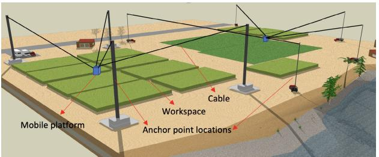

**FIGURE 1.** Fixed-base (left) and mobile-base (right) large-scale CDPRs designed for flat terrain farming operations.

inaccurate positioning of the mobile platform. As a result, the uncertainties may worsen the positioning performance of the cable robots with undesired vibrations and potentially loosing tension in one or more cables. In early studies on CDPRs, there has been limited focus on accurately compensating for anchor point uncertainties during operation, which is crucial for improving trajectory tracking. Often, the actuator locations are assumed to be fixed or precisely calibrated before operations, relying on initial calibration methods (manual or self/automatic calibration) with devices like laser rangefinders or motion-tracking cameras [\[9\],](#page-22-8) [\[10\].](#page-22-9) While effective, these methods do not address the need for real-time adjustments to compensate for the anchor point uncertainties during the system operation. For example, [\[11\]](#page-22-10) introduces a calibration strategy that refines the geometric and non-geometric parameters using a motion capture system to ascertain the pose of the mobile platform. Although such approaches enhance initial accuracy, they often require significant time for calibration, especially for cable systems used in unstructured or variable operating environments.

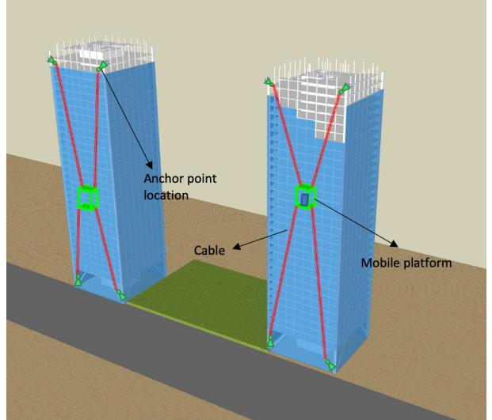

**FIGURE 2.** Redundant four-cable, two-DoF CDPRs designed for the construction and maintenance of tower facades.

It is also challenging to ensure that the anchor point locations remain unchanged over time due to the mechanical defects within industrial environments, which are often subject to vibrational forces and protracted periods of uninterrupted operation. Moreover, when the operation change is considered, the actuator repositioning would be required, and they should be calibrated correctly [\[12\].](#page-22-11) Consequently, even though calibration methods for the anchor point uncertainties can be one of the most favourable mechanisms, they typically require a comparatively long period of time. For a detailed and rigorous analysis of parallel robot calibration, readers are referred to [\[13\].](#page-22-12)

While calibration is critical for addressing anchor point uncertainties, very few studies have focused on developing control strategies to effectively handle these uncertainties. To the authors' best knowledge, this problem has only been addressed in [\[14\],](#page-22-13) [\[15\],](#page-22-14) [\[16\], a](#page-22-15)nd [\[17\]. R](#page-22-16)eference [\[14\]](#page-22-13) proposes an adaptive position compensation method to eliminate the installation error in non-redundant cable robots, wherein an external camera is installed on the top of the static platform cage. Reference [\[15\]](#page-22-14) introduces an adaptive control scheme that handles the anchor point uncertainties with the inclusion of a virtual cable approach of all Degrees of Freedom (DoF) cable robots through a vision system. The gravity is also neglected in [\[14\]](#page-22-13) and [\[15\]. R](#page-22-14)eference [\[16\]](#page-22-15) proposes a vision-based adaptive sliding mode control design to enhance trajectory tracking performance for fully constrained cable robots. Reference [\[17\]](#page-22-16) introduces an adaptive synchronization control design to handle the uncertainties. They employ a regression model that necessitates acquiring the pose of the mobile platform through inverse kinematics. The effect of the payload is also disregarded in [\[17\].](#page-22-16)

As the literature review of CDPRs indicates, the works are mostly dependent on vision sensors, and it is worth stating that the methods developed thus far can be practical for small-scale operations due to the possible usage of external camera sensors; however, considering an increase in the workspace and the number of actuators, the practicability of these approaches becomes questionable. Moreover, the problem of the actuator installation uncertainties for redundant cable robots has been mostly ignored. Additionally, these methods often require complex linear separation of the uncertain kinematic parameters, further complicating their implementation.

In this paper, the aim is to introduce an adaptive controller to overcome the uncertainties and reduce instantaneous pose errors. First, this paper proves that the proposed methodology, in the absence of a vision system, can eliminate the wrench matrix uncertainty resulting from imprecise actuator positioning for any CDPR in all DoFs. Second, the complex linear separation of the uncertain anchor point parameters is not required for the developed adaptive control structure. Third, MCSs are conducted to evaluate the robustness and stability of the state estimation. Fourth, the proposed control design is robust against unmodeled dynamics and external disturbance. Thus, the control approach can be easily applied to large-scale CDPRs and make them applicable to many industrial operations. Fifth, an assemblage of exemplars has been incorporated to illustrate the application of the developed control algorithm. High-fidelity simulation results have been included to corroborate the performance quality of
the proposed control methodology. Additionally, the impact
of payload variations on the uncertainties is explored. The
outcomes of this study are also discussed in terms of the
proposed framework's potential to enhance the practical
deployment of CDPRs in poorly instrumented environments
and large-scale settings.The outline of this work is structured as follows: Section II  
provides a comprehensive overview of the kinematic and  
dynamic models relevant to CDPRs. Section III introduces  
the EKF design for the online estimation of the anchor points  
and the mobile platform's pose. Section IV presents the  
adaptive control design for CDPRs in all DoFs. Section V  
focuses on the application of the proposed control algorithm  
in the simulation setups and provides a detailed analysis of  
the results obtained. Finally, Section VI summarizes the main  
results and provides the concluding remarks.

**II. CDPR MODELING**

This section summarizes kinematic and dynamic modeling of a generic CDPR. For more details on CDPR modeling, the reader is referred to [\[18\]](#page-2-1).### A. KINEMATICS

Consider a full spatial CDPR representation, as shown inFig. 3. There exists two coordinate frames: a ground-fixedinertial frame { $O\_g$ } and a body-fixed frame { $O\_b$ }. The bodyframe is set coincident with the center of mass (CoM) of therigid mobile platform and oriented relative to the platform'sprincipal axes of inertia.The mobile platform pose,  $\mathbf{q}\_b \in \mathbb{R}^6$ , is defined as follows:
$$\mathbf{q}\_{\boldsymbol{\rho}} = \begin{bmatrix} \mathbf{p}^{\mathsf{T}} \ \mathbf{q}^{\mathsf{T}} \end{bmatrix}^{\mathsf{T}} \tag{1}$$

where  $\mathbf{p}$  represents the platform position, and  $\mathbf{q}$  denotes   
the platform orientation, defined in terms of Euler angles.  
Each of the  $n$  cables has two mount points: one fixed in the  
static frame and one attached to the mobile platform. For a  
particular cable  $i \in \{1, ..., n\}$ , the vector formed between the  
two anchor points,  $\mathbf{c}\_i$ , is found as
$$\mathbf{c}\_{i} = \mathbf{a}\_{i} - (\mathbf{p} + \mathbf{R}\_{b}^{g}\mathbf{r}\_{c,i}) \tag{2}$$

where  $\mathbf{a}\_i$  denotes the fixed-frame anchor location, expressed  

in the ground frame, and  $\mathbf{r}\_{c,i}$  denotes the body-fixed anchor  

location, expressed in the body frame. The platform rotation  

matrix  $\mathbf{R}\_b^g$  transforms the coordinates of body-fixed anchor  

points (e.g., cable attachment points on the moving platform)  

from the body frame to the ground frame. The rotation matrix  

 $\mathbf{R}\_b^g$  is defined using Euler angles: roll ( $\phi$ ), pitch ( $\theta$ ), and yaw  

( $\psi$ ). It is expressed as  $\mathbf{R}\_b^g = \mathbf{R}\_z(\psi)\mathbf{R}\_y(\theta)\mathbf{R}\_x(\phi)$ , where  $\mathbf{R}\_x(\phi)$ ,  

 $\mathbf{R}\_y(\theta)$ , and  $\mathbf{R}\_z(\psi)$  represent rotation matrices corresponding  

to rotations about the principal axes  $x$ ,  $y$ , and  $z$ , respectively.Applying eq. (2), the length of the ith cable,  $l\_i$ , is obtained as
$$d\_i = \|\mathbf{a}\_i - (\mathbf{p} + \mathbf{R}\_b^g \mathbf{r}\_{c,i})\|\_2. \tag{3}$$

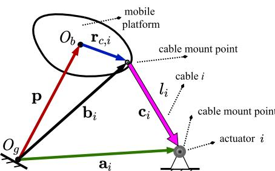

**FIGURE 3.** Definition of cable mount points and geometry terms.

Finally, the unit vector pointing along the length of the *ith* cable,  $\hat{c}\_i$ , is obtained as
$$
\hat{\mathbf{c}}\_{i} = \frac{\mathbf{c}\_{i}}{l\_{i}}.\tag{4}
$$

The set of *n* individual cable lengths can be arranged into a single-column vector. Namely,

$$\mathbf{l} = \begin{bmatrix} l\_1 \ l\_2 \ \cdots \ l\_n \end{bmatrix}^\mathsf{T}. \tag{5}$$

Differentiating eq. (5) with respect to time yields the relationship between the cable length rates and the time derivative of the platform pose:
$$
\dot{\mathbf{l}} = \mathbf{J}\dot{\mathbf{q}}\_p \tag{6}
$$

where  $\dot{\mathbf{q}}\_p = [\dot{\mathbf{p}}^\mathrm{T}, \boldsymbol{\omega}^\mathrm{T}]^\mathrm{T} \in \mathbb{R}^6$  with  $\dot{\mathbf{p}}$  being the platform's linear velocity and  $\boldsymbol{\omega}$  being the platform angular velocity with respect to the ground frame. The Jacobian matrix  $\mathbf{J} \in \mathbb{R}^{n \times 6}$  becomes
$$\mathbf{J} = \begin{bmatrix} \hat{\mathbf{c}}\_1^\mathsf{T} \left( \mathbf{R}\_b^\mathsf{g} \mathbf{r}\_{c,1} \times \hat{\mathbf{c}}\_1 \right)^\mathsf{T} \\ \vdots & \vdots \\ \hat{\mathbf{c}}\_n^\mathsf{T} \left( \mathbf{R}\_b^\mathsf{g} \mathbf{r}\_{c,n} \times \hat{\mathbf{c}}\_n \right)^\mathsf{T} \end{bmatrix}\_{n \times 6} \tag{7}$$

## B. DYNAMICS

The following equations derive the system dynamics based  
on the Euler-Lagrange approach. The kinetic and potential  
energy terms of the system,  $T$  and  $V$  respectively, are defined  
as:
$$T = \frac{1}{2} \dot{\mathbf{q}}\_p^{\mathsf{T}} \mathbf{M} \dot{\mathbf{q}}\_p, V = m\_p \mathbf{g}^{\mathsf{T}} \mathbf{q}\_p \tag{8}$$

where  $\mathbf{M} \in \mathbb{R}^{6\times6}$  and  $\mathbf{g} \in \mathbb{R}^{6\times1}$  represent the inertial matrix
and gravitational acceleration respectively, each defined as
$$\mathbf{M} = \begin{bmatrix} m\_p \mathbf{I}\_3 \ \mathbf{0}\_3 \\ \mathbf{0}\_3 \ \mathbf{J}\_p \end{bmatrix}, \mathbf{g} = \begin{bmatrix} \mathbf{0}\_{2 \times 1} \\ \mathbf{g} \\ \mathbf{0}\_{3 \times 1} \end{bmatrix}. \tag{9}$$

Here, mp represents the moving platform mass,  $J\_p \in \mathbb{R}^{3\times3}$   
denotes the platform mass-moment of inertia matrix, I3 is  
the identity matrix, and g is the gravitational acceleration  
constant. The general system dynamic equations are derived  
by the Euler-Lagrange equation of motion as
$$
\frac{\mathrm{d}}{\mathrm{d} t}\left[\frac{\partial L}{\partial \dot{\mathbf{q}}\_{p}}\right]-\frac{\partial L}{\partial \mathbf{q}\_{p}}=\mathbf{W} \tau-\mathbf{w}\_{e} \tag{10}
$$

where the Lagrangian  $L = T - V$ ,  $\mathbf{W} \in \mathbb{R}^{6\times n}$  is the cable-wrench matrix (transpose of the Jacobian matrix), and  $\mathbf{w}\_e \in \mathbb{R}^{6\times 1}$  is used to represent any externally-applied wrench. The cable tensions vector,  $\tau \in \mathbb{R}^{6\times 1}$ , is defined as
$$\boldsymbol{\tau} = \begin{bmatrix} \tau\_1 \ \tau\_2 \ \cdots \ \tau\_n \end{bmatrix}^\mathsf{T}$$

(11)

where  $\tau\_i$  represents the *i*th cable's tension. Substituting eq. (8)
into eq. (10) one obtain
$$\frac{d}{dt}\left\{\mathbf{M}\dot{\mathbf{q}}\_{\mathcal{P}}\right\} - \frac{1}{2}\frac{\partial}{\partial \mathbf{q}\_{\mathcal{P}}} \left\{\dot{\mathbf{q}}\_{\mathcal{P}}^{\mathsf{T}}\mathbf{M}\dot{\mathbf{q}}\_{\mathcal{P}}\right\} + \mathbf{g} + \mathbf{w}\_{\varepsilon} = \mathbf{W}\tau \qquad (12)$$

which simplifies to

$$\mathbf{M}\ddot{\mathbf{q}}\_{\rho} + \mathbf{C}\dot{\mathbf{q}}\_{\rho} + \mathbf{g} + \mathbf{w}\_{\varepsilon} = \mathbf{W}\mathbf{r}.\tag{13}$$

The Coriolis and centrifugal force matrix,  $C \in \mathbb{R}^{6\times 6}$ , is defined as
$$\mathbf{C} = \begin{bmatrix} \mathbf{0}\_3 & \mathbf{0}\_3 \\ \mathbf{0}\_3 \ [\boldsymbol{\omega}]\_\times \mathbf{J}\_p \end{bmatrix}. \tag{14}$$

# C. REPRESENTING ESTIMATED CDPR DYNAMIC MODEL

The estimated version of the CDPR dynamic model is obtained by replacing  $W$  in eq. (13) with its estimate  $\hat{W}$ . Namely,
$$\mathbf{M}\ddot{\mathbf{q}}\_p + \mathbf{C}\dot{\mathbf{q}}\_p + \mathbf{g} + \mathbf{w}\_\varepsilon = \hat{\mathbf{W}}\mathbf{r}.\tag{15}$$

This formulation enables the dynamic model to incorporate
the anchor point uncertainties in the wrench matrix. By esti-
mating the anchor point parameters in **W** during operation,
the system starts with potentially inaccurate initial values
and gradually adjusts these estimates to converge toward the
actual values.### D. THE CABLE TENSION DISTRIBUTION

In cases where the quantity of cables exceeds the platform
DoFs, the wrench matrix, **W**, is rectangular and wide;
therefore, an infinite number of solutions can be found for  $\tau$ 
in eq. (13). The solution for the cable tensions  $\tau$  is expressed
as the sum of two components:
$$\tau = \tau\_c + \tau\_0 \text{ with } 0 < \tau\_{\text{min}} \le \tau \le \tau\_{\text{max}} \quad \forall i = 1, \dots, n \tag{16}$$

where  $\tau\_c$  is the minimum-norm solution derived without considering tension bounds, and  $\tau\_0$  is the internal tension vector that ensures positive cable tensions while not affecting end-effector motion. Specifically,  $\tau\_c$  is computed using  $\tau\_c = W^{\dagger} (M\ddot{q}\_p + C\dot{q}\_p + g + w\_e)$  with  $W^{\dagger}$  denoting the Moore-Penrose pseudoinverse of the wrench matrix W. The internal tension  $\tau\_0$  lies in the null space of W and is represented as  $\tau\_0 = N\gamma$ , with  $N \in \mathbb{R}^{n \times (n-6)}$  being the nullspace matrix and  $\gamma$  an arbitrary vector that ensures all cable tensions remain positive.The feasible solution set for  $\tau$  must satisfy two conditions: first, it must belong to the affine set
$$A = \{ \tau \mid \tau = \tau\_{c} + \tau\_{0} \}, \qquad (17)$$

and second, it must lie within the bounded region

$$\mathcal{G} = \{\tau \mid \tau\_{\min} \leq \tau \leq \tau\_{\max} \}.$$
 (18)

The solution space is defined as the intersection of these two convex sets,  $C = G \cap A$ . When this intersection is nonempty, the feasible solutions exist, and the primary objective becomes finding the unique solution within  $C$  that has the minimum norm. This unique minimum-norm solution is desirable for optimality and efficiency in the tension distribution. If the intersection  $C$  is empty, it indicates that no solution satisfies both constraints simultaneously. In such cases, the infeasibility of the problem is analyzed by examining the gap between the affine set  $A$  and the bounded region  $G$ . This gap quantifies the extent of conflict between the two constraints and helps in understanding why a feasible solution cannot exist.To address both situations whether the intersection is nonempty or empty, Dykstra's projection algorithm [\[19\]](#page-22-19) is utilized. This algorithm is a systematic iterative method for projecting points onto the intersection of convex sets. When the feasible solutions exist, the algorithm converges to the minimum-norm solution in  $C$ . In cases of the infeasibility, the algorithm helps analyze the separation between  $\mathcal{A}$  and  $\mathcal{G}$ , providing insights into the nature of the conflict. The Dykstra's algorithm operates by alternately projecting onto the individual convex sets  $A$  and  $G$ , iteratively refining the solution. Its implementation ensures computational efficiency and robustness in finding solutions and diagnosing infeasibility. Further details on the algorithm and its applications can be found in [\[19\].](#page-22-19)

Besides, the anchor point uncertainties in the Jacobian
matrix are handled using an EKF-based state estimation
framework, which estimates system states online and com-
pensates for inaccuracies in the Jacobian matrix. These online
estimates are integrated into the control design to enable
precise computation of the null space of the Jacobian matrix.
As a result, the cables maintain appropriate tension despite
uncertainties in the anchor points. The integration of the EKF
with the internal force method, combined with the tension
limits, enhances the robustness and reliability of the tension
distribution approach under varying operational conditions.# **III. EXTENDED KALMAN FILTER DESIGN**

The proposed method utilizes the EKF framework, which is
well-established for estimating states in nonlinear systems
under uncertainty [\[20\]](#page-3-0). The EKF assumes that process
and measurement uncertainties can be modeled as noise to
provide a reliable and probabilistic approach to the state
estimation. This approach has been validated extensively in
robotics literature, as demonstrated in [\[21\]](#page-3-0), where the EKF is
applied to handle uncertainties in robot pose and reference
landmarks in tasks such as Simultaneous Localization and
Mapping (SLAM).Building upon this foundation, [\[22\]](#page-3-1) applies the EKF framework to address the system dynamics and parameter uncertainties of robotic manipulators. By explicitly

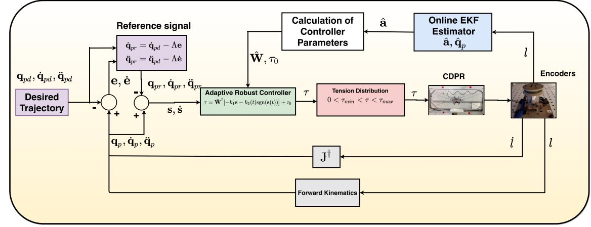

**FIGURE 4.** The developed adaptive control design with the EKF.

integrating noise into the process and measurement models,  
the EKF handles the uncertainties with accurate and reliable  
state estimation. This section introduces the EKF design  
for simultaneously estimating the mobile platform's pose,  
velocity, and uncertain anchor point locations in CDPRs for  
adaptive control design purposes.The state-space model, including uncertainties, is derived
from the simplified Euler-Lagrange equation expressed in
eq. (13). The state vector is defined as
$$\mathbf{x}(t) = \left[\mathbf{q}\_p^\mathsf{T}, \dot{\mathbf{q}}\_p^\mathsf{T}, \mathbf{a}\_1^\mathsf{T}, \dots, \mathbf{a}\_n^\mathsf{T}\right]^\mathsf{T},\tag{19}$$

where  $\mathbf{q}\_p$  and  $\dot{\mathbf{q}}\_p$  represent the pose and velocity vectors, respectively, and  $\mathbf{a} = [\mathbf{a}\_1^\mathsf{T}, \dots, \mathbf{a}\_n^\mathsf{T}]^\mathsf{T}$  denotes the anchor point parameter vector. The state-space equation is formulated as follows:
$$
\dot{\mathbf{x}}(t) = \mathbf{f}(\mathbf{x}, \tau, w\_{e}) + \nu, \quad (20)
$$

where  $f(\mathbf{x}, \tau, w\_e)$  encapsulates the terms obtained using nominal values. It is defined as:
$$\mathbf{f}(\mathbf{x}, \tau, \mathbf{w}\_{e}) = \begin{bmatrix} \dot{\mathbf{q}}\_{p} \\ \mathbf{M}^{-1} [-\mathbf{C}\dot{\mathbf{q}}\_{p} - \mathbf{g} - \mathbf{w}\_{e} + \mathbf{W}\tau] \\ \mathbf{0}\_{n \times 1} \end{bmatrix}. \tag{21}$$

The generalized random variable  $\nu$ , defined as  $\nu = [\mathbf{0}\_{1\times6}, \nu\_d^\mathsf{T}, \nu\_v^\mathsf{T}]^\mathsf{T}$ , accounts for the uncertainties. Its covariance matrix is given by  $\mathbf{Q} = \mathbf{E}(\nu\nu^\mathsf{T})$  where  $\mathbf{E}$  denotes the expectation operator. Specifically, the uncertainties in the dynamics are modeled by the random variable  $\nu\_d$ . The matrix  $\mathbf{W}$  in  $\mathbf{f}(\mathbf{x}, \tau, \mathbf{w}\_e)$  is accessible using nominal anchor point values, with any associated uncertainty captured in the term  $\nu\_d$ . Meanwhile, the uncertainties associated with the unknown anchor point estimations are represented by the random variable  $\nu\_v$ , such that  $\dot{\mathbf{a}} = \nu\_v$ .The linearized system matrix is derived via the partial derivative of the robot dynamics with regard to the states as

$$\frac{\partial \mathbf{f}}{\partial \mathbf{x}} = \mathbf{F}(t) = \begin{bmatrix} 0 & \mathbf{I} & 0 & \dots & 0 \\ F\_{21} & F\_{22} & F\_{23} & \dots & F\_{2n} \\ 0 & 0 & 0 & \dots & 0 \end{bmatrix} \tag{22}$$

where

$$F\_{21} = -\mathbf{M}^{-1} \left( \frac{\partial C}{\partial \mathbf{q}\_{p}} \dot{\mathbf{q}}\_{p} + \frac{\partial \mathbf{g}}{\partial \mathbf{q}\_{p}} - \frac{\partial (\mathbf{W} \tau)}{\partial \mathbf{q}\_{p}} \right),$$

$$F\_{22} = -\mathbf{M}^{-1} \left( \frac{\partial C}{\partial \dot{\mathbf{q}}\_{p}} \dot{\mathbf{q}}\_{p} + C \right),$$

$$F\_{23} = -\mathbf{M}^{-1} \left( \frac{\partial C}{\partial a\_{1}} \dot{\mathbf{q}}\_{p} + \frac{\partial \mathbf{g}}{\partial a\_{1}} - \frac{\partial (\mathbf{W} \tau)}{\partial a\_{1}} \right),$$

$$F\_{2n} = -\mathbf{M}^{-1} \left( \frac{\partial C}{\partial a\_{n}} \dot{\mathbf{q}}\_{p} + \frac{\partial \mathbf{g}}{\partial a\_{n}} - \frac{\partial (\mathbf{W} \tau)}{\partial a\_{n}} \right).$$

Let us introduce the measurement vector

$$\mathbf{h}(\mathbf{x}) = \begin{bmatrix} l\_1, l\_2, \dots, l\_n \end{bmatrix}^\mathsf{T} \tag{23}$$

including each particular cable length  $l\_i = ||\mathbf{a}\_i - (\mathbf{p} + \mathbf{R}\_b^g \mathbf{r}\_{c,i}) ||$  given in eq. (3). The measurement model is formulated as:
$$\mathbf{z}(t) = \mathbf{h}(\mathbf{x}(t)) + \xi(t) \tag{24}$$

where  $\zeta = [\zeta\_1, \zeta\_2, ..., \zeta\_n]^\text{T}$  is a random vector representing the uncertainty in the cable length information with the covariance matrix  $\mathbf{R} = \text{E}(\zeta \zeta^\text{T})$ . The linearized observation matrix is obtained from the partial derivative of the measurement vector with respect to the states as
$$
\frac{\partial \mathbf{h}}{\partial \mathbf{x}} = \mathbf{H}(t) = \begin{bmatrix}
\frac{\partial l\_1}{\partial \mathbf{q}\_p} & 0 & \frac{\partial l\_1}{\partial a\_1} & \dots & \frac{\partial l\_1}{\partial a\_n} \\
\frac{\partial l\_2}{\partial \mathbf{q}\_p} & 0 & \frac{\partial l\_2}{\partial a\_1} & \dots & \frac{\partial l\_2}{\partial a\_n} \\
\vdots & \vdots & \vdots & \ddots & \vdots \\
\frac{\partial l\_n}{\partial \mathbf{q}\_p} & 0 & \frac{\partial l\_n}{\partial a\_1} & \dots & \frac{\partial l\_n}{\partial a\_n}
\end{bmatrix} . \tag{25}
$$

Given the system and measurement models in eq. (20) and eq. (24), having covariance matrices **Q** and **R**, the state estimate and error covariance update equations are
$$\dot{\hat{\mathbf{x}}}(t) = \mathbf{f}(\hat{\mathbf{x}}, \mathbf{r}, \mathbf{w}\_{\epsilon}) + \mathbf{K}(t)[\mathbf{z}(t) - \mathbf{h}(\hat{\mathbf{x}})],\tag{26}$$

$$\dot{\mathbf{P}}(t) = \mathbf{F}(\hat{\mathbf{x}}, t)\mathbf{P}(t) + \mathbf{P}(t)\mathbf{F}(\hat{\mathbf{x}}, t)^{\mathsf{T}} - \mathbf{K}(t)\mathbf{H}(\hat{\mathbf{x}}, t)\mathbf{P}(t) + \mathbf{Q}\tag{27}$$

where  $\mathbf{P}(t)$  is the error variance with the Kalman gain  $\mathbf{K}(t) = \mathbf{P}(t)\mathbf{H}^\mathsf{T}(\hat{\mathbf{x}}, t)\mathbf{R}^{-1}$ . This work primarily emphasizes the theo-  
retical foundations of the EKF design within a continuous  
state-space framework, while acknowledging the essential  
role of discretization in practical implementations. The dis-  
cretization facilitates the application of the continuous-time  
model to real-time data processing, making it suitable for  
online estimation tasks. Therefore, the state estimate and  
error covariance update equations are discretized and given  
in eq. (27). It is noted that  $\hat{\mathbf{x}}(t)$  is evaluated at discrete times  
as  $\hat{\mathbf{x}}\_k = \hat{\mathbf{x}}(k\delta)$ , where  $k$  represents the sample index and  $\delta$   
denotes the sampling time. In case the EKF is applied to the  
linearized real-time system. It is composed of two steps:• 1. Prediction step:

$$
\hat{\mathbf{x}}\_{k+1|k} = \mathbf{f}(\hat{\mathbf{x}}\_{k|k}, \tau\_k, \mathbf{w}\_{e\_k}), \quad \mathbf{P}\_{k+1|k} = \mathbf{F}\_{k+1} \mathbf{P}\_{k|k} \mathbf{F}\_{k+1}^{T} + \mathbf{Q}\_{k+1}.
$$

• 2. Correction step:

$$\begin{aligned}
\mathbf{K}\_{k+1} &= \mathbf{P}\_{k+1|k} \mathbf{H}\_{k+1}^{\mathsf{T}} \mathbf{S}\_{k+1}^{-1}, \quad \mathbf{S}\_{k+1} = \mathbf{H}\_{k+1} \mathbf{P}\_{k+1|k} \mathbf{H}\_{k+1}^{\mathsf{T}} + \mathbf{R}\_{k+1}, \\
\hat{\mathbf{x}}\_{k+1|k+1} &= \hat{\mathbf{x}}\_{k+1|k} + \mathbf{K}\_{k+1} \left[ \mathbf{z}\_{k+1} - \mathbf{h}(\hat{\mathbf{x}}\_{k+1|k}) \right], \\
\mathbf{P}\_{k+1|k+1} &= \left[ \mathbf{I} - \mathbf{K}\_{k+1} \mathbf{H}\_{k+1} \right] \mathbf{P}\_{k+1|k}
\end{aligned}$$

where  $\mathbf{K}\_{k+1}$  is the Kalman gain at time  $t\_{k+1}$ ,  $\hat{\mathbf{x}}\_{k+1|k+1}$  is  
the a posteriori (final) estimate and  $\hat{\mathbf{x}}\_{k+1|k}$  is the a priori  
estimate of  $\mathbf{x}\_{k+1}$ ,  $\mathbf{P}\_{k+1|k}$  and  $\mathbf{P}\_{k+1|k+1}$  are the covariance  
matrices of the a priori and a posteriori estimation errors,  
respectively. Moreover, tuning the parameters  $\mathbf{R}\_{k+1}$  and  $\mathbf{Q}\_{k+1}$   
is crucial for achieving optimal performance of the EKF.  
An adaptive tuning is implemented for the EKF parameters  
 $\mathbf{Q}\_{k+1}$  and  $\mathbf{R}\_{k+1}$ . The estimate of the process covariance  
 $\hat{\mathbf{Q}}\_{k+1}$  and measurement noise covariance  $\hat{\mathbf{R}}\_{k+1}$  are found as  
follows [\[23\]](#page-9-1):
$$\hat{\mathbf{Q}}\_{k+1} = \mathbf{K}\_{k+1} \left[ (\mathbf{z}\_{k+1} - \mathbf{h}(\hat{\mathbf{x}}\_{k+1|k})) (\mathbf{z}\_{k+1} - \mathbf{h}(\hat{\mathbf{x}}\_{k+1|k}))^{\mathsf{T}} \right] \mathbf{K}\_{k+1}^{\mathsf{T}},\tag{28}$$

$$
\hat{\mathbf{R}}\_{k+1} = \left[ (\mathbf{z}\_{k+1} - \mathbf{h}(\hat{\mathbf{x}}\_{k+1|k}))(\mathbf{z}\_{k+1} - \mathbf{h}(\hat{\mathbf{x}}\_{k+1|k}))^{\mathsf{T}} + \mathbf{H}\_{k+1} \mathbf{P}\_{k+1|k} \mathbf{H}\_{k+1}^{\mathsf{T}} \right]. \tag{29}
$$

To update covariances, the following equations are employed:

$$\mathbf{Q}\_{k+2} = \mathbf{Q}\_{k+1} + \alpha\_{Q} (\hat{\mathbf{Q}}\_{k+1} - \mathbf{Q}\_{k+1}), \tag{30}$$

$$\mathbf{R}\_{k+2} = \mathbf{R}\_{k+1} + \alpha\_{R} \Big[ (\mathbf{z}\_{k+1} - \mathbf{h}(\hat{\mathbf{x}}\_{k+1|k})) (\mathbf{z}\_{k+1} - \mathbf{h}(\hat{\mathbf{x}}\_{k+1|k}))^{\top} - \mathbf{R}\_{k+1} \Big] \tag{31}$$

where  $\alpha\_Q$  and  $\alpha\_R$  are constant adaptation factors. For more detailed information on the tuning parameters, the reader is referred to [\[24\]](#page-5-1).Remark 1: Under a suitable adaptive control law, the
system's output can track the desired signal, even though the
parameter error vector may not converge to zero [\[25\]](#page-25-1).# **IV. CONTROL DESIGN**

The fundamental concept of the proposed adaptive controller  
involves utilizing the EKF framework to continuously estimate the uncertain anchor point parameters and the end-effector pose, and then substituting these estimated values
in the feedback controller. Furthermore, a robust term is
integrated into the adaptive controller to tackle the unmodeled
dynamics and external disturbances. The block diagram of the
developed adaptive control system is shown in Fig. 4.The following control variables are based on [\[26\]](#page-5-0) and the
developed controller's robust term is adapted from [\[27\]](#page-5-0). The
objective is to design a sufficiently smooth task-space track-
ing control scheme for the CDPR system given in eq. (15).To meet the control objective, the tracking error is defined as

$$\mathbf{e}(t) = \mathbf{q}\_{p}(t) - \mathbf{q}\_{pd}(t) \qquad (32)$$

where  $\mathbf{q}\_{pd} \in \mathbb{R}^6$  denotes the desired end-effector pose vector
and  $\mathbf{q}\_{p} \in \mathbb{R}^6$  is the end-effector pose estimate that is generated
by the EKF. The reference velocity signal  $\dot{\mathbf{q}}\_{pr} \in \mathbb{R}^6$  is
defined as  $\dot{\mathbf{q}}\_{pr} = \dot{\mathbf{q}}\_{pd} - \Lambda \mathbf{e}$  with the sliding gain matrix
 $\mathbf{\Lambda} = \text{diag}(\lambda\_1, \dots, \lambda\_6) > 0$  where  $\lambda\_i > 0$ ,  $i \in \{1, \dots, 6\}$ . The
reference acceleration  $\ddot{\mathbf{q}}\_{pr} \in \mathbb{R}^6$  is  $\ddot{\mathbf{q}}\_{pr} = \ddot{\mathbf{q}}\_{pd} - \Lambda \dot{\mathbf{e}}$ . The
variable vector is defined as
$$\mathbf{s} = \dot{\mathbf{q}}\_{\rho} - \dot{\mathbf{q}}\_{\rho r} = \dot{\mathbf{e}} + \Lambda \mathbf{e} \tag{33}$$

to be used in regulation of the tracking error  $e(t)$ .  $\dot{q}\_p$  and  $\ddot{q}\_p$   
can be written as
$$
\dot{q}\_{p} = s + \dot{q}\_{pr}, \quad \ddot{q}\_{p} = \dot{s} + \ddot{q}\_{pr}. \tag{34}
$$

Substituting eq. (34) into eq. (15), it yields
$$\mathbf{M}\dot{s} = -\mathbf{C}s + \hat{\mathbf{W}}\tau - \mathbf{d} \qquad (35)$$

where  $\mathbf{d} = \mathbf{M} \ddot{\mathbf{q}}\_{pd} - \mathbf{M} \Lambda \ddot{\mathbf{e}} + \mathbf{C} \dot{\mathbf{q}}\_p - \mathbf{C} \mathbf{s} + \mathbf{g} + \mathbf{w}\_e$  behaves as disturbance. The estimate  $\hat{\mathbf{W}}$  is obtained by applying the EKF described in eqs. (26) and (27) to the system model based on eqs. (20) and (22) with only cable length information.Remark 2:  $\mathbf{M}$  is positive definite, diagonal, bounded, and satisfies  $\mu\_m \|\mathbf{s}\|^2 \le \mathbf{s}^T\mathbf{M}\mathbf{s} \le \mu\_M \|\mathbf{s}\|^2$  for some known  $\mu\_m > 0, \mu\_M > 0$ .  $\mathbf{C}$  satisfies  $\|\mathbf{C}\| \le \mu\_C \|\dot{\mathbf{q}}\_p\|$  for some bounded positive constant  $\mu\_C > 0$ . The vectors  $\mathbf{g}$  and  $\mathbf{w}\_e$  satisfy  $\|\mathbf{g}\| \le \mu\_g$  and  $\|\mathbf{w}\_e\| \le \mu\_e$  for some constants  $\mu\_g, \mu\_e > 0$ .  $\mathbf{C}$  satisfies that  $d/dt\mathbf{M} - 2\mathbf{C}$  is skew-symmetric, noting that such selection of  $\mathbf{C}$  is guaranteed to exist.Lemma 4.1 There are positive constants  $\alpha\_0$ ,  $\alpha\_1$ , and  $\alpha\_2$  such that along the trajectory of the robot the following is satisfied:
$$\left\|\mathbf{d}\right\| \le \alpha\_0 + \alpha\_1 \left\|\mathbf{s}\right\| + \alpha\_2 \left\|\mathbf{s}\right\|^2 \tag{36}$$

where  $
\alpha\_0 \triangleq \mu\_M ||\ddot{\mathbf{q}}\_{pd}|| + \mu\_C ||\dot{\mathbf{q}}\_{pd}||^2 + \mu\_g + \mu\_e$ ,  $\alpha\_1 \triangleq -\mu\_M ||\mathbf{\Lambda}|| + 2\mu\_C ||\dot{\mathbf{q}}\_{pd}|| - \mu\_C ||\mathbf{q}\_{pd}|| ||\mathbf{\Lambda}||$ ,  $\alpha\_2 \triangleq -\mu\_C ||\mathbf{\Lambda}||$  are positive constants that only depend on the matrix  $\mathbf{\Lambda}$ , desired trajectory, initial condition of the robot and the parameter properties given in Remark 4.1Proof of Lemma 4.1: Consider **d** term in eq. (35). Using
Remark 4.1 the upper bound of **d** is given as

$$\begin{aligned} \|\mathbf{d}\| \leq & \mu\_M \|\|\dot{\mathbf{q}}\_{pd}\|\| - \mu\_M \|\|\mathbf{A}\|\| \|\dot{\mathbf{e}}\|\| + \mu\_C \|\|\dot{\mathbf{e}} + \dot{\mathbf{q}}\_{pd}\|\|\|\dot{\mathbf{e}} + \dot{\mathbf{q}}\_{pd}\| \\ & - \mu\_C \|\|\dot{\mathbf{e}} + \dot{\mathbf{q}}\_{pd}\|\|\|\dot{\mathbf{e}} + \mathbf{A}\mathbf{e}\|\| + \mu\_g + \mu\_e \end{aligned} \tag{37}$$

where the upper bound of the variable vector is known to be
 $||s|| = ||\dot{e}|| + ||\Lambda|| ||e||$ . It is fact that  $||s|| \ge ||\dot{e}||$  and  $||s|| \ge ||e||$ .
Hence, the inequality is obtained as
$$\left\|\mathbf{d}\right\| \leq \mu\_{M} \left\|\ddot{\mathbf{q}}\_{pd}\right\| + \mu\_{C} \left\|\dot{\mathbf{q}}\_{pd}\right\|^{2} + \mu\_{g} + \mu\_{e}$$

$$+ (-\mu\_{M} \left\|\mathbf{\Lambda}\right\| + 2\mu\_{C} \left\|\dot{\mathbf{q}}\_{pd}\right\| - \mu\_{C} \left\|\dot{\mathbf{q}}\_{pd}\right\|)$$

$$- \mu\_{C} \left\|\dot{\mathbf{q}}\_{pd}\right\| \left\|\mathbf{\Lambda}\right\|\left\|\mathbf{s}\right\|$$

$$+ (-\mu\_{C} \left\|\mathbf{\Lambda}\right\|) \left\|\mathbf{s}\right\|^{2}. \tag{38}$$

The proof is thus completed. □

Problem 4.1: Given the uncertain *CDPR* system in eq. (15)
and a desired trajectory  $\mathbf{q}\_{pd} \in \mathbb{R}^6$  such that  $\mathbf{q}\_{pd}, \dot{\mathbf{q}}\_{pd} \in \mathbb{R}^6$ 
and  $\ddot{\mathbf{q}}\_{pd} \in \mathbb{R}^6$  are bounded, design a control law  $\mathbf{u} = \boldsymbol{\tau}(t)$ 
for any initial condition  $\mathbf{q}\_{p0} \in \mathbb{R}^6$  and  $\dot{\mathbf{q}}\_{p0} \in \mathbb{R}^6$ , such that all
the system variables of the system and  $\mathbf{u}$  are bounded, and
 $\lim\_{t \to \infty} \mathbf{e}(t) = \lim\_{t \to \infty} \dot{\mathbf{e}}(t) = 0$ .Based on Lemma 4.1, the control law is proposed as follows:

$$\tau(t) = \hat{\mathbf{W}}^{\dagger}[-k\_{1}s(t) - k\_{2}(t)\text{sgn}(s(t))] + \tau\_{0},$$

(39)

$$k\_2(t) = \alpha\_0 + \alpha\_1 \left\| \mathbf{s}(t) \right\| + \alpha\_2 \left\| \mathbf{s}(t) \right\|^2 \tag{40}$$

*where*  $k\_1$  *is a positive constant.*

Theorem 4.1 Consider the system eq. (15). The control law eq. (39) guarantees that (i) the closed-loop trajectories in eq. (13) are bounded; (ii) the tracking error  $e(t)$  converges to a small neighbourhood around the origin as  $t \rightarrow \infty$ .Proof of Theorem 4.1 Define the Lyapunov function candidate  $V = \frac{1}{2}s^{\mathsf{T}} M s$ , whose time derivative is
$$
\dot{V} = \mathbf{s}^{\mathsf{T}} \mathbf{M} \dot{\mathbf{s}} + \frac{1}{2} \mathbf{s}^{\mathsf{T}} \dot{\mathbf{M}} \mathbf{s}.\tag{41}
$$

The control law must satisfy  $\dot{V} \leq 0$ . Substituting eq. (35) and eq. (39) into eq. (41) yields  $\dot{V} = \mathbf{s}^\text{T}[-\mathbf{\hat{W}}\mathbf{\tau} + \mathbf{d}] = \mathbf{s}^\text{T}[-k\_1\mathbf{s} - k\_2\text{sgn}(\mathbf{s}) + \mathbf{d}]$  which, together with Lemma 4.1, implies  $\dot{V} \leq -k\_1||\mathbf{s}||$  for some  $k\_1 > 0$  to ensure that the system reaches the sliding surface within a finite time. Thus completes the proof.  $\square$ Remark 3: The block labeled “Tension Distribution”, depicted in Fig. 4, employs the Dykstra’s algorithm, as developed in [19]. Further details are provided in Subsection D of Section II. It is worth noting that the internal force method utilized in this study ensures that the cables consistently remain under tension.#### **V. NUMERICAL HIGH-FIDELITY SIMULATION TESTS**

This section designs and performs simulations to validate the above results.

# A. SIMULATION

A high-fidelity robot simulator is developed using MATLAB/
Simulink in combination with SimMechanics to achieve
precise mechanical simulation of the cable-driven robot
system. The simulations are performed on a Windows
10 64-bit desktop computer equipped with an Intel Core
i7-2600 CPU running at 3.4 GHz and 8.0 GB of RAM, and
the performance of the control design is evaluated.# 1) SIMULATION SETUP

Two cable robot setups are developed in the simulation  
environment: the planar and spatial redundant CDPRs. The  
coordinate system  $\{O\_b\}$  is affixed to the moving platform  
center of mass, and the coordinate system  $\{O\_g\}$  is fixed in  
place at the geometric center of the robot platform.For simplicity's sake, it is assumed that the end-effector
orientation does not occur during the operation. It is also
important to remark that the impact of cable elasticity
and mass is not included in the simulation. The cable
elasticity can introduce elongation and positional deviation
and the mass of the cables contributes to the system's
dynamic behavior, with gravitational forces causing sagging
and affecting tension distribution, and inertia impacting
the dynamic response during rapid movements [\[28\]](#page-6-1). These
factors are also important for precise system performance and
will be considered in future studies to enhance the CDPR
accuracy and reliability.

The sampling time  $\delta$  determines the rate at which mea-
surements are taken and processed, thus directly impacting
the performance of the estimation algorithm in real-time
applications. The system dynamics and computational con-
straints are carefully assessed to determine an appropriate
sampling time that optimizes the performance of the esti-
mation algorithm. For the simulation, the sampling time
is determined as  $\delta = 1ms$ . An adaptive tuning algorithm
is implemented for the EKF parameters  $Q$  and  $R$  using
eqs. (28-31). This approach ensures robustness and accuracy
by adjusting  $Q$  and  $R$  based on the residuals which are
differences between observed and predicted measurements.
If the residual is larger than expected, the filter will increase
 $Q$  to put more weight on the measurements, or it will
increase  $R$  to decrease reliance on potentially noisy mea-
surements [\[20\]](#page-9-1). Furthermore, the adaptive tuning algorithm
is integrated with the MCSs to further validate robustness and
stability.The planar redundant CDPR: A planar redundant CDPR  
including four cables with two DoFs moving end-effector  
capability is considered and simulated for horizontal green-  
house operations. The end-effector shape is also considered  
as a point mass. The cable layout of the planar CDPR is shown  
in Fig. 5. Table 1 represents the mechanical properties of  
the planar robot. The actual (blue colored circle) and initial  
(yellow colored dash-line circle) anchor point locations are  
shown in Fig. 5, and their values are exhibited in Table 2.  
In order to validate the control performance in the simulation  
environment, a reference trajectory is generated by  $p\_{xd}$  =  
 $p\_{x0} + d\_x \sin(\omega\_x t)$ ,  $p\_{yd} = p\_{y0} + d\_y \cos(\omega\_y t)$  where [ $p\_{xd}$ ,  $p\_{yd}$ ]  
denotes the desired position, [ $p\_{x0}$ ,  $p\_{y0}$ ] = [0, -0.25] denotes  
the vertical shift of the signal, [ $d\_x$ ,  $d\_y$ ] = [0.5,0.25] is the  
amplitude of the signal, t is the total motion time, and  
[ $\omega\_x$ ,  $\omega\_y$ ] = [ $\pi$ , $\pi$ /2] denotes the frequency of the platform.  
The control design parameters are also given in Table 3. The  
PID control parameters are denoted as  $k\_p$  for proportional  
gain,  $k\_i$  for integral gain, and  $k\_d$  for derivative gain.  
Moreover,  $k\_1$  is a positive constant, and  $k\_2$  is a time-varying

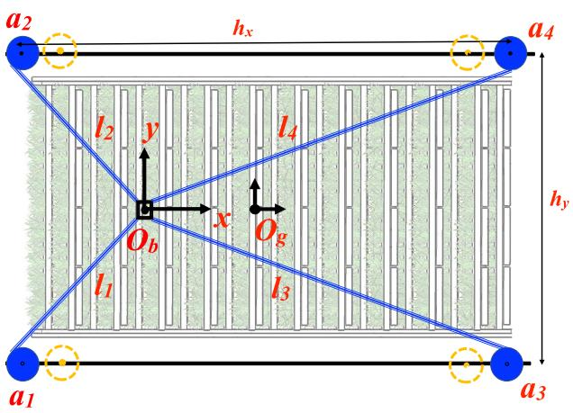

**FIGURE 5.** Layout of a four-cable, two-DoF CDPR designed for horizontal farming applications.

term dependent on the trajectory of the robot and robot
dynamics, which includes  $\alpha\_1$ ,  $\alpha\_2$ , and  $\alpha\_3$ .

**TABLE 1.** The planar redundant CDPR's mechanical properties.

| Parameter    | Description                            | Value  |
|--------------|----------------------------------------|--------|
| $\tau_{max}$ | cables maximum tension                 | 300 N  |
| $\tau_{min}$ | cables minimum tension                 | 20 N   |
| $m_p$        | moving end-effector mass               | 0.5 kg |
| $m_e$        | payload mass interval                  | 0-2 kg |
| $h_x$        | length between the cable anchor points | 4 m    |
| $h_y$        | width between the cable anchor points  | 2 m    |

TABLE 2. The planar redundant CDPR anchor point locations with actual
and initial values (in meters).

| Dimension -x- | Actual value | Initial value | Dimension -y- | Actual value | Initial value |
|------------------|-----------------|------------------|------------------|-----------------|------------------|
| a1x              | -2              | -1.8             | a1y              | -1              | -0.9             |
| a2x              | -2              | -1.8             | a2y              | 1               | 0.9              |
| a3x              | 2               | 1.8              | a3y              | -1              | -0.9             |
| a4x              | 2               | 1.8              | a4y              | 1               | 0.9              |

**TABLE 3.** Control design parameters of the planar CDPR.

| Control design parameter | Value                                 |
|--------------------------|---------------------------------------|
| k1                       | [60,0;0,60]                           |
| Λ                        | [20,0;0,20]                           |
| Q0                       | diag([0.001*[1;1;1;1]; 10*ones(8,1)]) |
| R0                       | diag(0.1*[1;1;1;1])                   |
| αQ                       | 0.001                                 |
| αR                       | 0.001                                 |
| kp                       | [400,0;0,400]                         |
| kd                       | [50,0;0,50]                           |
| ki                       | [0.001,0;0,0.001]                     |

*The spatial redundant CDPR:* Representation of a spatial redundant CDPR for farming operations and its cable layout are shown in Figs. [6a](#page-7-4) and [6b,](#page-7-4) respectively. The simulation focuses on tracking a 3-DoF position trajectory (*x*, *y*, *z*) for the center of mass { $O\_b$ } of the platform while maintaining the orientation angles ( $\phi$ ,  $\theta$ ,  $\psi$ ) fixed at zero throughout the
motion. The mechanical parameters of the spatial CDPR
are selected with reference to a large-scale CDPR platform
designed for real-time agricultural applications [\[29\]](#page-7-1).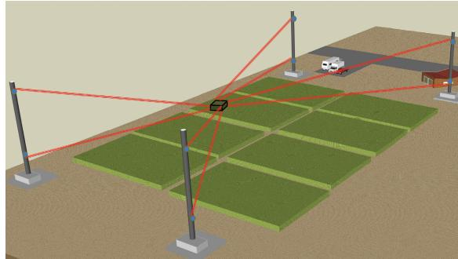

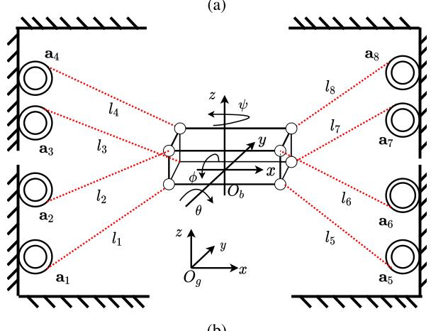

**FIGURE 6.** The spatial redundant CDRP's (a) flat terrain farming operation and (b) layout representation.

The mechanical properties are given in Table 4. The actual
and initial anchor point locations are given in Table 5.
The end-effector cable anchor point locations are listed in
Table 6. Moreover, the elasticity and mass of the cables
can impact the robot's performance, especially in dynamic
or high-precision tasks. This study assumes the platform is
significantly heavier than the cables, allowing its weight to
counteract gravitational forces on the cables. This reduces
sag and maintains positioning accuracy, as a heavier platform
keeps cable tension high enough to support it effectively in a
suspended configuration [\[28\]](#page-7-1).

The effectiveness of the controllers is evaluated under varying payload conditions and anchor point uncertainties by conducting tests with two distinct scenarios, each featuring a unique desired trajectory. Maintaining consistent controller parameters across both scenarios guarantees that any observed performance differences result solely from the controllers' inherent adaptability and robustness. Therefore, the control parameters are kept same for both cases. This enables a clear assessment of the controllers' performance. Two trajectory tracking scenarios are considered for the spatial robot. The first scenario is generated by  $p\_{xd} = p\_{x0} + d\_1 \sin(\omega\_x t)$ ,  $p\_{yd} = p\_{y0} + d\_2 \cos(\omega\_y t)$ ,  $p\_{zd} = p\_{z0} + d\_3 \sin(\omega\_z t)$ .

#### **TABLE 4.** The spatial robot's mechanical properties.

| Parameter    | Description                             | Value    |
|--------------|-----------------------------------------|----------|
| $\tau_{max}$ | Cables maximum tension                  | 2000 N   |
| $\tau_{min}$ | Cables minimum tension                  | 200 N    |
| mp           | Moving end-effector mass                | 50 kg    |
| me           | Payload mass interval                   | 0-150 kg |
| hx           | Length between the cable anchor points  | 80 m     |
| hy           | Width between the cable anchor points   | 60 m     |
| hz           | Depth between the cable anchor points   | 12 m     |
| dx           | The end-effector mobile platform length | 2 m      |
| dy           | The end-effector mobile platform width  | 2 m      |
| dz           | The end-effector mobile platform height | 0.5 m    |

**TABLE 5.** The anchor point locations (in meters).

| Dim -x- | Act val. | Init val. | Dim -y- | Act val. | Init val. | Dim -z- | Act val. | Init val. |
|------------|-------------|--------------|------------|-------------|--------------|------------|-------------|--------------|
| a1x        | -40         | -36          | a1y        | -30         | -27          | a1z        | 6           | 5.4          |
| a2x        | -40         | -36          | a2y        | -30         | -27          | a2z        | -6          | -5.4         |
| a3x        | -40         | -36          | a3y        | 30          | 27           | a3z        | 6           | 5.4          |
| a4x        | -40         | -36          | a4y        | 30          | 27           | a4z        | -6          | -5.4         |
| a5x        | 40          | 36           | a5y        | -30         | 27           | a5z        | 6           | 5.4          |
| a6x        | 40          | 36           | a6y        | -30         | -27          | a6z        | -6          | -5.4         |
| a7x        | 40          | 36           | a7y        | 30          | 27           | a7z        | 6           | 5.4          |
| a8x        | 40          | 36           | a8y        | 30          | 27           | a8z        | -6          | -5.4         |

**TABLE 6.** The end-effector anchor point locations (in meters).

| Dim-x- | Value | Dim-y- | Value | Dim-z- | Value |
|--------|-------|--------|-------|--------|-------|
| r1x    | -1    | r1y    | -1    | r1z    | 0.25  |
| r2x    | -1    | r2y    | -1    | r2z    | -0.25 |
| r3x    | -1    | r3y    | 1     | r3z    | 0.25  |
| r4x    | -1    | r4y    | 1     | r4z    | -0.25 |
| r5x    | 1     | r5y    | -1    | r5z    | 0.25  |
| r6x    | 1     | r6y    | -1    | r6z    | -0.25 |
| r7x    | 1     | r7y    | 1     | r7z    | 0.25  |
| r8x    | 1     | r8y    | 1     | r8z    | -0.25 |

and the second scenario is  $p\_{xd} = p\_{x0} + d\_1 \cos(\omega\_x t)$ ,  $p\_{yd} = p\_{y0} + d\_2 \sin(\omega\_y t)$ ,  $p\_{zd} = p\_{z0} + d\_3 t \cos\omega\_z$  where [ $p\_{x0}, p\_{y0}, p\_{z0}$ ] is the vertical shift of the circles, [ $d\_1, d\_2, d\_3$ ] is the amplitude of the signal,  $t$  is the total motion time, [ $\omega\_x, \omega\_y, \omega\_z$ ] denotes the frequency of the platform. The orientation angles  $\phi, \theta, \psi$  are initially set to zero and remain fixed at zero as the motion progresses. The signal parameter values are given in Table 7. The control design parameters selected for both scenarios are given in Table 8.# B. THE PERFORMANCE OF THE EKF WITH MONTE CARLO SIMULATIONS

# 1) MONTE CARLO SIMULATION SETUP

In this study, MCSs are conducted to evaluate the robustness and stability of the proposed method under anchor point uncertainties. For a detailed discussion on MCS, refer to [\[30\].](#page-23-8)

The impact of uncertainty levels ranging between ±10% across anchor point parameters is evaluated over a 10-second simulation period for the planar CDPR, and 15- and 60-second periods for the spatial CDPR. The simulations are performed for 50 independent trials. The metrics used for analysis include the mean, standard deviation (SD), and root mean square error (RMSE). The metrics are calculated from the sampled parameter values for each trial.

#### **TABLE 7.** The trajectory signal parameters for the scenarios (in meters).

| Parameters                       | Scenario I              | Scenario II           |
|----------------------------------|-------------------------|-----------------------|
| $[p_{x0}, p_{y0}, p_{z0}]$       | [0,-8,0]                | [-5,0,0]              |
| $[d_1, d_2, d_3]$                | [8,8,3]                 | [5,10,0.05]           |
| $[\omega_x, \omega_y, \omega_z]$ | 0.1 * $[\pi, \pi, \pi]$ | 0.1 * $[\pi, \pi, 0]$ |

**TABLE 8.** Control design parameters of the spatial robot.

| Control design parameter | Value                               |
|--------------------------|-------------------------------------|
| $\mathbf{k}_1$           | $200 * \mathbf{I}_6$                |
| $\mathbf{\Lambda}$       | $3 * \mathbf{I}_6$                  |
| $\mathbf{Q}_0$           | diag([10*eye(1,12); 10*ones(18,1)]) |
| $\mathbf{R}_0$           | diag(1*[1;1;1;1;1;1;1;1;1;1;1;1])   |
| $\alpha_Q$               | 0.001                               |
| $\alpha_R$               | 0.001                               |
| $\mathbf{k}_p$           | $400 * \mathbf{I}_6$                |
| $\mathbf{k}_i$           | $0.001 * \mathbf{I}_6$              |
| $\mathbf{k}_d$           | $200 * \mathbf{I}_6$                |

It is important to note that, to visually observe and provide a general overview of the MCS results, this section first presents them in figure format. To quantitatively assess the performance depicted in these figures, the numerical results are then provided in table format.

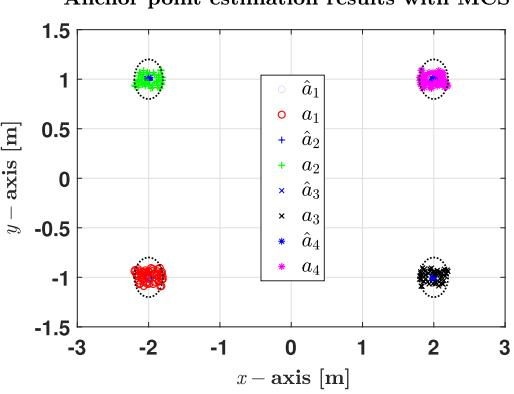

**FIGURE 7.** Anchor point estimation results of the planar CDPR with MCS.

**TABLE 9.** The MCSs results for the planar CDPR.

| Parameters | Mean    | SD     | RMSE   |
|------------|---------|--------|--------|
| â1x[m]     | -2.0009 | 0.0174 | 0.0174 |
| â1y[m]     | -0.9970 | 0.0153 | 0.0156 |
| â2x[m]     | -1.9995 | 0.0149 | 0.0149 |
| â2y[m]     | 1.0024  | 0.0125 | 0.0128 |
| â3x[m]     | 1.9993  | 0.0171 | 0.0171 |
| â3y[m]     | -1.0002 | 0.0089 | 0.0089 |
| â4x[m]     | 2.0039  | 0.0168 | 0.0171 |
| â4y[m]     | 0.9952  | 0.0075 | 0.0089 |

Fig. 7 presents the MCSs results for the planar CDPR.  
It shows convergence towards the target values despite the  
initial anchor point parameter uncertainty of -10% to +10%.  
Fig. 7 reveals a trend of convergence towards the target  
values across all trials, indicating effective mitigation of  
initial uncertainty. This is also supported by Table 9.Table 9 presents MCS results for the planar CDPR, including the mean, SD, and RMSE for the anchor point parameters. The mean values for each parameter are close to their target values. The SDs are all small, with values ranging from 0.0075 to 0.0174. The low variability in the data demonstrates consistency across the trials. The largest SD is 0.0174 for  $\hat{a}\_{1x}$ , implying that this parameter experiences slightly more variability compared to others. However, the variations are still small, which shows good repeatability. The mean values show slight positional deviations, with values such as  $\hat{a}\_{1x} = -2.0009$  m,  $\hat{a}\_{1y} = -0.9970$  m, and  $\hat{a}\_{4x} = 2.0039$  m. The SD values range from 0.0075 m for  $\hat{a}\_{4y}$  to 0.0174 m for  $\hat{a}\_{1x}$  and show a low level of uncertainty across different parameters. The RMSE values are close to the corresponding SDs for all parameters. The similar values of SD and RMSE indicate that the errors are mainly due to inherent variability rather than systematic bias. Table 9 indicates that the algorithm performs well without significant deviations from the expected results.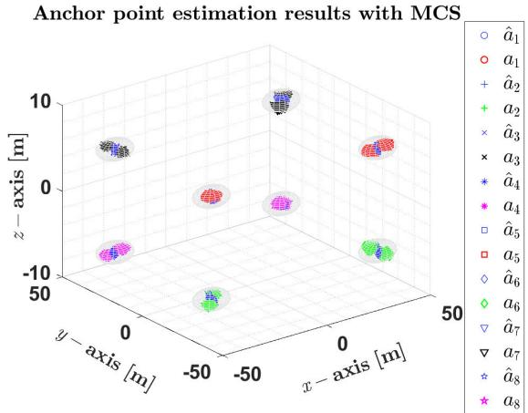

**FIGURE 8.** Anchor point estimation results of the spatial CDPR with MCS for the first scenario.

The MCSs are also performed to evaluate the performance of the spatial CDPR under two distinct trajectory scenarios, as introduced in the previous section, while keeping all conditions remain the same. Fig. [8](#page-9-0) shows the anchor point estimation results of the spatial CDPR with the MCSs for the first scenario. As observed, the anchor point estimations converge towards the target values, which demonstrates the robustness of the algorithm in handling the initial uncertainties. The spheres in Fig. [8](#page-9-0) represent the uncertainty boundaries, indicating that the results remain within these limits and confirming the accuracy of the estimation.

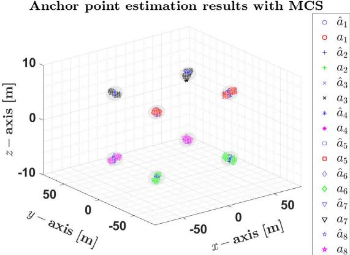

**FIGURE 9.** Anchor point estimation results of the spatial CDPR for the second scenario.

Similarly, Fig. [9](#page-9-1) presents the anchor point estimation results for the second scenario, where the estimations once again converge toward the target values. The uncertainty boundaries, represented by spheres, further validate that the estimations stay within acceptable limits.

**TABLE 10.** Monte Carlo simulation results of the spatial CDPR for the first operation.

| Parameters | Mean     | SD     | RMSE   |
|------------|----------|--------|--------|
| â1x[m]     | -40.0245 | 0.4833 | 0.4838 |
| â1y[m]     | -29.9780 | 0.3515 | 0.3522 |
| â1z[m]     | 5.9987   | 0.2122 | 0.2122 |
| â2x[m]     | -40.0236 | 0.4863 | 0.4863 |
| â2y[m]     | -29.9801 | 0.3543 | 0.3549 |
| â2z[m]     | -6.0032  | 0.2096 | 0.2096 |
| â3x[m]     | -39.9062 | 0.5176 | 0.5247 |
| â3y[m]     | 30.0273  | 0.4853 | 0.4859 |
| â3z[m]     | 5.9781   | 0.2163 | 0.2174 |
| â4x[m]     | -39.9117 | 0.5089 | 0.5152 |
| â4y[m]     | 30.0296  | 0.4882 | 0.4889 |
| â4z[m]     | -5.9709  | 0.2276 | 0.2295 |
| â5x[m]     | 40.0386  | 0.5596 | 0.5606 |
| â5y[m]     | -30.0536 | 0.4809 | 0.5008 |
| â5z[m]     | 5.9965   | 0.2261 | 0.2261 |
| â6x[m]     | 40.0406  | 0.5404 | 0.5415 |
| â6y[m]     | -30.0539 | 0.4770 | 0.4972 |
| â6z[m]     | -6.0018  | 0.2593 | 0.2593 |
| â7x[m]     | 40.1061  | 0.3520 | 0.3676 |
| â7y[m]     | 30.0205  | 0.5113 | 0.5115 |
| â7z[m]     | 6.0073   | 0.2299 | 0.2300 |
| â8x[m]     | 40.0555  | 0.3468 | 0.3625 |
| â8y[m]     | 30.0217  | 0.5062 | 0.5065 |
| â8z[m]     | -6.0095  | 0.2348 | 0.2353 |

Table 10 presents a statistical analysis of the spatial CDPR  
parameters obtained from the MCSs during the first oper-  
ation, which highlights their mean, SD, and RMSE values.  
The mean values indicate minimal deviations, demonstrating  
the overall accuracy of the estimation, with notable values  
such as  $\hat{a}\_{1x} = -40.0245$  m,  $\hat{a}\_{1y} = -29.9780$  m, and  $\hat{a}\_{6x} =$   
40.1061 m. The SD values remain within a reasonable range,  
from 0.2122 m for  $\hat{a}\_{1z}$  to 0.5596 m for  $\hat{a}\_{5x}$ , reflecting  
the algorithm's consistency. Additionally, the RMSE values  
closely align with the SD trends, and the highest value,

TABLE 11. Monte Carlo simulation results of the spatial CDPR for the second operation.

| Parameters | Mean     | SD     | RMSE   |
|------------|----------|--------|--------|
| â1x[m]     | -39.9376 | 0.1868 | 0.1069 |
| â1y [m]    | -30.0288 | 0.5580 | 0.5575 |
| â₁z[m]     | 5.9974   | 0.1705 | 0.1704 |
| â2x[m]     | -39.9669 | 0.0933 | 0.0686 |
| â2y [m]    | -30.0278 | 0.5456 | 0.5460 |
| â2z[m]     | -6.00433 | 0.2658 | 0.2655 |
| â3x[m]     | -39.9666 | 0.5308 | 0.5340 |
| â3y [m]    | 29.9831  | 0.4565 | 0.4565 |
| â3z[m]     | 6.0007   | 0.1708 | 0.1708 |
| â4x[m]     | -39.9563 | 0.5220 | 0.5253 |
| â4y [m]    | 29.9836  | 0.4673 | 0.4676 |
| â4z[m]     | -6.0079  | 0.1794 | 0.1796 |
| â5x[m]     | 40.0252  | 0.4319 | 0.4326 |
| â5y [m]    | -30.0588 | 0.4674 | 0.4696 |
| â5z [m]    | 6.0242   | 0.1915 | 0.1930 |
| â6x[m]     | 40.0290  | 0.4088 | 0.4099 |
| â6y [m]    | -30.0601 | 0.4728 | 0.4751 |
| â6z [m]    | -6.0147  | 0.1755 | 0.1761 |
| â7x[m]     | 39.9666  | 0.5308 | 0.5340 |
| â7y [m]    | 30.0349  | 0.2293 | 0.2319 |
| â7z [m]    | 6.0092   | 0.1880 | 0.1891 |
| â8x[m]     | 39.9979  | 0.4933 | 0.4933 |
| â8y [m]    | 30.0377  | 0.2475 | 0.2504 |
| â8z[m]     | -6.0028  | 0.2217 | 0.2217 |

0.5596 m for  $\hat{a}\_{5x}$ , reflects a slightly higher variability in
this parameter. Overall, the results in Table 10 highlight the
robustness of the estimation method in maintaining accuracy
while effectively handling the uncertainties.Table 11 summarizes the MCS results for the spatial  
CDPR parameters in the second operation. The mean values  
demonstrate the accuracy of the estimation, with slight  
variations such as  $\hat{a}\_{1x} = -39.9376$  m,  $\hat{a}\_{1y} = -30.0288$  m,  
and  $\hat{a}\_{6x} = 39.9979$  m. The SD values remain within the range,  
from 0.0933 m for  $\hat{a}\_{3x}$  to 0.5580 m for  $\hat{a}\_{1y}$ , reflecting the  
algorithm's ability to manage uncertainty effectively across  
different anchor point parameters. Additionally, the RMSE  
values closely follow the SD trends, with the highest being  
0.5575 m for  $\hat{a}\_{1y}$ , which indicates slightly higher variability  
in this parameter. However, the results confirm that the  
estimation stays within acceptable limits and demonstrate  
the robustness and reliability of the proposed approach in  
achieving precise anchor point localization.As a whole, the numerical results presented in Tables 10
and 11 for both operations, the mean values are close to the
target anchor point positions. This indicates that the system
maintains good positioning accuracy for most parameters.
However, there are slight deviations from the exact target
positions in some coordinates revealing small anchor point
positioning errors. In both tables, there is a close alignment
between SD and RMSE values for the majority of parameters.
The random variations are the main source of errors, with no
significant systematic bias in either operation.In conclusion, the MCSs confirm that the EKF exhibits
robust and stable performance across various parameter
uncertainties. The results demonstrate that the EKF handle
uncertainties effectively, with consistent estimation behaviorand no significant instabilities observed. These results
validate the EKF's capability to maintain reliable state
estimation under diverse conditions.It is also important to remark that the primary objective of  
this paper is to control the positioning of the system, rather  
than to achieve parameter identification. A suitable adaptive  
control law allows the system output to accurately follow the  
desired trajectory, even when the parameter error does not  
reach zero.# C. THE PERFORMANCE OF THE PROPOSED CONTROL ARCHITECTURE

# 1) CONTROL COMPARISON SETUP

The criterion for the control comparison relying on RMSE is expressed as follows:

$$\text{RMSE} = L\_2(\mathbf{e}) = \sqrt{\frac{1}{t - t\_0} \int\_{t\_0}^{t} \|\mathbf{e}(t)\| \,\mathrm{d}t} \tag{42}$$

where **e** denotes the end-effector's pose error, *t* denotes the operation time, and  $t\_0$  is the initial time. The percentage improvement (PI) for RMSE is formulated as follows:
$$\text{PI}\_{\text{RMSE}} = \left(1 - \frac{\text{RMSE}\_{\text{Controller}}}{\text{RMSE}\_{\text{Baseline}}}\right) \times 100\% \qquad (43)$$

where RMSEController is the RMSE of the controller being
evaluated and RMSEBaseline is the RMSE of the baseline
controller. In addition to RMSE, the Root Mean Square
Control Effort (RMCE) is used to evaluate the average control
energy required by each controller. It is formulated as:
$$\text{RMCE} = \sqrt{\frac{1}{t - t\_0} \int\_{t\_0}^{t} \|\mu(t)\|^2 \,\text{d}t} \tag{44}$$

where  $u(t)$  represents the control input at time  $t$ .# 2) SIMULATION RESULTS AND DISCUSSION

The performance of the developed controller in this study, called the Adaptive Robust Controller (ARC), is evaluated and compared with its non-adaptive counterpart, the Robust Controller (RC), as well as the PID controller. The results are then analyzed and discussed to highlight the effectiveness of each controller.

In order to provide a clear overview of the estimation and control performance results during the operations, this section first presents them in figure format for visual interpretation. Subsequently, the numerical results are provided in table format to enable a quantitative performance comparison.

The planar redundant cable robot: The planar robot is simulated for ten seconds, and the performance results are presented. Fig. 10 shows the RMSE results for the online anchor point estimation. The results confirm that the RMSE values for the  $a\_x$  coordinate are slightly higher than those for the  $a\_y$  coordinate, yet they remain within a low range. Specifically, the highest RMSE for  $a\_x$  reaches approximately  $2 \times 10^{-3}$  m, while for  $a\_y$ , the highest RMSE stays below  $1.0 \times 10^{-3}$  m, demonstrating superior estimation accuracy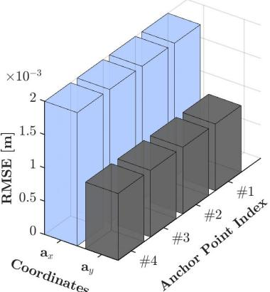

**FIGURE 10.** Anchor point estimation RMSE of the planar redundant CDPR.

in the vertical direction. These low error values indicate a high level of stability and precision in the estimation process, which validates the effectiveness of the proposed method. The results are also supported by Table [12.](#page-11-1)

**TABLE 12.** Anchor point estimation performance of the planar CDPR.

| Parameters | Mean  | SD      | RMSE    |
|------------|-------|---------|---------|
| â1x[m]     | -1.99 | 0.00199 | 0.00199 |
| â1y[m]     | -0.99 | 0.00099 | 0.00099 |
| â2x[m]     | -1.99 | 0.00199 | 0.00199 |
| â2y[m]     | 0.99  | 0.00099 | 0.00099 |
| â3x[m]     | 1.99  | 0.00199 | 0.00199 |
| â3y[m]     | -0.99 | 0.00099 | 0.00099 |
| â4x[m]     | 1.99  | 0.00199 | 0.00199 |
| â4y[m]     | 0.99  | 0.00099 | 0.00099 |

Table 12 presents the anchor point estimation performance
of the planar CDPR and provides the mean, SD, and
RMSE values for each estimated parameter. The mean values
indicate minimal deviation from the expected positions, with
 $\hat{a}\_{1x} = -1.99$  m,  $\hat{a}\_{1y} = -0.99$  m,  $\hat{a}\_{2x} = -1.99$  m, and  $\hat{a}\_{2y} =$ 
0.99 m. Similarly, the estimated values for  $\hat{a}\_{3x}$  and  $\hat{a}\_{4x}$  remain
at 1.99 m, while  $\hat{a}\_{3y}$  and  $\hat{a}\_{4y}$  are precisely measured at -
0.99 m and 0.99 m, respectively. The SD values indicate a
high level of stability in the estimation, with the lowest SD
recorded as 0.00099 m for  $\hat{a}\_{1y}$ ,  $\hat{a}\_{2y}$ ,  $\hat{a}\_{3y}$ , and  $\hat{a}\_{4y}$ , while the
highest SD of 0.00199 m is observed for  $\hat{a}\_{1x}$ ,  $\hat{a}\_{2x}$ ,  $\hat{a}\_{3x}$ , and  $\hat{a}\_{4x}$ .
The RMSE values closely match the SD trends and confirm
the estimation accuracy. The highest RMSE is recorded as
0.00199 m for  $\hat{a}\_{1x}$ ,  $\hat{a}\_{2x}$ ,  $\hat{a}\_{3x}$ , and  $\hat{a}\_{4x}$ , while the lowest RMSE
of 0.00099 m corresponds to  $\hat{a}\_{1y}$ ,  $\hat{a}\_{2y}$ ,  $\hat{a}\_{3y}$ , and  $\hat{a}\_{4y}$ . These
results demonstrate the high precision of the anchor point
estimation, as the errors remain consistently low across all
anchor point parameters. The small deviations and low RMSE
values confirm the system's accuracy and reliability, which
ensures precise localization and consistent performance of
the planar CDPR. It is also important to remark that the initial
values converge to the actual values in less than one second
and remain stable throughout the simulation.Moreover, the end-effector position estimation error results for both the *x* and *y* coordinates over a 10-second time span,

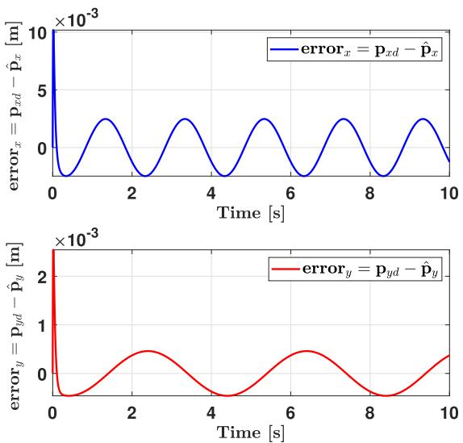

**FIGURE 11.** The position estimation error results for the planar redundant CDPR. The errors in the graphs represent the differences between the desired position of end-effector and their estimated positions.

presented in Fig. 11, demonstrate the high accuracy and  

stability of the proposed estimation method. The estimation  

error in the x-direction follows a periodic oscillatory pattern  

and initially peaks at approximately  $10 \times 10^{-3}$  m before  

gradually reducing in amplitude to  $3 \times 10^{-3}$  m. Similarly,  

the estimation error in the y-direction follows a damped  

oscillatory pattern and again initially peaks at approximately  

 $2.2 \times 10^{-3}$  m before progressively decreasing in amplitude  

 $0.3 \times 10^{-3}$  m. This highlights the algorithm's ability to refine  

estimations over time and significantly improve accuracy.  

A comparison of these error trends further highlights the  

robustness of the estimation method. The x-coordinate ini-  

tially experiences a higher deviation, but it rapidly improves,  

which demonstrates the algorithm's adaptability. Moreover,  

the y-coordinate maintains a consistent stable oscillatory  

pattern that indicates precise estimations. The results confirm  

that the estimation errors remain low (below  $10 \times 10^{-3}$  m)  

throughout the simulation, with both  $x$  and  $y$  coordinate  

errors, and converge efficiently. The rapid convergence,  

reaching near-zero error in less than one second, validates the  

effectiveness of the proposed approach.In Fig. [12,](#page-12-0) the cable tensions are always positive during the operation, so there is no looseness in the cables. According to Table [1,](#page-7-1) the cable tensions stay within the specified upper limit for maximum tension and consistently remain above the minimum tension limit.

For observation purposes, the trajectory tracking perfor-
mance of the controller is presented in Fig. 13, while the
trajectory tracking error performance is shown separately in
Fig. 14. Fig. 13 illustrates the position trajectory tracking
performance of the planar CDPR under uncertain anchor
point locations. The results indicate a strong correlation
between the desired trajectory ( $p\_{xd}$ ,  $p\_{yd}$ ) and the actual

**FIGURE 12.** Cable tension of the planar redundant CDPR during the operation.

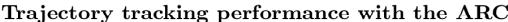

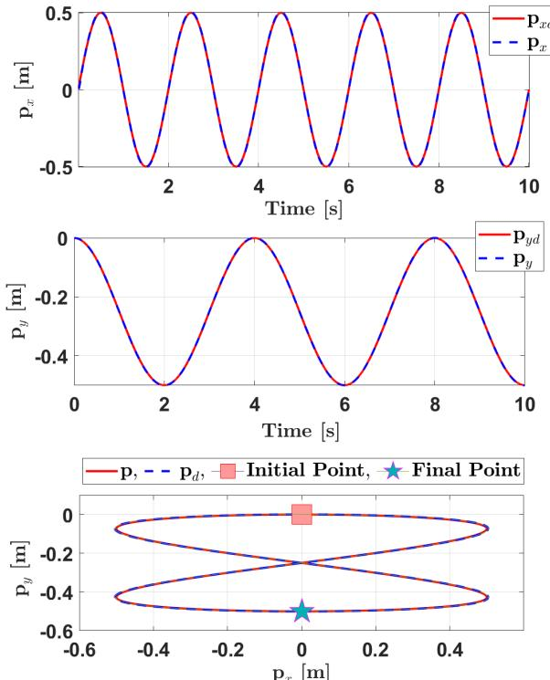

**FIGURE 13.** Position trajectory tracking performances of the planar CDPR with the uncertain anchor point locations.

trajectory ( $p\_x, p\_y$ ), and they demonstrate high tracking  
accuracy. In the x-direction, the trajectory oscillates between  
approximately -0.5 m and 0.5 m over a 10-second period and  
has a minimal deviation from the reference. Similarly, in the  
y-direction, the motion follows the path, ranging between  
0 m and -0.5 m, and maintains its precise tracking during  
the task. Moreover, the 2D plot shows that the robot closely  
follows the reference trajectory. These results highlight the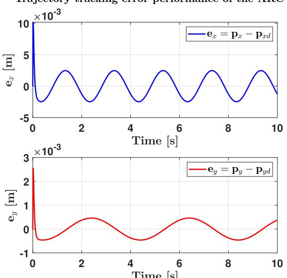

**FIGURE 14.** The robot's position trajectory tracking error performance with the uncertain anchor point locations. The errors in the graph shows the difference between the actual end-effector positions and the desired end-effector position.

ARC controller's capability to maintain accurate tracking despite the anchor point uncertainties.

Fig. 14 presents the position trajectory tracking error
performance of the ARC controller under the uncertain
anchor point locations. The results show that the tracking
errors remain within a small range and indicate effective
compensation for the uncertainties. In the x-direction, the
error follows a periodic oscillatory pattern which is between
approximately  $-2 \times 10^{-3}$  m and  $2 \times 10^{-3}$  m over the
10-second duration. For the y-direction, the error initially
starts near zero but increases, reaching a peak of around
2 mm before gradually oscillating between approximately
-0.2 mm and 0.2 mm. The error remains relatively low and
has a good trajectory tracking performance. This highlights
the controller's ability to achieve precise tracking with
minimal deviation.To assess the controller's robustness under varying conditions, its performance is compared with the RC and PID controllers. The proposed controller is evaluated under the uncertainties and payload changes to determine its adaptability and effectiveness. This comparative analysis ensures a fair assessment of the controller's advantages over the conventional control strategies. Additionally, three different scenarios are tested to analyze the effect of the payload changes and anchor point uncertainties. These scenarios include cases with no payload, a 1 kg payload, and a 2 kg payload. For each case, the control parameters remain unchanged to isolate the impact of the parameter uncertainties and payload changes. This approach emphasizes the controller's ability to maintain stability and accuracy across different operational conditions. For a visual performance comparison, Fig. [15](#page-13-0) presents the trajectory tracking error

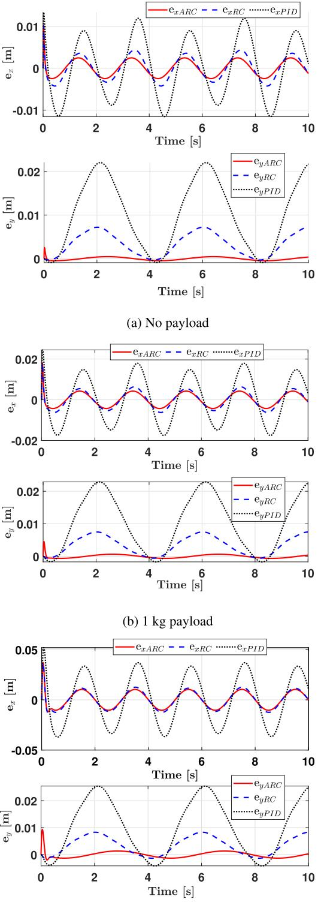

Trajectory tracking error performance of the controllers

**FIGURE 15.** Position trajectory tracking error performances of the planar CDPR with three different controllers over the anchor point uncertainties and payload changes.

of the ARC alongside the RC and PID controllers. The results indicate that the ARC outperforms both the PID

#### **TABLE 13.** Comparison of the controllers performances under three different payload conditions.

(a) RMSE and PI values for different payload conditions.

| Controller | No payload |       | 1 kg payload |       | 2 kg payload |       |
|------------|------------|-------|--------------|-------|--------------|-------|
|            | RMSE       | PI    | RMSE         | PI    | RMSE         | PI    |
| PID        | 0.0104     | -     | 0.0148       | -     | 0.0205       | -     |
| RC         | 0.0036     | 65.38 | 0.0052       | 64.86 | 0.0072       | 64.88 |
| ARC        | 0.0013     | 87.50 | 0.0034       | 77.02 | 0.0057       | 72.20 |

| Controller | No payload | 1 kg payload | 2 kg payload |
|------------|------------|--------------|--------------|
|            | RMCE       | RMCE         | RMCE         |
| PID        | 100.6619   | 100.6837     | 100.7195     |
| RC         | 100.6602   | 100.6828     | 100.7186     |
| ARC        | 100.6216   | 100.6383     | 100.6685     |

and RC controllers and demonstrate superior accuracy and robustness in the trajectory tracking. The observations are further supported by numerical results given in Table [13.](#page-13-1)

In order to quantitatively compare the controllers performances, Table [13](#page-13-1) provides a comparison of the controllers performances under three payload conditions (no payload, 1 kg, and 2 kg) with the anchor point uncertainties. RMSE and RMCE are used as the performance metrics. The results indicate that the ARC consistently achieves the lowest RMSE. In terms of RMCE, all controllers show similar control efforts, with ARC achieving slight reductions and shows its efficiency in handling the uncertainties and payload changes.

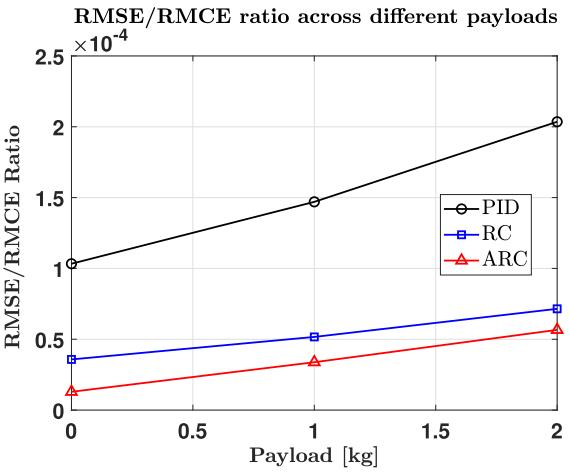

**FIGURE 16.** The RMSE/RMCE ratio under different payloads for the controllers.

According to Table 13, the RMSE values indicate that
the ARC maintains the lowest error across all payloads
under the anchor point uncertainties, with 0.0013 at no
payload, increasing to 0.0034 at 1 kg and 0.0057 at 2 kg.
In comparison, the RC exhibits higher RMSE values of
0.0036, 0.0052, and 0.0072, while the PID shows the highestRMSE, increasing significantly from 0.0104 to 0.0148 and further to 0.0205 as the payload increases. These results indicate that the ARC reduces RMSE by 87.5% compared to the PID and 50.3% compared to the RC under the anchor point uncertainties and no-payload condition. Even at 2 kg, the ARC maintains 72.2% lower RMSE than the PID and 20.8% lower than the RC and the results highlight its superior robustness in tracking accuracy.

The PI values in Table 13 further confirm the advantage
of the ARC, as it achieves the highest performance index
across all cases, starting at 87.50 with no payload. It slightly
decreases to 77.02 at 1 kg and 72.20 at 2 kg. On the other
hand, the RC maintains lower PI values of 65.38, 64.02,
and 64.88 for the respective payloads. The results show that
the ARC outperforms the RC by 33.9% in PI under anchor
point uncertainty without a payload. It also retains a 20.3%
improvement at 1 kg and 11.3% at 2 kg, which confirms its
superior steady-state performance and robustness over the RC
and PID.

The RMCE values in Tab. [13](#page-13-1) indicate that all controllers maintain compensation efficiencies very close to 100%, with the PID ranging from 100.6619 to 100.7195, the RC from 100.6602 to 100.7186, and the ARC slightly lower at 100.6216 to 100.6685. While the ARC exhibits a marginally lower RMCE, its better RMSE and PI values show that it achieves a superior balance between compensation efficiency and control accuracy. In general, the ARC emerges as the most effective controller and demonstrates the lowest RMSE, highest PI, and competitive RMCE values. These results prove its robustness against the anchor point uncertainties and adaptability under different payload conditions.

The RMSE/RMCE ratio across different payloads, as shown in Fig. 16, highlights the performance differences among the PID, the RC, and the ARC controllers. The PID controller exhibits the highest RMSE/RMCE ratio across all payload conditions under the anchor point uncertainties, starting at approximately  $1.1 \times 10^{-4}$  with no payload, increasing to around  $1.5 \times 10^{-4}$  at 1 kg, and further rising to approximately  $2.1 \times 10^{-4}$  at 2 kg. This increasing trend indicates that the PID struggles to maintain compensation efficiency as the payload increases, which leads to higher tracking errors with the anchor point uncertainties.Fig. 16 shows that the RC controller maintains a sig-  
nificantly lower RMSE/RMCE ratio compared to the PID,  
beginning at approximately  $0.4 \times 10^{-4}$  with no payload. This  
ratio increases to about  $0.6 \times 10^{-4}$  at 1 kg, and reaches around  
 $0.7 \times 10^{-4}$  at 2 kg. While the RC performs better than the  
PID, it still shows a gradual increase in the RMSE/RMCE  
ratio with the payload, demonstrating its sensitivity to varying  
conditions with the uncertainties. The ARC controller consis-  
tently achieves the lowest RMSE/RMCE ratio and it starts at  
approximately  $0.1 \times 10^{-4}$  with no payload. The ARC's ratio  
increases to about  $0.3 \times 10^{-4}$  at 1 kg, and reaches to  $0.5 \times$   
 $10^{-4}$  at 2 kg. These results confirm that the ARC provides a  
better balance between tracking accuracy and compensation52298

efficiency, and it maintains a lower RMSE/RMCE ratio than both the PID and the RC under all payload conditions.

The tabulated data and Fig. [16](#page-13-2) conclude that the ARC exhibits superior tracking performance and outperforms the other controllers. The superiority of the ARC in handling the anchor point uncertainties becomes more evident in situations where the impact of the payload is less pronounced. Although the performance of the adaptive algorithm decreases when the payload is increased, it performs better than other controllers. These results demonstrate consistency across multiple runs for each controller, affirming the repeatability of the results. Consequently, it can be inferred that the ARC exhibits superior performance in handling the uncertainties and payload changes when compared to the PID and the RC.

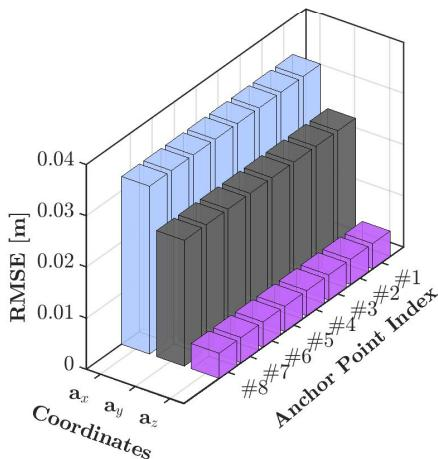

**FIGURE 17.** The anchor point estimation RMSE results for Scenario I.

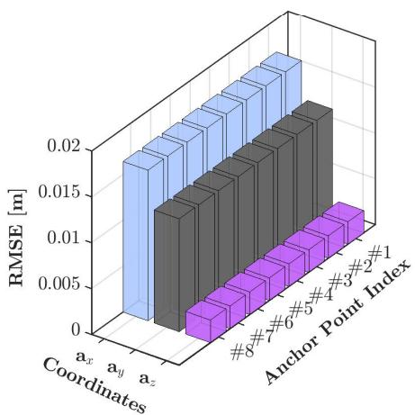

**FIGURE 18.** Anchor point estimation RMSE results for Scenario II.

*The spatial redundant cable robot*: The proposed control architecture is implemented and tested on the redundant spatial cable robot (see Fig. [6\)](#page-7-4). The simulations are conducted for two scenarios: a 15-second operation in the first scenario and a 60-second operation in the second. The control parameters are kept the same for both scenarios
to maintain consistency in performance evaluation across
different operating durations. By maintaining the control
parameters constant across different operating scenarios, the
aim is to assess each controller's ability to adapt to realistic
changes without retuning.**TABLE 14.** The anchor point estimation performance of the spatial CDPR for Scenario I.

| Parameters | Mean [m] | SD [m] | RMSE [m] |
|------------|----------|--------|----------|
| â1x        | -39.9997 | 0.0328 | 0.0328   |
| â1y        | -29.9998 | 0.0246 | 0.0246   |
| â1z        | 6.0000   | 0.0049 | 0.0049   |
| â2x        | -39.9997 | 0.0328 | 0.0328   |
| â2y        | -29.9998 | 0.0246 | 0.0246   |
| â2z        | -6.0000  | 0.0049 | 0.0049   |
| â3x        | -39.9997 | 0.0328 | 0.0328   |
| â3y        | 29.9998  | 0.0246 | 0.0246   |
| â3z        | 6.0000   | 0.0049 | 0.0049   |
| â4x        | -39.9997 | 0.0328 | 0.0328   |
| â4y        | 29.9998  | 0.0246 | 0.0246   |
| â4z        | -6.0000  | 0.0049 | 0.0049   |
| â5x        | 39.9997  | 0.0328 | 0.0328   |
| â5y        | -29.9998 | 0.0246 | 0.0246   |
| â5z        | 6.0000   | 0.0049 | 0.0049   |
| â6x        | 39.9997  | 0.0328 | 0.0328   |
| â6y        | -29.9998 | 0.0246 | 0.0246   |
| â6z        | -6.0000  | 0.0049 | 0.0049   |
| â7x        | 39.9997  | 0.0328 | 0.0328   |
| â7y        | 29.9998  | 0.0246 | 0.0246   |
| â7z        | 6.0000   | 0.0049 | 0.0049   |
| â8x        | 39.9997  | 0.0328 | 0.0328   |
| â8y        | 29.9998  | 0.0246 | 0.0246   |
| â8z        | -6.0000  | 0.0049 | 0.0049   |

**TABLE 15.** Anchor point estimation performance of the spatial CDPR for Scenario II.

| Parameters | Mean [m] | SD [m] | RMSE [m] |
|------------|----------|--------|----------|
| â₁x        | -39.9999 | 0.0164 | 0.0164   |
| â₁y        | -29.9999 | 0.0123 | 0.0123   |
| â₁z        | 6.0000   | 0.0025 | 0.0025   |
| â₂x        | -39.9999 | 0.0164 | 0.0164   |
| â₂y        | -29.9999 | 0.0123 | 0.0123   |
| â₂z        | -6.0000  | 0.0025 | 0.0025   |
| â₃x        | -39.9999 | 0.0164 | 0.0164   |
| â₃y        | 29.9999  | 0.0123 | 0.0123   |
| â₃z        | 6.0000   | 0.0025 | 0.0025   |
| â₄x        | -39.9999 | 0.0164 | 0.0164   |
| â₄y        | 29.9999  | 0.0123 | 0.0123   |
| â₄z        | -6.0000  | 0.0025 | 0.0025   |
| â₅x        | 39.9999  | 0.0164 | 0.0164   |
| â₅y        | -29.9999 | 0.0123 | 0.0123   |
| â₅z        | 6.0000   | 0.0025 | 0.0025   |
| â₆x        | 39.9999  | 0.0164 | 0.0164   |
| â₆y        | -29.9999 | 0.0123 | 0.0123   |
| â₆z        | -6.0000  | 0.0025 | 0.0025   |
| â₇x        | 39.9999  | 0.0164 | 0.0164   |
| â₇y        | 29.9999  | 0.0123 | 0.0123   |
| â₇z        | 6.0000   | 0.0025 | 0.0025   |
| â₈x        | 39.9999  | 0.0164 | 0.0164   |
| â₈y        | 29.9999  | 0.0123 | 0.0123   |
| â₈z        | -6.0000  | 0.0025 | 0.0025   |

Figs. [17](#page-14-0) and [18](#page-14-1) show the RMSE values between the actual positions of anchor points and their estimated locations in the *x* − *y* − *z* plane for the first and second scenarios, respectively. Fig. 17 presents the anchor point estimation RMSE results for Scenario I. The results indicate that the RMSE values for the ax coordinate are the highest among all coordinates, reaching approximately 0.04 m. The ay coordinate exhibits moderate RMSE values, with errors 0.03, whereas the az coordinate maintains the lowest RMSE values and remains below 0.005 m. These results indicate that the estimation accuracy varies across different anchor point positions, with the ax coordinate being more prone to errors compared to the ay and az.

Fig. 18 illustrates the RMSE results for the anchor point estimation in Scenario II and depicts the error distribution across various anchor points and coordinate directions. The results show that the  $a\_x$  coordinate exhibits the highest RMSE among all coordinates and reaches approximately 0.02 m. The  $a\_y$  coordinate has moderate RMSE values and ranges from 0.010 m to 0.015 m, whereas the  $a\_z$  coordinate maintains the lowest RMSE, remaining below 0.005 m. Compared to Scenario I, Scenario II demonstrates an overall reduction in RMSE across all coordinates, with the maximum RMSE decreasing from 0.04 m in Scenario I to 0.020 m in Scenario II. The results validate the effectiveness of the estimation method and show better performance compared to Scenario I. The changes in the RMSE values highlight that the estimation accuracy is dependent on the anchor point locations and coordinate directions, with the  $a\_x$  being more susceptible to errors than the  $a\_y$  and  $a\_z$ .Tables 14 and 15 summarize the mean, SD, and RMSE
values of the online anchor point estimation for the first
and second scenarios, respectively. Table 14 presents the
anchor point estimation performance of the spatial CDPR for
Scenario I. The mean values indicate minimal deviations from
the expected anchor point positions, with  $\hat{a}\_x$  = -39.9997 m,
 $\hat{a}\_y$  = -29.9998 m, and  $\hat{a}\_z$  = 6.0000 m across different anchor
points, performing high estimation accuracy. The SD values
vary across different coordinate directions, with the highest
values observed in the  $a\_x$  and  $a\_y$  coordinates and reaching
up to 0.0328 m and 0.0246 m, respectively. In contrast,
the  $a\_z$  coordinate exhibits lower SD values, remaining at
approximately 0.0049 m. The RMSE values closely align
with the SD trends and confirm the estimation precision. The
highest RMSE of 0.0328 m corresponds to the  $a\_x$  coordinate,
while the  $a\_y$  coordinate shows RMSE values up to 0.0246 m.
The  $a\_z$  coordinate maintains the lowest RMSE values at
0.0049 m and it has minimal deviation.Table 15 presents the anchor point estimation performance  
of the spatial CDPR for Scenario II. The mean values indicate  
minimal deviations from the expected anchor point positions,  
with  $\hat{a}\_x = -39.9999$  m,  $\hat{a}\_y = -29.9999$  m, and  $\hat{a}\_z = 6.0000$  m  
across different anchor points. The SD values demonstrate  
reduced variability compared to Scenario I, with the highest  
values observed in the  $a\_x$  coordinate at 0.0164 m, followed by  
the  $a\_y$  coordinate at 0.0123 m. The  $a\_z$  coordinate exhibits the  
lowest SD values and remains at approximately 0.0025 m.  
The RMSE values closely match the SD values, which  
confirms precise estimation. The highest RMSE of 0.0164 m

corresponds to the  $a\_x$  coordinate, while the  $a\_y$  coordinate  
shows RMSE values up to 0.0123 m. The  $a\_z$  coordinate  
maintains the lowest RMSE values at 0.0025 m and it has  
minimal deviation. Compared to Scenario I, the RMSE values  
in Scenario II are lower across all coordinates, particularly  
in the  $a\_x$  and  $a\_y$  directions, where errors have reduced  
by approximately 50%. This reduction shows an improved  
estimation accuracy under the conditions of Scenario II. The  
results validate the effectiveness of the estimation method and  
confirm higher precision and stability, especially in the  $a\_z$   
coordinate, where the smallest deviations are observed. For  
both scenarios, the initial values rapidly converge to the actual  
values in under 1 second, and this convergence is consistently  
maintained throughout the simulations.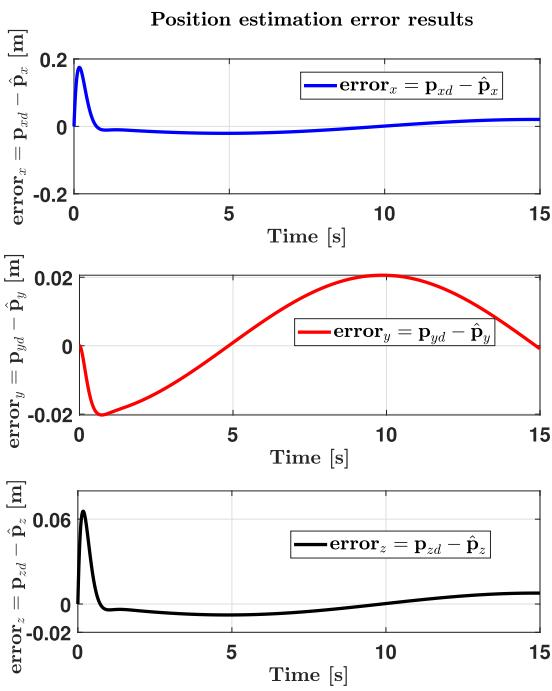

**FIGURE 19.** The position estimation error results for Scenario I.

Moreover, the position estimation error results of the CDPR for both cases are shown in Figs. 19 and 20. The position estimation error results of the first scenario in Fig. 19 demonstrate a strong convergence trend across all three coordinate directions. In the x-direction, the initial error starts at approximately 0.2 m, rapidly decreases, and approaches zero within the first 5 seconds. Similarly, in the z-direction, the initial error is around 0.06 m, which quickly reduces and remains below 0.01 m. The y-direction follows a slightly different trend, where the error initially decreases but then rises to a peak value of approximately 0.02 m around 10 seconds before gradually reducing. These results confirm that the estimation process effectively minimizes the position errors, with values remaining below 0.02 m in all directions, and they validate the precision and robustness of the proposed approach.The position estimation error results for the second scenario are shown in Fig. 20, and they highlight distinct error behaviors across all three coordinate directions. In the x-direction, the error exhibits a periodic oscillatory pattern between approximately -0.01 m and 0.01 m over the entire 60-second duration, and it follows a repeating deviation trend. The y-direction error initially starts at approximately 0.2 m, rapidly decreases, and gradually converges to zero. Meanwhile, the z-direction error remains extremely small with values on the order of 10-3 m. These results highlight the stability of the estimation process, with errors staying within an acceptable range, and they confirm the robustness of the proposed method in handling trajectory tracking uncertainties.

The cable tensions of the spatial robot during the first
and second operations are presented in Figs. 21 and 22,
respectively. Throughout the operations, the cable tensions
consistently remain positive, which indicates the absence
of any looseness in the cables. It also operates within
the maximum and minimum cable tension values listed in
Table 4.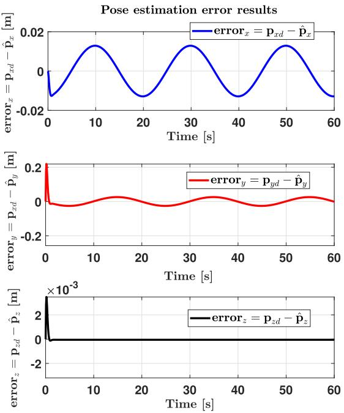

**FIGURE 20.** The position estimation error results for Scenario II.

For both cases, the trajectory tracking performances of
the developed controller are shown in Figs. 23 and 24. The
tracking error results of the ARC are presented for both
operations. The trajectory tracking performance for the first
operation is depicted in Fig. 23. A visual assessment high-
lights the ARC controller's ability to achieve precise motion
tracking with high accuracy. The subplots illustrate the
tracking behavior along the x, y, and z axes over a 15-second
duration, and they demonstrate a close alignment between the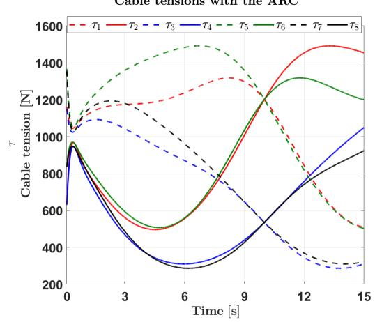

FIGURE 2.1. The robot's cable tensions during the first operation.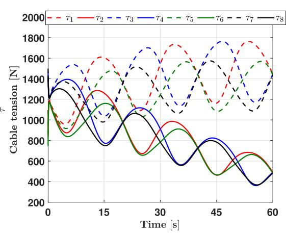

**FIGURE 22.** The robot's cable tensions during the second operation.

reference trajectory  $(p\_{xd}, p\_{yd}, p\_{zd})$  and the actual trajectory  $(p\_x, p\_y, p\_z)$ , which indicates minimal deviation. Additionally, the 3D trajectory plot provides further validation, showing that the robot successfully follows the desired path with high precision. The initial and final positions, denoted by a red square and a blue star, respectively, confirm a smooth transition along the desired trajectory.The trajectory tracking performance during the second
operation, as illustrated in Fig. 24, highlights the ARC
controller's ability to precisely follow the desired trajectory.
The subplots depict the tracking accuracy for the x, y, and z
coordinates over a 60-second period, where the reference and
actual trajectories show strong alignment. The 3D trajectory
plot further validates this observation and demonstrates that
the robot successfully follows a helical path from its initial
position (red square) to the final position (blue star).The trajectory tracking error performance of the ARC controller during the first operation is shown in Fig. 25. It demonstrates rapid error convergence and minimal steady-state deviation. In the x-direction, the initial error reaches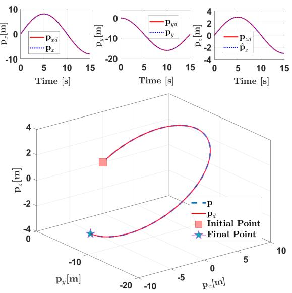

**FIGURE 23.** The robot's position trajectory tracking performance during the first operation.

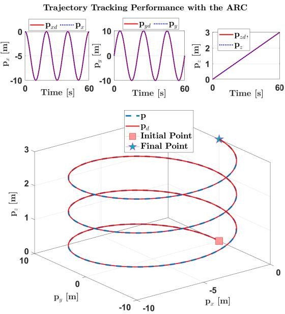

**FIGURE 24.** The robot's position tracking performance during the second operation.

approximately 0.2 m but quickly reduces within the first  
1 seconds, stabilizing close to zero with only minor  
fluctuations. In the y-direction, the error initially decreases to  
nearly -0.02 m before rising to a peak value of approximately  
0.02 m around 10 seconds. This transient behavior indicates  
a temporary deviation before gradually reducing as the  
trajectory stabilizes. For the z-direction, the initial error is  
around 0.06 m but rapidly decreases to near zero within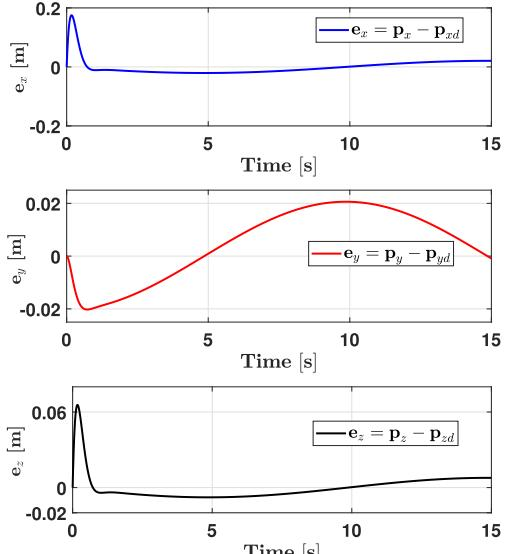

**FIGURE 25.** The robot's position tracking error during the first operation.

the first few seconds. The error remains consistently small, staying below 0.02 m for the remainder of the simulation.The trajectory tracking error performance of the ARC
controller during the second operation is shown in Fig. 26.
The results show that the errors remain stable over the 60-
second period. In the x-direction, the error follows a repeating
pattern and changes between approximately -0.01 m and
0.01 m throughout the simulation. Although the error repeats,
its amplitude stays small. In the y-direction, the error starts at
approximately 0.2 m, decreases quickly within the first few
seconds, and then remains within a range of about -0.01 m to
0.01 m with small oscillations. The z-direction error is much
smaller, with an initial value of about  $4 \times 10^{-3}$  m. It quickly
drops close to zero in the first few seconds and stays very low
for the rest of the simulation. These results show that the ARC
controller keeps the tracking errors small and stable over time.The orientation tracking errors are displayed in Figs. [27](#page-18-2) and [28.](#page-19-0) The results indicate that the orientation errors converge to zero throughout both operations.

The performance of the ARC is additionally assessed  
in comparison to the RC and PID controller with the  
uncertainties in anchor points and changes in payload. The  
robot undergoes simulation under three different payload  
scenarios: no-payload, a 50 kg payload, and a 150 kg payload.  
For the performance comparison of the ARC with other  
controllers under payload changes, only the position tracking  
results are presented, as the simulation focuses specifically on  
tracking a 3-DoF position trajectory  $(x, y, z)$  for the center of  
mass {Ob} while maintaining the orientation angles  $(\phi, \theta, \psi)$   
fixed at zero during the operations.The position tracking error performances for the first operation are demonstrated in Fig. [29.](#page-19-1) With no payload,

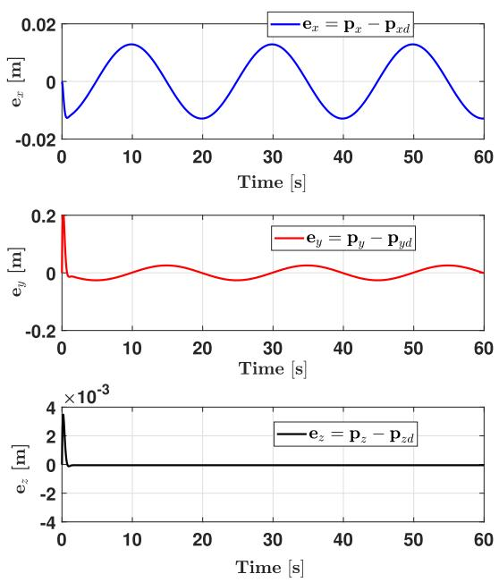

**FIGURE 26.** The robot's position tracking error during the second operation.

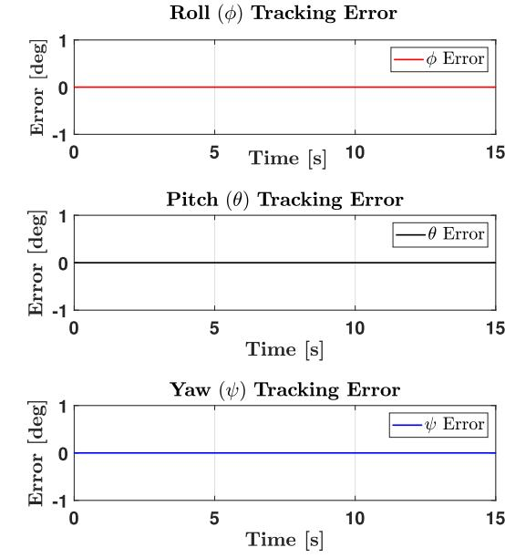

**FIGURE 27.** The robot's orientation tracking angles during the first operation.

the ARC controller achieves the lowest error, keeping the error below 0.1 m in all directions, whereas the PID and RC controllers show larger deviations, particularly in the *y*-direction, where it almost reaches 0.3 m. For the 50 kg payload case, the ARC controller maintains errors below 0.2 m, while the PID and the RC controllers show increased changes, with peak *y*-direction errors exceeding 0.35 m. Under the heaviest load of 150 kg, the ARC controller

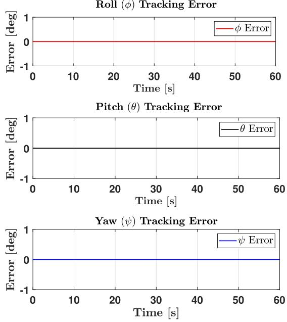

**FIGURE 28.** The robot's orientation tracking angles during the second operation.

continues to perform with reduced error amplitudes, keeping the error below 0.25 m, whereas the PID and RC controllers exhibit higher variations and slower convergence. These results exhibit that the ARC effectively reduces the impact of actuator installation errors, which leads to rapid convergence of motions to the desired positions. It can be asserted that the ARC effectively manages uncertainties in anchor points and the impact of payload, and it surpasses the performance of both PID and RC controllers for the first operation.

For the second operation, the same control parameters as those used in the first operation are maintained to test the robustness of each controller. The position trajectory tracking error results are shown in Fig. [30.](#page-20-0) When subjected to changes in trajectory and payloads, the PID controller produced substantially high error values, which indicates a notable drop in performance. These high errors make the PID results incomparable with the other methods in the second scenario; thus, the plot for PID control is excluded from the results. The large error margin shows that the PID controller is unable to adapt to the second trajectory, leading to compromised stability and tracking performance. In contrast, the ARC outperforms the RC and maintains consistent performance across all scenarios, with low error values despite the changes in payloads and the parameter uncertainties. This shows the robustness and adaptability of the ARC, which makes it a more suitable choice for applications where stability across the parameter uncertainties and payload conditions is essential. These observations are further validated by the numerical results provided in Table [16.](#page-20-1)

Performance metrics, RMSE, RMCE, and the RMSE/ RMCE ratio, are employed to quantitatively assess each

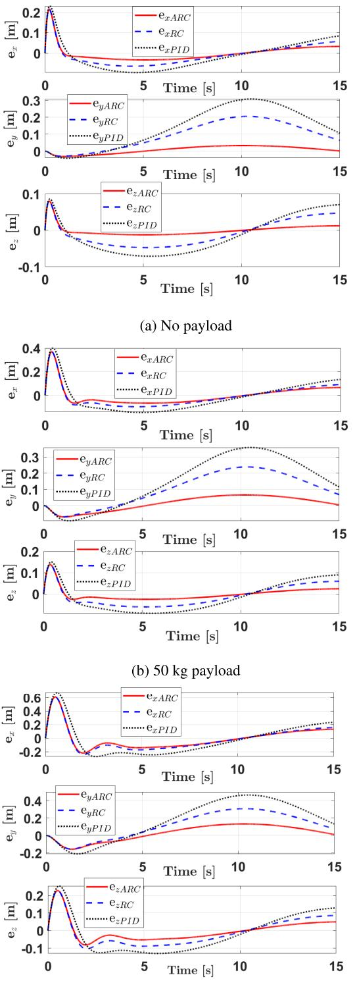

(c) 150 kg payload

**FIGURE 29.** Position trajectory tracking error performance of the spatial CDPR with the controllers over the anchor point uncertainties and payload changes for the first operation.

controller's position tracking accuracy, control efficiency, and adaptability. The results are summarized in Table [16.](#page-20-1)

#### **TABLE 16.** Comparison of the controllers' performance during the first and second operations of the spatial-cable robot under different payload conditions.

| Payload | RMSE  | PI    |
|---------|-------|-------|
| 0%      | 0.000 | 1.000 |
| 10%     | 0.003 | 0.999 |
| 20%     | 0.006 | 0.998 |
| 30%     | 0.009 | 0.996 |
| 40%     | 0.012 | 0.994 |
| 50%     | 0.015 | 0.991 |
| 60%     | 0.018 | 0.988 |
| 70%     | 0.021 | 0.985 |
| 80%     | 0.024 | 0.981 |
| 90%     | 0.027 | 0.977 |
| 100%    | 0.030 | 0.973 |

| Controller  | No Payload |       | 50 kg Payload |       | 150 kg Payload |       |
|-------------|------------|-------|---------------|-------|----------------|-------|
| Scenario I  | RMSE       | PI    | RMSE          | PI    | RMSE           | PI    |
| PID         | 0.1181     | -     | 0.1489        | -     | 0.22           | -     |
| RC          | 0.0799     | 32.25 | 0.1024        | 31.23 | 0.1546         | 29.73 |
| ARC         | 0.0279     | 76.37 | 0.0562        | 62.26 | 0.113          | 48.31 |
| Scenario II | RMSE       | PI    | RMSE          | PI    | MSE            | PI    |
| RC          | 0.0778     | -     | 0.081         | -     | 0.1252         | -     |
| ARC         | 0.0221     | 71.40 | 0.0444        | 45.19 | 0.0897         | 28.35 |

| Controller  | No Payload | 50 kg Payload | 150 kg Payload |
|-------------|------------|---------------|----------------|
| Scenario I  | RMCE       | RMCE          | RMCE           |
| PID         | 896.3907   | 896.1064      | 895.6222       |
| RC          | 897.5413   | 897.2866      | 897.5359       |
| ARC         | 916.1963   | 915.5469      | 914.9219       |
| Scenario II | RMCE       | RMCE          | RMCE           |
| RC          | 941.9818   | 940.7951      | 941.4975       |
| ARC         | 951.3998   | 951.4839      | 951.9443       |

Table [16](#page-20-1) presents a comparison of the controllers' performance during the first and second operations of the spatial cable-driven robot under different payload conditions. The results include RMSE, PI, and RMCE values for various scenarios. In Scenario I, the PID controller shows the highest RMSE across all payload conditions. The RMSE increases from 0.1181 with no payload to 0.1489 with 50 kg and 0.22 with 150 kg. The RC controller produces lower RMSE values, which range from 0.0779 to 0.1546. The ARC controller provides the lowest RMSE, with values of 0.0279 with no payload, 0.0626 at 50 kg, and 0.113 at 150 kg. The PI values show that the ARC controller achieves the highest percentage improvement over the PID controller across all payload conditions. The ARC controller provides a 76.37% improvement over the PID with no payload, which reduces to 62.26% at 50 kg and 48.31% at 150 kg, maintaining strong performance across different loads. The RC controller also improves over the PID, but with lower PI values of 32.25% at 50 kg and 29.73% at 150 kg. In Scenario II, the ARC controller achieves a 71.40% improvement over the RC at no payload, which decreases to 45.19% at 50 kg and 28.35% at 150 kg. The RMCE values for the first scenario presented in Table [16](#page-20-1) reflect the control efficiency of the controllers, and the results show that all three controllers perform with similar efficiency. Since the RMCE values are close to each other, the control efficiency of the controllers

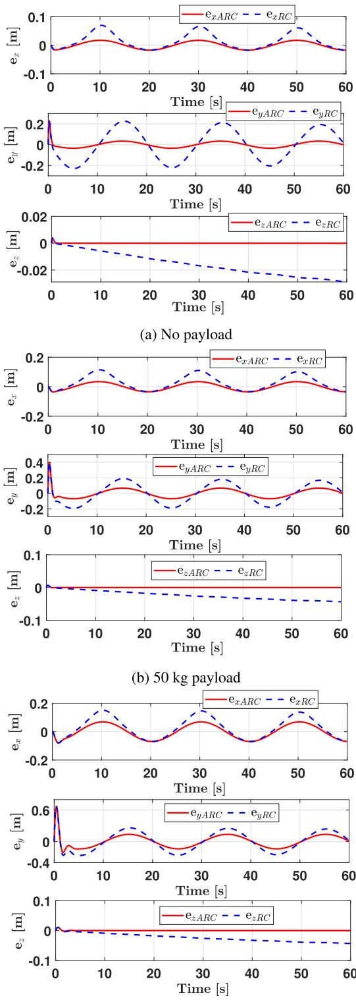

(c) 150 kg payload

**FIGURE 30.** Position trajectory tracking error performance of the spatial CDPR with the controllers over the anchor point uncertainties and payload changes for the second operation.

can be considered comparable. Overall, these results confirm that the ARC controller provides superior PI over the PID, with consistently higher percentages across all payload levels.

In Scenario II of Table [16,](#page-20-1) a similar trend appears, as the ARC controller achieves the lowest RMSE values at all payload levels. The RMSE increases with payload, from 0.0221 (no payload) to 0.0444 (50 kg) and 0.0897 (150 kg). The RC controller follows with RMSE values ranging from 0.0778 to 0.1252. The PI values represent the improvement of the ARC controller over the RC controller, as the PID results are not available for comparison. The ARC controller achieves a PI of 71.40% with no payload, which shows a significant improvement over the RC controller. At 50 kg payload, the ARC controller retains a PI of 45.19%, showing continued superior performance. At 150 kg, the PI decreases to 28.35%, but the ARC controller still outperforms the RC controller. The RMCE values for the ARC and RC controllers are close to each other, which shows comparable control efficiency. The ARC controller achieves RMCE values of 951.3998, 951.4839, and 951.9443, while the RC controller records 941.9818, 940.7951, and 941.4975. The small differences in RMCE values ensure a fair performance comparison between the ARC and RC controllers, as both operate with similar control efficiency. The tabulated results in Table [16](#page-20-1) indicate that the ARC yields superior tracking results and outperforms the RC and PID controllers in both scenarios. It shows greater capability in handling anchor point uncertainties and adapting to payload changes compared to the PID and RC controllers.

In order to highlight differences in control efficiency and robustness, the RMSE/RMCE ratios under different payload conditions are also presented, as shown in Figs. 31 and 32. Fig. 31 illustrates the RMSE/RMCE ratio across different payloads in Scenario I for the PID, RC, and ARC controllers. The ARC controller maintains the lowest RMSE/RMCE ratio across all payload levels, starting from approximately 0.3 × 10-4 at no payload and increasing to about 1.2 × 10-4 at 150 kg. The RC controller follows, with RMSE/RMCE values ranging from approximately 0.8 × 10-4 to 1.7 × 10-4. Although the RC controller performs better than the PID controller, its efficiency remains lower than that of the ARC controller. The PID controller shows the highest ratio, from 1.3 x 10-4 to 2.5 × 10-4, which indicates the least efficient performance. The ARC's lower RMSE/RMCE ratio in both cases demonstrates strong robustness and efficiency.Fig. 32. shows the RMSE/RMCE ratio for the RC and ARC
controllers across different payloads in Scenario II. The ARC
controller maintains a lower ratio, which indicates superior
control efficiency. It increases from approximately 2 × 10-5
at no payload to 9 × 10-5 at 150 kg. The RC controller
starts higher, at about 8 × 10-5, and rises steeply to 13.5 x
10-5 at 150 kg. The gap between controllers widens with
increasing payload, with the ARC achieving approximately
25.9% lower ratio at 150 kg. These results highlight the
ARC controller's superior efficiency under varying payload
conditions. The results for both scenarios highlight that the
ARC controller provides superior tracking performance withmore efficient control effort, maintaining its advantage as the payload increases.

RMSE/RMCE Ratio Across Different Payloads in Scenario I

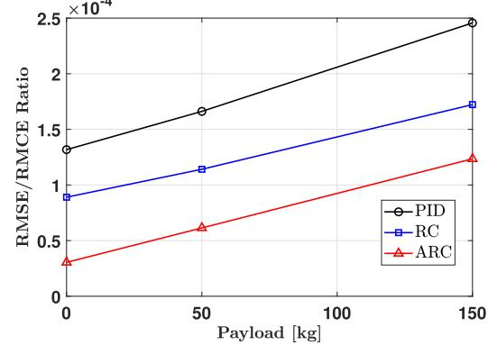

**FIGURE 31.** The RMSE/RMCE ratio under different payloads during the first operation.

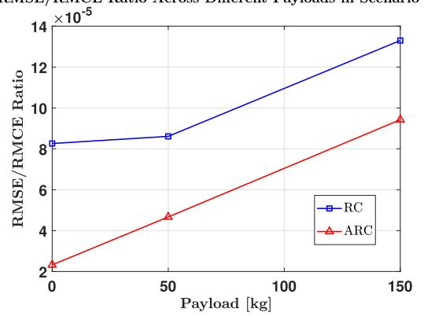

**FIGURE 32.** The RMSE/RMCE ratio under different payloads during the second operation.

In conclusion, the effectiveness of the developed controller becomes particularly evident in scenarios where the impact of the payload is less pronounced. It is apparent that the trajectory tracking error increases with an elevation in the load. Despite a decline in the adaptive algorithm's performance with an increased payload, it still outperforms other controllers. The robust term's effectiveness becomes more evident with an increased payload. While the PID is less effective in dealing with anchor point uncertainty and payload changes, the RC proves more capable of handling the payload changes. Therefore, it is inferred that the ARC is more adept at handling the uncertainties related to actuator installation and changes in payload compared to both the RC and the PID.

The outcomes of this study have significant practical implications for enhancing the operational efficiency and reliability of CDPRs in poorly instrumented environments and large-scale applications. The scalability and applicability of the simulated system offer a foundation for future real-world implementation and further motivate the study.
A future prototype is envisioned with a size of 60 m x
60 m x 12 m and a load capacity of 150 kg, making it
ideal for precision agriculture tasks such as automated crop
monitoring, spraying, and harvesting.The proposed methodology offers a cost-effective framework that reduces the dependence on extensive sensor networks. This is particularly valuable in real-world scenarios such as disaster recovery operations, where rapid deployment and adaptability are crucial, or in large-scale construction sites where sensor installation may be impractical. Moreover, the robustness of the proposed approach against external disturbances and parameter uncertainties ensures reliable performance in challenging industrial settings. These capabilities underscore the potential of the developed methodology to address key operational challenges, paving the way for broader adoption of CDPRs in unstructured and dynamic environments.

# **VI. CONCLUSION**

An EKF state estimation-based adaptive control design for desired trajectory tracking of CDPRs, robust to actuator position uncertainties, unmodeled dynamics, and external disturbances, has been presented. The high-fidelity simulation results verify that the developed adaptive control scheme successfully compensates for the actuator position uncertainties, demonstrates robustness to unmodeled dynamics and payload variations, and that the proposed EKF-based estimator effectively estimates the uncertain actuator positions using cable length information. Moreover, the MCS results validate the EKF's robustness and stability, as it handles parameter uncertainties effectively and maintains reliable state estimation under diverse conditions. The motion convergence to the desired trajectories has also been formally established, and the trajectory tracking robustness has been discussed based on Lyapunov stability analysis. Furthermore, the proposed control scheme holds significant practical value for large-scale operations, such as warehouse logistics, construction sites, and disaster recovery efforts, where robust performance, minimal instrumentation, and practicality are essential. Such implementations would highlight the methodology's ability to effectively address real-world challenges and scale to demanding applications. A significant next step to enhance the validation of this study's results is the construction of a large-scale prototype of the cable-driven robot, providing practical validation of the proposed control strategy. Additionally, future work will focus on implementing optimal control approaches to enhance the system's performance and adaptability.

# **REFERENCES**

- [\[1\] A](#page-0-0). N. F. Chan, W. Cheng, and D. Lau, ''Deformable open-frame cabledriven parallel robots: Modeling, analysis, and control,'' *IEEE Trans. Robot.*, vol. 40, pp. 3465–3480, 2024, doi: [10.1109/TRO.2024.3420714.](http://dx.doi.org/10.1109/TRO.2024.3420714)
- [\[2\] M](#page-0-1). Zarebidoki, J. S. Dhupia, and W. Xu, ''A review of cable-driven parallel robots: Typical configurations, analysis techniques, and control methods,'' *IEEE Robot. Autom. Mag.*, vol. 29, no. 3, pp. 89–106, Sep. 2022, doi: [10.1109/MRA.2021.3138387.](http://dx.doi.org/10.1109/MRA.2021.3138387)
- [\[3\] G](#page-0-2). Bai, Y. Ge, D. Scoby, B. Leavitt, V. Stoerger, N. Kirchgessner, S. Irmak, G. Graef, J. Schnable, and T. Awada, ''NU-spidercam: A large-scale, cabledriven, integrated sensing and robotic system for advanced phenotyping, remote sensing, and agronomic research,'' *Comput. Electron. Agricult.*, vol. 160, pp. 71–81, May 2019, doi: [10.1016/j.compag.2019.03.009.](http://dx.doi.org/10.1016/j.compag.2019.03.009)
- [\[4\] M](#page-0-3). Tognon, C. Gabellieri, L. Pallottino, and A. Franchi, ''Aerial comanipulation with cables: The role of internal force for equilibria, stability, and passivity,'' *IEEE Robot. Autom. Lett.*, vol. 3, no. 3, pp. 2577–2583, Jul. 2018, doi: [10.1109/LRA.2018.2803811.](http://dx.doi.org/10.1109/LRA.2018.2803811)
- [\[5\] L](#page-0-4). Elia. (Mar. 2021). *Hephaestus Team in Demo Buildings at Tecnalia's and Acciona's*. [Online]. Available: https://www.hephaestus-project.eu/2021/03/16/hephaestus-team-indemo-buildings-at-tecnalias-and-accionas/
- [\[6\] H](#page-0-5).-Y. Huang, I. Farkhatdinov, A. Arami, M. Bouri, and E. Burdet, ''Cabledriven robotic interface for lower limb neuromechanics identification,'' *IEEE Trans. Biomed. Eng.*, vol. 68, no. 2, pp. 461–469, Feb. 2021, doi: [10.1109/TBME.2020.3004491.](http://dx.doi.org/10.1109/TBME.2020.3004491)
- [\[7\] J](#page-0-6)-P. Merlet and D. Daney, ''A portable, modular parallel wire crane for rescue operations,'' in *Proc. IEEE Int. Conf. Robot. Autom.*, May 2010, pp. 2834–2839, doi: [10.1109/ROBOT.2010.5509299.](http://dx.doi.org/10.1109/ROBOT.2010.5509299)
- [\[8\] M](#page-0-7). Gouttefarde and C. M. Gosselin, ''Analysis of the wrenchclosure workspace of planar parallel cable-driven mechanisms,'' *IEEE Trans. Robot.*, vol. 22, no. 3, pp. 434–445, Jun. 2006, doi: [10.1109/TRO.2006.870638.](http://dx.doi.org/10.1109/TRO.2006.870638)
- [\[9\] P](#page-1-2). H. Borgstrom, B. L. Jordan, B. J. Borgstrom, M. J. Stealey, G. S. Sukhatme, M. A. Batalin, and W. J. Kaiser, ''NIMS-PL: A cable-driven robot with self-calibration capabilities,'' *IEEE Trans. Robot.*, vol. 25, no. 5, pp. 1005–1015, Oct. 2009, doi: [10.1109/TRO.2009.2024792.](http://dx.doi.org/10.1109/TRO.2009.2024792)
- [\[10\]](#page-1-3) G. Gungor, S. J. Torres-Mendez, B. Fidan, and A. Khajepour, ''Estimation of anchor points for fully-constrained and redundant planar cable robots,'' in *Proc. Dyn., Vib., Control*, vol. 46476, Nov. 2014, pp. 1–7, doi: [10.1115/IMECE2014-37057.](http://dx.doi.org/10.1115/IMECE2014-37057)
- [\[11\]](#page-1-4) F. Zhang, W. Shang, G. Li, and S. Cong, ''Calibration of geometric parameters and error compensation of non-geometric parameters for cabledriven parallel robots,'' *Mechatronics*, vol. 77, Aug. 2021, Art. no. 102595, doi: [10.1016/j.mechatronics.2021.102595.](http://dx.doi.org/10.1016/j.mechatronics.2021.102595)
- [\[12\]](#page-1-5) H. Wang, J. Kinugawa, and K. Kosuge, ''Exact kinematic modeling and identification of reconfigurable cable-driven robots with dual-pulley cable guiding mechanisms,'' *IEEE/ASME Trans. Mechatronics*, vol. 24, no. 2, pp. 774–784, Apr. 2019, doi: [10.1109/TMECH.2019.2899016.](http://dx.doi.org/10.1109/TMECH.2019.2899016)
- [\[13\]](#page-1-6) M. D. C. Porath, L. A. F. Bortoni, R. Simoni, and J. S. Eger, ''Offline and online strategies to improve pose accuracy of a stewart platform using indoor-GPS,'' *Precis. Eng.*, vol. 63, pp. 83–93, May 2020, doi: [10.1016/j.precisioneng.2020.01.003.](http://dx.doi.org/10.1016/j.precisioneng.2020.01.003)
- [\[14\]](#page-1-7) H. Kino, T. Yahiro, F. Takemura, and T. Morizono, ''Robust PD control using adaptive compensation for completely restrained parallel-wire driven robots: Translational systems using the minimum number of wires under zero-gravity condition,'' *IEEE Trans. Robot.*, vol. 23, no. 4, pp. 803–812, Aug. 2007, doi: [10.1109/TRO.2007.900633.](http://dx.doi.org/10.1109/TRO.2007.900633)
- [\[15\]](#page-1-8) S. J. Torres-Mendez, G. Gungor, B. Fidan, and A. Khajepour, ''Comparison of adaptive and robust controllers for fully-constrained and redundant planar cable robots,'' in *Proc. Dyn., Vib., Control*, vol. 46476, Nov. 2014, pp. 1–7, doi: [10.1115/IMECE2014-37043.](http://dx.doi.org/10.1115/IMECE2014-37043)
- [\[16\]](#page-1-9) R. Babaghasabha, M. A. Khosravi, and H. D. Taghirad, ''Adaptive robust control of fully-constrained cable driven parallel robots,'' *Mechatronics*, vol. 25, pp. 27–36, Feb. 2015, doi: [10.1016/j.mechatronics.2014.11.005.](http://dx.doi.org/10.1016/j.mechatronics.2014.11.005)
- [\[17\]](#page-1-10) H. Ji, W. Shang, and S. Cong, ''Adaptive synchronization control of cabledriven parallel robots with uncertain kinematics and dynamics,'' *IEEE Trans. Ind. Electron.*, vol. 68, no. 9, pp. 8444–8454, Sep. 2021, doi: [10.1109/TIE.2020.3013776.](http://dx.doi.org/10.1109/TIE.2020.3013776)
- [\[18\]](#page-2-7) A. B. Alp and S. K. Agrawal, ''Cable suspended robots: Design, planning and control,'' in *Proc. IEEE Int. Conf. Robot. Autom.*, vol. 4, Jun. 2002, pp. 4275–4280, doi: [10.1109/ROBOT.2002.1014428.](http://dx.doi.org/10.1109/ROBOT.2002.1014428)
- [\[19\]](#page-3-3) M. Hassan and A. Khajepour, ''Analysis of bounded cable tensions in cable-actuated parallel manipulators,'' *IEEE Trans. Robot.*, vol. 27, no. 5, pp. 891–900, Oct. 2011, doi: [10.1109/TRO.2011.2158693.](http://dx.doi.org/10.1109/TRO.2011.2158693)
- [\[20\]](#page-3-4) D. Simon, *Optimal State Estimation: Kalman, H Infinity, and Nonlinear Approaches*. Hoboken, NJ, USA: Wiley, 2006. [Online]. Available: https://onlinelibrary.wiley.com/doi/book/10.1002/0470045345
- [\[21\]](#page-3-5) S. Thrun, W. Burgard, and D. Fox, *Probabilistic Robotics*. Cambridge, MA, USA: MIT Press, 2005. [Online]. Available: https://mitpress.mit.edu/9780262201629/probabilistic-robotics/
- [\[22\]](#page-3-6) C. A. Lightcap and S. A. Banks, ''An extended Kalman filter for real-time estimation and control of a rigid-link flexible-joint manipulator,'' *IEEE Trans. Control Syst. Technol.*, vol. 18, no. 1, pp. 91–103, Jan. 2010, doi: [10.1109/TCST.2009.2014959.](http://dx.doi.org/10.1109/TCST.2009.2014959)
- [\[23\]](#page-5-5) A. H. Mohamed and K. P. Schwarz, ''Adaptive Kalman filtering for INS/GPS,'' *J. Geodesy*, vol. 73, no. 4, pp. 193–203, May 1999, doi: [10.1007/s001900050236.](http://dx.doi.org/10.1007/s001900050236)
- [\[24\]](#page-5-6) G. Welch. (1995). *An Introduction to the Kalman Filter*. [Online]. Available: https://www.cs.unc.edu/~welch/media/pdf/kalman\_intro.pdf
- [\[25\]](#page-5-7) P. Ioannou and B. Fidan, *Adaptive Control Tutorial*. Philadelphia, PA, USA: SIAM, 2006. [Online]. Available: https://epubs.siam.org/ doi/10.1137/1.9780898718652
- [\[26\]](#page-5-8) J.-J. E. Slotine and W. Li, *Applied Nonlinear Control*, vol. 199. Englewood Cliffs, NJ, USA: Prentice-Hall, 1991.
- [\[27\]](#page-5-9) S.-H. Hsu and L.-C. Fu, ''A fully adaptive decentralized control of robot manipulators,'' *Automatica*, vol. 42, no. 10, pp. 1761–1767, Oct. 2006, doi: [10.1016/j.automatica.2006.05.012.](http://dx.doi.org/10.1016/j.automatica.2006.05.012)
- [\[28\]](#page-6-3) M. J.-D. Otis, S. Perreault, T.-L. Nguyen-Dang, P. Lambert, M. Gouttefarde, D. Laurendeau, and C. Gosselin, ''Determination and management of cable interferences between two 6-DOF foot platforms in a cable-driven locomotion interface,'' *IEEE Trans. Syst., Man, Cybern., A, Syst. Hum.*, vol. 39, no. 3, pp. 528–544, May 2009, doi: [10.1109/TSMCA.2009.2013188.](http://dx.doi.org/10.1109/TSMCA.2009.2013188)
- [\[29\]](#page-7-5) M. B. Newman, ''Design and experimentation of cable-driven platform stabilization and control systems,'' Ph.D. thesis, Univ. Nebraska, Lincoln, NE, USA, 2017. [Online]. Available: https://digitalcommons. unl.edu/mechengdiss/126/
- [\[30\]](#page-8-7) K. P. Murphy, *Machine Learning: A Probabilistic Perspective*. Cambridge, MA, USA: MIT Press, 2012. [Online]. Available: https://mitpress.mit. edu/9780262018029/machine-learning/

GOKHAN GUNGOR (Member, IEEE) received the M.Sc. and Ph.D. degrees in mechanical and mechatronics engineering from the University of Waterloo, Waterloo, ON, Canada, in 2014 and 2021, respectively. He is currently an Assistant Professor with the Department of Mechatronics Engineering, Karabuk University, Karabuk, Türkiye. His current research interests include mechatronic systems, robotics, and control system design.

MITCHELL RUSHTON (Member, IEEE) received the B.Sc. degree in mechatronics engineering and the M.Sc. and Ph.D. degrees in mechanical and mechatronics engineering from the University of Waterloo, Waterloo, ON, Canada, in 2013, 2016, and 2022, respectively. He is currently an Assistant Professor with the Department of Automotive and Mechatronics Engineering, Ontario Tech University, Canada. His research interests include robotics, vibration control, cable-driven parallel robots, and continuum robots.

BARIS FIDAN (Fellow, IEEE) received the B.S. degree in electrical engineering and mathematics from Middle East Technical University, Türkiye, in 1996, the M.S. degree in electrical engineering from Bilkent University, Türkiye, in 1998, and the Ph.D. degree in electrical engineering from the University of Southern California, USA, in 2003. In 2004, he was with the University of Southern California as a Post-Doctoral Research Fellow. From 2005 to 2009, he was with National ICT

Australia and the Research School of Information Sciences and Engineering, The Australian National University, as a Researcher/Senior Researcher. He has been with the Department of Mechanical and Mechatronics Engineering, University of Waterloo, Canada, since 2010, where he is currently a Professor. His research interests include autonomous multi vehicle systems, sensor networks, cooperative target localization, adaptive and nonlinear control, switching and hybrid systems, mechatronics, and various control applications.

WILLIAM MELEK (Senior Member, IEEE) received the Ph.D. degree in mechanical engineering from the University of Toronto, in 2002. He led the Artificial Intelligence Division, Alpha Laboratories Inc. He has founded the Laboratory of Computational Intelligence and Automation, University of Waterloo, in 2004, where he is currently the Director of mechatronics engineering with RoboHub. He is an Expert on robotics, artificial intelligence, sensing, and

state estimation. He developed Canada's first industry-ready modular reconfigurable robot (MMR), the state-of-the-art open architecture system is now used in the automotive sector. He has also led the way in designing practical, intelligent, and adaptive control architectures for MMRs based on neural networks. Conceptual prototypes have been developed for the nuclear industry in the USA. He holds 12 Canadian and U.S. patents and his contributions to the manufacturing industry has been featured in the National Post, Globe and Mail, and CBC Television. He was awarded the Young Engineer Medal of Professional Engineers Ontario, in 2006. He is the past President of the North American Fuzzy Information Processing Society (NAFIPS).

...