# Offset Geometric Contact

[ANKA HE CHEN,](HTTPS://ORCID.ORG/0000-0002-5819-3453) University of Utah, NVIDIA, USA [JERRY HSU,](HTTPS://ORCID.ORG/0000-0003-2333-0224) University of Utah, USA [ZIHENG LIU,](HTTPS://ORCID.ORG/0009-0008-5031-5074) University of Utah, USA [MILES MACKLIN,](HTTPS://ORCID.ORG/0000-0003-3954-8009) NVIDIA, New Zealand [YIN YANG,](HTTPS://ORCID.ORG/0000-0001-7645-5931) University of Utah, USA [CEM YUKSEL,](HTTPS://ORCID.ORG/0000-0002-0122-4159) University of Utah, USA

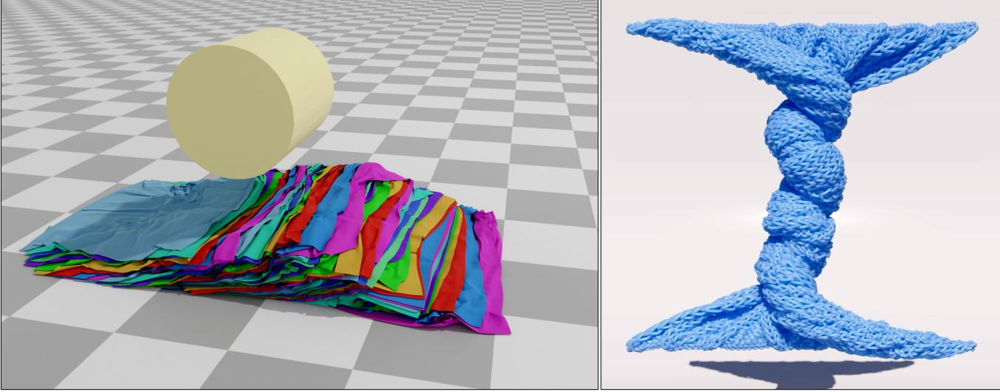

Fig. 1. Example simulation results using our penetration-free contact handling method. Our method is robust in the presence of challenging contact scenarios, and can be easily integrated with existing solvers such as Vertex Block Descent [\[Chen et al. 2024b\]](#page-19-0), as shown here.

We present a novel contact model, termed Offset Geometric Contact (OGC), for guaranteed penetration-free simulation of codimensional objects with minimal computational overhead. Our method is based on constructing a volumetric shape by offsetting each face along its normal direction, ensuring orthogonal contact forces, thus allows large contact radius without artifacts. We compute vertex-specific displacement bounds to guarantee penetration-free simulation, which improves convergence and avoids the need for expensive continuous collision detection. Our method relies solely on massively parallel local operations, avoiding global synchronization and enabling efficient GPU implementation. Experiments demonstrate real-time,

Authors' addresses: [Anka He Chen,](https://orcid.org/0000-0002-5819-3453) ankachan92@gmail.com, University of Utah, NVIDIA, Kirkland, WA, USA; [Jerry Hsu,](https://orcid.org/0000-0003-2333-0224) jerry060599@gmail.com, University of Utah, Salt Lake City, UT, USA; [Ziheng Liu,](https://orcid.org/0009-0008-5031-5074) ziheng.liu@utah.edu, University of Utah, Salt Lake City, UT, USA; [Miles Macklin,](https://orcid.org/0000-0003-3954-8009) mmacklin@nvidia.com, NVIDIA, Auckland, New Zealand; [Yin Yang,](https://orcid.org/0000-0001-7645-5931) yangzzzy@gmail.com, University of Utah, Salt Lake City, UT, USA; [Cem Yuksel,](https://orcid.org/0000-0002-0122-4159) cem@cemyuksel.com, University of Utah, Salt Lake City, UT, USA.

[This work is licensed under a Creative Commons Attribution 4.0 International License.](https://creativecommons.org/licenses/by/4.0/legalcode) © 2025 Copyright held by the owner/author(s). 0730-0301/2025/8-ART <https://doi.org/10.1145/3731205>

large-scale simulations with performance more than two orders of magnitude faster than prior methods while maintaining consistent computational budgets.

CCS Concepts: • Computing methodologies → Physical simulation; Collision detection.

Additional Key Words and Phrases: physics-based simulation, elastic body, rigid body, time integration

#### ACM Reference Format:

Anka He Chen, Jerry Hsu, Ziheng Liu, Miles Macklin, Yin Yang, and Cem Yuksel. 2025. Offset Geometric Contact. ACM Trans. Graph. 44, 4 (August 2025), [21](#page-20-0) pages.<https://doi.org/10.1145/3731205>

## 1 INTRODUCTION

Penetration-free simulation is essential for many graphics applications, especially those involving codimensional models, as penetration can cause significant artifacts or even break the simulation. Moreover, once penetration occurs, it is particularly challenging to resolve, especially in codimensional models. Despite significant advancements in penetration-free simulations, such as Incremental Potential Contact (IPC) [\[Li et al. 2020\]](#page-20-1), a critical problem remains:

#### 2 • Anka He Chen, Jerry Hsu, Ziheng Liu, Miles Macklin, Yin Yang, and Cem Yuksel

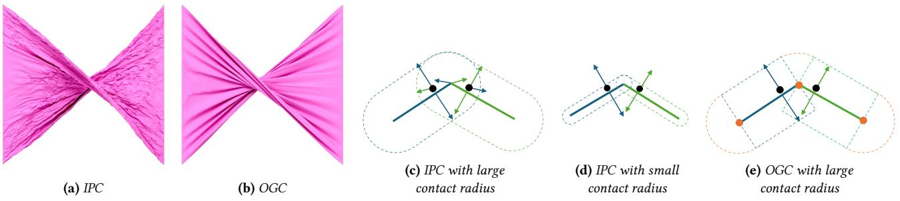

Fig. 2. Illustrating both the artifact produced by the IPC contact model and its underlying cause. We simulate a twisted square cloth with 40K vertices and 79.2K faces, each side measuring 1 meter, rotated by half a circle. The simulation is conducted using both the IPC and OGC models, with a fixed contact radius of 5 mm. (a) and (b) show the final states of the cloth using the IPC and our OGC contact models, respectively. Panels (c) and (d) depict the IPC contact model, which is equivalent to offsetting the face in all directions to form a capsule-like shape. The dashed line marks the boundary of this shape, black dots represent contact points, and the colored arrows indicate the forces exerted from or onto the face with corresponding color. Panel (e) visualizes our proposed contact model, where the dashed lines mark the boundaries of blocks from corresponding faces with the same color.

the computational cost. IPC-based simulators and their derivatives are usually orders of magnitude more expensive than alternative methods that do not provide such a guarantee. Moreover, the computational cost of those methods depends on each time step's state and is highly uneven. These issues prevent penetration-free simulations from being used in many applications, especially those requiring real-time performance.

The problem comes from two main factors: the collision energy is very stiff, making convergence difficult, and expensive procedures such as line search and collision detection must be incorporated into every iteration of the simulation to ensure penetration-free conditions.

The stiffness arises from the necessity of preventing penetration. To ensure the contact force is always strong enough to push objects apart, it must be able to become infinitely large as objects approach each other. This requires the contact force to transition from zero to infinite within the contact radius. This issue becomes particularly severe when the contact radius is very small.

In this work, we identify a geometric limitation of IPC: the resultant normal contact force may not always be orthogonal to the surface (see [Figure 2c\)](#page-1-0), potentially leading to artifacts (see [Figure 2a\)](#page-1-0). To address this, IPC employs a scheme that adaptively reduces the contact radius during the optimization process until it becomes extremely small. However, this further increases the stiffness of the contact energy.

IPC uses continuous collision detection (CCD) based technique to prevent collision. This technique applies a CCD on the optimization step provided by the simulation solver, and culls it before the earliest intersection happens. For GPU implementation, this procedure is a global operation that requires synchronization and hinders parallelism. CCD is applied at every iteration, which is very expensive. Moreover, the CCD-based intersection filter halts the global optimization step where the earliest intersection happens, meaning a local intersection stops the progress of all other points, even if those points are still far from intersecting. This could reduce the solver's efficiency, since each iteration can be computationally expensive, and the shortened optimization step induced by CCD results in more iterations.

We propose a novel method, termed Offset Geometric Contact (OGC), to ensure guaranteed penetration-free simulation for codimensional objects, achieving this with only a minimal and nearconstant overhead added to simulators that do not offer such a guarantee. Our method includes the following:

- (1) A novel contact formulation based on offsetting the surface as a whole instead of offsetting each primitive separately. This guarantees that the contact force will always be orthogonal to the face it applies on and never cause a stretching artifact. This allows the usage of a relatively larger contact distance, making the contact significantly less stiff.
- (2) A different approach to guarantee penetration-free simulation, which does not require CCD. This is enabled by our contact model, which accommodates a larger contact radius. Specifically, it computes an individual maximum displacement bound for each vertex concurrently with collision detection, which adds a minimal overhead. For a vertex far from contact, its bound will be larger, allowing it to fully utilize the optimization step given by the solver, significantly improving the convergence.

Moreover, both the computation of our contact force and the penetration-prevention technique are local operations, which are massively parallel and do not require global synchronization. When combined with a fully parallel solver such as Vertex Block Descent [\[Chen et al.](#page-19-0) [2024b\]](#page-19-0), our method can be very efficient on GPUs, providing real-time, large-scale, penetration-free simulations such as results shown in [Figure 1.](#page-0-0) Our tests show that our method can be more than two orders of magnitude faster than IPC-based simulation, and can use a near-constant computational budget by using a fixed iteration count.

### 2 BACKGROUND

Contact occurs between two surfaces. For each point on one sur-  
face that contacts another surface, it is subjected to a contact force  
from the opposing surface. This force generally consists of two com-  
ponents: a normal force, which acts perpendicular to the contact  
surface, and a friction force, which acts parallel to the contact sur-  
face and is linearly related to the normal force. The normal force is  
a conservative force, while the friction force is not. Therefore we  
can write normal force as the negative gradient of a normal contact  
energy  $E\_n$ . The formulation of  $E\_n$  differentiates different contact  
models.### 2.1 Basic Contact Model

In physics-based simulation, surfaces are represented by polygonal mesh, denoted by = {V, E, T }, where V, E, T denote the set of vertices (0-face), edges (1-face) and facets (2-face, e.g., triangles, quadrilaterals, etc.), respectively. It is important to note that can consist of multiple connected components, which accommodates the presence of multiple models. Therefore, without loss of generality, in the following discussion, we assume the presence of a single mesh . We denote ∈ R ×3 as the stacked positions of all the vertices, where = |V |. The position of vertex is represented as x .

We define the normal contact energy as a function of the distance between two primitives, namely, between vertex and facets or between two edges. Based on the first law of friction, the contact force can be computed in such order: computing the normal force first, and then calculating the friction force using the friction coefficient. Therefore, the normal contact force plays a key role in the computation of contact force.

We start with the vertex-facet contact pair. Given a mesh , the normal contact energy of is usually defined in the following form:

$$E\_n^{\mathcal{O}^f}(M, r) = \sum\_{a \in \mathcal{F}(\mathfrak{v})} g(\operatorname{dis}(\mathbf{x}\_{\mathfrak{v}}, a), r) \,, \tag{1}$$

where F () is the set of all the faces that are in contact with , (x, ) is the function computing the distance between vertex x position and a face , is contact radius, and is a nonlinear function. We define the closest point from x to as:

$$\mathbf{c}(\mathbf{x}\_{\mathcal{U}}, a) = \underset{\mathbf{x} \in a}{\arg\min} \|\|\mathbf{x} - \mathbf{x}\_{\mathcal{U}}\|\|. \tag{2}$$

Therefore (x, ) = ||x − c(x, )||. Since is just a scalar function, it does not change the direction of the force. Therefore, the contact force between and x, is always parallel to x − c(x, ).

The different choices of  $g$  and  $\mathcal{F}(v)$  result in different collision energies. We start with discussing the choice of  $\mathcal{F}(v)$ , termed *contact face set*.

### 2.2 Contact Face Set

One common choice of F is:

$$\mathcal{F}\_{\text{IPC}}(v) = \{ t \in \mathcal{T} | \text{dis}(\mathbf{x}\_{\mathcal{o}}, t) < r, v \not\subset t \}\ . \tag{3}$$

Namely,  $\mathcal{F}\_{IPC}(v)$  takes all the facets who do not include  $v$  and whose distance to  $v$  is less than the contact radius  $r$ . This contact face set is employed by the well-known Incremental Potential Contact [Li et al. 2020]. Intuitively, this formulation is like inflating the facets in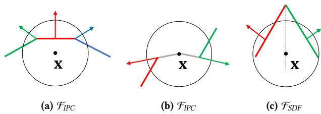

Fig. 3. 2D illustration of different contact face sets and the normal  
contact force derived from them.  $\mathbf{x}$  is the position of the vertex of  
the vertex-facet (v-f) contact pair, and the black circle visualizes the  
contact radius of point  $\mathbf{x}$ . The colored line segments represent facets,  
and the colored arrows represent the normal contact force applied to  
the facets of the same color. (a, b) visualize  $\mathcal{F}\_{IPC}$ . (c) visualizes  $\mathcal{F}\_{SDF}$ ,  
where the dashed black line represents the bisector of those two facets.

all directions, forming volumetric shapes as illustrated in [Figure 2c.](#page-1-0) all directions, forming volumetric shapes as illustrated in Figure 2c.

A facet contact with if is located inside the inflated facets.A facet contact with  $v$  if  $v$  is located inside the inflated facets.

There are two major problems with this energy formulation. The  
first one is illustrated in Figure 2c and Figure 3a: the "normal" contact  
force applied on the green and blue facets is not perpendicular  
to them, causing a stretching force component on the tangential  
plane. Another problem is that it pushes x's topological neighbors  
away, as illustrated in Figure 3b. While it is possible to ignore the  
contact between  $v$  and its neighboring facets, the problem still exists  
between a vertex and its 2-ring neighbors. Unfortunately, we cannot  
filter out these contacts as this can cause penetration. As illustrated  
in Figure 2a, when a large contact radius is used, those problems  
can cause serious artifact including stretching and oscillating.

IPC mitigates those problems by dynamically adjusting the con-  
tact radius to a very small value (Figure 2d), to the extent where  
it is nearly impossible for a vertex to be in contact with multiple  
adjacent facets. However, choosing a small contact radius leads to  
other problems including numerical issues such as the stiffness of  
the contact energy. Additionally, IPC's CCD-aware line search to  
avoid penetration limits the optimization step size when  $\nu$  is close  
to the contacting surface, as smaller distances trigger earlier pene-  
tration. Moreover, since the contact radius is so small, the surface  
region that stops  $\nu$  may not be in contact with  $\nu$  when computing  
the optimization direction. Therefore, the optimization direction  
may not be a direction that separates those colliding pairs, which  
further restricts its movement per iteration. These factors contribute  
to IPC's high iteration count for convergence.An alternative selection for  $\mathcal{F}(x)$  is to select only the closest
facet:
$$\mathcal{F}\_{\text{SDF}}(\boldsymbol{\upsilon}) = \{ t | t = \operatorname\*{arg\,min}\_{t \in \mathcal{T}} dis(\mathbf{x}\_{\boldsymbol{\upsilon}}, t) \text{ and } dis(\mathbf{x}\_{\boldsymbol{\upsilon}}, t) < r \} \tag{4}$$

This contact face set is the basis of many signed distance field (SDF)  
based collision energy. The main advantage of this approach is  
that it guarantees the normal force is always perpendicular to the  
contacting point on  $M$ , a natural property of the closest point on a  
smooth manifold as established by the Hilbert Projection Theorem.

However, it has some serious problems due to its limiting the number of a vertex's contacting facets to only one. This restriction

could impede the convergence of the problem because it fails to generate a sufficient number of collision pairs to push away vertexfacet pairs that are close enough. Instead, it results in the vertex constantly switching with a few facets. This is illustrated in [Figure 3c,](#page-2-0) where the point x alternates between contacting the red facet and the green facet, oscillating along their bisector. To make matters worse, this formulation can not resolve self-intersection. Since is part of , the SDF at x is 0, and this information will not help resolve 's contact with . That is why this contact face set is usually used to handle contact of static objects.

### 2.3 Related Works

Penetration-free simulation is a recent breakthrough in the physicsbased simulation community. The simulation of deformable bodies is usually done by minimizing the implicit integration equation, with the collisions modeled as potential energies, or additionally, as constraints to the minimization problem. To strictly guarantee penetration-free, the collision must be formulated as non-compliable constraints. In the physics-based simulation community, those noncompliable constraints are usually enforced through two groups of methods: the line search based methods and the trust region methods.

2.3.1 Line Search Based Methods. The incremental potential contact (IPC) method [\[Li et al. 2020\]](#page-20-1) models collision energy using a logarithmic function that approaches infinity as primitives come closer, ensuring that contact forces overcome other forces to prevent penetration. To enforce the penetration-free condition, IPC requires optimization to halt before the earliest time of impact (TOI), determined via CCD-aware line search. The process involves iteratively recomputing contact relationships, descent directions, and CCD checks until convergence. [Li et al.](#page-20-2) [\[2021\]](#page-20-2) later extended this IPC collision model to codimensional objects, e.g., elastic rods and surfaces. This includes several novel improvements: modeling thickness, a generalized CCD that adapts to this thickness modeling, and another barrier function to limit the stretching.

CCD-aware line search requires linear motion at each optimization iteration, which is not satisfied for systems with rotational components like rigid body dynamics. [Ferguson et al.](#page-19-1) [\[2021\]](#page-19-1) addressed this by dividing rotational motion into small linear segments for CCD, but this incurs more computation steps. [Lan et al.](#page-20-3) [\[2022a\]](#page-20-3) improved this by using affine transformations instead of SE(3) movements, turning rotational motion into linear affine motion. This approach eliminates the need for multiple segments, requiring only one CCD application per step, greatly enhancing simulation efficiency.

Various methods have been employed to enhance IPC simulation efficiency [\[Guo et al.](#page-20-4) [2024;](#page-20-4) [Lan et al.](#page-20-5) [2024;](#page-20-5) [Shen et al.](#page-20-6) [2024;](#page-20-6) [Wu et al.](#page-20-7) [2022\]](#page-20-7). [Lan et al.](#page-20-8) [\[2022b\]](#page-20-8) replaced IPC's Newtonian solver with projective dynamics, enabling penetration-free GPU simulations by reformulating IPC's barrier constraint with projected target positions. [Lan et al.](#page-20-9) [\[2023\]](#page-20-9) introduced a block coordinate descent technique with element-based Gauss-Seidel iteration and local CCD to reduce computational costs. [Huang et al.](#page-20-10) [\[2024b\]](#page-20-10) developed a GPU-accelerated Gauss-Newton method to accelerate simulations

using barrier contact energy. [Lan et al.](#page-20-11) [\[2021\]](#page-20-11) simplified original geometry with standard shapes to reduce collision pairs and speed up simulations, sacrificing fine geometric details. [Ando](#page-19-2) [\[2024\]](#page-19-2) replaces the logarithmic barrier with a cubic one to reduce the stiffness of the contact energy.

2.3.2 Trust Region Based Methods. In numerical optimization, a trust region defines a subset of the domain where the objective function is approximated, typically using a quadratic model [\[No](#page-20-12)[cedal and Wright 1999\]](#page-20-12). The region adapts dynamically: expanding if the model proves accurate and contracting if it does not, enabling efficient optimization. Trust-region methods can be considered somewhat complementary to line-search methods: trust-region approaches initially determine a step size (the dimensions of the trust region) and subsequently select a step direction. In contrast, line-search methods start by choosing a step direction and then decide on the step size.

It is known that trust-region based methods are better suited for constrained optimization problems where constraint satisfaction is critical [\[Pavlakos et al.](#page-20-13) [2019;](#page-20-13) [Yuan 2015\]](#page-20-14). Constraints can be incorporated directly into the trust region formulation [\[Burke 1992;](#page-19-3) [Moré 1983\]](#page-20-15), which are usually linear and convex [\[Conn et al.](#page-19-4) [1988\]](#page-19-4), [\[Burke et al. 1990\]](#page-19-5).

However, trust region methods for enforcing penetration-free constraints have not been extensively explored in the simulation community. Unlike IPC, which combines CCD with line search to enforce penetration constraints, trust-region methods use discrete collision detection (DCD) to define per-vertex (or per-rigid-body) trust regions, constraining movements to prevent penetration.

This kind of idea was initially explored in the context of rigid body dynamics, termed Conservative Advancement. [Zhang et al.](#page-20-16) [\[2006\]](#page-20-16) uses the extremal vertex query to find a directed motion bound for an object moving with constant translational and rotational velocities. [Tang et al.](#page-20-17) [\[2009\]](#page-20-17) extends this kind of method to triangulated models and makes no assumption about the underlying geometry and topology. [Chen et al.](#page-19-6) [\[2024a\]](#page-19-6) applied a trust-region based scheme to filter eigenvalues in the system Hessian for Newton's method.

This idea has also been investigated in the context of cloth simulation. [Wu et al.](#page-20-18) [\[2020\]](#page-20-18) identified a necessary vertex displacement constraint to prevent cloth from self-intersecting, thus ensuring the avoidance of self-penetration at all times. [Wang et al.](#page-20-19) [\[2023\]](#page-20-19) utilized this constraint within a step-and-project process to facilitate fast and realistic simulation.

However, the development of a trust region-based simulation system that incorporates barrier collision energy and ensures numerical convergence remains an open area of research.

2.3.3 Offset Geometry. Offset geometries, also known as polygon offsets or Minkowski dilation, are geometric constructions where a polygon is expanded or contracted by a specified distance. The geometry 's offset geometry with distance is defined as:

$$M^{+r} = \{ \mathbf{x} \in \mathbb{R}^N | \operatorname{dis}(\mathbf{x}, M) < r \}\tag{5}$$

The boundary of this offset geometry can be computed through various methods, including winding number based methods [\[Chen](#page-19-7) [and McMains 2005\]](#page-19-7), Voronoi Diagram-Based Methods [\[Bo 2010\]](#page-19-8),

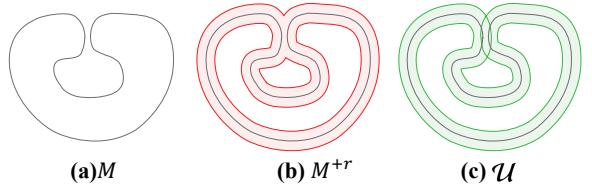

Fig. 4. (a) original geometry ; (b) conventional offset geometry + ; (c) our intersection-aware manifold U.

straight skeleton based methods [\[Aichholzer et al.](#page-19-9) [1996;](#page-19-9) [Huber 2018\]](#page-20-20), polygonal annulus based methods [\[Barequet and Goryachev 2014\]](#page-19-10).

However, those methods mainly focus on 2D polygons instead of 3D polyhedral meshes. Moreover, The conventional concept of offset geometry presents significant challenges when applied to contact modeling. Specifically, traditional offset methods often fail to accurately represent self-intersections and overlapping regions within the geometry, as illustrated in [Figure 4b](#page-4-0). The offset geometry given by [Equation 5](#page-3-0) will "merge" parts that are separated in the original manifold. This occurs when a point's distance to two separate parts of is both less than . This limitation can lead to inaccuracies in simulating contact interactions, as the model may not correctly account for multiple layers of contact and self contacts.

Ideally, the offset geometry should be aware that there are 2 overlapping layers, as illustrated in [Figure 4c](#page-4-0), and the point in the overlapping area should be subject to contact forces from the opposite side. The dimensionality of the offset geometry in [Figure 4c](#page-4-0) has been lifted to (the dimensionality of the immersion space), and therefore is not codimensional anymore. Intuitively, we can determine the layers of intersection, and compute the penetration depth using a method akin to [\[Chen et al.](#page-19-11) [2023\]](#page-19-11) to compute contact energy.

2.3.4 Gauss Map. [Banchoff](#page-19-12) [\[1967,](#page-19-12) [1970\]](#page-19-13) extended the Gauss-Bonnet theorem to polyhedral surfaces by introducing a method to compute curvature at vertices using the Gauss map. [Brehm and](#page-19-14) [Kühnel](#page-19-14) [\[1982\]](#page-19-14) further expressed curvature measures in terms of the number of critical points. [Horn](#page-20-21) [\[1984\]](#page-20-21) introduced the concept of Extended Gaussian Images (EGI) for object recognition by projecting the normal vectors of a polyhedron's faces onto a sphere, assigning densities proportional to the corresponding face areas. [Little](#page-20-22) [\[1985\]](#page-20-22) proposed a variation of EGI where normal vector lengths are proportional to face areas, investigating its uniqueness for convex polyhedra and its application in reconstructing objects using the Minkowski theorem. This approach requires defining face orientations, known as combinatorial types, and an iterative process for 3D reconstruction. [Cohen et al.](#page-19-15) [\[1998\]](#page-19-15) estimated curvature for polygonal surfaces using normal cycles at vertices, edges, and triangles, providing error bounds for discrete surfaces derived from restricted Delaunay triangulation. Building on these, [Echeverria](#page-19-16) [\[2007\]](#page-19-16) propose a novel approach to curvature measurement that distinguishes positive and negative components, enabling accurate vertex characterization. Their Polyhedral Gauss Map directly correlates normal vectors from the polygonal mesh, reflecting vertex geometry and their local neighborhoods more precisely.

## 3 OFFSET GEOMETRIC CONTACT

We propose a new normal contact force model that has the following properties:

- Orthogonality: our normal contact force is always orthogonal to the contact surface. It will not create a stretching artifact even with a large contact radius.
- Large Contact Radius: The contact radius can be arbitrarily large and still not cause artifacts.
- Multiple Contacts within Contact Radius: multiple primitives within the contact radius can affect x, which allows a repulsive force to be generated for an arbitrary number of close-by primitive pairs.
- Self-Intersection Aware: this contact force can identify arbitrary layers of self-intersection, and effectively resolve them.

Our normal contact force is derived from an offset geometry of the original mesh, hence the name Offset Geometric Contact (OGC). We construct the building blocks of this offset geometry by offsetting a face along all its normal directions, which is given by its Polyhedral Gauss Map [\(Section 3.1\)](#page-4-1). We further provide constructive definitions of those building blocks to determine whether a point is inside [\(Section 3.2,](#page-6-0) [3.5\)](#page-7-0), and define our own contact face set [\(Section 3.3\)](#page-6-1). Subsequently, we derive the penetration in the offset geometry [\(Section 3.4\)](#page-7-1) and introduce a new activation function to formulate our normal contact energy [\(Section 3.6\)](#page-7-2). At last we propose our approach to guarantee penetration-free simulation [\(Section 3.7\)](#page-8-0), and compare it to IPC's method [\(Section 3.8\)](#page-8-1).

### 3.1 Polyhedral Gauss Map

We build the offset geometry using a way akin to tetmesh: offset each face individually and use them as the building blocks of the offset geometry. From the previous discussion, it is evident that the normal contact force is always parallel to x−c(x, ), see [Equation 1.](#page-2-1) Since our goal is to achieve an orthogonal normal contact force, intuitively, for any face we can design its building block such that it contacts only points that generate contact forces parallel to the normal at the contact point. In other words, it should only contact points x ∈ R that satisfies x − c(x, ) being parallel to the normal of c(x, ).

On a smooth surface, enforcing such a condition is relatively straightforward because each point on the surface has a unique normal. However, on a polyhedral surface, normals are not so trivially defined, introducing additional complexity. These considerations naturally lead to the concept of the Polyhedral Gauss Map (PGM).

Polyhedral Gauss Map is an analogy of a Gauss Map on a polyhedral surface, mapping a point on a polyhedral surface to their associated normals. The key difference is that a point on a polyhedral surface can have multiple normals, as opposed to those on smooth surfaces that only have one. The points that have more than one normal lies on faces with dimensionality less than 2, such as the vertices and edges of a 3D polyhedral mesh.

[Echeverria](#page-19-16) [\[2007\]](#page-19-16) proposed a form of Polyhedral Gauss Map for vertices on a polyhedral mesh. Since all the normals are unit vectors, we can draw them on a unit sphere. As illustrated in [Figure 5,](#page-5-0) [Echeverria](#page-19-16) [\[2007\]](#page-19-16) classifies vertices into three types: convex, mixed,

#### 6 • Anka He Chen, Jerry Hsu, Ziheng Liu, Miles Macklin, Yin Yang, and Cem Yuksel

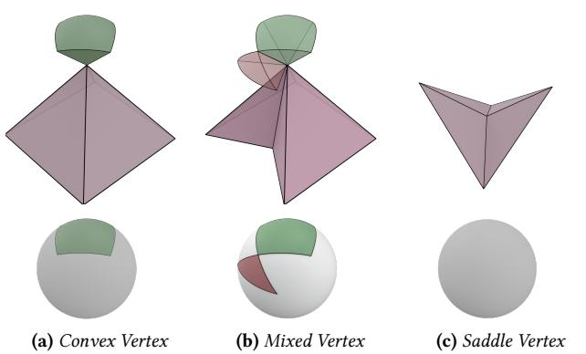

Fig. 5. Gauss map of different types of vertices (top row) and their spherical indicatrix (bottom row). The area with the pink color represents the local geometry of the triangular mesh, and the solid green area represents the normals where the point maps to.

and saddle, based on the geometry of their neighborhood which are visualized using the pink surface. Following the terminology of [\[Echeverria 2007\]](#page-19-16), the neighbor area is called ().

As the name indicates, a convex vertex is one whose neighborhood is convex. The Gauss Map of a convex vertex is relatively straightforward, as shown in [Figure 5a](#page-5-0) as the green volume. Intuitively, this volume corresponds to the set of points that are closer to than any other points in ().

A mixed vertex is one that remains a vertex of the convex hull of (). As shown in [Figure 5b,](#page-5-0) the Gauss Map of a mixed vertex consists of two distinct types of regions. one corresponds to the positive curvature, as visualized by the green volume, which corresponds to its Gauss map as a vertex of the convex hull of(). The red volume corresponds to regions of negative curvature, with each negative segment associated with a non-convex neighboring edge.

The final type is the saddle vertex, which lies within the interior of the convex hull of *star(v)*. The Gauss Map of a saddle vertex is an empty set because such vertices exhibit no angular deficit.[Echeverria](#page-19-16) [\[2007\]](#page-19-16) provided an intuitive explanation of their proposed Gauss Map: plot all the normals of the neighboring facets of a vertex onto the unit sphere, resulting in a set of points. Connect these points in the counter-clockwise order of the neighboring facets, following great circles, to form a polygon on the unit sphere. In this representation:

- A neighboring facet corresponds to a vertex of the polygon.
- A neighboring edge corresponds to an arc-edge of the polygon, which is perpendicular to the neighboring edge.
- The vertex itself corresponds to the polygon as a whole.

For a mixed vertex, due to its concavity, the polygon may contain inverted areas. These inverted areas represent regions of negative curvature.

The motivation for [Echeverria](#page-19-16) [\[2007\]](#page-19-16) to define the Polyhedral Gauss Map is to extend Gauss–Bonnet theorem to a polyhedral surface. That is why they only proposed the Gauss map of vertices

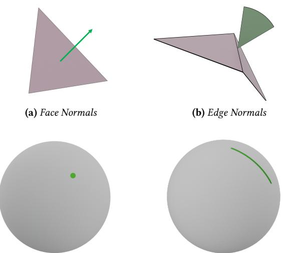

(c) Face Normal Spherical Indicatrix (d) Edge Normals Spherical Indicatrix

Fig. 6. Illustration of Gauss Maps of a facet (triangle) and an edge. In the top row, the area with the pink color represents the local geometry of the triangular mesh, and the solid green area represents the normals to which the point maps. In the bottom row, we show the spherical indicatrix, i.e. visualize the corresponding point's normal on a unit sphere.

because only vertices are integrated. However, in our case, we also
need to define the Polyhedral Gauss Map of edges and facets. Since
all points in the interior of a face share the same normal, we can
instead define the Gauss Map at the level of faces. We denote the
Gauss Map of a face  $a$  as  $N\_a$ .The Gauss Map for points on facets and edges is relatively straightforward. As shown in [Figure 6c,](#page-5-1) all points on the interior of a facet map to a single point on the unit sphere, corresponding to the normal of that face, see [Figure 6a.](#page-5-1) Conversely, a point on the interior of an edge corresponds to multiple normals, maps to an arc on the unit sphere see [Figure 6b](#page-5-1) and [Figure 6d.](#page-5-1) This is because that the mesh is flats on all the triangles, and it "turns" on edges, and the normals of each edge correspond to how much angle the surface turns.

For vertex Gauss maps, we adopt a slightly modified definition tailored to our use case in contact detection. Unlike Echeverria [2007], which defines the Gauss Map from a curvature point of view, we follow a discrete interpretation of the Hilbert Projection Theorem. Specifically, if  $n$  is the normal at point  $y$  on  $M$ , then for any point  $x$  satisfies  $x = wn + y, w > 0$ ,  $y$  must be closer to  $x$  than its local neighborhood. This perspective alters the Gauss Map of mixed vertices to only include the region corresponding to positive curvature, i.e., the green area in Figure 5b. This adjustment not only simplifies the computation but also ensures that when a vertex contacts a point, it is the locally closest point to that point.We also make some specific treatments to a facet's (e.g., triangles) Gauss Map, we define:

$$\mathcal{N}\_{\ell} = \{\mathbf{n}\_{\ell}, -\mathbf{n}\_{\ell}\},\tag{6}$$

where  $n\_t$  is the normal of  $t$ . In other words, we offset a facet to both
of its sides.### 3.2 Constructive Definition of Blocks

Now we have clarified the definition of normals on a discrete surface.
We can offset points on  $M$  along their normal directions to construct
building blocks of the offset geometry.For a face  $a \\in M$ , we offset its *interior* points to construct the fundamental building blocks of the offset geometry:
$$U\_a = \{ \mathbf{x} \in \mathbb{R}^N | \mathbf{x} = \mathbf{y} + \omega r \mathbf{n}\_a, \text{where } \mathbf{y} \in a^\diamond, \mathbf{n}\_a \in \mathcal{N}\_a, \mathbf{w} \in \{0, 1\} \}\tag{7}$$

where  $r > 0$  is the offset radius, and  $a^\circ$  denotes the interior of face  $a$ . For convenience we let  $v^\circ = v$ . We only offset the interior of a face because the boundary points are actually points on a lower dimensional face.

We refer to  $U\_a$  as the *block* derived from face  $a$ , it serves as a fundamental building block of the offset manifold. The definition provided in Equation 7 reflects the essence of these blocks but is computationally challenging to implement. Fortunately, the earlier specialized treatment of mixed vertices enables this constructive formulation of blocks.

A vertex block of a vertex  $v \in V$  is the region enclosed by all  
planes passing through  $v$  and perpendicular to its convex neighbor-  
ing edges (i.e., the edges that remain as edges in the convex hull  
of *star(v)*). As illustrated in Figure 7d, its shape resembles a ball  
with radius  $r$ , cut by multiple planes that are perpendicular to its  
neighboring edges. The constructive definition of  $U\_v$  is as follows:
$$U\_{\upsilon} = \{ \mathbf{x} \in \mathbb{R}^{N} \mid ||\mathbf{x} - \mathbf{x}\_{\upsilon}|| \le r, (\mathbf{x} - \mathbf{x}\_{\upsilon})(\mathbf{x}\_{\upsilon} - \mathbf{x}\_{\upsilon}') \ge 0 \text{ for } \upsilon' \in \mathcal{V}\_{\upsilon} \},\tag{8}$$

where  $x\_v$  denote the position of vertex  $v$ , and  $V\_v$  is the set of all
vertices adjacent to  $v$ . Note that we do not differentiate non-convex
neighboring edges. This is because the planes associated with non-
convex neighboring edges only intersect with  $U\_v$  at  $v$  and, therefore,
do not influence the shape of  $U\_v$  in the definition given by Equa-
tion 8.An edge block of an edge  $e \in \mathcal{E}$  is illustrated in Figure 7b. It is a cylinder with a radius of  $r$  being cut by 4 planes: 2 being perpendicular to the edge and 2 being perpendicular to each of the edge's two neighboring faces. The constructive definition of  $U\_e$  is as follows:
$$\begin{split} U\_{\mathbf{e}} &= \{ \mathbf{x} \in \mathbb{R}^{N} \mid \\ &dis(\mathbf{x}, e) \le r, \\ &(\mathbf{x} - \mathbf{x}\_{\mathcal{D}\_{\mathbf{e},1}})(\mathbf{x}\_{\mathcal{D}\_{\mathbf{e},2}} - \mathbf{x}\_{\mathcal{D}\_{\mathbf{e},1}}) &> 0, \\ &(\mathbf{x} - \mathbf{x}\_{\mathcal{D}\_{\mathbf{e},2}})(\mathbf{x}\_{\mathcal{D}\_{\mathbf{e},1}} - \mathbf{x}\_{\mathcal{D}\_{\mathbf{e},2}}) &> 0, \\ &(\mathbf{x} - \mathbf{p}(\mathbf{x}(v\_{\mathcal{e},1}), \mathbf{x}(v\_{\mathcal{e},2}), \mathbf{x}\_{\mathcal{D}\_{\mathbf{e},\text{next}}}) \cdot \\ &(\mathbf{p}(\mathbf{x}\_{\mathcal{D}\_{\mathbf{e},1}}, \mathbf{x}\_{\mathcal{D}\_{\mathbf{e},2}}, \mathbf{x}\_{\mathcal{D}\_{\mathbf{e},\text{next}}}) - \mathbf{x}\_{\mathcal{D}\_{\mathbf{e},\text{next}}}) &\ge 0 \\ &\text{for } v\_{\mathcal{e},\text{next}} \in \mathcal{W}\_{\mathbf{e}} \} \end{split} \tag{9}$$

where  $v\_{e,1}$  and  $v\_{e,2}$  are the two vertices of  $e$ ,  $p(x\_1, x\_2, x\_3)$  computes the perpendicular foot for  $x\_3$  on the line defined by  $x\_1, x\_2$ , and  $V\_e$  is the set of the vertices that share a facet with . It is worth noting that since  $M$  is a manifold,  $V\_e$  can contain at most two vertices, each belonging to one of  $e$ 's neighboring faces. Additionally, when  $e$  is a boundary edge,  $V\_e$  contains only one vertex, resulting in

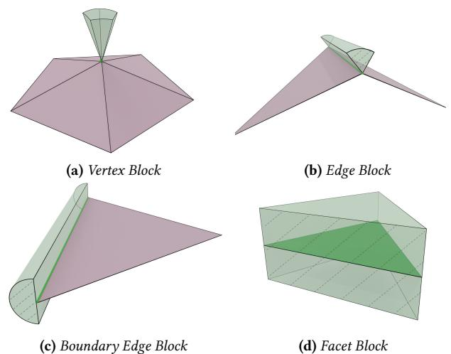

Fig. 7. Illustration of blocks corresponding to different types of faces. The regions shaded in light green represent the blocks, while the areas in solid green indicate the faces associated with these blocks. Boundaries marked with dashed lines are open, whereas those with solid colors are closed.

a half-cylinder-like block for the boundary edge, as illustrated in [Figure 7c.](#page-6-3)

The block of a face  $t \in T$  is straightforward: it is formed by off-  
setting the face along its normal direction by a distance  $r$ , forming a  
prism (see Figure 7a). The constructive definition of  $U\_t$  is as follows:
$$\begin{aligned} U\_{\mathbf{f}} &= \{ \mathbf{x} \in \mathbb{R}^{N} \mid \\ &d\boldsymbol{\bar{s}}(\mathbf{x}, t) \le r, \\ &(\mathbf{p}(\mathbf{x}\_{1}, \mathbf{x}\_{2}, \mathbf{x}\_{3}) - \mathbf{x})(\mathbf{p}(\mathbf{x}\_{1}, \mathbf{x}\_{2}, \mathbf{x}\_{3}) - \mathbf{x}\_{3}) > 0, \\ &(\mathbf{p}(\mathbf{x}\_{2}, \mathbf{x}\_{3}, \mathbf{x}\_{1}) - \mathbf{x})(\mathbf{p}(\mathbf{x}\_{2}, \mathbf{x}\_{3}, \mathbf{x}\_{1}) - \mathbf{x}\_{1}) > 0, \\ &(\mathbf{p}(\mathbf{x}\_{1}, \mathbf{x}\_{3}, \mathbf{x}\_{2}) - \mathbf{x})(\mathbf{p}(\mathbf{x}\_{1}, \mathbf{x}\_{3}, \mathbf{x}\_{2}) - \mathbf{x}\_{2}) > 0 \\ &\text{where } \mathbf{x}\_{1}, \mathbf{x}\_{2}, \mathbf{x}\_{3} \text{ are the three vertices of } t \} \end{aligned} \tag{10}$$

Another advantage of this constructive definition is that it naturally gives the definition of boundary edges and vertices, whose normals are not defined by [Echeverria](#page-19-16) [\[2007\]](#page-19-16).

## 3.3 Contact Face Set

$$\mathcal{U} = \{ U\_a \mid a \in \mathbf{V} \cup \mathcal{E} \cup \mathcal{T} \}\tag{11}$$

We call  $U$  the Intersection Aware Offset Geometry of  $M$ . The Intersection Aware Offset Geometry serves as an analogy to volumetric meshes. The elements in  $U$  act as a building block of the geometry, as tetrahedron to tetmesh. A point can intersect with multiple  $U\_a \in U$ , this is how we know it has multi-layers of intersection with  $U$ .Based on *U*, we can define a new type of Contact Face Set as:

$$\mathcal{F}\_{\rm OGC}(\upsilon) = \{ a \mid \mathbf{x}\_{\upsilon} \in U\_{a}, \upsilon \not\subset a \}. \tag{12}$$

We refer to  $|\mathcal{F}\_{OGC}(x\_v)|$  as the number of layers of intersections for
 $v$ .For a point  $\mathbf{x} \in \mathbb{R}^N$  and a face  $a$ , if  $\mathbf{x} \in U\_a$ , there must exist  $\mathbf{y} \in a^\circ$  such that  $\mathbf{x} = \mathbf{y} + w \mathbf{r} \mathbf{n}$ , where  $\mathbf{n} \in \mathcal{N}\_a$ ,  $w \in [0, 1]$ . Since  $a$  is 8 • Anka He Chen, Jerry Hsu, Ziheng Liu, Miles Macklin, Yin Yang, and Cem Yuksel

a linear element,  $y = c(x, a)$  must hold, which means  $x - c(x, a) =$   
wrn. Therefore, our selection of Contact Face Set  $\mathcal{F}\_{OGC}$  guarantees  
that each point will only contact faces that generate orthogonal  
normal contact force. In fact, our contact model has the following  
advantages:- • **Orthogonality:** for each point  $x \in U\_a$ ,  $(x - c(x, a)) \perp a$  in a discrete sense.
- Local Exclusiveness: if  $a \subset b$ ,  $U\_a \cap U\_b = \emptyset$ .
- Covering  $M^{+r}$ :  $\bigcup\_{U\_a \in \mathcal{U}} U\_a = M^{+r}$ , i.e.,  $\mathcal{U}$  is a cover of  $M^{+r}$ . • Local Closest-ness: if  $x \in U\_a$ , for  $b$  satisfies  $a \subset b$  or  $b \subset a$ , we have  $dis(x, a) < dis(x, b)$ .

The covering property ensures the geometry we defined reflects
the offset geometry  $M^{+r}$ . However, it added more information to
 $M^{+r}$ . The local exclusiveness ensures that each block  $U\_a$  can be a
unique indicator of layers of intersections of the offset geometry,
such as the overlapped part shown in Figure 4c.It is worth noting that the block of a saddle vertex is an empty
set, i.e., it will not contact with any other point. This is acceptable
because if a point's distance to such a vertex is less than  $r$ , there
must be at least one neighbor face or edge that is contacting with
such a point.

### 3.4 Penetration Depth

Akin to Chen et al. [\[2023\]](#page-7-0), each layer of intersection requires a separate contact force to resolve. Naturally, we want to push the intersecting point along the normal direction to the boundary.

From the definition of blocks provided in Equation 7, we can see that if  $x \in U\_a$ , the distance to the surface of  $U\_a$  along the normal direction is:
$$d\_{\mathfrak{P}} = r - ||\mathbf{x} - \mathbf{c}(\mathbf{x}, a)|| = r - dis(\mathbf{x}, a), \tag{13}$$

we refer to  $d\_p$  as the *penetration depth* of point  $x$  in  $U\_a$ .  $d\_p$  is a  
function of the vertex position  $p$  and  $c(p, a)$ . Therefore, the normal  
contact potential derived from  $d\_p$  still accords with the formulation  
Equation 1.### 3.5 Offset Geometry for Edge-edge Contact

We have defined the offset manifold for vertex-facet contact. Now  
we can define a new geometry by offsetting all the edges to support  
edge-edge contact. We extract all the vertices and edges of  $M$  to  
construct a new geometry  $M^e$ , which we refer to as the edge-only  
manifold.  $M^e$  will be a 1-dimensional manifold which only contains  
 $M$ 's wireframes.In  $M^e$ , the Gauss map of an edge  $e$  is a circle perpendicular to  $e($ see Figure 8a), and its corresponding block forms a cylinder with  
 $e$  being its axis. The Gauss map of a vertex  $v$  is a sphere cut by 2  
planes perpendicular to  $v$ 's two neighbor edges, as illustrated in  
Figure 8b, with its block being shaped correspondingly (Figure 8d).The constructive definition of the edge block of  $M^e$  is:

$$\begin{aligned} U\_{\mathbf{e}}^{E} &= \{ \mathbf{x} \in \mathbb{R}^{N} \mid \\ dis(\mathbf{x}, \mathbf{e}) &\le r \\ &\quad \left( \mathbf{x} - \mathbf{x}(\boldsymbol{v}\_{\mathbf{e},1}) \right) \left( \mathbf{x}(\boldsymbol{v}\_{\mathbf{e},2}) - \mathbf{x}(\boldsymbol{v}\_{\mathbf{e},1}) \right) > 0, \\ &\quad \left( \mathbf{x} - \mathbf{x}(\boldsymbol{v}\_{\mathbf{e},2}) \right) \left( \mathbf{x}(\boldsymbol{v}\_{\mathbf{e},1}) - \mathbf{x}(\boldsymbol{v}\_{\mathbf{e},2}) \right) > 0 \} \end{aligned} \tag{14}$$

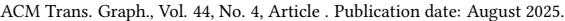

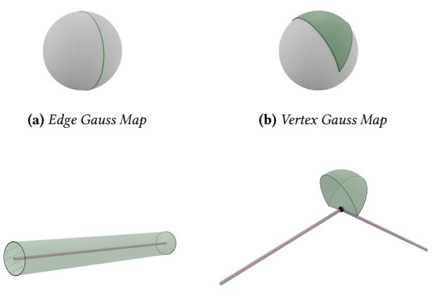

(c) Edge Block (d) Vertex Block

**Fig. 8.** Illustration of Gauss Maps and blocks in the edge-only manifold  $M^e$  of an edge and a vertex, respectively. The black dot represents the vertex in the vertex block diagram, and the dashed lines indicate open boundaries in the edge block diagram.

Similarly, the constructive definition of the vertex block of  $M^e$  is:
$$U\_{\upsilon}^{\varepsilon} = \{ \mathbf{x} \in \mathbb{R}^{N} \mid ||\mathbf{x} - \mathbf{x}\_{\upsilon}|| \le r, (\mathbf{x} - \mathbf{x}\_{\upsilon})(\mathbf{x}\_{\upsilon} - \mathbf{x}\_{\upsilon'}) \ge 0, \forall \upsilon' \in \mathcal{V}\_{\upsilon} \} \tag{15}$$

The difference between edge-edge contact and vertex-facet con-
tact is, that the force is applied on an edge instead of a single vertex.
Similarly, we can define the normal contact potential for the edge-
edge contact:
$$E\_n^{ee}(M) = \sum\_{e, e' \in \mathcal{E}\_{OGC}^C} g(dis(e, e'), r) \tag{16}$$

where  $\mathcal{E}\_{OGC}$  is the set of all the actively contacting edge-edge pairs:  

 $\mathcal{E}\_{OGC} = \{\{e\_1, e\_2\}\}\ |$ 
$$e\_1, e\_2 \in \mathcal{E},$$

$$e\_1 \cap e\_2 = \emptyset,$$

$$\exists a \subset e\_i, \mathbf{c}(e\_i, e\_j) \in U\_a \text{ holds for } i = 1, j = 2 \text{ and } i = 2, j = 1$$

$$(17)$$

where  $c(e\_i, e\_j)$  is  $e\_i$ 's closest point to  $e\_j$ .

The contact force between two edges is applied on two points:  $c(e, e')$  and  $c(e', e)$ . [Li et al.](#page-20-1) [\[2020\]](#page-20-1) provided a way to smoothly filter out the parallel edge contact to avoid instability. Here we apply a similar procedure to our edge-edge contact force.

# 3.6 A  $C^2$  Continuous 2-Stage Activation Function

The quadratic activation function is widely used because of its simplicity and non-stiff nature. However, it has a drawback: the contact normal force does not become infinite as two primitives approach each other. This would result in penetration when the large forces are pushing primitives towards each other.

To make sure the contact force will eventually get strong enough  
to overcome all other forces to successfully separate contacting  
primitives, the barrier activation function [Li et al. 2020] became  
a popular choice. Their barrier function is a logarithmic function,multiplied by a quadratic function to make sure it is  $C^2$  continuous at the point where the contact force disappears.

We propose a novel 2-stage activation function, which possesses the advantage of both of those energies:

$$g(d,r) = \begin{cases} \frac{k\_c}{2}(r-d)^2 & \text{if } \tau \le d \le r\\ -k\_c' \log(d) + b & \text{if } 0 < d < \tau \end{cases} \tag{18}$$

where  $k\_c$  and  $k'\_c$  are 2 stiffness factors of the 2 stages,  $\tau$  is a parameter determining where to stitch between those 2 stages. To make the function  $C^1$  continuous at  $d = \tau$ ,  $k'\_c$  and  $b$  need to satisfy:No corrections needed.

$$b = \frac{k\_c}{2}(r - \tau)^2 + k\_c' \log(\tau) \tag{20}$$

This leaves us only one configurable parameter  $k\_c$ , from which  $k'\_c$ 
and  $b$  can be computed accordingly. We further let  $\tau = \frac{r}{2}$  to make it
 $C^2$  continuous.This is a combination of a pure quadratic function and a pure logarithmic function. With the  $k\_c$  properly set, most of the contacts will be handled in the quadratic stage, benefiting from the faster convergence of the quadratic function. In the second stage, since it is a pure logarithmic function, it is still less stiff than IPC's formulation [Li et al.](#page-20-1) [\[2020\]](#page-20-1).

Combining this activation function with our contact sets  $\mathcal{F}\_{OGC}$ 
and  $\mathcal{E}\_{OGC}$ , we have obtained a normal contact energy that is  $C^2$ 
continuous on most part (see the explanation in the Limitation
Section) of  $\mathcal{U}$ . Additionally, the normal contact force derived from
this normal contact energy is always orthogonal to the primitive it
acts upon.3.6.1 Friction. With the properly designed normal contact force, we can compute the friction force using the friction coefficient to compute the friction force. We use the lagged formulation of friction provided by [Li et al.](#page-20-1) [\[2020\]](#page-20-1), with the modification proposed by [Chen](#page-19-0) [et al.](#page-19-0) [\[2024b\]](#page-19-0) to improve the stability.

### 3.7 Penetration-Free Simulation

We employ the technique provided in [\[Wu et al.](#page-20-18) [2020\]](#page-20-18) to guarantee penetration-free simulation. This technique relies on computing a conservative bound for each vertex :

$$b\_{v} = \gamma\_{p} \min(d\_{\min,v}, d\_{\min,v}^{E}, d\_{\min,v}^{T}),$$

(21)

where  $0 < \gamma\_p < 0.5$  is a relaxation parameter and  $d\_{min,v}$  is  $v$ 's minimal distance to all the facets that do not include  $v$ :
$$d\_{\min,\upsilon} = \min\_{t \in \mathcal{T}, \upsilon \notin t} dist(\mathbf{x}\_{\upsilon}, t), \tag{22}$$

and  $d\_{min, v}^E$  is the minimal value of *v*'s neighbor edges' minimal distances to all other edges:
$$d\_{\min,v}^{E} = \min\_{e \in \mathcal{E}\_{v}} d\_{\min,e}, \tag{23}$$

$$d\_{\min,e} = \min\_{e' \in \mathcal{E}, e \cap e' = \emptyset} dist(e, e'), \tag{24}$$

and  $d^T\_{min,v}$  is the minimal value of  $v$ 's neighbor facets' minimal distances to all other vertices:

$$d\_{\min,\upsilon}^T = \min\_{t \in \overline{\mathcal{T}\_\upsilon}} d\_{\min,t},\tag{25}$$

$$d\_{\min,t} = \min\_{v' \in \mathcal{V}, v' \notin t} dis(v', t), \tag{26}$$

where  $\mathcal{E}\_v$  and  $\mathcal{T}\_v$  represents  $v$ 's neighbor edges and facets respectively.If the model starts in an intersection-free state  $X^{prev}$ , it will re-  

main intersection-free in state if each  $x\_j$  satisfies:
$$||\mathbf{x}\_{\upsilon} - \mathbf{x}\_{\upsilon}^{\mathrm{prev}}|| \le b\_{\upsilon}, \forall \upsilon \in \mathcal{V}. \tag{27}$$

Starting with a penetration-free state Xprev, our method computes
 $b$ v and records xprevv for each  $v$ . Then after some solver iterations,
each vertex will reach a new position xv. Our method checks each
vertex individually to see if it satisfies the condition in Equation 27. If
a vertex does not satisfy the condition, its displacement is truncated
to stay within the conservative bound.  $b$ v. Subsequently, our method
recomputes  $b$ v and records x as the penetration-free starting state,
repeating this process iteratively.Since the conservative bound and  $X$ prev can be updated as needed during the solver's iterations, they do not restricted each vertex's total displacement within a *time step*, only limiting the displacement within each individual iteration. A vertex near an obstacle may be constrained in initial iterations, but the bound-update will be triggered once it reaches the bound. The new bound becomes larger since the repulsive force pushes it away from the obstacle. This procedure will repeat until convergence. As shown in Figure 17, the solver converges under these bounds without introducing additional artifacts.### 3.8 Comparing to IPC

Our method can be viewed as a trust region based method for a
constrained optimization problem, where the constraints are the
penetration-free constraints. The spherical region we compute for
each vertex is the trust region we formulate to enforce the con-
straints. In contrast, IPC [Li et al. 2020] employs a CCD-aware line
search technique to achieve penetration free-state, which requires
truncating the step.The CCD-aware line search technique maintains a penetration-
free state by applying CCD after every iteration of the optimization.
It truncates the optimization step of the physics solver at where the
first collision happens, thereby preventing penetration. However,
this also means a local collision stops the progress of all other points,
even if those points are still far from intersecting. This is illustrated
in Figure 9b, where the whole step is stopped by the vertex in
the middle which is closest to the obstacle. Each iteration can be
computationally expensive, and truncating the global optimization
step entirely often results in only a small fraction of the step being
utilized. This approach overlooks the fact that most parts of the
model could still make significant progress along the optimization
direction, leading to wasted computation and slower convergence.
This issue becomes particularly evident when parts of the model
are in close proximity to one another.

In our formulation,  $b\_v$  is different for each  $v \in V$ , as illustrated in Figure 9c. The value of  $b\_v$  is smaller in regions that are actively in contact and larger in regions that are far from others. As a result, each  $b\_v$  has only a local impact. Even when certain parts of the model are close to each other, such as the vertices in the middle of Figure 9c, the conservative bounds of other regions, like the vertices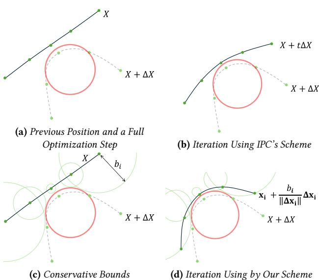

Fig. 9. Comparing different schemes to preserve penetration-free state  
in a single solver iteration. The black line represents the shape  
of M, the dashed gray line represents the destination position after  
taking a full step given by the optimizer in that iteration, the red  
circle represents an obstacle, and the green dots represent vertices of  
M. (a) The penetration-free position  $X^{prev}$  in the previous iteration,  
and a position X + ΔX after taking a full optimization step, which  
presents penetration; (b) the penetration-free optimization step given  
using IPC's CCD-aware line search scheme; (c) illustration of out  
conservative bounds  $b\_i$  which vary at each vertex; (d) the penetration-free optimization step given by our scheme.on the sides, remain unaffected. These unaffected regions can still utilize relatively large step sizes.

Our contact force formulation allows for a significantly larger contact radius compared to IPC. As a result, even primitives that are actively in contact can maintain a relatively large distance. This, in turn, enables our method to take bigger steps per iteration and achieve fast convergence, despite employing conservative bound truncation. In contrast, simply combining our trust-region-based optimization scheme with IPC's contact energy will not work, because a small contact radius as IPC uses will result in a near-zero conservative bound..

Furthermore, as we will explain in the next section, there is no
need to use a separate function to compute  $b\_v$ . Instead, this can
be seamlessly integrated into the contact detection process with
egligible overhead. Additionally, the computation of  $b\_v$  is fully
parallel, and does not require CPU-GPU synchronization when
implemented on GPU. This approach offers a significant advantage
over the CCD-based line search employed by IPC, which requires
multiple computationally expensive continuous collision detections
and synchronizations in a single iteration.# 3.9 Offset Geometry for Mesh with Different Dimensionalities

It is straightforward to apply OGC to the surface of a volumetric object to ensure penetration-free contact simulation. However, when simulating volumetric objects, users can choose either to enforce penetration constraints for robustness or to omit them for efficiency, as volumetric intersections can be resolved after occurrence [\(Chen](#page-19-11) [et al.](#page-19-11) [\[2023\]](#page-19-11)). Therefore, for volumetric mesh simulations, we can skip conservative bound culling to accelerate convergence. Here we propose a faster method specially tailored for the volumetric mesh simulations.

For a volumetric mesh  $M$ , the offset operation should be applied
to its surface  $\partial M$  to obtain an intersection-aware offset geometry
 $\mathcal{U}(\partial M)$ . Note that in this case, we only offset the geometry out-
ward, in the direction of the surface normal. The penetration depth
computed from  $\mathcal{U}(\partial M)$  is compatible with the penetration depth
provided by Chen et al. [\[2023\]](#page-9-1).We use pure quadratic contact energy in volumetric simulation, e.g., only using the first stage of Equation 18. At the beginning of each step, the simulator performs DCD (discrete collision detection) for each vertex to determine whether they have intersected  $M$ . If penetration is detected, the simulator computes the penetration depth  $d\_p$  using the method proposed by Chen et al. [2023]. This penetration depth needs to be adjusted to  $d\_p + r$  to match the penetration depth of the offset geometry. If no intersection is found, the simulator performs another DCD to detect its intersection with  $U(\partial M)$  and computes the penetration depth in  $U(\partial M)$ . This ensures that the penetration depths in  $M$  and  $U(\partial M)$  are consistent, resulting in consistent contact forces from both the inside and outside of the mesh. The contact force is greater than 0 at  $\partial M$  due to the offset layer. With properly adjusted contact stiffness, most contact will still occur outside the mesh, maintaining an intersection-free state for most parts of the mesh. We use this scheme to handle the cloth-body contact in our cloth simulation experiments.For 1D meshes immersed in 3D space, such as those used in hair and yarn-level simulations, they can be treated in the same way as the edge-only manifold proposed in [Section 3.5.](#page-7-0) Specifically, we employ this contact model to generate the yarn simulation results presented in [Figure 15](#page-16-1) and [Figure 16.](#page-16-2)

### 4 ALGORITHM

We have defined the contact force and energy for the vertex-facet contact and the edge-edge contact. Now we propose the algorithms to practically detect those contacts. Since the intersection-aware offset geometry is composed of many blocks, a trivial implementation will be building a BVH (Bounding Volume Hierarchy) of all those blocks, and looping through all the vertices and edges to detect intersections with those blocks.

However, these blocks correspond to different types of faces, including vertices, edges, and facets. Building a BVH that contains all these blocks would result in an excessively large structure. Instead, we present a method that only requires building a BVH for the faces with the highest dimensionality: facets for vertex-facet contact detection and edges for edge-edge contact detection. Note that such a BVH is constructed based on the bounding boxes of original faces, not the offset ones. Additionally, those algorithms are capable of computing  $d\_{min,v}$ ,  $d\_{min,v}^E$ , and  $d\_{min,v}^T$  simultaneously with the contact detection.### 4.1 Vertex Facet Contact

Algorithm 1: vertexFacetContactDetection

Input:  $v$ : a vertex,  $r$ : contact radius,  $r\_q$ : query radius  
Output:  $\mathcal{F}\_{OGC}(v)$ : set of faces that are in contact with  $v$ ;  
 $\mathcal{V}\_{OGC}(t)$ : set of vertices that are in contact with  $t$ ;  
 $d\_{min,v}$ : the minimal distance from  $v$  to another faces;  
 $d\_{min,t}$ : the minimal distance from  $t$  to all other vertices.

| 1  | $d_{min,v} = r_q$                                                                                                             |
|----|-------------------------------------------------------------------------------------------------------------------------------|
|    | // sphere query on the facet BVH with center x(v) and radius $r_q$                                                            |
| 2  | for each $t \in T$ s.t. dis(v, t) $< r_q$ do                                                                                  |
|    | // avoid contact with adjacent facet                                                                                          |
| 3  | if $v \subset t$ then continue                                                                                                |
| 4  | $d = dis(v, t)$                                                                                                               |
| 5  | $d_{min,v} = min(d, d_{min,v})$                                                                                               |
|    | // multiple vertex query threads may access the same $d_{min,f}$ simultaneously, thus this must be an atomic min operation |
| 6  | $d_{min,t} = min(d, d_{min,t})$                                                                                               |
| 7  | if d < r then                                                                                                                 |
| 8  | a = closestFaceFacetToVertex(v, t)                                                                                            |
|    | // avoid duplicated contact with a detected from a neighbor face                                                              |
| 9  | if $a \in F_{OGC}(v)$ then continue                                                                                           |
| 10 | if $a \in V$ then                                                                                                             |
|    | // Equation 8                                                                                                                 |
| 11 | if checkVertexFeasibleRegion(x(v), a) then                                                                                    |
| 12 | $F_{OGC}(v) = F_{OGC}(v) \cup {a}$                                                                                            |
| 13 | $V_{OGC}(t) = V_{OGC}(t) \cup {v}$                                                                                            |
| 14 | else if $a \in E$ then                                                                                                        |
|    | // Equation 9                                                                                                                 |
| 15 | if checkEdgeFeasibleRegion(x(v), a) then                                                                                      |
| 16 | $F_{OGC}(v) = F_{OGC}(v) \cup {a}$                                                                                            |
| 17 | $V_{OGC}(t) = V_{OGC}(t) \cup {v}$                                                                                            |
| 18 | else                                                                                                                          |
|    | // v must be in the feasible region in this case                                                                              |
| 19 | $F_{OGC}(v) = F_{OGC}(v) \cup {t}$                                                                                            |
| 20 | $V_{OGC}(t) = V_{OGC}(t) \cup {v}$                                                                                            |
| 21 | end                                                                                                                           |
| 22 | return $F_{OGC}(x_v), d_{min,v}$                                                                                              |

The algorithm for detecting vertex-facet contact is provided in Algorithm 1. As previously mentioned, we only maintain a BVH for all the facets. To detect vertex-facet contact, we do a point query with center  $x(v)$  and radius  $r\_q$  for each vertex  $v \in V$ .  $r\_q$  is a custom parameter satisfies  $r\_q \ge r$ .For each facet  $f$  within the query radius  $r\_q$ , the algorithm com-putes its closest point to  $v$ , the face  $a$  on the facet where the closest point is located, and the distance  $d = dis(v, t)$  (line 4,5,8). Note that  $a$  can be either a vertex, or an edge, or  $t^{\circ}$ . Then it updates  $v$ 's minimal distance to facets,  $d\_{min,v}$ . We also update  $f$ 's minimal distance tovertices in parallel,  $d\_{min,t}$ , using an atomic min operation. This is to avoid a race condition since multiple vertex query threads can access the same  $d\_{min,t}$  simultaneously.Since all the vertices whose distance to  $t$  is less than  $r\_q$  will visit  

 $t$ , this ensures that we are computing the correct  $d\_{min,t}$ . Both  $d\_{min,v}$   

and  $d\_{min,f}$  are initialized as  $r\_q$ , because the query does not look  

beyond that distance. This means that even if there are no active  

contact pairs detected,  $d\_{min,v}$  and  $d\_{min,f}$  are still upper-bounded by  

 $r\_q$ , because we do not know if there is a facet whose distance to  

 $v$  is marginally larger than  $r\_q$ . That is why we make  $r\_q$  a separate  

parameter. Making  $r\_q$  larger than  $r$  will not detect more contacts, but  

it can potentially improve the conservative bound for each vertex,  

thereby enhancing convergence. In practice, we found an  $r\_q$  of  $r$   

plus the inertial displacement magnitude to strike a good balance  

between query performance and bound size.The next step will be determining whether  $a$  is in contact with  $v$ ,  
i.e., whether  $v 
in U\_a$ . Note that when  $a$  is not a facet, it is shared by  
multiple neighboring facets. In this case, multiple facets can return  
the same closest face  $a$ . To avoid duplicated contacts, we check  
whether  $a$  already exists in the contacting face set  $\mathcal{F}\_{OGC}(\mathbf{x}\_v)$ . If  
 $a \notin \mathcal{F}\_{OGC}(v)$ , we proceed to check  $v \in U\_a$  using  $U\_a$ 's constructive  
definition (Equation 8, Equation 9). Note that if the closest point is  
located in the interior of  $t$ , i.e.,  $a = t, v \in U\_a$  is guaranteed. Therefore,  
no feasible region check is required in this case. For the convenience  
of contact force computation, we also maintain a list  $\mathcal{V}\_{OGC}(t)$  for  
each  $t \in \mathcal{T}$ , which is the set of vertices that are in contact with  $t$ .  
After putting a face into  $\mathcal{F}\_{OGC}(v)$ , we also put  $v$  into  $\mathcal{V}\_{OGC}(t)$  of  
the corresponding facet using atomic operation.According to Equation 13, if  $a \in t$  contacts with  $v$ , it must be the
closest face on  $t$  to  $v$ . The local exclusive property guarantees that
 $v$  can only be in contact with at most one face on  $t$ . If  $v$  contacts
with  $a \in t$ , it will not contact all other faces of  $t$ . Since  $v$  will visit
all the facets whose distance to  $v$  is less than  $r$ , this guarantees that
Algorithm 1 will not miss or duplicate any vertex-facet contact.### 4.2 Edge Edge Contact

Similarly, we give the algorithm that detects edge-edge contact in
Algorithm 2. Similar to Algorithm 1, it works on the BVH of all the
edges, and applies a sphere query centered at  $x\_m$  with radius  $r\_q + \frac{l}{2}$ 
for each edge, where  $x\_m$  and  $l$  are the midpoint and length of that
edge, respectively. Each query also computes the  $d\_{min,e}$ . Since every
edge has its query thread, no automatic operation is needed here.
Note that since each edge detects its own contacts, each edge-edge
contact will be automatically detected exactly twice: one from each
side.### 4.3 Simulation Pipeline

Now that we have provided the contact energy and the algorithms to detect those contacts, the next step would be integrating it into an actual simulation pipeline. Theoretically, the contact force we formulated can be used in a variety of time integrators, including both explicit and implicit ones. Here we provide an algorithm combining Offset Geometric Conact with backward Euler in [Algorithm 3.](#page-11-1)

There are 3 major stages of the simulation pipeline: contact detec-  
tion (line 4∼19), simulation solve (line 20∼22), and conservation

|    | Algorithm 2: edgeEdgeContactDetection                                             |
|----|-----------------------------------------------------------------------------------|
|    | Input: $e$ : a edge, $r$ : contact radius, $r_q$ : query radius                   |
|    | Output: $\mathcal{E}_{OGC}(e)$ : set of faces contacting $e$ ;                    |
|    | $d_{min,e}$ : the minimal distance from $e$ to all other edges.                   |
| 1  | $d_{min,e} = r_q$                                                                 |
| 2  | $x_m$ = midpoint of $e$                                                           |
| 3  | $l$ = length of $e$                                                               |
|    | // sphere query on the facet BVH with center $x_m$ and radius $r_q + \frac{l}{2}$ |
| 4  | <b>for each</b> $e'$ s.t. $dis(e, e') < r_q + \frac{l}{2}$ <b>do</b>              |
|    | // avoid contact with adjacent edge                                               |
| 5  | <b>if</b> $e \cap e' \neq \emptyset$ <b>then continue</b>                         |
| 6  | $d = dis(e, e')$                                                                  |
| 7  | $d_{min,e} = min(d, d_{min,e})$                                                   |
| 8  | <b>if</b> $d < r$ <b>then</b>                                                     |
| 9  | $x_c = C(e, e')$                                                                  |
| 10 | $a = closestFaceEdgetToEdge(e, e')$                                               |
|    | // avoid duplicated contact with a detected from a neighbor facet                 |
| 11 | <b>if</b> $\{e, a\} \in \mathcal{E}_{OGC}(e)$ <b>then continue</b>                |
| 12 | <b>if</b> $a \in \mathcal{V}$ <b>then</b>                                         |
|    | // Equation 15                                                                    |
| 13 | <b>if</b> checkVertexFeasibleRegionEdgeOffset( $x_c, a$ )                         |
|    | <b>then</b>                                                                       |
| 14 | $\mathcal{E}_{OGC}(e) = \mathcal{E}_{OGC}(e) \cup \{e, a\}$                       |
| 15 | <b>else</b>                                                                       |
|    | // $v$ must be in the feasible region in this case                                |
| 16 | $\mathcal{E}_{OGC}(e) = \mathcal{E}_{OGC}(e) \cup \{e, e'\}$                      |
| 17 | <b>return</b> $\mathcal{E}_{OGC}(e), d_{min,e}$                                   |
| 18 | <b>end</b>                                                                        |

bound truncation (line 23 ~ 30). We will introduce each stage corre-  
spondingly.

4.3.1 Contact Detection. In the contact detection stage, the simulator will apply the previously provided contact detection algorithms to the model. Note that before we apply the vertex-facet contact detection, we need to initialize all the  $d\_{min,f}$  to their upper-bound  $r\_q$  (line 6, 7). Then we apply all the vertex-facet contact and edge-edge contact detections in parallel, which computes the contacting faces and each face's minimal distance from other faces. At last, the simulator computes the conservative bounds  $b\_v$  for all the vertices based on that information (line 17 ~ 19).

4.3.2 Simulation Solve. The first step in simulation solving is to apply an initialization that avoids penetration. A trivial approach is to use the positions from the previous step, but a better initialization can improve convergence and reduce damping. Since any guess within conservative bounds will be penetration-free, we can choose an arbitrary initialization scheme and truncate it to stay within these bounds, ensuring a penetration-free start:

$$\mathbf{x}\_{\upsilon}^{\text{init}\*} = \begin{cases} \mathbf{x}\_{\upsilon}^{\text{init}} & \text{if } ||\mathbf{x}\_{\upsilon}^{\text{init}} - \mathbf{x}\_{\upsilon}^{t}|| \le b\_{\upsilon} \\ \frac{\mathbf{x}\_{\upsilon}^{\text{init}} - \mathbf{x}\_{\upsilon}^{t}}{||\mathbf{x}\_{\upsilon}^{\text{init}} - \mathbf{x}\_{\upsilon}^{t}||} b\_{\upsilon} + \mathbf{x}\_{\upsilon}^{t} & \text{if } ||\mathbf{x}\_{\upsilon}^{\text{init}} - \mathbf{x}\_{\upsilon}^{t}|| > b\_{\upsilon} \end{cases} \tag{28}$$

|    | Algorithm 3: Simulation Step with Offset Geometry Contact                                                                                                      |
|----|----------------------------------------------------------------------------------------------------------------------------------------------------------------|
|    | Input: $X^t \in \mathbb{R}^{K \times 3}$ : stacked positions of vertices from previous step;                                                                   |
|    | $v^t \in \mathbb{R}^{K \times 3}$ : stacked velocities of vertices from previous step;                                                                         |
|    | $a_{\text{ext}}$ : external acceleration;                                                                                                                      |
|    | $\gamma$ : a parameter controls when to do a new collision detection;                                                                                          |
|    | $M = \{V, \mathcal{E}, \mathcal{T}\}$ ;                                                                                                                        |
|    | $r$ : contact radius, $r_q$ : query radius                                                                                                                     |
|    | Output: $X \in \mathbb{R}^{K \times 3}$ : stacked positions of vertices for current step                                                                       |
|    | 1 collisionDetectionRequired = true                                                                                                                            |
|    | 2 $X = X^t$                                                                                                                                                    |
|    | 3 $Y = X^t + \Delta t v^t + \Delta t^2 a_{\text{ext}}$                                                                                                         |
|    | 4 for each $i$ in $1, 2, ..., n_{\text{iter}}$ do                                                                                                              |
| 5  | if collisionDetectionRequired then                                                                                                                             |
|    | // Initialize $d_{\text{min},t}$ to their upper-bound                                                                                                          |
| 6  | parallel for each $t \in \mathcal{T}$ do                                                                                                                       |
| 7  | $d_{\text{min},t} = r_q$                                                                                                                                       |
| 8  | end                                                                                                                                                            |
| 9  | parallel for each $v \in \mathcal{V}$ do                                                                                                                       |
| 10 | $\mathcal{F}_{\text{OGC}}(v), d_{\text{min},v} =$ vertexFacetContactDetection $(v, r, r_q)$                                                                 |
| 11 | end                                                                                                                                                            |
| 12 | parallel for each $e \in \mathcal{E}$ do                                                                                                                       |
| 13 | $\mathcal{E}_{\text{OGC}}(e), d_{\text{min},e} =$ edgeEdgeContactDetection $(e, r, r_q)$                                                                    |
| 14 | end                                                                                                                                                            |
| 15 | $X^{\text{prev}} = X$                                                                                                                                          |
| 16 | collisionDetectionRequired=false                                                                                                                               |
| 17 | parallel for each $v \in \mathcal{V}$ do                                                                                                                       |
|    | // Equation 21                                                                                                                                                 |
| 18 | $b_v = \text{computeConservative}(v)$                                                                                                                          |
| 19 | end                                                                                                                                                            |
| 20 | if $i == 1$ then                                                                                                                                               |
| 21 | $X = \text{applyInitialGuess}(X^t, v^t, a_{\text{ext}})$                                                                                                       |
| 22 | $X =$ simulationIteration $(\{\mathcal{F}_{\text{OGC}}\}, \{\mathcal{V}_{\text{OGC}}\}, \{\mathcal{E}_{\text{OGC}}\}, X, X^t, Y, v^t, a_{\text{ext}}, M)$   |
| 23 | numVerticesExceedBound = 0                                                                                                                                     |
|    | // Truncated the vertex displacements to be within $b_v$                                                                                                       |
| 24 | parallel for each $v \in \mathcal{V}$ do                                                                                                                       |
| 25 | if $  x_v - x_v^{\text{prev}}   > b_v$ then                                                                                                                    |
| 26 | $x_v = \frac{x_v - x_v^{\text{prev}}}{  x_v - x_v^{\text{prev}}  } + x_v^{\text{prev}}$                                                                        |
|    | // Atomic increment                                                                                                                                            |
| 27 | numVerticesExceedBound++                                                                                                                                       |
| 28 | end                                                                                                                                                            |
| 29 | if numVerticesExceedBound >= $\gamma_e K$ then                                                                                                                 |
|    | // If a certain amount of vertices move out of their conservative bounds, do a new collision detection                                                      |
| 30 | collisionDetectionRequired = true                                                                                                                              |
|    | // Optional Convergence Evaluation                                                                                                                             |
| 31 | if evaluateConvergence $(\{\mathcal{F}_{\text{OGC}}\}, \{\mathcal{V}_{\text{OGC}}\}, \{\mathcal{E}_{\text{OGC}}\}, X, X^t, v^t, a_{\text{ext}}, M)$ then |
| 32 | break                                                                                                                                                          |
| 33 | end                                                                                                                                                            |

|    | Algorithm 4: VBD Iteration with Contact                                                                |  |  |  |  |  |  |  |
|----|--------------------------------------------------------------------------------------------------------|--|--|--|--|--|--|--|
|    | 𝑡 Input: 𝑋: the initialization value; 𝑋 : the positions of the previous step; 𝑌: the inertia; |  |  |  |  |  |  |  |
|    | 𝑡+1 𝑡+1 Output: This step's position x and velocity v                                         |  |  |  |  |  |  |  |
|    | 1 for each color 𝑐 do                                                                                  |  |  |  |  |  |  |  |
|    | // Block-level parallelization                                                                         |  |  |  |  |  |  |  |
| 2  | parallel for each vertex 𝑣 in color 𝑐 do                                                               |  |  |  |  |  |  |  |
| 3  | 𝑚𝑣 𝑚𝑣 f𝑣 = − (x𝑣 − y𝑣 ), H𝑣 = I ℎ2 ℎ2                                                |  |  |  |  |  |  |  |
|    | // Thread-level parallelization                                                                        |  |  |  |  |  |  |  |
| 4  | parallel for each 𝑡 ∈ T𝑣 do                                                                         |  |  |  |  |  |  |  |
|    | // Variables in shared memory                                                                          |  |  |  |  |  |  |  |
|    | 𝜕𝐸𝑡 𝜕 2𝐸𝑡 f𝑣,𝑡 = − , H𝑣,𝑡 =                                                                |  |  |  |  |  |  |  |
| 5  | 𝜕x𝑣 𝜕x𝑣𝜕x𝑣                                                                                          |  |  |  |  |  |  |  |
| 6  | end                                                                                                    |  |  |  |  |  |  |  |
|    | // Local reduction sums                                                                                |  |  |  |  |  |  |  |
| 7  | f𝑣+= Í f𝑣,𝑡 , H𝑣+= Í 𝑡 ∈T𝑣 H𝑣,𝑡 𝑡 ∈T𝑣                                                         |  |  |  |  |  |  |  |
|    | // Thread-level parallelization                                                                        |  |  |  |  |  |  |  |
| 8  | parallel for each 𝑒 ∈ E𝑣 do                                                                         |  |  |  |  |  |  |  |
|    | // Variables in shared memory 𝜕𝐸𝑒 𝜕 2𝐸𝑒                                                       |  |  |  |  |  |  |  |
| 9  | f𝑣,𝑒 = − , H𝑣,𝑒 = 𝜕x𝑣 𝜕x𝑣𝜕x𝑣                                                                  |  |  |  |  |  |  |  |
| 10 | end                                                                                                    |  |  |  |  |  |  |  |
|    | // Local reduction sums                                                                                |  |  |  |  |  |  |  |
| 11 | f𝑣+= Í f𝑣,𝑒 , H𝑣+= Í 𝑡 ∈E𝑣 H𝑣,𝑒 𝑒 ∈E𝑣                                                         |  |  |  |  |  |  |  |
|    | // Accumulate the force and Hessian of the vertex-facets contact of                                    |  |  |  |  |  |  |  |
|    | the vertex side                                                                                        |  |  |  |  |  |  |  |
|    | // Thread-level parallelization                                                                        |  |  |  |  |  |  |  |
| 12 | parallel for each 𝑎 ∈ FOGC (𝑣) do                                                                   |  |  |  |  |  |  |  |
|    | // Variables in shared memory                                                                          |  |  |  |  |  |  |  |
| 13 | 𝜕𝐸𝑣,𝑓 𝑣,𝑓 2𝐸 (𝑣,𝑎) 𝜕 (𝑣,𝑎) 𝑐 𝑐 f𝑣,𝑎 = − , H𝑣,𝑎 =                            |  |  |  |  |  |  |  |
|    | 𝜕x𝑣 𝜕x𝑣𝜕x𝑣 end                                                                                   |  |  |  |  |  |  |  |
| 14 | // Local reduction sums                                                                                |  |  |  |  |  |  |  |
|    | f𝑣+= Í f𝑣,𝑎, H𝑣+= Í                                                                                 |  |  |  |  |  |  |  |
| 15 | 𝑎∈FOGC (𝑣) H𝑣,𝑎 𝑎∈FOGC (𝑣) // Accumulate the force and Hessian of the vertex-facets contact of   |  |  |  |  |  |  |  |
|    | the neighbor facets                                                                                    |  |  |  |  |  |  |  |
| 16 | for each 𝑡 ∈ T𝑣 do                                                                                  |  |  |  |  |  |  |  |
|    | // Thread-level parallelization                                                                        |  |  |  |  |  |  |  |
| 17 | ′ ∈ VOGC parallel for each 𝑣 (𝑡) do                                                              |  |  |  |  |  |  |  |
|    | // Variables in shared memory                                                                          |  |  |  |  |  |  |  |
|    | 𝜕𝐸𝑣,𝑓 𝑣,𝑓 ′ ′ 2𝐸 (𝑣 ,𝑡 ) 𝜕 (𝑣 ,𝑡 ) 𝑐 𝑐                                |  |  |  |  |  |  |  |
| 18 | f𝑡,𝑣′ = − , H𝑡,𝑣′ = 𝜕x𝑣 𝜕x𝑣𝜕x𝑣                                                                |  |  |  |  |  |  |  |
| 19 | end                                                                                                    |  |  |  |  |  |  |  |
|    | // Local reduction sums                                                                                |  |  |  |  |  |  |  |
| 20 | f𝑣+= Í f𝑡,𝑣′ , H𝑣+= Í ′ ∈VOGC (𝑡 ) H𝑡,𝑣′ ; ′ ∈VOGC (𝑡 ) 𝑣 𝑣                             |  |  |  |  |  |  |  |
| 21 | end                                                                                                    |  |  |  |  |  |  |  |
|    | // Accumulate the force and Hessian of the edge-edge contact of                                        |  |  |  |  |  |  |  |
|    | neighbor edges                                                                                         |  |  |  |  |  |  |  |
| 22 | for each 𝑒 ∈ E𝑣 do                                                                                  |  |  |  |  |  |  |  |
|    | // Thread-level parallelization                                                                        |  |  |  |  |  |  |  |
| 23 | parallel for each 𝑒 ′ ∈ EOGC (𝑒 ) do                                                             |  |  |  |  |  |  |  |
|    | // Variables in shared memory 𝜕𝐸𝑒,𝑒 𝑒,𝑒 2𝐸                                                    |  |  |  |  |  |  |  |
| 24 | (𝑒,𝑒′ (𝑒,𝑒′ 𝜕 ) ) 𝑐 𝑐 f𝑒,𝑒′ = − , H𝑒,𝑒′ = 𝜕x𝑣 𝜕x𝑣𝜕x𝑣                     |  |  |  |  |  |  |  |
| 25 | end                                                                                                    |  |  |  |  |  |  |  |
|    | // Local reduction sums                                                                                |  |  |  |  |  |  |  |
| 26 | f𝑣+= Í f𝑒,𝑒′ , H𝑣+= Í ′ ∈EOGC (𝑒) H𝑒,𝑒′ ; ′ ∈EOGC (𝑒) 𝑒 𝑒                               |  |  |  |  |  |  |  |
| 27 | end                                                                                                    |  |  |  |  |  |  |  |
|    | −1 x𝑣 ← x𝑣 + H f𝑣                                                                                |  |  |  |  |  |  |  |
| 28 | 𝑣                                                                                                      |  |  |  |  |  |  |  |
| 29 | end                                                                                                    |  |  |  |  |  |  |  |
|    | 30 end                                                                                                 |  |  |  |  |  |  |  |
|    | 31 return 𝑋                                                                                            |  |  |  |  |  |  |  |

where  $\mathbf{x}\_{v}^{\text{init}\*}$  and  $\mathbf{x}\_{v}^{\text{init}}$  are the initialization post and pre truncation, respectively,  $\mathbf{x}\_{v}^{t}$  is  $v$ 's position at the last step.The second step is solving the non-linear equation of the backward Euler time integration. OGC is compatible with various solvers, such as Newton's method, gradient descent, and block coordinate descent, provided they work with the energy formulation of OGC. These solvers can be seen as functions that yield a displacement from the previous position to reduce the energy. To prevent penetration, we need to post-process the displacements by truncating them within the conservative bounds.

Here we present an efficient GPU implementation of a VBD [Chen
et al. 2024b] solver, as shown in Algorithm 4. In this algorithm,  $m\_v$ 
denotes the mass of vertex  $v$ ,  $E\_t$  the elastic energy of facet  $t$ ,  $E\_e$  the
bending energy of edge  $e$ , and  $E\_c^{v,f}$  and  $E\_c^{e,e}$  represent the contact
energies (including both normal and frictional components) for
vertex-facet and edge-edge contacts, respectively. We employ a two-
level parallelism scheme similar to that in [Chen et al. 2024b], except
we use thread-level parallelism to accumulate contact forces and
Hessians for each vertex, as well as for its neighboring facets and
edges.4.3.3 *Conservative Bound Truncation*. According to Equation 27, starting from a penetration-free state Xprev, as long as the displacement of each vertex satisfies  $||\Delta x\_v|| < b\_v$ , it is guaranteed that the model will not create any penetration. Note that  $\Delta x\_v$  may not be the displacement of a single iteration of simulation but can be the *accumulated* displacement from multiple iterations. Therefore, collision detection is not needed in every iteration to guarantee a penetration-free state. Only when some vertices have exceeded their conservative bounds, new collision detection is needed to refresh the conservative bounds and recalculate the contacts.

This property is particularly beneficial for first-order or locally second-order methods, such as gradient descent or vertex block descent, since these methods create relatively small displacements at each iteration, and each iteration is very fast. For these methods, new collision detection is typically needed only after a fair amount of iterations.

During the collision detection stage, the simulator records the position where the contact detection is conducted as  $X^{Prev}$  (line 15). After each simulation iteration, the simulator computes the displacement of each vertex from  $X^{Prev}$ , and truncates the displacement to be within the bounds (line 25 ~ 27). Instead of redoing contact detection every time one vertex moves out of its bound, a threshold  $\gamma\_e$  is used to control when to apply a new contact detection. A new contact detection is performed only after the number of vertices moving out of their bounds exceeds  $\gamma\_e K$  (line 29, 30). Before this threshold is reached, those vertices can be truncated multiple times and cannot move any further, though they can still adjust the direction of their displacement.### 5 RESULTS

We implemented our algorithm on both CPU and GPU platforms. The CPU implementation, written in C++, was executed on an AMD Ryzen 7950X with 64 GB of memory. We implement the GPU version using NVIDIA Warp [\[Macklin 2022\]](#page-12-0), and run it on a NVIDIA RTX 4090. For the simulation parameters, we set  $y\_p = 0.45$  and

| Experiment Name                         | Number of |            | Contact &Fiction |           |       | Simulation Parameters |            | Time per step (avg./max) |             |
|-----------------------------------------|-----------|------------|------------------|-----------|-------|-----------------------|------------|--------------------------|-------------|
|                                         | Vert.     | Primitives | 𝑘𝑐               | 𝜇𝑐, 𝜖𝑣    | 𝑟(𝑚𝑚) | Time Step (sec.)      | Iterations | CPU VBD                  | GPU VBD     |
| 50 Layers of Cloth (Figure 10)          | 1M        | 1.96M      | 1e5              | 0.2, 1e-2 | 2     | 1/1200                | 40         | 0.21/0.55s               | 6.3/11.5ms  |
| Tightening a knot (Figure 11)           | 48K       | 92K        | 1e5              | 0.4, 1e-2 | 2     | 1/300                 | 50         | 122/180ms                | 4.4/6.8ms   |
| Twisting Cloth (Figure 12)              | 10K       | 19.6K      | 1e5              | 0.2, 1e-2 | 2     | 1/300                 | 10         | 21/30ms                  | 0.9/1.5ms   |
| Cloth on Body (Figure 14)               | 15.6K     | 29K        | 1e5              | 0.5, 1e-2 | 2     | 1/200                 | 20         | 30/42ms                  | 1.2/1.4ms   |
| Robot and T-shirt (Figure 14)           | 13.8K     | 27.4K      | 1e5              | 0.5, 1e-2 | 2     | 1/600                 | 10         | NA                       | 1.8/2.2ms   |
| Yarn Stretch (Figure 15)                | 65K       | 65K        | 2e-3             | 0.1, 1e-3 | 1.5   | 4e-4                  | 4          | NA                       | 0.23/0.30ms |
| Yarn Twist (Figure 16)                  | 65K       | 65K        | 2e-3             | 0.1, 1e-3 | 1.5   | 4e-4                  | 4          | NA                       | 0.25/0.33ms |
| 3 Layers of Cloth on Sphere (Figure 17) | 14.7K     | 28.6K      | 1e4              | 0.5, 1e-2 | 2     | 1/100                 | NA         | See figure               | NA          |
| 1 Layer of Cloth on Sphere (Figure 18)  | 4.9K      | 9.5K       | 1e4              | 0.5, 1e-2 | 5     | 1/100                 | 40         | 62/75ms                  | 1.2/3.2ms   |
| Twisting Volumetric Mat (Figure 19)     | 15K       | 46.8K      | 1e5              | 0.2, 1e-2 | 2     | 1/240                 | 20         | NA                       | 5.5/8.5ms   |

Table 1. Performance results and simulation

 $\gamma\_e$  = 0.01. We choose a relatively conservative value for  $\gamma\_p$  to ensure
the conservative bounds remain conservative with floating point
rounding errors. Details of other experiment-specific parameters
and performance metrics are provided in Table 1. To ensure that all
our results are penetration-free, we perform an intersection analysis
after every frame and halt if any intersections occur. We plan to
open-source both the C++ and Warp versions of our code, ensuring
they are user-friendly and ready for out-of-the-box use.

### 5.1 Cloth Simulation

5.1.1 Large Scale Test. To evaluate the stability, efficiency, and scalability of our method, we present a simulation of colliding 50 layers of cloth. Those clothes are dropped onto a cylinder, collide with each other, and then slide to the ground. They form a pile on the ground and eventually rest in contact. The dropping process is visualized in [Figure 10,](#page-14-0) and the final state of the simulation can be seen in [Figure 1.](#page-0-0) Despite the complicated contacts, the simulation remains penetration-free the entire time.

5.1.2 Stress Tests. We present two experiments to demonstrate the stability and performance of our method in scenarios involving numerous complex self-collisions, extreme normal contact forces, and frictions. Both of those experiments maintain penetration-free states the entire time.

The first experiment, illustrated in [Figure 11,](#page-14-1) simulates the formation of a complex tight knot. We initialize the knot in a loose form, then tighten it by pulling its two ends. As the knot tightens, small sub-knots form and collide with each other. Eventually, these small knots merge into a tight, multi-layered complex knot.

The second experiment, illustrated in [Figure 12,](#page-14-2) involves twisting a square-shaped cloth's two ends for eight complete turns. This example features extreme deformations, generating strong material forces that compete with self-collisions. Our contact model effectively handles these strong deformations with frictional contact.

5.1.3 Coupled Cloth Simulation. To test our method in a practical cloth simulation scenario, we conduct the same cloth simulation experiment as the one presented in the C-IPC paper [\[Li et al.](#page-20-2) [2021\]](#page-20-2), as shown in [Figure 14.](#page-15-0) The cloth consists of 14 separate pieces stitched together using stiff zero-length spring constraints, see [Fig](#page-15-1)[ure 13a.](#page-15-1) We filter out collisions between the stitched primitives to ensure seamless stitching. For body-cloth contact, we use volumetric contact energy since the body motion is driven by skeleton

animation rather than simulation, making it challenging to prevent penetration after updating the body's position, see [Figure 13b.](#page-15-1) As a result, body-cloth penetration might occur during the simulation, but cloth-cloth penetration is prevented. In the C-IPC paper, the average computational time for a 0.04-second frame is reported as 24 seconds. In our tests, the same frame takes only 0.24 seconds on the CPU and 9.6 milliseconds on the GPU.

We also showcase a scenario of a robot manipulating a T-shirt. The robot's trajectory is pre-computed and we use the same scheme as in [Figure 14](#page-15-0) to handle the collision between the cloth and the robot. This experiment runs in real time and stably simulates the contacts between the robot and multiple layers of cloth.

### 5.2 Yarn Level Simulation

We perform further stress tests of our method with the use of yarn level cloth simulations. Instead of simulating cloth as thin shells, we individually simulate each constituent yarn thread as codimensional rods. The behavior of the cloth is then the sum of contributions from yarn bending, twisting, stretching, contacts, and friction. This is traditionally difficult as even minor penetrations (pull-throughs) can cause significant unraveling of the yarn.

We model rod bending, twisting, and stretching with the use of Cosserat Rods similar to that proposed by [Kugelstadt and Schömer](#page-20-24) [\[2016\]](#page-20-24). To demonstrate the effect of our conservative bounds, we implement a penalty-energy-based collision handling method and compare it against our method. This method models contact as a quadratic energy and always takes the full step given by Newton's method. In the figure, we label this method as "Newton".

In [Figure 15,](#page-16-1) we pull and stretch the yarn cloth on two ends until it is taut with tension. Using penalty-energy-based collisions, the yarn threads phase through each other as they ultimately unravel catastrophically. Our method successfully preserves the yarn geometry even under extreme tension. Despite the yarn being taut enough to remain flat against gravity, no pull-through occurs.

In [Figure 16,](#page-16-2) we clamp the square yarn cloth on two ends and twist one end in five full rotations. Penalty-energy-based collisions fail to prevent yarn penetration as the yarn threads crush and entangle into a knot. In contrast, our method is able to successfully return to the original state once the cloth is let go with no change to the yarn structure.

In both examples, we use a yarn cloth that is 40cm by 40cm with 3mm thick yarn under normal gravity. The yarn threads have a

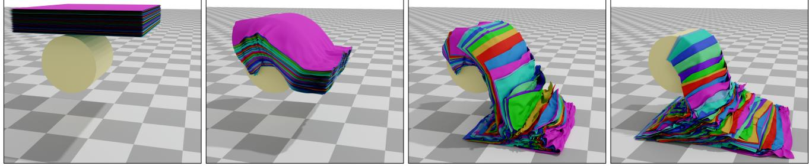

**Fig. 10.** Fifty layers of cloth are dropped onto a cylinder, then slide to the ground. This simulation has 246K vertices and 475K triangles. We use  $r = 3mm$ , a time step of  $1/1200s$ , and 40 iterations per step. The average/maximum computation time per time step is 0.21/0.55s on the CPU and 6.3/11.5ms on the GPU.

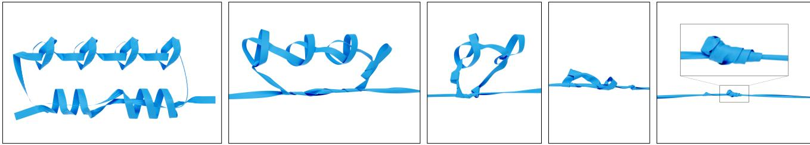

Fig. 11. Tightening a complex knot with 48K vertices and 91K faces by pulling its two ends. At the end of the simulation, the mesh forms a
multi-layered, very tight knot. We use  $r = 2$ mm, a time step of 1/300s, and 50 iterations per step. The average/maximum computation time per
time step is 122/180ms on the CPU and 6.3/11.5ms on the GPU.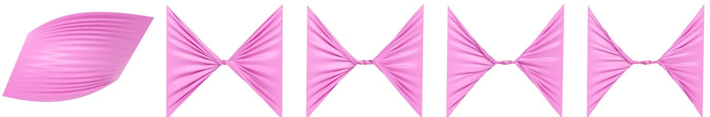

Fig. 12. Twisting a square cloth for 8 circles, showcasing complicated self-collision with extreme contact force and friction. The model has 10K vertices and 19.6K faces. We use  $r = 2mm$ , a time step of 1/300s, and 10 iterations per step. The average/maximum computation time per time step is 21/30ms on the CPU and 0.9/1.5ms on the GPU.density of 1 gram per meter and a friction coefficient of 0.1. Both examples can run about 1.8 times faster than real time on our setup.### 5.3 Convergence

To evaluate OGC's ability to converge with different solvers, we
plot the change in relative force residuals over iterations and com-
putation time in Figure 17. The relative force residual is defined
as:
$$e^{(i)} = \frac{\text{mean}(\|\mathbf{f}\_{v}^{(i)}\|)}{\text{mean}(\|\mathbf{f}\_{v}^\*\|)} \qquad (29)$$

where  $f\_v^\*$  is the initial force residual on vertex  $v$  and  $f\_v^{(i)}$  is the force residual on vertex after iteration  $i$ .Both VBD and Newton's method can reduce the mean force residu-
als to less than  $1e-4$ , which is the lowest error achievable with single
precision. We run VBD for 500 iterations and Newton's method for50 iterations. The spike in VBD's curve corresponds to the applica-  
tion of contact detection. Since we are not performing a line search  
for VBD, the force residuals experience a brief spike after updating  
the contact set through a new DCD. However, VBD quickly recovers  
from this with just a few iterations and continues to reduce the  
error.In terms of convergence speed, Newton's method converges faster  
in terms of iterations, reaching numerical convergence at the 46th  
iteration. However, since each iteration of Newton's method is much  
more computationally expensive and requires a line search to ensure  
stability, it lags far behind VBD in terms of computational time. Col-  
lision detection accounts for approximately 3% of the computational  
time when using Newton's method and 10% when using VBD. This  
experiment demonstrates that the contact force defined by OGC#### 16 • Anka He Chen, Jerry Hsu, Ziheng Liu, Miles Macklin, Yin Yang, and Cem Yuksel

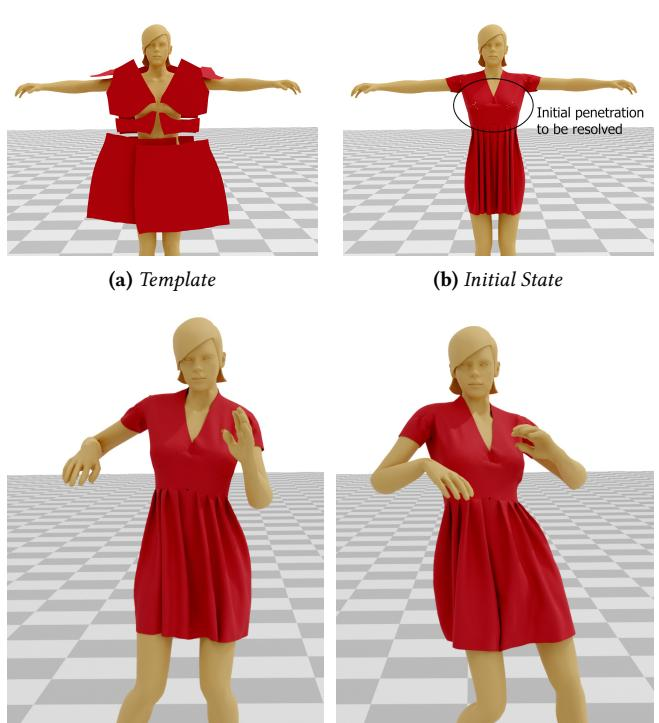

Fig. 13. Simulating a dress on a moving human body. The character is driven by skeletal animation, with 12.8K vertices and 25.4K triangles. The dress model consists of 14 separate pieces as shown in (a), with 15.7K vertices and 29.4K triangles. We use  $r$  = 2mm, a time step of 1/200s, and 20 iterations per step. The average/maximum computation time per time step is 30/42ms on the CPU and 1.2/1.4ms on the GPU.

can converge very efficiently with various solvers, using minimal contact detections.

# 5.4 Quantitative Comparison to Incremental Potential Contact

We compare Newton's method based OGC and VBD based OGC with IPC with incremental potential contact (IPC). The results are visualized in [Figure 18.](#page-17-0) We used the open-sourced implementation of Codimensional-IPC (C-IPC) to generate results. We evaluate the computational time and the total number of collisions at each step.

We can see that IPC uses significantly more collision detections because IPC require more than two collision detections at each iteration: one CCD to cull the global step size and one DCD per energy evaluation in the line search process. This is not the case for OGC-based methods, because OGC does not require any CCD, and DCD is only necessary when points reach their conservative bounds, which does not happen at every iteration, especially in the later stages of the optimization process. In these later stages, the optimizer (both Newton's method and VBD) provides very small step sizes, so it usually takes several iterations for the accumulated displacements to exceed the conservative bounds. As a result, OGC-based methods require significantly fewer collision detections, leading to much lower computational time compared to IPC.

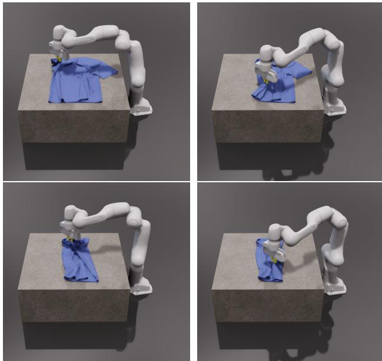

Fig. 14. Simulating a robot manipulating a T-shirt. The robot's trajectory is pre-computed. The T-shirt mesh has 13.8K vertices and 27.4K triangles. We use a collision radius of 2mm and a time step of 1/600s for the simulation. The average/maximum computation time per time step is 1.8/2.2ms on the GPU.

This efficiency is particularly advantageous for VBD-based OGC. Since VBD tends to generate smaller steps than Newton's method, it is less likely to exceed the conservative bounds, allowing the simulation to fully leverage VBD's output. Newton's method, on the other hand, tends to provide larger optimization steps, which supposedly can lead to a more significant reduction in error. However, much of this potential gain can be lost due to conservative bound culling, resulting in wasted computation. Overall, on the CPU, VBD-based OGC is more than about 128 times faster than IPC, while Newton's method-based OGC is 9.2 times faster than IPC on average.

VBD-based OGC is more advantageous over IPC on GPU. We compare the GPU implementation of VBD-based OGC with GIPC [\[Huang et al.](#page-20-25) [2024a\]](#page-20-25), the state-of-the-art GPU variant of IPC. We used the open-sourced implementation of GIPC to generate results. For testing, we simulate the twisting of a volumetric mat at an angular velocity  $\frac{\pi}{2}$  by 16 seconds and evaluate the computational time at each step. The results are visualized in [Figure 19.](#page-17-1)

The average step time for GIPC is 1893ms, while VBD-OGC requires only 5.51ms per step on average, making it 343 times faster and capable of achieving near real-time performance, even under intensive collisions and deformations. Furthermore, VBD-OGC demonstrates significantly more stable performance, with the maximum step time reaching only 8.5 ms. In contrast, GIPC's maximum step time exceeds 20 seconds, occurring at the end of the simulation when the object experiences extensive self-contact, leading to minimal optimization progress in each iteration. This comparison highlights OGC's suitability for real-time simulations due to its consistent and efficient time consumption.

#### Offset Geometric Contact • 17

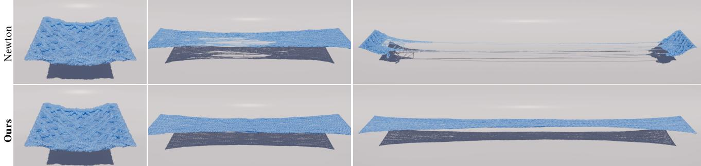

Fig. 15. The yarn cloth is slowly pulled apart. Pure Newton is unable to prevent penetrations which cause catastrophic unraveling. In contrast, our method is able to maintain a penetration free state through-out.

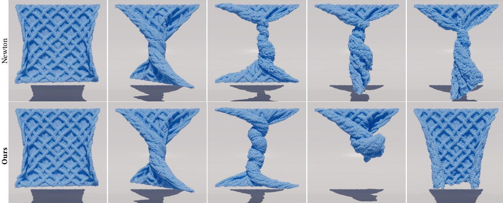

Fig. 16. A square yarn cloth is clamped on its edges and twisted 5 full rotations. Pure Newton is unable to keep the yarn threads separate as they tangle. Our method is able to preserve the yarn structure despite the extreme deformation.

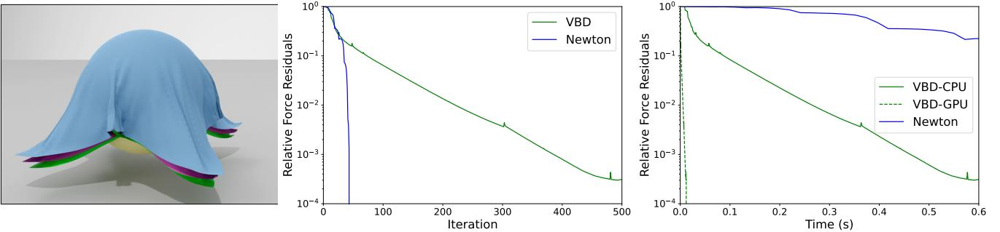

Fig. 17. Convergence plot of Newton's method and VBD-based OGC for simulating three clothes dropping on a sphere at the given step, with 14.7K vertices, 28.6K triangles, and a time step of 1/100. The graphs show relative force residuals change over iterations and computation time.

We also present the results of the same experiment using the CPU implementations of VBD-OGC and IPC in the bottom row of [Figure 19.](#page-17-1) For IPC, we use its officially released implementation. While IPC takes an average of 61.18 seconds per time step, the CPU version of VBD-OGC completes each step in just 0.540 seconds

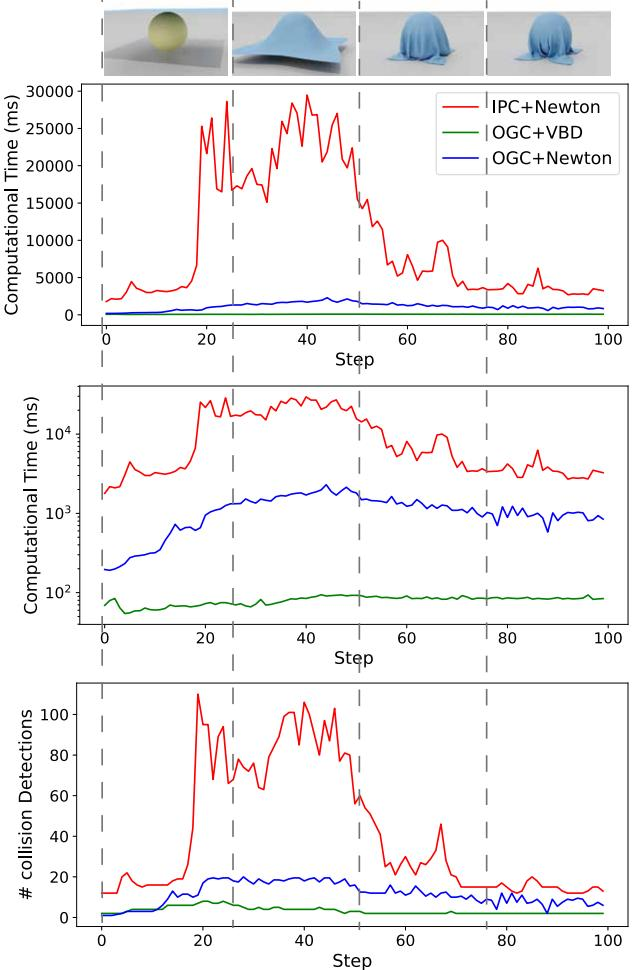

Fig. 18. We compare Newton's method-based OGC and VBD-based OGC with IPC by simulating a cloth dropping onto a fixed sphere. The mesh has 4.9K vertices and 9.5K triangles. The simulation is run with a time step of 1/100s for 100 steps. The four images in the first row show the state of the simulation using IPC at steps 0, 25, 50, and 75, respectively. We use a contact radius of 5mm for OGC and allow IPC to automatically control the contact radius. From top to bottom, the first figure illustrates the computational time at each step for each method, the second one is the same as the first one but in a logarithmic scale, and the third chart shows the number of collision detections used at each step.

on average, achieving a 133× speedup. This demonstrates that our method's advantages do not only come from better parallelism.

# 5.5 Qualitative Comparison to Incremental Potential Contact

5.5.1 Work with Large Contact Radius. We compare the compatibility of the IPC and OGC contact models with a large contact radius by simulating a cloth twisted by half a circle using both methods. The final states of the simulations using the IPC and OGC are shown

ACM Trans. Graph., Vol. 44, No. 4, Article . Publication date: August 2025.

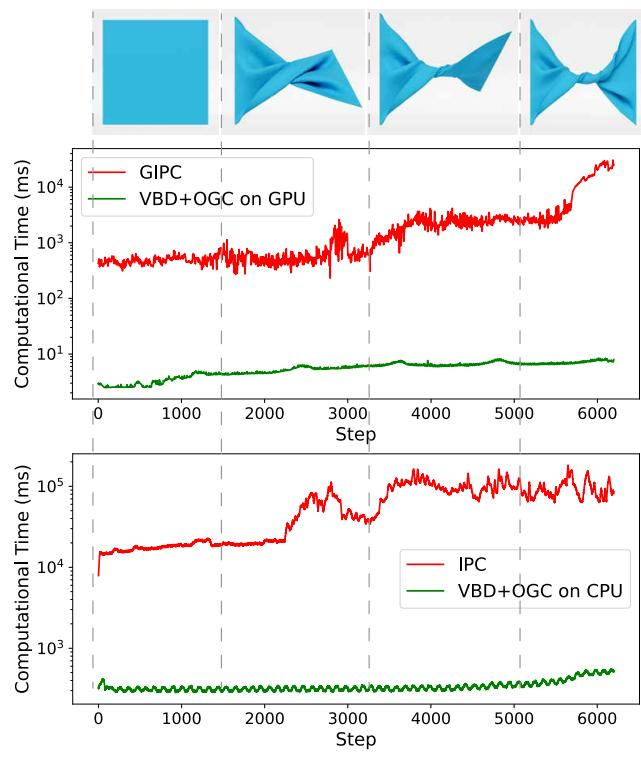

Fig. 19. We compare the GPU implementation of VBD-OGC with GIPC [\[Huang et al.](#page-20-25) [2024a\]](#page-20-25), and the CPU implementation of VBD-OGC with IPC, by replicating the volumetric mat twisting experiment presented in the IPC [\[Li et al. 2020\]](#page-20-1) and GIPC [\[Huang et al.](#page-20-25) [2024a\]](#page-20-25) papers. The mesh has 15.3K vertices and 46.8K tets. The simulation is run with a time step of 1/240s. The four images in the first row show the state of the simulation using IPC at 0s, 4s, 8s, and 12s, respectively. The middle row compares the runtime of each step in the GPU implementation of VBD-OGC against GIPC, while the bottom row compares the CPU implementation of VBD-OGC with IPC. We use a contact radius of 2 mm for OGC and allow GIPC and IPC to automatically control the contact radius. We plot the time consumption at each step in the chart.

in [Figure 2a](#page-1-0) and [Figure 2b,](#page-1-0) respectively. The cloth consists of a 200×200 regular grid with each side measuring 1 meter, resulting in a 0.5mm minimal distance between neighboring vertices. As shown in [Figure 2a,](#page-1-0) the IPC model produces severe artifacts caused by nonorthogonal forces from neighbors and other points, including vertex bulging and oscillations. In contrast, the OGC model handles the large contact radius robustly, producing stable and natural contact results. Please see the supplementary video for a more thorough side-by-side comparison.

5.5.2 Numerical Damping. IPC is known to exhibit severe numerical damping artifacts when convergence is insufficient. This issue is demonstrated in [Figure 20,](#page-18-0) where a square cloth is simulated dropping onto a small sphere, causing self-contact. In this experiment, we use a time step of dt=1/500 but limit the solver to only one iteration per step. Once self-contact occurs, IPC quickly loses nearly all

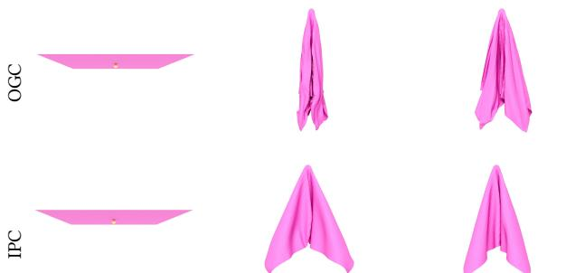

Fig. 20. Comparing our method (OGC+VBD) with IPC in the low iteration count setup. In both of those experiments we use a time step of 1/500s and only 1 iteration per step. The cloth has 4.9K vertices and 9.5K triangles. The top row is the results of OGC+VBD and the bottom row is the results of IPC. From left to right, each column visualizes the simulation state at frame 0, 50 and 80.

momentum, resulting in a slow-motion effect. This happens because the self-contact restricts the optimization step size, allowing only minimal movement per step and effectively dissipating velocity.

In contrast, the OGC model, with its conservative initialization scheme and per-vertex-based displacement bounds, preserves the momentum for most vertices, producing simulations with significantly more dynamics. While neither IPC nor OGC achieves full numerical convergence under such limited iterations, the OGC model generates results that are far more visually plausible.

5.5.3 Comparing Activation Functions. To demonstrate the effectiveness of our activation function, we conduct an ablation test, with results visualized in [Figure 21.](#page-18-1) In this experiment, we run two simulations with our and IPC's activation function, simulating a piece of cloth dropped onto a sphere on the ground, with a time step of 1/100s, collision stiffness  $k\_c$  = 1e4, and VBD solver. We first simulate 40 time steps, ensuring each step reaches numerical convergence. The state of the simulation at the 40th step is visualized in [Figure 21a](#page-18-1) and [Figure 21b.](#page-18-1) We can see that the simulations with two activation functions provide visually identical results. Furthermore, we plot the change in relative force residuals [\(Equation 29\)](#page-14-3) over iterations of the 40th step in [Figure 21c,](#page-18-1) where the simulation using our activation converges approximately 2x faster than the one using IPC's activation. At last, we plot the force-distance relationship of two functions in [Figure 21d,](#page-18-1) where we set the contact radius and collision stiffness  $k\_c$  of both of those activations to be 1. Our activation shows a smoother transition from 0 to infinity and exhibits less stiff behavior. In fact, at the state visualized in [Figure 21a](#page-18-1) and [Figure 21b,](#page-18-1) the condition number of the system Hessian of the simulation with our activation is 5 times smaller than that using IPC's activation.

### 6 LIMITATIONS AND FUTUREWORKS

Offset Geometric Contact is a contact model intended to achieve orthogonality of normal contact force. However, on a discrete surface, orthogonality and continuity of contact force cannot both be achieved. As illustrated in [Figure 22a,](#page-19-17) when a point moves along

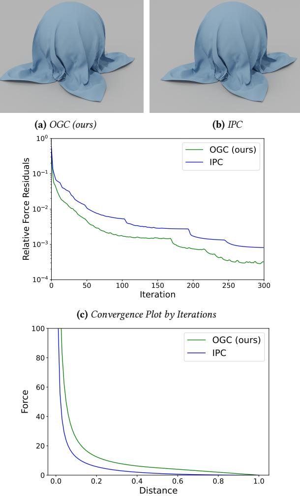

(d) Force-Distance Relationship for OGC (ours) and IPC

Fig. 21. Comparing our activation function [Equation 18](#page-8-3) with IPC's activation function. The results are measured on the 40th time step of simulating a piece of cloth falling onto a sphere. The cloth has 4.9K vertices and 9.5K triangles, and we use a time step of 1/100s. The state of simulation at the selected step using OGC and IPC's activation function is visualized in (a) and (b), respectively. Panel (c) plots the convergence of relative force residuals by iteration, and panel (d) shows the force-distance relationship of the two functions.

the black trajectory, it is subject to discontinuous contact forces, particularly upon entering the facet's block from the open boundary. At that moment, it suddenly experiences a non-zero contact force from the facet. Note that this discontinuity only occurs at the open boundary on the concave side of the faces, not at the closed boundary, where the contact force is zero. The more concave the area is, the more likely this issue is to arise, because it occurs in the overlapping area of two adjacent face's blocks. However, the more concave the area is, the less likely it is for a point to enter the

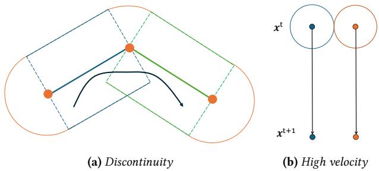

Fig. 22. Illustration of our method's limitations. (a) A point's trajectory that results in a discontinuous contact force. The thickened line and dots represent the face, and the colored lines indicate the boundaries of the face's block with corresponding color. Solid lines denote closed boundaries, while dashed lines denote open boundaries. The solid black line visualizes the trajectory. (b) Two mass points dropping with high velocity from current position  $x^t$  to the next time step's position  $x^{t+1}$ , the circle visualizes the conservative bound given by our method and the black arrow visualizes their trajectory within this time step.

narrow space between faces, which helps mitigate the problem. In theory, this discontinuity can lead to instability or slow convergence, though we did not observe any such issues in our experiments.

Our technique for achieving penetration-free simulation is significantly more efficient in scenarios with intensive collisions. However, in cases with few collisions and large velocities, it may lag behind the CCD-aware line search employed by IPC. As visualized in [Fig](#page-19-17)[ure 22b](#page-19-17) two mass points falling freely under gravity in parallel: IPC's technique can apply the full step in a single iteration because their trajectories do not intersect. In contrast, our approach limits their motion to less than  $\frac{d}{2}$ , where  $d$  is the distance between the two points. This restriction can necessitate more iterations for convergence, and the issue worsens as velocity increases.

Nevertheless, this limitation also suggests a promising direction for future improvement. Potential strategies include intelligently switching among various penetration-free techniques or incorporating vertex displacement directions to establish tighter bounds.

### 7 CONCLUSION

We have presented offset geometric contact, an efficient contact model that allows for penetration-free simulation of codimensional objects, significantly reducing the stiffness of contact forces and increasing the efficiency of the simulation pipeline. By offsetting each face in its normal directions, our formulation ensures normal contact forces remain orthogonal, allowing for a larger contact distance and thus mitigating the stiffness problem. Instead of continuous collision detection (CCD), we compute a local maximum displacement bound for each vertex in parallel, adding negligible overhead. This local approach, combined with a fully parallel solver like Vertex Block Descent, enables real-time, large-scale simulations on GPUs. Our experiments show that this method can be more than two orders of magnitude faster than IPC-based simulations and maintain near-constant computational cost by using a fixed iteration count, making penetration-free simulation feasible for a broader range of applications.

Our results demonstrate that the proposed method effectively handles highly complex simulation scenarios [\(Figure 10\)](#page-14-0), maintains stability under extreme stress tests [\(Figure 11,](#page-14-1) [12,](#page-14-2) [15,](#page-16-1) and [16\)](#page-16-2), and exhibits fast convergence [\(Figure 17\)](#page-16-0).

In addition, we present an efficient implementation of our contact model integrated with the VBD integrator, leveraging block-level operations to maximize parallelism and efficiency. We aim to provide an out-of-the-box simulator and will continue to maintain the code base after release. We also welcome collaboration with the robotics, animation, and medical simulation communities to refine the usability of penetration-free simulation, making it more accessible and beneficial for these fields. We hope these communities will build upon our work to advance their respective applications.

### ACKNOWLEDGMENTS

This project was supported in part by NSF grants #1956085 and #2301040 and a gift from Meta.

### REFERENCES

- Oswin Aichholzer, Franz Aurenhammer, David Alberts, and Bernd Gärtner. 1996. A novel type of skeleton for polygons. Springer.
- Ryoichi Ando. 2024. A Cubic Barrier with Elasticity-Inclusive Dynamic Stiffness. ACM Trans. Graph. 43, 6 (2024), 224:1–224:13.<https://doi.org/10.1145/3687908>
- Thomas Banchoff. 1967. Critical points and curvature for embedded polyhedra. Journal of Differential Geometry 1, 3-4 (1967), 245–256.
- Thomas F Banchoff. 1970. Critical points and curvature for embedded polyhedral surfaces. The American Mathematical Monthly 77, 5 (1970), 475–485.
- Gill Barequet and Alex Goryachev. 2014. Offset polygon and annulus placement problems. Computational Geometry 47, 3, Part A (2014), 407–434. [https://doi.org/](https://doi.org/10.1016/j.comgeo.2013.10.003) [10.1016/j.comgeo.2013.10.003](https://doi.org/10.1016/j.comgeo.2013.10.003)
- Qian Bo. 2010. Recursive polygon offset computing for rapid prototyping applications based on Voronoi diagrams. The International Journal of Advanced Manufacturing Technology 49 (2010), 1019–1028.
- Ulrich Brehm and Wolfgang Kühnel. 1982. Smooth approximation of polyhedral surfaces regarding curvatures. Geometriae Dedicata 12, 4 (1982), 435–461.
- James V Burke. 1992. A robust trust region method for constrained nonlinear programming problems. SIAM J. on Optim. 2, 2 (1992), 325–347.
- James V Burke, Jorge J Moré, and Gerardo Toraldo. 1990. Convergence properties of trust region methods for linear and convex constraints. Math. Program. 47, 1 (1990), 305–336.
- Anka He Chen, Ziheng Liu, Yin Yang, and Cem Yuksel. 2024b. Vertex Block Descent. ACM Trans. Graph. 43, 4, Article 116 (July 2024), 16 pages. [https://doi.org/10.1145/](https://doi.org/10.1145/3658179) [3658179](https://doi.org/10.1145/3658179)
- He Chen, Elie Diaz, and Cem Yuksel. 2023. Shortest Path to Boundary for Self-Intersecting Meshes. ACM Trans. Graph. 42, 4, Article 146 (July 2023), 15 pages. <https://doi.org/10.1145/3592136>
- Honglin Chen, Hsueh-Ti Derek Liu, Alec Jacobson, David I. W. Levin, and Changxi Zheng. 2024a. Trust-Region Eigenvalue Filtering for Projected Newton. In SIG-GRAPH Asia 2024 Conference Papers, SA 2024, Tokyo, Japan, December 3-6, 2024, Takeo Igarashi, Ariel Shamir, and Hao (Richard) Zhang (Eds.). ACM, 120:1–120:10. <https://doi.org/10.1145/3680528.3687650>
- Xiaorui Chen and Sara McMains. 2005. Polygon offsetting by computing winding numbers. In International Design Engineering Technical Conferences and Computers and Information in Engineering Conference, Vol. 4739. 565–575.
- Jonathan Cohen, Marc Olano, and Dinesh Manocha. 1998. Appearance-preserving simplification. In Proceedings of the 25th annual conference on Computer graphics and interactive techniques. 115–122.
- Andrew R Conn, Nicholas IM Gould, and Ph L Toint. 1988. Global convergence of a class of trust region algorithms for optimization with simple bounds. SIAM journal on numerical analysis 25, 2 (1988), 433–460.
- Gilberto Echeverria. 2007. The Polyhedral Gauss Map and discrete curvature measures in geometric modelling. Ph. D. Dissertation. Sheffield Hallam University, UK. [https:](https://ethos.bl.uk/OrderDetails.do?uin=uk.bl.ethos.440302) [//ethos.bl.uk/OrderDetails.do?uin=uk.bl.ethos.440302](https://ethos.bl.uk/OrderDetails.do?uin=uk.bl.ethos.440302)
- Zachary Ferguson, Minchen Li, Teseo Schneider, Francisca Gil-Ureta, Timothy Langlois, Chenfanfu Jiang, Denis Zorin, Danny M. Kaufman, and Daniele Panozzo. 2021. Intersection-free rigid body dynamics. ACM Trans. Graph. 40, 4, Article 183 (July

2021), 16 pages.<https://doi.org/10.1145/3450626.3459802>

- Dewen Guo, Minchen Li, Yin Yang, Sheng Li, and Guoping Wang. 2024. Barrier-Augmented Lagrangian for GPU-based Elastodynamic Contact. ACM Trans. Graph. 43, 6 (2024), 225:1–225:17.<https://doi.org/10.1145/3687988>
- Berthold Klaus Paul Horn. 1984. Extended gaussian images. Proc. IEEE 72, 12 (1984), 1671–1686.
- Kemeng Huang, Floyd Chitalu, Huancheng Lin, and Taku Komura. 2024a. GIPC: Fast and stable Gauss-Newton optimization of IPC barrier energy. [http://arxiv.org/abs/](http://arxiv.org/abs/2308.09400) [2308.09400](http://arxiv.org/abs/2308.09400) arXiv:2308.09400 [cs] version: 4.
- Kemeng Huang, Floyd M. Chitalu, Huancheng Lin, and Taku Komura. 2024b. GIPC: Fast and Stable Gauss-Newton Optimization of IPC Barrier Energy. ACM Trans. Graph. 43, 2, Article 23 (Mar 2024), 18 pages.<https://doi.org/10.1145/3643028>
- Stefan Huber. 2018. The topology of skeletons and offsets. In Proc. 34th Europ. Workshop on Comp. Geom.(EuroCG'18).
- T. Kugelstadt and E. Schömer. 2016. Position and orientation based Cosserat rods. In Proceedings of the ACM SIGGRAPH/Eurographics Symposium on Computer Animation (Zurich, Switzerland) (SCA '16). Eurographics Association, Goslar, DEU, 169–178.
- Lei Lan, Danny M. Kaufman, Minchen Li, Chenfanfu Jiang, and Yin Yang. 2022a. Affine Body Dynamics: Fast, Stable and Intersection-Free Simulation of Stiff Materials. ACM Trans. Graph. 41, 4, Article 67 (Jul 2022), 14 pages. [https://doi.org/10.1145/](https://doi.org/10.1145/3528223.3530064) [3528223.3530064](https://doi.org/10.1145/3528223.3530064)
- Lei Lan, Minchen Li, Chenfanfu Jiang, Huamin Wang, and Yin Yang. 2023. Second-order Stencil Descent for Interior-point Hyperelasticity. ACM Trans. Graph. 42, 4, Article 108 (Jul 2023), 16 pages.<https://doi.org/10.1145/3592104>
- Lei Lan, Zixuan Lu, Jingyi Long, Chun Yuan, Xuan Li, Xiaowei He, Huamin Wang, Chenfanfu Jiang, and Yin Yang. 2024. Mil2: Efficient Cloth Simulation Using Nondistance Barriers and Subspace Reuse. CoRR abs/2403.19272 (2024). [https://doi.org/](https://doi.org/10.48550/ARXIV.2403.19272) [10.48550/ARXIV.2403.19272](https://doi.org/10.48550/ARXIV.2403.19272) arXiv[:2403.19272](https://arxiv.org/abs/2403.19272)
- Lei Lan, Guanqun Ma, Yin Yang, Changxi Zheng, Minchen Li, and Chenfanfu Jiang. 2022b. Penetration-free projective dynamics on the GPU. ACM Trans. Graph. 41, 4, Article 69 (July 2022), 16 pages.<https://doi.org/10.1145/3528223.3530069>
- Lei Lan, Yin Yang, Danny Kaufman, Junfeng Yao, Minchen Li, and Chenfanfu Jiang. 2021. Medial IPC: Accelerated incremental potential contact with medial elastics. ACM Trans. Graph. 40, 4, Article 158 (Jul 2021), 16 pages. [https://doi.org/10.1145/](https://doi.org/10.1145/3450626.3459753) [3450626.3459753](https://doi.org/10.1145/3450626.3459753)
- Minchen Li, Danny M. Kaufman, and Chenfanfu Jiang. 2021. Codimensional incremental potential contact. ACM Trans. Graph. 40, 4, Article 170 (July 2021), 24 pages. [https:](https://doi.org/10.1145/3450626.3459767)

[//doi.org/10.1145/3450626.3459767](https://doi.org/10.1145/3450626.3459767)

- Minchen Li et al. 2020. Incremental potential contact: intersection-and inversion-free, large-deformation dynamics. ACM Trans. Graph. 39, 4, Article 49 (August 2020), 20 pages.<https://doi.org/10.1145/3386569.3392425>
- James J Little. 1985. Extended gaussian images, mixed volumes, shape reconstruction. In Proceedings of the first annual symposium on Computational geometry. 15–23.
- Miles Macklin. 2022. Warp: A High-performance Python Framework for GPU Simulation and Graphics. [https://github.com/nvidia/warp.](https://github.com/nvidia/warp) NVIDIA GPU Technology Conference (GTC).
- Jorge J Moré. 1983. Recent developments in algorithms and software for trust region methods. Math. Program. The State of the Art: Bonn 1982 (1983), 258–287.
- Jorge Nocedal and Stephen J Wright. 1999. Numerical optimization.
- Georgios Pavlakos, Vasileios Choutas, Nima Ghorbani, Timo Bolkart, Ahmed A. A. Osman, Dimitrios Tzionas, and Michael J. Black. 2019. Expressive Body Capture: 3D Hands, Face, and Body From a Single Image. In IEEE Conf. on Comput. Vis. and Pattern Recognit., CVPR 2019, Long Beach, CA, USA, June 16-20, 2019. 10975–10985. <https://doi.org/10.1109/CVPR.2019.01123>
- Xing Shen, Runyuan Cai, Mengxiao Bi, and Tangjie Lv. 2024. Preconditioned Nonlinear Conjugate Gradient Method for Real-time Interior-point Hyperelasticity. In ACM SIGGRAPH 2024 Conference Papers. 1–11.
- Min Tang, Young J. Kim, and Dinesh Manocha. 2009. C2A: Controlled conservative advancement for continuous collision detection of polygonal models. In 2009 IEEE Int. Conf. on Robot. and Automat., ICRA 2009, Kobe, Jpn., May 12-17, 2009. IEEE, 849–854.<https://doi.org/10.1109/ROBOT.2009.5152234>
- Tianyu Wang, Jiong Chen, Dongping Li, Xiaowei Liu, Huamin Wang, and Kun Zhou. 2023. Fast GPU-Based Two-Way Continuous Collision Handling. ACM Trans. Graph. (SIGGRAPH) 42, 5, Article 167 (Jul 2023), 15 pages.<https://doi.org/10.1145/3604551>
- Botao Wu, Zhendong Wang, and Huamin Wang. 2022. A GPU-based multilevel additive schwarz preconditioner for cloth and deformable body simulation. ACM Trans. Graph. 41, 4 (2022), 63:1–63:14.<https://doi.org/10.1145/3528223.3530085>
- Longhua Wu, Botao Wu, Yin Yang, and Huamin Wang. 2020. A Safe and Fast Repulsion Method for GPU-based Cloth Self Collisions. ACM Trans. Graph. (SIGGRAPH) 40, 1, Article 5 (Dec 2020), 18 pages.<https://doi.org/10.1145/3430025>
- Ya-Xiang Yuan. 2015. Recent advances in trust region algorithms. Math. Program. 151, 1 (2015), 249–281.<https://doi.org/10.1007/S10107-015-0893-2>
- Xinyu Zhang, Minkyoung Lee, and Young J Kim. 2006. Interactive continuous collision detection for non-convex polyhedra. The Vis. Comput. 22 (2006), 749–760.