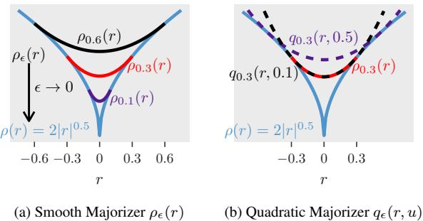
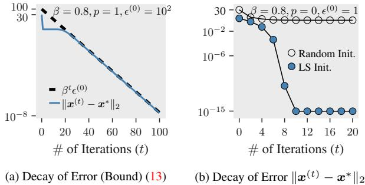
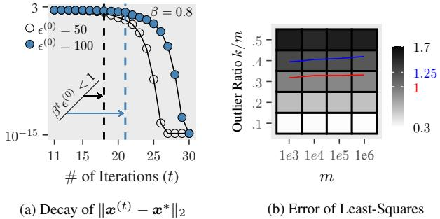
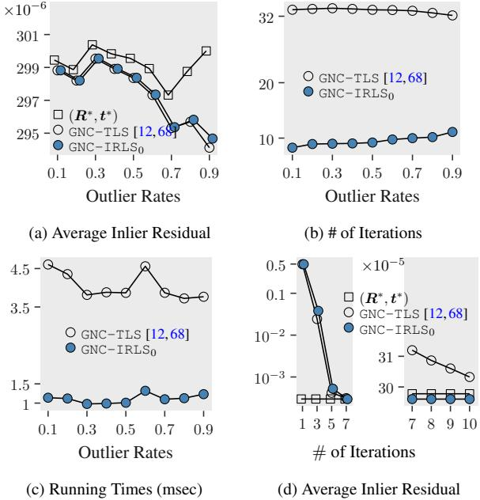
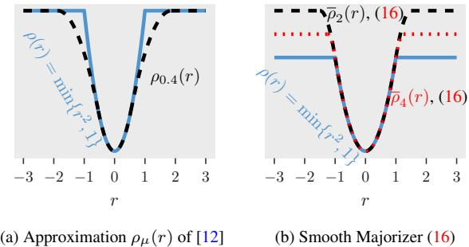
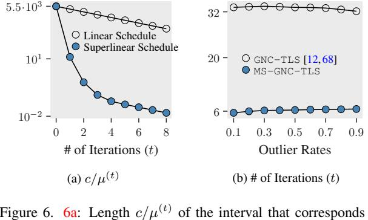

This CVPR paper is the Open Access version, provided by the Computer Vision Foundation.  
Except for this watermark, it is identical to the accepted version;  
the final published version of the proceedings is available on IEEE Xplore.

# On the Convergence of IRLS and Its Variants in Outlier-Robust Estimation

Liangzu Peng Johns Hopkins University lpeng25@jhu.edu

Christian Kummerle ¨ UNC Charlotte kuemmerle@uncc.edu

Rene Vidal ´ University of Pennsylvania vidalr@seas.upenn.edu

## Abstract

Outlier-robust estimation involves estimating some pa-  
rameters (e.g., 3D rotations) from data samples in the pres-  
ence of outliers, and is typically formulated as a non-convex  
and non-smooth problem. For this problem, the classical  
method called iteratively reweighted least-squares (IRLS)  
and its variants have shown impressive performance. This  
paper makes several contributions towards understanding  
why these algorithms work so well. First, we incorporate  
majorization and graduated non-convexity (GNC) into the  
IRLS framework and prove that the resulting IRLS vari-  
ant is a convergent method for outlier-robust estimation.  
Moreover, in the robust regression context with a constant  
fraction of outliers, we prove this IRLS variant converges  
to the ground truth at a global linear and local quadratic  
rate for a random Gaussian feature matrix with high prob-  
ability. Experiments corroborate our theory and show that  
the proposed IRLS variant converges within 5-10 iterations  
for typical problem instances of outlier-robust estimation,  
while state-of-the-art methods need at least 30 iterations. A  
basic implementation of our method is provided: <https://github.com/liangzu/IRLS-CVPR2023>... attempts to analyze this difficulty [caused by infinite weights of IRLS for the  $\ell\_p$ -loss] have a long history of proofs and counterexamples to incorrect claims.
> > Khurrum Aftab & Richard Hartley [1]

## 1. Introduction

### 1.1. The Outlier-Robust Estimation Problem

Many parameter estimation problems can be stated in
the following general form. We are given some function
r:  $C \times D \rightarrow [0, \infty)$ , called the *residual* function. Here
 $\mathcal{D}$  is the domain of data samples  $d\_1, ..., d\_m$ , and  $C \subset \mathbb{R}^n$ 
is the *constraint* set where our (ground truth) variable  $v^\*$ 
lies;  $C$  can be convex such as an affine subspace, or non-
convex such as a special orthogonal group SO(3). We aim
to recover  $v^\*$  from data  $d\_i$ 's. A simple example is *linear*
regression, where a sample  $d\_i = (a\_i, y\_i)$  consists of a fea-ture vector  $a\_i \in \mathbb{R}^n$  and a scalar response  $y\_i \in \mathbb{R}$ , and the residual function is  $r(v, d\_i) := |a\_i^\top v - y\_i|$ .The sample  $d\_i$  is called an *inlier*, if  $r(v^\*, d\_i) \approx 0$ . It is called an *outlier*, if the residual  $r(v^\*, d\_i)$  is *large* (vaguely speaking). If all samples are *inliers*, one usually prefers solving the following problem as a means to estimate  $v^\*$ :
$$\min\_{\nu \in C} \sum\_{i=1}^{m} r(\nu, d\_{i})^{2} \qquad (1)$$

Problem (1) is called *least-squares*, and is known since Leg-
endre [\[41\]](#page-0-0) and Gauss [\[29\]](#page-0-0) in the linear regression context.
Even before that, Boscovich [\[13\]](#page-0-0) suggested to minimize (1)
without the square. This unsquared version is called *least absolute deviation*, and is more robust to outliers than (1).Consider the following formulation for *outlier-robust* estimation (i.e., a specific type of *M*-estimators [\[35,55\]](#page-0-0)):
$$\min\_{\boldsymbol{v}\in\mathcal{C}}\sum\_{i=1}^{m}\rho\left(\boldsymbol{r}(\boldsymbol{v},\boldsymbol{d}\_{i})\right)\tag{2}$$

Here  $\rho : \mathbb{R} \rightarrow \mathbb{R}$  is some outlier-robust loss (the unsquared version of (1) corresponds to  $\rho(r) = |r|$  in (2)). Among
many possible losses  $\rho$  [\[19, 23\]](#page-9-1), we discuss two particular
choices. The first is the  $\ell\_p$ -loss  $\rho(r) = |r|^p/p$ ,  $p \in (0,1]$ ;
it has been used in several research fields, e.g., geometric
vision [\[1, 19\]](#page-9-1), compressed sensing [\[17, 22, 36\]](#page-9-1), matrix re-
covery [\[37,44,45\]](#page-9-1), and subspace clustering [\[26\]](#page-9-1). The other
loss is due to Huber [\[35\]](#page-9-1):  $\rho(r) = \min\{r^2, c^2\}$ , with  $c > 0$  a
hyper-parameter; it has later been named as Talwar [\[21,48\]](#page-9-1),
Huber-type skipped mean [\[30\]](#page-9-1), truncated quadratic [\[6, 11\]](#page-9-1),
and truncated least-squares *(TLS)* [\[4, 68, 74\]](#page-9-1). Both losses
are highly robust to outliers but make solving (2) diffi-
cult, e.g., the objective of (2) becomes non-smooth or non-
convex. This motivates the need to develop efficient and
provably correct solvers for (2) with either of the two losses.### 1.2. IRLS and Its Variants in Vision & Optimization

The General Principle of IRLS. As its name suggests, *it*-
eratively reweighted *least-squares (IRLS)* is a general algo-
rithmic paradigm that alternates between defining a weight
for each sample and solving a weighted least squares prob-
lem. Specifically, IRLS initializes a variable  $v^{(0)} \in C$ , and,for  $t = 0, 1, \dots$ , alternates between the following two steps:Update weights  $w\_i^{(t+1)}$  based on  $v^{(t)}, \forall i = 1,...,m$  (3)

$$\text{Solve: } \upsilon^{(t+1)} \leftarrow \underset{\upsilon \in \mathcal{C}}{\text{argmin}} \sum\_{i=1}^{m} w\_i^{(t+1)} r(\upsilon, d\_i)^2 \tag{4}$$

This basic idea dates back to the seminal work of Weiszfeld
[\[66\]](#page-6-0); see [9,32] for some historical accounts. A well-known
and general rule for the weight update is (cf. [1,21,47])
$$w\_i^{(t+1)} \gets \rho'(r\_i^{(t)}) / r\_i^{(t)}, \quad r\_i^{(t)} := r(\nu^{(t)}, d\_i). \qquad (5)$$

In a nutshell, the rationale behind rule (5) is to “connect”
weighted least-squares (4) to outlier-robust estimation (2),
allowing IRLS to optimize the latter (2). Indeed, [1] shows
that IRLS with the weight update in (5) results in a non-
increasing objective (2). Moreover, [1] gives conditions un-
der which IRLS with (5) converges to a stationary point of
(2). This confirms that one can apply IRLS to problem (2),
as long as one can solve weighted least-squares1 (4).However, the conditions of the theorem of [\[1\]](#page-3-0) are hard
to verify, e.g., one condition requires the minimizer of (4)
to be a continuous function of weights  $w\_i^{(t+1)}$ . Moreover,
as [\[1\]](#page-3-0) commented, directly applying (5) to non-smooth or
non-convex losses (e.g.,  $l\_p$  or TLS) might create significant
theoretical and practical difficulties, e.g., (5) is undefined at
non-differentiable points. This suggests that rule (5) needs
to be improved if the  $l\_p$  or TLS loss is to be minimized.IRLS in A Tale of Two Losses. For the non-smooth  $\ell\_p$ -
loss, [\[5\]](#page-1-0) results in  $w\_i^2$   $w\_i^{(t+1)} \leftarrow (r\_i^{(t)})^{p-2}$ , which tends to in-
finity as  $r\_i^{(t)} \rightarrow 0$ . A workaround is to truncate the residual
by some positive number  $\epsilon$ , i.e.,  $w\_i^{(t+1)} \leftarrow \max\{r\_i^{(t)}, \epsilon\}^{p-2}$ 
[\[19, 24–26, 42, 43, 64\]](#page-1-0). While [\[1, 59\]](#page-1-0) considered this to be
“an *ad-hoc* procedure”, in the optimization literature, there
do exist theoretical guarantees for IRLS with this revised
weight update to converge, at least for some specific resid-
ual functions  $r$ , see, e.g., [\[8, 16, 42, 43\]](#page-1-0).For the non-smooth and non-convex TLS loss  $\rho(r) = min\{r^2, c^2\}$ , (5)2 results in a hard thresholding scheme: set  $w\_i^{(t+1)}$  to 1 if  $r\_i^{(t)} \leq c$ , or set it to 0 otherwise. IRLS fails with such a weight update if the outlier rate exceeds 10% for *category-level perception* as reported in [\[57\]](#page-9-1). This could be remedied in two ways, discussed next.The first is to adopt a different hard thresholding method
[\[10\]](#page-1-0) from the optimization literature, which sets  $w\_i^{(t+1)}$  to 1
if  $r\_i^{(t)}$  is among the *s*-smallest of all residuals (*s* is a hyper-
parameter), or set  $w\_i^{(t+1)}$  to 0 otherwise; this method is
robust up to 50% outliers for *robust regression*, and con-
verges globally linearly under some conditions. Note that
this IRLS variant is not meant to minimize the TLS loss.The second remedy manifests itself if one applies rule
(5) to some *smoothing approximation*  $\rho\_{\mu}(r)$  of the TLS loss
 $\rho(r) = min\{r^2, c^2\}$ . The approximation of [\[12\]](#page-1-1) is
$$
\rho\_{\mu}(r) = \begin{cases}
r^{2}, & \text{if } r^{2} \leq \frac{\mu c^{2}}{\mu + 1}, \\
c^{2}, & \text{if } r^{2} \geq \frac{\mu + 1}{\mu}c^{2}, \\
2c|r|\sqrt{\mu(\mu + 1)} - \mu(c^{2} + r^{2}), & \text{o/w.} \\
\end{cases}
$$
(6)

Since  $\rho\_\mu \rightarrow \rho$  as  $\mu \rightarrow \infty$ , a natural strategy, called graduated non-convexity (GNC) [\[12\]](#page-1-1), is to alternate between optimizing  $\rho\_\mu$  and increasing  $\mu$  at each iteration  $t$ . The method used for increasing  $\mu$  is called a GNC schedule and the default schedule has been a linear one, i.e.,  $\mu^{(t+1)} \leftarrow \gamma \mu^{(t)}$  with some hyper-parameter  $\gamma > 1$  [\[39, 46, 57, 60, 68, 74\]](#page-1-1). For example, the GNC-TLS method [\[12, 68\]](#page-1-1) incorporates this linear schedule within the IRLS framework (3)-(5) to approximate the TLS loss via  $\rho\_\mu$ .However, the great engineering intuition of [\[12\]](#page-1-0) and its
follow-up works [\[4, 39, 62, 68, 75\]](#page-1-0) on GNC comes with the
lack of theoretical guarantees, thus [\[69,71\]](#page-1-0) refer to GNC as
a "fast heuristic" strategy. On the other hand, in the opti-
mization literature, similar GNC twists for the  $\ell\_p$ -loss have
been empirically investigated [\[18, 65, 67\]](#page-1-0) for compressed
sensing and related problems, and empowered with global
linear or local superlinear convergence rates [\[22, 36, 46, 52\]](#page-1-0).For outlier-robust estimation [\[2\]](#page-1-0), either with general [4,39,68] or specific residual functions [26, 52], either with the  $l\_p$  [26, 46, 52], TLS [4, 39, 57, 68], or even other losses [59, 73], combining IRLS and GNC has pushed the empirical performance to a certain limit, which other types of methods (e.g., RANSAC [28]) can hardly attain given the same time budget. On the other hand, theoretical guarantees for IRLS offered in the optimization literature are limited to specific problems (e.g., compressed sensing [22]), and, though related, cannot be applied directly to outlier-robust estimation [\[2\]](#page-1-0). An intriguing but under-explored theoretical question is why IRLS, GNC, and the like work so well for outlier-robust estimation [\[2\]](#page-1-0)—can we extend, not just apply, the insights from optimization to answer this question?### 1.3. Our Contribution

We present an IRLS variant called GNC-IRLSp (Algo-  
rithm 1) for the outlier-robust estimation problem (2) and  
establish general convergence properties for general con-  
straint sets  $C$ , providing a well-founded framework for em-  
pirically successful GNC methods. We further elucidate  
how appropriately chosen update rules for the smoothing  
parameter  $\epsilon^{(t)}$  (Line 7) of GNC-IRLSp lead to a global and  
fast local convergence for outlier-robust estimation prob-  
lems. More specifically, our contributions are as follows:• In Section 2, we consider outlier-robust estimation (2) for a general class of residual functions and constraints, and we prove that GNC–IRLS $p$  converges to stationary pointsWhile solving weighted least-squares (4) can be hard, many solvers
for geometric vision exist, see, e.g., [2, 5, 15, 33, 34, 49, 56, 57,68,73].2Pretending that the  $\ell\_p$  or TLS losses are differentiable everywhere.

Algorithm 1: GNC-IRLSp 1 Input: data *d*1, . . . , *d*m,  $p \in (0, 1]$ ; 2 Let *v*(0)  $\in C$  with  $||v^{(0)}||\_2 < \infty$  and  $\epsilon^{(0)} \in (0, \infty)$ ; 3 For  $t \leftarrow 0, 1, 2, ...$ : 4 Compute the residual  $r\_i^{(t)} \leftarrow r(v^{(t)}, d\_i), \forall i$ ; 5  $w\_i^{(t+1)} \leftarrow \max\{r\_i^{(t)}, \epsilon^{(t)}\}^{p-2}$  ; // Sec. 2 6 Solve problem (4) and get *v* (t+1) ; // Sec. 2 7 Calculate  $\epsilon^{(t+1)}$  based on a GNC schedule ; // Sec. 3

of (some majorizer of) the  $\ell\_p$ -loss under suitable assumptions (Theorem [1](#page-1-1)). Moreover, the assumptions are easy to verify and satisfied by many geometric vision problems (see the appendix). This challenges the viewpoint of [[1](#page-1-1),59] that truncating the residual (Line 4, Algorithm [1](#page-1-1)) is “*ad-hoc*”. Our proof is enabled by a majorization interpretation of GNC-IRLSp, and is motivated by [[22](#page-1-1),[45](#page-1-1),[54](#page-1-1)]. As we will discuss, our result is more general than those of [[22](#page-1-1),[45](#page-1-1),[54](#page-1-1)].• In Section 3, we propose a superlinear GNC schedule  
for GNC-IRLS $p$ , as opposed to a linear one. We prove that  
GNC-IRLS $p$  with such a schedule converges to the ground  
truth at a global linear and local superlinear rate, with high  
probability (Theorem 2). Moreover, GNC-IRLS $p$  provably  
enjoys quadratic rates starting from the first iteration. A  
theoretical drawback of this powerful result is that it has  
a “burn-in” period and is limited to the robust regression  
setting; this is harmless though when it comes to practical  
use. Our proof is motivated by [\[46\]](#page-9-1). Their result holds only  
for  $p = 1$ , and our contribution lies not only in overcoming  
the non-convexity for the case of  $p < 1$ , but in leveraging  
the non-convexity to obtain a faster convergence rate.• In Section 4 we compare the performance of
GNC-TLS and GNC-IRLSp for point cloud registration.
GNC-IRLSp terminates in 10 iterations while GNC-TLS
takes 30. This is because GNC-IRLSp uses a superlinear
GNC schedule, while GNC-TLS uses a linear schedule.• In Section 5, we endow the TLS loss with a majoriza-
tion strategy and a superlinear GNC schedule, leading to an
IRLS method that we call MS-GNC-TLS. With majoriza-
tion we prove MS-GNC-TLS converges, which challenges
the viewpoint of [\[69,71\]](#page-9-1) that GNC is “heuristic”. With the
superlinear schedule, MS-GNC-TLS converges, say, at iter-
ation 6, whereas GNC-TLS does so only at iteration 30.## 2. **GNC-IRLS**p: Interpretation & Convergence

In this section we show that GNC–IRLSp is a convergent method, each iteration making steady progress towards minimizing (some majorizer of) the  $\ell\_p$ -loss. We first show GNC–IRLSp involves *two-level majorization* (Section 2.1). Then we state our convergence result (Section 2.2).

Figure 1. Two majorizers of  $\rho(r) = 2|r|^{0.5}$ ,  $\rho\_{\epsilon}$  (7) and  $q\_{\epsilon}$  (8).## 2.1. Interpretation of GNC-IRLSp

For two functions  $f$  and  $g$  defined on  $\mathbb{R}$ , if  $f(r) \ge g(r)$   

( $\forall r \in \mathbb{R}$ ), we say  $f$  majorizes  $g$  or  $f$  is a majorizer of  $g$ .  

Behind the apparent alternating nature of GNC-IRLSp, it involves two-level majorization, as signified by the *smooth majorizer* and *quadratic majorizer*, introduced next.Smooth Majorizer. As the main player in the first level of majorization, we define the smooth majorizer  $\rho\_{\epsilon}$ :  $\mathbb{R} \rightarrow \mathbb{R}\_{\geq 0}$  for each  $\epsilon > 0$  [\[52, 61\]](#page-2-1) such that
$$\rho\_{\epsilon}(r) = \begin{cases} \frac{1}{p}|r|^p, & |r| > \epsilon, \\\frac{1}{2}\frac{r^2}{\epsilon^{2-p}} + \left(\frac{1}{p} - \frac{1}{2}\right)\epsilon^p, & |r| \le \epsilon. \end{cases} \tag{7}$$

The smooth majorizer  $\rho\_{\epsilon}$  is a Huber-like loss [\[35\]](#page-2-1) which co-incides with the  $\ell\_p$ -loss if  $|r| \geq \epsilon$  and is otherwise quadratic in  $r$ . Figure 1a shows that  $\rho\_{\epsilon}$  majorizes the  $\ell\_p$ -loss for  $p = 0.5$  and different values of  $\epsilon$ . More formally, we have:Lemma 1 ( $\rho\_{\epsilon}(\cdot)$  is Smooth  $\ell\_p$ -Majorizer). For  $\rho(r) = \frac{1}{p}|r|^p$  and  $\rho\_{\epsilon}(r)$  defined in  [\(7\)](#), the following holds: (i)  $\rho\_{\epsilon}(\cdot)$  is continuously differentiable, (ii)  $\rho(r) \leq \rho\_{\epsilon}(r), \forall r \in \mathbb{R}$ , (iii)  $\epsilon' \leq \epsilon \Rightarrow \rho\_{\epsilon'}(r) \leq \rho\_{\epsilon}(r)$ , (iv)  $\rho(r) = \lim\_{\epsilon \to 0} \rho\_{\epsilon}(r)$ .

Remark 1 (Rethink Weight Update). The weight update of Algorithm 1 coincides with rule (5) with  $\rho = \rho\_{\epsilon(t)}$ .Remark 2 (GNC for the  $\ell\_p$ -Loss). Lemma [1](#page-2-1) prompts a GNC strategy of minimizing  $\rho\_\epsilon$  ([7](#page-2-1)) or even the  $\ell\_p$ -loss: decrease  $\epsilon^{(t)}$  at each iteration  $t$  (Line 7, Algorithm [1](#page-2-1)).Quadratic Majorizer. The smooth majorizer (7) is non-Quadratic Majorizer. The smooth majorizer (7) is nonconvex, and directly minimizing it can be hard. This isconvex, and directly minimizing it can be hard. This is why the second level of majorization comes into play; thewhy the second level of majorization comes into play; the quadratic majorizer is the following quadratic function  $q\_{\epsilon}$ :quadratic majorizer is the following quadratic function  $q\_{\epsilon}$ : 

$$q\_\epsilon(r, u) = \rho\_\epsilon(u) + \frac{1}{2} \cdot \frac{r^2 - u^2}{\max\{|u|, \epsilon\}^{2-p}}.\qquad(8)$$

Note that  $q\_{\epsilon}(r, u)$  is a shifted version of  $\rho\_{\epsilon}(u)$  by a care-  
fully chosen amount, which makes  $q\_{\epsilon}(\cdot, u)$  into a majorizer  
of  $\rho\_{\epsilon}(\cdot)$ . Indeed, Figure 1b shows that  $q\_{0.3}(\cdot, u)$  majorizes  
 $\rho\_{0.3}(\cdot)$  for  $u = 0.1$  and 0.5. More formally, we have:**Lemma 2** ( $q\_{\epsilon}(\cdot, u)$  is Quadratic  $\ell\_p$ -Majorizer). With  $\rho(r) = \frac{1}{p}|r|^p$ ,  $\rho\_{\epsilon}(r)$  and  $q\_{\epsilon}(r, u)$  defined respectively in (7) and (8), we have  $\rho\_{\epsilon}(u) = q\_{\epsilon}(u, u)$  and  $\rho\_{\epsilon}(r) \leq q\_{\epsilon}(r, u)$ ,  $\forall r, u \in \mathbb{R}$ .Remark 3 (Rethink Weighted Least-Squares). Recall  $r\_i^{(t)} := r(v^{(t)}, d\_i)$ . The WLS step (4) of Algorithm 1 minimizes thequadratic majorizer 

$$
\sum\_{i=1}^{m} q\_{\epsilon^{(t)}} (r(\cdot, d\_i), r\_i^{(t)}):
$$

$$
v^{(t+1)} \in \operatorname\*{argmin}\_{v \in \mathcal{C}} \sum\_{i=1}^{m} \frac{r(v, d\_i)^2}{\max\{|r\_i^{(t)}|, \epsilon^{(t)}\}^{2-p}}
$$

$$
= \operatorname\*{argmin}\_{v \in \mathcal{C}} \sum\_{i=1}^{m} q\_{\epsilon^{(t)}} (r(v, d\_i), r\_i^{(t)})
$$

GNC-IRLSp differs from the majorization-minimization  
paradigm [\[27, 54, 63\]](#page-3-1) in that, at different iterations,  
GNC-IRLSp minimizes different quadratic majorizers, as  
controlled by the smoothing parameter  $\epsilon^{(t)}$ ; in so doing, it  
blends (quadratic) majorization-minimization with GNC.## 2.2. Convergence of GNC-IRLSp

To obtain convergence results, we need appropriate as-
sumptions on the constraint set  $C$  and residual function  $r$ .
The first assumption is standard (*cf.* [\[3, Section 4.2\]](#page-3-3)):Assumption 1.  $C$  is non-empty and closed. The residual function  $r(v, d) : C \times D \rightarrow \mathbb{R}\_{>0}$  is weakly coercive in  $v$ :
$$\text{Either } \mathcal{C} \text{ is bounded or } \lim\_{\substack{\boldsymbol{\nu} \in \mathcal{C}, \|\boldsymbol{\nu}\|\_{2} \to \infty}} r(\boldsymbol{\nu}, \boldsymbol{d}) \to \infty. \quad (9)$$

Moreover, if  $||v||\_2 \neq \infty$  then  $r(v, d) \neq \infty$ .The next assumption is about *differentiability*:

Assumption 2. The residual function  $r(v, d)$  is continuous in  $v$  everywhere, and differentiable in  $v$  if  $r(v, d) \neq 0$ .  
Moreover,  $r(v, d)^2$  is continuously differentiable in  $v$ .Assumptions 1 and 2 are mild and easy to verify. With
these assumptions, we prove the following:Theorem 1 (Convergence of GNC-IRLSp). Let  $\{v^{(t)}\}$ t be the iterates of Algorithm [1](#missing-reference) with  $\epsilon^{(t)}$  non-increasing and  $\epsilon := \lim\_{t \to \infty} \epsilon^{(t)} > 0$ . Under Assumptions [1](#missing-reference) and [2](#missing-reference), every accumulation point of  $\{v^{(t)}\}$ t is a stationary point3 of
$$\min\_{\boldsymbol{v}\in\mathcal{C}}\sum\_{i=1}^{m}\rho\_{\epsilon}\left(\boldsymbol{r}(\boldsymbol{v},\boldsymbol{d}\_{i})\right).\tag{10}$$

With a GNC schedule that creates a non-increasing se-  
quence  $\{\epsilon^{(t)}\}$ t convergent to  $\epsilon$ , GNC-IRLSp finds a sta-  
tionary point of  $\rho\_{\epsilon}$  (Theorem 1), and  $\rho\_{\epsilon}$  approximates the  
 $\ell\_p$ -loss very well if  $\epsilon$  is small (Lemma 1, Figure 1a). The  
convergence statement of “accumulation points are station-  
ary points” in Theorem 1 is standard, and similar results canbe found in optimization papers on IRLS or majorization-  
minimization, e.g., [\[22\]](#page-3-0), Thm 5.3 (ii)], [\[45\]](#page-3-0), Thm 3.2], [\[54\]](#page-3-0),  
Thm 1], [\[61\]](#page-3-0), Thm 11], [\[47\]](#page-3-0), Proposition 5], [\[42\]](#page-3-0), Thm 1].  
However, to our knowledge, Theorem 1 is the only result  
that holds for a general constraint set  $C$  and for minimizing  
a sequence of majorizers within the GNC framework.Theorem 1 is proved by combing ideas of [\[22, 45\]](#page-3-0) and [54], while generalizing their results. Unlike in Theorem 1,  $C$  is assumed to be convex and  $\epsilon^{(t)} = \epsilon$  for all  $t$  in [54]. In [\[22, 45\]](#page-3-0),  $C$  is defined by linear equality constraints and the residual function  $r$  is very specific, unlike in Theorem 1. Finally, as reviewed in Section 1.2, the result of [1] requires a condition that is hard to verify and their result does not apply to IRLS with the GNC strategy.While stationary points are not necessarily local mini-  
mizers3, convergence to them is perhaps the best one could  
guarantee in the setting where the objective  $(7)$  and con-  
straint set  $C$  can both be non-convex. That said, a stronger  
convergence theory is possible given more assumptions on  
the problem and data. We will explore this in Section 3.3## 3. Convergence Rates for Robust Regression

While Theorem 1 is general, it does not reveal any con-  
vergence speed. Here, we compromise on generality and  
prove that GNC-IRLSp converges rapidly for *robust regres-*sion [\[48\]](#page-3-1). Consider the following problem setup:Problem 1 *(Robust Regression)*. For a feature matrix  $A = [\mathbf{a}\_1, ..., \mathbf{a}\_m]^\top \in \mathbb{R}^{m \times n}$  and a response vector  $\mathbf{y} = [y\_1, ..., y\_m]^\top \in \mathbb{R}^m$ , assume there is a ground truth vector  $\mathbf{v}^\* = \mathbf{x}^\* \in \mathbb{R}^n$  such that the residual vector  $A\mathbf{x}^\* - \mathbf{y}$  has  $k$  non-zero entries; i.e., there are  $k$  outliers and  $m - k$  inliers among data  $\{d\_i\}\_{i=1}^m = \{(\mathbf{a}\_i, y\_i)\}\_{i=1}^m$ . The goal of robust regression is to recover  $\mathbf{x}^\*$  from data  $A$  and  $\mathbf{y}$ .In Problem 1 we assume all inliers  $(a\_i, y\_i)$  are noiseless,   
i.e.,  $r(v^\*, d\_i) = |a\_i^\top x^\* - y\_i| = 0$ . The extension to the  
noisy case is not hard (*cf.* [\[46, Thm 2\]](#page-3-1), [\[36, Thm A.1\]](#page-3-1)).The GNC schedule is closely related to the convergence
rates of IRLS. Informally, [\[46\]](#page-3-1) suggests that the *linear GNC*
schedule (as is commonly seen) leads to a linear rate. How-
ever, it is possible for IRLS to attain *superlinear* rates. In
particular, defining the *superlinear GNC* schedule
$$
\epsilon^{(t+1)} \gets \beta(\epsilon^{(t)})^{2-p}, \quad \beta > 0,\tag{11}
$$

we prove the following result:

**Theorem 2.** Assume  $A \in \mathbb{R}^{m \times n}$  has i.i.d.  $\mathcal{N}(0, 1)$  entries.  
Initialize Algorithm 1 at  $x^{(0)}$  and  $\epsilon^{(0)} > 0$  such that  $||x^{(0)} - x^\*||\_2 \leq \epsilon^{(0)}$ . Denote by  $r\_{\min+}^\*$  the smallest non-zero number among the set of residuals  $\{|\mathbf{a}\_i^\top x^\* - y\_i|\}\_{i=1}^m$ . Define
$$\alpha := \frac{\sqrt{5} \cdot 2^{2-p}}{0.99 \cdot 0.516} \cdot \frac{1}{\left(r\_{\text{min}\ast}^{\ast}\right)^{1-p}} \cdot \frac{\sqrt{k} \cdot \left(1.01\sqrt{k} + \sqrt{n}\right)}{\left(m-k\right)} . \tag{12}$$

3Stationary points are in the sense of [\[3, Section 5.3\]](#); they satisfy a certain geometric condition that every local minimizer of (10) fulfills.

Then the iterates  $\{x^{(t)}\}\_{t\geq0}$  produced by GNC-*IRLSp* with  $p \in [0, 1]^4$  and the GNC schedule ([\(11\)](#page-4-11)) with  $\beta \geq \alpha$  satisfy
$$\|\mathbf{x}^{(t)} - \mathbf{x}^{\*}\|\_{2} \leq \begin{cases} \beta^{t} \cdot \epsilon^{(0)} & p = 1\\ \beta^{\frac{(2-p)^{t}-1}{1-p}} \cdot (\epsilon^{(0)})^{(2-p)^{t}} & p \in [0,1) \end{cases} \tag{13}$$

with probability at least  $1 - (P\_0 + P\_1 + P\_2)$ , where
$$P\_0 := \exp(-\tilde{\Omega}(n)), \quad P\_1 := \exp(-\tilde{\Omega}(k - n)),$$

$$P\_2 := \exp(-\tilde{\Omega}(m - k - n \log n)).$$

$$(14)$$

We discuss several aspects of Theorem 2: (i) the proba-  
bilities (14), (ii) the condition  $\beta \ge \alpha$  (12), (iii) its relation  
to prior works, and (iv) the interaction of the GNC schedule  
(11), error bound (13) and condition  $||x^{(0)} - x^\*||\_2 \le \epsilon^{(0)}$ .(i) In the probability terms of (14),  $\Omega$  stands for the standard big- $\Omega$  notation, with the difference that  $\widetilde{\Omega}$  also suppresses logarithmic terms. We wish  $P\_0, P\_1, P\_2$  of (14) to be small so that (13) holds with high probability. This is true whenever  $n$  is large ( $P\_0$ ),  $k \gg n (P\_1)$ , and  $m-k \gg n \log n (P\_2)$ . It seems counterintuitive to ask for the number  $k$  of outliers to be far larger than  $n$ , but the challenging case of Problem 1 occurs exactly when  $k$  is large. If  $k$  were small, then an alternative proof would give  $P\_1 = \exp(-\widetilde{\Omega}(n))$ . Such proof is much simpler, which is why we omit it.(ii) We wish  $\alpha$  to be as small as possible as this would
make it easier to set the factor  $\beta$  in the GNC schedule
[\[11\]](#page-4-1). Ignoring the values of the constants in [\[12\]](#page-4-1),  $\alpha$  mainly
involves two terms,  $r^{\*}\_{min+}$  and  $O((k + \sqrt{kn})/(m - k))$ .
Since  $r^{\*}\_{min+}$  measures the minimum residual of outliers at
the ground truth  $x^{\*}$ , we expect it to be a large constant.
Since  $p \in [0,1]$ , a large  $(r^{\*}\_{min+})^{1-p}$  would make  $\alpha$  small;
on the other hand, for  $p = 1$ ,  $\alpha$  does not depend on  $r^{\*}\_{min+}$  at
all. Then note that we require a large  $k$  in (i), but this might
make the second term  $O((k+\sqrt{kn})/(m-k))$  and therefore
 $\alpha$  very large. The rescue is in the denominator:  $\alpha$  is small
if the number  $m - k$  of inliers (or the inlier rate) is large.(iii) Theorem 2 is motivated by [\[46\]](#page-4-0), Thm 1], over which
we make some improvements. First, the GNC schedule of
[\[46\]](#page-4-0) sets  $\epsilon^{(t+1)} \leftarrow \beta \epsilon^{(t)}$  if  $\|\boldsymbol{x}^{(t+1)} - \boldsymbol{x}^{(t)}\|\_2 \leq 2 \beta \epsilon^{(t)}$ , or
otherwise  $\epsilon^{(t+1)} \leftarrow \epsilon^{(t)}$ . We simplify and generalize it into
(11). Also, [\[46\]](#page-4-0) is limited to the case  $p = 1$ , but Theorem 2
holds for any  $p \in [0, 1]$ ; we derive some technical lemmas
that overcome the challenges of the non-convex case  $p < 1$ .The final point (iv) has more delicate interpretations and ramifications, and we discuss it in Sections 3.1-3.4 next.

### 3.1. Global Linear Convergence at  $p = 1$ ?

For the error bound  $||x^{(t)} - x^\*||\_2 \leq \beta^t \cdot \epsilon^{(0)}$  of ([13](#)) to
make sense, one needs to set  $\beta < 1$ , then the condition  $\alpha \leq$ 
 $\beta$  in Theorem 2 implies  $\alpha < 1$ . As discussed, we have  $\alpha <$ 
1 if the inlier rate is large. Indeed, assuming  $k, m \gg n$  and

Figure 2. (2a, Section 3.1): Error bound  $||x^{(t)} - x^\*||\_2 
\le \beta^t \epsilon^{(0)}$  (13) with initialization  $x^{(0)} \sim \mathcal{N}(0, 100I\_n)$ . (2b, Section 3.2): Errors of GNC-IRLS0 at each iteration with least-squares versus random initialization. 100 trials,  $k = 400$ ,  $m = 1000$ ,  $n = 10$ .bringing now the constant of (12) into the picture, we see
that  $\alpha < 1$  amounts to  $m- k > 2.02\sqrt{5}/(0.99 \times 0.516)k$ .
This defines an outlier rate below which Theorem 2 holds.
This also implies Theorem 2 is optimal in an information-
theoretical sense (*e.g.*, it only requires  $m$  to be linear in  $k$ ).For  $||x^{(t)} - x^\*||\_2 \\le \\beta^t \\cdot \\epsilon^{(0)}$  to be true, Theorem 2 requires  $||x^{(0)} - x^\*||\_2 \\le \\epsilon^{(0)}$  (among other assumptions). Given any initialization  $x^{(0)}$ , one can choose a large  $\\epsilon^{(0)}$  such that  $||x^{(0)} - x^\*||\_2 \\le \\epsilon^{(0)}$ , so [\[46\]](#page-4-1) claimed this is a *global linear convergence*. But this claim is imprecise, e.g., if  $x^{(0)}$  is the least-squares initialization and  $\\epsilon^{(0)}$  is larger than all residuals  $|a\_i^T x^{(0)} - y\_i|$ , then all weights  $w\_i^{(1)}$  are equal to  $\\epsilon^{(0)}$ , and we would get  $x^{(1)} = x^{(0)}$ . As such, the error would not decrease until  $\\epsilon^{(t)}$  becomes smaller: Figure 2a shows that  $||x^{(t)} - x^\*||\_2$  “waits” for almost 20 iterations to decay together with the bound  $\\beta^t \\epsilon^{(0)}$  ( $\\epsilon^{(0)} = 100$ ). This overlooked phenomenon caused by large  $\\epsilon^{(0)}$  is what we call a burn-in period. Interestingly, the burn-in period does not mean that our bound (13) is incorrect, but just that it might be loose for large  $\\epsilon^{(0)}$  in early iterations.Figure 2a shows that GNC–IRLS1 needs more than 100 iterations to reach machine accuracy. We improve this next, by considering  $p \in [0, 1)$  (Sections 3.2–3.4).### 3.2. Local Quadratic Convergence at  $p = 0$

Theorem 2 with  $p \in [0, 1)$  is better elaborated in the case  

 $p = 0$ , for which (13) gives  $||x^{(t)} - x^\*||\_2 \le (\beta\epsilon^{(0)})^{2^t}/\beta$ .  

This corresponds to a quadratic convergence rate. Again,  

the error bound  $(\beta\epsilon^{(0)})^{2^t} /\beta$  only makes sense if  $\beta\epsilon^{(0)} < 1$ ,  

or if we set  $\epsilon^{(0)}$  small (note that this time we do not require  

 $\beta < 1$ ). In turn, Theorem 2 would demand an initialization  

 $x^{(0)}$  such that  $||x^{(0)} - x^\*||\_2 \le \epsilon^{(0)}$ . As corroborated by Fig-  

ure 2b, GNC-IRLS0 with random (“bad”) initialization and  

small  $\epsilon^{(0)}$  fails, but the least-squares initialization seems to  

be good enough, allowing GNC-IRLS0 to converge at a  

quadratic rate, within 10 iterations, where “the number of  

correct digits doubles at each iteration” [[14](#page-14-1), Section 9.5.3].4It is valid to run GNC-IRLS $\_{p}$  with  $p = 0$ , as we justified in [\[52\]](#page-4-1).

Figure 3. (3a, Section 3.3): From linear to quadratic rates, vertical
lines indicating the transition takes place;  $k = 400, m = 1000$ ,
 $\mathbf{x}^{(0)} \sim \mathcal{N}(0, I\_n)$ . (3b, Section 3.4): Error  $\|\mathbf{x}^{\dagger} - \mathbf{x}^\*\|\_2$  of the
least-squares estimator  $\mathbf{x}^{\dagger}$ . We set 100 trials,  $n = 10$ .

Powerful as it might seem, quadratic (and superlinear) convergence is doomed to be local and in general cannot hold for all initializations (*cf.* Newton's method); we refer the reader to our prior work [\[52\]](#page-5-1) for different insights into the quadratic rates of IRLS for robust regression.

We believe the *next best* convergence guarantees are
these two: (i) prove that some IRLS variant has two-phase
convergence, first global linear and then local quadratic,
(ii) derive a suitable choice of  $\epsilon^{(0)}$ ,  $\beta$ , and  $x^{(0)}$  for which
quadratic convergence happens starting from the first itera-
tion. We discuss these next in Section 3.3 and 3.4.### 3.3. Graduated Rates From Linear to Quadratic?

Consider the following slight twist over Algorithm 1:

- Consider the following slight twist over Algorithm [1](#Algorithm-1):
  

(a) With some initialization  $x^{(0)}$  and a sufficiently large  $\epsilon^{(0)}$  such that  $||x^{(0)} - x^\*||\_2 \le \epsilon^{(0)}$ , run Algorithm [1](#Algorithm-1)
with  $p = 1$  and GNC schedule (11), until  $\beta^t\epsilon^{(0)} < 1$ .
Theorem [2](#Theorem-2) suggests that  $||x^{(t)} - x^\*||\_2 \le \beta^t\epsilon^{(0)}$ .
- Theorem [2](#thm-2) suggests that  $\|\mathbf{x}^{(t)} - \mathbf{x}^\*\|\_2 \le \beta^t \epsilon^{(0)}$ .  
(b) Re-run Algorithm [1](#alg-1) with  $\mathbf{x}^{(0)} := \mathbf{x}^{(t)}, \epsilon^{(0)} := \beta^t \epsilon^{(0)}$ ,  
 $p = 0$ , and schedule ([11](#eq-11)). Quadratic convergence ([13](#eq-13))  
of Theorem [2](#thm-2) is now meaningful, since  $\beta \epsilon^{(0)} < 1$ .

Simply put, the above twist switches from  $p = 1$  to  $p =$   

0 if  $\beta t \epsilon^{(0)} < 1$ , resulting in a graduated rate from global  

linear to local quadratic. Such a graduated rate guarantee  

seems rare; we can only find it in [\[20\]](#page-5-1). Figure 3a shows  

that when we switch to  $p = 0$ , the convergence ensues in  

the next 10 iterations. A deficiency is that this twist also  

comes with a burn-in period (*cf.* Section 3.1), after which it  

is possible that the linear convergence phase is skipped and  

the quadratic convergence takes place directly (Figure 3a).### 3.4. Quadratic Rates From The First Iteration?

The IRLS twist of Section 3.3 can take 30 iterations to converge if  $\epsilon^{(0)}$  is large (Figure 3a). But we also saw that, with the least-squares initialization and  $\beta\_{\epsilon}^{(0)} < 1$ ,GNC–IRLS0 converges within 10 iterations, at a quadratic rate (Figure 2b). We now argue that it is theoretically possible for GNC–IRLS0 to have quadratic rates *starting from as early as the first iteration*. For this, we first prove:

The IRLS twist of Section 3.3 can take 30 iterations to
converge if  $\epsilon^{(0)}$  is large (Figure 3a). But we also saw that, *as early as the first iteration*. For this, we first prove:
Proposition 1. *Assume*  $A \in \mathbb{R}^{m\times n}$  *has i.i.d.*  $\mathcal{N}(0,$  Proposition 1. *Assume*  $A \in \mathbb{R}^{m\times n}$  *has i.i.d.*  $\mathcal{N}(0, 1)$  *entries with*  $m \geq n$ *. Let*  $x^{\dagger} := (A^\top A)^{-1} A^\top y$ . With proba*bility at least* 1 − exp(−Ω(k)) − exp(−Ω(m))*, we have*

$$\|x^{\dagger} - x^{\*}\|\_{2} \leq \frac{(1.01\sqrt{k} + \sqrt{n}) \cdot \|A x^{\*} - y\|\_{2}}{(0.99\sqrt{m} - \sqrt{n})^{2}} \quad (15)$$

We wish \|x^{\dagger} - x^{\*}\|\_{2} \leq 1; if so we can set \epsilon^{(0)} = 1

We wish  $||x^{\dagger} - x^\*||\_2 \le 1$ ; if so we can set  $\epsilon^{(0)} = 1$ 
and  $\beta < 1$ , achieving quadratic rates with initialization  $x^{\dagger}$ 
(Theorem [2](#page-5-1)). This is possible if  $k/m$  is small and  $m, k \gg$ 
 $n$ ; see ([15](#page-5-1)). This is also empirically confirmed in Figure 3b,
where  $||x^{\dagger} - x^\*||\_2 \le 1$  for fewer than 30% outliers.Implementation Details. The discussions so far suggest the following implementation of GNC-IRLSp. Set  $\epsilon^{(0)} = 1$ ,  $p = 0$ . Initialize it via least-squares. Set  $\beta$  smaller than 1; we always use  $\beta = 0.8$ . Theorem 1 suggests to let  $\{\epsilon^{(t)}\}\_{t}$  converge to some  $\epsilon > 0$ . In the noiseless case, we set  $\epsilon = 10^{-16}$ . Otherwise, if we are given an *inlier threshold*  $c$  such that  $r(v^\*, d\_i) \leq c$  for all inliers  $d\_i$ , then we set  $\epsilon = c$ .## 4. Experiments: Lp Versus TLS

Here we compare GNC-TLS [\[12, 68\]](#page-11-0) and GNC-IRLS $p$ .
For more extensive experiments of IRLS and its variants,
see, e.g., [\[1, 19, 24, 26, 40, 57, 58, 62, 68\]](#page-11-0).Experimental Setup. We contextualize our experiment in
the application of point cloud registration. In this applica-
tion, each sample di is a 3D point pair  $(y\_i, x\_i)$ , the vari-
able *v* consists of a 3D rotation *R* and translation *t*, and the
residual function is  $r(v; d\_i) = ||y\_i - Rx\_i - t||\_2$ . The cor-
responding weighted least-squares problem [\(4\)](#page-5-1) is solved by
eliminating the translation first and then applying SVD [\[34\]](#page-5-2).**Data.** We randomly sample  $k$  outlier point pairs  $(y\_j, x\_j)$ , so that  $y\_j \sim \mathcal{N}(0, I\_3)$  and  $x\_j \sim \mathcal{N}(0, I\_3)$ ; here  $I\_3$  denotes the 3 × 3 identity matrix. To get  $m - k$  inlier pairs  $(y\_i, x\_i)$ , we randomly sample  $x\_i$  from  $\mathcal{N}(0, I\_3)$  and compute  $y\_i = R^\*x\_i + t^\* + \epsilon\_i$ . Here,  $R^\*$  and  $t^\*$  are randomly generated ground truth rotation and translation respectively, and  $\epsilon\_i \sim \mathcal{N}(0, 0.01^2I\_3)$  is some Gaussian noise. We set  $c^2 = 0.01^2 \times 5.54^2$ , so each inlier  $(y\_i, x\_i)$  satisfies  $||y\_i - R^\*x\_i - t^\*||\_2 \leq c^2$  with probability  $\geq 1 - 10^{-6}$ .Metric. Given a rotation R, translation t, and ground truth
inlier index set  $\mathcal{I}^\*$ , we can calculate the average inlier resid-
ual  $\sum\_{i \in \mathcal{I}^\*} \|y\_i - Rx\_i - t\|\_2 / (m - k)$ . This is used to mea-
sure the errors made by the algorithms to evaluate.**Results.** As the outlier rate varies from 10% to 90%, GNC-IRLS0 and GNC-TLS entail almost the same average inlier residual (Figure 4a). Their errors are even smaller

Figure 4. Comparison of GNC-IRLS0 and GNC-TLS for point cloud registration. 100 trials,  $m = 1000$ . 4d: 900/1000 outliers.

than those at the ground truth ( $R^\*, t^\*$ ), which suggests that
the performance of both algorithms cannot be further im-
proved for such experiments. But note that they could fail
for more than 900/1000 outliers (which was reported in
prior works, so we did not provide a plot here) and that
the breakdown points will change for different data distri-
butions and different geometric problems.What can actually be improved is the convergence rate:  
GNC-IRLS0 terminates in 10 iterations, while GNC-TLS  
takes 32 (Figure 4b), indicating that GNC-IRLS0 is 3 times  
faster (Figure 4c). For fair5 comparison, both methods are  
implemented to terminate under the same condition, that  
is whenever the difference of the minimum values of (4)  
between two consecutive iterations is smaller than  $10^{-10}$   
(other thresholds, e.g.,  $10^{-6}$ ,  $10^{-16}$ , lead to similar results).The errors of GNC-TLS decrease as fast as GNC-IRLS0  
(Figure 4d, left). At first glance, this seems counterintuitive  
because GNC-TLS comes with a linear GNC schedule (*cf.*  
Section 1.2) and is thus expected to converge linearly (*cf.*  
[\[46\]](#page-6-0)), as opposed to the quadratic rate of GNC-IRLS0 (*cf.*  
Theorem 2). With hindsight, this might be a natural conse-  
quence of the weighting strategy of GNC-TLS (*cf.* [\[68\]](#page-6-0), Eq.  
(14)], (5), (6)): Weight 0 is set if the residual is particularly  
large, and this could completely rule out some obvious out-  
liers at early iterations (and similarly for particularly small  
residuals), resulting in a fast decrease of errors. But this  
weighting scheme brings diminishing gains in later itera-

5It is slightly unfair to GNC-IRLS0 as its weights are typically larger.tions, where the errors of GNC-TLS decrease only linearly  
(Figure 4d, right). The final observation is that GNC-IRLS0  
reaches an error smaller than that of ( $R^\*, t^\*$ ) at iteration  
7, but it requires a few more iterations to terminate (simi-  
larly for GNC-TLS). This implies the termination criterion  
is sub-optimal (it is hard to design a provably better one).Finally, Figures 4b and 4d show that GNC-TLS has an error of  $\le 10^{-3}$  already at iteration 10, but, unnecessarily, it terminates at iteration 32. We improve this in Section 5, without even changing the termination criterion.## 5. **MS-GNC-TLS**: Improving **GNC-TLS**

... *it indicates that GNC can fail, and that there is therefore no point in looking for a general proof of correctness.*

Andrew Blake & Andrew Zisserman [12]

In this section, we improve GNC-TLS[\[12,68\]](#page-6-1) from two
aspects, as respectively motivated by two ideas that we have
developed for the  $\ell\_p$ -loss, namely majorization (Section 2)
and superlinear GNC schedule (Section 3). Majorization
guarantees a monotonic decrease of the objective and the
eventual convergence (*cf.* Theorem 1), and the superlinear
GNC schedule speeds up convergence (*cf.* Theorem 2).**Majorization.** To motivate the need for majorizing the TLS loss  $\rho(r) = \min\{r^2, c^2\}$ , recall GNC-TLS uses  $\rho\_\mu$  (6) to approximate  $\rho(\cdot)$ . The issue is that  $\rho\_\mu(\cdot)$  relaxes  $\rho(\cdot)$  and approximates it from *below*, and hence  $\rho\_\mu(r) \leq \rho(r), \forall \mu > 0$  (Figure 5a). This makes a convergence analysis difficult.

We propose the following smooth function

$$
\overline{\rho}\_{\mu}(r) = \begin{cases}
 r^2, & \text{if } |r| \le c, \\
 \frac{\mu+1}{\mu}c^2, & \text{if } |r| \ge \frac{\mu+1}{\mu}c, \\
 -\mu r^2 + 2(1+\mu)c|r| - (1+\mu)c^2, & \text{o/w}, \end{cases} \tag{16}
$$

to majorize the TLS loss  $\rho(r)$ ; see Figure 5b. Since both
 $\rho\_\mu(r)$  (6) and  $\bar{\rho}\_\mu(r)$  approach  $\rho(r)$  as  $\mu \rightarrow \infty$ , one might
expect comparable performance. However, a crucial differ-
ence is that, with the majorizer  $\bar{\rho}\_\mu(r)$ , convergence guaran-
tees easily ensue. Indeed,  $\bar{\rho}\_\mu(r)$  is akin to the smooth ma-
jorizer (7) of the  $\ell\_p$ -loss, and one could construct a quadratic
majorizer for  $\bar{\rho}\_\mu(r)$ , which enables an IRLS + GNC scheme
(*cf.* Remarks 1-3, Section 1.2). In particular, this IRLS vari-
ant involves (i) weight update using (5) with  $\rho = \bar{\rho}\_\mu^{(t)}$ , *i.e.*,
$$w\_i^{(t+1)} = \begin{cases} 1, & \text{if } r\_i^{(t)} \le c, \\ 0, & \text{if } r\_i^{(t)} \ge \frac{\mu^{(t)} + 1}{\mu^{(t)}} c, \\ \frac{c(1 + \mu^{(t)})}{r\_i^{(t)}} - \mu^{(t)}, & \text{o/w}, \end{cases} \tag{17}$$

and (ii) updating  $\mu^{(t+1)}$  based on some GNC schedule.
We prove the following result to accompany Theorem 1.

Figure 5. The TLS loss  $\rho(r)$  and its surrogates.
**Theorem 3** (Convergence of majorized GNC-TLS). Let
 $\{v^{(t)}\}\_{t}$  be the iterates of IRLS with weight update (17) and
a GNC schedule  $\{\mu^{(t)}\}\_{t}$ . Assume  $\{v^{(t)}\}\_{t}$  is bounded, i.e.,
 $\|v^{(t)}\|\_{2} < \infty \space (\forall t)$ . Suppose  $\{\mu^{(t)}\}\_{t}$  is non-decreasing and
converges to  $\mu < \infty$ . Under Assumptions 1 and 2, every
accumulation point of  $\{v^{(t)}\}\_{t}$  is a stationary point of
$$
\min\_{\boldsymbol{v}\in\mathcal{C}}\sum\_{i=1}^{m} \overline{\rho}\_{\mu} (r(\boldsymbol{v}, d\_{i})). \tag{18}
$$

Superlinear Schedule. Motivated by (11) (with  $p = 0$ ) and
discussions in Sections 3.2-3.3, we propose the update rule
$$\mu^{(t+1)} \leftarrow \begin{cases} \gamma \sqrt{\mu^{(t)}} & \mu^{(t)} \le 1 \\ \gamma \mu^{(t)} & \mu^{(t)} > 1 \end{cases}, \quad \gamma > 1,\qquad(19)$$

as our GNC schedule. Denote by MS-GNC-TLS the result-

ing IRLS method that optimizes (16) with schedule (19).

The intuition behind the superlinear schedule [\[19\]](#page-7-1) is
as follows. With [\[19\]](#page-7-1), the interval  $(c,c + c/\mu^{(t)})$  of
[\[17\]](#page-7-1) that produces non-binary weights shrinks faster than
the linear schedule  $\mu^{(t+1)} \leftarrow \gamma \mu^{(t)}$  (Figure 6a), thus
the superlinear schedule makes it happen earlier that all
weights become binary, which is a good indicator for con-
vergence. Note though that this argument does not prove
(MS-)GNC-TLS converges, as it does not exclude the
case that (MS-)GNC-TLS could produce different binary
weights at consecutive iterations (*cf.* [\[10\]](#page-7-1) and [\[4\]](#page-7-1), Thm 15]).Under the setting of Figure 4c, MS-GNC-TLS takes 6
iterations to converge (Figure 6b). It is even faster than
GNC-IRLS0 as it benefits from combining soft and hard
thresholding (17). In this experiment, MS-GNC-TLS and
GNC-TLS result in basically the same error upon conver-
gence; it is just that GNC-TLS does not monotonically de-
crease the objective, and that its linear GNC schedule is
more conservative than the proposed superlinear one.
Implementation Details. With the superlinear scheduleImplementation Details. With the superlinear schedule
(19),  $\mu^{(t)}$  increases very fast, so one could set  $\mu^{(0)} \leftarrow 10^{-15}$ 
such that MS-GNC-TLS can still terminate within 10 iterations.
tions. However, schedule (19) is *double-edged*: If  $\mu^{(t)}$  increases so fast that all residuals are larger than  $\frac{\mu^{(t)+1}}{\mu^{(t)}}c$ , then

Figure 6. 6a: Length  $c/\mu^{(t)}$  of the interval that corresponds to non-binary weights (17) with  $c = 0.0554$ ,  $\mu^{(0)} = 10^{-5}$ ,  $\gamma = 1.4$ .  
6b: Number of iterations at which the algorithms terminate.non-binary weights (17) with  $c = 0.0554$ ,  $\mu^{(0)} = 10^{-5}$ ,  $\gamma = 1.4$ .  
 6b: Number of iterations at which the algorithms terminate.  
  
all weights would be zero as per (17) and MS-GNC-TLS  
might fail. Fortunately, this situation can be prevented if  
we slow down: replace  $\mu^{(t+1)} \leftarrow \gamma \sqrt{\mu^{(t)}}$  of (19) with  
 $\mu^{(t+1)} \leftarrow \gamma (\mu^{(t)})^{1/(2-p)}$  for a larger  $p \in (0,1]$ .## 6. Conclusion, Limitations, and Future Work

Conclusion. While IRLS and GNC have often been viewed
as different techniques [\[38,39,57,68,72\]](#page-9-1), we reconcile them
with an emphasis on a theoretical understanding of con-
vergence properties and their relation with GNC schedules.
Two messages are (i) that a majorization strategy should be
constructed for guaranteeing convergence (Theorems 1 and
3), and (ii) that a superlinear GNC schedule should be con-
sidered for guaranteeing convergence rates (Theorem 2).**Limitations & Future Work.** IRLS and its variants would break down if the number  $m - k$  of inliers is close to the number  $n$  of variables, say if  $m - k < 3n$ . For geometric vision problems,  $n$  is small (e.g.,  $n = 6$  for point cloud registration), so IRLS might fail if, for example,  $m - k <$  18. In fact, for small  $m$ , other methods (e.g., RANSAC [\[7](#page-7-1), [28\]](#page-7-1), outlier removal [\[50\]](#page-7-1), or semidefinite relaxations [\[31](#page-7-1), [51,70\]](#page-7-1)) are efficient, accurate, and are thus recommended.A limitation of the TLS loss  $\rho(r) = \min\{r^2, c^2\}$  is the
need to choose a threshold parameter  $c$ . Ideally, it should be
chosen as small as possible but larger than every inlier resid-
ual; see [\[53\]](#page-7-1) for a related discussion. Prior works [\[4, 62\]](#page-7-1)
tried to dispense with  $c^2$ , but it was at the expense of in-
troducing other parameters. This issue might be solved by
changing  $c$  in a GNC style at each iteration, which implies
future work of designing a GNC schedule for  $c$  and study-
ing its interplay with another GNC parameter  $\mu^{(t)}$ . On the
theory side, we note that extending the analysis of Theorem
2 beyond  $\ell\_p$ -losses remains to be studied in future work.Acknowledgements. This work was supported by grants
NSF 1704458, NSF 1934979, ONR MURI 503405-78051,
and the Northrop Grumman Mission Systems Research in
Applications for Learning Machines (REALM) initiative.## References

- [1] Khurrum Aftab and Richard Hartley. Convergence of iteratively re-weighted least squares to robust M-estimators. In *IEEE Winter Conference on Applications of Computer Vision*, 2015. 1, 2, 3, 4, 6
- [2] Chris Aholt, Sameer Agarwal, and Rekha Thomas. A QCQP approach to triangulation. In *European Conference on Computer Vision*, 2012. 2
- [3] Niclas Andreasson, Anton Evgrafov, and Michael Patriks- ´ son. *An Introduction to Continuous Optimization: Foundations and Fundamental Algorithms*. Courier Dover Publications, 2020. 4
- [4] Pasquale Antonante, Vasileios Tzoumas, Heng Yang, and Luca Carlone. Outlier-robust estimation: Hardness, minimally tuned algorithms, and applications. *IEEE Transactions on Robotics*, 2021. 1, 2, 8
- [5] K Somani Arun, Thomas S Huang, and Steven D Blostein. Least-squares fitting of two 3D point sets. *IEEE Transactions on Pattern Analysis and Machine Intelligence*, (5):698–700, 1987. 2
- [6] Erik Ask, Olof Enqvist, and Fredrik Kahl. Optimal geomet-  

ric fitting under the truncated  $L\_2$ -norm. In *IEEE Conference*  

on *Computer Vision and Pattern Recognition*, 2013. 1
- [7] Daniel Barath, Jana Noskova, Maksym Ivashechkin, and Jiri Matas. MAGSAC++, a fast, reliable and accurate robust estimator. In *IEEE/CVF Conference on Computer Vision and Pattern Recognition*, 2020. 8
- [8] Amir Beck. On the convergence of alternating minimization for convex programming with applications to iteratively reweighted least squares and decomposition schemes. *SIAM Journal on Optimization*, 25(1):185–209, 2015. 2
- [9] Amir Beck and Shoham Sabach. Weiszfeld's method: Old and new results. *Journal of Optimization Theory and Applications*, 164(1):1–40, 2015. 2
- [10] Kush Bhatia, Prateek Jain, and Purushottam Kar. Robust regression via hard thresholding. *Advances in Neural Information Processing Systems*, 2015. 2, 8
- [11] Michael J Black and Anand Rangarajan. On the unification of line processes, outlier rejection, and robust statistics with applications in early vision. *International Journal of Computer Vision*, 19(1):57–91, 1996. 1
- [12] Andrew Blake and Andrew Zisserman. *Visual Reconstruction*. MIT Press, 1987. 2, 6, 7, 8
- [13] Roger Joseph Boscovich. De litteraria expeditione per pontificiam ditionem, et synopsis amplioris operis, ac habentur plura ejus ex exemplaria etiam sensorum impessa. *Bononiensi Scientiarum et Artum Instuto Atque Academia Commentarii*, 4:353–396, 1757. 1
- [14] Stephen Boyd and Lieven Vandenberghe. *Convex Optimization*. Cambridge University Press, 2004. 5
- [15] Jesus Briales and Javier Gonzalez-Jimenez. Convex global 3D registration with lagrangian duality. In *IEEE Conference on Computer Vision and Pattern Recognition*, 2017. 2
- [16] Tony F Chan and Pep Mulet. On the convergence of the lagged diffusivity fixed point method in total variation image restoration. *SIAM Journal on Numerical Analysis*, 36(2):354–367, 1999. 2
- [17] Rick Chartrand. Exact reconstruction of sparse signals via nonconvex minimization. *IEEE Signal Processing Letters*, 14(10):707–710, 2007. 1
- [18] Rick Chartrand and Wotao Yin. Iteratively reweighted algorithms for compressive sensing. In *IEEE International Conference on Acoustics, Speech and Signal Processing*, 2008. 2
- [19] Avishek Chatterjee and Venu Madhav Govindu. Robust relative rotation averaging. *IEEE Transactions on Pattern Analysis and Machine Intelligence*, 40(4):958–972, 2017. 1, 2, 6
- [20] Bintong Chen and Naihua Xiu. A global linear and local quadratic noninterior continuation method for nonlinear complementarity problems based on Chen–Mangasarian smoothing functions. *SIAM Journal on Optimization*, 9(3):605–623, 1999. 6
- [21] David Coleman, Paul Holland, Neil Kaden, Virginia Klema, and Stephen C Peters. A system of subroutines for iteratively reweighted least squares computations. *ACM Transactions on Mathematical Software*, 6(3):327–336, 1980. 1, 2
- [22] Ingrid Daubechies, Ronald DeVore, Massimo Fornasier, and C Sinan Gunt ¨ urk. Iteratively reweighted least squares mini- ¨ mization for sparse recovery. *Communications on Pure and Applied Mathematics*, 63(1):1–38, 2010. 1, 2, 3, 4
- [23] DQF De Menezes, Diego Martinez Prata, Argimiro R Secchi, and Jose Carlos Pinto. A review on robust M-estimators ´ for regression analysis. *Computers & Chemical Engineering*, 147:107254, 2021. 1
- [24] Tianjiao Ding, Yunchen Yang, Zhihui Zhu, Daniel P Robinson, Rene Vidal, Laurent Kneip, and Manolis C Tsakiris. Ro- ´ bust homography estimation via dual principal component pursuit. In *IEEE Conference on Computer Vision and Pattern Recognition*, 2020. 2, 6
- [25] Tianyu Ding, Zhihui Zhu, Tianjiao Ding, Yunchen Yang, Rene Vidal, Manolis C. Tsakiris, and Daniel Robinson. ´ Noisy dual principal component pursuit. In *International Conference on Machine Learning*, 2019. 2
- [26] Wenhua Dong, Xiao-jun Wu, and Josef Kittler. Sparse sub-  
space clustering via smoothed  $\ell\_p$  minimization. *Pattern*  
*Recognition Letters*, 125:206–211, 2019. [1](#page-1-1), [2](#page-2-1), [6](#page-6-1)
- [27] Taosha Fan and Todd Murphey. Majorization minimization methods for distributed pose graph optimization with convergence guarantees. In *IEEE/RSJ International Conference on Intelligent Robots and Systems*, 2020. 4
- [28] Martin A Fischler and Robert C Bolles. Random sample consensus: A paradigm for model fitting with applications to image analysis and automated cartography. *Communications of the ACM*, 24(6):381–395, 1981. 2, 8
- [29] Carl Friedrich Gauss. *Theoria motus corporum coelestium in sectionibus conicis solem ambientium auctore Carolo Friderico Gauss*. sumtibus Frid. Perthes et IH Besser, 1809. 1
- [30] Frank R Hampel. The breakdown points of the mean combined with some rejection rules. *Technometrics*, 27(2):95– 107, 1985. 1
- [31] Linus Harenstam-Nielsen, Niclas Zeller, and Daniel Cre- ¨ mers. Semidefinite relaxations for robust multiview triangulation. Technical report, arXiv:2301.11431 [cs.CV], 2023. 8
- [32] Richard Hartley. Tutorial notes on IRLS. http:// users.cecs.anu.edu.au/˜hartley/Papers/ PDF/Hartley:IRLS14.pdf, 2014. Accessed: September 2022. 2
- [33] Joel A Hesch and Stergios I Roumeliotis. A direct leastsquares (DLS) method for PnP. In *International Conference on Computer Vision*, 2011. 2
- [34] Berthold KP Horn, Hugh M Hilden, and Shahriar Negahdaripour. Closed-form solution of absolute orientation using orthonormal matrices. *Journal of the Optical Society of America A*, 5(7):1127–1135, 1988. 2, 6
- [35] Peter J Huber. Robust estimation of a location parameter. *The Annals of Mathematical Statistics*, 35(1):73–101, 1964. 1, 3
- [36] Christian Kummerle, Claudio Mayrink Verdun, and Dominik ¨ Stoger. Iteratively reweighted least squares for basis pursuit ¨ with global linear convergence rate. *Advances in Neural Information Processing Systems*, 2021. 1, 2, 4
- [37] Christian Kummerle and Claudio M Verdun. A scalable ¨ second order method for ill-conditioned matrix completion from few samples. In *International Conference on Machine Learning*, 2021. 1
- [38] Huu Le and Christopher Zach. A graduated filter method for large scale robust estimation. In *IEEE/CVF Conference on Computer Vision and Pattern Recognition*, 2020. 8
- [39] Huu Le and Christopher Zach. Robust fitting with truncated least squares: A bilevel optimization approach. In *International Conference on 3D Vision*, 2021. 2, 8
- [40] Seong Hun Lee and Javier Civera. HARA: A hierarchical approach for robust rotation averaging. In *IEEE/CVF Conference on Computer Vision and Pattern Recognition*, 2022. 6
- [41] Adrien Marie Legendre. *Nouvelles methodes pour la ´ determination des orbites des com ´ etes: avec un suppl ` ement ´ contenant divers perfectionnemens de ces methodes et leur ´ application aux deux cometes de 1805 `* . Courcier, 1806. 1
- [42] Gilad Lerman and Tyler Maunu. Fast, robust and non-convex subspace recovery. *Information and Inference: A Journal of the IMA*, 7(2):277–336, 2018. 2, 4
- [43] Gilad Lerman, Michael B. McCoy, Joel A. Tropp, and Teng Zhang. Robust computation of linear models by convex relaxation. *Foundations of Computational Mathematics*, 15(2):363–410, 2015. 2
- [44] Goran Marjanovic and Victor Solo. On  $\ell\_q$  optimization and matrix completion. *IEEE Transactions on Signal Processing*, 60(11):5714-5724, 2012. [1](#page-n-1)
- [45] Karthik Mohan and Maryam Fazel. Iterative reweighted algorithms for matrix rank minimization. *The Journal of Machine Learning Research*, 13(1):3441–3473, 2012. 1, 3, 4
- [46] Bhaskar Mukhoty, Govind Gopakumar, Prateek Jain, and Purushottam Kar. Globally-convergent iteratively reweighted least squares for robust regression problems. In *International Conference on Artificial Intelligence and Statistics*, 2019. 2, 3, 4, 5, 7
- [47] Peter Ochs, Alexey Dosovitskiy, Thomas Brox, and Thomas Pock. On iteratively reweighted algorithms for nonsmooth nonconvex optimization in computer vision. *SIAM Journal on Imaging Sciences*, 8(1):331–372, 2015. 2, 4
- [48] Dianne P O'Leary. Robust regression computation using iteratively reweighted least squares. *SIAM Journal on Matrix Analysis and Applications*, 11(3):466–480, 1990. 1, 4
- [49] Frank C Park and Bryan J Martin. Robot sensor calibration:  
Solving  $AX = XB$  on the Euclidean group. *IEEE Transactions on Robotics and Automation*, 10(5):717-721, 1994.  
2
- [50] Alvaro Parra Bustos and Tat-Jun Chin. Guaranteed outlier ´ removal for point cloud registration with correspondences. *IEEE Transactions on Pattern Analysis and Machine Intelligence*, 40(12):2868–2882, 2018. 8
- [51] Liangzu Peng, Mahyar Fazlyab, and Rene Vidal. Semidefi- ´ nite relaxations of truncated least-squares in robust rotation search: Tight or not. In *European Conference on Computer Vision*, 2022. 8
- [52] Liangzu Peng, Christian Kummerle, and Ren ¨ e Vidal. Global ´ linear and local superlinear convergence of IRLS for nonsmooth robust regression. In *Advances in Neural Information Processing Systems*, 2022. 2, 3, 5, 6
- [53] Liangzu Peng, Manolis C. Tsakiris, and Rene Vidal. ARCS: ´ Accurate rotation and correspondences search. In *IEEE/CVF Conference on Computer Vision and Pattern Recognition*, 2022. 8
- [54] Meisam Razaviyayn, Mingyi Hong, and Zhi-Quan Luo. A unified convergence analysis of block successive minimization methods for nonsmooth optimization. *SIAM Journal on Optimization*, 23(2):1126–1153, 2013. 3, 4
- [55] William J.J. Rey. *Introduction to Robust and Quasi-Robust Statistical Methods*. Springer Science & Business Media, 1983. 1
- [56] David M Rosen, Luca Carlone, Afonso S Bandeira, and John J Leonard. SE-Sync: A certifiably correct algorithm for synchronization over the special Euclidean group. *The International Journal of Robotics Research*, 38(2-3):95–125, 2019. 2
- [57] Jingnan Shi, Heng Yang, and Luca Carlone. Optimal and robust category-level perception: Object pose and shape estimation from 2D and 3D semantic keypoints. Technical report, arXiv:2206.12498 [cs.CV], 2022. 2, 6, 8
- [58] Yunpeng Shi and Gilad Lerman. Message passing least squares framework and its application to rotation synchronization. In *International Conference on Machine Learning*, 2020. 6
- [59] Chitturi Sidhartha and Venu Madhav Govindu. It is all in the weights: Robust rotation averaging revisited. In *International Conference on 3D Vision*, 2021. 2, 3
- [60] Torbjorn Smith and Olav Egeland. Dynamical pose estimation with graduated non-convexity for outlier robustness. *Modeling, Identification and Control*, 43(2):79–89, 2022. 2
- [61] Junxiao Song, Prabhu Babu, and Daniel P Palomar. Sparse generalized eigenvalue problem via smooth optimization. *IEEE Transactions on Signal Processing*, 63(7):1627–1642, 2015. 3, 4
- [62] Lei Sun. IMOT: General-purpose, fast and robust estimation for spatial perception problems with outliers. Technical report, arXiv:2204.01324v1 [cs.CV], 2022. 2, 6, 8
- [63] Ying Sun, Prabhu Babu, and Daniel P Palomar. Majorization-minimization algorithms in signal processing, communications, and machine learning. *IEEE Transactions on Signal Processing*, 65(3):794–816, 2016. 4
- [64] Manolis C. Tsakiris and Rene Vidal. Dual principal com- ´ ponent pursuit. *Journal of Machine Learning Research*, 19(18):1–50, 2018. 2
- [65] Sergey Voronin and Ingrid Daubechies. An iteratively reweighted least squares algorithm for sparse regularization. Technical report, arXiv:1511.08970v3 [math.NA], 2015. 2
- [66] Endre Weiszfeld. Sur le point pour lequel la somme des distances de n points donnes est minimum. ´ *Tohoku Mathematical Journal*, 43:355–386, 1937. 2
- [67] David Wipf and Srikantan Nagarajan. Iterative reweighted  $\ell\_1$   
and  $\ell\_2$  methods for finding sparse solutions. *IEEE Journal of*  
*Selected Topics in Signal Processing*, 4(2):317–329, 2010. 2
- [68] Heng Yang, Pasquale Antonante, Vasileios Tzoumas, and Luca Carlone. Graduated non-convexity for robust spatial perception: From non-minimal solvers to global outlier rejection. *IEEE Robotics and Automation Letters*, 5(2):1127– 1134, 2020. 1, 2, 6, 7, 8
- [69] Heng Yang and Luca Carlone. One ring to rule them all: Certifiably robust geometric perception with outliers. In *Advances in Neural Information Processing Systems*, 2020. 2, 3
- [70] Heng Yang and Luca Carlone. Certifiable outlier-robust geometric perception: Exact semidefinite relaxations and scalable global optimization. *IEEE Transactions on Pattern Analysis and Machine Intelligence*, 2022. 8
- [71] Heng Yang, Jingnan Shi, and Luca Carlone. TEASER: Fast and certifiable point cloud registration. *IEEE Transactions on Robotics*, 37(2):314–333, 2021. 2, 3
- [72] Christopher Zach and Guillaume Bourmaud. Descending, lifting or smoothing: Secrets of robust cost optimization. In *European Conference on Computer Vision*, 2018. 8
- [73] Ji Zhao. An efficient solution to non-minimal case essential matrix estimation. *IEEE Transactions on Pattern Analysis and Machine Intelligence*, 2020. 2
- [74] Pengwei Zhou, Xuexun Guo, Xiaofei Pei, and Ci Chen. T-TOAM: Truncated least squares Lidar-only odometry and mapping in real time. *IEEE Transactions on Geoscience and Remote Sensing*, 60:1–13, 2021. 1, 2
- [75] Qian-Yi Zhou, Jaesik Park, and Vladlen Koltun. Fast global registration. In *European Conference on Computer Vision*, 2016. 2