Master of Science in Engineering: Game and Software Engineering June 2025

# Real-time Simulation of 2D Cable Joints with Pinched and Sliding Joints using Velocity Constraints

Nicolas Elvstål Ångnell

Faculty of Computing, Blekinge Institute of Technology, 371 79 Karlskrona, Sweden

This thesis is submitted to the Faculty of Computing at Blekinge Institute of Technology in partial fulfllment of the requirements for the degree of Master of Science in Engineering: Game and Software Engineering. The thesis is equivalent to 20 weeks of full-time studies.

The authors declare that they are the sole authors of this thesis and that they have not used any sources other than those listed in the bibliography and identifed as references. They further declare that they have not submitted this thesis at any other institution to obtain a degree.

Contact Information: Author(s): Nicolas Elvstål Ångnell E-mail: niel20@student.bth.se

University advisor: Dr. Prashant Goswami (Associate Professor) Co-advisors: Veronica Sundstedt (Professor) Yan Hu (Associate Professor)

Department of Computer Science

Faculty of Computing Internet : www.bth.se Blekinge Institute of Technology Phone : +46 455 38 50 00 SE–371 79 Karlskrona, Sweden Fax : +46 455 38 50 57

Internet : www.bth.se

Phone : +46 455 38 50 00

Fax : +46 455 38 50 57

## Abstract

Background. Cable simulations and the like, have useful applications in many widely diferent felds. One of these is usage in real-time interactive applications such as video games, training applications, virtual reality (VR) and augmented reality (AR). A lot of previous work exists describing novel and sophisticated cable simulation methods. Some difculties arise from real-time applications as most cable models tend to scale poorly and are difcult to implement without sacrifcing computational performance. There exist computationally light models as well that show much better potential for this feld. However, these usually compromise greatly on certain behaviors expected from cable simulations. This thesis endeavored to take one of these performance efective models and extend it to correctly handle pinched cables. Lacking pinched cable behaviors was deemed the most major defciency of the previous model. Implementing them would create a much less limited model that was well suited for specifcally intractable 2D virtual environments.

Objectives. The thesis endeavored to extend a previously developed cable simulation model to handle cables pinched between bodies. The implementation needed to remain computationally efcient, and the simulation needed to be robust if it was to be ft for usage in interactive environments. The work was limited to 2D environments, and all implementation and testing was only made for circular bodies.

Methods. Implementation was utilized to develop a novel and simple formulation for handling pinched cable dynamics. Experimentation was later used to stress-test and measure the computational performance of the extended model compared to the previous. Finally, a user study was utilized to confrm the extended cable model yielded desired visual results. A Two Alternative Forced Choice (2AFC) test was used where participants were prompted to choose the simulation method that appeared most realistic.

Results. The implemented cable simulation model introduced some performance costs as compared to the previous model. The added costs are proportional to the new features introduced and should be performant enough for many real-time applications. The user study showcased a strong preference for the extended model.

Conclusions. The extension of the pinched cable behavior helped greatly in removing usage limitations of the original model that makes it far more applicable in interactive environments. The computational performance costs are higher but still well ftting for real-time applications. This new model should warrant further development and a widening of possibilities in interactive environments.

i

Keywords: 2D cable simulation, real-time simulation, multi-body dynamics.

# Sammanfattning

Bakgrund. Kabel simulering och liknande har användbara tillämpningar inom många vitt skilda områden. Ett av dessa är användning i interaktiva realtidsapplikationer som videospel, träningsapplikationer, virtuell verklighet (VR) och förstärkt verklighet (AR). Mycket arbete fnns som beskriver nya och sofstikerade kabelsimuleringsmetoder. Vissa svårigheter uppstår i realtidsapplikationer eftersom de festa kabelmodeller tenderar att skala dåligt med komplexitet och är svåra att implementera utan att ofra datorprestanda. Det fnns lätta modeller som visar mycket bättre potential för detta område. Medföljer däremot vanligtvis kompromisser i kablarnas beteenden. Denna avhandling tar en av dessa mer efektiva modeller och utökar den för att korrekt hantera klämda kablar. Avsaknaden av klämda kablar ansågs vara den största bristen hos den tidigare modellen. Att implementera dem skulle skapa en mycket mindre begränsad modell som var väl lämpad för specifkt realtida virtuella 2D-miljöer.

Syfte. Avhandlingen syftar till att utöka en tidigare utvecklad kabelsimuleringsmodell att kunna hantera kablar som klämts mellan kroppar. Implementeringen behövde både förbli efektiv och simuleringen behövde vara robust för att vara lämplig för användning i interaktiva miljöer. Arbetet var begränsat till 2D- miljöer och all implementation och testning utfördes endast för cirkulära kroppar.

Metod. Implementation användes för att utveckla en ny och elegant metod för att hantera dynamiken hos klämda kablar. Experimentering användes sedan för att stresstesta och mäta datorprestanda för den utökade modellen jämfört med den tidigare. Slutligen användes en användarstudie för att bekräfta att den utökade kabelmodellen gav önskade visuella resultat. Ett så kallat Two Alternative Forced Choice (2AFC) test användes där deltagarna ombads att välja den simuleringsmodell som verkade mest realistisk.

Resultat. Den implementerade kabelsimuleringsmodellen medförde vissa prestandakostnader jämfört med den tidigare modellen. De extra kostnaderna är proportionella mot de nya funktionerna som introducerats och borde vara tillräckligt efektiva för många realtidsapplikationer. Användarstudien visade en stark preferens för den utökade modellen.

Slutsatser. Den utökade metoden hjälpte avsevärt till att ta bort användningsbegränsningar från den ursprungliga modellen, vilket gjorde den mycket mer tillämpbar i interaktiva miljöer. Prestanda kostnaderna är högre men fortfarande väl lämpade för realtidsapplikationer. Denna nya modell bör motivera ytterligare utveckling och kan leda till utökade möjligheter inom interaktiva miljöer.

Nyckelord: 2D Cable Simulation, Real-Time Simulation, Multi-Body Dynamics.

## Contents

|   | Abstract |                                              | i  |
|---|----------|----------------------------------------------|----|
|   |          | Sammanfattning                               | ii |
| 1 |          | Introduction                                 | 1  |
|   | 1.1      | Rigid-body dynamics                          | 2  |
|   |          | 1.1.1 Collision detection                    | 2  |
|   |          | 1.1.2 Constraints                            | 3  |
|   | 1.2      | Interactive cable simulation                 | 4  |
|   | 1.3      | Identified gap and aim                       | 6  |
|   | 1.4      | Objectives                                   | 8  |
|   | 1.5      | Research questions                           | 8  |
|   | 1.6      | Scope and limitations                        | 9  |
|   | 1.7      | Outline                                      | 10 |
| 2 |          | Related work                                 | 13 |
|   | 2.1      | Lumped-mass models                           | 13 |
|   | 2.2      | Continuum models                             | 14 |
|   | 2.3      | Constraint-based models                      | 15 |
|   | 2.4      | Summary                                      | 16 |
| 3 |          | Method                                       | 19 |
|   | 3.1      | Implemeantation approach                     | 19 |
|   | 3.2      | Performance experiments                      | 20 |
|   |          | 3.2.1 Stress tests                           | 20 |
|   |          | 3.2.2 Pinch-intersection                     | 22 |
|   |          | 3.2.3 Experiments validity                   | 22 |
|   | 3.3      | User study                                   | 24 |
|   |          | 3.3.1 Test design                            | 24 |
|   |          | 3.3.2 Statistical analysis                   | 26 |
|   |          | 3.3.3 User study validity                    | 27 |
|   | 3.4      | Ethical, societal and sustainability aspects | 29 |
| 4 |          | Implementation                               | 31 |
|   | 4.1      | Cable joints implementation                  | 32 |
|   | 4.2      | Pinch joints                                 | 33 |
|   |          | 4.2.1 Transitional pinch joints              | 34 |
|   |          | 4.2.2 Non-transitional pinch joints          | 35 |

|   |            | 4.2.3                       | Complete pinch joints model .            | 36       |  |  |  |  |
|---|------------|-----------------------------|------------------------------------------|----------|--|--|--|--|
|   |            | 4.2.4                       | Pinch joints implementation              | 36       |  |  |  |  |
| 5 |            |                             | Results and analysis                     | 39       |  |  |  |  |
|   | 5.1        |                             | Performance tests .                      | 39       |  |  |  |  |
|   |            | 5.1.1                       | Stress-tests elements                    | 39       |  |  |  |  |
|   |            | 5.1.2                       | Stress tests performance                 | 40       |  |  |  |  |
|   |            | 5.1.3                       | Pinch-intersection detection performance | 43       |  |  |  |  |
|   | 5.2        | User study .                |                                          | 45       |  |  |  |  |
| 6 |            | Discussion                  |                                          | 47       |  |  |  |  |
|   | 6.1        |                             | Implementation evaluation                | 47       |  |  |  |  |
|   |            | 6.1.1                       | Extending to 3D                          | 48       |  |  |  |  |
|   | 6.2        |                             | Performance evaluation .                 | 49       |  |  |  |  |
|   | 6.3        |                             | User study evaluation .                  | 50       |  |  |  |  |
| 7 |            | Conclusions and future work |                                          |          |  |  |  |  |
|   | 7.1        | Future work                 |                                          | 53 53 |  |  |  |  |
|   | References |                             |                                          | 55       |  |  |  |  |

## Introduction

Multi-body dynamics and more specifically rigid-body dynamics are widely used in many interactive applications. The field is mature and well established in practical applications, especially within video games and such interactive media. Most commercial game engines such as *Unity3D* and *Unreal Engine* come pre-packaged with their own physics-engines allowing developers to simulate rigid-body dynamics in their interactive applications.Rigid bodies, bodies that are non-deformable are useful as most objects you come
across in real life appear non-deformable. This is why rigid-body dynamics are so
widely used, and these methods have matured greatly in allowing high interactability
with non-deformable objects. Simulation of soft bodies, bodies that can deform,
has also been developed for some time and is commonly seen as well in games and
interactive media. However, soft bodies are usually only delegated as visual effects,
such as clothes on characters and grass. These visual soft-body systems are often
technically intractable as clothes and grass may be moved or deformed when, for
example, a user in a game is moving their in-game character. Soft bodies only rarely
impact the gameplay mechanics or have any deeper interaction that make users
reconsider what they can do in the application.A recent exception where a soft-body simulation did have meaningful impact
and expanded the interactive possibilities of an interactive application is found in
the games *Uncharted 4: A Thief's End* and *The Last of Us Part II* developed by
*Naughty Dog* and published by *Sony Interactive Entertainment*. The specific soft-
body type of interest for this thesis is the rope and cable dynamics present in both
games. Sinecky [\[7\]](#page-10-0) presents in his GDC talk how the mechanics were developed for
both games and showcase potential for the novel interactions and game mechanics
that can be achieved with cable simulations. Especially *The Last of Us Part II*, whose
implementation Sinecky [\[7\]](#page-10-0) expresses was received by players with great excitement
and got a lot of attention online. Players able to utilize a 14meter long cable for
climbing, grappling, swinging and solving puzzles by for example routing a power
cable through a level. However, even this cutting-edge example of cable simulation
still has limitations highlighted by Sinecky [\[7\]](#page-10-0) and he also expresses how the difficulty
in implementing the technology may not lead to widespread use.

Seeing the exciting potential for interactive rigid-body and soft-body dynamics of
Sinecky's [\[7\]](#page-7-1) cables, this thesis examines what methods already exist for cable sim-
ulation. The thesis also extends one of these to further help expand the interactive
potential for cable simulations in general. The thesis uses primarily the term cable
simulation but should be applicable for any simulation of cable, rope, thread, wireor chain. The following sections details some useful background on rigid-body dynamics, an overview of cable simulations and how current methods may be limited in interactive applications. It fnally outlines the specifc gap this thesis has prioritized.

## 1.1 Rigid-body dynamics

Rigid-body dynamics is the simulation of physical scenes where all geometry is approximated as rigid, non-deformable bodies. Anyone with experience using commercial physics-engines knows that bodies are usually divided between static bodies that do not move and dynamic bodies which are able to move in a scene. The dynamics are usually simulated in fxed timesteps where each dynamic body is moved in the direction of their velocity. Updating the position of all bodies based on their current velocity is called incrementing the physics-state/engine. To allow for interaction between these bodies and with the user two things are needed. Collision detection to know if bodies are in contact with each other and constraints which enforce certain physical behaviors such as applying contact forces.

The book by Erleben et al. [\[10\]](#page-62-2) is a recommended read for a deeper understanding of the core concepts of rigid-body dynamics and a wider understanding of multi-body dynamics as a whole.

### 1.1.1 Collision detection

Collision detection is needed for defning certain shapes of bodies and then being able to detect when bodies are intersecting or are in contact with other bodies. Rigidbody dynamics need to enforce the non-deformability of the bodies. So, giving them a physical presence and shape in the scene frst requires being able to detect when bodies are intersecting. Clipping, as is when bodies just move through each other as if they are not there, is usually an undesirable efect. Van Den Bergen's [\[3\]](#page-62-3) book is a useful resource for understanding collision detection.

Other than defning methods of testing intersection between diferent shapes, collision detection also needs to be able to efectively fnd all bodies that do intersect. The naive approach is to just perform a full intersection test for each unique pair of bodies that can collide. This scale poorly as testing every pair has quadratic complexity. Methods do exist to address the poor scaling. Van Den Bergen [\[3\]](#page-62-3) and Erleben et al. [\[10\]](#page-62-2) details how the intersection tests can be divided into a broadphase and narrow-phase. In complex scenes there is rarely a case where every body might intersect every other body. More realistically there will be a limited number of neighboring bodies with which each body might intersect with. The broad phase is tasked with fnding these potential intersections and fltering out as many needed intersection tests as possible and with as efcient algorithms as possible. Then the narrow phase can use the more precise intersection algorithm to confrm possible intersecting bodies. Some broad-phase methods of note explained by both Van Den Bergen [\[3\]](#page-62-3) and Erleben et al. [\[10\]](#page-62-2) are bounding-volume tests and sweep-and-prune algorithms.

Bounding-volume tests do not change the complexity of testing intersections but instead try to flter out clear non-intersections with as efcient an algorithm as possible. This is done through defning bounding-volumes for each body, a simplifed shape that contains all the space contained by the body shape, usually Axis Aligned Bounding Boxes (AABB) [\[3,](#page-62-3) [10\]](#page-62-2). The simplifed shapes are usually larger than the actual body shape but the cheap intersection tests available for AABBs can flter out many body pairs that are not intersecting. Afterwards the narrow phase only needs to test on just the possibly intersecting pairs.

Sweep-and-prune utilizes subdividing the scene space into sections and contin-  
uously updating in which sections each body is currently and which other sections  
of bodies they can collide with. This allows for the total number of tests to be  
greatly reduced right away and directly addresses the quadratic complexity. Van  
Den Bergen [3] claims that sweep-and-prune algorithms have a worst-case complex-  
ity of  $n log n$  for sorting the bodies into the sections. However, if coherence between  
timesteps, meaning not many bodies move between sections, the algorithm will be  
near linear, which is an exceptional improvement.

### 1.1.2 Constraints

Constraints as their name suggests constrain the bodies in a scene so that they exhibit certain expected physical behaviours. Catto [\[2\]](#page-62-4) expresses in his GDC talk that constraints are among the most vital tools for game physics and mechanics and developers can really express their capabilities with them. Any way that a body's or bodies' movement is manipulated or maintained can be seen as a constraint. Catto [\[2\]](#page-62-4) further explains how to formulate and derive constraints, and that there exist three types which are position constraints, velocity constraints and acceleration constraints.

Position constraints define the limits of how a body or multiple bodies may be positioned. Examples are constraining a body to only move along a certain axis or to keep two bodies a fixed distance away from each other. The set of all position constraints makes up a system of linear equations which when solved gives new positions of the bodies where all constraints are satisfied. However, working directly with position constraints is not a common practice as only recently have so-called position-based dynamics (PBD) matured enough to base a rigid-body framework on as Müller et al. [\[17\]](#page-10-1) does in their paper. In most other rigid-body frameworks, working with position constraints tends to be less physically accurate but leads to improved consistency maintaining the positional limits. These traits have led PBD approaches to be implemented in engines mainly for simulating soft bodies, such as cloth and cables, as many small bodies held together with many position constraints. PBD makes up the main portion of Sinecky's approach for simulating the ropes for Uncharted 4 and The Last of Us Part II.Taking the derivative of position constraints yields velocity constraints which when solved gives the new velocities of bodies needed to uphold the position limits. Velocity constraints can also be defned without defning a position constraint frst as well. Friction constraints are examples of this where only the velocities of contacting bodies are of interest and not their positions. Solving velocity constraints and modifying the velocities of bodies is how most rigid-body dynamics function in games. Catto [\[2\]](#page-62-4) explains that handling velocity constraints and applying impulses to bodies gives the best balance of physical accuracy and ease of solving. However, due to inaccuracies that can be introduced between timesteps, extra impulses usually need to be applied to correct position errors.

Taking the derivative of velocity constraints create acceleration constraints which work with forces. Using these may seem as most physically accurate and familiar as forces are commonly used to describe physical systems and behaviors. However, Catto [\[2\]](#page-62-4) brings up that applying forces can only frst afect the acceleration of a body and must wait for the next timestep to have any efect on the body velocity. This makes maintaining consistent position limits much more burdensome than modifying velocities directly. Using acceleration constraints can even lead to some edge cases where forces converge to infnity [\[2\]](#page-62-4).

Catto [\[2\]](#page-11-2) provides a good guide for deriving the constraint equations and provides
details on how his own physics-engine *Box2D* solves the system of linear equations
with linear time complexity. The algorithm uses an approach where each constraint
is solved locally, and impulses are applied to a single body at a time and then
iteratively does the same for each body multiple times. Each iteration the bodies'
velocities converge towards a solution. The solver is a kind of iterative integration
scheme.

Likely the most ubiquitous constraint for rigid-body dynamics is the contact constraint which applies to restitutional impulses on bodies. Restitutional here means that the impulses are applied to restore the body positions to a point where they no longer intersect and just lie in contact. Catto [\[2\]](#page-62-4) provides a comprehensive example of how to formulate such a constraint. Another standard constraint of interest is the distance constraint, where two bodies are constrained to uphold a certain maximum and/or minimum distance between certain points on each body.

## 1.2 Interactive cable simulation

Interactive cable simulation has utility and purpose for far more fields and appli-  
cations than just games. They are used in heavy-machinery training applications  
such as gantry cranes [\[6\]](#page-11-0) and mooring lines in shipyards [\[9,11\]](#page-11-0), simulation of surgical  
threads [\[18\]](#page-11-0) and muscle fibers [\[12\]](#page-11-0) for medical applications, and for robotics utilizing  
systems of cables [\[13\]](#page-11-0). All these use cases come with wide and differing specifications  
and requirements.The many approaches that have been developed usually fall within a couple general kinds of models. Servin et al. [\[14\]](#page-63-4) summarize these categories of models as: lumped-mass models, continuum models and fnally constraint-based models or constraint-based systems. These categories are explored more in detail in Chapter [2.](#page-20-0)

The aspects most important for this thesis is that lumped-mass and continuum models set out to model the physical cable itself while constraint-based models are more concerned with simulating the efects cables have on bodies. Modeling the cable itself inherently recreates dynamics of cables more accurately but at a greater cost to performance for long cables. Constraint-based models do not directly simulate cables but instead approximate how cables may afect bodies attached with that cable. This achieves far better real-time performance but forgoes certain cable behaviors.

Müller et al. [\[13\]](#page-63-3) with their cable joints goes as far as to simplify the cable to a sequence of straight massless lines between wrapped bodies and maintains the cable length using distance constraints. This is highly performant compared to lumpedmass models which segments the cable itself into a large number of rigid-bodies or point-masses held together with constraints. Point masses are bodies with no shape but they have a weight and can move in space.

With enough segments/resolution, lumped-mass models can display far more behaviours of cables like coiling, bending and wrapping around objects. If rigid bodies are used for the segments, it further enables self-collision and accurate pinching of the cable between other bodies. However, simulating these long chains of small bodies and constraints brings some difculty. Catto [\[2\]](#page-62-4) explains how solving constraints converges slowly and may become unstable when there are many of them and if there are high mass-ratios between bodies.

Many constraints chained together converge slowly as the local solver undoes some of the changes of previously solved constraints and position errors from each individual constraint can compound in the entire chain. Large mass-ratios are troublesome as light objects are more limited in how large impulses they can apply on heavy objects, needing many iterations to meaningfully move them. In cases where the cable is much lighter than the objects it interacts with this is an issue. If not handled, the cable could for example have bodies clip through it when pinched between heavy objects. There are ways to mitigate these issues explained by Catto [\[2\]](#page-62-4), and Servin and Lacoursière [\[16\]](#page-63-5) do achieve a stable hoisting cable using rigid-body segments able to handle heavy loads.

Constraint-based models use constraints just as lumped-mass models do, but they difer in two key ways. First, there are a lot less constraints needed for constraintbased models. With cable joints Müller et al. [\[13\]](#page-63-3) only uses a single constraint between each pair of bodies that the cable wraps around, greatly improving the stability and computational performance of the simulation. García-Fernandez et al. [\[6\]](#page-62-5) manage to model their crane cables using a single constraint for the entire cable. These constraints may be more complex and require more computational resources to solve individually, but they do not scale with the length and resolution of the cable but instead by the number of bodies the cable interacts with. The second key way that constrain-based models use their constraints diferently is that they apply every constraint directly between the bodies the cable interacts with. This improves stability in regard to high mass-ratios as there is no longer a light cable segment working as a middle step between two heavy bodies. Instead, the efect the cable applies on two heavy bodies is applied directly between those bodies, improving stability if those bodies do not have high mass-ratios.

Servin et al. [\[15\]](#page-63-6) developed their lumped-mass model in a novel way by utilizing an optimization algorithm that dynamically subdivides cable segments between wrapped bodies. When a section of cable is not in tension it is subdivided into more segments so it can showcase accurate bending, hanging and coiling behaviours. When a section of cable is pulled tight, all these segments are reduced into a single segment with a single constraint, improving the stability and robustness of the cable. Computational resources are also saved by prioritizing cable resolution only where it is currently needed.

For *Uncharted 4* and *The Last of Us Part II*, Sinecky [\[7\]](#page-12-0) explains that both games' cables consist of two parts. First a lumped-mass model that makes up most of the cable behavior and visuals. Second, a constraint-based model that takes over whenthe cable is stretched to its maximum length, utilizing the robustness of such a model
to constrain the player from stretching the cable. With this system the player can
utilize a 14meter long cable for climbing, grappling, swinging and solving puzzles.
The 14meter limit is enforced due to the computational cost of the lumped-mass
model. Only in a couple of sections in *Uncharted 4* does the player make use of a
longer cable in the form of a winch connected to a terrain vehicle. In that case they
only made use of the constraint-based part of the cable. The winch helped justify
the exclusively straight sections of the cable as it always pulled the cable taut.

## 1.3 Identifed gap and aim

With the performance and stability advantages given by constraint-based cable simulation, they would appear as the perfect general solution to use within videogames and other interactive environments. However, the cable behaviors omitted to achieve such high performance, delegate them to more specialized applications. Previous works that describe constraint-based models are primarily developed for modeling hoisting cables, cranes and complex systems of pulleys [\[6,](#page-62-5) [13,](#page-63-3) [19\]](#page-63-7). These cables usually do not simulate the bending or coiling of free-hanging cables and usually omit the weight of the cable. These are all things that may be responsible for the limited practical application of the models.

In regard to interactivity, this thesis posits that the most vital behavior omitted by constraint-based models and even some lumped-mass models is handling of pinched cables. Pinched cables are vital for creating interactable cables in rigid-body scenes when there exist free-moving dynamic bodies. If there exists one free-moving dynamic body around another body with a wrapped portion of cable, the scenario in Figure [1.1](#page-14-0) will inevitably occur. Figure [1.1](#page-14-0) showcases what is meant by a pinched cable, the cable wrapped around Body A is intersected by Body B. As with all other rigid bodies in the scene, the user may come to expect that the cable would also collide with Body B and not clip through it. If that incompressibility of the cable is not enforced, then all bodies in a scene must be placed and constrained so that they ensure pinching does not occur. This is a major limitation to how freely users can interact with all the elements of a scene and limits the possible experiences that developers could provide for people.

Sinecky [\[7\]](#page-13-0) brings up how in *Uncharted 4* and *The Last of Us Part II*, the cables needed to be limited where and how they were used. For example, in *The Last of Us Part II* every cable had one end permanently attached at a fixed point in the virtual world to limit its reach so they could safeguard and control those areas for the cable to be stable. There were a minimal number of dynamic bodies in those areas, this could be due to the cable not being able to handle pinching correctly. Most of the geometry the cable wraps around were static and more predictable.Novel and impactful applications and interactive experiences could be discovered and made possible if these limitations of cable simulations were addressed. That is the aim of the thesis to take the frst steps towards creating a robust and efcient cable model which may more generally be applicable in interactive environments.

A sensible starting point could have been with a rigid-body based lumped-mass model such as the rigid-body cable proposed by Servin and Lacoursière [\[16\]](#page-63-5). These

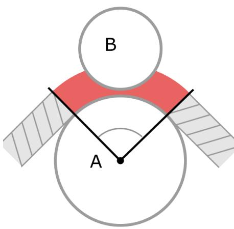

Figure 1.1: Body B is clipping with the Cable wrapped around Body A

are currently the only kinds of cables considered that can already be freely interacted with in scenes of free-moving dynamic objects. However, computational performance and stability gains from using a constraint-based approach is highly benefcial for improving interactability. Allowing longer cables and the forming of more complex cable systems while remaining real-time would give developers much wider possibilities. High stability is also important to allow users to interact with both heavy and light objects and make it less likely that the simulation could break. For the thesis it was decided for these reasons to extend a constraint-based approach to handle pinching.

The cable joints model developed by Servin et al. [\[13\]](#page-63-3) was used as a base for implementing the extension. The extension is named as pinch joints. Of all the constraint-based models assessed, cable joints appeared the most well suited as they accurately model rolling of cables over bodies. The approaches by Servin and Lacoursière [\[14\]](#page-63-4), and García-Fernandez et al. [\[6\]](#page-62-5) both only model frictionless sliding over bodies. Using the general formulation for sliding cables with friction presented by Coulibaly et al. [\[8\]](#page-62-8), cable joints were extended to support sliding as well and thus the pinch joints could be formulated for both rolling and sliding cables.

The goal of the pinch joints is to allow a greater degree of freedom in interaction and design of interactive environments. Allowing objects to pinch cables in ways that make intuitive sense to users is vital in environments with free-moving bodies and unrestrained cables. Specifc situations where this is required might be hard to imagine now, but having the option and freedom will inarguably have an impact on the breadth of possible interactive environments that can be created. There may be novel concepts for video games not before possible or some possible application for training and productivity tasks. If the performance impact can be kept low, there may be possible applications within virtual reality (VR) and augmented reality (AR) environments as well.

## 1.4 Objectives

With the aim of creating an efcient and more freely interactive cable simulation, the work in this thesis extends the constraint-based cable joints model developed by Servin et al. [\[13\]](#page-63-3). The following objectives defne what the work set out to achieve with the extension called pinch joints.

- Pinched cable sections, as showcased in Figure [1.1,](#page-14-0) need to be detected and the bodies need to be moved so that none of them are clipping through the cable. This is so that the cable appears to have a physical width and can collide as expected with other bodies.
- The implementation must be able to handle friction correctly at the pinched cable sections, supporting both rolling and sliding behaviors of bodies against the cable. This is to make the pinched cable implementation more generally applicable regardless of how friction is handled.
- The implementation must be generally applicable to common methods of simulating multi-body dynamics. Having an easily implementable model that can be applied with already established methods such as rigid-body dynamics greatly improves the model's usability.
- Any changes and extensions made to cable joints must preserve the constraintbased approach. Meaning that any new or modifed constraints must be applied directly between bodies interacting with the cable and the number of constraints must be minimal. This is to maintain the computational performance and stability benefts the constraint-based approach provides.
- The proposed implementation must still be applicable in real-time applications, maintaining efcient computational performance and scalability. Proposing an implementation that afects computational performance such that it is no longer viable for real-time contexts would go against the aim of improving interactability.
- The proposed pinch joint model must add desired behaviors to the dynamics of the cable. Users must prefer the new behaviors of the cable. If not, there is likely no reason to use the model.

## 1.5 Research questions

To guide both the development of the pinch joints and gauging their possible contributions, the below listed research questions were formulated and pursued.

- RQ1: How may pinch joints be implemented to accurately reproduce the efects of a cable pinched between two physical bodies in 2D?
- RQ2: How does extending cable joints with pinch joints impact the computational performance and scalability of complex cable systems in a real-time context?

#### RQ3: How does the application of pinch joints afect the user's perception of cable systems' realism as compared to ones without pinch joints?

The first question (***RQ1***) relates to defining and implementing the pinch joints
themselves. The objectives were essential to the development, especially to ensure
this question was answered in a satisfactory manner.The second question (RQ2) posits how performance may be affected as compared to regular cable joints [\[13\]](#page-63-3). This question was formulated to ensure the objective of not making the new implementation not applicable for real-time applications. The performance tests conducted focused on measuring the computational time needed to simulate them as compared to regular cable joints and how well the pinch joints scale in complex cable systems.

The third and final question (*RQ3*) had the purpose of evaluating that the ob-  
jectives chosen to guide the development were sensible and resulted in improving  
the perceived visual behavior of the cable model. This question asks if users will  
notice the difference pinch joints make and if this difference is preferred. The below  
null-hypothesis was formulated to assist answering the research question. The per-  
ceived realism relates to how much like a real cable the simulated cable dynamics  
behave. The smoothness of motion and how well scenarios containing pinched cables  
behave are what is of importance, not how realistic the shading of the cables is. If  
the null-hypothesis is not disproven, it means that the pinch joints contributions  
are not perceivable or there is no consensus in which implementation has the most  
desirable behaviors. In that case, the proposed benefits of pinch joints would need to  
be called into question. Only if the null-hypothesis is disproven and the preference  
leans towards pinch joints can the contributions be considered as positive and would  
give credence to the continued development of constraint-based models for general  
interactivity.Null-Hypothesis: There is no diference between cable joints and pinch joints regarding the perceived realism of their dynamic movement.

## 1.6 Scope and limitations

The complete Pinch Joint implementation was developed in a 2D environment for the sake of simplicity and limiting the scope of the work. The 2D scope is another reason why cable joints were of particular interest. Cable joints simplify the cable interaction with 3D bodies as a series of planar cross sections with which the cable joints are attached at the tangents of these 2D cross sections, making the approach perfectly suited for 2D environments. Compared to the approach of Servin et al. [\[15\]](#page-63-6) where cable nodes are placed at every edge where a cable wraps around a body, cable joints have the potential to be an exceptionally efcient approach for 2D cables. Cable joints handle bodies with a single node/joint each, either as a circle or polygon. What parts of the proposed pinch joints implementation that could be generalized for future 3D implementation is discussed in the thesis as well.

Pinch joints were only implemented and tested with circular bodies due to time constraints during the work. The pinch joints formulation presented should be general enough that extending them to handle polygon bodies should not be difcult. Suggestions are given in the thesis of how to approach that extension.

The cables are considered incompressible or non-deformable when being pinched. This allows for the contact points where the cable is pinched to be handled via standard contact constraints. Formulating elastic constraints to simulate compressible cables is outside the thesis scope.

The cables implemented do not model self-collision of the cable. So, a cable section cannot be pinched by another cable section and sections can cross over each other. This behavior can be justifed in 2D as cables crossing each other just lay at diferent depths of the screen.

The cable joints implementation used for the thesis defnes a massless cable. Simulating the mass was not deemed a required aspect for formulating the pinch joints. It is an aspect that can be researched further, especially if the methods were to achieve more empirically correct physics. The thesis did not have the aim to recreate behaviors as physically accurate as possible. The thesis is more concerned with the overall perceived realism and feel of the cables. That was deemed more important for general interactive purposes of the cable. To rigorously prove the correctness of the cable would require empirical validation and formulation far beyond the required scope of this thesis.

The pinch joints were only implemented and tested within a single simulation framework. That being a velocity-based rigid-body engine and utilizing velocity constraints. Testing diferent frameworks was not of interest to the thesis aim. Pinch joints should be able to be implemented with other frameworks and using diferent kinds of constraints. No reasons were found during development that would indicate otherwise. If a simulation framework is robust enough and implements constraints with equivalent function, they should be applicable.

## 1.7 Outline

Here is an outline of the remainder of the thesis.

Chapter [2](#page-20-0) details all related works and categorize them based on what kind of cable-simulation model they use. A deeper explanation of the characteristics of the diferent model types is also provided. Speculation on how each previous work may handle pinched cables is also given to more clearly lay out the relevance of the thesis contributions.

Chapter [3](#page-26-0) details the scientifc methods used to answer the research questions and discusses how potential validity threats were counteracted. It details how the implementation of the pinch joints was done and defnes the performance tests and user study used to validate the proposed implementation. All identifed considerations about ethical concerns and the potential impacts the thesis contributions may have on society and sustainability are also presented.

Chapter [4](#page-38-0) details the proposed implementation that resulted from this work. The chapter contains all relevant details needed so that together with the given background information of rigid-body dynamics the pinch joints implementation should be able to be recreated.

Chapter [5](#page-46-0) presents all measured results from the performance tests and the user

study that was conducted. The performance results are visualized and presented in ways to better inform the observed performance impacts. The user study results are statistically analysed.

Chapter [6](#page-54-0) discusses the analysed results as well as presenting some thoughts on the fnal implementation. The thesis contributions are evaluated against the thesis research questions and discussed how well the implementation and results answer them. The pinch joints model is discussed in relation to other examined cable models and speculations are given as to how they difer. Finally, it is examined how well the proposed implementation refects the aim presented by the thesis.

Finally, Chapter 7 summarizes the most important findings from the previous dis-
cussion and presents conclusions for how the research questions were answered. The
thesis contributions are explained and how they fit into the larger context presented
by the thesis. Suggestions for future work are given to outline how the proposed
pinch joints model can be further developed and evaluated.
## Related work

Of the examined previously proposed methods for simulating cables, they all fall within three major categories. Servin et al. [\[14\]](#page-63-4) named these as: lumped-mass models, continuum models and constraint-based systems. However this thesis uses constraint-based models instead of systems for the sake of consistency.

## 2.1 Lumped-mass models

The frst category, known as lumped-mass models, is conceptually the most straightforward and simple kind of model. It is based on discretizing the cable form into multiple segments. These segments are usually made up of point masses or rigid bodies and held together via constraints. The parts making up the cable are standard in many rigid-body simulators which make them simple to implement. Many behaviors of cables such as coiling and wrapping around complex objects inherently emerge from modeling the cable itself. However, the computational cost of this kind of model scales with the number of segments, making long cables of high resolution not ftting for real-time applications. Stability is also an issue when handling high tension and heavy bodies. High mass ratios when solving constraints leads to errors as integration methods fail to converge in reasonable time [\[2,](#page-62-4) [14,](#page-63-4) [16\]](#page-63-5). Individual cable segments may be many times lighter than bodies they interact with, and these instabilities stack up with every connected segment in the cable without special handling.

Servin and Lacoursiére [\[16\]](#page-63-5) present a cable made up of rigid bodies. The constraints acting between the bodies simulate stretching, bending and twisting to accurately replicate the dynamics of a hoisting cable. In their formulation they can handle large mass ratios and large forces without issue, while still maintaining the realistic free movement of a cable not in tension. The rigid-body segments would likely be able to recreate the pinching of cables as well. However, it is not of focus for Servin and Lacoursiére, so how robust it may be is uncertain. They showcase no test scenarios handling pinched cables. Being a lumped-mass model, scalability would still be the most limiting factor in how this implementation may be used.

Servin et al. [\[15\]](#page-63-6) showcase with another lumped-mass model a way of solving both the inherent performance and stability issue. By dynamically splitting and merging segments based on cable tension, cable resolution can be focused specifcally where it is needed. A portion of a cable not under high tension is split into more segments to allow for bending. But when a portion is put under high tension, all these extra segments are unnecessary as they all will be pulled into a straight line anyway. So, the implementation can merge all these segments together, efectively becoming a single constraint between the attached bodies. The optimization algorithm is made to prioritize stability. Every constraint chained between segments can compound their errors in the simulation, especially when dealing with high forces. So, limiting the number of constraints in high-tension portions of the cable greatly improves the robustness of the cable dynamics. This lumped-mass model does not make use of rigid-bodies for its segments, so pinched cables are unlikely to be properly simulated. So, there is little that was used from this model when developing the pinch joints. Although the optimization algorithm may be of particular interest for future work. The dynamic splitting of loose cable segments could be an efective way to reintroduce some cable behaviors in constraint-based models, to allow bending and coiling of untensioned cable sections.

Jiang et al. [\[9\]](#page-62-6) showcases an intriguing implementation and use case for a lumpedmass model. Utilizing position-based dynamics they were able to simulate cables with a very high resolution of segments consisting of spherical bodies. The cable supports self-collision, where the cable can collide with itself, which would suggest the simulation approach could handle pinched cables. With the model, they developed training software for simulating mooring lines in shipyards. Their model achieves remarkable stability and function with large forces. Again, the performance may be of question if the proposed model could see widespread use in less specifc applications.

A more modern paper by Westin and Irani [\[23\]](#page-63-8) achieves a real-time lumped-mass model with a very high physical correctness. The approach does not model cable width however, so pinching is likely not handled. The physical models and defnitions used were not of interest to the thesis as computational performance was prioritized higher than physical correctness. Their proposed model will have applicability where physical correctness is more important.

## 2.2 Continuum models

Servin and Lacoursière [\[14\]](#page-63-4) describe continuum models as being similar to lumpedmass models by modeling the cable as multiple segments. However, the segments utilize diferential equations derived from solid mechanics instead of more standard rigid-body dynamics. For specifc applications they are the most physically accurate, but they seem to struggle when interacting with too many bodies and attachment points. For more general and dynamic interaction in virtual environments they are not yet mature enough Servin and Lacoursière [\[14\]](#page-63-4) claim.

An example of a continuum model is seen in Pai's [\[18\]](#page-63-1) paper using so-called cosserat models to simulate interactive surgical threads. This thesis is more concerned with more general dynamic interactions of cable systems rather than simulating the exact and accurate material properties of the cables. Therefore, very little attention was given to these kinds of models when formulating the cable-model for the thesis.

## 2.3 Constraint-based models

The main idea with constraint-based models is to simplify the simulation of a cable to only simulate the specifc efects and behaviors needed by a particular application. They are often able to describe systems of cable dynamics with a very limited number of constraints. Most of the previously mentioned kinds of cable models do also use constraints for their dynamics. The important way constraint-based models diferentiate themselves according to Servin et al. [\[14\]](#page-63-4) is in how they defne the cable itself as a constraint directly applied between bodies in a cable system. The efects of a cable on bodies are what is simulated, not the cable itself. In some cases, cables connected between an arbitrary number of bodies and connection points can be solved with a single multi-body constraint. The advantages given are that performance is usually the best it can be as the cable dynamics are reduced to their most important aspects.

The desired cable dynamics may also be more meaningfully adjusted and modifed to reach specifc qualities of stability and feel. For lumped-mass models where the cable dynamics are more of an emergent behavior of the interconnected segments, adjusting the parameters of the cable may have undesired impacts to several of the cable's behaviors while with constraint-based all behaviors are more explicitly created and can be modifed separately.

Müller et al. [\[13\]](#page-22-0) models their cable joints implementation as a series of unilat-  
eral distance constraints attached between bodies. There is one constraint placed  
between each pair of bodies which the cable wraps around. Unilateral means that  
each constraint only acts upon its two attached bodies. A distance constraint en-  
forces that the distance between two points does not exceed a certain rest length. The  
constrained points of the distance constraint are continuously updated to correspond  
with the tangential points of the attached rolling bodies. Rotation and movement  
of the attached bodies may add rest length to the attached body or pass it over to  
another cable joint. For simulating pulley systems with non-slipping cables, this is  
likely the most efficient way possible. Utilizing only  $n - 1$  constraints for  $n$  attached  
bodies and the length of the cable is entirely irrelevant to the performance of the  
simulation. This simplicity does however mean there exist no inherent handling of  
pinched cables, the sections of cable that are in contact with bodies and wrapping  
around them, physically does not exist, only being represented by the attachment  
points on the body and a float keeping track of the amount of stored cable. However,  
this complete lack of dynamics when bodies intersect the stored sections of cables  
meant it was easy to add in the specialized procedures needed for implementing  
pinch joints. So, cable joints were used as the base for implementation in this thesis.  
The base cable joints were also extended to support sliding cables for the thesis by  
utilizing the general sliding cable formulation made by Coulibaly [\[8\]](#page-22-0).A recent paper by Lloyd et al. [\[12\]](#page-63-2) applies a similar approach to Müller et al. [\[13\]](#page-63-3) in simulating muscle fbers wrapping around arbitrary surfaces. They are alike in that the forces/impulses applied to a wrapped body by a cable can be entirely simulated and applied at the two edge points where the cable contacts the body surface. Instead of approximating the wrapped portion of cable as a static planar intersection of the body, Lloyd et al. [\[12\]](#page-63-2) introduces a much more dynamic approach that allows the two edge points of the wrapped cable to move independently in any direction on the body surface. The result is a wrapping behavior much more ftting for 3D environments. This wrapping algorithm could potentially be used for extending pinch joints for 3D. As is, the implementation by Lloyd et al. [\[12\]](#page-63-2) does not model the width of their muscle fbers so the paper was of little use when formulating the pinch joints implementation.

Servin and Lacoursière [\[14\]](#page-63-4) and García-Fernández et al. [\[6\]](#page-62-5) both present similar models that utilize a single distance constraint acting upon an arbitrary number of connected bodies. The constraints consider the length of each segment of cable between all bodies in the cable system and applies equal tension force on each body to uphold the total length. They can achieve this as they model completely frictionless cables. They were mainly developed for simulating hoisting cables, such as those used in gantry cranes where the weight and friction of a cable is inconsequential compared to the large forces at play. The single constraint is more computationally heavy compared to the simple distance constraints of cable joints and calculating the constraint scales linearly with the number of attached bodies. A minimal number of constraints does however allow for simulation solvers to converge more quickly [\[2\]](#page-62-4), saving performance that way. These implementations also do not in any way model the dynamics of pinched cables.

Sinecky's implementations for the games Uncharted 4: A Thief's End and The Last of Us Part II [\[7\]](#page-23-7) both use a hybrid of lumped-mass and constraint-based methods. The cable takes advantage of both models' strongest aspects. The cable is primarily a lumped-mass model where interconnected point masses make up most of the cable behavior and visuals. A constraint-based system is also in place which takes into effect whenever the cable is stretched taut. The cables were used for climbing, grappling, swinging and solving puzzles in both games. As mentioned in Chapter 1 a 14meter limit was enforced due to the computational cost of the lumped-mass model. Uncharted 4 does at times make use of a longer cable in the form of a winch connected to a terrain vehicle. In that case it was only the constraint-based part of the cable that was driving the cable dynamics. Having the winch always pull the cable taut helped justify the straight sections of the cable. The games stand as very good proof of concept of what high-quality cable simulations may be used for in interactive environments. But they also showcase the current limitations clearly as well. Those being the limited performance and limited freedom of where the cables are used in the games. The usage of dynamic objects together with the cables where both can affect each other is very limited and controlled in both games, hinting that pinching is something they could not handle. For most interactions, the cables wrap around and interact with static geometry.## 2.4 Summary

In summary, no other examined implementations of cable simulation have directly focused on the dynamics of pinched cables. Lumped-mass models may still be able to replicate the correct behaviors for pinched cables but tend to not scale as well in performance as compared to constraint-based models. This thesis presents an implementation called pinch joints which is an extension of cable joints [\[13\]](#page-63-3). The extension allows cable joints to handle pinched cables which greatly increases the

#### 2.4. Summary 17

ability for the cable model to interact with free moving dynamic bodies, leading to much more freedom in what scenarios they can be used in.

# Method

This chapter details the scientific methods chosen to answer each research question. Why particular methods and tests were chosen is explained and justified. Threats to validity are brought up and how they were counteracted is explained. Finally, the ethical, societal, and sustainability impacts of the developed technology and the methods to produce it are considered.## 3.1 Implemeantation approach

Answering the first research question (RQ1) facilitated first conducting a literature
study. The literature study set out to examine what different kinds of cable simula-
tion methods exist and to what extent they could handle pinched cables. Once the
thesis decided on cable joints by Müller et al. [\[13\]](#page-13-1) as the base for developing pinch
joints all related works were re-examined for how they could assist the development.
The literature study was not conducted as a structured literature review.Implementation was then used to answer (RQ1) once sufficient information was
found to formulate the pinch joints. The implementation was carried out by a single
person with some assistance from a supervisor over an eight week period. Develop-
ment was conducted in a waterfall manner, starting with implementing the sliding
joints for cable joints, then implementing a collision algorithm for detecting pinched
cables, and lastly formulating the dynamics and constraint configuration for the
pinch joints. All development and testing were conducted on an Asus Zenbook Pro
Duo UX582HM laptop. It had an Intel I7-11800H processor with eight cores, 16
gigabytes of memory and a one terabyte SSD. The GPU was a Nvidia Geforce RTX
3060 laptop GPU and ran with Windows 11.Only a single complete implementation of pinch joints was developed and tested, making it more a prototype for proof of concept. The implementation was made in the commercial game engine *Unity3D* using *C#* scripts. This was done so the built-in physics-engine could be utilized for the rigid-body dynamics, saving time and also keeping to the objective of making pinch joints widely applicable. The implementation was made single threaded.Details of the resulting proposed implementation is presented in Chapter [4.](#page-38-0)

## 3.2 Performance experiments

When the implementation of pinch joints was completed, the second research question *(RQ2)* was answered via experimentation. The question consists of two parts, measuring the computational impacts of pinch joints and how they scale in comparison with cable joints. Figure 3.1 showcases all the different configurations of cables and circular bodies/pulleys used to test and measure the performance impacts of the pinch joints.The most vital thing to prove with these experiments was that the pinch joints do not perform so poorly as to make them unapplicable in real-time environments. Thus, the thesis focused on only measuring computational performance.

It is common practice for other works presenting new simulation methods to  
showcase measurements of simulation stability. This is usually done by measuring the  
position errors once the solver has converged to a solution. Such experiments would  
have been beneficial for proving the robustness of the pinch joints. However, they  
were deemed unfitting for this thesis due to how the pinch joints were implemented  
in *Unity3D*. As detailed in Chapter 4, the implementation and solving of the cable  
constraints are disconnected from the built-in physics-engine and its solver. As a  
result, measuring the stability of the pinch joints solver would not reflect the actual  
positions of all bodies that are shown to the user. When the built-in physics-engine  
increments it may override some of the impulses applied by the cable-simulation  
layer and lead to some position errors. Overall, this is an unideal configuration and  
thus standard stability analysis methods may not produce any useful data. This is  
something that will have to be researched further by integrating the cable simulation  
directly with a physics engine.

The performance tests focused mostly on measuring the overall real-time performance of pinch joints. More experiments could have been done to precisely measure and test how diferent parts perform in diferent scenarios. However, as the implementation was more akin to a prototype and proof of concept, such detailed analysis of the performance was seen as unnecessary. Only the pinch-intersection algorithm was more closely examined with a specialized experiment confguration as it was expected to have the most signifcant impact on performance.

All the experiment configurations detailed in the following sections were per-
formed multiple times. Each time the basic scene setup was duplicated to stress the
system with different loads. Figure 3.1d shows the pinched cable stress-test con-
figuration from Figure 3.1a duplicated five times, representing a load of 5. Each
experiment configuration was measured at load 1, 2, 5, 10 and 20 to build an un-
derstanding of the performance impacts and how they scale. An important detail
to note is that the duplication of the pinched cable stress-test generates additional
pinched sections between the duplicated groups of pulleys. So in total, for a particu-
lar load i there are  $4i$  pulley bodies,  $4i$  regular cable joints and  $4i + 2(i - 1)$  pinched
sections of the cable.### 3.2.1 Stress tests

The main experiment performed was a series of stress tests intended to represent a potential worst-case scenario when confguring a scene with a cable. If the worst-case

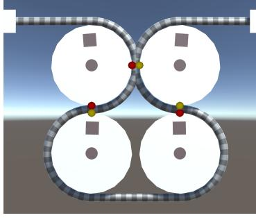

(a) Experiment configuration with pinched cables intended to stress test the pinch joints implementation. (b) Experiment configuration without pinched cables intended to stress test the implementation without pinch pinch joints. (c) Experiment configuration for testing the intersection-detection algorithm used for pinch joints.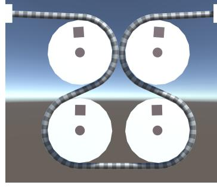

(b) Experiment configuration (c) Experime  
without pinched cables in-  
tended to stress test the im-  
plementation without pinch  
joints.  
for testing t  
detection alg  
pinch joints.

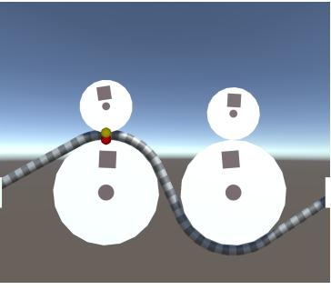

(b) Experiment configuration (c) Experiment configuration  
without pinched cables in- for testing the intersection-  
tended to stress test the im- detection algorithm used for  
plementation without pinch pinch joints.

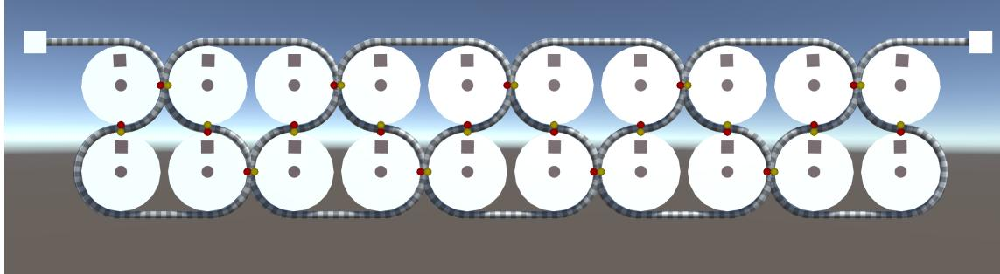

(d) Example of the pinched cable stress-test confguration duplicated fve times, meaning this particular test has a performance load of 5.

Figure 3.1: Screen captures of the diferent experiment confgurations that could be duplicated to test diferent loads of the simulated systems and measure their realtime performance. The pulley bodies are constrained to not move their positions in the scenes but are able to rotate. the small red and yellow circles represent pinch contacts.

scenario can still achieve real-time performance in complex scenes, then the pinch joints are generally applicable in real-time contexts.

Figures [3.1a](#page-28-0) show one load section for the experiment confguration stressing the pinch joints implementation. The purpose here was to stress the cable and the pinch joints as much as possible and see if they still can be considered real-time. The confguration of pulleys and the cable was chosen as it produces many pinched cable sections of both transitional and non-transitional variety. The pulleys are placed close enough to cause pinching at four places along the cable, two transitional and two non-transitional. The two non-transitional pinched sections are between the upper pulleys and inhabit the same point in space which is why it only appears as a single pinch contact. When the confguration is duplicated for higher loads, it also causes additional non-transitional pinching between the duplicated sections as well.

The base cable joints implementation was also stress tested with a similar scene confguration. The one diference between the confgurations being that the pulleys were placed further apart as depicted in Figure [3.1b.](#page-28-0) The version of cable joints implemented for the thesis breaks when the setup features pinched cables, which is why they had to be spaced out more. Chapter [4](#page-38-0) explains how the cable joints implementation fails when pinching a cable.

The purpose of stress testing the base cable joints was so the performance of
pinch joints can be compared to that of cable joints. Testing both implementations
for several loads also allow for analysis of how they scale differently as well. That
should provide satisfactory information to answer *(RQ2)*.### 3.2.2 Pinch-intersection

The experiment confguration in Figure [3.1c](#page-28-0) was specifcally used to measure the performance impacts of a particular subsystem of pinch joints. This experiment is not essential for answering if pinch joints can be run in real-time, but it will allow deeper understanding of what impacts the performance of pinch joints.

This experiment confguration specifcally tests the collision/intersection detection used to fnd pinched sections of cable. This was an aspect of the pinch joints that was expected to have a more signifcant impact on performance and thus warranted closer analysis. It is also a step in the pinch joint algorithm which is exclusive to pinch joints.

This confguration is simpler than the stress tests. The cable alternates its wrapping orientation on consecutive pulleys and has smaller pulleys fall on top. This gives an equal pair of bodies that pinch a cable and bodies that do not pinch a cable. The purpose of this setup was to understand the performance of the pinch joints intersection-detection algorithm. Four categories of tests were conducted, one with both the smaller pulleys lying against the larger and the cable as depicted in Figure [3.1c,](#page-28-0) one with the pinching pulley removed, one with just the non-pinching pulley and fnally one with both the smaller pulleys removed. As will be explained in Chapter [4,](#page-38-0) the pinch-intersection algorithm has several layers of tests and removing the diferent pulleys in the experiment should cause measurable diferences in these layers' performances.

### 3.2.3 Experiments validity

The built-in profling tools of Unity3D were used for all performance measurements. The profling tools allowed for measuring CPU execution times of code sections. This is preferred over measuring the wall clock time. Measuring the CPU time allows for more accuracy understanding how much computational time is taken up by the measured algorithms without variances introduced by the operating system scheduler. The same laptop that was used for implementation was used to run all experiments.

Variance in computational load and scheduling is one of the major threats to validity when doing any measurements of execution times in computers. Before running any test, it was ensured that there were minimal background programs running concurrently with the tested software. If there were processes that needed to be run, like applications for documenting the results, it was made sure that the same applications were running concurrent with every experiment so that the system load would be equivalent for all measurements.

#### 3.2. Performance experiments 23

When executing an experiment confguration, it was allowed to run for a few seconds to ensure all application setups had completed and thus allow for more stable measurements. The profling tools were then used to capture frames. Four random frames were then chosen, and the relevant sampled execution times were manually read and used to make averages. Ideally this process would have been automated, and the execution times of hundreds of frames could have been used for much more accurate results. However, the variances in execution times for each frame were low thanks to previously mentioned countermeasures and the stress tests were designed to not have any movement or variances in cable elements that would result in varying loads. Aggregating averages from four frames should be reliable enough for the purposes of this thesis.

All experiment confgurations used bodies that did not allow sliding of the cable. The reason being to get more stable measurements as sliding could cause groups of pulleys to slide and use diferent constraints for solving. So, ensuring all segments in the cable was simulated the same way was achieved using the non-slipping bodies. All cable segments were also initialized to be in constant tension, ensuring all constraints had to be solved every frame and resulting in a constant load on the system. This helped add even more stress as well, ensuring a worst-case scenario for each experiment confguration.

A fnal concern that may arise from the design of the stress tests is how diferent the confgurations for stressing the pinch joints are in comparison with the cable joints confguration. First there is the aspect of separating the pulleys for the cable joints stress tests. This, however, should not have any real impact on the measured performance. That is because the dynamics of cable joints are unafected by how far away the wrapped bodies are from each other. The elements that do have an impact on performance are just the number of segments which remain the same regardless of the distance.

A potential performance diference in the general system when spacing out the bodies, is that the built-in physics-engine may vary in performance. All measurements were made exclusively on the cable-simulation parts of the system, so this should have had a negligible impact on the results.

A more concerning diference that requires more consideration when comparing the two implementations' results is that pinch joints simulate far more physical elements in their confguration. Apart from simulating all the same dynamics as cable joints, it also simulates the dynamics for the pinching behaviors as well. Thus, for each load tested, the number of simulated elements and the complexity of the scene scales far worse for the pinch joints.

This is likely an issue for any scene confguration as the pinch joints simply allows for more complex behaviors to take place in a scene. To counteract this and make clear the true complexity of the tested confgurations, all the simulated elements in a particular confguration is tallied and presented with the results in Chapter [5.](#page-46-0) Analysis of the performance measurements uses these tallies of elements to compensate for the potential validity threat.

## 3.3 User study

For the third and final research question *(RQ3)* it was decided a user study was
the best fitting research method to give an answer. Quantitative analysis is usu-
ally conducted within computer graphics to evaluate the correctness of rendering
methods compared to some reference material. However, any such analysis would be
exceedingly difficult to conduct as the correctness of the animation and motion of the
cable simulations is what must be evaluated. Small differences in starting conditions
and simulation methods could lead to potentially very different timings of when and
how the phenomena investigated occur in time. Making it difficult to quantifiably
compare the behavior to some reference material.

Measuring the shortest distances between bodies pinching a cable would provide
a quantifiable way of measuring how well clipping is minimized. However, such
an analysis would just assume that minimal clipping of the cable is something that
users would notice and prefer. Investigating if that assumption is true or false is what
(RQ3) is about. There just does not really exist any viable quantifiable analysis
methods that could be applicable to evaluate the human perception of the cable
movements. Future methods utilizing AI models could possibly be used one day, but
for now, a user study was the most sensible method.

### 3.3.1 Test design

The user study utilized a Two Alternative Forced Choice (2AFC) test. The approach used was very similar as to how Sundstedt et al. [\[21\]](#page-63-9) utilized a 2AFC test to evaluate the perception of diferent rendering methods. A 2AFC test is a method used for evaluating the perception of stimuli [\[22\]](#page-63-10). Upon being subjected to a particular stimulus, in this case being shown two diferent cable simulation demonstration, the user is forced to make a choice of which they prefer, efectively quantifying the complex mechanisms of perception into a quantifable metric. It seemed a sensible and simple way of evaluating the vague question of which cable simulation feels the most like a cable.

More in-depth and detailed data about the user's perception could have been collected to give a more nuanced view of their preferences for pinch joints. Sliders could have been used so users could with a higher nuance rate and evaluate how much they enjoyed each cable simulation demonstration. However, for the purposes and scope of this thesis, it was deemed sufcient to know if there exist any preference at all. If it could be shown that users can perceive a diference and prefer pinch joints, that is enough to justify future development and evaluation of the simulation method.

An application was developed and used which presented the participant with two videos at a time. Both demonstrations would showcase the same test scene and confguration of the cable and objects, but one showcased the pinch joint implementation and one showcased the cable joints implementation. They then were prompted to choose the demonstration that appeared most realistic. The participants were not informed which demonstration corresponded to which implementation.

See Figure [3.2](#page-32-0) for a screencap of what the participants saw. The stimuli take up most of the screen, displaying the two video demonstrations at the same time.

#### 3.3. User study 25

The videos would loop indefnitely and there were no time constraints from the tests so that the participants could observe and make their decision without pressure or stress. There was technically a time limit as each test session was only booked for 15 minutes for each participant. Although the entire test usually took less than 5 minutes to complete, so it should not have been a factor afecting the participants' answers. During the frst loop of the videos there would be no buttons visible to make a choice. This ensured the participants watched the entire video demonstrations at least once. The user interface was kept at a minimum to not distract from the demonstrations, only consisting of a text prompting them to choose the most realistic, two buttons to make the choice of demonstration, a text telling the participant how many questions remain and lastly an exit button in case the participant wished to interrupt the test.

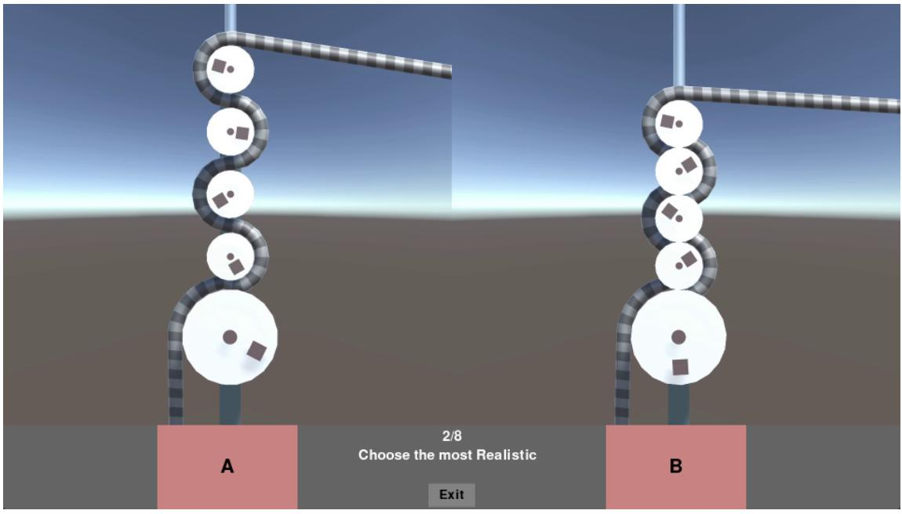

Figure 3.2: Screencap of how one of the demonstrations were shown to the participant together with the test's user interface.

In total there were eight demonstrations and eight choices collected per participant. There were mainly two visual aspects of the pinch joints the demonstrations aimed at showcasing. The clipping or incompressibility of the cable and the frictional sliding or rolling of pulleys pinching the cables.

For showcasing the clipping there were six demonstrations of which Figure [3.3](#page-33-1) shows an example of these. The participant was expected to notice how the left cable had the rolling pulley clip through the cable and roll directly on the large pulley while in the right demonstration the pulley is rolling along the top of the cable. An important remark regarding this example and a few of the other clipping demonstrations, is that they were not possible to be performed using exclusively the cable joints implementation made for the thesis. As mentioned earlier and further explained in Chapter [4,](#page-38-0) the cable joints implementation would break when pinching cables. The results would manifest as jittery and unpredictable movements for the cable joints demonstrations. Parts of the pinch joints' implementation had to be used to correct the behavior of the cable joints as the phenomena investigated was if participants would notice and care about the clipping. Having one of the demonstrations show clearly broken and physics defying behavior would not as strongly show the preference for the contributions of pinch joints. So, the implementation used in Figure [3.3](#page-33-1) and a few other demonstrations uses the pinch joints but with their contact-constraints disabled.

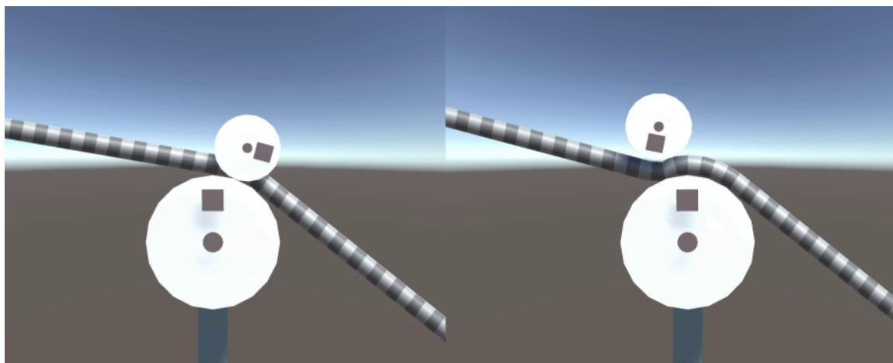

Figure 3.3: Still frame of one of the user study demonstrations. A pulley rolls down the left side of the cable, rolls onto another pulley pinching the cable and then rolls down the right side. The right demonstration shows the pinch joints implementation where the cable is not compressed by the pinching pulley as is the case in the left demonstration.

Two demonstrations were created to showcase the frictional aspect of the pinch joints, one of which is shown in Figure [3.4.](#page-34-1) In the example it would be possible to see with the pinch joints' implementation how the small driven pulley would steadily accelerate the cable and the cable in turn would steadily accelerate the rotation of the large pulley. The common point of these two demonstrations was to showcase how a pulley in contact with the wrapped section of a cable is not able to interact with the cable when the cable joints implementation is used while with the pinch joints they can.

### 3.3.2 Statistical analysis

The resulting data was statistically evaluated using the chi-square analysis method
with two groups as the measured data was categorical [\[20\]](#page-33-0). For the calculation it is
assumed that the two options in each choice should have equal distribution of being
picked, meaning a 50% chance that a participant chose either of them. This is the
null-hypotheses which can then be statistically tested with chi-square if the actual
observed distribution follows the assumed equal distribution. The calculation results
in a probability  $p$  of how likely it is, given the expected distribution, that the actual
distribution occurred by pure chance.If the actual distributions are not equally divided and the  $p$ -value is less than
0.05 then the null-hypothesis can be rejected. Using 0.05 as a threshold is standard

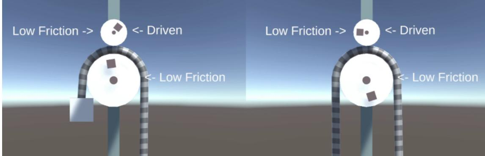

Figure 3.4: Still frame of one of the user study demonstrations. The pulleys in these demonstrations both have low friction and the smaller pulley on top is made to rotate clockwise. What happened in the right demonstration, which has the pinch joint implementation, was that the small pulley would gradually start accelerating the cable which then through friction would gradually cause the large pulley to rotate as well. In the left demonstration with cable joints there would be no movement of the cable or large pulley at all due to the lack of handling pinching.

practice, meaning there is more than a 95% certainty that the null-hypothesis is false.
Such a p-value is considered as statistically significant and it can be assured there is
a difference in the two stimuli [\[21\]](#page-9-1). Preferably there will be a statistically significant
preference for the pinch joints.### 3.3.3 User study validity

An important validity threat to counteract when conducting a user study is minimizing infuencing the participants' answers. The frst tactic used was to not inform the participants which demonstrations in the 2AFC test corresponded to which implementation, it was important to not bias the user into making the preferred choices for the thesis. The only information participants received before the test was limited as well. They were informed that they would be shown diferent cable simulations and would evaluate which looked most realistic. No details were given about what aspects of the simulations were diferent, even a diferent working title was used to not mention anything about pinching. This should have ensured there was no bias introduced by the study information which afected the participants' own perceptions of realism.

The tests were carried out in person to ensure minimal environmental distractions and that the display settings showcased the stimuli clearly. Each test was monitored as well to ensure the application worked correctly in showing the demonstrations. An important consideration when observing and conducting the experiment was that the observer made sure to be seated behind the participant and out of view. This again is to ensure the conductor does not unknowingly infuence the participants' decision making.

Before each test began the participants were asked to sit down in front of the computer running the application, and to read the information and instructions page that was displayed. They were also told to preferably ask any questions they had before starting the test. Some participants did still ask questions during the test, but they were only answered if they were about clarifying or reminding them of the starting information. All questions regarding specifc demonstrations and choices were not answered as to not infuence their choices with information other participants could not get purely from observing the stimuli.

After a test was completed, the participants were given two optional free text questions. The frst asked if they could name or describe any common details in the demonstrations that informed them of their decisions. Not vital for evaluating the efectiveness of the pinch joints but still of interest to see if they could notice common patterns or describe the behaviors added by the thesis implementation. The second question asked if they had any thoughts or criticism regarding the test set-up and execution. If the participants thought there were any elements of confusion or unclear instructions it was important for that to be expressed. These questions mainly served the purpose of validating the user study itself and how it was conducted.

Some considerations were made to ensure there were no other patterns in behavior of the participants that could afect the validity of the chi-square analysis. The order of the demonstrations was always randomized for each participant. Had the order not been randomized it could have skewed the results of demonstrations appearing at the end of the test. Participants would likely pick up on what aspects of the cable simulation to look at, thereby afecting their reasoning later in the test. Randomizing the order should more evenly divide how this phenomenon afects the results of the individual demonstrations.

Which side of the screen the pinch joints and cable joints implementations were displayed were also randomized. Participants may have realized that their preferred implementation always appears on the same side which would infuence them to be more likely to continue picking the same side. Also, if the participants could not tell the diference between demonstrations, preferences of choosing right or left may have introduced false preferences of implementations.

One threat to validity that still may afect the results of the user study is the number demonstrations. The thesis only had time and resources to create eight demonstrations which are quite few. This is a limited number of scenarios and setups to evaluate the general preference of pinch joints, especially for the frictional aspects which only had two demonstrations. Ideally there would be many diferent versions of each demonstration with difering size bodies, diferent confgurations and difering cable widths. Any observed preferences would be far stronger. There may also be higher risks with few demonstrations that faults and issues in one demonstration may have signifcant efects on the overall analysis.

With the resources and time available to the thesis work, the few demonstrations produced were prioritized to be distinct and showcase pinching in as wide a context as possible. The bodies used and cable width were confgured to make the pinching behaviors as clear as possible. Thus, the demonstrations should still be able to evaluate if there are preferences for pinch joints.

## 3.4 Ethical, societal and sustainability aspects

During the execution of the user study, careful consideration was taken regarding the handling of personal information of the participants. No personalized data was needed for the tests performed so there were minimal ethical risks that needed assessment. No risks for mental or physical harm were identifed either. Only those of age above 18 were accepted as participants and participation was entirely voluntary. It was made clear to the participants that they were free to leave at any point of the test without giving a reason. All this information was provided to them via an information letter and the information screen before starting the test also repeated the same information. To proceed from the information screen, the participant had to tick a box ensuring they had read and understood the information and that they were giving informed consent to proceed. After the fnal choice was completed, the participant was presented with an end screen where they had to press a button themselves to save the choices they had given. This was to give them a fnal chance to interrupt the user study before the results were saved and aggregated with the rest of the user study results.

As for ethical considerations. The technology developed and the methods used in this thesis were not expected to have any negative efects on societal and sustainability aspects. The thesis seeks to extend the available tools when creating cable simulations in real-time applications. They should only help add to and extend the possible experiences available to users. Games can implement more complex and intuitive cable simulations as game mechanics, giving more freedom to create novel and quality gameplay experiences. These simulations could potentially be used for simulating and training workers in various felds as well.

It could be argued as well that the proliferation of this work could eventually replace less efcient cable simulations, thereby saving energy by not consuming as much electricity in users' computers. This would have a positive efect on sustainability. The improved efciency would also allow for users with less powerful hardware to also beneft from the applications using these cable simulations.

# Implementation

The cable joints and pinch joints were implemented in the game engine *Unity3D* using C# scripts. The built-in 2D physics engine, *Box2D*, uses velocity-based rigid-body dynamics. The implemented cable simulations functioned by reading and correcting the velocities of the rigid bodies using velocity constraints. Biased velocity-steering was also utilized to correct position errors. All simulation logic and solving took place inside the *FixedUpdate* event, which was always executed before the physics engine was incremented.This method of integrating the cable physics is not preferred as the cable's constraints and the other physics-engine constraints are solved separately, and the physics engine may override the cable's velocity adjustments. Ideally the cable's physics would be directly integrated with the physics engine of the application it is implemented in, which would improve both performance and stability. The indirect implementation that was used did not result in major problems and still worked well as proof of concept for pinch joints.

An overview of the timestep procedure is shown in Algorithm [1.](#page-38-1) Explanations of each step and the importance of their execution order will be provided throughout this chapter.

|     | Algorithm 1 2D Pinchable Sliding Cable Algorithm. |
|-----|---------------------------------------------------|
| 1:  | procedure TIMESTEP                                |
| 2:  | UpdateSegments()                                  |
| 3:  | RemoveJoints()                                    |
| 4:  | intersectedBodies ← SegmentIntersections()        |
| 5:  | AddJoints(intersectedBodies)                      |
| 6:  | nearContacts ← PinchBroadPhase()                  |
| 7:  | contacts ← PinchNarrowPhase(nearContacts)         |
| 8:  | pinchJoints ← PinchConfirm(contacts)              |
| 9:  | ConfigurePinchJoints(pinchJoints)                 |
| 10: | SlidingUpdate()                                   |
| 11: | segmentConstraints ← SegmentsInit()               |
| 12: | contactConstraints ← ContactsInit()               |
| 13: | Solver(segmentConstraints, contactConstraints)    |
| 14: | end procedure                                     |

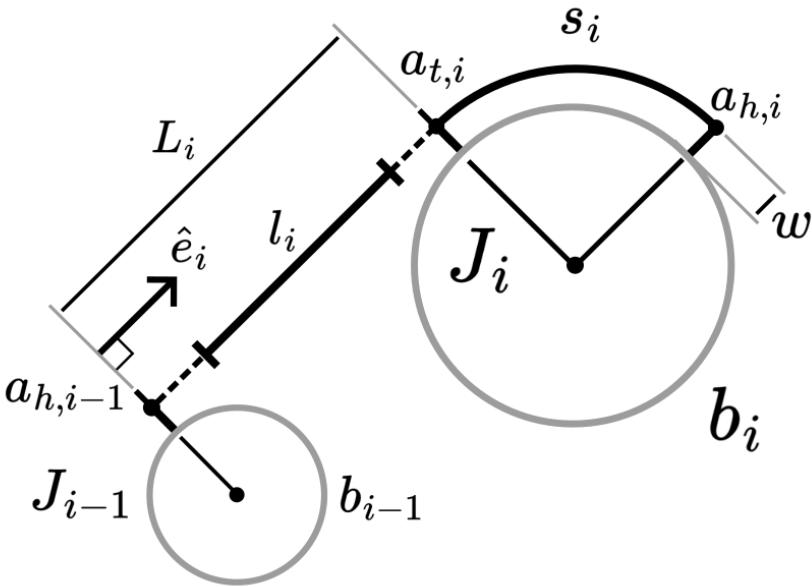

Figure 4.1: Joint variables and notation used for describing the implementation visualized.

## 4.1 Cable joints implementation

Müller et al. [\[13\]](#page-39-1) describe their model as consisting of joints, which are the segments
of cable that are between bodies, and links, which handle the attachment points of
joints on particular bodies. This thesis combines the links with the joints as can be
seen in Figure 4.1 for a particular joint  $J\_i$ . Each joint in a cable has thus a link part
and a segment part and is always paired with one body  $b\_i$ . All cables are defined
as a certain sequence of joints which can dynamically add and remove joints as the
cable interacts with new bodies and loses contact with others.The link part of  $J\_i$  has two attachment offsets  $a\_{t,i}$  and  $a\_{h,i}$  that are the global
offset vectors from the body center of mass and the segment attachment points, the
 $t$  and  $h$  stand for tail and head, respectively. The tail is the previous joint in the
cable, and the head is the next joint in the cable. Thus  $a\_{t,i}$  is the attachment going
towards the tail joint and  $a\_{h,i}$  is the attachment going towards the head joint. The
attachments for rolling links consist of the tangent points between two bodies.These attachments are also offset by a  $w$  amount from the body surfaces, where  

 $w$  is half the cable width. This is important as the attachment points are used for  

solving the constraints, which consider all impulses to be applied in the middle of the  

cables.  $s\_i$  for rolling links is the amount of cable length stored on a body, it is equal  

to the length of the wrapped cable between the tangent points  $a\_{t,i}$  and  $a\_{h,i}$  including  

the  $w$  margin from the body surface in the calculation. The cable width is the same  

for all joints that are part of the same cable.The cable segment of the joint is defined as a straight line between the attachment
points  $a\_{h,i-1}$  and  $a\_{t,i}$ . Note how the line starting point is the head attachment, which
belongs to the tail joint  $J\_{i-1}$ . Thus, the segment of a particular joint  $J\_i$  goes from their
tail  $J\_{i-1}$  and then to their own link, giving the segment unit vector  $\hat{e}\_i$  in Figure 4.1.If a joint does not have a tail, which happens with the starting joint in a cable if the cable is not looping, it does not have a segment. Each segment has a certain amount of rest-length  $l\_i$  which can be passed over to other segments when bodies are rolling or be stored in joint links when more cable is wrapped around them.  $L\_i$  is the actual distance between the two attachment points. It is the task of the segment/joint constraints to enforce that  $L\_i <= l\_i$ .The structure and notation for the thesis implementation difer from that of cable joints, but it should be equivalent in functionality to the model described by Müller et al. [\[13\]](#page-63-3). The inclusion of cable width is not strictly needed for cable joints, as long as all corrective impulses are applied tangentially to the attached bodies.

The pinch joints implementation and additions will now be detailed in the next section.

## 4.2 Pinch joints

Pinching occurs when a body intersects the wrapped portion of the cable stored in a joint link. This can happen in two distinct ways, as illustrated in Figure [4.2.](#page-40-1) These are the non-transitional pinch joint, or non-transitional pinch joint, of Figure [4.2a](#page-40-1) and the transitional pinch joint of Figure [4.2b.](#page-40-1) The non-transitional pinch joint happens when a body intersects the wrapped portion of the cable on a joint link. The transitional pinch joint is a special case where the tail or head joint is attached to the pinching body, so the cable transitions over from one body to the other at the point of the pinch contact. Both cases generate exactly one contact point between the circles where the cable needs to separate the two bodies. For polygons there would be multiple possible contacts to handle.

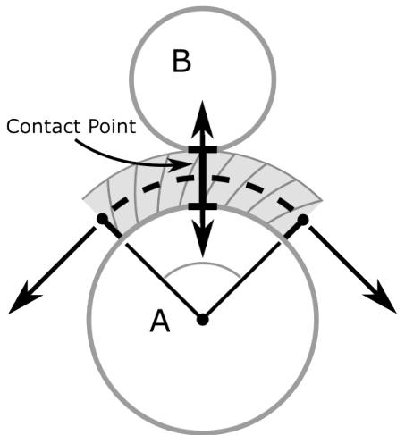

(a) Non-transitional pinch joint where the cable is only wrapped around Body A.

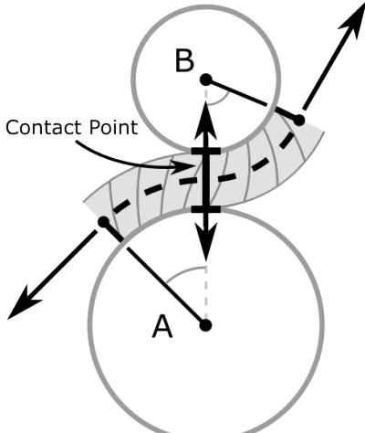

(b) Transitional pinch joint where  
the cable is wrapped around body A  
and then transitions at the contact  
point to wrapping around body B.

Figure 4.2: The two types of pinch joints applied on two bodies and separating them with a contact point, enforcing the cable width.

The cable joint implementation falters in various ways depending on the pinching  
type. Nothing happens for the non-transitional pinching case. Intersection tests are  
only performed for joint segments. A body pinching this way would only be attached  
to the cable once it moves into intersecting one of the joint segments. For transitional  
pinching there is more to delve into as parts of the desired behavior for pinching  
actually are present, just very faulty and jittery.### 4.2.1 Transitional pinch joints

Due to how the implementation in this thesis offsets the tangential attachments by half the cable width it caused the situation illustrated in Figure 4.3 to happen when two bodies attached to a cable got close enough to pinch the cable. If the distance between the two bodies was less than the full cable width,  $2w$ , it would lead to the tangential attachment points to form a joint segment with length  $L$  and a direction perpendicular to the body surfaces. This happens because the tangent algorithm was developed to handle intersecting margined bodies as if they lay directly against each other and share one common tangent point. The situation illustrated in Figure 4.3 is a problem as the joint segment is supposed to always be tangential to the attached bodies. Surprisingly, this does cause the segment constraint to separate the bodies, which is desired for the pinch joints. However, the interaction is very jittery and compromises the rolling behaviors of the two joints as the constraint cannot correct faulty tangential movements of the bodies. However, this behavior did inspire the final pinch joints model.

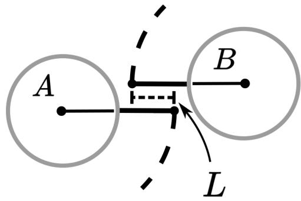

Figure 4.3: When placed close enough to pinch the cable, the distance constraint
of the cable segment gets oriented to be perpendicular to the body surfaces. The
tangent points are shifted for clarity, they point against each other in practice.The corrections needed for handling the case illustrated in Figure 4.3 were surprisingly simple and elegant. By turning the faulty segment direction perpendicular
it allows for the segment constraint to be solved in the correct tangential direction again. Also, the actual distance of the segment  $L\_i$  needs to be set as zero. These
two corrections create a joint segment that has been squished together to have zero length, which is what the transitional pinched cable should practically result in.
The rolling and sliding dynamics in the implementation functions without fault with these zero length segments. The rest length is allowed to be a negative number fora segment and is still deposited and removed in the same way as every segment. Thus, it does not matter how long the actual distance of the cable segment is, the attached bodies are affected in the same ways. The only behavior missing at this point is for the cable to push the bodies apart. This is simply achieved by adding a contact constraint that acts perpendicular to the segment constraint at the closest surface points of the two bodies. The contact constraint enforces that the minimum surface distance between the two bodies, the contact distance d, is not less than the full cable width,  $d \ge 2w$ .### 4.2.2 Non-transitional pinch joints

The model of the transitional pinch joint can also be used to implement the non-
transitional pinch joints. This was thanks to the realization that the desired dynamics
of the pinched cable being attached to both bodies could be achieved with the joint
configuration illustrated in Figure 4.4. If body B is intersecting with the wrapped
portion of cable on body A, that joint on Body A could be split into the joints  $J\_i$ 
and  $J\_{i+2}$  attached to body A and a new joint  $J\_{i+1}$  is created for body B and inserted
between them. The segments for  $j\_{i+1}$  and  $j\_{i+2}$  become zero-length segments here and
can be handled the same way as two transitional pinch joints. Note that only one
contact constraint should be generated, though. Note also that in general, if only
modeling incompressible cables, it does not matter how many cables are pinched
between two bodies; only one contact constraint is necessary to keep the bodies
apart.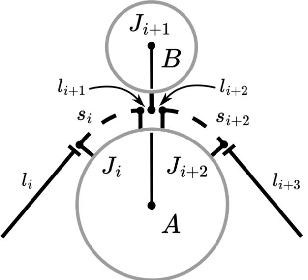

Figure 4.4: Joints layout for a non-transitional pinch joint. Note that the middle
tangent points occupy the exact same point, they are only shifted for the sake of
demonstrating the joint structure.Some special considerations are needed for the creation of the joint for body B.
The removal condition for all joints  $Ji$  is if their stored cable  $si$  is less than zero.  $Ji+1$ 
should be created with zero stored cable as its tangential attachments are at the samepoint. Although this poses an issue in practice as foating point errors can cause the stored cable to dip below zero and remove the joint. This is fxed by adding a small bufer of stored cable to the joint. A bufer of 0.00001 was enough to stop the joint from being randomly removed in this implementation. When any joint is removed in the cable, it is also now necessary to check if the head and tail joints of the removed joint are attached to the same body, if that is the case it is a non-transitional pinch joint that has been removed, and the head and tail joints need to be merged again. The cable implementation cannot handle having two consecutive joints on one body, as there would exist an infnite number of tangent points when updating the joint segment between them.

### 4.2.3 Complete pinch joints model

The fnal pinch joints model is achieved by checking all bodies for margined intersections. The margin is important, which extends the border of a body with a certain width. This width is set as the full width of the relevant cable to fnd all bodies that might pinch that cable. The potential pinch contacts are then tested to see if they pinch the wrapped portions of a joint. If they do, they are handled as detailed in earlier sections, either as a non-transitional pinch joint or a transitional pinch joint.

The fnal requirements are about the order of operations when simulating the cable, see in Algorithm [1.](#page-38-1) At a particular timestep after all rigid-body positions have been incremented, all joint attachment points, stored cable, and rest lengths are updated to refect the new physics state. All joints must have their removal condition tested and removed if they do not pass. After that, all joint segments can be tested if they intersect any bodies, in which case, they have joints added for them. After new joints have been added, and the cable state is correctly updated for the new additions, is when the pinched joints can be searched and updated. Any nontransitional pinch joints found will add and confgure the needed joints to the cable. For subsequent timesteps, these non-transitional pinches section will be identifed as two transitional joints and are updated as all other transitional pinch joints. After all pinch joints are confgured, can the cable physics be handled. That entails testing the joints for sliding, initializing constraints and fnally solving the constraints.

No considerations were required between the pinch joints model and the sliding formulation, apart from setting a constant friction amount for non-transitional pinch joints. The friction was calculated based on the amount of wrapped cable, and as the middle joint in a non-transitional pinch joint has practically zero amount of wrapped cable, a special friction calculation is required for it to have any noticeable efect on sliding cable. This thesis used a simple solution to just apply a chosen constant friction amount in these cases. More physically accurate formulations can be developed if needed.

### 4.2.4 Pinch joints implementation

This section presents a more detailed depiction of the complete implementation of pinch joints and includes relevant pseudocode to help explain how it was achieved. Algorithm [1](#page-38-1) showcases the overall order of executions in the cable simulation timestep. This is the procedure which was implemented in the FixedUpdate event in Unity3D, meaning it is executed before the built-in physics-engine increments. Explanations
of the sub-procedures/functions is given next:### UpdateSegments():

1: **for all** Joint Segments **do**  

2: compute new attachment points  $a\_{h,i-1}^{\'}$  and  $a\_{t,i}^{\'}$   

3:  $s\_{i-1} \leftarrow s\_{i-1} + \text{surfaceDist}(a\_{h,i-1}, a\_{h,i-1}^{\'})$   

4:  $s\_i \leftarrow s\_i - \text{surfaceDist}(a\_{t,i}, a\_{t,i}^{\'})$   

5:  $l\_i \leftarrow l\_i + \text{surfaceDist}(a\_{t,i}, a\_{t,i}^{\'}) - \text{surfaceDist}(a\_{h,i-1}, a\_{h,i-1}^{\'})$   

6:  $a\_{h,i-1} \leftarrow a\_{h,i-1}^{\'}$   

7:  $a\_{t,i} \leftarrow a\_{t,i}^{\'}$   

8: **end for**This function calculates all the new tangential attachment points for the current
state of the bodies. The surface distance is calculated between them and the
previous attachment points. The surface distance is how much the cable is
wrapped between the two attachment points. These differences are applied to
the relevant joints' stored cable and rest lengths. This function is performed
the same way for transitional pinch joints with zero-length segments.- **RemoveJoints()**: It checks the "remove" condition  $s\_i < 0$  for every joint. If the condition is true, then the joint is removed. The rest length and stored cable length are added to the rest length of the head joint. When removing a joint, it must also check if its tail and head joints are on the same body, in which case these two joints must be merged into one joint. This is required for the proper removal of non-transitional pinch joints.
- SegmentIntersections(): It is the function that tests all joint segments against all
bodies to find intersections. The cable segments are considered as squares with
 $L\_i$  length and  $2w$  height. An important consideration is that only intersections
with their closest contact placed perpendicular to the cable segment sides are
accepted. In the case of circles, this means the position of the circle center
projected along the segment must lie within it. This is important so that a
segment intersection is not triggered when a body is pinching the wrapped
portion of the cable. In that case, only the PinchIntersection algorithm should
get triggered.
- AddJoints(): Creates a new joint for a body that is intersecting a certain segment and inserting it in the cable. Recalculates tangential attachments with the head and tail joints. Balances the rest lengths of the segments on both sides of the new body to have equal tension.
- PinchBroadPhase(): Part of the pinch intersection algorithm. Performs bounding volume intersection tests between every unique combination of bodies. The point of the broad phase is to reject body pairings that are not intersecting with as computationally cheap tests as possible. Axis-aligned bounding boxes were used for the intersection tests in this work to gather near contacts. The bounds of each AABB were increased to account for the width of a potential pinched cable. There exist more ways to optimize the broad phase and combat

the quadratic complexity, like Sweep-and-Prune algorithms that order objects into groups of close objects which only need to test with objects in the same group [\[3\]](#page-62-3).

- PinchNarrowPhase(): Part of the pinch intersection algorithm. The point of the narrow phase is to confrm if the near contacts generated by the broad phase do intersect using more accurate tests. Testing this for circles is simple, just check if the distance between the circle centers is less than the radius of both circles combined with the full width of the cable. For handling general 2D bodies, there may be potential in using the GJK algorithm, which can provide the shortest distance between the surfaces of two general objects [\[3\]](#page-62-3). If this distance is less than the full width of a cable, then they are close enough to pinch that cable. Whatever algorithm is used, it is important to gather the contact point with a normal perpendicular to the bodies' surfaces. When handling general bodies, there may be multiple contact points.
- PinchConfrm(): Part of the pinch intersection algorithm. This is the fnal step of fnding pinched joints. The contacts provided from the narrow phase are all close enough to potentially pinch a cable.

All the joints present on both bodies must frst be tested to determine if they are transitional pinch joints. This is tested by checking if a joint is the head or tail of a joint on the opposite body. If these pairs of joints have opposite orientations, then the segment between them is a transitional pinch joint.

All joints that do not have a transitional pinched segment between them must be tested individually against the contact point. The contact needs to be compared against the tangential attachment points of each of these joints, and if it is determined that the contact point lies within a wrapped portion of cable, it is confrmed to be a non-transitional pinch joint.

ConfgurePinchJoints(): This function begins by confguring all the new nontransitional pinch joints as illustrated in Figure [4.4.](#page-42-1) This adds two transitional pinch joints.

Once all non-transitional pinch joints have been configured, all transitional
pinch joints can be corrected. This is done by setting the joint segment actual
distance  $L\_i$  to zero and setting the segment direction vector  $\hat{e}\_i$  to be perpen-
dicular to the contact normal## Results and analysis

The following sections present the results gathered from the performance tests and the 2AFC test from the user study. An objective analysis and explanation of the results are given as well.

## 5.1 Performance tests

When reading the results displayed in Section [5.1.2](#page-47-0) Use the tables presented in Section [5.1.1](#page-46-2) which explains the number of simulated elements that were present at any particular load amount.

### 5.1.1 Stress-tests elements

| Load amount:           | 1  | 2  | 5  | 10  | 20  |
|------------------------|----|----|----|-----|-----|
| Bodies                 | 4  | 8  | 20 | 40  | 80  |
| Non-transitional pinch | 2  | 6  | 18 | 38  | 78  |
| Transitional pinch     | 2  | 4  | 10 | 20  | 40  |
| Contacts               | 3  | 7  | 19 | 39  | 79  |
| Joints                 | 10 | 22 | 58 | 118 | 238 |
| Segments               | 9  | 21 | 57 | 117 | 237 |

Table 5.1: Pinch joints stress-loads elements

Table 5.2: Cable joints stress-loads elements

| Load amount: | 1 | 2  | 5  | 10 | 20 |
|--------------|---|----|----|----|----|
| Bodies       | 4 | 8  | 20 | 40 | 80 |
| Joints       | 6 | 10 | 22 | 42 | 82 |
| Segments     | 5 | 9  | 21 | 41 | 81 |

Table [5.1](#page-46-3) details all the element counts in the pinched cable stress tests shown in Figure [3.1a](#page-28-0) back in Chapter [3.](#page-26-0) Bodies are the number of circular pulleys present in the scene, which is the same for the cable joints version of the stress tests as noted in Table [5.2.](#page-46-4)

As previously mentioned, pinch joints makes the distinction between two kinds of pinched cables, the non-transitional pinch joint and the transitional pinch joint, both counted separate in Table [5.1.](#page-46-3) The joints counted are not unique elements separate from the pinching joints but include them with the regular joints. A transitional Pinch joint consists of a single joint that is slightly modifed. A non-transitional pinch joint in the pinch joint's implementation is created by inserting two additional joints at the pinched point of the cable, efectively consisting of three joints. This is why the joint counts are so much higher for pinch joints in Table [5.1](#page-46-3) as compared to cable joints in Table [5.2.](#page-46-4)

The number of joints is signifcant as each of these comes with a distance constraint and contributes more segments that are used for intersection tests with the bodies. Segments are one less than joints as the cable during testing did not loop, meaning the start joint had no previous joint to form a segment with.

Finally, Table [5.1](#page-46-3) also shows the number of contacts, which corresponds to the number of contact constraints generated for the pinched cables. At most one contact constraint is created by a unique pair of pinching bodies, meaning the double pinch points in the pinch joints stress test only generate one shared contact constraint each.

### 5.1.2 Stress tests performance

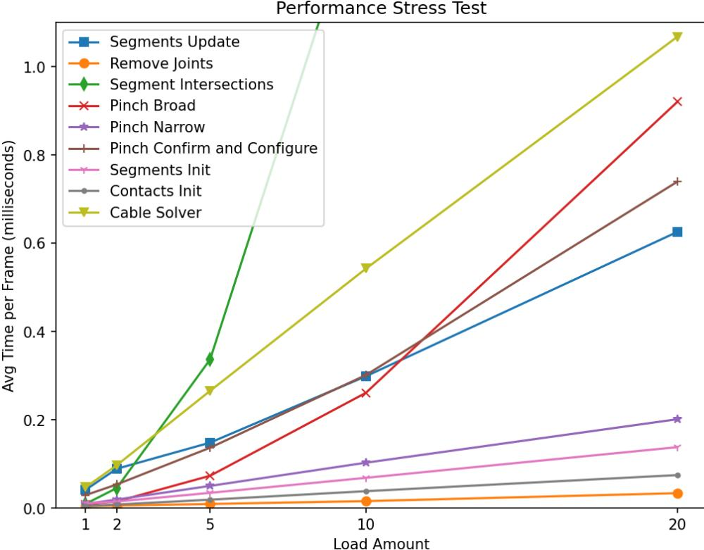

Figure 5.1: The average execution times measured for all implemented functions of the pinch joints' simulation. Multiple measurements were made at diferent loads of the system where Table [5.1](#page-46-3) explains the number of simulated elements present at each load amount.

#### 5.1. Performance tests 41

The results from the pinch joints stress tests are visualized in Figure [5.1.](#page-47-1) Observing the graph, the segment intersections and pinch broad functions have a higher time complexity than the others. The other functions display clear linear growth as the load increases. The segment intersections and pinch broad functions appear to be quadratic, which was expected by their implementation, needing to test every unique pair of relevant bodies. The visualization is zoomed in to make it easier to discern the measured values for all functions other than segment intersections. Figure [5.2](#page-48-0) highlights the performance impacts of segment intersections more clearly.

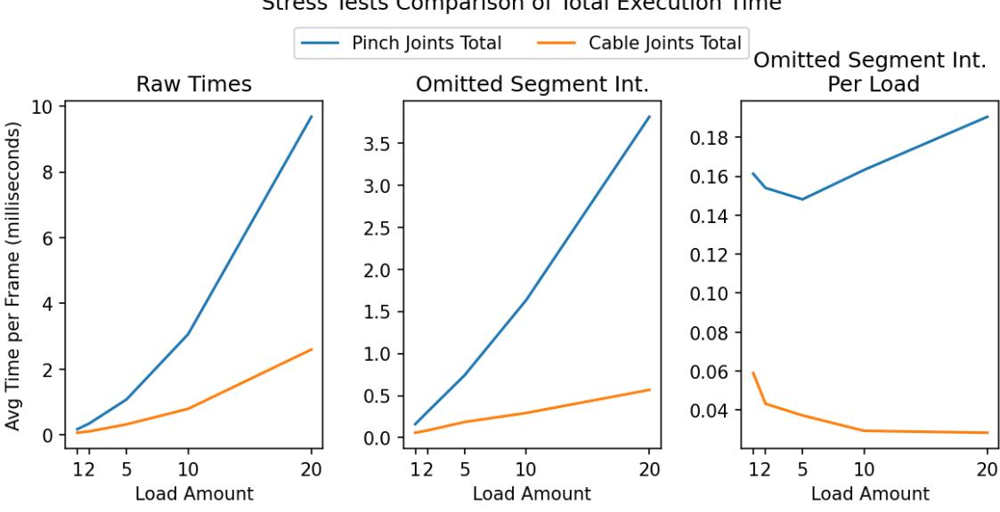

#### Figure 5.2: Comparison of the stress tests for pinch joints and cable joints based on their total frame execution time. The frst graph is the raw measured average. The second graph omits the Segment Intersections function to showcase how much performance impact it has compared to all other algorithm parts. The third graph also omits the Segment Intersections but also divides the values by the load amount to show how pinch joints scale diferently compared to cable joints.

Figure [5.2](#page-48-0) shows the comparison of the total execution time for the pinch joints' and cable joints' stress tests. The raw measurements in the frst graph show that pinch joints stressed the performance of the system far more than cable joints did. The other two graphs transform the results to give a deeper understanding of what causes the most signifcant performance impacts.

The second graph omits the segment intersections function's measurements and shows how that one function made up most of the execution time for both implementations. In the second graph it appears that without segment intersections, cable joints have a completely linear growth when increasing the load while pinch joints appear to have a slight quadratic growth. The third graph supports this observation by dividing the values with the load amount. There it is observed that cable joints approach constant growth while the pinch joints approach linear growth.

The curvature displayed at low loads is likely a result of overhead costs in the algorithm functions which do not scale with the load. These elements remain constant through all load amounts and thus they will have less impact on the values in the graphs when dividing with higher load amounts. This same phenomenon is observed in all weighted visualizations presented in this chapter

The quadratic growth still being present with pinch joints, even when omitting the segment intersections, is due to the pinch broad function which is the only pinch joints exclusive function to display quadratic complexity in Figure [5.1.](#page-47-1)

There is a signifcant gap between the two implementations in the per load comparison of Figure [5.2.](#page-48-0) That gap is explained by the other linear functions pinch joints adds and the common functions which also measure diferently in the two implementations. The gap is also present due to the higher complexity of the pinch joint stress-test confguration. Figure [5.3](#page-49-0) compares all the common linear functions of pinch joints with all the linear functions of cable joint to show how they difer.

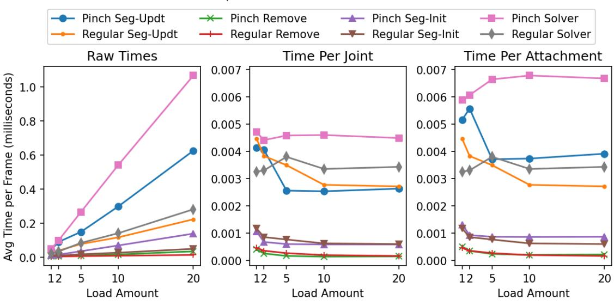

Comparison of Linear Simulation Parts

Figure 5.3: Comparison of the stress tests for pinch joints and cable joints (Regular) based on the linear functions shared between both implementations. The second and third graphs divide the raw times by the number of joints and the number of attachments to compensate for the diferent scene complexities. Attachments for the pinch joints are the combination of the tallied non-transitional pinch joints from Table [5.1](#page-46-3) and the tallied joints values in Table [5.2.](#page-46-4) Attachments for cable joints (Regular) are just their joints from Table [5.2.](#page-46-4)

Figure [5.3](#page-49-0) presents the measured results for the cable joints' stress test and compare the performance diferences for functions they have in common with the pinch joints implementation. Segment intersections is omitted because its impact is already analyzed in Figure [5.2.](#page-48-0)

The frst graph in Figure [5.3](#page-49-0) showcase the raw measured averages for each of the common functions. The two other graphs transform the measurements to understand what causes the diferences in these common functions.

The second graph in Figure [5.3](#page-49-0) shows the measured values divided by the number of joints present in each stress test. It is observed that the values per joint for each function apart from the Solver converges to the same values for both implementations. So, for these functions, the diference in performance is directly caused by pinch joints utilizing more joints in its experiment confgurations. These extra joints are added by the non-transitional pinch joints which consist of three regular joints.

The diference in solver performance can be explained by the additional contact constraints added by pinching.

Finally, the third graph in Figure [5.3](#page-49-0) showcases the performance impact caused by the non-transitional pinch joints using multiple joints. Here the measured averages are divided by the number of attachments present in each experiment load. The attachments here are meant as all logical attachment points in the scene. That being the combination of all non-pinching joints, and all pinching joints of both kinds. So, the performance diferences shown here may give a fairer comparison of the performance impacts of pinch joints and cable joints.

Note that this specifc diference in pinched attachments emerges only from scenes where there is an equal distribution of non-transitional and transitional pinch joints. Having exclusively non-transitional pinch joints would add more joints in total. Having only transitional pinch joints would be much more like regular cable joints. So, view the diferences observed in the third graph of Figure [5.3](#page-49-0) as how pinch joints difer on average.

### 5.1.3 Pinch-intersection detection performance

The results of the last experiment confguration, the one seen in Figure [3.1c](#page-28-0) back in Chapter [3,](#page-26-0) is analysed next to estimate the diferent performance impacts the pinch joints' pinch intersection algorithm has.

Figure [5.4](#page-51-0) showcases the results gathered from the four versions of the experiment confguration in Figure [3.1c.](#page-28-0) The versions are: having both smaller bodies, having only the pinching smaller body, having only the non-pinching body and having neither present. These comparisons have signifcance as both the pinching and non-pinching smaller bodies pass the frst two intersection tests, the Pinch Broad and the Pinch Narrow functions. It is only at the Pinch Confrm and confgure function where the non-pinching body is rejected and the pinching body is confgured to have a working pinch joint.

The measured values and values per load in Figure [5.4](#page-51-0) shows how the broad phase does its job of allowing the latter more computationally heavy functions to have linear complexity, only executing for bodies that might be close enough to intersect a wrapped cable.

The results for only having the pinching bodies and only the non-pinching bodies were expected to display the same values for the broad phase and narrow phase as they feature the same number of bodies that were close enough to pass both phases. While the narrow phase does display this well, the broad phase has a slight diference which cannot be explained for the thesis. Possibly a measurement error.

It is for the pinch confrm and confgure function where a noticeable and expected diference is present when comparing having only the pinching bodies and having only the non-pinching bodies. Here both body confgurations run through the pinch confrmation function but only the confguration with pinched cable points will go on to be confgured for pinching. So thus, the performance cost of doing the confrmation can be read from the diference between the only non-pinching results and the only no pinch results in the pinch confrm and confgure graphs.

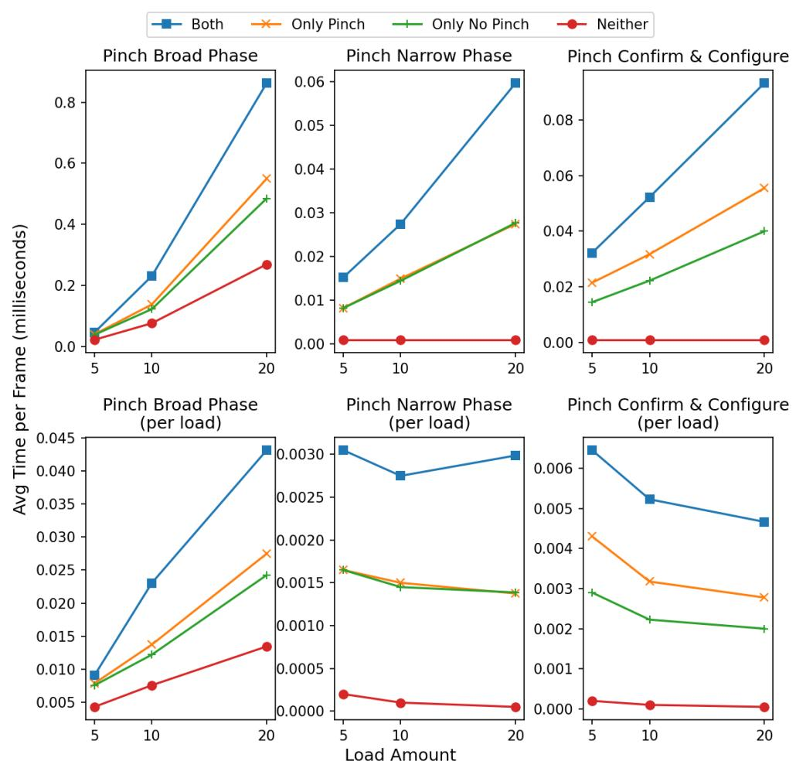

Pinch joints intersection algorithm performance

Figure 5.4: The execution times measured for the pinch intersection algorithm at different confgurations of bodies pinching and not pinching cables when laying against other bodies. The execution times for the broad phase, narrow phase and pinch confrmation functions are the factors measured, and the results are presented both as is and weighted per load.

The results for having neither of the bodies lying against the other bodies have the expected patterns. The bodies that are still in the experiment confguration are tested against each other in the broad phase and rejected, meaning there is no performance impact from the narrow phase and confrmation functions apart from slight overhead in the implemented code.

The results for having both bodies also display the expected patterns of being the sum of the only pinching and non-pinching confgurations. This supports their results and shows the consistency of the implementation performance.

## 5.2 User study

The user study was carried out without any practical issues. Data was collected  
from 16 participants in total. The chi-square analysis for the choices gathered for  
each individual demonstration is presented in Table 5.3. The table shows for each  
demonstration, the number of participants who picked the pinch joints' version of  
the demonstration, the number of participants who picked the cable joints' version of  
the demonstration, the expected outcome for both categories used in the chi-square  
analysis and finally the calculated  $p$ -value used to confirm preference of a particular  
option.

| Demonstration nr:        | 1      | 2     | 3     | 4     | 5     | 6     | 7     | 8     |
|--------------------------|--------|-------|-------|-------|-------|-------|-------|-------|
| Pinch joints             | 15     | 12    | 14    | 13    | 13    | 13    | 6     | 10    |
| Cable joints             | 1      | 4     | 2     | 3     | 3     | 3     | 10    | 6     |
| Expected Distribution    | 8      | 8     | 8     | 8     | 8     | 8     | 8     | 8     |
| Distribution Probability | <0.001 | 0.045 | 0.003 | 0.012 | 0.012 | 0.012 | 0.317 | 0.317 |
| (p-value)                |        |       |       |       |       |       |       |       |

Table 5.3: 2AFC results, chi-square analysis

Table 5.3 shows that the statistical analysis yielded significant grounds to re-  
ject the null-hypothesis for demonstrations 1-6, statistically significant *p*-values are  
highlighted as **bold**. In all cases where the null-hypothesis is rejected there was a  
preference for the pinch joints' implementation. Demonstrations 7 and 8 did not  
yield statistically significant *p*-values and thus the null hypothesis cannot be rejected  
for them. Demonstrations 1-6 are all the clipping-related demonstrations, and the  
frictional demonstrations are represented as numbers 7 and 8.

As all the individual demonstration results have fundamentally the same task and categories, it is possible to analyze aggregates of all the results as well. Although each demonstration shows diferent scenes and confgurations of pulleys and cables, they still all show the diferences between pinch joints and cable joints. Further aggregate analysis can also be made separately for the clipping and frictional demonstrations.

|                                       | Clipping | Friction | All     |
|---------------------------------------|----------|----------|---------|
| Pinch joints                          | 80       | 16       | 96      |
| Cable joints                          | 16       | 16       | 32      |
| Expected distribution                 | 48       | 16       | 64      |
| Distribution probability (p-value) | <0.0001  | 1        | <0.0001 |

Table 5.4: 2AFC results, chi-square analysis (aggregated)

Table [5.4](#page-52-2) showcase the chi-square analysis of the aggregated data. With all the results related to clipping, there are exceptional statistically signifcant grounds for rejecting the null-hypothesis. The preference is for the pinch joints' implementation.

For the frictional aspects of the pinch joints the null-hypothesis cannot be rejected. Meaning there is either no perceived visual diference between the implementations, or there is no consensus of which implementation participants preferred.

Analyzing the aggregate of all the data shows that despite the frictional aspects
having poor results, overall there is exceptional statistically significant grounds for
the preference of the pinch joints implementation.## Discussion

This chapter will discuss the proposed implementation and the presented results. The contributions are evaluated against the research questions. The pinch joints model is discussed in relation to other examined cable models and speculations are given as to how the model can be further extended. Finally, it is examined how well the proposed implementation refects the aim presented in the introduction.

## 6.1 Implementation evaluation

The development and implementation of the pinch joints described was successful and managed to recreate the desired pinched cable behaviors in most scenarios tested. The few irregularities observed appear to be due to implementation specifc bugs and oversights. The observed issues could not be traced back to illuminate some fault in the Pinch Joint model.

The most significant issue was due to how the implementation was integrated with
Unity3D. As detailed in Chapter 4, all the cable dynamics and physics calculations
were carried out in C# scripts and were not directly integrated in the built-in physics-
engine. The physics engine would solve its own constraints and apply gravity to all
bodies, but without including the cable constraints meant that the engine could
overwrite some of the impulses made by the cable simulation. So, the positions and
velocities of the bodies in the scenes were slightly faulty. However, this did not
have any major observed impact on the functionality of pinch joints or the presented
results.The one way this was most noticeable was when bodies afected by gravity lay on top of cables and pinching them. The body would be seen clearly clipping through the cable as gravity overrode the restitutional impulses. The position error correction for the contact constraints was greatly over tuned to lessen this impact. This made most faults unnoticeable, but for scenarios stacking multiple pinching bodies atop each other like in Figure [3.2](#page-32-0) back in Chapte[r3,](#page-26-0) there were some jittery movements introduced. The user study still yielded good results for clipping despite these slight errors.

Integrating the pinch joints directly with a physics engine or developing an engine
from the ground up would bring many benefits. It would solve all the instabilities
stemming from the layered implementation that was used in *Unity3D*. Integrating
pinch joints directly with an engine would remove communication costs between parts
of the system. Also pinch joints could take direct advantage of many optimization
techniques such as sweep-and-prune algorithms [3,10] for more performant collisiondetection. The pinch joints model uses mainly constraints and collision detection to function, both features most physics-engines could provide, so the integration could be rather seamless. If an engine is built around pinch joints, there could even exist novel confguration and optimization to suit the simulation model specifcally.

With a better integrated system, it would be possible to conduct research into more performance aspects of the model as well. Mainly in regard to stability to ensure the pinch joint extension does not negatively afect the strong stability of cable joints. Analysis of how well the extension manages high mass-ratios could also be further examined.

One of the more exciting aspects resulting from this work was how simple and elegant the pinch joints extension turned out to be. Just by slightly correcting the cable joints implementation where it faltered, all the impressive dynamics which that model provides could be extended to handle pinched cables. So completely was the functionality preserved that very minor considerations were needed when using the extended sliding joints. This shows how well contained and easy the pinch joints were to integrate in the overall algorithm. Any extension made to the base cable joints could extend pinch joints with minor tweaking.

In regard to the first research question ***Q1***, the work managed to implement and describe a successful approach for extending cable joints to handle pinched cables. The developed pinch joints model is both simple and achieves the desired behaviors.### 6.1.1 Extending to 3D

For extending the pinch joints model to 3D there are a few main general aspects of the implementation that will be applicable.

All collision detection between unwrapped cable segments and bodies need to take into account the cable width. Using ray-casting or line intersection algorithms will not be sufcient. Using shape-casting with spheres or defning cable segments as cylinder shapes could work well if tested with an intersection algorithm like GJK [\[3\]](#page-62-3).

If a 3D cable model defnes any special nodes or structures for cables wrapping around bodies, these also need to be defned as some sort of shape and a collision detection algorithm must be used so pinched sections of cable can be detected. Contact constraints will be applied at appropriate contact points along the cable the same way as in 2D.

The model developed by Servin et al. [\[15\]](#page-63-6) has intriguing potential for implementing constraint-based pinching in 3D. The model already is highly performant and robust with their optimization algorithm that subdivides the cable segments. The model also accurately detects edges of 3D geometry and places massless frictional nodes to wrap around complex geometry. All that should be needed to handle pinching is to implement a collision detection algorithm for the frictional nodes to detect when another body is in contact with them and contact constraints to have the cable push back on the bodies. The nodes could potentially be represented as spheres which could result in efcient collision detection.

Lloyd et al. [\[12\]](#page-63-2) also propose a model of interest for extending pinch joints for 3D. Their algorithm for wrapping muscle fbers over arbitrary surfaces between moving attachment points could help extend the cable joints implementation to feature more realistic wrapping over bodies. If the physical shape of the wrapped portion of cable can be defned or approximated to work with a collision algorithm, then the proposed model of this thesis be extended to 3D with little modifcation.

## 6.2 Performance evaluation

For discussing the answers to the second research question Q2, the first aspect of note is if pinch joints are applicable in real-time contexts. The heaviest load tested in all the experimentation is seen in the graph showing the total frame time in Figure 5.2. Pinch joints reach an execution time of almost 10ms at load 20. This is within the bounds of real-time performance. Although it would take up a considerable amount of the frame time budget if the targeted framerate is 60fps, in which case a frame cannot be longer than about 16ms.Keeping in mind that, as tallied in Table [5.1,](#page-46-3) there are over a hundred pinch joints alone and 80 bodies, so it is a remarkably complex scene. Everything in the scene setup was also specifcally made to create a worst-case scenario, so it can be said with certainty that for most scenarios utilizing pinching, pinch joints are suitable for real-time contexts. Pinch joints do, however, increase the computational costs as compared to cable joints as can be observed in Figure [5.2.](#page-48-0)

Segment intersections are the most signifcant hit to performance. Figure [5.2](#page-48-0) shows how at load 20 this function alone takes up about 6.5ms which is most of the execution time. When implementing this function, there was a potentially large optimization technique that was overlooked. The poor performance is caused by the large number of segments present in the scene and pinch joints added far more of them than cable joints did. However, all the segments that pinch joints added are of zero length as they are being pinched, so it makes no sense to include these segments in the intersection algorithm as they cannot intersect with anything. So, the nontransitional pinch joints in the stress tests could not have added any new segments at all. Even more, is that the transitional pinch joints in the experiment confgurations would remove one segment each. This would suggest that the measured segment intersection execution time could have been far less than cable joints instead of far more. Using less naive collision algorithms as mentioned earlier in the discussion would have also improved the segment intersections for both implementations. So pinch joints do have great potential for improving the performance presented in this thesis.

Applying better collision detection algorithms for the pinch broad phase would also greatly beneft the pinch joints. The collision detection algorithm for detecting pinching is the only addition of pinch joints that does not scale linearly, as can be seen in Figure [5.1.](#page-47-1) Thus, it has potential to afect the scalability majorly. The broad phase does successfully prevent the more expensive pinch narrow phase and confrmation steps to not showcase quadratic complexity, as can be seen in Figure [5.4.](#page-51-0) Implementing an algorithm like sweep-and-prune could improve the broad phase scalability greatly [\[3,](#page-62-3) [10\]](#page-62-2).

Transitional pinch joints are likely as best as they can be unless a diferent base model is used that is more performant than cable joints. However, non-transitional pinch joints have a lot of potential for improvement. Utilizing multiple joints, the way presented is simple although it leads to a single non-transitional pinch joint to calculate a lot of tangent points which all just fall upon the same place and introduces three new constraints, two segment constraints and one contact constraint.

The two segment constraints both perform very similar calculations as they are attached to the same two bodies. There should exist some way to formulate the non-transitional pinch interaction as a single constraint to handle rolling and sliding between it, the cable and the wrapped body. Reducing the number of joints used by pinch joints would greatly improve the performance diferences observed in Figure [5.3.](#page-49-0) This would require some specialized handling and data structures for the pinch joints which could ultimately end up costing more than the benefts. It could potentially improve stability as well. For the thesis there were no tests of how the implementation fairs when a body is wrapped many times with a cable and is then pinched. With the current model it would need to add a great number of joints between just two bodies that in the worst case could cause stability issues and jitteriness and best case just waste a lot of resources. Further testing and implementation of new methods are needed.

So, to answer Q2 properly now. The results presented in this thesis suggest
that pinch joints have significant computational costs compared to pinch joints. The
scaling showcased, is also more significant for pinch joints as they introduce more
steps of collision detection. However, as discussed in this section, there is great
potential for optimization to improve performance. So, utilizing the proposed model
in real-time applications is highly fitting.## 6.3 User study evaluation

The user study presents strong grounds that the pinch joints implementation is preferred for scenarios featuring pinched cables. The aggregated results show exceptional statistical signifcance and each individual analysis for the clipping related demonstrations also yielded statistically signifcant grounds to reject the null-hypothesis. This was despite the small errors of jitteriness that afected some of the clippingrelated demonstrations.

The user study also showed that frictional aspects when cables are pinched were not signifcantly noticeable for the participants. This may be because it is not as visually obvious what should happen with certain systems when friction is involved. Friction may be a phenomenon the participants are more used to feeling when moving things themselves. so, the passive viewing experience of the test design may have been against the frictional aspects. Another possible issue could be that the scenarios were not sufciently explained or presented.

Whatever the case which caused the poor results of the frictional demonstrations, they did not have a meaningful impact on the overall analysis of the results. So in regard to the third research question Q3 there is a strong case for pinch joints improving the overall perceived realism of scenes that feature pinched cables. Some aspects like friction are not as important to represent correctly. However, clipping and incompressibility of the cables are vital.

The answers to the free text questions also support these conclusions. Most of the participants who wrote what informed their decisions appear to have correctly identifed the compression/clipping of the cables as a major factor. Few mentioned the friction in the demonstrations. Some participants did also list jitteriness or unexpected sudden movement of the cable as a factor. This could show that the implementation faults mentioned earlier did have some efect on the results.

There was overall little criticism and feedback towards the study setup. The few points of note were that more information could have been communicated in the demonstrations. For example, the specifc geometry and material of the cable and pulleys. Some participants were unsure if the pulleys perhaps had grooves on their sides which the cables could ft into or if the cable material could explain why they were compressed by the pulleys. It could have been a good idea to have specifed to the participants that the cables were supposed to be incompressible, and the pulleys were fat drums. A few participants also gave specifc feedback that specifying the weights of objects connected to the cable in one of the friction demonstrations would have helped them understand the demonstration better.

Apart from some minor issues in specifc demonstrations with jittery movements and unclear setups, the 2AFC test design and execution was a good ft for evaluating the pinch joints. More user studies with better designed demonstrations could be benefcial and could give the frictional aspects a better chance of being received well. Diferent kinds of user studies would be of interest to conduct in the future, especially interactive tests would be the most impactful. The goal of the pinch joints is to allow for free and stimulating intractability, so any user test where that could be assessed would be greatly benefcial. Having developed and interacted directly with the implemented pinch joints, there is increased freedom of interaction. Play and exploration came easy when confguring the test scenarios. So, any empirical way to prove what this technology is capable of is of great interest. The simple but clear user study conducted and presented for this thesis should be proof of concept enough to warrant further development.

## Conclusions and future work

The thesis work managed to implement and describe a successful approach for extending cable joints to handle pinched cables. The developed pinch joints model is both simple and achieves the expected behaviors of pinched cables.

It was concluded that the pinch joints implementation does increase the potential computational performance costs for complex systems. However, no performed test showed that pinch joints were unapplicable in real-time contexts. Many of the aspects that do impact the performance are open for improvement and future development could greatly improve computational efciency and scalability.

The user study helps justify the potential performance costs as it presented strong grounds for users preferring the pinch joints implementation in scenarios featuring pinched cables. So, the proposed model does improve the perceived realism of cable simulations. Mainly it was shown that reducing the clipping of cables is a desirable improvement. However, frictional aspects did not have any signifcant evidence to provide improvements of perceived realism.

Overall, the implementation produced is a strong proof of concept that should invoke further development of highly interactive cable simulations.

## 7.1 Future work

More user studies are needed to evaluate the pinch joints implementation more thoroughly and explore the breadth of intractable experiences this model can provide. Some forms of interactive tests would be especially ftting to see if freely interactive cables can stimulate users in new ways and if the cable model is robust enough to not break when used

The various proposed methods given in Chapter [6](#page-54-0) to improve computational performance should be implemented and tested. Ideally this should be done together with integrating the model directly with a rigid-body framework. That would allow further research into other performance measures. Analyzing the multi-body dynamics stability for complex cable systems, high mass ratios and large forces would help evaluate the robustness of the model. Less naive collision detection algorithms like implementing sweep-and-prune for the broad phase [\[3,](#page-62-3)[10\]](#page-62-2) could greatly improve the scalability of the implementation.

A GPU-based implementation of the proposed system with a specialized data structure for neighborhood search could drastically accelerate the cable joint simulation, even in complex environments [\[5\]](#page-62-9).

Adaptive models for subdivision of cables and computation could be explored to identify varying activities in diferent regions. This includes the possibility of having cables with various length segments for computation, to allocate higher computational regions for segments that have a higher or more crucial activity [\[4\]](#page-62-10).

In scenes containing various disconnected cables, where some cables are not undergoing any activity, the concept of freezing could also be employed to improve the efciency of the method [\[1\]](#page-62-11).

Evaluating the applicability of modeling accurate realistic cable systems or extending it to be closer based in applied physics could allow for use cases in more engineering felds. Investigating the approach by Westin and Irani [\[23\]](#page-63-8) could be a good starting point for that.

The most important future work once the current Pinch Joint implementation is satisfactorily developed is to continue extending the cable simulation model with more cable behaviors not yet covered. One that would have the greatest impact on the intuitive realism and intractability of the cable is introducing coiling and movement of the cable segments when not in tension. This would likely be made by introducing lumped masses to give the cable segments a more realistic and intractable form and movement. The multiresolution technique developed by Servin et al. [\[15\]](#page-63-6) seems a ftting solution to attempt and implement. Their optimization algorithm used to subdivide segments where needed would be a perfect addition to maintaining the performance benefts of constraint-based approaches.

## References

- [1] S. Andreasson, L. Östergaard, and P. Goswami, "Parallel spatiotemporally adaptive dem-based snow simulation," Proceedings of the ACM on Computer Graphics and Interactive Techniques, vol. 7, no. 3, pp. 1–20, 2024.
- [2] E. Catto, "Physics for game programmers: Understanding constraints," GDCVault, 2014, (Accessed: May 26, 2025). [Online]. Available: [https:](https://gdcvault.com/play/1020603/Physics-for-Game-Programmers-Understanding) [//gdcvault.com/play/1020603/Physics-for-Game-Programmers-Understanding](https://gdcvault.com/play/1020603/Physics-for-Game-Programmers-Understanding)
- [3] G. Van Den Bergen, Collisions Detection in Interactive 3D Environments. United Kingdom: Taylor Francis, 2004.
- [4] P. Goswami and C. Batty, "Regional time stepping for sph," in Short Paper, Eurographics. Eurographics Association, 2014, pp. 45–48.
- [5] P. Goswami, P. Schlegel, B. Solenthaler, and R. Pajarola, "Interactive sph simulation and rendering on the gpu," in Proceedings of the 2010 ACM SIG-GRAPH/Eurographics Symposium on Computer Animation, 2010, pp. 55–64.
- [6] I. García-Fernandez, M. Pla-Castells, and R.J. Martinez-Dura, “Elevation Cable  
Modeling for Interactive Simulation of Cranes,” in *Eurographics/SIGGRAPH*  
Symposium on Computer Animation, M. Gross and D. James, Eds. The Eu-  
rographics Association, 2008.
- [7] J. Sinecky, "Rope simulation in 'uncharted 4' and 'the last of us 2'," GDCVault, 2021, (Accessed: May 26, 2025). [Online]. Available: <https://www.gdcvault.com/play/1027351/Rope-Simulation-in-Uncharted-4>
- [8] J.B. Coulibaly, M.A. Chanut, S. Lambert, and F. Nicot, “Sliding cable model-  
ing: An attempt at a unified formulation,” *International Journal of Solids and*  
*Structures*, vol. 130-131, p. 1 – 10, 2018.
- [9] X. Jiang, H. Ren, and X. He, "Simulation of mooring lines based on positionbased dynamics method," IEEE Access, vol. 7, p. 142796 – 142805, 2019.
- [10] K. Erleben, J. Sporring, K. Henriksen, and H. Dohlmann, Physics-Based Animation. Hingham, Massachusetts: Charles River Media, 2005.
- [11] X. Kong and H. Shen, "A review of cable simulation for ship and marine engineering operations," in Seventh International Conference on Advanced Electronic Materials, Computers, and Software Engineering (AEMCSE 2024), L. Yang, Ed., vol. 13229, International Society for Optics and Photonics. SPIE, 2024, p. 132290F.
- [12] J. E. Lloyd, F. Roewer-Despres, and I. Stavness, "Muscle path wrapping on arbitrary surfaces," IEEE Transactions on Biomedical Engineering, vol. 68, no. 2, p. 628 – 638, 2021.
- [13] M. Müller, N. Chentanez, S. Jeschke, and M. Macklin, "Cable joints," Computer Graphics Forum, vol. 37, no. 8, pp. 1–10, Dec. 2018.
- [14] M. Servin and C. Lacoursière, "Massless cable for real-time simulation," Computer Graphics Forum, vol. 26, no. 2, p. 172 – 184, 2007.
- [15] M. Servin, C. Lacoursière, F. Nordfelth, and K. Bodin, "Hybrid, multiresolution wires with massless frictional contacts," IEEE Transactions on Visualization and Computer Graphics, vol. 17, no. 7, p. 970 – 982, 2011.
- [16] M. Servin and C. Lacoursiére, "Rigid body cable for virtual environments," IEEE Transactions on Visualization and Computer Graphics, vol. 14, no. 4, p. 783 – 796, 2008.
- [17] M. Müller, M. Macklin, N. Chentanez, S. Jeschke, and T.-Y. Kim, "Detailed rigid body simulation with extended position based dynamics," Computer Graphics Forum, vol. 39, no. 8, p. 101 – 112, 2020.
- [18] D. K. Pai, "Strands: Interactive simulation of thin solids using cosserat models," Computer Graphics Forum, vol. 21, no. 3, p. 347 – 352, 2002.
- [19] Y. Peng, Y. Wei, and M. Zhou, "Efcient modeling of cable-pulley system with friction based on arbitrary-lagrangian-eulerian approach," Applied Mathematics and Mechanics (English Edition), vol. 38, no. 12, p. 1785 – 1802, 2017.
- [20] R. Singhal and R. Rana, "Chi-square test and its application in hypothesis testing," Journal of the Practice of Cardiovascular Sciences, vol. 1, 01 2015.
- [21] V. Sundstedt, D. Gutierrez, O. Anson, F. Banterle , and A. Chalmers, "Perceptual rendering of participating media," ACM Transactions on Applied Perception, vol. 4, no. 3, pp. Article 15, 22 pages, 2007.
- [22] W.D. Cunningham and C. Wallraven, Experimental Design: From User Studies to Psychophysics. Florida: CRC Press, 2011.
- [23] C. Westin and R. A. Irani, "Efcient semi-implicit numerical integration of ancf and ale-ancf cable models with holonomic constraints," Computational Mechanics, vol. 71, no. 4, p. 789 – 800, 2023.

