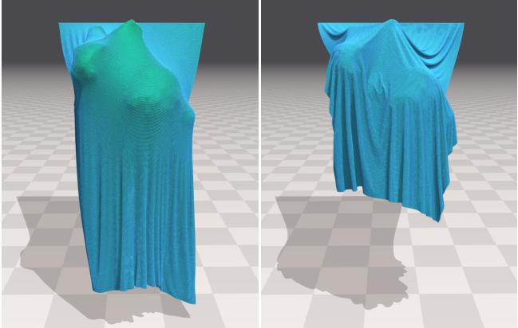
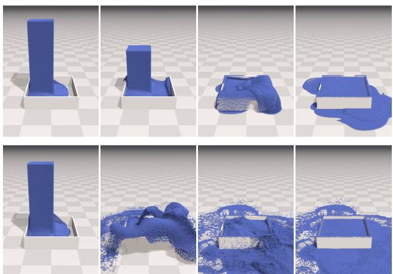
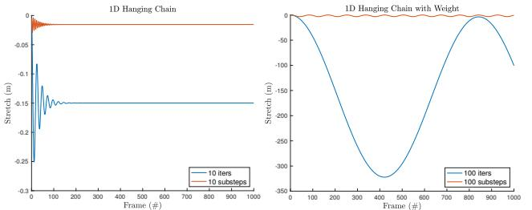
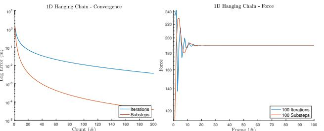
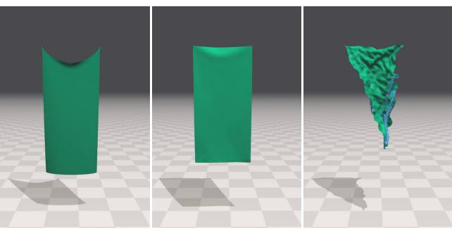
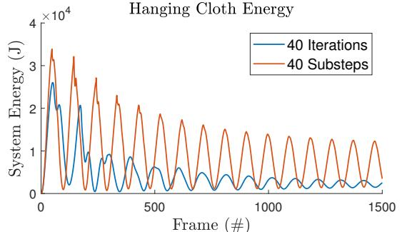
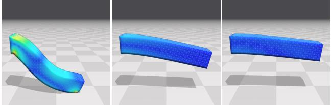
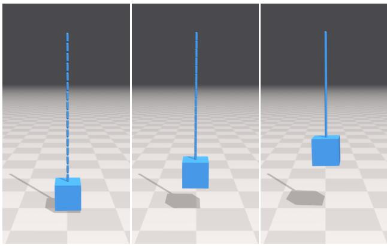
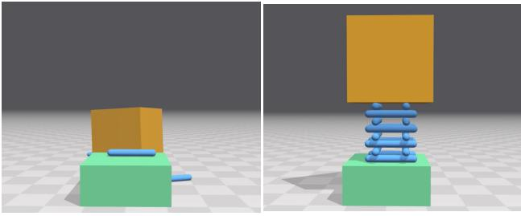

# Small Steps in Physics Simulation

Miles Macklin NVIDIA University of Copenhagen mmacklin@nvidia.com

Pierre Terdiman NVIDIA pterdiman@nvidia.com

Kier Storey NVIDIA kstorey@nvidia.com

Nuttapong Chentanez NVIDIA nchentanez@nvidia.com

Matthias Müller NVIDIA matthiasm@nvidia.com

Michelle Lu NVIDIA michellel@nvidia.com

Stefan Jeschke NVIDIA sjeschke@nvidia.com

# ABSTRACT

In this paper we re-examine the idea that implicit integrators with
large time steps offer the best stability/performance trade-off for
stiff systems. We make the surprising observation that performing
a single large time step with n constraint solver iterations is less
effective than computing n smaller time steps, each with a single
constraint solver iteration. Based on this observation, our approach
is to split every visual time step into n substeps of length  $\Delta t/n$  and
to perform a single iteration of extended position-based dynamics
(XPBD) in each such substep. When compared to a traditional
implicit integrator with large time steps we find constraint error and
damping are significantly reduced. When compared to an explicit
integrator we find that our method is more stable and robust for a
wider range of stiffness parameters. This result holds even when
compared against more sophisticated implicit solvers based on
Krylov methods. Our method is straightforward to implement, and
is not sensitive to matrix conditioning nor is it to overconstrained
problems.# CCS CONCEPTS

to perform a single iteration of extended position-based dynamics teractive simulation.

### KEYWORDS

Physics-based animation, real-time simulation

#### ACM Reference Format:

Miles Macklin, Kier Storey, Michelle Lu, Pierre Terdiman, Nuttapong Chentanez, Stefan Jeschke, and Matthias Müller. 2019. Small Steps in Physics Simulation. In SCA '19:The ACM SIGGRAPH / Eurographics Symposium on Computer Animation (SCA '19), July 26–28, 2019, Los Angeles, CA, USA. ACM, New York, NY, USA, Article 39, [7](#page-6-0) pages.<https://doi.org/10.1145/3309486.3340247>

SCA '19, July 26–28, 2019, Los Angeles, CA, USA

© 2019 Copyright held by the owner/author(s). Publication rights licensed to ACM. ACM ISBN 978-1-4503-6677-9/19/07. . . \$15.00 <https://doi.org/10.1145/3309486.3340247>

Figure 1: High resolution cloth consisting of 150k particles, and 896k spring constraints draped over a Stanford bunny. With 1 substep and 30 XPBD iterations the simulation takes 12.4ms/frame but shows visible stretching (left). With 30 substeps, each performing only 1 XPBD iteration the simulation takes 13.5ms/frame but shows significantly less stretching and higher material stiffness (right). In both cases we have performed collision detection once per-frame.

### 1 INTRODUCTION

The simulation of physical systems is a challenging problem in interactive computer graphics. Ideal algorithms should not only reproduce the underlying physical model, they should be robust and efficient enough for real-time applications and user interaction. Many methods exist to evolve a physical system forward in time, however they can broadly be split into two categories: explicit and implicit methods.

Explicit time-integration is rarely used in physical simulations because it is only conditionally stable. This means that the simulation can diverge any time if certain conditions are not met. For this reason, implicit integrators are often preferred due to their stability. However, in contrast to explicit integration, where the state of the next time step can be computed directly from the current state, for implicit integration a system of non-linear equations must be solved

Permission to make digital or hard copies of all or part of this work for personal or classroom use is granted without fee provided that copies are not made or distributed for profit or commercial advantage and that copies bear this notice and the full citation on the first page. Copyrights for components of this work owned by others than the author(s) must be honored. Abstracting with credit is permitted. To copy otherwise, or republish, to post on servers or to redistribute to lists, requires prior specific permission and/or a fee. Request permissions from permissions@acm.org.

at every time step. Typically this is done using a Newton method that repeatedly linearizes the non-linear system. Each linear system is then solved by a global solver such as Conjugate Gradients (CG) or direct methods, and the solution is used to get closer to the non-linear one. First order implicit methods introduce numerical damping, and are often more computationally expensive than explicit methods. In addition, they may not guarantee a time-bound on convergence, which makes them less attractive for interactive applications.

For real-time applications, local iterative relaxation methods such as Position-based Dynamics (PBD) [\[Müller et al.](#page-6-1) [2007\]](#page-6-1) are popular. Unlike global solvers which treat the system of equations as a whole, local solvers such as the Projected Gauss-Seidel (PGS) iteration used in PBD handle each equation individually, one after the other. These methods are known to be very robust on typical problems. This is due in part to the fact that during a global solve the system matrix is frozen, meaning all constraint gradients are held fixed. This can cause the solution to move far from the constraint manifold. In contrast, non-linear PGS methods work on the system of non-linear equations directly. Each constraint projection uses the current gradients, which minimizes overshooting. In addition, relaxation methods are robust for overconstrained systems that pose a challenge for global linear solvers, which may fail to converge at all in such scenarios. Furthermore, solving each equation separately allows PGS to trivially handle unilateral (inequality) constraints. Here, only constraints which violate the inequality conditions (the active set) are projected. This set can change in every iteration and even after each constraint projection, which prevents sticking. To simulate the two-way coupling of different features like liquids and rigid bodies, their list of constraints are simply concatenated or interleaved, allowing fine-grained coupling [\[Macklin et al.](#page-6-2) [2014;](#page-6-2) [Stam 2009\]](#page-6-3).

Despite their advantages, due to their local nature, relaxation methods propagate error corrections more slowly than if the equations are solved simultaneously, making them less suitable for stiff problems. They also suffer from numerical dissipation like traditional implicit methods. The aim of this project was to increase the convergence rate and energy preservation of local solvers while keeping all their advantages. We derived our solution from a rather surprising observation. There are two ways to increase the accuracy of a simulation: either decrease the time step size, or increase the number of solver iterations. Both increase the amount of computational work that has to be done. Consequently, if we want to keep the work constant we have to change both. If we decide to increase the number of solver iterations or the complexity of the solver, we have to increase the time step size to stay within the computational budget. On the other hand, if we decide to take smaller time steps, then we have to decrease the number of solver iterations. The question we asked was which direction is more effective. Is it more effective to (a) solve one difficult problem accurately, or (b) many simpler problems approximately. Since the work of Baraff et al. [\[1998\]](#page-6-4), the commonly accepted knowledge in the computer graphics community has been to prefer large steps and implicit methods for stiff problems.

However, in our studies we found that (b) is significantly more effective than (a). In fact, for PGS the optimum lies at the far end of (b), i.e. taking as many small steps as the time budget allows while

Table 1: Summary of the relative strengths and weaknesses of each method.

| Method              | Stability | Efficiency | Simplicity | Energy |
|---------------------|-----------|------------|------------|--------|
| Semi-Implicit Euler |           | ✓          | ✓          | ✓      |
| Implicit Euler      | ✓         |            |            |        |
| XPBD                | ✓         | ✓          | ✓          |        |
| Small Steps         | ✓         | ✓          |            | ✓      |

performing a single iteration in each step. Based on this observation we split a time step of size  $\Delta t$  into  $n$  substeps of size  $\Delta t / n$  and perform one iteration of Extended Position Based Dynamics *(XPBD)* in each substep. The effect of replacing iterations by substeps is so substantial that one-step *XPBD* is competitive with sophisticated global matrix solvers in terms of convergence. Intuitively, a single pass over the constraints seems hardly enough to yield meaningful information about forces and torques, but our results show that this is actually not the case. Indeed, as was shown by Macklin et al [2016], the first iteration of *XPBD* is equivalent to the first step of a Newton solver operating on the backward Euler equations. Thus, while our single iteration method has a close computational resemblance to explicit integration, it comes with all the stability properties of an implicit method.It is common in computer graphics literature to compare explicit integration with small time steps against implicit integration with large time steps. But we are not aware of works that explore the middle-ground: approximate implicit integration with small time steps. The contributions of this work are a new approach to simulation, but more importantly, a study on the effectiveness of decreasing the time step size and the investigation of single iteration implicit integration.

In Table [1](#page-1-0) we broadly summarize these trade-offs. Explicit methods are simple, and can be efficient for moderately stiff problems. Traditional implicit methods such as backwards Euler are stable, but have poor energy conservation, and are generally more expensive. Iterative implicit methods like XPBD are stable, and efficient for moderate stiffness, however they struggle to achieve high stiffness, and also suffer from numerical damping. Our proposed method improves the convergence and energy preservation of XPBD through a simple modification of the underlying algorithm.

### 2 RELATED WORK

The use of implicit integration for forward dynamics in computer graphics dates back to a seminal work by Terzopoulos et al. [\[1988;](#page-6-6) [1987\]](#page-6-7). They utilize the alternating-direction implicit (ADI) method [\[Peaceman and Rachford 1955\]](#page-6-8) to solve some of the forces implicitly. Since that time, the use of explicit integration became popular until Baraff and Witkin [\[1998\]](#page-6-4) proposed a implicit backward Euler scheme for handling all the forces implicitly, including damping in cloth simulation. This provides a method that is stable even for large time step sizes. Desbrun et al. [\[1999\]](#page-6-9) sped up the computation by using a predictor-corrector approach to compute an approximate solution to implicit integration. These approaches, however, suffer from artificial numerical damping. A second-order backward difference formula (BDF) was used for cloth simulation in [\[Choi and](#page-6-10) [Ko 2002\]](#page-6-10) to reduce this numerical damping. Bridson et al. [\[2003\]](#page-6-11)

demonstrated the use of mixed implicit/explicit integration (IMEX) for cloth simulation. They used explicit integration for treating the elastic force and implicit integration for damping forces, yielding a central Newmark scheme [\[Newmark 1959\]](#page-6-12). Along with the use of strain limiting, the method is stable for moderate time step size and does not suffer much from numerical damping. An IMEX type method was also used for a particle system simulation in [\[Eber](#page-6-13)[hardt et al.](#page-6-13) [2000\]](#page-6-13). Fierz et al. [\[2011\]](#page-6-14) combined the use of explicit and implicit integrators using element-wise criteria. In all these works, the use of an implicit integrator that requires a global linear solver is commonplace.

Variational approaches can also be used to derive integrators [\[Kane et al.](#page-6-15) [2000;](#page-6-15) [Kharevych et al.](#page-6-16) [2006;](#page-6-16) [Marsden and West 2001\]](#page-6-17) with excellent energy preservation and controlled damping. Depending on the quadrature rule used for converting the continuous Langrangian to a discrete version, one can arrive at explicit or implicit integration of varying orders of accuracy. While energy is stable, the resulting animation can still oscillate and produce unnatural high frequency vibration. The trade-offs between explicit and implicit integration still apply. Another interesting alternative is an exponential integrator [\[Michels et al.](#page-6-18) [2014\]](#page-6-18) that combines an analytic solution of the linear part of the ODE with a numerical method for the nonlinear parts. However, as with all integrators stability is only guaranteed in the linear regime.

Projective Dynamics [\[Bouaziz et al.](#page-6-19) [2014\]](#page-6-19) produces impressive real time simulation results by combining local and global solves. Recently Dinev et al. [\[2018\]](#page-6-20) proposed an energy control strategy for Projective Dynamics by mixing implicit midpoint with either forward Euler or Backward Euler. Nonetheless, the global solve step needs to pre-factorize the system matrix to be fast, which prevents simulated meshes from changing topology at runtime, for example.

Asynchronous integrators [\[Lew et al.](#page-6-21) [2003;](#page-6-21) [Thomaszewski et al.](#page-6-22) [2008\]](#page-6-22) and contact handling [\[Harmon et al.](#page-6-23) [2009;](#page-6-23) [Zhao et al.](#page-6-24) [2016\]](#page-6-24) allow for varying the time step over the simulation domain. However, the required computation can fluctuate greatly over time, which is not desirable in real-time simulations.

The usefulness of a single Newton solver step over explicit integration was also reported in [\[Gast et al.](#page-6-25) [2015\]](#page-6-25), but they did not explore utilizing this observation further. The idea of using the predicted state in the next time step for force computation similar to an implicit integrator is also used in the context of PD controller in [\[Tan et al. 2011\]](#page-6-26), resulting in a more stable simulation.

### 3 TIME INTEGRATION

We write our equations of motion using an implicit position-level time discretization as follows:

$$\mathbf{M}(\mathbf{x}^{n+1} - \bar{\mathbf{x}}) - \nabla \mathbf{C}(\mathbf{x}^{n+1})^T \boldsymbol{\lambda}^{n+1} = \mathbf{0} \tag{1}$$

$$C(x^{n+1}) + \tilde{\alpha} \lambda^{n+1} = 0. \qquad (2)$$

Here M is the system mass matrix and  $x^{n+1}$  is the system state at the end of the  $n$ th time step. C is a vector of constraint functions,  $\nabla C$  it's gradient with respect to system coordinates, and  $\lambda^{n+1}$  the associated Lagrange multipliers. Constraints are regularized with a compliance matrix  $\tilde{\alpha}$  that results from factorizing a quadratic energy potential [Macklin et al. 2016]. The predicted or inertial

position x˜ is obtained by an explicit integration of external forces:

$$
\tilde{\mathbf{x}} \Longleftarrow \mathbf{x}^n + \Delta t \mathbf{v}^n + \Delta t^2 \mathbf{M}^{-1} \mathbf{f}\_{ext}(\mathbf{x}^n). \tag{3}
$$

Examining equation (3), we make the observation that the effect
of external forces on positions is proportional to  $\Delta t^2$ . This is due
to the discretization of a second order differential equation, and it
has a strong influence on the error committed in a single step. For
example, halving the time step will result in a quarter of the position
error, and so on. This simple fact is what motivates our method,
and makes smaller time steps so effective at reducing positional
error, as we show in Section 6.

|                                                                                                    | Algorithm 1 Substep XPBD simulation loop |
|----------------------------------------------------------------------------------------------------|------------------------------------------|
|                                                                                                    |                                          |
| 1: perform collision detection using $x^n$ , $v^n$                                                 |                                          |
| 2: $\Delta t_s \Leftarrow \frac{\Delta t_f}{n_{steps}}$                                            |                                          |
| 3: <b>while</b> $n < n_{steps}$ <b>do</b>                                                          |                                          |
| 4: predict position $\tilde{x} \Leftarrow x^n + \Delta t_s v^n + \Delta t_s^2 M^{-1} f_{ext}(x^n)$ |                                          |
| 5: <b>for</b> all constraints <b>do</b>                                                            |                                          |
| 6: compute $\Delta \lambda$ using Eq (7)                                                           |                                          |
| 7: compute $\Delta x$ using Eq (4)                                                                 |                                          |
| 8: update $\lambda^{n+1} \Leftarrow \Delta \lambda$ (optional)                                     |                                          |
| 9: update $x^{n+1} \Leftarrow \Delta x + \tilde{x}$                                                |                                          |
| 10: <b>end for</b>                                                                                 |                                          |
| 11: update velocities $v^{n+1} \Leftarrow \frac{1}{\Delta t_s} (x^{n+1} - x^n)$                    |                                          |
| 12: $n \Leftarrow n + 1$                                                                           |                                          |
| 13: <b>end while</b>                                                                               |                                          |
| 14:                                                                                                |                                          |

### 4 CONSTRAINT SOLVE

To enforce the constraints on the system coordinates we use XPBD [\[Macklin et al.](#page-6-5) [2016\]](#page-6-5) which performs a position projection for a constraint with index i as follows,

$$\Delta \mathbf{x} = \mathbf{M}^{-1} \nabla C\_{i}(\mathbf{x})^T \Delta \lambda\_{i}.\tag{4}$$

Where the associated Lagrange multiplier increment is given by,

$$\Delta \lambda\_{i} = \frac{-C\_{i}(\mathbf{x}) - \tilde{\alpha}\_{i}\lambda\_{i}}{\nabla C\_{i}\mathbf{M}^{-1}\nabla C\_{i}^{T} + \tilde{\alpha}\_{i}}. \tag{5}$$

dynamics would typically repeat this update mul-

Position-based dynamics would typically repeat this update mul-
tiple times per-constraint in a Gauss-Seidel or Jacobi fashion. Our
idea is to instead divide the whole frame's time step  $\Delta t\_f$  into  $n$ 
substeps,
$$\Delta t\_s = \frac{\Delta t\_f}{n\_{steps}}, \qquad (6)$$

and then perform a single constraint iteration for that substep.
This can be thought of as an approximate, or inexact implicit solve
for each substep. However, by dividing the time-step we benefit
from the dependence of position error on  $\Delta t^2$  in the discrete equa-
tions of motion.Since we perform a single iteration per-substep and the initial Lagrange multiplier is always zero, the numerator in [\(5\)](#page-2-3), can be simplified as follows:

$$
\Delta\lambda\_{\bar{l}} = \frac{-C\_{\bar{l}}(\mathbf{x})}{\nabla C\_{\bar{l}} \mathbf{M}^{-1} \nabla C\_{\bar{l}}^T + \bar{a}\_{\bar{l}}}. \tag{7}
$$

i

Figure 2: A position-based fluid simulation consisting of 936k particles. Using 10 iterations the fluid shows significant compression and highly damped motion. In contrast, substepping with 10 iterations results in a visibly stiffer fluid with more dynamic motion.

When using a single iteration per-step it is not required to store the Lagrange multipliers, however they can be useful to provide force estimates back to the user. In the results section we demonstrate that these force estimates remain accurate even when using only a single iteration per substep (Figure [4\)](#page-3-0). An overview of our simulation loop is given in Algorithm [1.](#page-2-4)

### 4.1 Damping

Reducing the time step reduces the amount of numerical dissipation in the integrator. For this reason it becomes important to explicitly include damping in our constraint model. We do this using the XPBD formulation:

$$
\Delta\lambda\_{i} = \frac{-C\_{i}(\mathbf{x}) - \gamma\_{i}\nabla C\_{i}(\mathbf{x} - \mathbf{x}^{n})}{(1 + \gamma\_{i})\nabla C\_{i}\mathbf{M}^{-1}\nabla C\_{i}^{T} + \tilde{\alpha}\_{i}}.
$$
(8)

Given  $\tilde{\beta}\_i = \Delta t\_s^2 \beta\_i$ , a time step scaled damping parameter for constraint *i*, we then define  $\gamma\_i = \frac{\tilde{\alpha}\_i \tilde{\beta}\_i}{\Delta t\_s}$ . We refer the reader to publications by Macklin et al. [2016], and Servin et al. [2006] for the derivation.### 4.2 Collision Detection

Decreasing time step size typically improves the accuracy of colli-
sion detection. However, performing collision detection every time
step adds a significant computational overhead. A key idea that
makes our substepping approach feasible is to amortize this cost
by performing collision detection once per-frame and re-using the
contact set over multiple substeps. To do this, we first predict the
state of the system using the current velocity and the whole frame's
time step,  $\Delta t\_f$ . We use this trajectory to detect potential collisions
and generate contact constraints accordingly.

Figure 3: Left: The stretch in a 1D chain of particles con-  

nected by distance constraints hanging under gravity. Sub-  

steps (red) are significantly more effective at reducing  

stretch than the equivalent number of iterations (blue).  

Right: The same test with a large mass ( $10^5$ kg) attached to  

the bottom of the chain, emphasizing the effect.

Figure 4: Left: We plot the residual error at frame 1000 for varying iteration and substep counts. We see approximately two orders of magnitude lower error for the equivalent number of substeps. Right: We plot the force estimate (Lagrange multiplier) for the constraint at the top of the chain over time. The true value is 190N. Surprisingly, even performing a single iteration per-substep provides accurate force estimates.

Performing one collision detection phase per-frame could result in missed collisions due to changing trajectories. Missed collisions would then be processed the next frame, however to minimize this effect we generate contacts between features that come within some user-controlled margin distance. This could be further addressed by updating the contact set in a manner similar to constraint manifold refinement (CMR) [\[Otaduy et al. 2009\]](#page-6-28).

### 4.3 Contact

We treat contacts as inelastic and prevent interpenetration between bodies through inequality constraints of the form

$$C\_n(\mathbf{x}) = \mathbf{n}^T [\mathbf{a}(\mathbf{x}) - \mathbf{b}(\mathbf{x})] \ge 0. \qquad (9)$$

Here a and b are points on a rigid or deformable body and  $\mathbf{n} \in \mathbb{R}^3$ 
is the contact plane normal. The contact normal may be fixed in
world space, or may itself be a function of the system coordinates.One artifact of reducing the time step is that any initial penetration error between bodies will be converted to large separating velocities by our implicit solve. A solution to this problem is the prestabilization pass proposed by Macklin et al. [\[2014\]](#page-6-2), which removes

Small Steps in Physics Simulation

initial overlap by projecting out bodies in a kinematic fashion. Here we propose a simpler method specifically for contacts.

Given a contact with an initial overlap  $d\_0$  at the start of the time
step, an implicit solver aims to find a velocity that will completely
remove this penetration over the course of one substep. This leads to
a separating velocity of  $v\_{sep} = \frac{d\_0}{\Delta t\_s}$ . As the time step is reduced, sep-
arating velocities are increased, leading to artificial elastic popping
artifacts. To avoid such excessive velocities we limit the maximum
depenetration speed in any given substep by modifying the contact
constraint as follows:
$$C\_n(\mathbf{x}) = \mathbf{n}^T \left[ \mathbf{a}(\mathbf{x}) - \mathbf{b}(\mathbf{x}) \right] + \max(d\_0 - \upsilon\_{\max} \Delta t\_s, 0) \ge 0. \tag{10}$$

Here  $v\_{max}$  is the maximum separating speed that we wish to
allow in one substep. When  $v\_{max}$  is large we allow the bodies to
separate explosively. Conversely, if  $v\_{max}$  is small, then penetrating
bodies will be gently separated. This is similar to the clamped
normal impulses used by Bridson et al. [\[2003\]](#page-4-1). However we note
that when there is no initial penetration, i.e.:  $d\_0 = 0$ , our formulation
automatically treats contacts as hard inequality constraints.

### 4.4 Friction

We formulate frictional attachment constraints as follows:

$$C\_{f}(\mathbf{x}) = \mathbf{D}^{\top} [\mathbf{a}(\mathbf{x}) - \mathbf{b}(\mathbf{x})] = \mathbf{0} \qquad (11)$$

where D is a 1-2 dimensional frictional basis matrix. To satisfy Coulomb's law that the frictional force should be limited by the normal force we clamp the frictional Lagrange multiplier updates as follows:

$$
\Delta\lambda\_f \leftarrow \min(\mu\Delta\lambda\_n, \Delta\lambda\_f) \tag{12}
$$

where  $\lambda\_n$ ,  $\lambda\_f$  are the normal and frictional Lagrange multipli-  
ers, and  $\mu$  the friction coefficient. This projection implicitly cap-  
tures stick/slip transitions and ensures the frictional force is always  
bounded by the scaled normal force.### 5 COMPARISON TO EXPLICIT METHODS

Computationally, our method bears a lot of resemblance to an explicit time-integration scheme. However, because we derive our method from an implicit time-discretization we obtain the benefit of stability even with large stiffness values. This robustness is crucial for real-time or interactive applications, and makes authoring simulation assets considerably easier. Even with infinite stiffness (zero compliance) our method is stable, and will behave as stiff as possible given the total number of substeps.

### 6 RESULTS

For our 3D examples we have implemented our method in CUDA and run it on an NVIDIA RTX 2080 Ti GPU. We use a parallel Jacobi iteration over constraints. Since our focus is on real-time simulation we have used a fixed iteration count for most examples. This is common in interactive settings where computational budgets are fixed and should not vary from frame to frame.

### 6.1 Hanging Chain

We use a 1D example to analyze the effect of time step size on constraint error. Specifically we look at a chain of 20 particles each

Figure 5: Simple hanging sheets of cloth with stiffness of  $k = 10^7 N/m$ . Left: XPBD 1 substep, 40 iterations, Middle: XPBD 40 substeps, 1 iteration, Right: Semi-Implicit Euler 40 substeps. Unlike explicit methods our approach remains stable even for high stiffness coefficients.

Figure 6: A plot of the system energy (gravitational + kinetic) for the hanging cloth example. Reducing the timestep significantly reduces damping due to the implicit timediscretization, resulting in more dynamic motion.

with mass  $m = 1$ kg, connected by inextensible distance constraints with rest length of  $l = 0.01$ m hanging under gravity. We use the position of the bottom particle as a measure of error and plot its value in Figure 3. A modification of this experiment is to attach a large mass to the bottom of the chain, which is a stress test for most iterative methods. We attach a particle such that the total mass ratio is 1 : 100000. In this case, the maximum error with 100 iterations is  $e = 322.1$ m, the equivalent error with 100 substeps is  $e = 3.2$ m. This two orders of magnitude reduction in error is in line with our prediction of quadratic error reduction with respect to time step size.## 6.2 Cloth

We test our method on the common scenario of a piece of cloth hanging under gravity. Iterative solvers typically struggle to maintain stiffness and reduce stretching. Many methods have been proposed to address this specific problem [\[Goldenthal et al.](#page-6-29) [2007;](#page-6-29) [Kim et al.](#page-6-30) [2012;](#page-6-30) [Müller 2008;](#page-6-31) [Müller et al.](#page-6-32) [2012\]](#page-6-32), often with non-physical artifacts. In Figure [5](#page-4-1) we see the effect of substeps compared with iterations on the hanging cloth. Despite being computationally

Figure 7: A cantilever beam consisting of 12800 tetrahedral FEM elements with Young's modulus of 107Pa and Poisson's ratio of 0.45. Left: XPBD 1 substep, 100 iterations, Middle: XPBD 100 substeps, 1 iteration, Right: Backwards Euler (PCG): 1 substep, 100 iterations. Timings for each method are 4ms, 6ms, and 12ms per-frame respectively. Substepping provides a stiffness comparable to more complex methods with less damping, and lower computational cost.similar, using smaller time steps shows significantly less stretching, and better energy preservation compared to higher iteration counts (Figure [6\)](#page-4-2). In addition, we compare this scenario to a simple semi-implicit integration scheme which evaluates spring forces explicitly. We find our approximate implicit scheme to be robust for large stiffness values, even in the limit of infinite stiffness (zero compliance), while semi-implicit Euler quickly diverges.

From a performance perspective, the amount of work done periteration in all approaches is quite similar. There is a small overhead to performing time-integration per-substep, but this is relatively small compared to the work done during constraint solving. For the cloth example per-frame simulation time is 1.8ms for XPBD with 40 iterations, 2.4ms for XPBD with 40 substeps, and 2.5ms for semi-implicit Euler.

### 6.3 FEM

To test the effect of time step size on deformable bodies we simulate  
a cantilever beam hanging under gravity. The beam consists of  
12800 tetrahedral FEM elements and a linear constitutive model  
with Young's modulus of  $Y = 10^7$ Pa, Poisson's ratio of  $\mu = 0.45$ , and  
a density of  $\rho = 1000$ kg/m3. As illustrated in Figure 7, when using  
large time steps and many iterations we see significant deformation  
causing the beam to collapse to the ground. In contrast, with the  
equivalent number of substeps the beam supports itself. We also  
compare this example to a linearly implicit Newton method with a  
Krylov PCG solver (using a diagonal Jacobi preconditioner) applied  
directly to equations (1)-(2). Our substep method achieves similar  
stiffness with significantly less numerical damping. The per-frame  
simulation time is 4ms for 100 XPBD iterations, 6ms for 100 XPBD  
substeps, and 12ms for 100 PCG iterations.### 6.4 Fluids

We test our approach on a particle-based fluid simulation using Position-based Fluids (PBF) [\[Macklin and Müller 2013\]](#page-6-33). In the accompanying video we demonstrate the effectiveness of sub-stepping in a 2D fluid scene. The scene is a stress case for any particle based fluid solver because of the water depth (over a hundred particle layers) and the velocity of the incoming particles. To make it stable

Figure 8: A chain of rigid bodies with a suspended weight creating a mass ratio of 1:1000. Left: 1 substep and 100 iterations takes 4ms/frame and shows visible joint separation. Middle: 1 substep and 500 iterations takes 17ms/frame and still shows visible stretching. Right: 100 substeps and 1 iteration takes 6ms/frame and the chain is stiff and stable.

Figure 9: A heavy box resting on a stack of capsules. With 1 substep and 100 iterations the stack quickly collapses (left). With 100 substeps and 1 iteration the stack remains stable (right). In both examples we have performed collision detection only once per frame.

we restrict the particles to not move farther than 0.3 times their
radius per time step (CFL condition). With sub-stepping, the time
steps are so small that no visual damping is introduced. There are
no particle crossings and the fluid comes to complete rest. With
large time steps, a large amount of damping and instabilities are
introduced. Relaxing the CFL condition yields disturbing particle
crossings. In Figure 2 we create a 3D column of fluid with rest
density  $\rho = 1000kg/m^3$  consisting of 936k particles, and simulate
its collapse under gravity inside a container. Using 10 iterations of
the PBF density constraint solver fails to enforce incompressibility,
resulting in significant volume loss. Using 10 substeps, each with a
single PBF iteration yields a stiffer response, and allows us to use a
larger CFL condition, resulting in more dynamic motion.### 6.5 Rigid Bodies

In Figure [8](#page-5-1) we examine the effect of substeps on a heavy weight being suspended by jointed rigid bodies. We observe a similar effect

Small Steps in Physics Simulation

to that seen in the cloth example, with reduced stretching, and more robust handling of angular degrees of freedom.

In Figure [9](#page-5-2) we test a rigid body contact example with a large mass being held up by a stack of rigid body capsules. This is a stress test for iterative methods. With substeps we see the stack is stiff and remains stable with little interpenetration. On the other hand, using one substep and multiple iterations results in significant interpenetration, quickly leading to the stack collapsing.

### 7 LIMITATIONS AND FUTURE WORK

We have demonstrated that time step size reduction is an effective method for reducing positional error in dynamics. However, the same is not true for velocity dependent terms, e.g.: damping forces. This is explained by the fact that velocity error is proportional only to ∆t in our equations of motion. For many scenarios error on velocity is more acceptable, however for situations where this is not true, e.g.: highly viscous materials, it may be advisable to use an accurate implicit solve on the velocity terms as a post-process after positional constraints are solved.

Our method also works with Gauss-Seidel iteration, however, as with most Gauss-Seidel methods the residual has some dependence on the iteration order. In practice we have not found this to be a significant issue, however a symmetric successive over-relaxation scheme (SSOR) could also be applied to mitigate this effect.

Another issue we have observed is that due to the  $\Delta t^2$  term we
can run into the limits of single precision floating point after some
number of substeps. This depends on the magnitude of the system
coordinates, e.g.: adding a small position delta to a large coordinate
may result in no change in a finite representation. All our examples
have used 32-bit floating point, however for higher iteration counts
using a double precision representation may be necessary.### 8 CONCLUSIONS

In this work we found that using many constraint solver iterations  
over large time steps to be inferior when compared to our approx-  
imate implicit integration over small time steps. Our method has  
a low computational overhead, but provides a dramatic improve-  
ment in achievable stiffness. This is a direct result of the positional  
error from external forces being dependent on the squared time  
step  $\Delta t^2$ . This relationship means reducing time step size gives  
quadratic error reduction with low complexity, making it an attrac-  
tive alternative to traditional implicit integrators. Our result holds  
over a diverse range of multibody and deformable body scenarios,  
and given its simplicity we believe it will be a valuable tool for  
practitioners.### REFERENCES

- David Baraff and Andrew Witkin. 1998. Large steps in cloth simulation. In Proceedings of the 25th annual conference on Computer graphics and interactive techniques. ACM, 43–54.
- Sofien Bouaziz, Sebastian Martin, Tiantian Liu, Ladislav Kavan, and Mark Pauly. 2014. Projective Dynamics: Fusing Constraint Projections for Fast Simulation. ACM Trans. Graph. 33, 4, Article 154 (July 2014), 11 pages.
- R. Bridson, S. Marino, and R. Fedkiw. 2003. Simulation of Clothing with Folds and Wrinkles. In Proceedings of the 2003 ACM SIGGRAPH/Eurographics Symposium on Computer Animation (SCA '03). Eurographics Association, Aire-la-Ville, Switzerland, Switzerland, 28–36.
- Kwang-Jin Choi and Hyeong-Seok Ko. 2002. Stable but Responsive Cloth. ACM Trans. Graph. 21, 3 (July 2002), 604–611.
- Mathieu Desbrun, Peter Schröder, and Alan Barr. 1999. Interactive Animation of Structured Deformable Objects. In Proceedings of the 1999 Conference on Graphics Interface '99. Morgan Kaufmann Publishers Inc., San Francisco, CA, USA, 1–8.
- Dimitar Dinev, Tiantian Liu, and Ladislav Kavan. 2018. Stabilizing Integrators for Real-Time Physics. ACM Transactions on Graphics (TOG) 37, 1 (2018), 9.
- B. Eberhardt, O. Etzmuß, and M. Hauth. 2000. Implicit-Explicit Schemes for Fast Animation with Particle Systems. In In Eurographics Computer Animation and Simulation Workshop. Springer-Verlag, 137–151.
- Basil Fierz, Jonas Spillmann, and Matthias Harders. 2011. Element-wise mixed implicitexplicit integration for stable dynamic simulation of deformable objects. In Proceedings of the 2011 ACM SIGGRAPH/Eurographics Symposium on Computer Animation. ACM, 257–266.
- T. F. Gast, C. Schroeder, A. Stomakhin, C. Jiang, and J. M. Teran. 2015. Optimization Integrator for Large Time Steps. IEEE Transactions on Visualization and Computer Graphics 21, 10 (Oct 2015), 1103–1115.
- Rony Goldenthal, David Harmon, Raanan Fattal, Michel Bercovier, and Eitan Grinspun. 2007. Efficient simulation of inextensible cloth. In ACM Transactions on Graphics (TOG), Vol. 26. ACM, 49.
- David Harmon, Etienne Vouga, Breannan Smith, Rasmus Tamstorf, and Eitan Grinspun. 2009. Asynchronous contact mechanics. SIGGRAPH '09 (ACM Transactions on Graphics).
- C. Kane, J. E. Marsden, M. Ortiz, and M. West. 2000. Variational integrators and the Newmark algorithm for conservative and dissipative mechanical systems. Internat. J. Numer. Methods Engrg. 49, 10 (2000), 1295–1325.
- Liliya Kharevych, Weiwei Yang, Yiying Tong, Eva Kanso, Jerrold E Marsden, Peter Schröder, and Matthieu Desbrun. 2006. Geometric, variational integrators for computer animation. In Proceedings of the 2006 ACM SIGGRAPH/Eurographics symposium on Computer animation. Eurographics Association, 43–51.
- Tae-Yong Kim, Nuttapong Chentanez, and Matthias Müller-Fischer. 2012. Long range attachments-a method to simulate inextensible clothing in computer games. In Proceedings of the ACM SIGGRAPH/Eurographics Symposium on Computer Animation. Eurographics Association, 305–310.
- A. Lew, J. E. Marsden, M. Ortiz, and M. West. 2003. Asynchronous Variational Integrators. Archive for Rational Mechanics and Analysis 167, 2 (01 Apr 2003), 85–146.
- Miles Macklin and Matthias Müller. 2013. Position Based Fluids. ACM Trans. Graph. 32, 4, Article 104 (July 2013), 12 pages.
- Miles Macklin, Matthias Müller, and Nuttapong Chentanez. 2016. XPBD: positionbased simulation of compliant constrained dynamics. In Proceedings of the 9th International Conference on Motion in Games. ACM, 49–54.
- Miles Macklin, Matthias Müller, Nuttapong Chentanez, and Tae-Yong Kim. 2014. Unified particle physics for real-time applications. ACM Transactions on Graphics (TOG) 33, 4 (2014), 153.
- J. E. Marsden and M. West. 2001. Discrete mechanics and variational integrators. Acta Numerica 10 (2001), 357–514.
- Dominik L. Michels, Gerrit A. Sobottka, and Andreas G. Weber. 2014. Exponential Integrators for Stiff Elastodynamic Problems. ACM Trans. Graph. 33, 1, Article 7 (Feb. 2014), 20 pages.
- Matthias Müller. 2008. Hierarchical position based dynamics. (2008).
- Matthias Müller, Bruno Heidelberger, Marcus Hennix, and John Ratcliff. 2007. Position based dynamics. J. Vis. Comun. Image Represent. 18, 2 (April 2007), 109–118.
- Matthias Müller, Tae-Yong Kim, and Nuttapong Chentanez. 2012. Fast Simulation of Inextensible Hair and Fur. VRIPHYS 12 (2012), 39–44.
- N.M. Newmark. 1959. A Method of Computation for Structural Dynamics. Vol. 85. American Society of Civil Engineers. 67–94 pages.
- Miguel A Otaduy, Rasmus Tamstorf, Denis Steinemann, and Markus Gross. 2009. Implicit contact handling for deformable objects. In Computer Graphics Forum, Vol. 28. Wiley Online Library, 559–568.
- D. Peaceman and H. Rachford, Jr. 1955. The Numerical Solution of Parabolic and Elliptic Differential Equations. J. Soc. Indust. Appl. Math. 3, 1 (1955), 28–41.
- Martin Servin, Claude Lacoursiere, and Niklas Melin. 2006. Interactive simulation of elastic deformable materials. In Proceedings of SIGRAD Conference. 22–32.
- Jos Stam. 2009. Nucleus: Towards a unified dynamics solver for computer graphics. In Computer-Aided Design and Computer Graphics, 2009. CAD/Graphics' 09. 11th IEEE International Conference on. IEEE, 1–11.
- Jie Tan, Karen Liu, and Greg Turk. 2011. Stable Proportional-Derivative Controllers. IEEE Comput. Graph. Appl. 31, 4 (2011), 34–44.
- Demetri Terzopoulos and Kurt Fleischer. 1988. Deformable models. The Visual Computer 4, 6 (01 Nov 1988), 306–331.
- Demetri Terzopoulos, John Platt, Alan Barr, and Kurt Fleischer. 1987. Elastically Deformable Models. SIGGRAPH Comput. Graph. 21, 4 (Aug. 1987), 205–214.
- Bernhard Thomaszewski, Simon Pabst, and Wolfgang Straßer. 2008. Asynchronous Cloth Simulation. Computer Graphics International 2 (2008).
- Danyong Zhao, Yijing Li, and Jernej Barbic. 2016. Asynchronous Implicit Backward Euler Integration. In Proceedings of the ACM SIGGRAPH/Eurographics Symposium on Computer Animation (SCA '16). Eurographics Association, Goslar Germany, Germany, 1–9.