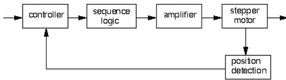
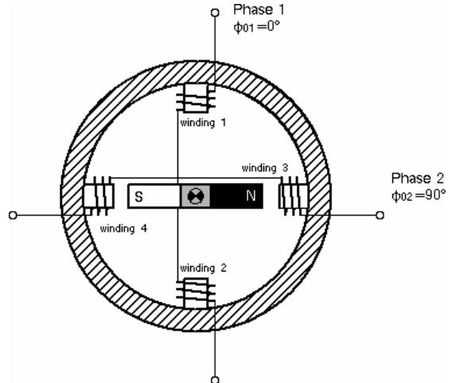
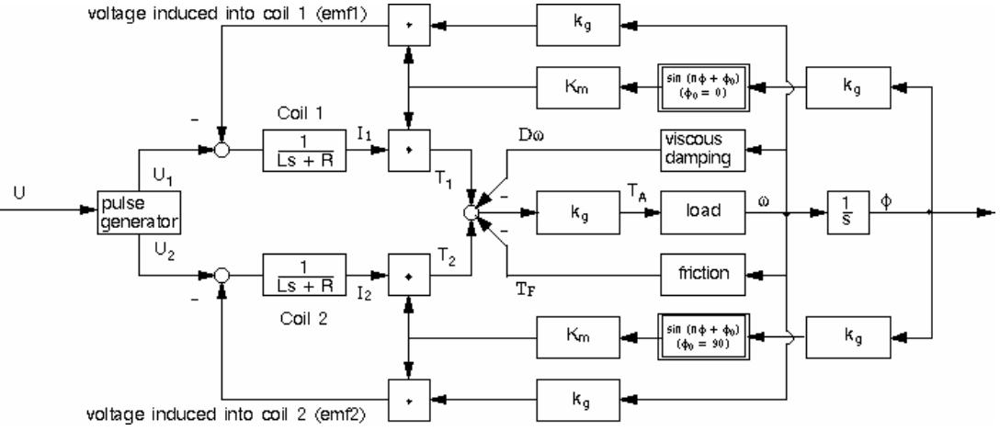
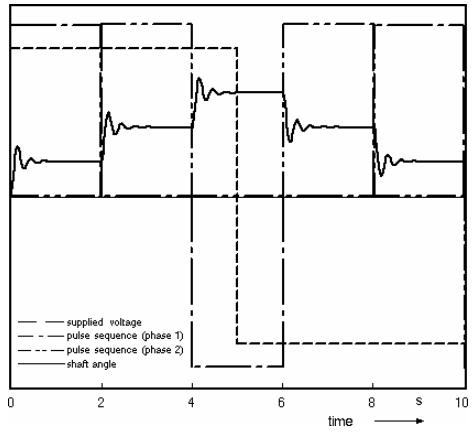
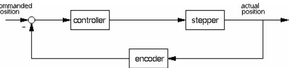
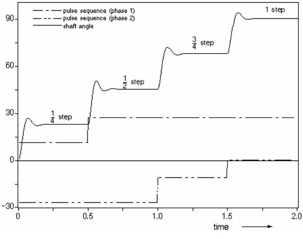
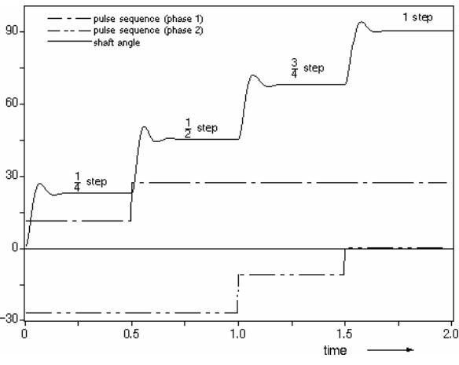
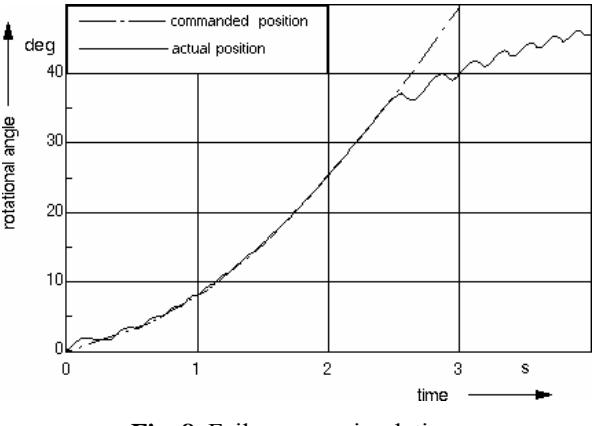

# *Stepper Motor Model for Dynamic Simulation*

Alexandru MORAR

"Petru Maior" University of Târgu–Mureş, Romania Department of Electrical Engineering Ro – 4300 Târgu–Mureş, 1 N. Iorga St., E–mail: *morar@uttgm.ro*

*Abstract: The modeling and simulation of the electromechanical behaviour of stepper motors are of high interest because they are often used for space application. A commercially available multibody dynamic simulation software, which sets up the equations of motion and the transfer function of the motor and solves them numerically, was used. The results show, that both the dynamic simulation software and the simulation model are well suited to predict the behaviour of drive units equipped with a stepper motor. The model allows microstepping and failure cases to be simulated.* 

*Keywords: stepper motor, dynamic simulation, model.*

## **1. Introduction**

Stepper motors are simple, robust and reliable and are well suited for open or close loop controlled actuators[1][3].

Steppers can be found in machine tools, typewriters, printers, watches, etc. In space applications stepper motors are mainly used as actuators of pointing mechanisms for antennas, mirrors, telescopes or complete payloads. In order to investigate the dynamics of mechanisms driven by stepper motors a model had to be created.

The electromechanical behavior of a stepper motor was described by control loops. This software calculates the dynamics of rigid and flexible bodies including the control loop dynamics. It generates the equations of motion and the transfer function numerically. A principal stepper motor control loop is given in figure 1.

 There are basically 3 types of stepper motors:

- permanent magnet (PM)
- variable reluctance (VR)
- hybrid

All types are considered.

**Fig. 1.** Stepper motor control system.

 Stepper motors are usually used in connection with gears, hence a gear model as well as electrical and mechanical stiffness, friction and resistance are considered [4]. For the purpose of this simulation a model of a 2 phase motor is build up.

 An option to extend the model to a 3 or 4-phase stepper will be discussed later. To simplify the model a 90 degrees step size is discussed here.

### **2. Model generation**

#### **2.1. Basic equations**

 The principle of a 2-phase stepper motor is given in figure 2.

 The rotor is a permanent magnet consisting of 1 pole pair. When the windings of one phase are energized, a magnetic dipole is generated on the stator side. If for example phase 2 is active (Phase 1 is switched off),

the rotor. **Fig. 2.** Principle of a 2 phase stepper motor.

winding 3 produces an electrical south pole and winding 4 an electrical north pole. Figure 2 shows the rotor in a stable position with phase 2 only powered.

The number of steps per revolution of the rotor is calculated as:

$$S = 2 \cdot n \cdot m \tag{1}$$

where n is the number of rotor pole pairs and m the number of stator phases. For the hybrid stepper motor, n is half the number of rotor teeth.

The stepping angle is:

$$
\Delta\phi = \frac{\text{360}}{\text{s}}\tag{2}
$$

For the example of we have n=1 and
m=2. So that we have 4 steps per revolution
and a stepping angle of 90 degrees, what is
obvious from figure 2. If a sinusoidal
characteristic of the magnetic field in the air
gap is assumed, the contribution of each
phase j on the motor torque TMj can be
written as:
$$T\_{Mj} = k\_m \cdot sin[n \phi(t) + \phi\_{0j}] \cdot I\_j(t) \qquad (3)$$

where:

where:

- - $k\_m$  is the motor constant, depending on the design of the motor
- ø (t) is the actual rotor position
- - $ø\_{0j}$  is the location of the coil j in the 
stator
- Ij(t) is the current in the coil as function of time.

The current Ij(t) in the coil is a function of the supplied voltage Uj and the coil properties. A general equation between Uj and Ij(t) is given by:

$$U\_{j} = emf\_{j} + R \cdot I(t) + L\frac{dI(t)}{dt} \qquad (4)$$

where:

- emfj the electromotive force induced in the phase j
- R the resistance of the coils
- L the inductance of the coils.

The emf in each coil can be expressed as:

$$emf\_{j} = k\_{m} \cdot sin[n\phi(t) + \phi\_{0j}] \cdot \omega \qquad (5)$$

where [omega] is the rotational velocity of

Resistance and inductance of all coils in the motor are the same so that no indices are required. The differential equation can be expressed in the LAPLACE domain:

No corrections needed.

The total torque produced by the stepper is:

No corrections needed.

Considering the equation of motion of the stepper motor

$$\sum\_{j=l}^{m} T\_{Mj} = J \frac{d\omega}{dt} + D\omega + T\_F \qquad (8)$$

where:

- J the inertia of the rotor and the load
- D the viscous damping constant
- TF frictional load torque

The total load acceleration  $T\_A$  torque is:

$$T\_{A} = \sum\_{j=l}^{m} T\_{Mj} - D\omega - T\_{F} \qquad (9)$$

For more than 1 phase the arrangement
of the coils has to be considered. The location
of the coils  $ø\_{0j}$  in the stator as a function of
the number of phases m is given in table 1.**Table 1.** 

| No of phases m | 2  | 3   | 4   |
|----------------|----|-----|-----|
| Ø0 of phase 1  | 0  | 0   | 0   |
| Ø0 of phase 2  | 90 | 60  | 45  |
| Ø0 of phase 3  | -  | 120 | 90  |
| Ø0 of phase 4  | -  | -   | 135 |

If the sinusoidal characteristic of the torque angle curve is dropped, this model can be used to simulate other types of machines, eg. brushless DC motors.

## **2.2. Generation of pulses**

The pulse generator of the motor produces step commands according to the supplied voltage. It is obvious that for any desired rotor sequence of positions a certain pattern of voltages for phase 1 and 2 as a function of time has to be provided. Therefore it is necessary to know the actual position. This is done in 2 different ways:- 1. "detect" the rotor position by an encoder, or,
- 2. count the number of pulses in each direction.

The first option uses in closed loop control and requires an additional device. Therefore the second will be considered. If count the number of pulses is counted, initially information about the position is also available. If x steps have been taken in positive and y steps in negative direction the actual rotor position  $\phi\_i$  is:
$$
\phi\_{i} = (x - y) \cdot \Delta \phi \qquad (10)
$$

The commanded position  $φ\_{i+1}$  will then be:

$$
\phi\_{i+1} = \phi\_i \pm \Delta\phi \tag{11}
$$

(+) stands for positive, (-) for negative voltage.

The pulses for both phases required for 1 revolution are given in table2.

**Table 2.**  Rotor position Voltage in phase 1 Voltage in phase 2 0/360° 0 -U2 90° U1 0 180° 0 U2 270° -U1 0

The required pulse for each phase with a given  $\phi\_{i+1}$  may be calculated by:No corrections needed.

The time dependency of the pulse sequence is described by a time increment  $t$ :No corrections needed.

where f is a scaling factor and can be used to  
tune the system. For every time step t one  
pulse of the related phase is produced. If we  
furthermore consider the gear ratio  $kg$  of the  
reduction unit that amplifies the torque by a  
gain, the control loop of a 2-phase stepper  
motor based on the eq. is given in figure 3.A voltage U representing the required
rotational motor speed is commanded to
block "pulse generator". The voltages  $U₁$  &
 $U₂$  are fed to coil 1 and 2 after being
processed in the pulse generator. These
voltages are decreased by the amount of the
induced emf's create the currents  $I₁$  &  $I₂$  in the
windings. The currents are transferred into
torques via the position dependent motor
constants. In the first approach a sinusoidal
characteristic has been assumed. For
simulating other shapes of the torque angle
curve this block has to be modified.

Fig. 3. 2-phase stepper motor (open loop).

The load acceleration torque is the summation of the torques produced by each phase decreased by the resistive torques due to friction and viscous damping. The action of the reduction unit (gearing) is realized by a gain, which amplifies the torque. The load velocity and position after being reduced to the rotor side is used to calculate the emf in the coils.

The element named "load" can be any rotating structure with an inertia. To extend the model to a 3 or 4 phase stepper, a loop 3 and 4 have to be added. In order to verify the model, a test run has been performed.

The data of a typical hybrid stepper motor (23 PP series) is given in table 3.

| Operating voltage U        | 27 V     |
|----------------------------|----------|
| Static holding torque TM   | 0.5 Nm   |
| Winding resistance R       | 100 ohms |
| Electrical time constant E | 5 ms     |
| Stepping angle             | 1.8 deg  |
| Number of pole pairs n     | 50       |
| Load inertia J             | 1.0 kgm2 |

The shaft rotation angle as a function of time and the commanded voltage is given in figure 4. The pulse sequence is indicated additionally.

**Fig. 4.** Stepper motor in open loop.

Each change in angular position shows the oscillatory transient behavior typical for a stepper motor.

## **3. Stepper motor in closed loop**

To run a motor in a closed loop, several additional elements are needed. These are the controller, which evaluates the deviation from the commanded position and the encoder, which detects the position of the rotor. Mathematically the controller can be described as a first order differential equation, whereas the encoder is not needed in the control loop, because the position of the rotor is a primary result of the simulation. Figure 5 shows the control loop of a stepper motor running in a closed loop.

**Fig. 5.** Stepper motor model closed loop.

In order to interpret the stepper motor model running in closed loop mode a test run has been performed (data according to table 3).

Figure 6 shows the result of the simulation of the closed loop for an ramp input.

**Fig. 6.** Commanded and actual position.

When a certain deviation of the actual position of the commanded position is detected, the controller produces a certain magnitude of voltage, which is sufficient to drive the motor following the commanded signal. The higher the deviation from the commanded position, the higher the driving voltage.

#### **4. Simulation of microstepping**

There are some applications, where a very fine resolution is required, e.g. in pointing of antennas. The stepping angle  
could be reduced by increasing the number of  
pole pairs (or rotor teeth) or number of  
phases, which is limited by the manufacturing  
capabilities. If the step angle must be smaller  
than about 0.3 deg., a technique called  
microstepping is used. Microstepping is an  
operation mode of the motor with 2 phases  
energized simultaneously. The position of the  
rotor between 2 adjunct coils is determined  
by the ratio of the phase currents Uj. A ratio  
of 1 corresponds hereby to the midposition.  
Any other ratios lead to other positions. In  
practice the current of one phase is kept  
constant over half of the complete step in  
order to maximize the motor torque.

If U0 is the maximum available voltage
produced by the pulse generator, the required
pulse sequence for a subdivision of a step
into 4 micro steps is given in table 4.

| Table 4. |  |
|----------|--|
|----------|--|

| Step position (angle in deg) | U1    | U2    |
|---------------------------------|-------|-------|
| 0 (0)                           | U0    | 0     |
| 1/4 (22.5)                      | U0    | k2 U0 |
| 1/2 (45)                        | U0    | U0    |
| 3/4 (67.5)                      | k1 U0 | U0    |
| 1 (90)                          | 0     | U0    |

kj is a predetermined fraction of the current,  
which is sufficient to rotate the rotor to the  
required position by ¼ of a step. Considering  
the assumed sinusoidal torque angle curve,  
the relationship for the calculation of k is  
given by:No corrections needed.

to achieve equidistant micro steps. Therefore is:

$$k\_{i} = \frac{1}{\tan(n\phi)} = \cot(n\phi) \tag{15}$$

and

No corrections needed.

For the assumed step angle of  $90/4 = 22.5$  deg, k2 is 0.4142 for phase 2. This means that the current of phase 1 has to be:U1=U0 and of phase 2,U2= $0.4142 U\_0$ 
to achieve a micro step of 1/4 of the step size to position 22.5 degrees.

The results of a test run performed to check the algorithm is shown in figure 7.

**Fig. 7.** Stepper motor in open loop (microstepping).

The model provides accurate micro steps of exact 22.5 degrees steps.

#### **5. Failure mode simulation**

It has been demonstrated in [4], that the investigation of failure cases is very important to improve the reliability of the stepper performance. In the normal operation mode the rotor is follows accurately the commanded position. However, if the pulse frequency is near to or higher than the natural frequency of the motor, the rotor will loose synchronization.

To investigate this failure mode a simulation was performed. The commanded velocity was increased steadily (see figure 8).

**Fig. 8.** Failure case simulation.

The motor starts to accelerate until it is running in resonance. After approximately 2.5 sec. the rotor has lost the synchronization and the behavior becomes unpredictable. Simulations of this kind are very important to investigate and design drive units running under extreme conditions.

## **6. Conclusions**

To investigate and predict the dynamic behavior of mechanisms driven by a stepper motor, a model has been created that describes the electromechanical properties of this drive. To set up the equations of motion of the load and the transfer function of the stepper and its control loop a commercially available dynamic simulation software package has been used.

The created model is qualified to simulate:

- open and closed loop control
- microstepping mode
- failure cases.

By varying the input parameter, stepper motor and control loop design work is possible. The model allows the simulation of all types of stepper motors (VR, PM, hybrid). The results show, that both the software and the model provide realistic statements about stepper motor and load behavior. The model is reliable and numerically stable. This model can also be used for other dynamic simulation programs with only small changes. A future task is to refine the model to consider effects like backlash in the hinge of the gearing. Other drives can be simulated with this model with only small changes, eg. DC motors.

## **References**

- 1. Acarnley, P.P.: *Stepping Motors: a Guide to Modern Theory and Practice*. Peter Peregrinus Ltd., ISBN: 0 86 341027 8, London, 1992.
- 2. Takasaki, K., Sugawara, A*.*: *Stepping Motors and Their Microprocessor Controls*. Clarendon Press, ISBN: 0 19 859386 4 hbk, Oxford, 1994.
- 3. Morar, A.: *Sisteme electronice de comandă şi alimentare a motoarelor pas cu pas implementate pe calculatoare personale (Electronic systems for stepping motor control implemented on personal computers).* Teză de doctorat, Universitatea Tehnică din Cluj-Napoca, 2001.
- 4. Morar, A.: *Echipamente de comandă a motoarelor pas cu pas implementate pe calculatoare personale.* Editura Universităţii " Petru Maior " din Tg.-Mureş, ISBN: 973-8084-47-4, Tg.-Mureş, 2002.
- 5. Voiculescu, E.: *Sisteme electronice de comandă a motoarelor pas cu pas*, Teză de doctorat, I.P. Cluj-Napoca, 1992.