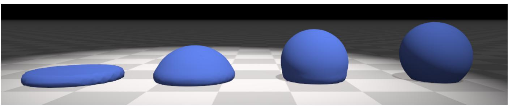
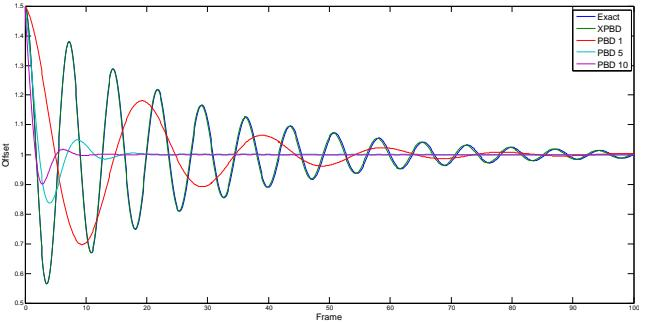
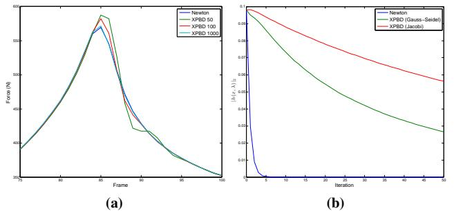
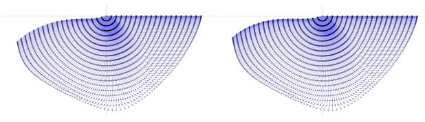
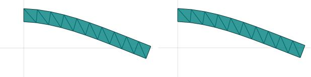
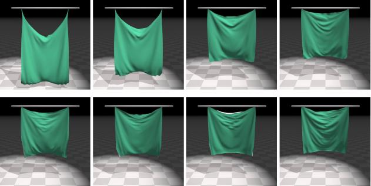

# **XPBD: Position-Based Simulation of Compliant Constrained Dynamics**

Miles Macklin

thias Müller

Miles Macklin Matthias Muller Nuttapong Chentanez ¨

NVIDIA

Figure 1: *In this example, we see the effect of changing the relative stiffness of volume conservation and stretch and shear constraints on a deformable body. Unlike traditional PBD, our method allows users to control the stiffness of deformable bodies in a time step and iteration count independent manner, greatly simplifying asset creation.*

## **Abstract**

We address the long-standing problem of iteration count and time step dependent constraint stiffness in position-based dynamics (PBD). We introduce a simple extension to PBD that allows it to accurately and efficiently simulate arbitrary elastic and dissipative energy potentials in an implicit manner. In addition, our method provides constraint force estimates, making it applicable to a wider range of applications, such those requiring haptic user-feedback. We compare our algorithm to more expensive non-linear solvers and find it produces visually similar results while maintaining the simplicity and robustness of the PBD method.

Keywords: physics simulation, constrained dynamics, position based dynamics

Concepts: •Computing methodologies → Real-time simulation; *Interactive simulation;*

## **1 Introduction**

Position-Based Dynamics [\[Muller et al](#page-5-0) ¨ . 2007] is a popular method for the real-time simulation of deformable bodies in games and interactive applications. The method is particularly attractive for its simplicity and robustness, and has recently found popularity outside of games, in film and medical simulation applications.

As its popularity has increased, the limitations of PBD have become more problematic. One well known limitation is that PBD's behavior is dependent on the time step and iteration count of the

MiG '16,, October 10 - 12, 2016, Burlingame, CA, USA

ISBN: 978-1-4503-4592-7/16/10

DOI: <http://dx.doi.org/10.1145/2994258.2994272>

simulation [\[Bender et al.](#page-5-1) 2014b]. Specifically, constraints become arbitrarily stiff as the iteration count increases, or as the time step decreases. This coupling of parameters is particularly problematic when creating scenes with a variety of material types, e.g.: soft bodies interacting with nearly rigid bodies. In this scenario, raising iteration counts to obtain stiffness on one object may inadvertently change the behavior of all other objects in the simulation. This often requires stiffness coefficients to be re-tuned globally, making the creation of reusable simulation assets extremely difficult. Iteration count dependence is also a problem even in the case of a single asset, for example, setting the relative stiffness of stretch and bending constraints in a cloth model. To make matters worse, the effects of iteration count are non-linear, making it difficult to intuitively adjust parameters, or to simply rescale stiffness values as a simple function of iteration count.

The recent resurgence in virtual-reality has given rise to the need for higher fidelity and more physically representative real-time simulations. At the same time, the wide-spread use of haptic feedback devices require methods than can provide accurate force estimates. PBD does not have a well defined concept of constraint force, and as such it has mostly been limited to applications where accuracy is less important than speed, and where simulations are secondary effects.

In this paper we present our extended position-based dynamics (XPBD) algorithm. Our method addresses the problems of iteration and time step dependent stiffness by introducing a new constraint formulation that corresponds to a well-defined concept of elastic potential energy. We derive our method from an implicit time discretization that introduces the concept of a total Lagrange multiplier to PBD. This provides constraint force estimates that can be used to drive force dependent effects and devices.

To summarize, our main contributions are:

- Extending PBD constraints to have a direct correspondence to well-defined elastic and dissipation energy potentials.
- Introducing the concept of a total Lagrange multiplier to PBD allowing us to solve constraints in a time step and iteration count independent manner.
- Validation of our algorithm against a reference implicit time stepping scheme based on a non-linear Newton solver.

Permission to make digital or hard copies of all or part of this work for personal or classroom use is granted without fee provided that copies are not made or distributed for profit or commercial advantage and that copies bear this notice and the full citation on the first page. Copyrights for components of this work owned by others than the author(s) must be honored. Abstracting with credit is permitted. To copy otherwise, or republish, to post on servers or to redistribute to lists, requires prior specific permission and/or a fee. Request permissions from permissions@acm.org. © 2016 Copyright held by the owner/author(s). Publication rights licensed to ACM.

## **2 Related Work**

There is a large body of work in computer graphics that attempts to solve constrained dynamics simulations [\[Nealen et al.](#page-5-2) 2005]. Our method builds on the position-based dynamics (PBD) algorithm presented by Muller et al. [ ¨ [2007\]](#page-5-0), which solves constraints at the position-level in an iterative Gauss-Seidel fashion. Stam [\[2009\]](#page-5-3) proposed a similar Gauss-Seidel constraint solver that operates on velocities. These approaches operate on constraints locally and are popular due to their efficiency and ease of implementation, however both methods suffer from iteration count stiffness dependence.

Many authors have applied PBD to deformable object simulation. Recently, Bender et al. [\[2014a\]](#page-5-4) proposed a continuum-based formulation that treats strain-energy as a constraint function directly. Concurrently, Muller et al. [ ¨ [2014\]](#page-5-5) proposed constraining the entries of the Green-St Venant strain tensor to allow controlling strain in directions independent from the model discretization. Shape matching [\[Muller et al](#page-5-6) ¨ . 2005] introduces a geometric constraint for the simulation of deformable objects amenable to PBD, but again, all these methods suffer from a strong dependency of stiffness on iteration count. In contrast, our compliant constraint formulation has a direct correspondence to tradtional constitutive models, and converges to a well-defined solution.

Servin et al. [\[2006\]](#page-5-7) proposed a compliant constraint formulation of continuum models and a semi-implicit, velocity level integrator to handle a large range of stiffness in a time step independent manner. Our work adapts their compliant constraint formulation to PBD, allowing us to solve constraints at the position level, and without additional stabilization terms.

A number of works use a global approach in solving constraints. Goldenthal et al. [\[2007\]](#page-5-8) proposes a projection method for enforcing inextensible constraints similar to PBD, but where the constrained system is globally linearized and solved with a direct method at each iteration. Our method may be seen as a compliant version of their Fast Projection algorithm, combined with an iterative Gauss-Seidel solver. Tournier et al. [\[2015\]](#page-5-9) extend a compliant constraint formulation with second order derivative information to avoid instabilities due to linearization. In contrast to their work, our method uses only first order constraint derivatives, and avoids stability problems related to global linearization through repeated local linearizations per-time step.

Liu et al. [\[2013\]](#page-5-10) propose a local–global solver for mass-spring systems, where a local solve is used to handle non-linear terms relating to direction, while the global solve, which can be pre-factored, is used for handling stretching. The stiffness is largely independent of the iteration count and the solution approaches that of Newton's method as the number of iterations increases. The idea is generalized to other constraints in Projective Dynamics by Boaziz et al. [\[2014\]](#page-5-11). Wang [\[2015\]](#page-5-12) proposes a Chebyshev type approach that combines results from previous iterations to obtain better convergence. Narain et al. [\[2016\]](#page-5-13) applies the alternating direction method of multipliers (ADMM) for implicit time integration. Their method allows handling nonlinear constitutive models, hard constraints, and they show that projective dynamics is a special case of the ADMM.

These global approaches typically rely on the fact the global solve can be done efficiently, which often means pre-factoring the global matrix. However, if the constraint topology changes during run-time such as due to tearing or fracturing, the global matrix needs to be re-factored, which can be computationally intensive. They also tend to be much more involved to implement compared to PBD.

## **3 Background**

We briefly describe the core of the position-based dynamics algorithm and refer to the survey paper by Bender et al. [\[2014b\]](#page-5-1) for further detail. PBD can be thought of as a semi-implicit integration step using the Stomer-Verlet method, followed by a number of con- ¨ straint projection steps. The projection step is performed using local linearizations of each constraint function with mass weighted corrections. The main step in PBD's constraint solver is the calculation of the per-constraint position delta, given by:

$$
\Delta \mathbf{x} = k\_j s\_j \mathbf{M}^{-1} \nabla C\_j(\mathbf{x}\_i). \tag{1}
$$

Here the subscript *i* denotes the iteration index, *j* is the constraint
index, and  $k \in [0, 1]$  is the constraint stiffness applied simply as
a multiplier on each constraint correction. The scaling factor, *s*, is
given by the following equation, derived from a single Newton step
of the constraint function:
$$s\_{j} = \frac{-C\_{j}(\mathbf{x}\_{i})}{\nabla C\_{j} \mathbf{M}^{-1} \nabla C\_{j}^{T}}.\tag{2}$$

An undesirable side-effect of simply scaling the position change by k is that the effective constraint stiffness is now dependent on both the time step and the number of constraint projections performed. Muller et al. [ ¨ [2007\]](#page-5-0) attempted to address this by exponential scaling of the stiffness coefficient. However this does not take into account the time step, and does not converge to a well-defined solution in the presence of multiple constraints.

In the following section we develop a scheme using regularized constraints that have a direct correspondence to well-defined energy potentials, and show how to solve these in a time step and iteration count independent manner.

Algorithm 1 XPBD simulation loop

| 1:  | predict position $\tilde{\mathbf{x}} \Leftarrow \mathbf{x}^n + \Delta t \mathbf{v}^n + \Delta t^2 \mathbf{M}^{-1} \mathbf{f}_{ext}(\mathbf{x}^n)$ |
|-----|---------------------------------------------------------------------------------------------------------------------------------------------------|
| 2:  |                                                                                                                                                   |
| 3:  | initialize solve $\mathbf{x}_0 \Leftarrow \tilde{\mathbf{x}}$                                                                                     |
| 4:  | initialize multipliers $\mathbf{\lambda}_0 \Leftarrow \mathbf{0}$                                                                                 |
| 5:  | while $i < solverIterations$ do                                                                                                                   |
| 6:  | for all constraints do                                                                                                                            |
| 7:  | compute $\Delta \lambda$ using Eq (18)                                                                                                            |
| 8:  | compute $\Delta \mathbf{x}$ using Eq (17)                                                                                                         |
| 9:  | update $\mathbf{\lambda}_{i+1} \Leftarrow \mathbf{\lambda}_i + \Delta \lambda$                                                                    |
| 10: | update $\mathbf{x}_{i+1} \Leftarrow \mathbf{x}_i + \Delta \mathbf{x}$                                                                             |
| 11: | end for                                                                                                                                           |
| 12: | $i \Leftarrow i + 1$                                                                                                                              |
| 13: | end while                                                                                                                                         |
| 14: |                                                                                                                                                   |
| 15: | update positions $\mathbf{x}^{n+1} \Leftarrow \mathbf{x}_i$                                                                                       |
| 16: | update velocities $\mathbf{v}^{n+1} \Leftarrow \frac{1}{\Delta t} (\mathbf{x}^{n+1} - \mathbf{x}^n)$                                              |

## **4 Our Method**

We derive our extended position-based dynamics algorithm (XPBD)
by starting with Newton's equations of motion subject to forces
derived from an energy potential  $U(x)$ :
$$\mathbf{M}\ddot{\mathbf{x}} = -\nabla U^T(\mathbf{x}).\tag{3}$$

Here  $\mathbf{x} = [x\_1, x\_2, \cdots, x\_n]^T$  is the system state. In PBD this is often simply particle positions, however it may represent any generalizedcoordinate model, e.g.: rigid body transforms. Note that we use the convention that the gradient operator  $\nabla$  is a row vector of partial derivatives.We perform an implicit position-level time discretization of our equations of motion (3), where the superscript n denotes the time step index:

$$\mathbf{M}\left(\frac{\mathbf{x}^{n+1} - 2\mathbf{x}^n + \mathbf{x}^{n-1}}{\Delta t^2}\right) = -\nabla U^T(\mathbf{x}^{n+1}).\qquad(4)$$

The energy potential U(x) may be further specified in terms of a vector of constraint functions  $
\mathbf{C} = [C\_1(\mathbf{x}), C\_2(\mathbf{x}), \dots, C\_m(\mathbf{x})]^T
$  as
$$U(\mathbf{x}) = \frac{1}{2}\mathbf{C}(\mathbf{x})^T \boldsymbol{\alpha}^{-1} \mathbf{C}(\mathbf{x}),\tag{5}$$

where  $\alpha$  is a block diagonal compliance matrix corresponding to inverse stiffness. The force from an elastic potential is then given by the negative gradient of  $U$  with respect to  $x$ ,
$$\mathbf{f}\_{elastic} = -\nabla\_{\mathbf{x}} U^T = -\nabla \mathbf{C}^T \boldsymbol{\alpha}^{-1} \mathbf{C}.\tag{6}$$

We convert this to a compliant constraint formulation by following
Servin et al. [\[2006\]](#page-2-0) and decomposing the force into its direction and
scalar components by introducing the Lagrange multiplier,

$$
\lambda\_{elastic} = -\bar{\alpha}^{-1} \mathbf{C}(\mathbf{x}).\tag{7}
$$

Here  $\lambda\_{elastic} = [\lambda\_1, \lambda\_2, \dots, \lambda\_m]^T$  is a vector of constraint multipliers. Henceforth we will drop the subscript unless necessary for clarity. Note that we have included the time step from the left-hand side of Equation (4) by folding it into our compliance matrix and defining  $\tilde{\alpha} = \frac{\alpha}{\Delta t^2}$ .Substituting in our expression for  $\lambda$  we have the discrete constrained equations of motion:
$$\mathbf{M}(\mathbf{x}^{n+1} - \tilde{\mathbf{x}}) - \nabla \mathbf{C}(\mathbf{x}^{n+1})^T \boldsymbol{\lambda}^{n+1} = \mathbf{0} \tag{8}$$

$$\mathbf{C}(\mathbf{x}^{n+1}) + \tilde{\alpha}\lambda^{n+1} = \mathbf{0}, \qquad (9)$$

where  $\tilde{\mathbf{x}} = 2\mathbf{x}^n - \mathbf{x}^{n-1} = \mathbf{x}^n + \Delta t \mathbf{v}^n$  is called the predicted, or inertial, position. To solve this non-linear system we design a fixed point iteration based on Newton's method. In the following, we omit the time step superscript  $(n + 1)$  to emphasize the per-iteration unknown, indicated by the subscript  $(i + 1)$ .

We label equations (8, 9) as g and h respectively. Our goal is to find an x and  $\lambda$  that satisfies:
$$\mathbf{g}(\mathbf{x}, \lambda) = \mathbf{0} \tag{10}$$

$$\mathbf{h}(\mathbf{x}, \lambda) = \mathbf{0}.\tag{11}$$

Linearizing equations (10, 11) we obtain the following linear Newton subproblem:

$$
\begin{bmatrix}
K & -\nabla C^{T}(x\_{i}) \\
\nabla C(x\_{i}) & \tilde{\alpha}
\end{bmatrix}
\begin{bmatrix}
\Delta x \\
\Delta \lambda
\end{bmatrix} = -
\begin{bmatrix}
g(x\_{i}, \lambda\_{i}) \\
h(x\_{i}, \lambda\_{i})
\end{bmatrix} (12)
$$

where  $K = \frac{\partial g}{\partial x}$ . This system may be solved for  $\Delta x$  and  $\Delta \lambda$  and the positions and multipliers updated accordingly:
$$
\lambda\_{i+1} = \lambda\_i + \Delta\lambda \tag{13}
$$

$$\mathbf{x}\_{i+1} = \mathbf{x}\_i + \Delta \mathbf{x}.\tag{14}$$

This is a fixed-point iteration that satisfies our implicit equations
of motion (8, 9) for any sequence such that  $|\mathbf{x}\_{i+1} - \mathbf{x}\_i| \rightarrow 0$  and
 $|\lambda\_{i+1} - \lambda\_i| \rightarrow 0$ . Generally this method works well, however
it may require a line search strategy to be robust, and computing
the system matrix can be expensive. In particular, we would like
to avoid computing  $K$ , which requires the evaluation of constraint
Hessians.We now introduce two approximations that simplify the implementa-  
tion of our method and allow us to make a connection back to PBD.  
First, we use the approximation that  $K \approx M$ . This omits the geo-  
metric stiffness and constraint Hessian terms, and introduces a local  
error on the order of  $O(\Delta t^2)$ . We note that this approximation may  
change the rate of convergence, but it does not change the global  
error or solution to the fixed-point iteration. Specifically, it can be  
seen as a quasi-Newton method.Next, we assume that  $g(\mathbf{x}\_i, \lambda\_i) = 0$ . This assumption is justified by noting that it is trivially true for the first Newton iteration when initialized with  $\mathbf{x}\_0 = \tilde{\mathbf{x}}$  and  $\lambda\_0 = 0$ . In addition, if the constraint gradients change slowly then it will remain small, and will go to zero when they are constant. Furthermore, the modified linear system now corresponds to the optimality conditions for a mass-weighted minimization to the constraint manifold starting from the current iterate  $\mathbf{x}\_i$ . This variational point of view was discussed in detail by Goldenthal et al. [2007], and our method can be seen as a compliant version of their Fast Projection algorithm.Including these approximations, our updated linear subproblem is given by

$$
\begin{bmatrix}
\mathbf{M} & -\nabla \mathbf{C}^T(\mathbf{x}\_i) \\
\nabla \mathbf{C}(\mathbf{x}\_i) & \bar{\alpha}
\end{bmatrix}
\begin{bmatrix}
\Delta \mathbf{x} \\
\Delta \lambda
\end{bmatrix} = -\begin{bmatrix}
\mathbf{0} \\
\mathbf{h}(\mathbf{x}\_i, \lambda\_i)
\end{bmatrix},\qquad(15)
$$

we may then take the Schur complement with respect to M to obtain
the following reduced system in terms of the unknown  $\Delta\lambda$ :
$$\left[\nabla \mathbf{C}(\mathbf{x}\_{i}) \mathbf{M}^{-1} \nabla \mathbf{C}(\mathbf{x}\_{i})^{T} + \tilde{\alpha}\right] \Delta \lambda = -\mathbf{C}(\mathbf{x}\_{i}) - \tilde{\alpha}\lambda\_{i}.$$
  $ (16)$ 

The position update is then given directly by evaluating

$$
\Delta \mathbf{x} = \mathbf{M}^{-1} \nabla \mathbf{C}(\mathbf{x}\_i)^T \Delta \lambda. \tag{17}
$$

Although the solution returned by our method can no longer be said
to solve the implicit equations of motion exactly, in practice the
error is small. We investigate the accuracy of our method further in
Section 6.#### **4.1 A Gauss-Seidel Update**

We now make a connection back to PBD by considering a Gauss-
Seidel solution for our linear system of equations (16). If we take a
single constraint equation with index *j*, we can directly compute its
Lagrange multiplier change by evaluating

$$
\Delta \lambda\_{j} = \frac{-C\_{j}(\mathbf{x}\_{i}) - \tilde{\alpha}\_{j}\lambda\_{ij}}{\nabla C\_{j}\mathbf{M}^{-1}\nabla C\_{j}^{T} + \tilde{\alpha}\_{j}}.
\tag{18}
$$

This equation forms the core of our method. During constraint solving, we first calculate  $\Delta\lambda\_j$  for a single constraint, then we update the system positions and multipliers using Equations (13, 14). Algorithm 1 summarizes our method. It is identical to the original PBD algorithm with the addition of lines 4, 7, and 9.If we examine the equation for  $\Delta \lambda\_j$  more closely, we can see that  
in the case of  $\alpha\_j = 0$  it corresponds exactly to the scaling factor  
 $s\_j$  in the original PBD algorithm (2). From our new definition, we  
understand  $s\_j$  as being the incremental Lagrange multiplier change  
for an infinitely stiff constraint. In the case of compliance, we  
have  $\alpha\_j \geq 0$ , and an additional term in both the numerator and  
denominator appears. These terms act to regularize the constraint in  
such a way that the constraint force is limited, and corresponds to  
the elastic potential given by Equation (5).The numerator in Equation (18) includes reference to  $\lambda\_{ij}$ . This is
the total Lagrange multiplier for constraint *j* at the current iteration
*i*. We must store and update this variable in addition to the system
positions. The additional storage of one scalar per-constraint is
a modest overhead, and provides useful information on the total
constraint force, and can be used to drive force dependent effects
(e.g.: breakable joints), or haptic devices.### **5 Damping**

Our method is derived from an implicit time stepping scheme that
naturally includes some dissipation of mechanical energy. Neverthe-
less, it can be useful to model additional constraint damping. To do
so, we define a Rayleigh dissipation potential
$$D(\mathbf{x}, \mathbf{v}) = \frac{1}{2} \dot{\mathbf{C}}(\mathbf{x})^T \beta \dot{\mathbf{C}}(\mathbf{x}) \tag{19}$$

$$= \frac{1}{2}\mathbf{v}^{T} \nabla \mathbf{C}^{T} \beta \nabla \mathbf{C} \mathbf{v}, \qquad (20)$$

where  $\beta$  is a block diagonal matrix corresponding to the constraint
damping coefficients. Note that  $\beta$  is not an inverse parameter like
compliance, and should be set as a damping stiffness. According to
Lagrangian dynamics the force from a dissipation potential comes
from the negative gradient of  $D$  with respect to velocity
$$\mathbf{f}\_{damp} = -\nabla\_{\mathbf{V}} \mathbf{D}^T = -\nabla \mathbf{C}^T \beta \nabla \mathbf{C} \mathbf{v}.\tag{21}$$

As in the elastic case, we separate the scalar component of this force vector into a constraint multiplier

$$
\lambda\_{damp} = -\tilde{\beta}\dot{\tilde{C}}(x) = -\tilde{\beta}\nabla C v, \qquad (22)
$$

where we have included the time step in our damping parameter by defining  $\tilde{\beta} = \Delta t^2 \beta$ .It is possible to solve for  $\lambda\_{damp}$  by itself, and in so doing obtain a constraint force multiplier for the damping and elastic components individually. However, in most cases we only care to know the total constraint force, and because the damping force must act along the same direction as the elastic force, we can combine our multipliers into a single equation
$$
\lambda = \lambda\_{elastic} + \lambda\_{damp} = -\tilde{\alpha}^{-1} \mathbf{C}(\mathbf{x}) - \tilde{\beta} \nabla \mathbf{C} \mathbf{v}.\tag{23}
$$

Re-arranging [\(23\)](#page-3-1) into our constraint form we have

$$h(x, \lambda) = C(x) + \tilde{\alpha} \lambda + \tilde{\alpha} \tilde{\beta} \nabla Cv = 0. \qquad (24)$$

Substituting in our discrete approximation of velocity  $\mathbf{v} = \frac{1}{\Delta t}(\mathbf{x}^{n+1} - \mathbf{x}^n)$ , and linearizing with respect to  $\lambda$ , we have the following updated Newton step:
$$
\left[ (\mathbf{I} + \frac{\bar{\alpha}\bar{\beta}}{\Delta t}) \nabla \mathbf{C}(\mathbf{x}\_i) \mathbf{M}^{-1} \nabla \mathbf{C}(\mathbf{x}\_i)^T + \bar{\alpha} \right] \Delta \lambda = -\mathbf{h}(\mathbf{x}\_i, \lambda\_i). \tag{25}
$$

In terms of a single constraint equation, our Gauss-Seidel update is
now given by
$$
\Delta\lambda\_{j} = \frac{-C\_{j}(\mathbf{x}\_{i}) - \tilde{\alpha}\_{j}\lambda\_{ij} - \gamma\_{j}\nabla C\_{j}(\mathbf{x}\_{i} - \mathbf{x}^{n})}{(1 + \gamma\_{j})\nabla C\_{j}\mathbf{M}^{-1}\nabla C\_{j}^{T} + \tilde{\alpha}\_{j}}.\tag{26}
$$

A common case is that  $\tilde{\alpha}$  and  $\tilde{\beta}$  are simple diagonal (as opposed to block-diagonal), then we have  $\gamma\_j = \frac{\tilde{\alpha}\_j \tilde{\beta}\_j}{\Delta t}$ , i.e.: the time step scaled product of compliance and damping parameters for the constraint. We stress that all the additional terms here are easily and efficiently computable.### **6 Results**

We test our method on a variety of deformable models and constraint types. For our 2D results we have used a CPU implementation with Gauss-Seidel style iteration which we validate against a traditional non-linear Newton solver applied directly to the discrete equations of motion (8, 9). The Newton solver uses the robust Cholesky decomposition from the Eigen math library [2010] as its linear solver.

Our 3D results were captured from a GPU based solver using a Jacobi style iteration on a NVIDIA GTX1070. Collisions are handled exactly as in the original PBD method. We assume zero compliance in contact, meaning it is not necessary to store the Lagrange multiplier for the contact constraint.

**Figure 2:** A simple harmonic oscillator modeled as a distance constraint with compliance  $\alpha = 0.001$ . *XPBD* matches the analytic solution closely, while *PBD's* solution is heavily dependent on the number of iterations.

#### **6.1 Spring**

We test our method on the case of a simple harmonic oscillator
modeled as a distance constraint, with rest position of  $x = 1$ ,
initial position  $x\_0 = 1.5$ ,  $\alpha = 0.001$ , and mass  $m = 1$ . As we
can see from Figure 2, PBD cannot reproduce the correct period of
oscillation. We plot the PBD simulation with 1,5, and 10 iterations
to illustrate how PBD's oscillation period and damping are heavily

Figure 3: (a) The constraint force magnitude at the fixed support  
over a series of frames in the Chain example. (b) Residual error  
in  $h(x, \lambda)$  for a single frame taken from the Beam example, both  
Gauss-Seidel and Jacobi converge linearly as expected for an itera-  
tive method.iteration count dependent. In this simple case XPBD closely reproduces the analytic result regardless of time step and iteration count. We note that in this example the damping in the reference solution is a side-effect of our implicit discretization of the equations of motion.

#### **6.2 Chain**

Figure 4: *A time-lapse view of a hanging chain of 20 particles falling under gravity. Left: Reference Newton solver. Right: XPBD with 50 iterations.*

One of the key benefits of our method is its ability to return constraint force magnitudes. An important question then, is how accurate are the returned constraint forces? To quantify the error introduced by the PBD update we simulate a weakly extensible chain of particles as illustrated in Figure 4. The chain consists of 20 particles, each with  $m = 1.0$ , and connected by distance constraints with  $\alpha = 10^{-8}$ . We simulate the scenario over 100 frames and measure the resultant constraint force magnitude at the fixed particle at the top of the chain. Figure 3a compares the result of our reference Newton solver's solution to XPBD's. The maximum relative error for our method over the course of the simulation is 6%, 2%, and 0.5% for 50, 100, and 1000 iterations respectively. We believe this is acceptable for most graphics applications.#### **6.3 Cantilever Beam**

Traditional finite element methods (FEM) can be reformulated in the compliant constraint framework [\[Servin et al.](#page-5-7) 2006]. In the case of a linear isotropic constitutive model, the entries of the strain tensor for each element are treated as a vector of constraint functions, here in Voigt notation for a triangular element:

$$\mathbf{C}\_{tri}(\mathbf{x}) = \boldsymbol{\epsilon}\_{tri} = \begin{bmatrix} \boldsymbol{\epsilon}\_x \\ \boldsymbol{\epsilon}\_y \\ \boldsymbol{\epsilon}\_{xy} \end{bmatrix}. \tag{27}$$

Figure 5: *A cantilever beam modeled with triangular FEM elements and a linear, isotropic constitutive model, simulated for 50 frames. Left: Reference Newton solver. Right: XPBD, using 20 iterations our method is visually indistinguishable from the reference.*

The compliance matrix is then given by the inverse stiffness matrix, which, in terms of the Lame parameters is ´

$$\boldsymbol{\alpha}\_{tri} = \mathbf{K}^{-1} = \begin{bmatrix} \lambda + 2\mu & \lambda & 0\\ \lambda & \lambda + 2\mu & 0\\ 0 & 0 & 2\mu \end{bmatrix}^{-1} . \tag{28}$$

The advantage of this formulation over Strain-Based Dynamics [\[Muller et al](#page-5-5) ¨ . 2014] is that, not only does it correspond to traditional material parameters, it correctly couples the individual strains to model Poisson's effect. This allows XPBD to accurately simulate models with material properties obtained from experimental data.

We evaluate our algorithm's accuracy by simulating a cantilever  
beam modeled using a St Venant-Kirchhoff triangular FEM dis-  
cretization (Figure 5). We use a linear, isotropic constitutive model  
with Young's modulus of  $E = 10^5$ , Poisson's ratio  $\mu = 0.3$ , and  
 $\Delta t = 0.008$ . We run the simulation for 50 frames and find that 20  
iterations of XPBD are sufficient to be visually indistinguishable  
from our reference Newton solver. The residual error over iteration  
is plotted in Figure 3b.#### **6.4 Cloth**

**Figure 6:** Hanging cloth with 20, 40, 80, and 160 iterations respectively (left to right). **Top row:** PBD, **Bottom row:** XPBD. PBD stiffness is dependent on iteration count in a non-linear way, while XPBD's behavior is qualitatively unchanged.

We test the iteration count independent nature of our algorithm by simulating a hanging cloth subject to gravity. The cloth model consists of a 64x64 grid of particles connected by a graph of 24k distance constraints. In Figure [6](#page-4-4) we show the effect of fixing the constraint stiffness and varying the iteration count. Cloth simulated with PBD becomes progressively stiffer and more heavily damped as iteration count increases, while in XPBD behavior is consistent regardless of iteration count.

To clearly show how the PBD behavior changes with varying it-
eration counts we have used an artificially low constraint stiffness
of  $k = 0.01$ . We note that XPBD does not converge faster than
PBD, simply that behavior remains consistent at different iteration
counts. Indeed, in the limit of zero compliance XPBD is equivalent
a constraint stiffness of  $k = 1$  in PBD.We measure the performance impact of XPBD on our cloth example and find that it adds a small per-iteration cost that is typically less than 2% of the total simulation time. Please refer to Table [1](#page-5-15) for more detail.

Table 1: *Per-step simulation time (ms) for the hanging cloth example at varying iteration counts.*

| Iterations | 20   | 40   | 80   | 160  |
|------------|------|------|------|------|
| PBD        | 0.95 | 1.75 | 3.25 | 5.61 |
| XPBD       | 0.97 | 1.78 | 3.34 | 5.65 |

#### **6.5 Inflatable Balloon**

We apply our method to an inflatable balloon where the interior air pressure is modeled using a global volume constraint, and the outer surface as a cloth mesh with stretch, shear, and bending constraints (see Figure [1\)](#page-0-0). In terms of additional storage, the interior volume constraint requires only a single auxiliary multiplier, plus one multiplier for each surface constraint. Our method makes it easy to adjust the relative stiffness of constraints, for example, if necessary we may increase solver iterations to obtain stronger volume preservation without affecting surface stiffness.

## **7 Limitations and Future Work**

In the limit of  $\alpha = 0$  our method is identical to PBD with  $k = 1$ , and as such, requires the same number of iterations to obtain a stiff
result. Similar to PBD, low iteration counts that terminate before
convergence will result in artificial compliance. Convergence speed
may be improved by replacing Gauss-Seidel or Jacobi iteration with
a more sophisticated linear solver at each iteration. Recent work
that focused on accelerated iterative methods such as the Chebyshev
method presented by Wang et al. [\[2015\]](#page-9-1) could be applicable.One promising avenue that our method opens up is temporal coherence, because we now have a record of the total constraint force it should be possible to warm-start the constraint solve based on the previous frame's Lagrange multipliers.

Unlike Projective Dynamics [\[Bouaziz et al.](#page-5-11) 2014] our method is only an approximation of an implicit Euler integrator. For real-time graphical applications we believe the error is acceptable, and in many cases indistinguishable. However, traditional methods may be more suitable for applications requiring greater accuracy guarantees.

## **8 Conclusion**

We have presented a simple extension to position-based dynamics that addresses its most well known limitation, namely, time step and iteration count stiffness dependence. Our method requires computing and storing only a single additional scalar per-constraint, but allows PBD to simulate arbitrary elastic and dissipative energy potentials. In addition, it can provide accurate constraint force estimates for force dependent effects. We believe this widens the scope of PBD to applications which require greater accuracy and correspondence to traditional material models. Because our method requires

only trivial modifications to an existing PBD solver we expect it to be easily adopted by industry and practitioners.

### **References**

- BENDER, J., KOSCHIER, D., CHARRIER, P., AND WEBER, D. 2014. Position-based simulation of continuous materials. *Computers & Graphics 44*, 1–10.
- BENDER, J., M"ULLER, M., OTADUY, M. A., TESCHNER, M., AND MACKLIN, M. 2014. A survey on position-based simulation methods in computer graphics. *Computer Graphics Forum*, 1–25.
- BOUAZIZ, S., MARTIN, S., LIU, T., KAVAN, L., AND PAULY, M. 2014. Projective dynamics: fusing constraint projections for fast simulation. *ACM Transactions on Graphics (TOG) 33*, 4, 154.
- GOLDENTHAL, R., HARMON, D., FATTAL, R., BERCOVIER, M., AND GRINSPUN, E. 2007. Efficient simulation of inextensible cloth. In *ACM Transactions on Graphics (TOG)*, vol. 26, ACM, 49.
- GUENNEBAUD, G., JACOB, B., ET AL., 2010. Eigen v3. http://eigen.tuxfamily.org.
- LIU, T., BARGTEIL, A. W., O'BRIEN, J. F., AND KAVAN, L. 2013. Fast simulation of mass-spring systems. *ACM Transactions on Graphics (TOG) 32*, 6, 214.
- MULLER ¨ , M., HEIDELBERGER, B., TESCHNER, M., AND GROSS, M. 2005. Meshless deformations based on shape matching. In *ACM SIGGRAPH 2005 Papers*, ACM, New York, NY, USA, SIGGRAPH '05, 471–478.
- MULLER ¨ , M., HEIDELBERGER, B., HENNIX, M., AND RATCLIFF, J. 2007. Position based dynamics. *J. Vis. Comun. Image Represent. 18*, 2 (Apr.), 109–118.
- MULLER ¨ , M., CHENTANEZ, N., KIM, T.-Y., AND MACKLIN, M. 2014. Strain based dynamics. In *Proceedings of the ACM SIGGRAPH/Eurographics Symposium on Computer Animation*, Eurographics Association, Aire-la-Ville, Switzerland, Switzerland, SCA '14, 149–157.
- NARAIN, R., OVERBY, M., AND BROWN, G. E. 2016. ADMM ⊇ projective dynamics: Fast simulation of general constitutive models. In *Proceedings of the ACM SIGGRAPH/Eurographics Symposium on Computer Animation*. To appear.
- NEALEN, A., MULLER ¨ , M., KEISER, R., BOXERMAN, E., AND CARLSON, M. 2005. Physically Based Deformable Models in Computer Graphics. In *Eurographics 2005 - State of the Art Reports*, The Eurographics Association, Y. Chrysanthou and M. Magnor, Eds.
- SERVIN, M., LACOURSIERE, C., AND MELIN, N. 2006. Interactive simulation of elastic deformable materials. In *Proceedings of SIGRAD Conference*, 22–32.
- STAM, J. 2009. Nucleus: Towards a unified dynamics solver for computer graphics. In *Computer-Aided Design and Computer Graphics, 2009. CAD/Graphics' 09. 11th IEEE International Conference on*, IEEE, 1–11.
- TOURNIER, M., NESME, M., GILLES, B., AND FAURE, F. 2015. Stable constrained dynamics. *ACM Transactions on Graphics (TOG) 34*, 4, 132.
- WANG, H. 2015. A chebyshev semi-iterative approach for accelerating projective and position-based dynamics. *ACM Transactions on Graphics (TOG) 34*, 6, 246.