This paper has been accepted for publication in the IEEE Transactions on Robotics.

Please cite the paper as: P. Antonante, V. Tzoumas, H. Yang, and L. Carlone,

1 "Outlier-Robust Estimation: Hardness, Minimally Tuned Algorithms, and Applications", *IEEE Transactions on Robotics (T-RO)*, 2021.

# Outlier-Robust Estimation: Hardness, Minimally Tuned Algorithms, and Applications

Pasquale Antonante,? *Student Member, IEEE,* Vasileios Tzoumas,? *Member, IEEE,* Heng Yang, *Student Member, IEEE,* Luca Carlone, *Senior Member, IEEE*

*Abstract*—Nonlinear estimation in robotics and vision is typically plagued with outliers due to wrong data association, or to incorrect detections from signal processing and machine learning methods. This paper introduces two unifying formulations for outlier-robust estimation, *Generalized Maximum Consensus* (G-MC) and *Generalized Truncated Least Squares* (G-TLS), and investigates fundamental limits, practical algorithms, and applications.

Our first contribution is a proof that outlier-robust estimation
is inapproximable: in the worst case, it is impossible to (even
approximately) find the set of outliers, even with slower-than-
polynomial-time algorithms (particularly, algorithms running in
quasi-polynomial time). As a second contribution, we review
and extend two general-purpose algorithms. The first, Adaptive
Trimming (*ADAPT*), is combinatorial, and is suitable for G-MC; the
second, Graduated Non-Convexity (*GNC*), is based on homotopy
methods, and is suitable for G-TLS. We extend *ADAPT* and *GNC*
to the case where the user does not have prior knowledge of the
inlier-noise statistics (or the statistics may vary over time) and is
unable to guess a reasonable threshold to separate inliers from
outliers (as the one commonly used in RANSAC). We propose
the first minimally tuned algorithms for outlier rejection, that
dynamically decide how to separate inliers from outliers. Our
third contribution is an evaluation of the proposed algorithms on
robot perception problems: mesh registration, image-based object
detection (shape alignment), and pose graph optimization. *ADAPT*
and *GNC* execute in real-time, are deterministic, outperform
RANSAC, and are robust up to 80–90% outliers. Their minimally
tuned versions also compare favorably with the state of the art,
even though they do not rely on a noise bound for the inliers.*Index Terms*—Robust estimation, resilient perception, autonomous systems, computer vision, maximum likelihood estimation, algorithms, computational complexity.

#### SUPPLEMENTARY MATERIAL

- Source-code: <https://github.com/MIT-SPARK/GNC-and-ADAPT>
- GTSAM implementation: [https://github.com/borglab/gtsam/blob/](https://github.com/borglab/gtsam/blob/develop/gtsam/nonlinear/GncOptimizer.h) [develop/gtsam/nonlinear/GncOptimizer.h](https://github.com/borglab/gtsam/blob/develop/gtsam/nonlinear/GncOptimizer.h)

#### I. INTRODUCTION

?Contributed equally to this work.

P. Antonante, H. Yang, and L. Carlone are with the Laboratory for Information & Decision Systems, Massachusetts Institute of Technology, Cambridge, MA 02139, USA. {antonap, hankyang, lcarlone}@mit.edu

At the time the paper was accepted for publication, V. Tzoumas was with the Laboratory for Information & Decision Systems, Massachusetts Institute of Technology, Cambridge, MA 02139, USA. Currently, he is with the Department of Aerospace Engineering, University of Michigan, Ann Arbor, MI 48109, USA. vtzoumas@umich.edu

This work was partially funded by ARL DCIST CRA W911NF-17-2-0181, ONR RAIDER N00014-18-1-2828, MathWorks, NSF CAREER award "Certifiable Perception for Autonomous Cyber-Physical Systems", and Lincoln Laboratory's Resilient Perception in Degraded Environments program.

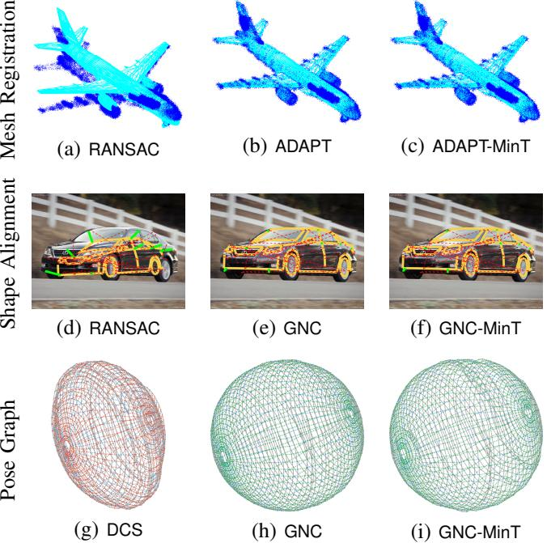

Fig. 1. We investigate fundamental limits and practical algorithms for
outlier-robust estimation. We discuss two algorithms, ADAPT and GNC, that
outperform the state of the art (DCS [\[1\]](#page-0-0) and RANSAC [\[2\]](#page-0-0) in the figure) in (a-b)
mesh registration, (d-e) shape alignment, and (g-h) pose graph optimization.
Moreover, we propose two variants, ADAPT-MinT and GNC-MinT, that (c,f,i)
perform favorably across robotics applications, and do not require parameter
tuning (e.g., kernel size in DCS, or maximum inlier noise in RANSAC).

NONLINEAR estimation is a fundamental problem in
robotics and computer vision, and is the backbone of
modern perception systems for localization and mapping [\[3\]](#page-9-1),
object pose estimation [\[4\]](#page-9-1), [\[5\]](#page-9-1), motion estimation and 3D
reconstruction [\[6\]](#page-9-1), [\[7\]](#page-9-1), shape analysis [\[8\]](#page-9-1), [\[9\]](#page-9-1), virtual and aug-
mented reality [\[10\]](#page-9-1), and medical imaging [\[11\]](#page-9-1), among others.Nonlinear estimation can be formulated as an optimization  
problem, where one seeks to find the estimate that best  
explains the observed measurements. A typical perception  
pipeline includes a perception *front-end* that extracts and  
matches relevant features from raw sensor data (e.g., camera  
images, lidar point clouds). These putative feature matches  
are then passed to a perception *back-end* that uses nonlinear  
estimation to compute quantities of interest (e.g., the location  
of the robot, the pose of external objects). In the idealized case  
in which the feature matches are all correct, the *back-end* can  
perform estimation using a least squares formulation:[¹](#page-0-0)

$$
\min\_{x \in X} \sum\_{i \in \mathcal{M}} r^{2}(y\_{i}, x), \tag{1}
$$

where  $x$  is the variable we want to estimate (e.g., a 3D pose),  

 $\mathcal{X}$  is its domain (e.g., the set of poses),  $\mathcal{M}$  is the set of given  

measurements (e.g., pixel observations of points belonging  

to the object),  $y\_i$  is the *i*-th measurement ( $i \in \mathcal{M}$ ), and  

 $r(y\_i, x) \geq 0$  is the residual error of the *i*-th measurement,  

which quantifies how well a given  $x$  fits a measurement  $y\_i$ ,  

(e.g.,  $r(y\_i, x) = |y\_i - \mathbf{a}\_i^\mathsf{T}x|$  for the linear, scalar measurement  

case). The problem in eq. (1) produces a maximum-likelihood  

estimate when the measurement noise is Gaussian, see e.g., [\[3\]](#page-9-1).  

However, despite its apparent simplicity, it is already hard to  

solve globally, since the cost function in (1) and the domain  

 $\mathcal{X}$  are typically non-convex in robotics applications [\[5\]](#page-9-1), [\[12\]](#page-9-1).The development of perception systems that can work  
in challenging real-world conditions requires the design of  
outlier-robust estimation methods. Perception front-ends are  
typically based on image or signal processing methods [\[13\]](#page-1-1)  
or learning methods [\[14\]](#page-1-1) for feature detection and matching.  
These methods are prone to produce incorrect matches, which  
result in completely wrong measurements  $y\_i$  in eq. (1) and  
compromise the accuracy of the solution returned by eq. (1).  
Computing robust estimates in the face of these *outliers* has  
been a central topic in computer vision and robotics.For low-dimensional estimation problems, *e.g.*, object pose
estimation from images or point clouds, researchers have often
resorted to combinatorial formulations for outlier rejection. In
particular, a popular formulation is based on *consensus max-
imization* [\[15\]](#page-1-0), [\[16\]](#page-1-0), which looks for an estimate maximizing
the number of measurements explained within a given *inlier
threshold*  $\epsilon$  (or equivalently, minimizes the number of outliers):
$$
\min\_{\begin{subarray}{c} x \in \mathcal{X} \\ \mathcal{O} \subseteq \mathcal{M} \end{subarray}} |\mathcal{O}| \quad \text{s.t.} \quad r(y\_i, x) \leq \epsilon, \quad \forall i \in \mathcal{M} \setminus \mathcal{O}. \quad (2)
$$

The Maximum Consensus *(MC)* problem in eq. (2) is then
solved using RANSAC [\[2\]](#page-0-1) or branch-and-bound *(BnB)* [\[16\]](#page-0-1).
However, RANSAC is non-deterministic, requires a minimal
solver, and is limited to problems where the estimate can
be computed from a small number of measurements [\[17\]](#page-0-1).
Similarly, BnB runs in the worst-case in exponential time and
does not scale to large problems.For high-dimensional estimation problems, *e.g.*, bundle ad-  
justment and SLAM, researchers have more heavily relied on  
*M*-estimation to gain robustness against outliers [\[18\]](#page-1-1). *M*-  
estimation replaces the least-squares cost in (1) with a function  
 $\rho$  that is less sensitive to measurements with large residuals:
$$\min\_{\mathbf{x} \in \mathcal{X}} \sum\_{i \in \mathcal{M}} \rho(r(\mathbf{y}\_{i}, \mathbf{x}), \varepsilon), \tag{3}$$

where, for instance,  $\rho$  can be a Huber, Cauchy, or Geman-McClure cost [\[19\]](#page-1-19). The M-estimation problem in eq. (3) has the advantage of leading to a continuous (rather thancombinatorial as in MC) optimization problem, which however  
is still hard to solve globally due to the typical non-convexity  
of the cost function and constraint set  $\mathcal{X}$ . Typical robotics  
applications use iterative local solvers to minimize (3), see [\[1\]](#page-9-1),  
[\[20\]](#page-9-1), [\[21\]](#page-9-1). However, local solvers require a good initial guess  
(often unavailable in applications) and are easily trapped in  
local minima corresponding to poor estimates.All in all, the literature is currently lacking an approach that simultaneously satisfies the following design constraints: (i) is fast and scales to large problems, (ii) is deterministic, (iii) can operate without requiring an initial guess. This gap in the literature is the root cause for the brittleness of modern perception systems and is limiting the use of perception in safety-critical applications, from self-driving cars [\[22\]](#page-1-22), to autonomous aircrafts [\[23\]](#page-1-23), and spacecrafts [\[24\]](#page-1-24).An additional limitation of state-of-the-art robust estimation
algorithms is that they require knowledge of the expected
(inlier) measurement noise. This knowledge is encoded in the
parameter  $\epsilon$  in both eq. (2) and eq. (3). However, in many prob-
lems, characterizing this parameter is time-consuming (*e.g.*, it
requires collecting data in a controlled environment to compute
statistics) or is based on trial-and-error (*i.e.*, requires manual
parameter tuning by a human expert). Also, this approach is
not suitable for long-term operation: imagine a ground robot
performing life-long SLAM; after months of operations, the
noise statistics may vary (*e.g.*, a flat tire leads to increased
odometry noise), making the factory calibration unusable.**Contributions.** This paper fills these gaps by understanding fundamental computational limits of robust estimation, and by designing outlier-robust estimation algorithms that: (i) are general-purpose and usable across many estimation problems, (ii) scale to large problems with thousands of variables, (iii) are deterministic, (iv) do not rely on an initial estimate, and (v) can potentially work without manual fine-tuning and be resilient to changes in the measurement noise statistics. We achieve these goals through three key contributions.1. General Formulations and Inapproximability. Sec-  
tion II introduces two unifying formulations for outlier-robust  
estimation, Generalized Maximum Consensus (G-MC) and Generalized Truncated Least Squares (G-TLS). G-MC is a combina-  
torial formulation and generalizes the popular MC in eq. (2) and  
the recently proposed Minimally Trimmed Squares (MTS) [\[25\]](#page-1-1);  
G-TLS is a continuous-optimization formulation and gener-  
alizes the truncated least squares used in M-estimation. We  
provide probabilistic interpretations for both formulations: G-  
MC solves a likelihood-constrained estimation problem, while  
G-TLS is a maximum likelihood estimator.We also provide necessary and sufficient conditions for G-MC and G-TLS to return the same solution. We demonstrate that, in general, the conditions may not be satisfied, and G-TLS can reject more measurements than G-MC. Notwithstanding, we provide counterexamples showing that, while G-TLS can reject more measurements, it may lead to more accurate estimates.Section [III](#page-4-0) proves that G-MC and G-TLS are inapproximable even by *quasi-polynomial* algorithms, which are slower than

1We use lowercase characters, *e.g.*,  $x$ , to denote real scalars or functions, bold lowercase characters, *e.g.*,  $\boldsymbol{x}$ , for real vectors, bold uppercase characters, *e.g.*,  $\boldsymbol{A}$  for real matrices, and calligraphic uppercase characters, *e.g.*,  $\mathcal{M}$ , for sets (either discrete or continuous); as exceptions, we use the standard notation  $\mathbb{R}$  to denote the set of real numbers, and  $\mathbb{N}$  to denote the set of non-negative integers.  $|x|$  is the absolute value of  $x$ , and  $|\mathcal{M}|$  is the cardinality of  $\mathcal{M}$ . If  $\boldsymbol{x} = [x\_1, x\_2, ..., x\_n]$ , then  $\|\boldsymbol{x}\|\_1 \triangleq \sum\_{i=1}^{n} |x\_i|$  is  $\boldsymbol{x}$ 's Manhattan norm;  $\|\boldsymbol{x}\|\_2 \triangleq \sqrt{\sum\_{i=1}^{n} x\_i^2}$  is  $\boldsymbol{x}$ 's Euclidean norm; and  $\|\boldsymbol{x}\|\_{\infty} \triangleq \max\{|x\_1|, |x\_2|, ..., |x\_n|\}$  is  $\boldsymbol{x}$ 's infinity norm.

polynomial.2 The result holds true subject to a believed
conjecture in complexity theory, NP  $\neq$  BPTIME( $m^{\text{poly log } m}$ ),
which is similar to the widely known NP  $\neq$  P.3 The result
captures the hardness of G-MC and G-TLS for the first time: even
in simplified cases where one knows the number of outliers to
reject or that the residual error for the inliers is zero, it is still
impossible to compute an approximate solution for G-MC and
G-TLS within a prescribed approximation bound. This result
strengthens recent inapproximability results for MC that only
rule out polynomial time algorithms [\[15\]](#page-2-1).2. **General-purpose and Minimally Tuned Algorithms.**  
Our second contribution is to discuss two general-purpose algorithms. Section IV presents a combinatorial approach, named *Adaptive Trimming (ADAPT)*, which is suitable for G-MC. The algorithm works by iteratively removing measurements with large errors, but contrarily to a naive greedy algorithm, it revisits past decisions and checks for convergence over a sequence of iterations, leading to more accurate estimates. Section V briefly reviews the *Graduated Non-Convexity (GNC)* approach of [\[27\]](#page-9-1), which is a continuous-optimization approach to solve G-TLS. Both algorithms have linear runtime, are deterministic, and do not require an initial guess.

Section VI presents the first outlier-robust estimation algo-  
rithms that are able to automatically adjust their parameters  
to perform robust estimation without prior knowledge of the  
inlier noise statistics. We present two algorithms, ADAPT-MinT  
and GNC-MinT, where MinT stands for “Minimally Tuned”, that  
automatically adjust the noise bounds in ADAPT and GNC  
without the need for manual fine-tuning. This is in stark  
contrast with the techniques in the literature, whose correct  
operation relies on the knowledge of the maximum inlier noise  
(*cf.* parameter  $\epsilon$  in eq. (2) and eq. (3)). We call these algorithms  
“Minimally Tuned” (rather than Parameter-Free) since they  
still involve parameters, which however only depend on the  
type of application, rather than the problem instance (*e.g.*, the  
same parameter values are used to solve any SLAM problem).3. Experiments in Robotics and Vision Problems. Section VII evaluates the proposed algorithms across three robot perception problems: mesh registration, image-based object detection (shape alignment), and pose graph optimization. In mesh registration and shape alignment, ADAPT and GNC execute in real-time, outperform RANSAC, and are robust up to 80% outliers. In pose graph optimization, ADAPT and GNC outperform local optimization [\[1\]](#page-9-1) and ad-hoc techniques [\[28\]](#page-9-1), and are robust up to 90% outliers. Their minimally tuned versions compare favorably with the state of the art, exhibiting similar performance as ADAPT and GNC, yet without requiring knowledge of a noise bound for the inliers.Novelty with respect to Previous Work [\[25\]](#page-20-16), [\[27\]](#page-20-17). This paper extends ADAPT and the hardness result (presented in [\[25\]](#page-20-16)) as well as GNC (presented in [\[27\]](#page-20-17)) in several directions. The 3

G-MC and G-TLS formulations are novel and generalize the formulations in [\[25\]](#page-2-2), [\[27\]](#page-2-2). The probabilistic justification of these formulations and their relations have not been published before. We streamline ADAPT to apply to both MC and MTS. We provide a local convergence proof for GNC. Moreover, the minimally tuned algorithms, ADAPT-MinT and GNC-MinT, are completely novel. We present a more extensive experimental evaluation, including 3D SLAM problems (not considered in [\[25\]](#page-2-2), [\[27\]](#page-2-2)). Finally, this paper includes a more comprehensive discussion—e.g., why using a greedy algorithm is ineffective for outlier rejection (Section IV-A), limitations of the proposed algorithms (Appendix 1), and an extended literature review (Section VIII)—and provides complete proofs of the technical results in the appendix.# II. OUTLIER-ROBUST ESTIMATION:

#### GENERALIZED MC AND TLS FORMULATIONS

Sections II-A and II-B present Generalized Maximum Consensus (G-MC) and Generalized Truncated Least Squares (G-TLS). Section II-C gives G-MC's and G-TLS's probabilistic justification (Propositions 2-4). Section II-D provides conditions for G-MC and G-TLS to be equivalent (Theorem 7).We use the following notation:

- - $x^{\circ}$  is the true value of  $x$  we want to estimate;
- - $\mathcal{O}^\circ$  is the true set of outliers;
- •  $r(y\_{\mathcal{I}}, x) \triangleq [r(y\_i, x)]\_{i \in \mathcal{I}}$ , for any  $\mathcal{I} \subseteq \mathcal{M}$ ; *i.e.*,  $r(y\_{\mathcal{I}}, x)$  is the vector of residuals for the measurements  $i \in \mathcal{I}$ .

#### A. Generalized Maximum Consensus (G-MC)

We present a generalized maximum consensus formulation.

Problem 1 (Generalized Maximum Consensus (G-MC)). Find an estimate  $x$  by solving the combinatorial problem
$$
\min\_{\begin{subarray}{c} x \in \mathcal{X} \\ \mathcal{O} \subseteq \mathcal{M} \end{subarray}} |\mathcal{O}| \quad \text{s.t.} \quad ||r(y\_{\mathcal{M} \setminus \mathcal{O}}, x)||\_{\ell} \leq \tau, \qquad \text{(G-MC)}
$$

where  $\tau \geq 0$  is a given inlier threshold, and  $\| \cdot \|\_{\ell}$  denotes a generic vector norm (in this paper,  $\ell \in \{2, \infty\}\)$ ).Since the true number of outliers is unknown, G-MC rejects
the least amount of measurements such that the remaining ones
appear as inliers. In (G-MC),  $O$  is the set of measurements
classified as outliers; correspondingly,  $M \setminus O$  is the set of
inliers. A choice of inliers  $M\setminus O$  is feasible only if there exists
an  $x$  such that the cumulative residual error  $|| r(y\_{M\setminus O}, x) ||\_{\ell}$ 
satisfies the inlier threshold  $\tau$  (enforced by the constraint).G-MC generalizes existing combinatorial outlier-rejection
formulations. In particular, depending on the choice of  $\ell$  and
 $\tau$  in (G-MC), G-MC is equivalent to Maximum Consensus (MC)
or Minimally Trimmed Squares (MTS):- • MC as G-MC. If  $l = +\infty$  and  $\tau = \epsilon$  in *(G-MC)*, then G-MC is equivalent to MC (eq. (2)), since  $|| r(y\_{\mathcal{M}\setminus\mathcal{O}}, x) ||\_{\infty} \leq \epsilon^2$  implies  $r(y\_i, x) \leq \epsilon, \forall i \in \mathcal{M} \setminus \mathcal{O}$ .
- MTS as G-MC. If  $l = 2$  in (G-MC), then G-MC is equivalent to the MTS [25], [29] formulation.

$$\min\_{\begin{array}{c}\mathfrak{a}\in\mathcal{X}\\\mathcal{O}\subseteq\mathcal{M}\end{array}}|\mathcal{O}| \quad \text{s.t.} \quad \sum\_{i\in\mathcal{M}\backslash\mathcal{O}} r^2(y\_i, x) \le \tau^2,\qquad(4)$$

since 

$$\| r(y\_{\mathcal{M}\setminus\mathcal{O}}, x) \|\_{2}^{2} = \sum\_{i \in \mathcal{M}\setminus\mathcal{O}} r^{2}(y\_{i}, x).$$

2An algorithm is called *quasi-polynomial*, if its runtime is  $k\_1 2^{(\log m)^{k\_2}}$ , where  $k\_1$  and  $k\_2$  are constants, and  $m$  is the algorithm's input size. Evidently, quasi-polynomial time algorithms are slower than polynomial, since  $k\_1 2^{(\log m)^{k\_2}} > k\_1 2^{k\_2 \log m} = k\_1 m^{k\_2}$ .

3NP  $\neq$  BPTIME( $m^{poly\ log\ m}$ ) means there exists no randomized algorithm that outputs solutions to problems in NP with probability 2/3, after running for  $O(m^{(\log\ m)^k})$  time, for an input size  $m$  and a constant [\[26\]](#page-2-26).

#### *B. Generalized Truncated Least Squares* (G-TLS)

We present a second formulation that generalizes truncated least squares in M-estimation [\[30\]](#page-3-1), [\[31\]](#page-3-1).We present a second formulation that generalizes truncated least squares in M-estimation [\[30\]](#page-20-21), [\[31\]](#page-20-22).

**Problem 2** (Generalized Truncated Least Squares (G-TLS)).  
Find an estimate  $x$  by solving the program

$$
\min\_{\begin{subarray}{c} x \in \mathcal{X} \\ \mathcal{O} \subseteq \mathcal{M} \end{subarray}} \nu\_{\ell}(\mathcal{O}) || r(\mathbf{y}\_{\mathcal{M} \setminus \mathcal{O}}, \mathbf{x}) ||\_{\ell}^{2} + \epsilon^{2} |\mathcal{O}|, \qquad \text{(G-TLS)}
$$

where  $\| \cdot \|\_{\ell}$  denotes a generic vector norm (in this paper,  

 $\ell \in \{2, \infty\}\)$ , and  $\nu\_{\ell}(O), \epsilon > 0$  are given penalty coefficients;  

in particular,  $\nu\_2(O) = 1$  and  $\nu\_{\infty}(O) = |M \setminus O|$ .G-TLS looks for an outlier-robust estimate  $x$  by separating the measurements into inliers and outliers such that the former are penalized with their weighted cumulative residual error  $\nu\_{\ell}(O) || r(y\_{M \setminus O}, x) ||\_{\ell}^2$ , and the latter with their weighted cardinality  $\epsilon^2 |O|$ . For appropriate choices of  $\epsilon$ , G-TLS reduces to Truncated Least Squares (TLS) or standard least squares (LS):
• TLS as G-TLS. If  $l = 2$ , then G-TLS becomes

$$
\min\_{\substack{x \in X \\ \mathcal{O} \subseteq \mathcal{M}}} \sum\_{i \in \mathcal{M} \backslash \mathcal{O}} r^{2}(y\_{i}, x) + \sum\_{i \in \mathcal{O}} \varepsilon^{2}, \qquad (5)
$$

which is equivalent to the TLS formulation [\[4\]](#page-3-4), [\[30\]](#page-3-4), [\[31\]](#page-3-4),  
commonly written using auxiliary binary variables  $w\_i$  as
$$
\min\_{\boldsymbol{x} \in \mathcal{X}} \sum\_{i \in \mathcal{M}} \min\_{w\_i \in \{0,1\}} \left[w\_i r^2(\boldsymbol{y}\_i, \boldsymbol{x}) + (1 - w\_i) \epsilon^2\right].\text{ (TLS)}
$$

- LS as G-TLS. If  $\ell = 2$  and  $\epsilon = +\infty$ , then, G-TLS becomes the least squares formulation in eq. (1).

#### *C. Probabilistic Justification of* G-MC *and* G-TLS

We provide a probabilistic justification for the G-MC and  
G-TLS formulations, under the standard assumption of inde-  
pendent noise across the measurements.

**Assumption 1** (Independent Noise). If  $i \ne j$ , for any  $i, j \in M$ , then  $r(y\_i, x)$  and  $r(y\_j, x)$  are independent random variables.

The results below provide a probabilistic grounding for two
G-MC's instances, Maximum Consensus (MC) and Minimally
Trimmed Squares (MTS), via likelihood estimation.**Proposition 2** (Uniform Inlier Distribution Leads to MC). If
r( $y\_i, x^{\circ}$ ) is uniformly distributed with support  $[0, \epsilon)$  for any
 $i \in M \setminus O^{\circ}$ , then MC in eq. (2) is equivalent to
$$\min\_{\substack{\mathfrak{w}\in\mathcal{X}\\ \mathcal{O}\subseteq\mathcal{M}}} \quad |\mathcal{O}| \quad \text{s.t.} \quad \prod\_{i\in\mathcal{M}\backslash\mathcal{O}} u(r(y\_i, x), \epsilon) > 0,\qquad(6)$$

where the inequality is strict, and  $u(r, \epsilon)$  is the probability density function of the uniform distribution with support [0,  $\epsilon$ ).The optimization in eq. (6) is a likelihood-constrained
estimation: eq. (6) finds an  $x$  such that the joint likelihood
of the inliers is greater than zero.Proposition 3 (Normal Inlier Distribution Leads to MTS). If
r( $y\_i, x^\circ$ ) follows a Normal distribution for any  $i \in M \setminus O^\circ$ ,
then MTS in eq. (4) is equivalent to

$$
\min\_{\begin{subarray}{c}\boldsymbol{x} \in \mathcal{X} \\ \mathcal{O} \subseteq \mathcal{M}\end{subarray}} |\mathcal{O}| \quad \text{s.t.} \quad \prod\_{i \in \mathcal{M} \backslash \mathcal{O}} g(r(\boldsymbol{y}\_{i}, \boldsymbol{x})) \ge \frac{e^{-\frac{\tau^{2}}{2}}}{(\pi / 2)^{\frac{|\mathcal{M} \backslash \mathcal{O}|}{2}}}, (7)
$$

where  $g(r) \triangleq \sqrt{2/\pi} \exp(-r^2/2)$  is the density of a Normal distribution constrained to the non-negative axis  $(r \ge 0)$ .Proposition 3 implies MTS is equivalent to a likelihood-  
constrained estimation, where the inliers follow a Normal  
distribution (in contrast to Proposition 2 where the inliers are  
uniformly distributed).Similarly, we show that an instance of G-TLS, Truncated
Least Squares (TLS), can be interpreted as a maximum likeli-
hood estimator. Particularly, if the number of outliers is known,
we show TLS selects a set of inliers and a maximum likelihood
estimate assuming the inliers are Normally distributed (Propo-
sition 4); and if the number of outliers is unknown, we provide
a broader characterization by connecting TLS to a max-mixture
of Normal and uniform distributions (Proposition 5).Proposition 4 (Normal Distribution and Known Number of
Outliers Lead to TLS). Assume  $r(y\_i, x^\circ) < \epsilon$  for any  $i \in M \setminus O^\circ$  and  $|O^\circ|$  is known. If  $r(y\_i, x^\circ)$  is Normally distributed
for each  $i \in M \setminus O^\circ$ , then TLS is equivalent to the cardinality-
constrained maximum likelihood estimator
$$
\max\_{\substack{\boldsymbol{x}\in\mathcal{X}\\ \mathcal{O}\subseteq\mathcal{M},\ |\mathcal{O}|=|\mathcal{O}^{\circ}|}} \prod\_{i\in\mathcal{M}\backslash\mathcal{O}} g(r(\boldsymbol{y}\_{i},\boldsymbol{x})). \tag{8}
$$

Proposition 5 (Normal with Uniform Tails Leads to TLS).
For any  $i \in M$ , assume (i)  $r(y\_i, x^\circ) \leq \alpha$  for some number  $\alpha$ ,
and (ii)  $r(y\_i, x^\circ)$  follows a modified Normal distribution  $\hat{g}(r)$ 
where the tail of the Normal distribution for  $r \geq \epsilon$  is replaced
with a uniform distribution with support  $[\epsilon, \alpha)$ ; particularly,
$$\hat{g}(r) = \frac{1}{\beta} \begin{cases} g(r), & r < \epsilon; \\ g(\epsilon), & r \in [\epsilon, \alpha]; \\ 0, & \text{otherwise}, \end{cases} \tag{9}$$

where  $\beta$  is a normalization factor (that depends on  $\alpha$ ) such that  $\hat{g}(\cdot)$  is a valid probability density  $(\int\_{0}^{\alpha} \hat{g}(r) dr = 1)$ .  
Then, TLS is equivalent to the maximum likelihood estimator
$$\max\_{\mathbf{x}\in\mathcal{X}}\prod\_{i\in\mathcal{M}}\hat{g}(r(y\_i,\mathbf{x})).\tag{10}$$

The interested reader can find an alternative probabilistic
interpretation of TLS in Appendix 3, where TLS is shown to
minimize the probability that an estimate becomes inaccurate
when measurements are misclassified as inliers instead of
outliers, and vice versa. We describe this probability with a
product of Weibull distributions.#### *D. Relationship Between* G-MC *and* G-TLS

Theorem 6 (G-MC = G-TLS when  $l = +\infty$ ). Choose  $|| \cdot ||\_l$  to be the infinity norm in G-MC and G-TLS, and  $\tau = \epsilon$  in G-MC. Also, assume G-MC has an optimal solution ( $x\_{G-MC}, O\_{G-MC}$ ) such that  $|| r(y\_{M \setminus O\_{G-MC}}, x\_{G-MC}) ||\_{\infty} < \epsilon$  (i.e., G-MC's inequality constraint is strict at an optimal solution). Then, G-MC and G-TLS compute the same set of outliers.The inequality  $|| r (y\_{\mathcal{M}\backslash \mathcal{O}\_{G-MC}}, x\_{G-MC}) ||\_{\infty} \leq \epsilon$  is strict
with probability 1 when the measurements are random. Hence,
G-MC = G-TLS with probability 1 when  $l = +\infty$ , and, thus, we
henceforth focus only on the TLS instance of G-TLS ( $l = 2$ ).- •  $(x\_{MTS}, O\_{MTS})$  an optimal solution to MTS (G-MC's instantiation for  $l = 2$ );
- •  $(x\_{TLS}, \mathcal{O}\_{TLS})$  an optimal solution to TLS (G-TLS's instantiation for  $l = 2$  and  $v\_l(\mathcal{O}) = 1$ );
- •  $r\_{TLS}^2(\epsilon)$  the error of the measurements classified as inliers at  $(x\_{TLS}, O\_{TLS})$ :  $r\_{TLS}^2(\epsilon) \triangleq ||r(y\_{\mathcal{M}} \setminus O\_{TLS}, x\_{TLS})||\_{\ell^2}^2$ ;
- •  $f\_{TLS}(\epsilon)$  the value of TLS:  $f\_{TLS}(\epsilon) \triangleq r\_{TLS}^2(\epsilon) + \epsilon^2 |O\_{TLS}|$ .

*Then, for any* > 0*,*

- if  $\tau = r\_{TLS}(\epsilon)$ , then  $|O\_{TLS}| = |O\_{MTS}|$ , and, in particular,   
( $x\_{TLS}, O\_{TLS}$ ) is also a solution to MTS;
- - *if* τ > rTLS()*, then* |OTLS| ≥ |OMTS|*;*
- • if  $\tau < r\_{TLS}(\epsilon)$ , then  $|O\_{TLS}| < |O\_{MTS}|$ , and MTS and TLS compute different sets of outliers.

Example 8 below elucidates the result in Theorem 7 by
considering instantiations of MTS and TLS in a toy example.
The example shows that although TLS may reject more mea-
surements than MTS, TLS can lead to more accurate estimates
of  $x^\circ$  since it tends to reject “biased” measurements.Example 8 (Sometimes, Less is More). Consider an esti-  
mation problem where (i) the variable to be estimated is a
scalar  $x$  with true value  $x^\circ = 0$ , (ii) three measurements are
available, the inliers  $y\_1 = y\_2 = 0$ , and the outlier  $y\_3 = 4$ , and
(iii) the measurement model is  $y\_i = x + n\_i$ , for all  $i = 1, 2, 3$ ,
where  $n\_i$  is zero-mean and unit-variance additive Gaussian
noise. Also, fix  $\epsilon = 2.58$  in TLS such that  $|n\_i| \leq \epsilon$  with
probability  $\approx 0.99$ , and, correspondingly, fix  $\tau = 11.35$  in MTS
such that  $n\_1^2 + n\_2^2 + n\_3^2 \leq \tau$  with probability  $\approx 0.99$ .4 Evidently,
at  $x^\circ = 0$ ,  $r(y\_1, x^\circ) = r(y\_2, x^\circ) = 0$  and  $r(y\_3, x^\circ) = 4$ .

In this toy problem, MTS returns an incorrect estimate: MTS classifies all measurements as inliers for  $x = 4/3$ , since then  $r^2(y\_1, x) + r^2(y\_1, x) + r^2(y\_3, x)$  is minimized and is equal to 32/3 ≈ 10.67, which is less than  $\tau$ .5On the other hand, TLS rejects more measurements than MTS but finds the correct estimate: TLS returns  $x = 0$ , classifying the third measurement as an outlier.A comparison of TLS with MC is given in [\[4,](#page-4-1) Appendix C].#### III. INAPPROXIMABILITY OF G-MC AND G-TLS

This section shows that G-MC and G-TLS are computationally
hard to solve, and in particular it is hard to even approximate
their solution in quasi-polynomial time, in the worst case.We start by recalling the  $O(.)$  and  $\Omega(.)$  notations from computational complexity theory [\[26\]](#page-4-1).**Definition 9** (O Notation). Consider two functions  $h : \mathbb{N} \rightarrow \mathbb{R}$  and  $g : \mathbb{N} \rightarrow \mathbb{R}$ . Then,  $h(m)=O(g(m))$  means there exists a constant  $k>0$  such that  $h(m) \leq kg(m)$  for large enough  $m$ .

5MC (eq.  $(2)$ ) also leads to a wrong estimate, selecting all measurements as inliers (e.g.,  $x = 2$  makes all measurements to have residual smaller than  $\epsilon$ ).

**Definition 10** (Ω Notation). Consider  $h : \mathbb{N} \to \mathbb{R}$  and  $g :$   

 $\mathbb{N} \to \mathbb{R}$ . Then,  $h(m) = \Omega(g(m))$  means there exists a constant  

 $k > 0$  such that  $h(m) \ge kg(m)$  for large enough  $m$ .Definition 11 (( $\lambda$ ,  $p$ )-Approximability). Consider  $\lambda \geq 1$ ,  
and  $p \geq 0$ . G-MC is ( $\lambda$ , $p$ )-approximable if there exists  
an algorithm finding a sub-optimal solution ( $\mathbf{x}$ , $\mathcal{O}$ ) for G-  
MC such that  $|\mathcal{O}| \leq \lambda |\mathcal{O}\_{G-MC}|$  and  $|| r(\mathbf{y}\_{M \setminus \mathcal{O}}, \mathbf{x}) ||\_{\ell}^{2} \leq$   
 $|| r(\mathbf{y}\_{M \setminus \mathcal{O}\_{G-MC}}, \mathbf{x}\_{G-MC}) ||\_{\ell}^{2} + p$ , where ( $\mathbf{x}\_{G-MC}, \mathcal{O}\_{G-MC}$ ) is  
an optimal solution for G-MC.Similarly, G-TLS is  $(\lambda, p)$ -approximable if there exists an algorithm finding a sub-optimal solution  $({\bf x}, {\mathcal O})$  for G-TLS such that  $|{\mathcal O}| \leq \lambda |{\mathcal O}\_{G-TLS}|$  and  $||{\bf r}({\bf y}\_{M \setminus {\mathcal O}},{\bf x})||\_{\ell^2}^2 \leq ||{\bf r}({\bf y}\_{M \setminus {\mathcal O}\_{G-TLS}},{\bf x}\_{G-TLS})||\_{\ell^2}^2 + p$ , where  $({\bf x}\_{G-TLS}, {\mathcal O}\_{G-TLS})$  denotes an optimal solution to G-TLS.Definition 11 bounds the sub-optimality of an approximate solution to G-MC or G-TLS: if  $(x, O)$  is an  $(\lambda,p)$ -approximate solution, then  $O$  rejects up to a multiplicative factor  $\lambda$  more outliers than the optimal set of outliers; and  $(x, O)$  attains an inlier residual error up to an additive factor  $p$  more than the residual error attained at the optimal solution.Theorem 12 (Inapproximability of G-MC and G-TLS). For any  $\delta \in (0, 1)$ , unless NP  $\in$  BPTIME( $|\mathcal{M}|^{poly\ log|\mathcal{M}|}$ ), there exist a  $\lambda(|\mathcal{M}|) = 2^{\Omega(\log^{1-\delta}|\mathcal{M}|)}$ , a polynomial  $p(|\mathcal{M}|)$ , and instances of G-MC such that no quasi-polynomial algorithm makes the instances ( $\lambda(|\mathcal{M}|),p(|\mathcal{M}|)$ )-approximable. The result holds true even if the algorithm knows (i)  $|\mathcal{O}\_{G-MC}|$ , and (ii) that the optimal solution is such that  $\| \mathbf{r}(\mathbf{y}\_{\mathcal{M}\setminus\mathcal{O}\_{G-MC}}, \mathbf{x}\_{G-MC}) \|\_{\ell^2} = 0$ .Similarly, the result holds true for G-TLS, even if the algo-  
rithm knows (i)  $|\mathcal{O}\_{G-TLS}|$ , and (ii) that the optimal solution is  
such that  $|| r(y\_{\mathcal{M}\setminus \mathcal{O}\_{G-TLS}}, x\_{G-TLS}) ||\_{\ell}^2 = 0$ .The theorem captures the extreme hardness of G-MC and  
G-TLS: in the worst case, any quasi-polynomial algorithm for  
G-MC and G-TLS cannot approximate the solution to G-MC and  
G-MC within an  $(\lambda, p)$ -approximation. This holds true even if  
the algorithm is informed with the optimal number of outliers  
to reject, or knows a priori that the optimal residual error  
is zero. The quality of the approximation depends on the  
parameter  $\lambda$  and  $p$  in Theorem 12, which are both polynomials.  
In particular, it can be seen that  $\lambda$  (cf. Definition 11) grows  
with the number of measurements, since  $\lambda = \lambda(2^{\Omega(\log^{1-\delta}|\mathcal{M}|)})$   
is proportional to  $|\mathcal{M}|$  when  $\delta$  is close to 0.We remark that, since both  $\lambda$  and  $p$  in Theorem 12 depend
on the number of measurements,  $|\mathcal{M}|$ , the theorem implies
there is no quasi-polynomial time algorithm achieving constant
sub-optimality bound for G-MC and G-TLS. As such, the
theorem strengthens recent inapproximability results for MC
that focus, instead, on polynomial-time algorithms only [\[15\]](#page-4-1).#### IV. ADAPTIVE TRIMMING (ADAPT) ALGORITHM

We present ADAPT, a general-purpose, deterministic, and li-  
near time algorithm for G-MC, that requires no initial guess.  
We first describe a simple greedy algorithm in Section IV-A,  
to build intuition, and then introduce ADAPT in Section IV-B.

4If  $n\_1$ ,  $n\_2$ ,  $n\_3$  are Gaussian random variables, each with mean 0 and
variance 1, then (i)  $\mathbb{P}(|n\_i| \le 2.58) \approx 0.99506$  for all  $i = 1, 2, 3$  [\[32\]](#page-4-32), where
 $\mathbb{P}(\cdot)$  denotes probability; also, (ii)  $n\_1^2 + n\_2^2 + n\_3^2$  follows a  $\chi^2$  distribution
with 3 degrees of freedom and  $\mathbb{P}(n\_1^2 + n\_2^2 + n\_3^2 \le 11.35) \approx 0.99$  [\[33\]](#page-4-33).

Algorithm 1: Adaptive Trimming (ADAPT).

**Input:** Measurements  $y\_i$ ,  $\forall i \in \mathcal{M}$ ; thresholds  $\tau$ ,  $\theta$ ;  

 $MaxIterations$ ,  $SamplesToConverge > 0$ ;  

 $ThrDiscount \in (0, 1)$ .  

**Output:** Estimate of  $\mathbf{x}^{\circ}$  and corresponding inliers.  

1  $\mathcal{I}^{(0)} = \mathcal{M}$ ;  $\mathbf{x}^{(0)} = \arg \min\_{\mathbf{x} \in \mathcal{X}} || r(y\_{\mathcal{I}^{(0)}}, \mathbf{x}) ||\_2^2$ ;  

2  $\varepsilon^{(0)} = ThrDiscount \cdot \max\_{i \in \mathcal{I}^{(0)}} r(y\_i, \mathbf{x}^{(0)})$ ;  $j = 0$ ;  

3 **for**  $t = 1,..., MaxIterations$  **do**  

4  $\mathcal{I}^{(t)} = \{i \in \mathcal{M} \text{ s.t. } r(y\_i, \mathbf{x}^{(t-1)}) \leq \varepsilon^{(t-1)}\}$ ;  

5  $\mathbf{x}^{(t)} = \arg \min\_{\mathbf{x} \in \mathcal{X}} || r(y\_{\mathcal{I}^{(t)}}, \mathbf{x}) ||\_2^2$ ;  

6 **if**  $|| r(y\_{\mathcal{I}^{(t)}}, \mathbf{x}) ||\_\ell < \tau$   

7 **and**  $|| \ | r(y\_{\mathcal{I}^{(t)}}, \mathbf{x}) ||\_2^2 - || r(y\_{\mathcal{I}^{(t-1)}}, \mathbf{x}) ||\_2^2 | < \theta(|\mathcal{I}^{(t-1)}|, |\mathcal{I}^{(t)}|) $  **then**  

8  $j++$ ;  

9 **else**  

10  $j = 0$ ;  

11 **end**  

12 **if**  $j = SamplesToConverge$  **then**  

13 **break**;  

14 **end**  

15  $\varepsilon^{(t)} = ThrDiscount \cdot \max\_{i \in \mathcal{I}^{(t)}} r(y\_i, \mathbf{x}^{(t)})$ ;  

16 **end**  

17 **return** ( $\mathbf{x}^{(t)}$ ,  $\mathcal{I}^{(t)}$ ).#### A. Gentle Start: Greedy Outlier Rejection

We start by describing a simple greedy algorithm for G-MC, to build intuition about ADAPT. The algorithm starts by
solving a least squares problem akin to eq. (1) over the entire
set of measurements, and, at each iteration, it rejects the
measurement with the largest residual. The algorithm stops
once the condition  $||r(y\_{M \setminus O}, x)||\_{\ell} \leq \tau$  in (G-MC) is satisfied.Although the described greedy algorithm is appealing for its simplicity and linear runtime,6,7 (i) it cannot correct past mistakes (once a measurement is rejected, it is never reconsidered) and (ii) the algorithm terminates once the threshold  $\tau$  is met, without, however, assessing if all outliers have been rejected, e.g., by checking whether  $|| r(y\_{M \setminus O}, x) ||\_2$  has converged. Because of these, the algorithm can exhibit deteriorated performance; *cf.* SLAM experiments in Section VII-C.#### *B. Beyond Greedy:* ADAPT *Algorithm*

We present the Adaptive *Trimming* (ADAPT) algorithm to
solve the G-MC formulation in Problem 1[8](#page-5-8) The algorithm pro-
cesses all measurements at each iteration, and *trims* (rejects)
measurements violating an inlier threshold (the threshold is
set at each iteration and decreases iteration after iteration).8The presentation in this section is slightly more general than our original proposal in [\[25\]](#page-5-1), which only focused on Minimally Trimmed Squares. In this paper, we show that changing the stopping condition in ADAPT also allows solving Maximum Consensus (MC) problems.The algorithm is *adaptive* in that it dynamically decides the threshold at each iteration. ADAPT is not greedy in that it can correct previous mistakes: a measurement that has been deemed to be an outlier at an iteration can be re-included in the set of inliers at subsequent iterations, and, similarly, a measurement that has been deemed to be an inlier at an iteration can be (re-)included in the set of outliers at subsequent iterations. ADAPT is not greedy also in that it assesses whether all outliers have been rejected by checking whether  $|| r(y\_{M \setminus O},x) ||\_2$  has converged. Finally, ADAPT can reject multiple measurements at each iteration, whereas greedy rejects one. Its pseudo-code is given in Algorithm 1.Initialization. ADAPT's line 1 initializes the putative set of inliers to  $\mathcal{I}^{(0)} = \mathcal{M}$  (all measurements); at the subsequent iterations  $t = 1,2,\dots$ , the set  $\mathcal{I}^{(t)}$  will include only the measurements classified as inliers at  $t$ . Given  $\mathcal{I}^{(0)}$ , ADAPT sets  $\mathbf{x}^{(0)} = \arg \min\_{\mathbf{x} \in \mathcal{X}} \| r(\mathbf{y}\_{\mathcal{I}^{(0)}}, \mathbf{x}) \|\_2^2$ , i.e.,  $\mathbf{x}^{(0)}$  is the estimate assuming all measurements are inliers; the nonlinear least squares problem can be minimized using non-minimal solvers, see [\[27\]](#page-5-1). Using  $\mathbf{x}^{(0)}$ , line 2 sets the initial inlier threshold  $\epsilon^{(0)}$  equal to  $ThrDiscount \cdot \max\_{i \in \mathcal{I}^{(0)}} r(\mathbf{y}\_i, \mathbf{x}^{(0)})$ , i.e., a multiplicative factor  $ThrDiscount$  less than the maximum residual at  $\mathbf{x}^{(0)}$ . That way, at least one measurement will be classified as an outlier at the next iteration. In this paper, we always set  $ThrDiscount = 0.99$ .Main Loop. After the initialization, ADAPT starts the main outlier rejection loop (line [3\)](#page-5-8). We describe each step below.

a) Inlier Set Update. At iteration  $t$ , given  $\varepsilon^{(t-1)}$ , line 4 updates the set of inliers  $\mathcal{I}^{(t)}$  to contain measurements with residual smaller than  $\varepsilon^{(t-1)}$ . Since ADAPT checks all measurements in  $\mathcal{M}$ ,  $\mathcal{I}^{(t)}$  may contain measurements that were *not* in  $\mathcal{I}^{(t-1)}$ , and may *not* contain measurements that *were* in  $\mathcal{I}^{(t-1)}$ . This allows ADAPT to re-include measurements that were incorrectly rejected as outliers at previous iterations, and to reject measurements that were incorrectly classified as inliers. Notably,  $\mathcal{I}^{(t)}$  depends on the history  $\mathcal{I}^{(1)}, ..., \mathcal{I}^{(t-1)}$ , since  $\varepsilon^{(t-1)}$  depends on  $\mathcal{I}^{(t-1)}$  (cf. line 15 of Algorithm 1), which in turn depends on  $\varepsilon^{(t-2)}$ , and so forth. Therefore, as ADAPT iterates, a sequence  $(\mathcal{I}^{(1)}, \varepsilon^{(1)}), ..., (\mathcal{I}^{(t)}, \varepsilon^{(t)}), ...$  is generated, and, ideally, even if measurements are misclassified at early iterations, eventually all are classified correctly.b) Variable Update. Given  $\mathcal{I}^{(t)}$ , a new estimate  $x^{(t)}$  is computed in line 5. Line 5's minimization is a nonlinear least squares problem that is solved using non-minimal solvers [\[27\]](#page-5-1).c) Inlier Threshold Update. If the current estimate is infeasible for G-MC and/or convergence of  $|| r(y\_{M \setminus O}, x) ||\_2$ 's value has not been observed for *SamplesToConverg* consecutive iterations (i.e., the “if” conditions in lines 6-7 and line 12 are not satisfied), ADAPT updates  $\varepsilon^{(t)}$  (line 15) and moves to the next iteration. Similarly to line 2, line 15 updates the threshold by applying a multiplicative factor *ThrDiscount*  $< 1$  to the maximum residual at the current iteration; this ensures that at least 1 measurement is rejected at the next iteration.Termination. ADAPT terminates when:

- • a maximum number of iterations is reached (*cf.* “for” loop in line 3; in this paper, we set  $MaxIterations = 1000$ );
- a feasible estimate for G-MC is found and for *Sam-plesToConverge* iterations  $|| r(y\_M\varphi, x) ||\_2$  changes by

6In the literature, there exists an alternative greedy algorithm [\[34\]](#page-5-1) that, at each iteration, tests the impact of rejecting each measurement (by solving multiple estimation problems), and then rejects only the measurement that induces the largest decrease in the objective function. We do not consider such a variant since it has quadratic complexity in the number of measurements, and does not scale to the problems we consider in Section VII.

7At each iteration, the described greedy algorithm rejects one measurement, and, as a result, has linear runtime in the number of measurements.

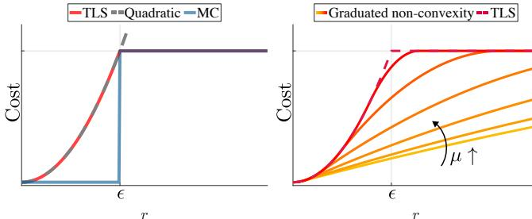

Fig. 2. (a) TLS, quadratic, and MC cost functions, (b) graduated non-convexity with control parameter  $\mu$  for TLS cost function.

at most  $\theta$  (cf. “if” conditions in lines 6-7 and line 12). In this paper, *SamplesToConverg* = 3. A probabilistically-grounded method to chose  $\theta$  is described in Section VII.Upon termination, ADAPT returns the current estimate  $x^{(t)}$  and inlier set  $\mathcal{I}^{(t)}$  (line [17](#page-6-17)). The following remark ensures that ADAPT terminates after at most  $|\mathcal{M}|$  iterations.Remark 13 (Linear Runtime). ADAPT's policy to update  $\epsilon^{(t)}$   
(line 15) implies that  $|\mathcal{I}^{(t)}| \leq |\mathcal{I}^{(t-1)}|-1$ , hence ADAPT terminates in at most  $|\mathcal{M}|$  (number of measurements) iterations.Remark 14 (vs. RANSAC). RANSAC is a randomized algorithm  
for G-MC, whereas ADAPT is deterministic. RANSAC maintains  
only a “local view” of the measurement set  $\mathcal{M}$ , building  
an inlier set by sampling a minimal set of measurements;  
instead, ADAPT looks at all measurements in  $\mathcal{M}$  to pick an  
inlier set. RANSAC assumes the availability of minimal solvers,  
while ADAPT assumes the availability of non-minimal solvers.  
RANSAC is unsuitable for high-dimensional problems, since  
the number of iterations required to sample an outlier-free set  
increases exponentially in the dimension of the problem [\[17\]](#page-6-1);  
in contrast, ADAPT runs in linear time, terminating in at most  
as many iterations as the number of measurements.#### V. GRADUATED NON-CONVEXITY (GNC) ALGORITHM

We provide a brief review of the GNC algorithm we pre-  
sented in previous work [\[27\]](#page-6-0). We show that —when consider-  
ing TLS costs— the algorithm can be simply explained without  
invoking Black-Rangarajan duality. Moreover, we provide a  
novel local convergence result (Theorem 15 below), which  
enables simpler stopping conditions for the algorithm.We briefly review graduated non-convexity in Section V-A,
and describe GNC in Section V-B.#### *A. Preliminaries on Graduated Non-convexity*

Before introducing the GNC algorithm we review the notion of graduated non-convexity [\[19\]](#page-6-1), [\[27\]](#page-6-1), [\[35\]](#page-6-1), [\[36\]](#page-6-1).

For convenience, we recall that our goal in this section is to solve the TLS problem (already introduced in ([\(TLS\)](#...))):

$$\min\_{\mathbf{x} \in \mathcal{X}} \sum\_{i \in M} \min\_{w\_i \in \{0,1\}} \left[w\_i r^2(\mathbf{y}\_i, \mathbf{x}) + (1 - w\_i) \epsilon^2\right]. (11)$$

Solving the minimization (11) is hard because the  
TLS objective function is highly non-convex in the resid-  
ual errors r. Indeed, the *i*-th summand in (11), namely  
 $\min\_{w\_i \in \{0,1\}} [w\_i r^2(y\_i, x) + (1-w\_i)\epsilon^2]$ , describes a truncated  
quadratic function, that is nonconvex as shown in Fig. 2(a).Algorithm 2: Graduated Non-Convexity for Truncated  

Least Squares (GNC-TLS) [\[27\]](#page-6-1).  

**Input:** Measurements  $y\_i$ ,  $\forall i \in M$ ; threshold  $\epsilon \ge 0$ ;  

 $MaxIterations > 0$ ;  $MuUpdateFactor > 1$ .  

**Output:** Estimate of  $x^{\circ}$  and corresponding inliers.  

 $\qquad 1\quad \mu^{(0)} = \frac{\epsilon^2}{2 \max\_{i \in M} r^2(y\_i, x^{(0)}) - \epsilon^2};$   

 $\qquad 2\quad w^{(0)} = \mathbf{1}\_M;\; x^{(0)} = VariableUpdate(w^{(0)}); //eq. (13)$   

 $\qquad 3\quad$ **for**  $t = 1, ..., MaxIterations$  **do**  

 $\qquad 4\quad\quad w^{(t)} = WeightUpdate(x^{(t-1)}, \mu^{(t-1)}, \epsilon); //eq. (14)$   

 $\qquad 5\quad\quad x^{(t)} = VariableUpdate(w^{(t)}); //eq. (16)$   

 $\qquad 6\quad\quad \mu^{(t)} = MuUpdateFactor \cdot \mu^{(t-1)};$   

 $\qquad 7\quad\quad$ **if** IsBinary( $w^{(t)}$ ) = true **then break**;  

 $\qquad 8\quad$ **end**  

 $\qquad 9\quad$ **return** ( $x^{(t)}, supp(w^{(t-1)})$ ).Graduated non-convexity circumvents this non-convexity by using a homotopy (or continuation) method [\[36\]](#page-6-759). In particular, graduated non-convexity proposes to “soften” the non-convexity in TLS by replacing the cost with a surrogate function controlled by a parameter  $\mu$ :
$$\min\_{\mathbf{x}\in\mathcal{X}}\sum\_{i\in\mathcal{M}}\min\_{w\_{i}\in[0,1]}\left[w\_{i}\,\,r^{2}(\boldsymbol{y}\_{i},\boldsymbol{x})+\frac{\mu(1-w\_{i})}{\mu+w\_{i}}\,\,\epsilon^{2}\right],\tag{12}$$

where the “regularization” term  $(1 - w\_i)\epsilon^2$  in eq. [\[11\]](#page-6-0) is
replaced with  $\mu(1-w\_i)\epsilon^2/(\mu+w\_i)$ . The surrogate function in [\[12\]](#page-6-0)
is such that (i) for  $\mu \rightarrow 0$ , eq. [\[12\]](#page-6-0) becomes a convex
optimization problem [\[27\]](#page-6-0), and (ii) for  $\mu \rightarrow +\infty$ , the term
 $\mu(1-w\_i)\epsilon^2/(\mu+w\_i) \rightarrow (1 - w\_i)\epsilon^2$ , i.e., eq. [\[12\]](#page-6-0) retrieves the
original TLS in eq. [\[11\]](#page-6-0). The family of surrogate functions
(parametrized by  $\mu$ ) is shown in Fig. 2(b).Given the surrogate optimization problems in eq. (12), graduated non-convexity starts by solving a convex approximation of the TLS problem (*i.e.*, for small  $\mu$ ) and then gradually increases the non-convexity (by increasing  $\mu$ ) till the original TLS cost is retrieved (*i.e.*, for large  $\mu$ ). The estimate at each iteration is used as initial guess for the subsequent iteration, to reduce the risk of convergence to local minima.#### *B.* GNC*-*TLS *Algorithm*

The pseudo-code of GNC-TLS is given in Algorithm 2.  
Besides leveraging graduated nonconvexity, at each iteration,  
GNC-TLS minimizes the surrogate function in eq. (12) by  
alternating a minimization with respect to  $x$  (with fixed  $w\_i$ )  
to a minimization of the weights  $w\_i$  (with fixed  $x$ ). Both  
minimizations can be solved efficiently, as described below.Initialization. GNC-TLS's line 1 initializes the parameter  $\mu$   
to a small number as suggested in [\[27\]](#page-6-0). Line 2 also initializes  
all weights to 1 *(i.e.,*  $w^{(0)} = \mathbf{1}\_{\mathcal{M}}$ , where  $\mathbf{1}\_{\mathcal{M}}$  is the vector of  
all ones with length equal to  $|\mathcal{M}|$ ) and sets the initial  $x$  to be  
the solution of the least squares problem:
$$x^{(0)} = \underset{x \in \mathcal{X}}{\text{arg min}} \sum\_{i \in \mathcal{M}} r^2(y\_i, x). \tag{13}$$

which we denote in the algorithm as VariableUpdate( $w^0$ ).

Main **Loop.** After the initialization, GNC-TLS starts the main outlier rejection loop (line 3). At iteration  $t$ , GNC-TLSminimizes the surrogate function in eq. (12) by alternating a minimization over the weights (line 4) and a minimization over the variable  $x$  (line 5); then, GNC-TLS increases the amount of nonconvexity by increasing the parameter  $\mu$  (line 6). The details of these steps are given below.a) **Weight Update.** At iteration *t*, GNC-TLS updates the weights  $w^{(t)}$  to minimize the surrogate function in eq. (12) while keeping fixed  $x^{(t-1)}$  and  $\mu^{(t-1)}$  (line 4):
$$\mathbf{w}^{(t)} \in \operatorname\*{arg\,min}\_{w\_i \in \left[0, 1\right]} \sum\_{i \in \mathcal{M}} \left[ w\_i \, r\_i^{(t)} + \frac{\mu^{(t-1)} (1 - w\_i)}{\mu^{(t-1)} + w\_i} \, \epsilon^2 \right],\tag{14}$$

where  $r\_i^{(t)} \triangleq r(y\_i, x^{(t)})$ ; eq. (14) splits into  $|\mathcal{M}|$  scalar problems [\[27\]](#page-7-1) and admits the following closed-form solution:
$$w\_i^{(t)} = \begin{cases} 1, & r\_i^{(t)} < \epsilon \sqrt{\frac{\mu^{(t-1)}}{\mu^{(t-1)} + 1}} \\ 0, & r\_i^{(t)} > \epsilon \sqrt{\frac{\mu^{(t-1)} + 1}{\mu^{(t-1)}}} \\ \frac{\epsilon \sqrt{\mu^{(t-1)}(\mu^{(t-1)} + 1)}}{r\_i^{(t)}} - \mu^{(t-1)}, & \text{otherwise.} \end{cases}$$

**b)** Variable Update. Line 5 updates  $x^{(t)}$  by minimizing the surrogate function in eq. (12) while keeping fixed  $w^{(t)}$ :
$$x^{(t)} \in \operatorname\*{arg\,min}\_{x \in \mathcal{X}} \sum\_{i \in \mathcal{M}} w\_i^{(t)} r^{2}(y\_i, x), \tag{16}$$

where we dropped the additional summand in eq. (12), since it
is independent of  $x$ . The optimization problem in eq. (16) is a
weighted least squares problem (cf. eq. (1)), and can be solved
globally using certifiably optimal non-minimal solvers [27].c) Increasing Non-convexity:  $\mu$  Update. At the end of each iteration, GNC-TLS increases  $\mu$  by a multiplicative factor *MuUpdateFactor*  $> 1$  (line 6), getting one step closer to the original non-convex TLS cost function (*cf.* Fig. 2(b)). As in [\[27\]](#page-7-1), we choose *MuUpdateFactor* = 1.4 in GNC.Termination. GNC-TLS terminates when (i) the maximum
number of iterations is reached (line 3) -in this paper,
 $MaxIterations = 1000-$ , or (ii) the weight vector  $w^{(t)}$ 
become**s** a binary vector (line 7). The latter stopping condition
is supported by the following theorem.**Theorem 15** ( $w^{(t)}$  Tends to a Binary Vector with Probability 1).  
If  $t \rightarrow +\infty$ , then  $w\_i^{(t)} \rightarrow w\_i^{(\infty)}$ , where, for all  $i \in M$ ,
$$w\_i^{(\infty)} = \begin{cases} 1, & r\_i^{(\infty)} < \epsilon; \\ 0, & r\_i^{(\infty)} > \epsilon; \\ 1/2, & r\_i^{(\infty)} = \epsilon. \end{cases} \tag{17}$$

Moreover, since the measurements are affected by random  
noise, the case  $r\_i^{(\infty)} = \epsilon$  happens with zero probability.Eq. (17) agrees with the TLS formulation in eq. (11), since
 $w\_i^{(\infty)} = 1$  only when  $r\_i^{(\infty)} < \epsilon$ , *i.e.*, when measurement *i* is
considered an inlier, while  $w\_i^{(\infty)} = 0$  otherwise.#### VI. MINIMALLY TUNED ADAPT AND GNC: ADAPT-MinT AND GNC-MinT

We now present the minimally tuned versions of ADAPT and
GNC, namely, ADAPT-MinT and GNC-MinT. In contrast to ADAPT
and GNC, they do not require knowledge of a threshold to
separate inliers from outliers ( $\tau$  in ADAPT,  $\in$  in GNC).Algorithm 3: Minimally tuned ADAPT (ADAPT-MinT).  

Input: Measurements  $y\_i$ ,  $\forall i \in \mathcal{M}$ ;  $MaxIterations > 0$ ;  

 $ThrDiscount \in (0,1)$ ;  $MinSamples$ ,  

 $WindowSize, ConvergThr \geq 0$ .  

Output: Estimate of  $x^\circ$  and corresponding inliers.  

  

 $\mathcal{I}^{(0)} = \mathcal{M}$ ;  $x^{(0)} = \arg \min\_{x \in \mathcal{X}} || r(y\_{\mathcal{I}^{(0)}}, x) ||^2$ ;  

 $\varepsilon^{(0)} = ThrDiscount \cdot \max\_{i \in \mathcal{I}^{(0)}} r(y\_i, x^{(0)})$ ;  

 $\delta^{(0)} = ClustersSeparation(r(y\_{\mathcal{M}}, x^{(0)}))$ ;  

**for**  $t = 1,..., MaxIterations$  **do**  

 $\qquad \mathcal{I}^{(t)} = \{i \in \mathcal{M} \text{ s.t. } r(y\_i, x^{(t-1)}) \leq \varepsilon^{(t-1)}\}$ ;  

 $\qquad x^{(t)} = \arg \min\_{x \in \mathcal{X}} || r(y\_{\mathcal{I}^{(t)}}, x) ||^2$ ;  

 $\qquad \varepsilon^{(t)} = ThrDiscount \cdot \max\_{i \in \mathcal{I}^{(t)}} r(y\_i, x^{(t)})$ ;  

 $\qquad \delta^{(t)} = 1/\sigma^{(0)} \cdot ClustersSeparation(r(y\_{\mathcal{M}}, x^{(t)}))$ ;  

 $\qquad \sigma^{(t)} = movstd(\delta^{(t)}, WindowSize)$ ;  

 $\qquad$ **if**  $t > MinSamples$  **and**  

 $\qquad \qquad \sigma\_{(t-MinSamples:t-1)} < ConvergThr$  **then**  

 $\qquad \qquad$ **break**  

 $\qquad$ **end**  

**end**  

  

**return**  $(x^{(t)}, \mathcal{I}^{(t-MinSamples)})$ .#### *A.* ADAPT-MinT *Algorithm*

ADAPT-MinT is similar to ADAPT, but introduces a novel, inlier-threshold-free termination condition. In contrast to ADAPT, which terminates based on a given  $\tau$  (which separates inliers from outliers) ADAPT-MinT (i) looks at the residuals of all measurements, given the current estimate  $x^{(t)}$ , (ii) clusters them into two groups, a group of low-magnitude residuals —the “inliers” (left group in Fig. 3)— and a group of high-magnitude residuals —the “outliers” (right group in Fig. 3)— and (iii) terminates once the two groups “stabilize,” in particular, when the distance  $\delta$  between the centroids of two groups converges to a steady state. To cluster all residuals in  $\mathcal{M}$  into two groups, and to compute their centroids and their in-between distance, ADAPT-MinT calls the subroutine ClustersSeparation presented in [Appendix 6](#page-21-0) (Algorithm 5).The pseudo-code of ADAPT-MinT is given in Algorithm [3.](#page-7-6)

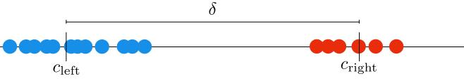

Fig. 3. Two clusters of non-negative residuals: the low-magnitude ones (blue) are centered at  $c\_{\text{left}}$ , the high-magnitude ones (red) at  $c\_{\text{right}} = c\_{\text{left}} + \delta$ .

Initialization. ADAPT-MinT's lines 1-2 are the same as
ADAPT's, and initialize  $\mathcal{I}^{(0)}$  and  $x^{(0)}$ . Line 3 is new: given
 $x^{(0)}$ , it initializes  $\delta^{(0)}$ , *i.e.*, the distance between the inlier
and outlier clusters at  $x^{(0)}$ . At the subsequent iterations
 $t = 1, 2, ...,$  the value  $\delta^{(0)}$  is used as a normalization factor
in the update of  $\delta^{(t)}$  (line 8, discussed below).Inlier Set, Variable, and Inlier Threshold Update. Li-
nes 5, 6, and 7 in ADAPT-MinT describe the same inlier set,
variable, and inlier threshold updates used in ADAPT.

Inlier vs. Outlier Cluster Separation Update. ADAPT-MinT updates  $\delta^{(t)}$  with the distance between the inlier and outlierclusters at the current  $x^{(t)}$ , after normalizing it by  $\delta^{(0)}$  (line 8). The role of the normalization is discussed in Remark 16 below.Termination. ADAPT-MinT terminates when (i) the maximum  
number of iterations is reached (*cf.* "for" loop in line 4), or (ii)  
 $\delta^{(t)}$  converges to a steady state value, indicating the inlier and  
outlier clusters have also converged to a steady state. Specifi-  
cally, ADAPT-MinT declares convergence when for *MinSamples*  
consecutive iterations  $\delta^{(t)}$ 's moving standard deviation  $\sigma^{(t)}$   
is less than *ConvergThr* (line 10). In more detail,  $\sigma^{(t)}$  is the  
standard deviation of  $\delta^{(t)}$  across the last *WindowSize* iterations  
and is computed in line 9, where *movstd* is the correspond-  
ing MATLAB function. In this paper, *WindowSize* = 3,  
*MinSamples* = 5 and *ConvergThr* =  $10^{-4}$  always.Remark 16 (Role of Normalization in ADAPT-MinT). The normalization by  $\delta^{(0)}$  in line 8 is necessary, since across different applications the residuals can differ by several orders of magnitude, and, as a result, the distance between the inlier and outlier clusters can differ by several orders of magnitude. The normalization reduces the impact of the magnitude of the residuals on the stopping conditions of ADAPT-MinT.Remark 17 (Tuning ADAPT's  $\tau$  vs. Tuning ADAPT-MinT's ConvergThr). Tuning  $\tau$  requires knowledge of the inlier threshold
(or equivalently, the inlier noise), which varies not only across
applications (e.g., mesh registration vs. SLAM) but also across
problem instances within the same application (e.g., different
SLAM datasets). In contrast, ConvergThr is fixed across in-
stances of an application (for all applications in this paper,
in particular, ConvergThr is the same), and its value can be
set given a single dataset where the ground truth is known. In
this sense, ADAPT-MinT is minimally tuned.#### *B.* GNC-MinT *Algorithm*

GNC-MinT, in contrast to GNC-TLS, does not require knowl-edge of a suitable inlier threshold  $\epsilon$ . Instead, GNC-MinT requires only an upper and lower bound for  $\epsilon$ , denoted by *NoiseUpBnd* and *NoiseLowBnd* in the algorithm. GNC-MinT uses *Noise-UpBnd* as an initial guess  $\epsilon^{(0)}$  to the unknown inlier threshold  $\epsilon$ . Using  $\epsilon^{(0)}$ , GNC-MinT performs the same weight, variable, and  $\mu$  update steps as GNC-TLS until convergence, when  $w^{(t)}$  becomes binary. At this point, GNC-MinT (i) scores how well the empirical distribution of the squares of the residuals fits a  $\chi^2$  distribution, using the Cramér-von Mises test, restricting the test to the measurements classified as inliers at iteration t[9](#page-8-1), (ii) stores the score and the current estimate, and (iii) decreases the value of  $\epsilon^{(t)}$  to prepare for the next iteration. The algorithm terminates (i) when the  $\chi^2$  fitness score either remains unchanged or worsens across consecutive iterations, or (ii) when  $\epsilon^{(t)}$  either remains unchanged across consecutive iterations or becomes less than *NoiseLowBnd*. GNC-MinT is given in Algorithm 4, and is described in detail below.Initialization. GNC-MinT first initializes  $\epsilon^{(0)}$  with *Noise-UpBnd*. Then  $\mu^{(0)}$ ,  $w^{(0)}$ , and  $x^{(0)}$  are initialized similarly to GNC but using  $\epsilon^{(0)}$  instead of  $\epsilon$  (lines 2-3). GNC-MinT also**Algorithm 4:** Minimally tuned GNC for TLS (GNC-MinT).

**Input:** Measurements  $y\_i$ ,  $\forall i \in \mathcal{M}$ ;  $MaxIterations > 0$ ;  

 $MuUpdateFactor > 1$ ;  

 $NoiseUpBnd, NoiseLowBnd \ge 0$ ;  

 $\chi^2$  distribution's degrees of freedom  $d > 0$ .

**Output:** Estimate of  $x^\circ$  and corresponding inliers.

1  $\epsilon^{(0)} = NoiseUpBnd$ ;  $j = 1$ ;  

2  $\mu^{(0)} = \frac{(\epsilon^{(0)})^2}{2 \max\_{i \in \mathcal{M}} r^2(y\_i, \mathbf{x}^{(0)}) - (\epsilon^{(0)})^2}$ ;  

3  $\mathbf{w}^{(0)} = \mathbf{1}\_{\mathcal{M}}$ ;  $\mathbf{x}^{(0)} = VariableUpdate(\mathbf{w}^{(0)})$ ;  

4 **for**  $t = 1, ..., MaxIterations$  **do**  

5      $\mathbf{w}^{(t)} = WeightUpdate(\mathbf{x}^{(t-1)}, \mu^{(t-1)}, \epsilon^{(j-1)})$ ;  

6      $\mathbf{x}^{(t)} = VariableUpdate(\mathbf{w}^{(t)})$ ;  

7      $\mu^{(t)} = MuUpdateFactor \cdot \mu^{(t-1)}$ ;  

8     **if**  $IsBinary(\mathbf{w}^{(t)})$  **then**  

9          $\mathcal{I}^{(j)} = supp(\mathbf{w}^{(t)})$ ;  

10          $s^{(j)} = Chi2Fit(r(y\_{\mathcal{I}^{(j)}}, \mathbf{x}^{(t)}), d)$ ;  

11          $\tilde{\mathbf{w}}^{(j)} = \mathbf{w}^{(t)}$ ;  $\tilde{\mathbf{x}}^{(j)} = \mathbf{x}^{(t)}$ ;  

12          $s\_{min} = \min\_{z \in \{1, 2, ..., j\}} s^{(z)}$ ;  

13         **if**  $s^{(j)} = s^{(j-1)}$  **then**  

14             **break**;  

15         **else if**  $s^{(j)} > s\_{min}$  **then**  

16              $k++$ ;   // Fitness worsens  

17             **if**  $k = SamplesToConverg$  **then**  

18                 **break**;  

19             **end**  

20         **else**  

21              $k = 0$ ;  

22         **end**  

23          $\tilde{\epsilon} = \max\_{i \in \mathcal{I}^{(j)}} \{r(y\_i, \mathbf{x}^{(t)}) \text{ s.t. } r(y\_i, \mathbf{x}^{(t)}) < \epsilon^{(j-1)}\}$ ;  

24          $\epsilon^{(j)} = (\epsilon^{(j-1)} + \tilde{\epsilon})/2$ ;  

25         **if**  $\epsilon^{(j)} = \epsilon^{(j-1)}$  **or**  $\epsilon^{(j)} < NoiseLowBnd$  **then**  

26             **break**;  

27         **end**  

28          $\mu^{(t)} = \mu^{(0)}$ ;  $\mathbf{w}^{(t)} = \mathbf{w}^{(0)}$ ;  $\mathbf{x}^{(t)} = \mathbf{x}^{(0)}$ ;  $j++$ ;  

29     **end**  

30 **end**  

31  $j\_{min} = \arg \min\_{z \in \{1, 2, ..., j\}} s^{(z)}$ .

31  $j\_{min} = \arg \min\_{z \in \{1,2,\dots,j\}} s^{(z)};$   
32 **return**  $({\tilde{x}}^{(j\_{min})}, \operatorname{supp}({\tilde{w}}^{(j\_{min})})).$ introduces the counter  $j$  (initialized to 1 in line 1), which counts how many times  $\epsilon^{(\cdot)}$  has been updated.Weight, Variable, and  $\mu$  Update. Lines **5**, **6**, and **7** in GNC-MinT are the same as the corresponding updated in GNC, with the exception that the current guess  $\epsilon^{(j-1)}$  is used in line **5** instead of the unknown  $\epsilon$ . Since these updates are the same as GNC, Theorem **15** guarantees that the weights  $w^{(t)}$  eventually become binary (for some  $t$ ), *i.e.*, GNC-MinT's iterations of weight, variable, and  $\mu$  update converge. Line **8** checks whether this is indeed the case.χ2 Fitness Test. Once  $w^{(t)}$  has converged, GNC-MinT checks
how well the residuals classified as inliers fit a χ2 distribution.
Line 9 collects the inliers, and line 10 computes the fitness
score  $s^{(j)}$  by calling Chi2Fit (Algorithm 6 in Appendix 7).
The score  $s^{(j)}$  is such that  $s^{(j)} > 0$ ; smaller value indicates
better fit. Line 11 stores the current estimate and weights.

Inlier Threshold Update. Once the fitness score at  $x^{(t)}$  has

9Proposition 4 implies that for TLS the inliers' generative probability distribution is a Normal distribution. As a result, the square of the inliers' residuals will follow a  $\chi^2$  distribution.

| Application       | Greedy(MC)    | Greedy(MTS)   | ADAPT(MC)     | ADAPT(MTS)     | ADAPT-MinT    | GNC          | GNC-MinT      |
|-------------------|---------------|---------------|---------------|----------------|---------------|--------------|---------------|
| Mesh Registration | 80% [13.71 s] | 80% [12.98 s] | 80% [14.42 s] | 80% [14.39 s]  | 80% [12.36 s] | 80% [5.12 s] | 80% [10.68 s] |
| Shape Alignment   | 80% [0.15 s]  | 80% [0.15 s]  | 80% [0.22 s]  | 80% [0.23 s]   | 80% [0.25 s]  | 80% [0.03 s] | 80% [0.06 s]  |
| PGO (2D)          | 60% [5.04 s]  | 10% [0.76 s]  | 80% [5.04 s]  | 80% [4.92 s]   | 60% [5.61 s]  | 90% [1.41 s] | 80% [2.17 s]  |
| PGO (3D)          | 60%[9.23 h]   | 40%[9.55 h]   | 60%[60.4 min] | 40%[42.04 min] | 90%[61.3 min] | 90%[85.8 s]  | 90%[101.62 s] |

TABLE I

ROBUSTNESS OF PROPOSED ALGORITHMS. ROBUSTNESS TO OUTLIERS AND AVERAGE OF MEDIAN RUNNING TIME OF THE PROPOSED ALGORITHMS.

been computed, GNC-MinT updates the inlier threshold guess
to the mean between the current inlier threshold guess and the
largest residual among the measurements currently classified
as inliers (line 24). Evidently,  $\epsilon^{(j)} \leq \epsilon^{(j-1)}$ .Re-initialization of Weights, Variable, and  $\mu$ . Once  $\epsilon$ (j) has been updated, GNC-MinT re-initializes  $\mu$ (t),  $w$ (t), and  $x$ (t) (line 28), in preparation for another round of GNC with the new threshold  $\epsilon$ (j). The counter  $j$  is also increased by 1 (line 28).Termination. GNC-MinT terminates when either

- the maximum number of iterations is reached (line [4\)](#page-8-15), or
- • the fitness score remains unchanged across 2 consecu-  
tive iterations (line 13) or the fitness score worsens for  
*SamplesToConverg* consecutive iterations (lines 15-21; in  
this paper, *SamplesToConverg* = 2),[10](#page-9-1) or
- • it is no longer possible to decrease  $\epsilon^{(j)}$  (line 25) (when
 $\epsilon^{(j)} = \epsilon^{(j-1)}$ , then GNC-MinT would converge again to the
same solution if it were to continue running).

Upon termination, GNC-MinT returns the inlier set with the best  $\chi$ 2 fitness score (lines 31-32).Remark 18 (Tuning GNC-TLS's  $\epsilon$  vs. Tuning GNC-MinT's NoiseUpBnd and NoiseLowBnd). Knowing  $\epsilon$ , or estimating it accurately, can be hard and time consuming:  $\epsilon$  typically varies across both applications and problem instances within the same application. In contrast, guessing upper and lower bounds for  $\epsilon$  is easier, making GNC-MinT minimally tuned.Remark **19** (Termination in GNC-MinT). In Proposition 4, we
observed TLS implicitly searches for inliers with Normally dis-
tributed residuals. At the same time, the sum of the squares of
Normally distributed variables follows a  $\chi^2$  distribution [\[37\]](#page-9-1).
For this reason, the stopping condition for GNC-MinT is based
on a  $\chi^2$  fitness test, performed by the Chi2Fit routine used in
line **10**. Chi2Fit estimates the variance of the  $\chi^2$  distribution,
hence it implicitly guesses the magnitude of the inlier noise.## VII. EXPERIMENTS AND APPLICATIONS: MESH REGISTRATION, SHAPE ALIGNMENT, AND PGO

We showcase the proposed algorithms in three robot per-
ception problems: mesh registration (Section VII-A), shape
alignment (Section VII-B), and Pose Graph Optimization
(PGO) (Section VII-C). We performed all the experiments
in MATLAB running on a Linux machine with the Intel i-
97920X (4.3 GHz). No GPU support was used.The results show that ADAPT and GNC outperform the state  
of the art and are robust up to 80 - 90% outliers. Theirminimally tuned versions achieve similar performance, without
relying on the knowledge of the inlier noise. We summarize the
observed performance of the algorithms (robustness to outliers
and average median running time) in Table I, where we also
include Greedy's performance. In Table I, we observe:- Greedy is on average slower than the proposed algorithms (2 times slower than GNC in mesh registration and shape alignment, and up to 100 times slower than GNC in PGO); in addition to being slower, Greedy is also less robust than both ADAPT and GNC in PGO, and even against ADAPT's and GNC's minimally tuned versions.
- GNC and GNC-MinT achieve the lowest running time, retaining, at the same time, the robustness to outliers achieved by all proposed algorithms. Specifically, in mesh registration and shape alignment, ADAPT and GNC, as well as their minimally tuned versions, are practically on par with each other in terms of their robustness to outliers, yet GNC and GNC-MinT are 2 to 10 times faster; and in the PGO experiments, ADAPT and ADAPT-MinT can exhibit similar, or even higher accuracy than GNC and GNC-MinT (cf. Fig. [7\)](#page-11-0), yet GNC and GNC-MinT are on average 10 times faster than ADAPT and ADAPT-MinT.

Choice of Parameters. We refer to ADAPT as ADAPT(MC) if it solves the MC problem ( $\ell = +\infty$  in line 6 of Algorithm 1), and as ADAPT(MTS) if it solves the MTS problem ( $\ell = 2$ ). We also compare against the greedy algorithm of Section IV-A, which we stop when the constraint in (G-MC) is satisfied. We denote the corresponding technique with the label Greedy(MC) and Greedy(MTS), when we use  $\ell = +\infty$  and  $\ell = 2$  in (G-MC), respectively. In all applications, we set in- • ADAPT:  $\tau = \sqrt{\text{chi2inv}(0.99, nd)}$ , where  $d$  is the number
of degrees of freedom of the measurement noise and
depends on the application, and  $n$  is the cardinality of
the chosen inlier set at the current iteration *(i.e.,* at
ADAPT's iteration  $t$ ,  $n = |\mathcal{I}^{(t)}|$ ; *cf.* ADAPT's line 4);
 $\theta = \sqrt{\text{udchi2inv}(0.05, n\_1 d, n\_2 d, \sigma^2)}$ ), where  $\sigma$  is the
standard deviation of the noise,  $n\_1 = |\mathcal{I}^{(t)}|$  and  $n\_2 =$ 
 $|\mathcal{I}^{(t-1)}|$ , while udchi2inv is the inverse of the cumulative
probability distribution of a random variable  $z = |z\_1 - z\_2|$ ,
where  $z\_1$  and  $z\_2$  are  $\chi^2$  random variables *(cf.* line 7
of ADAPT);11  $MaxIterations = 1000$ ;  $SamplesToConverg$ 
 $= 3$ ; and  $ThrDiscount = 0.99$ .
- • ADAPT-MinT: MaxIterations = 1000; ThrDiscount = 0.99;  
MinSamples = 2; WindowSize = 3; ConvergThr = 10-4.
- • GNC:  $\epsilon = \sigma \sqrt{\chi^2\_{inv}(0.99, d)}$ ; MaxIterations = 1000; and MuUpdateFactor = 1.4.

10The intuition is that if outliers exist among the measurements, then
decreasing  $\epsilon^{(j-1)}$  to  $\epsilon^{(j)}$  leads to rejecting more outliers, leading to a better
 $\chi^2$  fit. But if all outliers have been rejected, then decreasing  $\epsilon^{(j-1)}$  results
into rejecting inliers, worsening the  $\chi^2$  fit or keeping it the same.

11We set  $\theta = \sqrt{\text{udchi2inv}(0.05, n\_1d, n\_2d, \sigma^2)}$  assuming the measurement noise is normally distributed, since, then,  $z\_1 = ||r(\mathbf{y}\_{\mathcal{I}}(t), \mathbf{x})||\_2^2$  and  $z\_2 = ||r(\mathbf{y}\_{\mathcal{I}}(t-1), \mathbf{x})||\_2^2$  are indeed  $\chi^2$  random variables.

• GNC-MinT: MaxIterations = 1000; MuUpdateFactor =  $1.4^2$ ; [12](#page-10-12) *NoiseUpBnd* and *NoiseLowBnd* depend on the application, and are described in the subsections below.

#### *A. Mesh Registration*

In mesh registration, given a set of 3D points  $a\_i \in \mathbb{R}^3$ ,  

 $i \in \mathcal{M}$ , and a set of primitives  $P\_i$ ,  $i \in \mathcal{M}$  (being points, lines
and/or planes) with putative correspondences  $a\_i \leftrightarrow P\_i$ , the
goal is to find the best rotation  $R \in SO(3)$  and translation
 $t \in \mathbb{R}^3$  that align the point cloud to the 3D primitives. In
practice, the primitives  $P\_i$  often correspond to vertices, edges,
or faces of the CAD model of an object, while the points
 $a\_i$  are measured points (e.g., from a lidar observing a scene
containing that object), and mesh registration allows retrieving
the pose of the (known) object in the point cloud.The residual error in mesh registration is  $r(R, t) = \text{dist}(P\_i, Ra\_i + t)$ , where  $\text{dist}(\cdot)$  denotes the distance between
a primitive  $P\_i$  and a point  $a\_i$  after the transformation  $(t, R)$ 
is applied. The formulation can also accommodate weighted
distances to account for heterogeneous and anisotropic mea-
surement noise. In the outlier-free case, Briales *et al.* [\[40\]](#page-10-4)
developed a certifiably optimal non-minimal solver when the
3D primitives include points, lines, and planes and the noise
is anisotropic. We use GNC, ADAPT, and their minimally tuned
versions to efficiently robustify Briales' non-minimal solver.Experimental Setup. We use the “aeroplane-2” mesh
model from the PASCAL+ dataset [\[38\]](#page-10-0). We compute statis-
tics over 20 Monte Carlo runs, with increasing amounts
of outliers. At each Monte Carlo run, we generate a point
cloud from the mesh by randomly sampling points lying on
the vertices, edges, and faces of the mesh model, and then
apply a random transformation, adding Gaussian noise with
 $\sigma = 0.05d\_{mesh}$ , where  $d\_{mesh}$  is the diameter of the mesh. We
establish 40 point-to-point, 80 point-to-line, and 80 point-to-
plane correspondences, and create outliers by adding incorrect
point to point/line/plane correspondences. Since the number
of degrees of freedom of the measurement noise is  $d = 3$ ,
 $\epsilon = \sigma\sqrt{\chi^2\_{inv}(0.99, d)} = 0.0128$ . Moreover, we choose
 $NoiseUpBnd = 3\epsilon = 0.0384$ , and  $NoiseLowBnd = \epsilon/3 = 0.0043$ .We benchmark our algorithms against a RANSAC imple-mentation with 400 maximum iterations, using the 12-pointminimal solver presented in [\[41\]](#page-10-41).Mesh Registration Results. Fig. 4 shows the rotation
error, translation error, and running time for each technique
(all plots are in log-scale). The Greedy (MC), Greedy (MTS),
GNC, ADAPT(MC), and ADAPT(MTS), as well as the minimally
tunedADAPT-MinT have comparable performance, and are robust
against up to 80% outliers. GNC-MinT has similar performance,
exhibiting slightly higher errors. All proposed methods outperform RANSAC, which starts breaking at 30% of outliers.In terms of runtime, RANSAC's runtime grows with the number of outliers. Instead, Greedy's, ADAPT's, and ADAPT-MinT's runtimes grow linearly with the number of outliers, while GNC's and GNC-MinT's remain roughly constant.Qualitative results for mesh registration are given in Fig. 1.

#### *B. Shape Alignment*

In shape alignment, given 2D features  $z\_i \in \mathbb{R}^2$ ,  $i \in \mathcal{M}$  in a single image and 3D points  $B\_i \in \mathbb{R}^3$ ,  $i \in \mathcal{M}$  of an object with putative correspondences  $z\_i \leftrightarrow B\_i$  (potentially including outliers), the goal is to find the best scale  $s > 0$ , rotation  $R$ , and translation  $t$  of the object that projects the 3D shape to the 2D image under weak perspective projection. In practice, the 3D points  $B\_i$  often correspond to distinguishable points on the CAD model of an object, while the 2D features  $z\_i$  are measured pixels (e.g., from a camera observing a scene containing that object), and shape alignment allows retrieving the pose of the (known) object in the image.The residual error in shape alignment is  $r(s, R, t) = $ 
 $\|z\_i - s\Pi R B\_i - t\|$ , where  $\Pi \in \mathbb{R}^{2\times3}$  is the weak perspective
projection matrix (equal to the first two rows of a 3×3 identity
matrix). Note that  $t$  is a 2D translation, but under weak
perspective projection one can extrapolate a 3D translation
(i.e., recover the distance of the camera to the object) using the
scale  $s$ . We use the closed-form solution introduced in [\[42\]](#page-10-1) as
non-minimal solver. While potentially suboptimal, the solver
in [\[42\]](#page-10-1) works well in practice, and is faster than the certifiably
optimal solver proposed in [\[27\]](#page-10-1).Experimental Setup. We test the performance of GNC,  
GNC-MinT, ADAPT, and ADAPT-MinT on the FG3DCar dataset [\[39\]](#page-10-0)  
against (i) Zhou's method [\[43\]](#page-10-0), and (ii) RANSAC with 400  
maximum iterations using a 4-point minimal solver. We use  
the ground-truth 3D shape model as  $B$  and the ground-truth  
2D landmarks as  $z$ . To generate outliers for each image, we  
set random incorrect correspondences between 3D points and  
2D features. We assume  $\sigma = \sqrt{1 \times 10^{-5}} = 0.0032$ , and,  
since  $d = 2$ ,  $\epsilon = \sigma\sqrt{\text{chi2inv}(0.99, d)} = 0.0096$ . Also,  
similarly to mesh registration,  $NoiseUpBnd = 3\epsilon = 0.0288$ ,  
and  $NoiseLowBnd = \epsilon/3 = 0.0032$ .Shape Alignment Results. Fig. 5 shows in log-scale  
the rotation and translation error, and running time for all  
techniques. Statistics are computed over all the images in  
the FG3DCar dataset. Zhou's method degrades quickly with  
increasing number of outliers. Instead, all other algorithms are  
robust against 80% of outliers.

RANSAC's runtime grows exponentially with the number
of outliers. GNC, GNC-MinT, and Zhou's method runtime is
constant, being smaller than RANSAC's for outlier rates more
than 40%. ADAPT's and ADAPT-MinT's runtimes grow linearly.Qualitative results for shape alignment are given in Fig. [1.](#page-0-1)

#### *C. Pose Graph Optimization (*PGO*)*

Pose Graph Optimization (PGO) is a common backend for  
Simultaneous Localization and Mapping (SLAM) [\[3\]](#page-10-0). PGO  
estimates a set of poses ( $\mathbf{t}\_i, \mathbf{R}\_i$ ),  $i \in \mathcal{M}$  from pairwise  
relative pose measurements ( $\mathbf{\bar{t}}\_{ij}, \mathbf{\bar{R}}\_{ij}$ ) (potentially corrupted  
with outliers). The residual error is the distance between the  
expected relative pose and the relative measurements:
$$\sqrt{\left\|\log(\bar{\mathbf{R}}\_{ij}^{T} \mathbf{R}\_{i}^{T} \mathbf{R}\_{j})\right\|\_{\Omega\_{ij}^{R}}^{2} + \left\|\bar{\mathbf{R}}\_{ij}^{T}(\bar{t}\_{ij} - \mathbf{R}\_{i}^{T}(t\_{i} - t\_{j}))\right\|\_{\Omega\_{ij}^{t}}^{2}}$$

12We set  $MuUpdateFactor = 1.4^2$  in GNC-MinT such that the algorithm has similar runtime as GNC. On average, by choosing  $MuUpdateFactor = 1.4^2$ , instead of 1.4, we speed-up the convergence of the weights  $w^{(t)}$  to a binary vector (GNC-MinT's line 8) by a multiplicative factor of 2.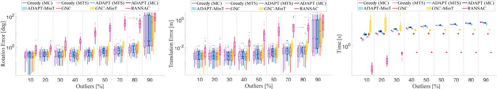

Fig. 4. Mesh Registration. Rotation error (left), translation error (center), and running time (right) of the proposed algorithms, compared to RANSAC, on the PASCAL+ "aeroplane-2" dataset [\[38\]](#page-20-29). Statistics are computed over 25 Monte Carlo runs and for increasing percentage of outliers.

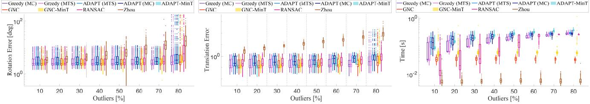

Fig. 5. Shape Alignment. Rotation error (left), translation error (center), and running time (right) of the proposed algorithms, compared to state-of-the-art techniques, on the FG3DCar dataset [\[39\]](#page-20-30). Statistics are computed over 25 Monte Carlo runs and for increasing percentage of outliers.

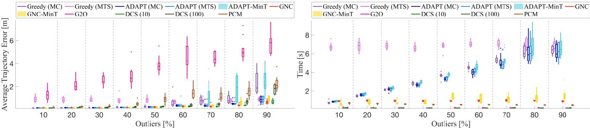

Fig. 6. 2D SLAM (Grid). Average Trajectory Error (ATE) and running time of the proposed algorithms compared to state-of-the-art techniques on a synthetic grid dataset for increasing outliers.

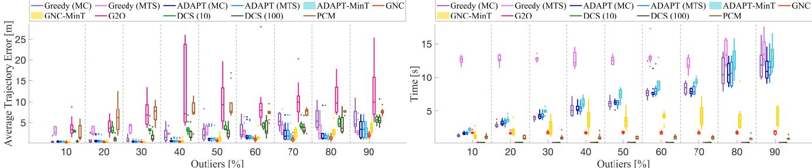

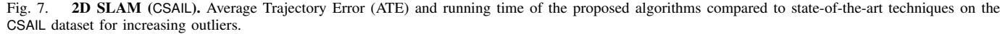

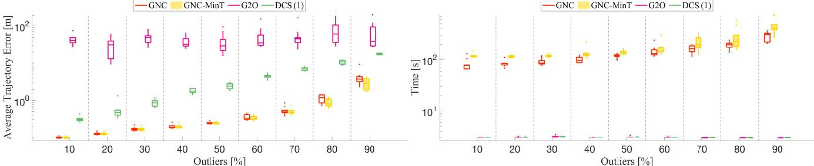

Fig. 8. 3D SLAM (Sphere). Average Trajectory Error (ATE) and running time of the proposed algorithms compared to state-of-the-art techniques on a synthetic Sphere dataset for increasing outliers.

where  $\Omega\_{ij}^R$  and  $\Omega\_{ij}^t$  are respectively the known rotation and translation measurement information matrix. For a vector  $a$ , the symbol  $||a||\_{\Omega}^2$  denotes the standard Mahalanobis norm:  $||a||\_{\Omega}^2 = a^T \Omega a$ . The Log(·) denotes the logarithm map for therotation group, which, roughly speaking, converts a rotation matrix to a vector (in 3D) or to a scalar (in 2D).13In the outlier free case, SE-Sync [\[12\]](#page-20-3) provides a global solver for PGO, and we have used it in our 2D SLAM experiments

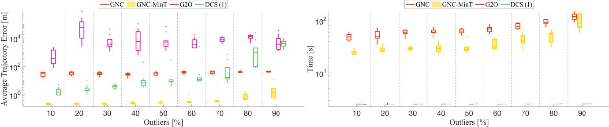

Fig. 9. 3D SLAM (Garage). Average Trajectory Error (ATE) and running time of the proposed algorithms compared to state-of-the-art techniques on the Garage dataset for increasing outliers.

in [\[25\]](#page-20-16). However, SE-Sync becomes too slow in the 3D SLAM tests considered in this paper: rather than a limitation of SE-Sync, this follows from the fact that in early iterations, both ADAPT and GNC (as well as their minimally tuned variants) solve problems with many outliers; in these cases, SE-Sync's relaxation is not tight,[14](#page-12-2) and SE-Sync tends to perform multiple steps in the Riemannian staircase [\[12\]](#page-20-3), becoming impractical.

To circumvent these issues, instead of SE-Sync, we use g2o [\[20\]](#page-20-11), which is a local solver for PGO, and use the odometry as initial guess. We remark this option is only viable when the odometric guess is available and considered reliable. Fig. [11](#page-15-0) in the appendix compares the use of SE-Sync and g2o within our algorithms and shows the two achieve comparable performance when the odometric guess is reliable.

Experimental Setup. We test the performance of our algorithms on synthetic and real datasets for 2D and 3D PGO. We use a synthetic grid [\[25\]](#page-12-0), and CSAIL [\[47\]](#page-12-0) in 2D, and a synthetic sphere, and Garage [\[44\]](#page-12-0) in 3D. We compute statistics over 10 Monte Carlo runs, with increasing amounts of outliers. At each Monte Carlo run, we spoil existing loop closures with random outliers. We consider odometric measurements as inliers and use the odometry as initial guess for g2o. Since  $d = 3$  in 2D SLAM,  $\epsilon = \sqrt{\text{chi2inv}(0.99,3)} = 3.3682$ , and since  $d = 6$  in 3D SLAM,  $\epsilon = \sqrt{\text{chi2inv}(0.99,6)} = 4.1$ .15 Regarding GNC-MinT and ADAPT-MinT, we normalize the measurements' covariance matrices provided by each dataset to simulate the case in which the covariances are unknown, and we set  $NoiseUpBnd = 1m$  and  $NoiseLowBnd = 0.01m$ .16

We benchmark our algorithms against (i) g2o [\[20\]](#page-12-1), (ii) dynamic covariance scaling (DCS) [\[1\]](#page-12-1), and (iii) pairwise consistent measurement set maximization (PCM) [\[28\]](#page-12-1). The performance of DCS is fairly sensitive to the choice of the kernel size  $\Phi$ , which is a parameter in the algorithm: we tested different kernel sizes  $\Phi = \{1,10,100\}$  for DCS, and we used the same e for GNC, ADAPT, and PCM. For clarity of visualization, we only report the best two parameters (leading to smallest errors) for DCS in the figures.15In SLAM we do not need multiply by the covariance because the objective function performs a whitening transformation via the information matrix.

2D PGO Results. Fig. [6](#page-11-3) shows the Average Trajectory Error (ATE) and the running time for the synthetic grid. g2o is a non-robust solver, and performs poorly even when few outliers are present. ADAPT(MC) and ADAPT(MTS) outperform the Greedy algorithm. GNC outperforms the state of the art, and is robust to 90% of outliers. GNC-MinT is also robust up to 90% of outliers, outperforming ADAPT-MinT, which breaks at 70% of outliers. DCS (10) has similar performance to GNC, being robust until 90% of outliers; DCS (100) degrades with increasing number of outliers, stressing the importance of parameter tuning in DCS. PCM starts degrading at relatively low outlier rates. Fig. [6](#page-11-3) shows that the runtimes of GNC, GNC-MinT, g2o, DCS, and PCM are roughly constant, while ADAPT's and ADAPT-MinT's runtime grows linearly in the number of outliers.

Fig. [7](#page-11-0) shows the ATE and the running time for the CSAIL dataset. All ADAPT, ADAPT-MinT, GNC, and GNC-MinT outperform the state of the art, and are robust against 90% of outliers. DCS starts breaking at 50% of outliers. PCM and g2o perform poorly across the whole spectrum. Both ADAPT-MinT and GNC-MinT perform similarly to ADAPT and GNC, although being minimally tuned algorithms. Similarly to grid, the runtimes of GNC, GNC-MinT, g2o, DCS, and PCM are roughly constant; ADAPT's and ADAPT-MinT's grow linearly.

3D PGO Results. Fig. [8](#page-11-4) and Fig. [9](#page-12-5) show the ATE and the running time in the case of Sphere and Garage, respectively (both in log-scale). We omit Greedy, ADAPT, ADAPT-MinT, and PCM because their running times become impractical for these datasets (more than 10 minutes per run). In both Sphere and Garage, we observe that GNC and GNC-MinT outperform DCS and g2o, regardless of DCS's parameter choice. Importantly, GNC-MinT outperforms GNC in Garage. The covariances are unreliable in the garage dataset, hence causing GNC to set an incorrect . On the other hand, GNC-MinT is able to *infer* the correct and ensure accurate estimation. GNC's and GNC-MinT's running times slightly increase with increasing number of outliers, while DCS's and g2o's are constant.

Qualitative results are given in Fig. [1.](#page-0-1)

#### VIII. EXTENDED LITERATURE REVIEW

We extend the literature review in Section [I,](#page-0-2) to discuss outlier-robust estimation in robotics and computer vision (Section [VIII-A\)](#page-12-6), and in statistics and control (Section [VIII-B\)](#page-14-1).

#### *A. Outlier-robust Estimation in Robotics and Computer Vision*

Outlier-robust estimation has been an active research area in robotics and computer vision [\[48\]](#page-21-8)–[\[50\]](#page-21-9). Two of the pre-

13For simplicity, here we use the geodesic distance  $\|\text{Log}(\overline{R}\_{i}^{\mathsf{T}} R\_{j})\|$ , while alternative rotation distances are often used in PGO, see [\[12\]](#page-12-0), [\[44\]](#page-12-0).

14Indeed, it has been observed that the presence of large noise can easily induce failures in relaxations of 3D SLAM [\[45\]](#page-21-6), while their 2D counterparts are observed to remain tight in the presence of relatively large noise [\[46\]](#page-21-7).

16In detail: we normalize each measurement's information matrix  $\Omega\_{ij}$  by a factor  $\alpha\_{ij}$  that represents the mean information (inverse variance) of the translation measurements (we ignore the effect of the rotation, since it has 1-2 orders of magnitude smaller errors).dominant paradigms to gain robustness against outliers are *consensus maximization* [\[16\]](#page-20-7) and *M-estimation* [\[50\]](#page-21-9). In both paradigms, the literature is mainly divided into (i) *fast heuristics*, algorithms that are efficient but provide little performance guarantees, and (ii) *global solvers*, algorithms that offer optimality guarantees but scale poorly with the problem size.

Fast Heuristics. For consensus maximization, RANSAC [\[2\]](#page-13-0),  
[51] has been a widely adopted heuristic due to its efficiency  
and effectiveness in the low-outlier regime. Recently, Tzoumas  
et al. [\[25\]](#page-13-0) proposed ADAPT for minimally trimmed squares  
(MTS) estimation, a formulation that bears similarity with con-  
sensus maximization (cf. Section II). For M-estimation, local  
nonlinear optimization is typically employed, which relies on  
the availability of a good initial guess [\[52\]](#page-13-0), [\[53\]](#page-13-0). Instead,  
the recently proposed GNC algorithm by Yang et al. [\[27\]](#page-13-0)  
provides a method for solving M-estimation without requiring  
an initial guess (also see [\[54\]](#page-13-0)). Recently, Barron [\[55\]](#page-13-0) proposes  
a single parametrized function that generalizes a family of  
robust cost functions in M-estimation. Chebrolu et al. [\[56\]](#page-13-0)  
design an expectation-maximization algorithm to simultane-  
ously estimate the unknown quantity  $x$  and choose the best  
robust cost  $\rho$  in eq. (3). These algorithms, however, still rely  
on an estimate of the inlier noise threshold  $\epsilon$ .Global Solvers. Global solvers essentially perform ex-exhaustive search to ensure global optimality. For instance, branch-and-bound (BnB) has been exploited to globally solve consensus maximization in several low-dimensional perception tasks [\[17\]](#page-13-0), [\[57\]](#page-13-0)–[\[65\]](#page-13-0). Despite its global optimality guarantees, BnB has exponential running time in the worst case. It is also possible to globally solve consensus maximization and M-estimation by enumerating all possible minimizers [\[66\]](#page-13-0), [\[67\]](#page-13-0). However, these algorithms are close to exhaustive search and do not scale to high-dimensional problems.Certifiably robust algorithms are a class of global solvers
that have been recently shown to strike a good balance
between computational complexity and global optimality [\[4\]](#page-13-0),
[\[68\]](#page-13-0). Certifiable algorithms relax non-convex robust estimation
problems into convex semidefinite programs (SDP), whose so-
lutions can be obtained in polynomial time and provide readily
checkable a posteriori global optimality certificates [\[30\]](#page-13-0), [\[31\]](#page-13-0),
[\[69\]](#page-13-0), [\[70\]](#page-13-0). Although solving large-scale SDPs is computation-
ally expensive, recent work has shown that optimality certifica-
tion (i.e., verifying the global optimality of candidate solutions
returned by fast heuristics) can scale to large problems by
leveraging efficient first-order methods [\[68\]](#page-13-0).Finally, we note that adding a preprocessing layer to prune outliers can significantly boost the performance of robust estimation using consensus maximization, M-estimation, and certifiable algorithms [\[4\]](#), [\[17\]](#), [\[71\]](#).Representative outlier-robust methods for registration, shape  
alignment, and SLAM, are discussed below.

Robust Registration. Rigid registration looks for the trans-  
transformation that best aligns two point clouds or a point cloud  
and a 3D mesh. We review correspondence-based registration  
methods, while we refer the reader to [\[4\]](#page-13-4) for a broader  
review on 3D registration, including *Simultaneous Pose and  
Correspondence* methods (e.g., ICP [\[72\]](#page-13-72)). Correspondence-  
based registration methods first extract and match featuresin the two point clouds, using hand-crafted [\[73\]](#page-13-0) or deep-
learned [\[14\]](#page-13-0), [\[74\]](#page-13-0) features. Then, they solve an estimation
problem to compute the rigid transformation that best aligns
the set of corresponding features. In the presence of incor-
rect correspondences (i.e., outliers), one typically resorts to
RANSAC [\[2\]](#page-13-0), [\[75\]](#page-13-0), along with a 3-point minimal solver [\[76\]](#page-13-0),
[\[77\]](#page-13-0). In the high-outlier regime (e.g., above 80%), RANSAC
tends to be slow and brittle [\[17\]](#page-13-0), [\[61\]](#page-13-0). Thereby, recent ap-
proaches adopt either M-estimation or consensus maximiza-
tion. Zhou *et al.* [\[54\]](#page-13-0) propose fast global registration, which
minimizes the Geman-McClure robust cost function using
GNC. Tzoumas *et al.* use ADAPT [\[25\]](#page-13-0), and Yang *et al.* use
GNC [\[27\]](#page-13-0) to solve point cloud registration with robustness
against up to 80% outliers. Bazin *et al.* [\[78\]](#page-13-0) employ BnB to
perform globally optimal rotation search (i.e., 3D registration
without translation). Parra *et al.* [\[17\]](#page-13-0) add a preprocessing
step, that removes gross outliers before RANSAC or BnB. Yang
and Carlone propose invariant measurements to decouple the
rotation and translation estimation [\[70\]](#page-13-0), and develop certifiably
robust rotation search using semidefinite relaxation [\[31\]](#page-13-0). The
joint use of fast heuristics (e.g., GNC) and optimality certifica-
tion for both point cloud registration and mesh registration has
been demonstrated in [\[4\]](#page-13-0), [\[68\]](#page-13-0). The registration approach [\[4\]](#page-13-0)
has been shown to be robust to 99% outliers.

Robust Shape Alignment. Shape alignment consists in estimating the absolute camera pose given putative correspondences between 2D image landmarks and 3D model keypoints (the problem is called 3D shape reconstruction when the 3D model is unknown [\[5\]](#page-13-0), [\[43\]](#page-13-0), [\[79\]](#page-13-0)). When a full camera perspective model is assumed, the problem is usually referred to as the perspective-*n*-point (PnP) problem [\[80\]](#page-13-0). RANSAC is again the go-to approach to gain robustness against outliers, typically in conjunction with a 3-point minimal solver [\[81\]](#page-13-0). Ferraz *et al*. propose an efficient robust PnP algorithm based on iteratively rejecting outliers via detecting large algebraic errors in a linear system [\[82\]](#page-13-0). When the 3D model is far from the camera center, a weak perspective camera model can be adopted [\[43\]](#page-13-0), which leads to efficient robust estimation using GNC [\[27\]](#page-13-0). Yang and Carlone [\[68\]](#page-13-0) develop optimality certification algorithms for shape alignment with outliers, and demonstrate successful application to satellite pose estimation.Robust SLAM. Outlier-robust SLAM has traditionally re-  
lied on M-estimators, see, e.g., [\[50\]](#page-13-0). Olson and Agarwal [\[83\]](#page-13-0)  
use a max-mixture distribution to approximate multi-modal  
measurement noise. Sünderhauf and Protzel [\[21\]](#page-13-0), [\[84\]](#page-13-0) aug-  
ment the problem with latent binary variables responsible for  
deactivating outliers. Tong and Barfoot [\[85\]](#page-13-0), [\[86\]](#page-13-0) propose al-  
gorithms to classify outliers via Chi-square statistical tests that  
account for the effect of noise in the estimate. Latif et al. [\[87\]](#page-13-0)  
propose realizing, reversing, and recovering, which performs  
loop-closure outlier rejection, by clustering measurements to-  
gether and checking for consistency using a Chi-squared-based  
test. Mangelson et al. [\[28\]](#page-13-0) propose a pair-wise consistency  
maximization (PCM) approach for multi-robot SLAM. Agarwal  
et al. [\[1\]](#page-13-0) propose dynamic covariance scaling (DCS), which  
adjusts the measurement covariances to reduce the influence of  
outliers. Lee et al. [\[88\]](#page-13-0) use expectation maximization. The pa-  
pers above rely either on the availability of an initial guess foroptimization, or on parameter tuning. Tzoumas *et al.* propose
ADAPT [\[25\]](#page-14-0), and Yang *et al.* propose GNC [\[27\]](#page-14-0) to solve outlier-
robust SLAM without initialization. Recent work also includes
convex relaxations for outlier-robust SLAM [\[30\]](#page-14-0), [\[69\]](#page-14-0), [\[89\]](#page-14-0),
[\[90\]](#page-14-0). Lajoie *et al.* [\[30\]](#page-14-0) provide sub-optimality guarantees,
which however degrade with the quality of the relaxation.#### *B. Outlier-robust Estimation in Statistics and Control*

Outlier-robust estimation has been also a subject of inves-  
tigation in statistics and control [\[91\]](#page-14-0), [\[92\]](#page-14-0), where it finds  
applications to distribution learning [\[93\]](#page-14-0), linear decoding [\[94\]](#page-14-0),  
and secure state estimation [\[95\]](#page-14-0), among others.Statistics. In its simplest form, outlier-robust estimation aims at learning the mean and covariance of an unknown distribution, given (i) a portion of independent and identically distributed samples, and (ii) a portion of arbitrarily corrupted samples (outliers), where the percentage of outliers is assumed known. Researchers provide polynomial time near-optimal algorithms [\[93\]](#page-22-4), [\[96\]](#page-22-7). In scenarios where one instead aims to estimate an unknown parameter given corrupted measurements, Rousseeuw [\[97\]](#page-22-8) propose *linear trimmed squares* (LTS), which aims to minimize the cumulative inlier residual error given a known number of outliers. Similar greedy-like algorithms, that also assume a known number of outliers, are the forward greedy by Nemhauser *et al.* [\[34\]](#page-20-25), and forward-backward greedy by Zhang [\[98\]](#page-22-9). Both algorithms have quadratic running time, which is prohibitive in high-dimensional robotics and computer vision applications, such as SLAM. In contrast to [\[34\]](#page-20-25), [\[97\]](#page-22-8), [\[98\]](#page-22-9), the greedy algorithm proposed in [\[99\]](#page-22-10) considers the number of outliers to be unknown. However, it still requires parameter tuning, this time for an inlier threshold parameter.

Control. Outlier-robust estimation in control takes the form of secure state estimation in the presence of outliers, including adversarial measurement corruptions. Related works [\[95\]](#page-22-6), [\[100\]](#page-22-11), [\[101\]](#page-22-12) propose exponential-time algorithms, achieving exact state estimation when the inliers are noiseless.

#### IX. CONCLUSION

We investigated fundamental computational limits and general-purpose algorithms for outlier-robust estimation. We proved that, in the worst-case, outlier-robust estimation is inapproximable even in quasi-polynomial time. We reviewed and extended two robust algorithms, ADAPT and GNC, and established convergence results and connections between the corresponding formulations. We proposed the first minimally tuned algorithms, ADAPT-MinT and GNC-MinT. These algorithms offer a new paradigm for resilient life-long estimation, being robust not only against outliers but also against unknown inlier noise statistics. We theoretically grounded these algorithms by identifying probabilistic interpretations of maximum consensus and truncated least squares estimation.

The proposed algorithms are deterministic, scalable to problems with thousands of variables, and require no initial guess. Moreover, they dominate the state of the art across several robot perception applications. We believe the proposed approaches can be a valid replacement for RANSAC, and

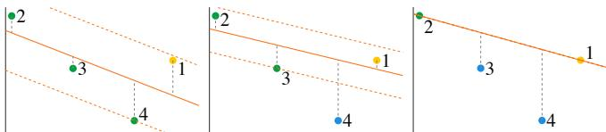

Fig. 10. A single outlier (point 1) leads ADAPT to the wrong solution.

constitute an important step towards parameter-free (autotuning) algorithms. In contrast to ADAPT-MinT and GNC-MinT, RANSAC is non-deterministic, requires a minimal solver, relies on careful parameter tuning, and its runtime increases exponentially with the percentage of outliers.

The algorithms discussed in this paper (as well as the baselines we compared against) do not guarantee convergence to optimal solutions (this is expected, due to the inapproximability result in Theorem [12\)](#page-4-7). The interested reader can find examples of failure modes in [Appendix 1.](#page-14-0) Future work includes coupling the algorithms proposed in this paper with fast *certifiers* [\[68\]](#page-21-20) that can detect and reject incorrect estimates.

#### ACKNOWLEDGMENTS

The authors would like to thank José María Martínez Montiel for the discussions about limitations and failure modes of greedy algorithms for outlier rejection.

#### APPENDIX 1. LIMITATIONS

We discuss failure modes of the proposed algorithms.

#### *A. Limitations of* ADAPT *and* ADAPT-MinT

Inaccurate  $\tau$  and  $\theta$ . If  $\tau$  and  $\theta$  are set too low, lower than
their true values, ADAPT will typically over-reject measure-
ments. Conversely, if they are set too high, ADAPT is more
likely to return sets containing outliers. Both scenarios can
result to less accurate estimates.Adversarial Outliers. ADAPT (and similarly GNC) can fail due to adversarial outliers. In Fig. [10,](#page-14-2) we present such a scenario for a problem of linear regression, where there are three inliers (points 2-4) and one outlier (point 1). For appropriate *ThrDiscount*, ADAPT first rejects the inlier point 4, moving the new estimate (based on points 1-3) towards the outlier 1. Then, ADAPT rejects point 3, and, then, terminates.

High Measurement Noise. High measurement noise can
cause the cluster separation  $\delta$ , used in ADAPT-MinT, to oscillate
more than the chosen *ConvergThr*, thus making the algorithm
to reject more measurements than the true number of outliers.#### *B. Limitations of* GNC *and* GNC-MinT

Inaccurate . If is chosen lower than the real inlier threshold, then GNC can reject more measurements than the true number of outliers. Instead, if is too high, then GNC tends to reject less measurements, keeping outliers as inliers. Both scenarios can result to less accurate estimates.

Non-Gaussian Measurement Noise. If the residual's distri-  
bution is not close to a Gaussian, the  $\chi^2$  fitness score may not  
accurately indicate the presence of outliers. Thus, GNC-MinT  
may return less accurate estimates.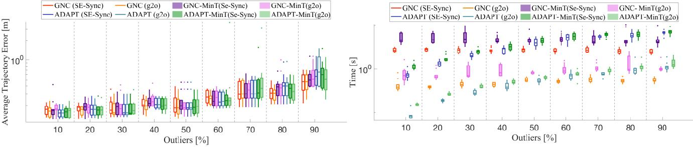

Fig. 11. Average Trajectory Error and Running time of the proposed algorithms on 2D SLAM (Grid) with two different non-minimal solvers: g2o and SE-Sync. The average performance is comparable while g2o offers a better running time.

Arbitrarily Low **NoiseUpBnd**, and Arbitrarily Large  
**NoiseLowBnd**. If **NoiseLowBnd** - **NoiseUpBnd** is unnecessar-  
ily large, then GNC-MinT, trying to find the true but unknown  
inlier threshold, will explore more  $\epsilon$  values, and, as a result, it  
will run for longer time. Also, GNC-MinT stops as soon as the  
fitness score becomes worse (*cf.* GNC-MinT's lines 13-17). This  
point, however, may correspond to a local minima (thinking  
of the fitness score as a function of the inlier threshold guess).  
Therefore, if the **NoiseUpBnd** is unnecessarily high, there is a  
higher probability GNC-MinT stops prematurely.#### APPENDIX 2. PROOF OF RESULTS IN SECTION [II](#page-2-0)

#### *A. Proof of Proposition [2](#page-3-2)*

We prove that any optimal solution to MC (eq. (2)) is also
an optimal solution to eq. (6), and vice versa. To argue this,
we use the method of contradiction.

First, assume ( $x\_{MC}$ ,  $O\_{MC}$ ) is an optimal solution to MC  
but not to eq. (6), i.e., there exists an optimal solution  
( $x\_{eq.(6)}$ ,  $O\_{eq.(6)}$ ) to eq. (6) such that  $|O\_{eq.(6)}| < |O\_{MC}|$  and  
 $\Pi\_{i \in M \backslash O\_{eq.(6)}} u(r(y\_i, x\_{eq.(6)}), \epsilon) > 0$ . But the latter inequality  
implies  $r(y\_i, x\_{eq.(6)}) \leq \epsilon$  for all  $i \in M \backslash O\_{eq.(6)}$  (since the  
uniform distribution has non-zero probability only in  $[0, \epsilon]$ ),  
and, as a result, ( $x\_{eq.(6)}$ ,  $O\_{eq.(6)}$ ) is feasible in MC and, yet,  
 $|O\_{eq.(6)}| < |O\_{MC}|$ , which contradicts optimality.Now assume  $(x\_{eq.(6)}, O\_{eq.(6)})$  is a solution to eq. (6) but not to MC, i.e., there exist a solution  $(x\_{MC}, O\_{MC})$  to MC such that  $|O\_{MC}| < |O\_{eq.(6)}|$  and  $r(y\_i, x\_{MC}) \leq \epsilon$  for all  $i \in M \setminus O\_{MC}$ .  
But the latter implies that  $\prod\_{i \in M \setminus O\_{MC}} u(r(y\_i, x\_{MC}), \epsilon) = \epsilon^{-|M \setminus O\_{MC}|} > 0$ , and, as a result,  $(x\_{MC}, O\_{MC})$  is feasible for (6) and, yet,  $|O\_{MC}| < |O\_{eq.(6)}|$ , which again contradicts optimality.#### *B. Proof of Proposition [3](#page-3-6)*

The proof follows from taking the log of ineq. [\(7\)](#page-3-9).

#### *C. Proof of Proposition [4](#page-3-3)*

Assuming a known number of outliers  $|\mathcal{O}| = |\mathcal{O}^{\circ}|$ , the TLS formulation in (5) becomes
$$\min\_{\substack{\mathfrak{x}\in\mathcal{X}\\ \mathcal{O}\subseteq\mathcal{M},\ |\mathcal{O}|=|\mathcal{O}^{\diamond}|}} \sum\_{i\in\mathcal{M}\backslash\mathcal{O}} r^2(y\_i, \mathfrak{x}) + \epsilon^2|\mathcal{O}^{\diamond}|,\qquad(18)$$

where  $\epsilon^2 |\mathcal{O}^{\circ}|$  becomes a constant and is irrelevant for the optimization. It can be now seen that taking the  $-\log(\cdot)$  of the objective in eq. (8) leads to the same optimization as in (18).#### *D. Proof of Proposition [5](#page-3-7)*

Since  $x^\circ$  is feasible in eq. (10) and  $\prod\_{i \in \mathcal{M}} \hat{g}(r(y\_i, x^\circ)) > 0$  (since  $r(y\_i, x^\circ) \leq \alpha$  for any  $i \in \mathcal{M}$ ), for any optimal solution  $x$  to eq. (10), it also holds true that  $\prod\_{i \in \mathcal{M}} \hat{g}(r(y\_i, x)) > 0$ , and, as a result,  $r(y\_i, x) \leq \alpha$  for any  $i \in \mathcal{M}$ . Therefore, after simplifying constants, eq. (10) is equivalent to
$$\max\_{x \in \mathcal{X}} \prod\_{i \in \mathcal{M}} \max \left\{ e^{-r^{2}/2}, e^{-\epsilon^{2}/2} \right\}, \tag{19}$$

which is equivalent to

$$
\max\_{x \in \mathcal{X}} \sum\_{i \in \mathcal{M}} \max \{-r^{2}/2, -\epsilon^{2}/2 \}, \tag{20}
$$

since maximizing the objective function in eq. [\(19\)](#page-15-1) is equiva-
lent to maximizing the log of it. Finally, [\(20\)](#page-15-1) is equivalent to
 $\max\_{x \in X}$   $\sum\_{i \in M} \min \{r^2, \epsilon^2\}$ , which is equivalent to TLS.#### *E. Proof of Theorem [6](#page-3-13)*

Denote by ( $x\_{G-TLS}$ ,  $O\_{G-TLS}$ ) any optimal solution to G-TLS. We first prove ( $x\_{G-TLS}$ ,  $O\_{G-TLS}$ ) is feasible to G-MC (*i.e.*,  $|| r(y\_{\mathcal{M}\backslash O\_{G-TLS}}, x\_{G-TLS}) ||\_{\infty} \leq \epsilon$ ), and, then, prove ( $x\_{G-TLS}$ ,  $O\_{G-TLS}$ ) is actually an optimal solution to G-MC.To prove  $|| r(y\_M \backslash O\_{G-TLS}, x\_{G-TLS}) ||\_\infty \le \epsilon$ , first observe
$$\begin{split} \left| \mathcal{M} \backslash \mathcal{O}\_{\text{G-TLS}} \right| \cdot &\parallel r(y\_{\mathcal{M} \backslash \mathcal{O}\_{\text{G-TLS}}}, x\_{\text{G-TLS}}) \parallel\_{\infty}^{2} + \\ &\epsilon^{2} |\mathcal{O}\_{\text{G-TLS}}| \leq \epsilon^{2} |\mathcal{M}|, \end{split} \tag{21}$$

since  $\epsilon^2$  is the value of G-TLS's objective function for  $\mathcal{O} = \mathcal{M}$   
(given any  $x \in \mathcal{X}$ ), while  $(x\_{\text{G-TLS}}, \mathcal{O}\_{\text{G-TLS}})$  is an optimal  
solution to G-TLS. Now, assume  $||r(y\_{\mathcal{M}\setminus\mathcal{O}\_{\text{G-TLS}}}, x\_{\text{G-TLS}})||\_{\infty} > \epsilon$ .  
Then, the value of G-TLS's objective function at  
 $(x\_{\text{G-TLS}}, \mathcal{O}\_{\text{G-TLS}})$  is strictly more than  $\epsilon^2|\mathcal{M}|$ , which con-  
tradicts eq. (21). Hence,  $|| r(y\_{\mathcal{M}\setminus\mathcal{O}\_{\text{G-TLS}}}, x\_{\text{G-TLS}}) ||\_{\infty} \leq \epsilon$ ,  
and, as a result,  $(x\_{\text{G-TLS}}, \mathcal{O}\_{\text{G-TLS}})$  is feasible to G-MC.We now prove  $\mathcal{O}\_{G-TLS}$  is also optimal for G-MC.  
Assume by contradiction  $\mathcal{O}\_{G-TLS}$  is not optimal for  
G-MC. Then,  $|\mathcal{O}\_{G-MC}| < |\mathcal{O}\_{G-TLS}|$  (or, equivalently,  
 $|\mathcal{O}\_{G-MC}|+1 \le |\mathcal{O}\_{G-TLS}|$ ), since  $\mathcal{O}\_{G-MC}$  is optimal. Since also  
 $||r(\boldsymbol{y}\_{M \setminus \mathcal{O}\_{G-MC}}, \boldsymbol{x})||\_{\infty} < \epsilon$ , the following hold:
$$\|r(y\_{\mathcal{M}}\backslash \mathcal{O}\_{G-MC}, x)\|\_{{\infty}}^{2} + \epsilon^{2}|\mathcal{O}\_{G-MC}| < (22)$$

$$
\epsilon^2 + \epsilon^2 |\mathcal{O}\_{\text{G-MC}}| = \quad (23)
$$

$$
\epsilon^2(|\mathcal{O}\_{\text{G-MC}}| + 1) \le \epsilon^2|\mathcal{O}\_{\text{G-TLS}}| \le \quad(24)
$$

$$|\mathcal{M} \setminus \mathcal{O}\_{G-TLS}| \cdot \|r(y\_{\mathcal{M}} \mathcal{O}\_{G-TLS}, x)\|\_{ \infty}^{2} + \epsilon^{2} |\mathcal{O}\_{G-TLS}|. \quad (25)$$

Comparing (22) and (25), we notice that  $\mathcal{O}\_{G-MC}$  achieves a better cost in G-TLS, contradicting the optimality of  $\mathcal{O}\_{G-TLS}$ .#### *F. Proof of Theorem [7](#page-4-2)*

To prove the theorem, consider the following problem:

$$\min\_{\begin{subarray}{c}x \in \mathcal{X} \\ \mathcal{O} \subseteq \mathcal{M}\end{subarray}} \| r(\boldsymbol{y}\_{\mathcal{M} \setminus \mathcal{O}}, x) \|\_{2}^{2} \text{ s.t. } |\mathcal{O}| = |\mathcal{O}\_{\mathsf{MTS}}|. \tag{26}$$

Note that  $\mathcal{O}\_{MTS}$  is feasible for MTS, hence the optimal objective of (26) is smaller than  $\tau^2$ .Now consider the Lagrangian of [\(26\)](#page-16-1):

$$l(\epsilon) \stackrel{\scriptstyle \Delta}{=} \min\_{\begin{subarray}{c} \mathbf{x} \in \mathcal{X} \\ \mathcal{O} \subseteq \mathcal{M} \end{subarray}} \| r(\mathbf{y}\_{\mathcal{M} \setminus \mathcal{O}}, \mathbf{x}) \|\_{2}^{2} + \epsilon^{2} ( |\mathcal{O}| - |\mathcal{O}\_{\mathsf{MTS}}| )$$

$$= f\_{\mathsf{TLS}}(\epsilon) - \epsilon^{2} |\mathcal{O}\_{\mathsf{MTS}}|. \tag{27}$$

By weak duality [\[102\]](#page-16-1):
$$f\_{\text{TLS}}(\epsilon) - \epsilon^2 |\mathcal{O}\_{\text{MTS}}| \leq \|r(y\_{\mathcal{M}}\backslash \mathcal{O}\_{(26)}, x\_{(26)})\|\_2^2, \quad (28)$$

where ( $x\_{(26)}$ ,  $\mathcal{O}\_{(26)}$ ) is an optimal solution to eq. (26). Since  
  $|| r(y\_M \mathcal{O}\_{(26)}, x\_{(26)}) ||\_2 \leq \tau$ , then
$$f\_{\text{TLS}}(\epsilon) - \epsilon^{2} |\mathcal{O}\_{\text{MTS}}| \leq \tau^{2}, \qquad (29)$$

From the inequality [\(29\)](#page-16-2) it follows:

- • if  $\tau^2 = r\_{TLS}^2(\epsilon)$ , then eq. (29) implies  $|\mathcal{O}\_{TLS}| \leq |\mathcal{O}\_{MTS}|$ ; since  $(x\_{TLS}, \mathcal{O}\_{TLS})$  is also feasible for (G-MC),  $|\mathcal{O}\_{TLS}| = |\mathcal{O}\_{MTS}|$ , and  $(x\_{TLS}, \mathcal{O}\_{TLS})$  is also a solution to MTS.
- if  $\tau^2 > r\_{TLS}^2(\epsilon)$ , then  $|\mathcal{O}\_{TLS}| \geq |\mathcal{O}\_{MTS}|$ , since   
 ( $x\_{TLS}, \mathcal{O}\_{TLS}$ ) is feasible in (G-MC).
- if  $\tau^2 < r\_{TLS}^2(\epsilon)$ , then  $|\mathcal{O}\_{TLS}| < |\mathcal{O}\_{MTS}|$ , since
 $(x\_{TLS}, \mathcal{O}\_{TLS})$  is infeasible in *(G-MC)*.

APPENDIX 3. ALTERNATIVE JUSTIFICATION FOR TLS

**Proposition 20** (Weibull Distribution Leads to TLS). Assume
 $r(y\_i, x^{\circ}) \leq \epsilon$  for any  $i \in \mathcal{M} \setminus \mathcal{O}^{\circ}$ . If  $r(y\_i, x^{\circ})$  is a
Weibull random variable for each  $i \in \mathcal{M}$ , with cumulative
probability distribution  $\text{Weib}(r) \triangleq 1 - \exp(-r^2/2)$ , then TLS
is equivalent to the maximum likelihood estimator

$$\max\_{\substack{\boldsymbol{x} \in \mathcal{X} \\ \mathcal{O} \subseteq \mathcal{M}}} \prod\_{i \in \mathcal{M} \backslash \mathcal{O}} [1 - \text{Weib}(r(\boldsymbol{y}\_{i}, \boldsymbol{x}))] \prod\_{i \in \mathcal{O}} [1 - \text{Weib}(\epsilon)]. \tag{30}$$

Broadly speaking, the Weibull distribution is commonly
used in statistics to model the probability of an outcome's
failure when the failure depends on sub-constituent failures:
e.g., a chain breaks if any of its rings breaks [\[103\]](#page-16-0). Similarly,
an outlier-robust estimate “breaks” if measurements are mis-
classified as inliers instead of outliers and vice versa, and if
the inliers' residuals are unnecessarily large:- if a measurement  $i$  is classified as an outlier ( $i \in O$ ),
then  $1 - Weib(\epsilon)$  models the probability of a *successful*
estimation given that  $i$ 's residual is *at least*  $\epsilon$ ;
- • if a measurement  $i$  is classified as an inlier ( $i \in \mathcal{M} \setminus \mathcal{O}$ ), then  $1 - \text{Weib}(r(y\_i, x))$  models the probability of a successful estimation given that  $i$ 's residual is at least  $r(y\_i, x)$  but not more than  $\epsilon$ : indeed, if  $r(y\_i, x) > \epsilon$ , then eq. (30) classifies  $i$  as an outlier, so to maximize the joint probability likelihood, since  $1 - \text{Weib}(r(y\_i, x)) < 1 - \text{Weib}(\epsilon)$ . Therefore, for all  $i \in \mathcal{M} \setminus \mathcal{O}$ ,  $r(y\_i, x) \leq \epsilon$ .

In summary, eq. [\(30\)](#page-16-3) aims to find  $(x, \mathcal{O})$  that maximize the probability of the estimator's success, and, particularly, it does so by forcing the inliers'  $r(y\_i, x)$  to be as small as possible, since indeed  $1 - \text{Weib}(r(y\_i, x)) \rightarrow 1$  when  $r(y\_i, x) \rightarrow 0$ .#### *A. Proof of Proposition [20](#page-16-4)*

The proof is derived by taking the  $-\log(\cdot)$  of the objective function in eq. (30), resulting in the TLS cost in eq. (5).APPENDIX 4. **PROOF OF THEOREM** 12We prove the theorem based on the inapproximability of the variable selection problem, reviewed in Appendix 4-A. In particular, we first prove the inapproximability of G-MC, by proving the inapproximability of MTS and MC (Appendix 4-B and Appendix 4-C, respectively). Then, we prove the inapproximability of G-TLS, by proving the inapproximability of TLS (Appendix 4-D). For all cases we consider a linear measurement model, which results in residuals of the form:No corrections needed.

for all  $i \\in M$ , where  $y\_i$  is scalar, and  $a\_i$  is a column vector.#### *A. Preliminary Definitions and Results*

We present the variable selection problem, recall a known
result on its inapproximability in even quasi-polynomial time,
and review results that we will subsequently use for the proof
of Theorem 12. We use the standard notation  $||x||\_0$  to denote
the number of non-zero elements in  $x$ .Problem 3 (Variable selection). Assume a matrix  $U \in \mathbb{R}^{\phi \times m}$ , a vector  $z \in \mathbb{R}^{\phi}$ , and a non-negative scalar  $\xi$ . Find a vector  $d \in \mathbb{R}^{m}$  that solves the optimization problem
$$
\min\_{\mathbf{d} \in \mathbb{R}^{m}} \|\mathbf{d}\|\_{0}, \quad \text{s.t.} \quad \|U\mathbf{d} - \mathbf{z}\|\_{2} \leq b. \tag{31}
$$

The following lemma describes inapproximable instances of  
variable *selection* even in quasi-polynomial time.

Lemma 21 (Inapproximability of Variable Selection in  
Quasi-polynomial Time [\[104\]](#page-16-1), Proposition 6]). For any  $\delta \in$   
(0,1), unless NP  $\notin$  BPTIME( $m^{\text{poly log }m}$ ), there exist- - *a function*  $q\_1(m) = 2^{\Omega(\log^{1-\delta} m)}$ *,* a function  $q\_1(m) = 2^{\Omega(\log^{1-\delta} m)}$ ,
- - *a polynomial*  $p\_1(m) = O(m)$ *,*
- - *a polynomial*  $\xi(m)$ *,* a polynomial  $\xi(m)$ ,
- - *a polynomial*  $\phi(m)$ *,*
- and a zero-one matrix  $U \in \mathbb{R}^{\phi(m) \times m}$ ,

such that, for large enough  $m$ , no quasi-polynomial algorithm finds a  $d \in \mathbb{R}^m$  distinguishing the mutually-exclusive cases:[17](#page-17-1)- S1. There exists a vector  $\mathbf{d} \in \mathbb{R}^m$  such that  $U\mathbf{d} = \mathbf{1}\_{\phi(m)}$   
and  $|| \mathbf{d} ||\_0 \le p\_1(m)$ .
- S2. For any  $\mathbf{d} \in \mathbb{R}^m$ , if  $||U\mathbf{d} - \mathbf{1}\_{\phi(m)}||\_2^2 \leq \xi(m)$ , then  $||\mathbf{d}||\_0 \geq p\_1(m)q\_1(m)$ .

The observation holds true even if the algorithm knows that  

 $Ud = \mathbf{1}\_{\phi(m)}$  is feasible for some  $\mathbf{y} \in \mathbb{R}^m$ , where  $\mathbf{y}$  itself is
unknown to the algorithm but  $\|\mathbf{y}\|\_{0}$  is known.17If  $m$  is large enough, then  $q\_1(m) > 1$  (since  $q\_1(m) = 2^{\Omega(\log^{1-\delta} m)}$ , where  $\delta \in (0,1)$ ), and, as a result,  $S\_1$  and  $S\_2$  are mutually exclusive.In the next section, we use the inapproximability of variable selection to prove that MTS is inapproximable. Towards this goal, we prove two intermediate results.We start with the following optimization problem and prove that it is also inapproximable:

$$\min\_{\mathbf{d}\in\mathbb{R}^m} \quad \|\mathbf{d}\|\_0, \quad \text{s.t.} \quad \mathbf{U}\mathbf{d} = \mathbf{1}\_{\phi(m)}.\tag{32}$$

Proof that eq. (32) is inapproximable: It suffices to set  $b = 0$  in eq. (31), and then apply Lemma 21.Given eq. (32)'s inapproximability, we now prove the inapproximability of the optimization problem

$$
\min\_{\substack{d \in \mathbb{R}^m \\ x \in \mathbb{R}^n}} \|\mathbf{d}\|\_0, \text{ s.t. } \mathbf{y} = A\mathbf{x} + \mathbf{d}, \tag{33}
$$

for an appropriate class of matrices A.

Proof that eq. (33) is inapproximable: Given the inap-
proximable instances of eq. (32) (see Lemma 21), consider
the instances for eq. (33) where (i)  $y$  is any solution to
 $Uy = 1\_{\phi}(m)$  (because of Lemma 21, such a  $y$  exists), and
(ii)  $A$  is a matrix in  $\mathbb{R}^{m \times n}$ , where  $n = m - rank(U)$ , such
that the columns of  $A$  span the null space of  $U$  ( $UA = 0$ ).
Any such instance is constructed in polynomial time in  $m$ ,
since solving a system of equations and finding eigenvectors
that span a matrix's null space happen in polynomial time.We now prove the following statements are indistinguish-
able, where we consider  $\xi'(m) \triangleq \phi^{-2.5}(m)\xi(m)$ :- S'1. There exist  $d \in \mathbb{R}^m$  and  $x \in \mathbb{R}^n$  such that  $y = Ax + d$   
and  $|| d ||\_0 \le p\_1(m)$ .
- S'2. For any  $\mathbf{d} \in \mathbb{R}^m$  and  $\mathbf{x} \in \mathbb{R}^n$ , if  $||\mathbf{y}-A\mathbf{x}-\mathbf{d}||\_2^2 \le \xi'(m)$ ,
then  $||\mathbf{d}||\_0 \ge p\_1(m)q\_1(m)$ .

To this end, we prove that (i) if  $S\_1$  is true (which is for any feasible  $d$  in eq. (32)), then  $S'\_1$  also is, and (ii) if  $S\_2$  is true, then also  $S'\_2$  is. Therefore, no quasi-polynomial time algorithm can distinguish  $S'\_1$  and  $S'\_2$ , since the opposite would contradict that  $S\_1$  and  $S\_2$  are indistinguishable. In particular:a) Proof that when  $S\_1$  is true then  $S'\_1$  also is: Since  $Uy = UAx + Ud$  implies that  $\mathbb{1}\_{\phi(m)} = Ud$ , if  $S\_1$  is true, then  $S'\_1$  also is; moreover,  $x$  is the unique solution to  $Ax = y-d$  ( $x$  is unique since  $A$  is full column rank).b) Proof that when  $S\_2$  is true then  $S'\_2$  also is: Assume  $\boldsymbol{d} \in \mathbb{R}^m$  and  $\boldsymbol{x} \in \mathbb{R}^n$  such that  $||\boldsymbol{y} - A\boldsymbol{x} - \boldsymbol{d}||\_2^2 \leq \xi'(m)$  and  $||\boldsymbol{d}||\_0 < p\_1(m)q\_1(m)$ . If  $||\boldsymbol{y} - A\boldsymbol{x} - \boldsymbol{d}||\_2^2 \leq \xi'(m)$ , then  $||\boldsymbol{y} - A\boldsymbol{x} - \boldsymbol{d}||\_1^2 \leq [\phi(m)]^{0.5} \xi'(m)$ , due to norms' equivalence. Hence,  $||U||\_1^2 ||\boldsymbol{y} - A\boldsymbol{x} - \boldsymbol{d}||\_1^2 \leq ||U||\_1^2 [\phi(m)]^{0.5} \xi'(m)$ , which implies  $||U(\boldsymbol{y} - A\boldsymbol{x} - \boldsymbol{d})||\_1^2 \leq ||U||\_1^2 [\phi(m)]^{0.5} \xi'(m)$ , i.e.,  $||\mathbb{1}\_{\phi(m)} - U\boldsymbol{d}||\_1^2 \leq ||U||\_1^2 [\phi(m)]^{0.5} \xi'(m)$ , and as a result  $||\mathbb{1}\_{\phi(m)} - U\boldsymbol{d}||\_1^2 \leq [\phi(m)]^{2.5} \xi'(m)$ , where the last holds true because  $U$  is a zero-one matrix. Consequently,  $||\mathbb{1}\_{\phi(m)} - U\boldsymbol{d}||\_1^2 \leq [\phi(m)]^{2.5} \xi'(m)$ , due to norms' equivalence. Finally, due to  $\xi'(m)$ 's definition,  $[\phi(m)]^{2.5} \xi'(m) = \xi(m)$ ; thus,  $||\mathbb{1}\_{\phi(m)} - U\boldsymbol{d}||\_1^2 \leq \xi(m)$ . Overall, there exist  $\boldsymbol{d}$  such that  $||\mathbb{1}\_{\phi(m)} - U\boldsymbol{d}||\_1^2 \leq \xi(m)$  and  $||\boldsymbol{d}||\_0 < p\_1(m)q\_1(m)$ , which contradicts  $S\_2$ .#### *B. Proof that* MTS *is Inapproximable*

We use the notation:

- $\mathbf{y}\_{\mathcal{M}\setminus\mathcal{O}} \triangleq \{y\_i\}\_{i \in \mathcal{M}\setminus\mathcal{O}}$ , *i.e.,*  $\mathbf{y}\_{\mathcal{M}\setminus\mathcal{O}}$  is the stack of all measurements  $i \in \mathcal{M} \setminus \mathcal{O}$ ;
 $y\_{\mathcal{M}\backslash \mathcal{O}} \triangleq \{y\_i\}\_{i \in \mathcal{M}\backslash \mathcal{O}}$ , i.e.,  $y\_{\mathcal{M}\backslash \mathcal{O}}$  is the stack of all measurements  $i \in \mathcal{M} \backslash \mathcal{O}$ ;
- - $\mathbf{d}\_{\mathcal{M}\setminus\mathcal{O}} \triangleq \{d\_i\}\_{i \in \mathcal{M}\setminus\mathcal{O}}$ , *i.e.,*  $\mathbf{d}\_{\mathcal{M}\setminus\mathcal{O}}$  is the stack of all •  $d\_{\mathcal{M}\backslash \mathcal{O}} \triangleq \{d\_i\}\_{i \in \mathcal{M}\backslash \mathcal{O}}$ , *i.e.*,  $d\_{\mathcal{M}\backslash \mathcal{O}}$  is the stack of all noises  $i \in \mathcal{M} \backslash \mathcal{O}$ ;noises  $i \in \mathcal{M} \setminus \mathcal{O}$ ;
- •  $A\_{\mathcal{M}\setminus\mathcal{O}} \triangleq \{a\_i^\top\}\_{i \in \mathcal{M}\setminus\mathcal{O}}$ , *i.e.*,  $A\_{\mathcal{M}\setminus\mathcal{O}}$  is the matrix with rows the row-vectors  $a\_i^\top$ ,  $i \in \mathcal{M}\setminus\mathcal{O}$ .

The MTS problem in eq. [\(4\)](#page-2-5) now takes the form

$$
\min\_{\substack{\mathcal{O}\subseteq\mathcal{M}\\ x\in\mathbb{R}^{n}}} |\mathcal{O}|, \quad \text{s.t.} \quad ||y\_{\mathcal{M}\backslash\mathcal{O}} - A\_{\mathcal{M}\backslash\mathcal{O}}x||\_{2}^{2} \le \tau^{2}. \tag{34}
$$

To prove eq. (34)'s inapproximability, we first consider an inapproximable instance of eq. (33), and in eq. (34) let  $\mathcal{M} = {1, 2, ..., m}$  and  $\tau^2 = \xi'(m)$ . Then, we prove the following statements are indistinguishable:

- S''1. There exist  $O \subseteq \mathcal{M}$  and  $x \in \mathbb{R}^n$  such that  $y\_{\mathcal{M}\setminus O} = A\_{\mathcal{M}\setminus O}x$  and  $|O| \leq p\_1(m)$ .
- S2''. For any  $O \subseteq M$  and  $x \in \mathbb{R}^n$ , if  $||y\_{M \setminus O} - A\_{M \setminus O}x||\_2^2 \le \xi'(m)$ , then  $|O| \ge p\_1(m)q\_1(m)$ .
- To this end, we prove that (i) if S'1 is true, then S''1 also is, and (ii) if S'2 is true, then also S''2 is. In more detail:

a) Proof that if  $S'\_1$  is true then  $S''\_1$  also is: Assume  $S'\_1$  is true and let  $\mathcal{O} = \{i \text{ s.t. } d\_i \neq 0, i \in \mathcal{M} \}$ . Then,  $\mathbf{y}\_{\mathcal{M}\setminus\mathcal{O}} = \mathbf{A}\_{\mathcal{M}\setminus\mathcal{O}}\mathbf{x}$ , since  $\mathbf{d}\_{\mathcal{M}\setminus\mathcal{O}} = 0$  and  $|\mathcal{O}| = ||\mathbf{d}||\_0 \leq p\_1(m)$ .b) Proof that if  $S\_2'$  is true then  $S\_2''$  also is: Assume  $\mathcal{O} \subseteq \mathcal{M}$  and  $\boldsymbol{x} \in \mathbb{R}^n$  such that  $||\boldsymbol{y}\_{\mathcal{M}\setminus\mathcal{O}} - \boldsymbol{A}\_{\mathcal{M}\setminus\mathcal{O}}\boldsymbol{x}||\_2^2 \le \xi'(m)$  and  $|\mathcal{O}| < p\_1(m)q\_1(m)$ . Let  $\boldsymbol{d}\_{\mathcal{M}\setminus\mathcal{O}} = 0$ , and  $\boldsymbol{d}\_{\mathcal{O}} = \boldsymbol{y}\_{\mathcal{O}} - \boldsymbol{A}\_{\mathcal{O}}\boldsymbol{x}$ .
Then,  $||\boldsymbol{d}||\_0 = |\mathcal{O}| < p\_1(m)q\_1(m)$  and  $||\boldsymbol{y} - \boldsymbol{A}\boldsymbol{x} - \boldsymbol{d}||\_2^2 = ||\boldsymbol{y}\_{\mathcal{M}\setminus\mathcal{O}} - \boldsymbol{A}\_{\mathcal{M}\setminus\mathcal{O}}\boldsymbol{x}||\_2^2 \le \xi'(m)$ , which contradicts  $S\_2'$ .#### *C. Proof that* MC *is Inapproximable*

The proof proceeds along the same line of MTS's proof. We use the same notation used in Appendix 4-B.We first consider an inapproximable instance of eq. (33), and in eq. (2) set  $\epsilon^2 = \xi'(m)$ . We then prove that the following statements are indistinguishable:- S1''' . There exist  $O \subseteq \mathcal{M}$  and  $x \in \mathbb{R}^n$  such that  $y\_{\mathcal{M}\setminus O} = A\_{\mathcal{M}\setminus O}x$  and  $|O| \leq p\_1(m)$ .
- S2'''. For any  $O \subseteq M$  and  $x \in \mathbb{R}^n$ , if  $||y\_{M \setminus O} - A\_{M \setminus O}x||\_{\infty}^2 \le \xi'(m)$ , then  $|O| \ge p\_1(m)q\_1(m)$ .

To this end, we prove that (i) if  $S\_1''$  is true, then  $S\_1'''$  also is, and (ii) if  $S\_2''$  is true, then also  $S\_2'''$  is. Specifically:a) Proof that if  $S'\_1$  is true then  $S'''\_1$  also is: Assume  $S'\_1$  is true and let  $\mathcal{O} = \{i \text{ s.t. } d\_i \neq 0, i \in \mathcal{M} \}$ . Then,  $\mathbf{y}\_{\mathcal{M} \setminus \mathcal{O}} = \mathbf{A}\_{\mathcal{M} \setminus \mathcal{O}} \mathbf{x}$ , since  $\mathbf{d}\_{\mathcal{M} \setminus \mathcal{O}} = 0$  and  $|\mathcal{O}| = ||\mathbf{d}||\_0 \leq p\_1(m)$ .b) Proof that if  $S'\_2$  is true then  $S'''\_2$  also is: Consider  $\mathcal{O} \subseteq \mathcal{M}$  and  $\mathbf{x} \in \mathbb{R}^n$  such that  $|| y\_{\mathcal{M}\setminus \mathcal{O}}-A\_{\mathcal{M}\setminus \mathcal{O}}\mathbf{x} ||\_1^2 \le \xi'(m)$  and  $|\mathcal{O}| < p\_1(m)q\_1(m)$ . Let  $d\_{\mathcal{M}\setminus \mathcal{O}} = 0$ , and  $d\_{\mathcal{O}} = y\_{\mathcal{O}} - A\_{\mathcal{O}}\mathbf{x}$ .
Then,  $|| \mathbf{d} ||\_0 = |\mathcal{O}| < p\_1(m)q\_1(m)$  and  $|| y - A\mathbf{x} - \mathbf{d} ||\_1^2 \le$ 
 $|| y - A\mathbf{x} - \mathbf{d} ||\_2^2 = || y\_{\mathcal{M}\setminus \mathcal{O}} - A\_{\mathcal{M}\setminus \mathcal{O}}\mathbf{x} ||\_2^2 \le \xi'(m)$ , where
the first inequality holds due to the norms' equivalence, while
the latter inequality contradicts  $S'\_2$ .#### *D. Proof that* TLS *problem is Inapproximable*

We prove the inapproximability of eq. ([TLS](#page-3-8)) by using the inapproximability of eq. [\(34\)](#page-17-5). To this end, we use the notation in [Appendix 4-B,](#page-17-0) along with the notation

$$f(x, w) \triangleq \sum\_{i \in \mathcal{M}} \min\_{w\_i \in \{0, 1\}} \left[ w\_i \left( y\_i - \mathbf{a}\_i^\mathsf{T} x \right)^2 + (1 - w\_i) \epsilon^2 \right].$$

Consider an inapproximable instance of [\(34\)](#page-34-0), and in [\(TLS\)](#page-tls-0) set  $\epsilon^2 = 1/p\_1(m)$ . We prove the following are indistinguishable:- $\overline{S}\_1$ . There exist  $w \in {\{0,1\}}^m$  and  $x \in \mathbb{R}^n$  such that  $f(x, w) \leq 1$  and  $||w||\_0 \leq p\_1(m)$ .
- $\overline{S}\_2$ . For any  $w \in \{0,1\}^m$  and  $x \in \mathbb{R}^n$ , if  $f(x, w) \leq \xi'(m)$ ,
then  $||w||\_0 \geq p\_1(m)q\_1(m)$ .

To this end, we prove that (i) if  $S''\_1$  is true, then  $\overline{S}\_1$  also is, and (ii) if  $S''\_2$  is true, then also  $\overline{S}\_2$  is. Specifically:a) Proof that if  $S''\_1$  is true then  $\overline{S}\_1$  also is: Assume  $S''\_1$  is true and let  $w\_i = 1$  for all  $i \in \mathcal{O}$ , and 0 otherwise. Then,  $||w||\_0 = |\mathcal{O}| \le p\_1(m)$ , and  $f(x, w) = |\mathcal{O}|\epsilon^2 \le p\_1(m)\epsilon^2 = 1$ .b) Proof that if  $S''\_2$  is true then  $\overline{S}\_2$  also is: Assume
 $\mathbf{w} \in \{0, 1\}^m$  and  $\mathbf{x} \in \mathbb{R}^n$  such that  $f(\mathbf{x}, \mathbf{w}) \leq \xi'(m)$  and
 $\| \mathbf{w} \|\_0 < p\_1(m)q\_1(m)$ . Let  $\mathcal{O} = \{i \text{ s.t. } w\_i = 1\}$ , and
as a result,  $|\mathcal{O}| < p\_1(m)q\_1(m)$ . Since  $f(\mathbf{x}, \mathbf{w}) \leq \xi'(m)$ 
and  $f(\mathbf{x}, \mathbf{w}) = \|\mathbf{y}\_{M \setminus \mathcal{O}} - A\_{M \setminus \mathcal{O}}\mathbf{x}\|\_2^2$ , it holds true that
 $\|\mathbf{y}\_{M \setminus \mathcal{O}} - A\_{M \setminus \mathcal{O}}\mathbf{x}\|\_2^2 \leq \xi'(m)$ , which contradicts  $S''\_2$ .#### APPENDIX 5. PROOF OF THEOREM [15](#page-7-1)

The proof follows by taking  $t \to +\infty$  (or, equivalently  $\mu^{(t)} \to +\infty$ ) in eq. (15). In more detail, it suffices to observe that  $\lim\_{t\to+\infty} \frac{\mu^{(t-1)}}{\mu^{(t-1)} + 1} = 1$ ,  $\lim\_{t\to+\infty} \frac{\mu^{(t-1)} + 1}{\mu^{(t-1)}} = 1$ , and  $\lim\_{t\to+\infty} (\epsilon \sqrt{\mu^{(t-1)}(\mu^{(t-1)} + 1)}/r\_i^{(t)} - \mu^{(t-1)}) = 1/2$ . In particular, the latter is true since  $\lim\_{t\to+\infty} (\epsilon \sqrt{\mu^{(t-1)}(\mu^{(t-1)} + 1)}/r\_i^{(t)} - \mu^{(t-1)}) = \lim\_{t\to+\infty}[\epsilon \sqrt{\mu^{(t-1)}(\mu^{(t-1)} + 1)/r\_i^{(t)}} - \mu^{(t-1)}] = \lim\_{t\to+\infty}[\epsilon \sqrt{\mu^{(t-1)}} + 1/(\sqrt{\mu^{(t-1)}}r\_i^{(t)})-1]/(1/\mu^{(t-1)})$ , where now L'Hôpital's rule implies the latter is equal to
$$
\lim\_{t\to+\infty} \frac{\frac{d}{d\mu^{(t-1)}} \left( \frac{\epsilon \sqrt{\mu^{(t-1)} + 1}}{r\_i^{(t)} \sqrt{\mu^{(t-1)}}} - 1 \right)}{\frac{d}{d\mu^{(t-1)}} \left( \frac{1}{\mu^{(t-1)}} \right)} = 
$$

$$
\lim\_{t \to +\infty} \frac{\epsilon}{r\_i^{(t)}} \frac{\frac{\sqrt{\mu^{(t-1)}}}{2\sqrt{\mu^{(t-1)}} + 1} - \frac{\sqrt{\mu^{(t-1)} + 1}}{2\sqrt{\mu^{(t-1)}}}}{\mu^{(t-1)} \frac{-1}{(\mu^{(t-1)})^2}} = 
$$

$$
\lim\_{t \to +\infty} \frac{\epsilon}{r\_i^{(t)}} \frac{\frac{-1}{2\sqrt{\mu^{(t-1)}}\sqrt{\mu^{(t-1)}} + 1}}{\mu^{(t-1)} \frac{-1}{(\mu^{(t-1)})^2}} = \frac{1}{2},
$$

where to derive the last equation we also took into account that  $\lim\_{t\to +\infty} \epsilon / r\_i^{(t)} = 1$  (since the domain of  $\epsilon \sqrt{\mu^{(t-1)}(\mu^{(t-1)} + 1)} / r\_i^{(t)} - \mu^{(t-1)}$ , with respect to  $r\_i^{(t)}$ ,
bcomes the set  $\{\epsilon\}$  for  $t \to +\infty$ ).#### APPENDIX 6. ClustersSeparation ALGORITHM

ADAPT-MinT's subroutine ClustersSeparation is presented in
Algorithm 5. Therein, for any real-vector  $z \in \mathbb{R}^l$  such that
 $z\_i \geq 0$ , and for all  $i = 1, 2, ..., l$ ,  $\text{diam}(z) \triangleq \sum\_{i=1}^l |z\_i - \text{mean}(z)|^2$ , and  $\text{mean}(z) = \frac{1}{l} \sum\_{i=1}^l z\_i$ ; i.e., diam captures
the cumulative deviation of all  $z\_i$  from their mean —their
“centroid”— and, as such, can be interpreted as a diameter.#### Algorithm 5: ClustersSeparation (ADAPT-MinT's subroutine).

Input: A real-valued vector  $r \in \mathbb{R}^l$ .Output: Centroids' distance that separates two clusters of entries in  $r$ .

| 1 | $\mathbf{z} = \text{sort}(r_1, r_2, \dots, r_l);$                                                                      | // increasing order |
|---|------------------------------------------------------------------------------------------------------------------------|---------------------|
| 2 | $i = \arg \min_{j \in \{1, 2, \dots, l-1\}} \text{diam}(\mathbf{z}_{1:j}) + \text{diam}(\mathbf{z}_{j+1:\text{end}});$ |                     |
| 3 | $c_{\text{left}} = \text{mean}(\mathbf{z}_{1:i}); \quad c_{\text{right}} = \text{mean}(\mathbf{z}_{i+1:\text{end}});$  |                     |
| 4 | $\text{return } c_{\text{right}} - c_{\text{left}}.$                                                                   |                     |

#### APPENDIX 7. Chi2Fit ALGORITHM

Chi2Fit is presented in Algorithm 6. Chi2Fit scores
the fit of the empirical distribution of the residuals to the
Gamma( $d/2, 2\sigma^2$ ) distribution, which is equivalent to the
desired  $\chi^2$  with degree of freedom  $d$  and variance  $\sigma^2$ . Since
 $\epsilon$  is unknown, the true variance of the residuals' error is also
unknown. For this reason, in Chi2Fit's line 1 an unbiased
estimator for the variance is employed [\[105\]](#page-18-1). Then, line 2
uses the Cramér-von Mises test to score the fit.

| Algorithm 6: Chi2Fit (GNC-MinT's subroutine).                                                                        |
|----------------------------------------------------------------------------------------------------------------------|
| <b>Input:</b> Real-valued vector $r \in \mathbb{R}^n$ ;                                                              |
| $\chi^2$ distribution's degrees of freedom $d > 0$ .                                                                 |
| <b>Output:</b> Similarity statistic of $\chi^2$ distribution with empirical distribution of $r$ 's squared elements. |
| $1 \quad \sigma^2 = \frac{1}{(n-1)d} \sum_{i=1}^{n} r_i^2;$                                                          |
| $2 \quad s = \text{CramerVonMises}(r, \text{Gamma}(\frac{d}{2}, 2\sigma^2));$                                        |
| $// \text{Gamma}(\frac{d}{2}, 2\sigma^2) = \chi^2 \text{ with degree of freedom } d \text{ and variance } \sigma^2$  |
| $3 \quad \textbf{return } s.$                                                                                        |

### APPENDIX 8. ADDITIONAL EXPERIMENTAL RESULTS: TRUE AND FALSE POSITIVE RATES

In Figs. 12-17, we report the True Positive Rate (number
of correctly identified outliers over the number of ground
truth outliers) and False Positive Rate (number of incorrectly
identified outliers over the number of ground truth inliers)
corresponding to the numerical results in Section VII.Figs. 12-17 agree with the observed accuracy performance  
of the proposed algorithms: all proposed algorithms reject  
most of the outliers, achieving high True Positive rate; and  
they reject a few inliers, achieving, typically, a 10%-20%  
False Positive rate for increasing outliers. In particular, GNC  
and GNC-MinT exhibit superior performance among the pro-  
posed algorithms, rejecting the most number of true outliers  
(achieving high True Positive rate) and the least number of  
true inliers (achieving low False Positive rate). Exceptions are  
Fig. [13](#page-13-0), where GNC is shown to reject on average 15%-35%  
of inliers (still, the accuracy performance of the algorithm is  
uncompromised for the displayed spectrum of outlier rates,  
per Fig. [5](#page-5-0)); and Fig. [17](#page-17-0), where both the True Positive and  
False Positive performance of GNC deteriorates for increasing  
outliers (a trend that agrees with the deteriorating accuracy  
performance of the algorithm observed in Fig. [9](#page-9-0)).#### REFERENCES

[1] P. Agarwal, G. D. Tipaldi, L. Spinello, C. Stachniss, and W. Burgard, "Robust map optimization using dynamic covariance scaling," in *IEEE* Intl. Conf. on Robotics and Automation *(ICRA)*, 2013.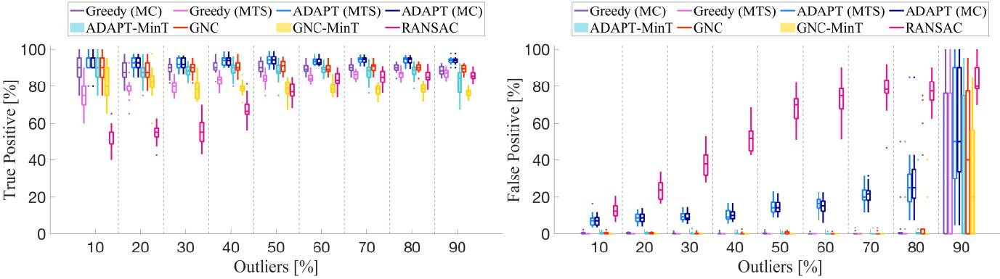

Fig. 12. Mesh Registration. True Positive (left) and False Positive (right) of the proposed algorithms, compared to RANSAC, on the PASCAL+ "aeroplane-2" dataset [\[38\]](#page-20-29). Statistics are computed over 25 Monte Carlo runs and for increasing percentage of outliers.

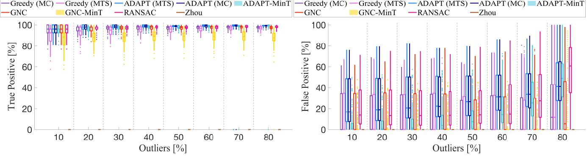

Fig. 13. Shape Alignment. True Positive (left) and False Positive (right) of the proposed algorithms, compared to state-of-the-art techniques, on the FG3DCar dataset [\[39\]](#page-20-30). Statistics are computed over 25 Monte Carlo runs and for increasing percentage of outliers.

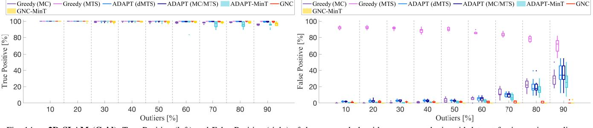

Fig. 14. 2D SLAM (Grid). True Positive (left) and False Positive (right) of the proposed algorithms on a synthetic grid dataset for increasing outliers.

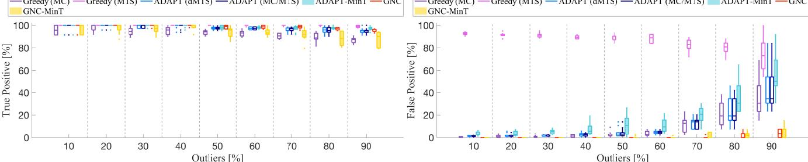

Fig. 15. 2D SLAM (CSAIL). True Positive (left) and False Positive (right) of the proposed algorithms on the CSAIL dataset for increasing outliers.

- [2] M. Fischler and R. Bolles, "Random sample consensus: a paradigm for model fitting with application to image analysis and automated cartography," *Commun. ACM*, vol. 24, pp. 381–395, 1981.
- [3] C. Cadena, L. Carlone, H. Carrillo, Y. Latif, D. Scaramuzza, J. Neira, I. Reid, and J. Leonard, "Past, present, and future of simultaneous localization and mapping: Toward the robust-perception age," *IEEE Trans. Robotics*, vol. 32, no. 6, pp. 1309–1332, 2016, arxiv preprint: 1606.05830, [\(pdf\).](https://arxiv.org/abs/1606.05830)
- [4] H. Yang, J. Shi, and L. Carlone, "TEASER: Fast and Certifiable Point Cloud Registration," *IEEE Trans. Robotics*, vol. 37, no. 2, pp. 314–333, 2020, extended arXiv version 2001.07715 [\(pdf\).](https://arxiv.org/pdf/2001.07715.pdf)
- [5] H. Yang and L. Carlone, "In perfect shape: Certifiably optimal 3D shape reconstruction from 2D landmarks," in *IEEE Conf. on Computer Vision and Pattern Recognition (CVPR)*, 2020, arxiv version: 1911.11924, [\(pdf\).](https://arxiv.org/pdf/1911.11924.pdf)
- [6] S. Choi, Q. Y. Zhou, and V. Koltun, "Robust reconstruction of indoor scenes," in *IEEE Conf. on Computer Vision and Pattern Recognition (CVPR)*, 2015, pp. 5556–5565.
- [7] J. Zhang and S. Singh, "Visual-lidar odometry and mapping: Lowdrift, robust, and fast," in *IEEE Intl. Conf. on Robotics and Automation (ICRA)*. IEEE, 2015, pp. 2174–2181.
- [8] H. Maron, N. Dym, I. Kezurer, S. Kovalsky, and Y. Lipman, "Point

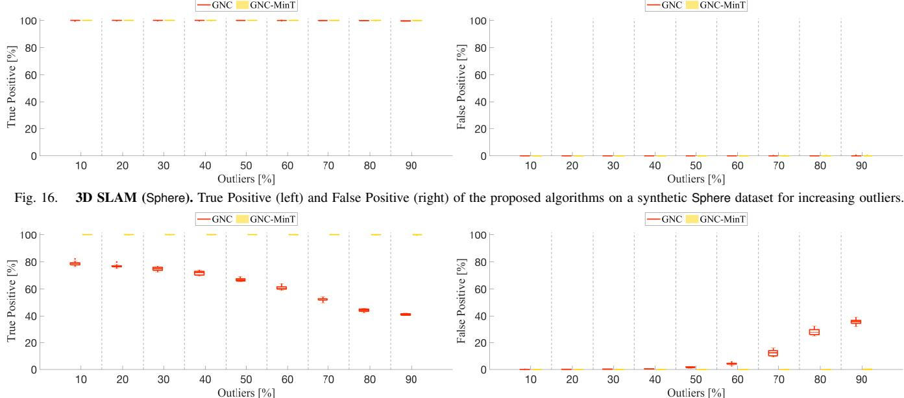

Fig. 17. 3D SLAM (Garage). True Positive (left) and False Positive (right) of the proposed algorithms on the Garage dataset for increasing outliers.registration via efficient convex relaxation,” ACM *Transactions on Graphics (TOG)*, vol. 35, no. 4, pp. 1–12, 2016.- [9] M. Ovsjanikov, M. Ben-Chen, J. Solomon, A. Butscher, and L. Guibas, "Functional maps: a flexible representation of maps between shapes," *ACM Transactions on Graphics (TOG)*, vol. 31, no. 4, pp. 1–11, 2012.
- [10] G. Klein and D. Murray, "Parallel tracking and mapping for small ar workspaces," in *2007 6th IEEE and ACM international symposium on mixed and augmented reality*. IEEE, 2007, pp. 225–234.
- [11] M. A. Audette, F. P. Ferrie, and T. M. Peters, "An algorithmic overview of surface registration techniques for medical imaging," *Med. Image Anal.*, vol. 4, no. 3, pp. 201–217, 2000.
- [12] D. Rosen, L. Carlone, A. Bandeira, and J. Leonard, "SE-Sync: a certifiably correct algorithm for synchronization over the Special Euclidean group," *Intl. J. of Robotics Research*, 2018, accepted, arxiv preprint: 1611.00128, [\(pdf\).](https://arxiv.org/abs/1611.00128)
- [13] D. Lowe, "Object recognition from local scale-invariant features," in *Intl. Conf. on Computer Vision (ICCV)*, 1999, pp. 1150–1157.
- [14] Z. Gojcic, C. Zhou, J. D. Wegner, and A. Wieser, "The perfect match: 3d point cloud matching with smoothed densities," in *Proceedings of the IEEE Conference on Computer Vision and Pattern Recognition*, 2019, pp. 5545–5554.
- [15] T.-J. Chin, Z. Cai, and F. Neumann, "Robust fitting in computer vision: Easy or hard?" in *European Conf. on Computer Vision (ECCV)*, 2018.
- [16] T. J. Chin and D. Suter, "The maximum consensus problem: recent algorithmic advances," *Synthesis Lectures on Computer Vision*, vol. 7, no. 2, pp. 1–194, 2017.
- [17] Á. Parra Bustos and T. J. Chin, "Guaranteed outlier removal for point cloud registration with correspondences," *IEEE Trans. Pattern Anal. Machine Intell.*, vol. 40, no. 12, pp. 2868–2882, 2018.
- [18] P. Huber, *Robust Statistics*. John Wiley & Sons, New York, NY, 1981.
- [19] M. J. Black and A. Rangarajan, "On the unification of line processes, outlier rejection, and robust statistics with applications in early vision," *Intl. J. of Computer Vision*, vol. 19, no. 1, pp. 57–91, 1996.
- [20] R. Kümmerle, G. Grisetti, H. Strasdat, K. Konolige, and W. Burgard, "g2o: A general framework for graph optimization," in *Proc. of the IEEE Int. Conf. on Robotics and Automation (ICRA)*, May 2011.
- [21] N. Sunderhauf and P. Protzel, "Towards a robust back-end for pose graph SLAM," in *IEEE Intl. Conf. on Robotics and Automation (ICRA)*, 2012, pp. 1254–1261.
- [22] S. Shalev-Shwartz, S. Shammah, and A. Shashua, "On a formal model of safe and scalable self-driving cars," *ArXiv*, vol. abs/1708.06374, 2017.
- [23] EASA and Daedalean, *Concepts of Design Assurance for Neural Networks*, 2020, [\(pdf\).](https://arxiv.org/pdf/1909.08605.pdf)
- [24] B. Chen, J. Cao, A. Parra, and T.-J. Chin, "Satellite pose estimation with deep landmark regression and nonlinear pose refinement," in *Proceedings of the IEEE International Conference on Computer Vision Workshops*, 2019.
- [25] V. Tzoumas, P. Antonante, and L. Carlone, "Outlier-robust spatial perception: Hardness, general-purpose algorithms, and guarantees," in *IEEE/RSJ Intl. Conf. on Intelligent Robots and Systems (IROS)*, 2019, extended arxiv version: 1903.11683, [\(pdf\).](https://arxiv.org/pdf/1903.11683.pdf)
- [26] S. Arora and B. Barak, *Computational complexity: A modern approach*. Cambridge University Press, 2009.
- [27] H. Yang, P. Antonante, V. Tzoumas, and L. Carlone, “Graduated non-  
convexity for robust spatial perception: From non-minimal solvers to  
global outlier rejection,” *IEEE Robotics and Automation Letters (RA-L)*,  
vol. 5, no. 2, pp. 1127-1134, 2020, arXiv preprint arXiv:1909.08605  
(with supplemental material), ([pdf](#)).
- [28] J. G. Mangelson, D. Dominic, R. M. Eustice, and R. Vasudevan, "Pairwise consistent measurement set maximization for robust multirobot map merging," in *IEEE Intl. Conf. on Robotics and Automation (ICRA)*, 2018, pp. 2916–2923.
- [29] P. J. Rousseeuw and A. M. Leroy, *Robust Regression and Outlier Detection*. John Wiley & Sons, New York, NY, 1987.
- [30] P. Lajoie, S. Hu, G. Beltrame, and L. Carlone, "Modeling perceptual aliasing in SLAM via discrete-continuous graphical models," *IEEE Robotics and Automation Letters (RA-L)*, 2019, extended ArXiv version: [\(pdf\),](https://arxiv.org/pdf/1810.11692.pdf) Supplemental Material: [\(pdf\).](https://www.dropbox.com/s/vupak65wi75yzbl/2018j-RAL-DCGM-supplemental.pdf?dl=0)
- [31] H. Yang and L. Carlone, "A quaternion-based certifiably optimal solution to the Wahba problem with outliers," in *Intl. Conf. on Computer Vision (ICCV)*, 2019, (Oral Presentation, accept rate: 4%), Arxiv version: 1905.12536, [\(pdf\).](https://arxiv.org/pdf/1905.12536.pdf)
- [32] National Institute of Standards and Technology (NIST), *Table of the Standard Normal Distribution*. [Online]. Available: [https:](https://www.itl.nist.gov/div898/handbook/eda/section3/eda3671.htm) [//www.itl.nist.gov/div898/handbook/eda/section3/eda3671.htm](https://www.itl.nist.gov/div898/handbook/eda/section3/eda3671.htm)
- [33] ——, *Table of the Chi-Square Distribution*. [Online]. Available: <https://www.itl.nist.gov/div898/handbook/eda/section3/eda3674.htm>
- [34] G. Nemhauser, L. Wolsey, and M. Fisher, "An analysis of approximations for maximizing submodular set functions – I," *Mathematical Programming*, vol. 14, no. 1, pp. 265–294, 1978.
- [35] C. Zach, "Robust bundle adjustment revisited," in *European Conf. on Computer Vision (ECCV)*, 2014, pp. 772–787.
- [36] H. Mobahi and J. W. Fisher, "On the link between gaussian homotopy continuation and convex envelopes," in *International Workshop on Energy Minimization Methods in Computer Vision and Pattern Recognition*. Springer, 2015, pp. 43–56.
- [37] M. Abramowitz and I. A. Stegun, *Handbook of mathematical functions with formulas, graphs, and mathematical tables*. US Government printing office, 1948, vol. 55.
- [38] Y. Xiang, R. Mottaghi, and S. Savarese, "Beyond PASCAL: A benchmark for 3d object detection in the wild," in *IEEE Winter Conference on Applications of Computer Vision*. IEEE, 2014, pp. 75–82.
- [39] Y.-L. Lin, V. I. Morariu, W. H. Hsu, and L. S. Davis, "Jointly optimizing 3D model fitting and fine-grained classification," in *European Conf. on Computer Vision (ECCV)*, 2014.
- [40] J. Briales and J. Gonzalez-Jimenez, "Convex Global 3D Registration with Lagrangian Duality," in *IEEE Conf. on Computer Vision and Pattern Recognition (CVPR)*, 2017.
- [41] K. Khoshelham, "Closed-form solutions for estimating a rigid motion from plane correspondences extracted from point clouds," *ISPRS Journal of Photogrammetry and Remote Sensing*, vol. 114, pp. 78 – 91, 2016.
- [42] V. Ramakrishna, T. Kanade, and Y. Sheikh, "Reconstructing 3D human pose from 2D image landmarks," in *European Conf. on Computer Vision (ECCV)*, 2012.
- [43] X. Zhou, M. Zhu, S. Leonardos, and K. Daniilidis, "Sparse representation for 3D shape estimation: A convex relaxation approach," *IEEE Trans. Pattern Anal. Machine Intell.*, vol. 39, no. 8, pp. 1648–1661, 2017.
- [44] L. Carlone, R. Tron, K. Daniilidis, and F. Dellaert, "Initialization techniques for 3D SLAM: a survey on rotation estimation and its use in pose graph optimization," in *IEEE Intl. Conf. on Robotics and Automation (ICRA)*, 2015, pp. 4597–4604, [\(pdf\)](https://www.dropbox.com/s/x0n5r366u33fu7x/2015c-ICRA-initPGO3d.pdf?dl=0) [\(code\)](https://bitbucket.org/gtborg/gtsam) (supplemental material: [\(pdf\)\)](https://www.dropbox.com/s/n9bomq12r76ivbf/2015c-ICRA-3dInit-supplemental.pdf?dl=0).
- [45] L. Carlone, D. Rosen, G. Calafiore, J. Leonard, and F. Dellaert, "Lagrangian duality in 3D SLAM: Verification techniques and optimal solutions," in *IEEE/RSJ Intl. Conf. on Intelligent Robots and Systems (IROS)*, 2015, pp. 125–132, [\(pdf\)](https://arxiv.org/abs/1506.00746) [\(code\)](https://www.bitbucket.org/lucacarlone/pgo3d-duality-opencode) (datasets: [\(web\)\)](https://lucacarlone.mit.edu/datasets/) (supplemental material: [\(pdf\)\)](https://arxiv.org/abs/1506.00746).
- [46] L. Carlone, G. Calafiore, C. Tommolillo, and F. Dellaert, "Planar pose graph optimization: Duality, optimal solutions, and verification," *IEEE Trans. Robotics*, vol. 32, no. 3, pp. 545–565, 2016, [\(pdf\)](https://www.dropbox.com/s/peoktkct0cw42av/2015j-TRO-dualityPGO2D.pdf?dl=0) [\(code\).](https://www.bitbucket.org/lucacarlone/pgo2d-duality-opencode)
- [47] L. Carlone, R. Aragues, J. Castellanos, and B. Bona, "A fast and accurate approximation for planar pose graph optimization," *Intl. J. of Robotics Research*, vol. 33, no. 7, pp. 965–987, 2014, [\(pdf\)](https://www.dropbox.com/s/z1ol1o17zye5qxz/2014j-IJRR-LAGO.pdf?dl=0) [\(ppt\)](https://www.dropbox.com/s/bojshzsd4q8m6at/2011-RSS-presentation.pdf?dl=0) [\(code\)](https://bitbucket.org/gtborg/gtsam) [\(video\)](https://lucacarlone.mit.edu/media/) (datasets: [\(web\)\)](https://lucacarlone.mit.edu/datasets/).
- [48] P. Meer, D. Mintz, A. Rosenfeld, and D. Y. Kim, "Robust regression methods for computer vision: A review," *Intl. J. of Computer Vision*, vol. 6, no. 1, pp. 59–70, Apr 1991.
- [49] C. Stewart, "Robust parameter estimation in computer vision," *SIAM Review*, vol. 41, no. 3, pp. 513–537, 1999. [Online]. Available: <https://doi.org/10.1137/S0036144598345802>
- [50] M. Bosse, G. Agamennoni, and I. Gilitschenski, "Robust estimation and applications in robotics," *Foundations and Trends in Robotics*, vol. 4, no. 4, pp. 225–269, 2016.
- [51] D. Barath, J. Noskova, M. Ivashechkin, and J. Matas, "Magsac++, a fast, reliable and accurate robust estimator," in *IEEE Conf. on Computer Vision and Pattern Recognition (CVPR)*, 2020, pp. 1304–1312.
- [52] J. L. Schonberger and J.-M. Frahm, "Structure-from-motion revisited," in *IEEE Conf. on Computer Vision and Pattern Recognition (CVPR)*, 2016, pp. 4104–4113.
- [53] A. Chatterjee and V. M. Govindu, "Efficient and robust large-scale rotation averaging," in *Intl. Conf. on Computer Vision (ICCV)*, 2013, pp. 521–528.
- [54] Q. Zhou, J. Park, and V. Koltun, "Fast global registration," in *European Conf. on Computer Vision (ECCV)*. Springer, 2016, pp. 766–782.
- [55] J. T. Barron, "A general and adaptive robust loss function," in *Proceedings of the IEEE Conference on Computer Vision and Pattern Recognition*, 2019, pp. 4331–4339.
- [56] N. Chebrolu, T. Läbe, O. Vysotska, J. Behley, and C. Stachniss, "Adaptive robust kernels for non-linear least squares problems," *arXiv preprint arXiv:2004.14938*, 2020.
- [57] J. Bazin, Y. Seo, R. Hartley, and M. Pollefeys, "Globally optimal inlier set maximization with unknown rotation and focal length," in *European Conf. on Computer Vision (ECCV)*, 2014, pp. 803–817.
- [58] R. Hartley and F. Kahl, "Global optimization through rotation space search," *Intl. J. of Computer Vision*, vol. 82, no. 1, pp. 64–79, 2009.
- [59] Y. Zheng, S. Sugimoto, and M. Okutomi, "Deterministically maximizing feasible subsystem for robust model fitting with unit norm constraint," in *IEEE Conf. on Computer Vision and Pattern Recognition (CVPR)*, 2011, pp. 1825–1832.
- [60] H. Li, "Consensus set maximization with guaranteed global optimality for robust geometry estimation," in *Intl. Conf. on Computer Vision (ICCV)*, 2009, pp. 1074–1080.
- [61] P. Speciale, D. P. Paudel, M. R. Oswald, T. Kroeger, L. V. Gool, and M. Pollefeys, "Consensus maximization with linear matrix inequality constraints," in *IEEE Conf. on Computer Vision and Pattern Recognition (CVPR)*, July 2017, pp. 5048–5056.
- [62] T. Chin, Y. H. Kee, A. Eriksson, and F. Neumann, "Guaranteed outlier removal with mixed integer linear programs," in *IEEE Conf. on Computer Vision and Pattern Recognition (CVPR)*, June 2016, pp. 5858–5866.
- [63] G. Izatt, H. Dai, and R. Tedrake, "Globally optimal object pose estimation in point clouds with mixed-integer programming," in *Proc. of the Intl. Symp. of Robotics Research (ISRR)*, 2017.
- [64] J. Yang, H. Li, and Y. Jia, "Optimal essential matrix estimation via inlier-set maximization," in *European Conf. on Computer Vision (ECCV)*. Springer, 2014, pp. 111–126.
- [65] J. Yang, H. Li, D. Campbell, and Y. Jia, "Go-ICP: A globally optimal solution to 3D ICP point-set registration," *IEEE Trans. Pattern Anal. Machine Intell.*, vol. 38, no. 11, pp. 2241–2254, Nov. 2016.
- [66] O. Enqvist, E. Ask, F. Kahl, and K. Åström, "Robust fitting for multiple view geometry," in *European Conf. on Computer Vision (ECCV)*. Springer, 2012, pp. 738–751.
- [67] C. Olsson, O. Enqvist, and F. Kahl, "A polynomial-time bound for matching and registration with outliers," in *IEEE Conf. on Computer Vision and Pattern Recognition (CVPR)*. IEEE, 2008, pp. 1–8.
- [68] H. Yang and L. Carlone, "One ring to rule them all: Certifiably robust geometric perception with outliers," in *Conference on Neural Information Processing Systems (NeurIPS)*, 2020, [\(pdf\).](https://arxiv.org/pdf/2006.06769.pdf)
- [69] L. Carlone and G. Calafiore, "Convex relaxations for pose graph optimization with outliers," *IEEE Robotics and Automation Letters (RA-L)*, vol. 3, no. 2, pp. 1160–1167, 2018, arxiv preprint: 1801.02112, [\(pdf\).](https://arxiv.org/pdf/1801.02112.pdf)
- [70] H. Yang and L. Carlone, "A polynomial-time solution for robust registration with extreme outlier rates," in *Robotics: Science and Systems (RSS)*, 2019, [\(pdf\),](http://rss2019.informatik.uni-freiburg.de/papers/0013_FI.pdf) [\(video\),](http://rss2019.informatik.uni-freiburg.de/videos/0013_VI_fi.mp4) [\(media\),](http://news.mit.edu/2019/spotting-objects-cars-robots-0620) [\(media\),](https://www.sciencedaily.com/releases/2019/06/190620121444.htm) [\(media\).](http://www.ansa.it/canale_scienza_tecnica/notizie/tecnologie/2019/06/21/i-robot-imparano-a-vedere-nella-nebbia-_9e59485c-ff17-4d62-8224-1d42f44111b9.html)
- [71] A. Parra Bustos, T.-J. Chin, F. Neumann, T. Friedrich, and M. Katzmann, "A practical maximum clique algorithm for matching with pairwise constraints," *arXiv preprint arXiv:1902.01534*, 2019.
- [72] P. J. Besl and N. D. McKay, "A method for registration of 3-D shapes," *IEEE Trans. Pattern Anal. Machine Intell.*, vol. 14, no. 2, 1992.
- [73] R. Rusu, N. Blodow, and M. Beetz, "Fast point feature histograms (fpfh) for 3d registration," in *IEEE Intl. Conf. on Robotics and Automation (ICRA)*. Citeseer, 2009, pp. 3212–3217.
- [74] C. Choy, J. Park, and V. Koltun, "Fully convolutional geometric features," in *Intl. Conf. on Computer Vision (ICCV)*, 2019, pp. 8958– 8966.
- [75] C. S. Chen, Y. P. Hung, and J. B. Cheng, "RANSAC-based DARCES: A new approach to fast automatic registration of partially overlapping range images," *IEEE Trans. Pattern Anal. Machine Intell.*, vol. 21, no. 11, pp. 1229–1234, 1999.
- [76] K. Arun, T. Huang, and S. Blostein, "Least-squares fitting of two 3-D point sets," *IEEE Trans. Pattern Anal. Machine Intell.*, vol. 9, no. 5, pp. 698–700, sept. 1987.
- [77] B. K. P. Horn, "Closed-form solution of absolute orientation using unit quaternions," *J. Opt. Soc. Amer.*, vol. 4, no. 4, pp. 629–642, Apr 1987.
- [78] J. C. Bazin, Y. Seo, and M. Pollefeys, "Globally optimal consensus set maximization through rotation search," in *Asian Conference on Computer Vision*. Springer, 2012, pp. 539–551.
- [79] X. Zhou, M. Zhu, G. Pavlakos, S. Leonardos, K. G. Derpanis, and K. Daniilidis, "Monocap: Monocular human motion capture using a cnn coupled with a geometric prior," *IEEE Trans. Pattern Anal. Machine Intell.*, vol. 41, no. 4, pp. 901–914, 2018.
- [80] L. Kneip, H. Li, and Y. Seo, "UPnP: An optimal o(n) solution to the absolute pose problem with universal applicability," in *European Conf. on Computer Vision (ECCV)*. Springer, 2014, pp. 127–142.
- [81] X.-S. Gao, X.-R. Hou, J. Tang, and H.-F. Cheng, "Complete solution classification for the perspective-three-point problem," *IEEE Trans. Pattern Anal. Machine Intell.*, vol. 25, no. 8, pp. 930–943, 2003.
- [82] L. Ferraz, X. Binefa, and F. Moreno-Noguer, "Very fast solution to the pnp problem with algebraic outlier rejection," in *IEEE Conf. on Computer Vision and Pattern Recognition (CVPR)*, 2014, pp. 501–508.
- [83] E. Olson and P. Agarwal, "Inference on networks of mixtures for robust robot mapping," in *Robotics: Science and Systems (RSS)*, July 2012.
- [84] N. Sünderhauf and P. Protzel, "Switchable constraints for robust pose graph SLAM," in *IEEE/RSJ Intl. Conf. on Intelligent Robots and Systems (IROS)*, 2012.
- [85] C. H. Tong and T. D. Barfoot, "Batch heterogeneous outlier rejection for feature-poor slam," in *IEEE Intl. Conf. on Robotics and Automation (ICRA)*, 2011, pp. 2630–2637.
- [86] ——, "Evaluation of heterogeneous measurement outlier rejection schemes for robotic planetary surface mapping," *Acta Astronautica*, vol. 88, pp. 146–162, 2013.
- [87] Y. Latif, C. D. C. Lerma, and J. Neira, "Robust loop closing over time." in *Robotics: Science and Systems (RSS)*, 2012.
- [88] G. Lee, F. Fraundorfer, and M. Pollefeys, "Robust pose-graph loopclosures with expectation-maximization," in *IEEE/RSJ Intl. Conf. on Intelligent Robots and Systems (IROS)*, 2013.
- [89] L. Wang and A. Singer, "Exact and stable recovery of rotations for robust synchronization," *Information and Inference: A Journal of the IMA*, vol. 30, 2013.
- [90] F. Arrigoni, B. Rossi, P. Fragneto, and A. Fusiello, "Robust synchronization in SO(3) and SE(3) via low-rank and sparse matrix decomposition," *Comput. Vis. Image Underst.*, 2018.
- [91] P. J. Huber, "Robust estimation of a location parameter," *The Annals of Mathematical Statistics*, vol. 35, no. 1, pp. 73–101, 1964.
- [92] R. E. Kalman, "A new approach to linear filtering and prediction problems," *Trans. ASME, Journal of Basic Engineering*, vol. 82, pp. 35–45, 1960.
- [93] I. Diakonikolas, G. Kamath, D. Kane, J. Li, A. Moitra, and A. Stewart, "Robust estimators in high dimensions without the computational intractability," in *IEEE 57th Annual Symposium on Foundations of Computer Science*. IEEE, 2016, pp. 655–664.
- [94] E. J. Candes and T. Tao, "Decoding by linear programming," *IEEE Trans. on Information Theory*, vol. 51, no. 12, pp. 4203–4215, 2005.
- [95] F. Pasqualetti, F. Dörfler, and F. Bullo, "Attack detection and identification in cyber-physical systems," *IEEE Transactions on Automatic Control*, vol. 58, no. 11, pp. 2715–2729, 2013.
- [96] L. Liu, T. Li, and C. Caramanis, "High dimensional robust estimation of sparse models via trimmed hard thresholding," *arXiv preprint: 1901.08237*, 2019.
- [97] P. Rousseeuw and M. Hubert, "Robust statistics for outlier detection," *Wiley Interdisciplinary Reviews: Data Mining and Knowledge Discovery*, vol. 1, no. 1, pp. 73–79, 2011.
- [98] T. Zhang, "Adaptive forward-backward greedy algorithm for learning sparse representations," *IEEE Trans. on Information Theory*, vol. 57, no. 7, pp. 4689–4708, 2011.
- [99] J. Liu, P. C. Cosman, and B. D. Rao, "Robust linear regression via `0 regularization," *IEEE Transactions on Signal Processing*, vol. 66, no. 3, pp. 698–713, 2018.
- [100] S. Mishra, Y. Shoukry, N. Karamchandani, S. Diggavi, and P. Tabuada, "Secure state estimation against sensor attacks in the presence of noise," *IEEE Trans. on Control of Network Systems*, vol. 4, no. 1, pp. 49–59, 2017.
- [101] E. Aghapour, F. Rahman, and J. Farrell, "Outlier accommodation by risk-averse performance-specified linear state estimation," in *2018 IEEE Conference on Decision and Control*. IEEE, 2018, pp. 2310– 2315.
- [102] S. Boyd and L. Vandenberghe, *Convex optimization*. Cambridge University Press, 2004.
- [103] W. Weibull, "A statistical distribution function of wide applicability," *applmech*, vol. 18, pp. 293–297, 1951.
- [104] D. Foster, H. Karloff, and J. Thaler, "Variable selection is hard," in *Conference on Learning Theory (COLT)*, 2015, pp. 696–709.
- [105] B. W. Bolch, "The teacher's corner: More on unbiased estimation of the standard deviation," *The American Statistician*, vol. 22, no. 3, pp. 27–27, 1968.

Pasquale Antonante is a Ph.D. candidate in the Department of Aeronautics and Astronautics and the Laboratory for Information and Decision Systems (LIDS) at the Massachusetts Institute of Technology, where he is working with Prof. Luca Carlone at the SPARK Lab. He has obtained a B.Sc. degree in Computer Engineering from the University of Pisa, Italy, in 2014; and a S.M. degree (with honors) in Embedded Computing Systems from the Scuola Superiore Sant'Anna of Pisa, Italy, in 2017. Prior to MIT, he was a research scientist at the United

Technologies Research Center in Cork (Ireland). His interests include safe and trustworthy perception with applications to single and multi-robot autonomous systems. Pasquale Antonante is the recipient of the MathWorks Engineering Fellowship, the Best Paper Award in Robot Vision at the 2020 IEEE International Conference on Robotics and Automation (ICRA) and a Honorable Mention from the 2020 IEEE Robotics and Automation Letters (RA-L).

Vasileios Tzoumas received his Ph.D. in Electrical and Systems Engineering at the University of Pennsylvania (2018). He holds a Master of Arts in Statistics from the Wharton School of Business at the University of Pennsylvania (2016); a Master of Science in Electrical Engineering from the University of Pennsylvania (2016); and a diploma in Electrical and Computer Engineering from the National Technical University of Athens (2012). Vasileios is as an Assistant Professor in the Department of Aerospace Engineering, University of

Michigan, Ann Arbor. Previously, he was at the Massachusetts Institute of Technology (MIT), in the Department of Aeronautics and Astronautics, and in the Laboratory for Information and Decision Systems (LIDS), were he was a research scientist (2019-2020), and a post-doctoral associate (2018-2019). Vasileios works on control, learning, and perception, as well as combinatorial and distributed optimization, with applications to robotics, cyber-physical systems, and self-reconfigurable aerospace systems. He cares for trustworthy collaborative autonomy. His work includes foundational results on robust and adaptive combinatorial optimization, with applications to multi-robot information gathering for resiliency against robot failures and adversarial removals. Vasileios is a recipient of the Best Paper Award in Robot Vision at the 2020 IEEE International Conference on Robotics and Automation (ICRA), of an Honorable Mention from the 2020 IEEE Robotics and Automation Letters (RA-L), and was a Best Student Paper Award finalist at the 2017 IEEE Conference in Decision and Control (CDC).

Heng Yang is a Ph.D. candidate in the Department of Mechanical Engineering and the Laboratory for Information & Decision Systems (LIDS) at the Massachusetts Institute of Technology (MIT), where he is working with Prof. Luca Carlone at the SPARK Lab. He has obtained a B.Sc. degree in Mechanical Engineering (with honors) from the Tsinghua University, Beijing, China, in 2015; and an S.M. degree in Mechanical Engineering from MIT in 2017. His research interests include convex optimization, semidefinite and moment/sums-of-squares

relaxation, robust estimation and machine learning, applied to robot perception and computer vision. His work includes developing certifiable outlier-robust machine perception algorithms, large-scale semidefinite programming solvers, and self-supervised geometric perception frameworks. Heng Yang is a recipient of the Best Paper Award in Robot Vision at the 2020 IEEE International Conference on Robotics and Automation (ICRA), and a Best Paper Award Honorable Mention from the 2020 IEEE Robotics and Automation Letters (RA-L). He is a Class of 2021 Robotics: Science and Systems (RSS) Pioneer.

Luca Carlone is the Leonardo Career Development Assistant Professor in the Department of Aeronautics and Astronautics at the Massachusetts Institute of Technology, and a Principal Investigator in the Laboratory for Information & Decision Systems (LIDS). He joined LIDS as a postdoctoral associate (2015) and later as a Research Scientist (2016), after spending two years as a postdoctoral fellow at the Georgia Institute of Technology (2013-2015). He has obtained a B.S. degree in mechatronics from the Polytechnic University of Turin, Italy (2006);

an S.M. degree in mechatronics from the Polytechnic University of Turin, Italy (2008); an S.M. degree in automation engineering from the Polytechnic University of Milan, Italy (2008); and a Ph.D. degree in robotics from the Polytechnic University of Turin (2012). His research interests include nonlinear estimation, numerical and distributed optimization, and probabilistic inference, applied to sensing, perception, and decision-making in single and multi-robot systems. He is a recipient of the Best Paper Award in Robot Vision at ICRA 2020, a 2020 Honorable Mention from the IEEE Robotics and Automation Letters, a Track Best Paper award at the 2021 IEEE Aerospace Conference, the 2017 Transactions on Robotics King-Sun Fu Memorial Best Paper Award, the Best Paper Award at WAFR 2016, the Best Student Paper Award at the 2018 Symposium on VLSI Circuits, and he was best paper finalist at RSS 2015. He is also a recipient of the NSF CAREER Award (2021), the RSS Early Career Award (2020), the Google Daydream (2019) and the Amazon Research Award (2020), and the MIT AeroAstro Vickie Kerrebrock Faculty Award (2020).