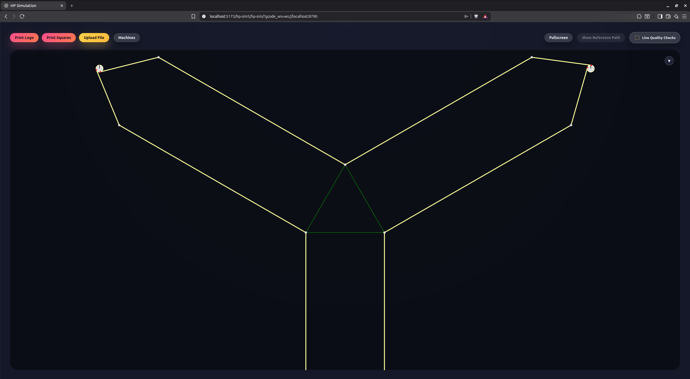
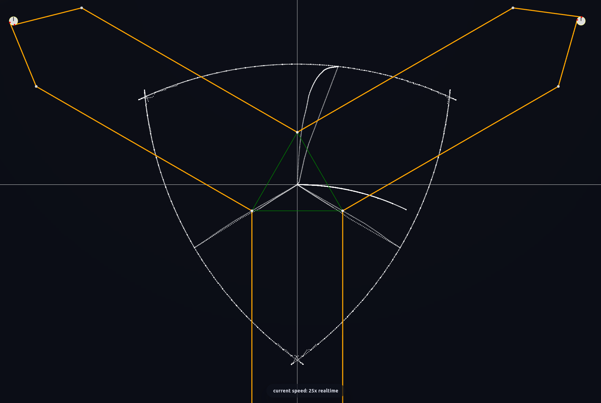

# Autocal

This directory contains the fully automated elliptical feature calibration pipeline. The default workflow uses active learning plus pointwise robust fitting.

## Quick start (simulation)

Follow the hp-sim5 README.md to get an instance of hp-sim available at <http://localhost:5173/hp-sim5/hp-sim>.

The autocal requires a websocket between it and hp-sim5. Open it by adding `?gcode_ws=ws://localhost:8790` to your url, so open
<http://localhost:5173/hp-sim5/hp-sim/?gcode_ws=ws://localhost:8790>.

If you see this, you're good to go:


Initiate simulated data collection and semi-automatic (human-in-the-loop) calibration with:

```bash
python autocal/active_calibrate.py \
  --sim \
  --machine-type slideprinter \
  --collector-args --speedup 25
```

Replace `slideprinter` with your actual type of machine (one of `slideprinter`,`hangprinter_4`,`hangprinter_5`,`cubecorners`, or `skycam`).
Keep the hp-sim web page visible during the whole procedure, otherwise your browser might pause the simulation and break the autocalibration.

If everything went well you should see something like this:


You can add `--plot-residual-histogram` to learn about the quality of your data.
It writes `autocal/data/default_dataset.csv` and `autocal/data/default_dataset.png`.

## Typical workflow (real machine)

- Remove `--sim` and any `--speedup` args.
- Use `--dataset` to choose where the working dataset is stored, or to continue working on a pre-existing dataset.
- Let the loop collect sweeps and stop when you are satisfied with the cost and residuals.

```bash
python autocal/active_calibrate.py \
  --machine-type slideprinter \
  --dataset autocal/data/my_active.json
```

For the full details and log interpretation, see `autocal/README_elliptical_feature_calibration.md`.
