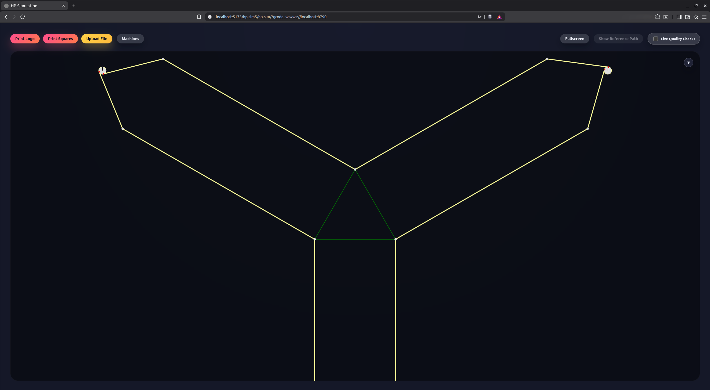
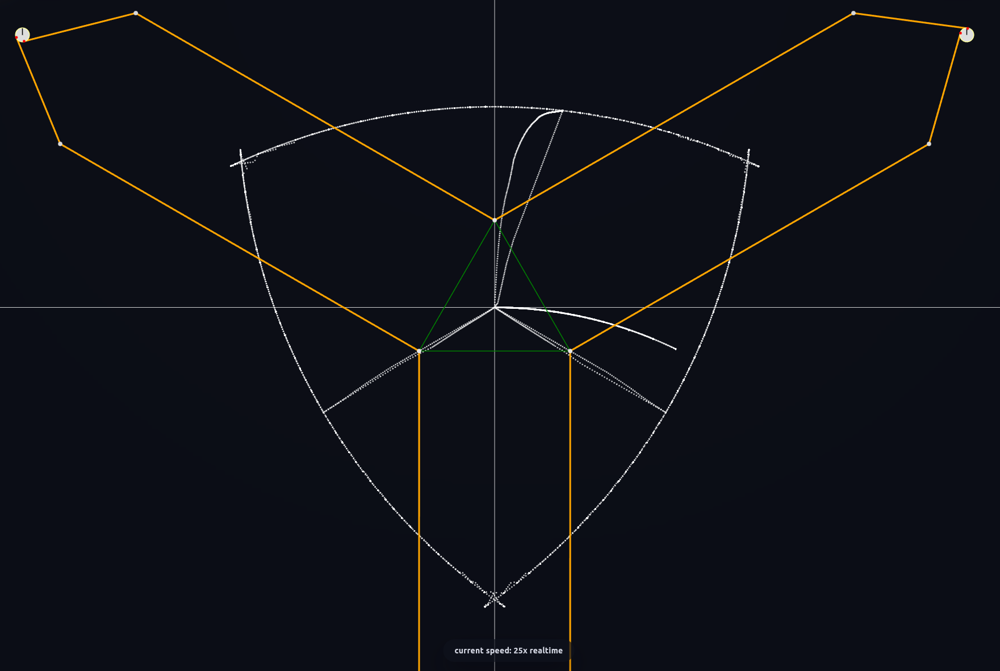

# Autocal


Autocal collects circular sweeps and fits anchor positions from their ellipse geometry.
It chooses new sweeps by information gain. It can also fit spool radii and buildup.
At final acceptance, it checks saved estimates against sweeps collected after their fit.

## Python dependencies

The root `requirements.txt` covers the Python dependencies in `autocal/`.

JAX is optional. The default `--optimizer-mode fast` uses it on the CPU.
Autocal falls back to numerical gradients when JAX is unavailable.
Use `--optimizer-mode legacy` to disable the JAX objective.

JAX saves compiled CPU objectives in `output/autocal-jax-cache`.
Later launches with matching solver settings and data shapes can reuse them.
The first run still compiles; caching does not change calibration or stopping.
Set `JAX_COMPILATION_CACHE_DIR` to choose another directory, or
`JAX_ENABLE_COMPILATION_CACHE=false` to disable it. Cache files can be deleted.

From the root of the hp-sim5 repo, run:

```bash
.venv/bin/python -m pip install -r autocal/requirements-jax-cpu.txt
```

Check the installed JAX version:

```bash
.venv/bin/python - <<'PYCODE'
import jax
print(jax.__version__)
PYCODE
```


## Quick start (simulation)

For autonomous headless HP3/HP4/RRF research, use
[`hp-sim5-research-agent`](../research/README.md) and its `start_collection` MCP
operation. Poll the returned job with `collection_status`.
The launcher supervises firmware and a continuing physics world.
Collection defaults to the production JavaScript engine in headless Node.
Collector waits advance simulation time. `--doctor` checks collection and
autocal measurement ingestion. See the [native collection guide](../research/native-collection.md)
for encoder references, force settings and calibration limits.

Follow the root README to start Vite. For a Slideprinter, open
<http://localhost:5173/hp-sim5/hp-sim/>. For a 3D machine, use
<http://localhost:5173/hp-sim5/hp-sim-3d/>.

Browser simulation requires a WebSocket connection to the open simulator. Add
`?gcode_ws=ws://localhost:8790` to the selected simulator URL; for example:
<http://localhost:5173/hp-sim5/hp-sim/?gcode_ws=ws://localhost:8790>.

If you see this, you're good to go:


Initiate simulated full-auto calibration with:

```bash
.venv/bin/python autocal/autocal.py \
  --sim \
  --machine-type slideprinter \
  --speedup 25
```

`--speedup` is forwarded to the collector.
Use `--collector-args` for other raw collector flags.

Replace `slideprinter` with your machine type: `slideprinter`, `hangprinter_4`,
`hangprinter_5`, `cubecorners`, or `skycam`. The aliases `hp3`, `hp4`, and
`hangprinter_3` currently normalize to `hangprinter_4`.
Keep the hp-sim page visible during calibration.
The browser may pause the simulation when the page is hidden.

If everything went well you should see something like this:


The default working dataset is `autocal/data/default_dataset.json`.
Missing datasets are bootstrapped. Existing datasets with more than three sweeps
are replayed from their first three sweeps in a temporary file.
After replay, the loop can collect new sweeps into the original dataset.

To fit stored data without starting firmware or collecting new sweeps, use an
existing dataset:

```bash
.venv/bin/python autocal/autocal.py \
  --sim --no-collect \
  --machine-type slideprinter \
  --dataset autocal/data/default_dataset.json
```

Patience or a stop threshold can end replay before all stored sweeps are used.
`--no-collect` does not prevent bootstrap if the dataset is missing.

To inspect residuals from the default anchor-only fit, add:

```bash
--residuals-csv autocal/data/default_dataset.residuals.csv
```

Then render a histogram with:

```bash
.venv/bin/python autocal/plot_residual_hist.py \
  autocal/data/default_dataset.residuals.csv \
  --output autocal/data/default_dataset.residuals.png
```

The default spool-fit schedule currently skips residual CSV and report output.
See [the detailed guide](README_elliptical_feature_calibration.md#residuals-and-logs)
for this limitation.

Here's a demo of the autocal loop on a simulated Slideprinter: https://youtu.be/XLmpuAQYbG4


## Typical workflow (real machine)

Remove `--sim` and `--speedup` to use a real machine:

```bash
.venv/bin/python autocal/autocal.py \
  --machine-type slideprinter
```

The loop stops after three non-improving iterations by default.
Ctrl-C during the loop requests best-so-far acceptance.
Final selection favors successful held-out predictions when available.
These scores measure fit and prediction quality. They do not prove anchor accuracy.

Collection checks the latest 1.5 seconds of encoder readings for quiet settling,
with a range limit scaled to the longer 5-second vibration window's drift allowance.
It retains that longer history for the existing vibration check. This reduces
waiting after transients while keeping point counts and automatic stopping.

On acceptance, RRF receives M669 for the selected anchors.
Fitted M666 spool settings are printed but are not sent automatically.
Klipper skips the M669 send.
Reaching `--max-steps` ends the loop without applying calibration.

Useful options:

- `--dataset` chooses the working dataset.
- `--firmware klipper` selects the Klipper API-mode backend. RRF is the default.
- `--solve-optimizer` accepts `lbfgsb` (default), `lm`, or `trf`.
- `--find-radii` and `--find-buildup-factor` enable spool fitting.
  Each accepts `global` or `per-anchor`. Both default to `off`.
- `--sparse-recovery` adds a sparse seed fit during underconstrained recovery.
- `--shotgun` adds solver variants from `shotgun.conf`.


For full details and log interpretation, see
[`README_elliptical_feature_calibration.md`](README_elliptical_feature_calibration.md).
The [algorithm overview](optimization_algorithm_overview) describes the loops.
The [objective overview](objective_functions_overview) explains optimization,
patience, prediction ranking, and displayed quality.
