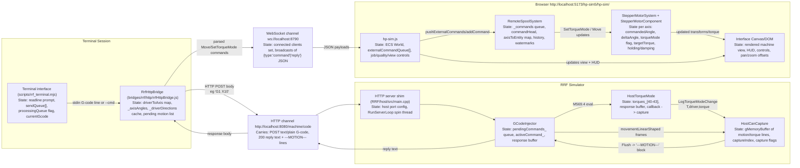

```mermaid
graph LR
    subgraph Terminal Session
        term["Terminal interface (scripts/rrf_terminal.mjs)
State: readline prompt, sendQueue[], processingQueue flag, currentGcode"]
        bridge["RrfHttpBridge (bridges/rrf/http/rrfHttpBridge.js)
State: driverToAxis map, _axisAngles, _driverDirections cache, pending motion list"]
    end
    httpChan["HTTP channel http://localhost:8080/machine/code
Carries: POST text/plain G-code, 200 reply text + ---MOTION--- lines"]
    subgraph RRF Simulator
        httpSrv["HTTP server shim (RRF/host/src/main.cpp)
State: host port config, RunServerLoop spin thread"]
        injector["GCodeInjector
State: pendingCommands_ queue, activeCommand_, response buffer"]
        capture["HostCanCapture
State: gMemoryBuffer of motion/torque lines, captureIndex, capture flags"]
        torque["HostTorqueMode
State: torques_[40-43], response buffer, callback -> capture"]
    end
    wsChan["WebSocket channel ws://localhost:8790
State: connected clients set, broadcasts of {type:'command'|'reply'} JSON"]
    subgraph Browser http://localhost:5173/hp-sim5/hp-sim/
        hpsim["hp-sim.js
State: ECS World, externalCommandQueue[], job/quality/view controls"]
        remote["RemoteSpoolSystem
State: _commands queue, commandHead, axisToEntity map, history, watermarks"]
        stepper["StepperMotorSystem + StepperMotorComponent
State per axis: commandedAngle, deltaAngle, torqueMode flag, targetTorque, holding/damping"]
        ui["Interface Canvas/DOM
State: rendered machine view, HUD, controls, pan/zoom offsets"]
    end

    term -->|stdin G-code line or --cmd| bridge
    bridge -->|HTTP POST body
eg 'G1 X10'| httpChan
    httpChan --> httpSrv --> injector
    injector -->|M569.4 eval| torque -->|LogTorqueModeChange
T,driver,torque| capture
    injector -->|movementLinearShaped frames| capture
    capture -->|Flush -> '---MOTION---' block| injector -->|reply text| httpChan -->|response body| bridge
    bridge -->|parsed Move/SetTorqueMode commands| wsChan -->|JSON payloads| hpsim
    hpsim -->|pushExternalCommands/addCommand| remote -->|SetTorqueMode / Move updates| stepper -->|updated transforms/torque| ui
    hpsim -->|updates view + HUD| ui
```
